# Bài tập — Bài 7 — Chuyển động của điện tích trong điện trường đều

> Hệ bài tập được biên soạn theo các dạng xuất hiện trong bộ tài liệu Vật lí 11 của dự án. Câu hỏi được giữ ngắn, trực tiếp; độ khó tăng dần và không cố tình thêm dữ kiện gây nhiễu.

[← Trở lại bài học](../../07-charged-particle-motion.md)

## Phần A — Trắc nghiệm 4 lựa chọn

### Câu 1 — Mức 1 — Nhận biết

Hạt mang điện q trong điện trường đều chịu gia tốc có độ lớn

A. $a=|q|E/m$.  
B. $a=mE/|q|$.  
C. $a=|q|/(mE)$.  
D. $a=E$.

### Câu 2 — Mức 1 — Nhận biết

Electron đặt trong điện trường đều có gia tốc

A. cùng chiều $\vec E$.  
B. ngược chiều $\vec E$.  
C. vuông góc $\vec E$.  
D. bằng 0.

### Câu 3 — Mức 1 — Nhận biết

Một proton và một electron cùng đặt trong cùng điện trường đều. Bỏ qua trọng lực. Độ lớn lực điện trên chúng

A. bằng nhau.  
B. lực proton lớn hơn rất nhiều.  
C. lực electron lớn hơn rất nhiều.  
D. đều bằng 0.

### Câu 4 — Mức 1 — Nhận biết

Điện tích dương bay vào điện trường đều với vận tốc ban đầu vuông góc $\vec E$. Quỹ đạo trong miền điện trường đều lý tưởng có dạng

A. đường thẳng.  
B. đường tròn.  
C. parabol.  
D. elip.

## Phần B — Đúng/Sai

### Câu 5 — Mức 2 — Thông hiểu

Chuyển động hạt mang điện trong điện trường đều:

a) Lực điện không đổi nếu E không đổi.  
b) Gia tốc không đổi nếu q, m không đổi.  
c) Hạt bay song song E luôn chuyển động đều.  
d) Nếu vận tốc đầu vuông góc E, một thành phần chuyển động là đều và thành phần kia biến đổi đều.

### Câu 6 — Mức 2 — Thông hiểu

Một electron được tăng tốc từ nghỉ qua hiệu điện thế U:

a) Độ tăng động năng có độ lớn $eU$.  
b) Tốc độ có thể tìm từ $\frac12mv^2=eU$ nếu phi tương đối tính.  
c) Tăng U gấp 4 lần thì v tăng 4 lần trong mô hình cổ điển.  
d) Tăng U gấp 4 lần thì v tăng 2 lần trong mô hình cổ điển.

## Phần C — Trả lời ngắn

### Câu 7 — Mức 3 — Vận dụng

Hạt có $q=2\,\mu$C, $m=4\cdot10^{-6}$ kg trong điện trường $E=3000$ V/m. Tính gia tốc.

### Câu 8 — Mức 3 — Vận dụng

Electron được tăng tốc từ nghỉ qua hiệu điện thế $100$ V. Lấy $e=1,6\cdot10^{-19}$ C, $m_e=9,1\cdot10^{-31}$ kg. Tính tốc độ theo cơ học cổ điển.

### Câu 9 — Mức 3 — Vận dụng

Điện tích dương đi vào điện trường đều $E=2\cdot10^4$ V/m với vận tốc đầu $v_0=10^5$ m/s vuông góc E. Biết $q/m=10^7$ C/kg, chiều dài vùng điện trường theo phương v0 là $5$ cm. Tính thời gian ở trong trường.

## Phần D — Vận dụng và vận dụng cao

### Câu 10 — Mức 4 — Vận dụng cao

Tiếp câu trên, tính độ lệch theo phương điện trường khi hạt ra khỏi vùng điện trường và vận tốc theo phương E lúc đó.

---

[Đáp án và lời giải →](solutions.md)

## Ngân hàng bài tập PDF mở rộng

> Nội dung câu hỏi và dữ kiện trong phần này được giữ nguyên; hệ thống chỉ chuẩn hóa xuống dòng và mã kí tự để hiển thị trên web. Câu trùng được loại bỏ. Với câu có công thức/kí hiệu bị sai khi trích xuất chữ từ PDF, đề bài được giữ dưới dạng ảnh để không làm thay đổi dữ kiện.

### Nhận biết — Trả lời ngắn

#### Bài PDF 1

<!-- source-id: BT-Chuong-III-p77-q2-200 -->

Câu 2. Một vật có khối lượng 5mg được tích điện 20µC chuyển động không vận tốc đầu dọc theo
phương của đường sức điện trong một điện trường đều với cường độ
. Vận tốc của vật
sau 0,5 s sau khi chuyển động được 0,5s bằng bao nhiêu m/s?

#### Bài PDF 2

<!-- source-id: BT-Chuong-III-p80-q7-205 -->

Câu 7. Hai bản kim loại có kích thước lớn và bằng nhau, đặt song song với nhau, cách nhau một khoảng
 như hình vẽ. Hiệu điện thế giữa hai bản phẳng là 48 V. Một electron
(
 ) bay vào chính giữa hai bản phẳng theo phương vuông góc với các
đường sức điện với vận tốc ban đầu là
. Bỏ qua điện trường của Trái Đất, lực cản môi trường, trọng lực
tác dụng lên electron. Thời gian để electron chạm bản dương là bao nhiêu nano giây ? Coi hai bản đủ dài.
Kết quả làm tròn đến hàng phần mười.

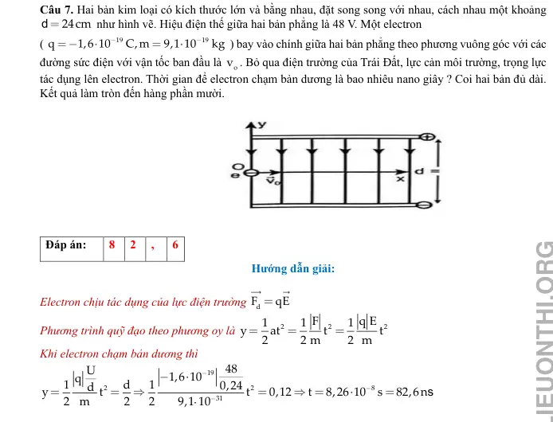{ loading=lazy }

#### Bài PDF 3

<!-- source-id: BT-Chuong-III-p80-q8-206 -->

Câu 8. Hai bản kim loại có kích thước lớn và bằng nhau, đặt song song với nhau, cách nhau một khoảng
 như hình vẽ. Hiệu điện thế giữa hai bản phẳng là 48 V. Một electron
(
 ) bay vào chính giữa hai bản phẳng theo phương vuông góc với các
đường sức điện với vận tốc 200 m/s. Bỏ qua điện trường của Trái Đất, lực cản môi trường, trọng lực tác
dụng lên electron. Tìm tầm xa theo phương ox là bao nhiêu µicro met? Kết quả làm tròn đến hàng phần
mười.

d
24cm

19
19
q
1,6 10
C,m
9,1 10
kg


o
v
dF
qE


2
2
2
F
q E
1
1
1
y
at
t
t
2
2 m
2 m

s
19
2
2
8
31
48
U
1,6 10
q
1
d
1
0,24
d
y
t
t
0,12
t
8,26 10
s
82,6n
2
m
2
2
9,1 10






d
24cm

19
19
q
1,6 10
C,m
9,1 10
kg



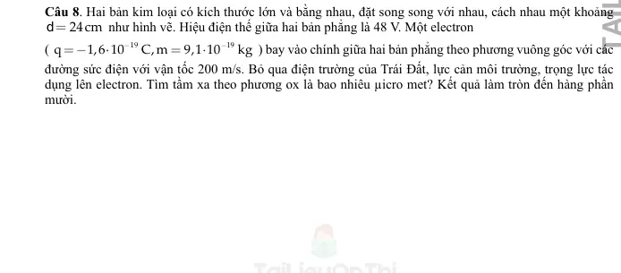{ loading=lazy }

#### Bài PDF 4

<!-- source-id: BT-Chuong-III-p91-q2-230 -->

Câu 2. Cho một hạt nhân nguyên tử helium chuyển động ngược chiều đường sức điện của một điện trường
đều có tốc độ ban đầu là
. Sau khi chuyển động được
 trong điện trường thì hạt dừng lại.
Một cách gần đúng, có thể xem như hạt chỉ chịu tác dụng của lực điện. Biết rằng hạt nhân nguyên tử helium
có 2 proton và khối lượng của hạt nhân này là
. Điện tích của proton là
. Cường
độ điện trường có độ lớn gần bằng
, giá trị của
 là bao nhiêu ? (Kết quả làm tròn đến hàng
đơn vị).

#### Bài PDF 5

<!-- source-id: BT-Chuong-III-p93-q5-233 -->

Câu 5. Một êlectron(
 ) bay vào một điện trường đều tạo bởi hai bản tích
điện trái dấu theo chiều song song với hai bản và cách bản tích điện dương một khoảng 4 cm. Biết cường
độ điện trường giữa hai bản là E = 500 V/m. Sau bao lâu thì êlectron sẽ chạm vào bản tích điện dương? (
viết kết quả theo đơn vị ns)

#### Bài PDF 6

<!-- source-id: BT-Chuong-III-p109-q30-264 -->

Câu 30. Một electron di chuyển không vận tốc đầu được một đoạn 1 cm dọc theo một đường sức điện,
dưới tác dụng của lực điện trong một điện trường đều có cường độ 1 000 V/m. Hãy xác định công của lực
điện theo đơn vị 10−18 J (Làm tròn kết quả đến hàng phần mười).

#### Bài PDF 7

<!-- source-id: BT-Chuong-III-p110-q36-273 -->

Câu 36. Xét điện trường đều tạo bởi hai bản kim loại đặt song song, cách nhau 2 cm có cường độ điện
trường bằng 5.103 V/m. Một hạt bụi mịn có điện tích q = 3.10−19C lọt vào chính giữa khoảng điện trường
đều giữa hai bản kim loại. Coi tốc độ hạt bụi khi bắt đầu vào điện trường đều bằng 0, bỏ qua lực cản của
môi trường. Động năng của hạt bụi khi va chạm với bản nhiễm điện âm là bao nhiêu 10−17 J? Chọn mốc thế
năng tại bản kim loại tích điện âm.

#### Bài PDF 8

<!-- source-id: BT-Chuong-III-p111-q37-274 -->

Câu 37. Một ion âm OH− có khối lượng 2,833.10−26 kg được thổi ra từ máy lọc không
khí với vận tốc 10 m/s cách mặt đất 80 cm ở nơi có điện trường của Trái Đất bằng 120
V/m. Dưới tác dụng của lực điện, sau một thời gian, ion đang chuyển động với vận tốc
0,5 m/s ở vị trí cách mặt đất 1,5 m. Hãy xác định công cản mà môi trường đã thực hiện
trong quá trình dịch chuyển của ion nói trên theo đơn vị 10−17 J (làm tròn kết quả đến
hàng phần mười).
Chọn mốc thế năng tại mặt đất.

#### Bài PDF 9

<!-- source-id: BT-Chuong-III-p120-q5-301 -->

Câu 5. Xét điện trường đều tạo bởi hai bản kim loại đặt song song, cách nhau 4 cm có cường độ điện trường
bằng 5.104 V/m. Một hạt bụi mịn có điện tích q = 3.10−19C lọt vào chính giữa khoảng điện trường đều
giữa hai bản kim loại. Coi tốc độ hạt bụi khi bắt đầu vào điện trường đều bằng 0, bỏ qua lực cản của môi
trường. Động năng của hạt bụi khi va chạm với bản nhiễm điện âm là bao nhiêu 10−16 J? Chọn mốc thế
năng điện tại bản kim loại tích điện âm.

#### Bài PDF 10

<!-- source-id: BT-Chuong-III-p120-q6-302 -->

Câu 6. Hình vẽ là đồ thị biểu diễn sự thay đổi tốc độ theo độ cao của một electron chuyển động từ điểm A
đến điểm B theo phương thẳng đứng trong điện trường của Trái Đất. Bỏ qua lực cản của không khí. Tính
cường độ điện trường của Trái Đất tại điểm A (Làm tròn đến hàng đơn vị).
Cho, điện tích và khối lượng của electron lần lượt là −1,6. 10−19 C; 9,1. 10−31 kg. Chọn mốc thế năng tại
mặt đất.

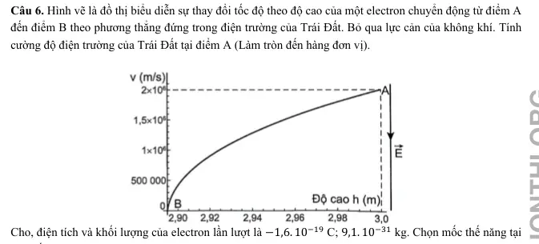{ loading=lazy }

#### Bài PDF 11

<!-- source-id: BT-Chuong-III-p139-q5-343 -->

Câu 5. Một hạt bụi khối lượng 3,6.10-15 kg mang điện tích q = 6.10-18 C nằm lơ lửng giữa hai tấm kim loại
phẳng song song nằm ngang cách nhau 2cm và nhiễm điện trái dấu. Lấy g = 10m/s2. Hiệu điện thế giữa hai
tấm kim loại bằng bao nhiêu V ?

#### Bài PDF 12

<!-- source-id: BT-Chuong-III-p147-q4-370 -->

Câu 4. Một điện tích điểm q = + 10μC chuyển động từ đỉnh B đến đỉnh C của tam giác đều ABC, nằm trong
điện trường đều có cường độ 9000V/m có đường sức điện trường song song với cạnh BC có chiều từ C đến B.
Biết cạnh tam giác bằng 20cm, công của lực điện trường khi di chuyển điện tích trên theo đoạn gấp khúc BAC
bằng bao nhiêu mJ?

#### Bài PDF 13

<!-- source-id: BT-Chuong-III-p147-q5-371 -->

Câu 5. Một prôtôn mang điện tích + 1,6.10-19C chuyển động dọc theo phương của đường sức một điện trường
đều. Khi nó đi được quãng đường 5 cm thì lực điện thực hiện một công là + 1,6.10-21J. Tính cường độ điện
trường đều này.

#### Bài PDF 14

<!-- source-id: BT-Chuong-III-p148-q6-372 -->

Câu 6. Trong đèn hình của máy thu hình, các electron được tăng tốc bởi hiệu điện thế U. Khi đập vào màn
hình thì người ta thu nhận được vận tốc của nó là 133. 106 m/s. Bỏ qua vận tốc ban đầu của nó, hiệu điện thế
U trong trường hợp này có độ lớn bằng bao nhiêu kV?

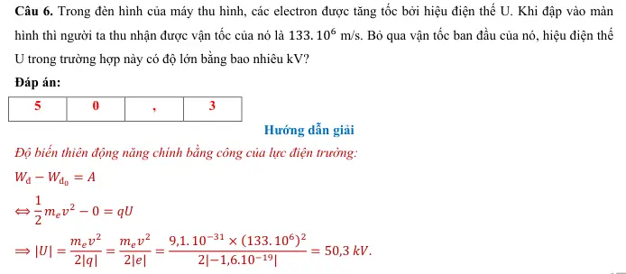{ loading=lazy }

### Nhận biết — Trắc nghiệm 4 lựa chọn

#### Bài PDF 15

<!-- source-id: BT-Chuong-III-p69-q15-188 -->

Câu 15. Hai bản kim loại phẳng nằm ngang song song cách nhau 10 cm có hiệu điện thế giữa hai bản là
100V. Một êlectrôn chuyển động dọc theo đường sức về bản âm. Biết điện trường giữa hai bản là điện
trường đều và bỏ qua tác dụng của trọng lực. Gia tốc của nó bằng
A. –1,76.
 m/s2.
B. 1,59.
 m/s2.
C. –2,76.
 m/s2.
D. 1,52.
 m/s2.

#### Bài PDF 16

<!-- source-id: BT-Chuong-III-p69-q16-189 -->

Câu 16. Một hạt khối lượng 0,4 g mang điện tích +2.10-6 C được đặt vào điện trường đều có cường độ
45.103 V/m, vectơ cường độ điện trường hướng thẳng đứng từ dưới lên trên. Lấy g=10 m/s2. Khi đó hạt sẽ
chuyển động
A. đi xuống với gia tốc 9,775 m/s2.
B. đi lên với gia tốc 9,775 m/s2.
C. đi xuống với gia tốc 215 m/s2.
D. đi lên với gia tốc 215 m/s2.

#### Bài PDF 17

<!-- source-id: BT-Chuong-III-p70-q17-190 -->

Câu 17. Một hạt prôtôn chuyển động ngược chiều đường sức điện trường đều với tốc độ ban đầu 4.105
m/s. Cho cường độ điện trường đều có độ lớn E = 3000 V/m, e = 1,6.10–19 C, mp = 1,67.10– 27 kg. Bỏ qua
tác dụng của trọng lực lên prôtôn. Sau khi đi được đoạn đường 3 cm, tốc độ của prôtôn là
A. 3,98.105 m/s.
B. 5,64.105 m/s.
C. 3,78.105 m/s.   D. 4,21.105 m/s.

#### Bài PDF 18

<!-- source-id: BT-Chuong-III-p70-q18-191 -->

Câu 18. Một êlectrôn chuyển động dọc theo hướng đường sức của một điện trường đều có cường độ 100
V/m với vận tốc ban đầu là 300 km/s. Quãng đường đi được kể từ thời điểm ban đầu cho đến khi vận tốc
của êlectron bằng không bằng
A. 2,56 cm.
B. 25,6 cm.
C. 2,56 mm.
D. 2,56 m.

#### Bài PDF 19

<!-- source-id: BT-Chuong-III-p71-q19-192 -->

Câu 19. Một êlectron chuyển động với tốc độ ban đầu 1,6.106 m/s chuyển động vào vùng điện trường đều
theo phương song song với hai bản và ở chính giữa khoảng cách hai bản như hình. Biết chiều dài mỗi bản
là 2 cm và khoảng cách giữa hai bản là 1 cm. Giữa hai bản có điện trường hướng từ trên xuống, điện trường
bên ngoài hai bản bằng 0. Biết êlectron di chuyển đến vị trí mép ngoài của tấm bản phía trên. Độ lớn cường
độ điện trường giữa hai bản bằng

A. 1000 V/m.
B. 500 V/m.
C. 364 V/m.
D. 728 V/m.

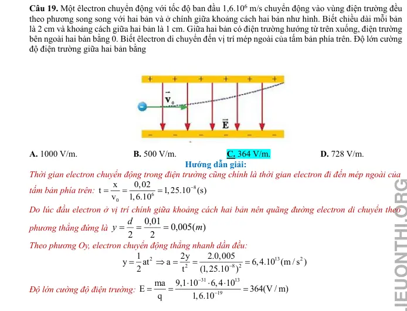{ loading=lazy }

#### Bài PDF 20

<!-- source-id: BT-Chuong-III-p71-q20-193 -->

Câu 20. Khói thải từ một số nhà máy (hình vẽ) có thể chứa nhiều hạt bụi gây ô nhiễm
môi trường. Để giảm thiểu tác hại của bụi người ta dùng máy lọc bụi tĩnh điện theo
nguyên tắc cơ bản sau: Hai bản kim loại phẳng tích điện trái dấu và đặt song song
với nhau trong không khí được đặt thẳng đứng, cách nhau d = 20 cm, chiều cao mỗi
bản là . Hiệu điện thế giữa hai bản U = 4.
 V. Không khí chứa bụi được thổi đi
lên theo phương thẳng đứng qua khoảng giữa hai bản kim loại. Cho rằng mỗi hạt bụi
có m
 ;
. Khi bắt đầu đi vào giữa hai bản kim loại, hạt
bụi có
 theo phương thẳng đứng hướng lên. Bỏ qua tác dụng của trọng lực. Tìm điều kiện của
 để mọi hạt bụi đều bị hút dính vào bản kim loại.
A. 12 m.
B. 6 m.
C. 10 m.
D. 24 m.

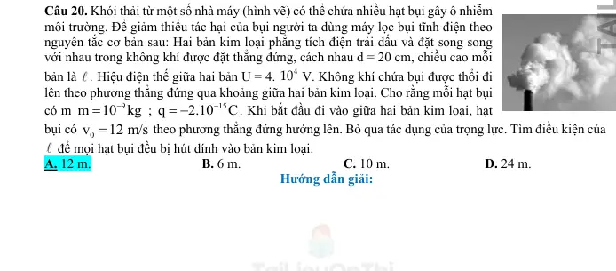{ loading=lazy }

#### Bài PDF 21

<!-- source-id: BT-Chuong-III-p82-q1-207 -->

Câu 1. Điện trường đều là điện trường mà cường độ điện trường của nó
A. có hướng như nhau tại mọi điểm.
B. có hướng và độ lớn như nhau tại mọi điểm.
C. có độ lớn như nhau tại mọi điểm.
D. có độ lớn giảm dần theo thời gian.

#### Bài PDF 22

<!-- source-id: BT-Chuong-III-p82-q5-211 -->

Câu 5. Đặt một điện tích âm, khối lượng nhỏ vào một điện trường đều rồi thả nhẹ. Điện tích này sẽ chuyển
động
A. dọc theo chiều của các đường sức điện trường.
B. ngược chiều đường sức điện trường.
C. vuông góc với đường sức điện trường.
D. theo một quỹ đạo bất kì.

#### Bài PDF 23

<!-- source-id: BT-Chuong-III-p83-q10-216 -->

Câu 10. Trong ống phóng tia X, khoảng cách giữa hai cực của ống phóng tia X  (Hình 18.1) bằng 2 cm ,
hiệu điện thế giữa hai cực là 100kV . Một electron có điện tích
19
1,6.10
C
e
−
= −
 bật ra khỏi bản cực âm
(catôt) bay vào điện trường giữa hai bản cực. Lực điện tác dụng lên electron đó bằng

Hinh 18.1. Ống phóng tia X  trong máy chup X  quang chẩn đoán hình ảnh
A.
13
8 10
 N
−

.
B.
18
8 10
 N
−

.
C.
17
3,2 10
 N
−

.
D.
15
8 10
 N
−

.

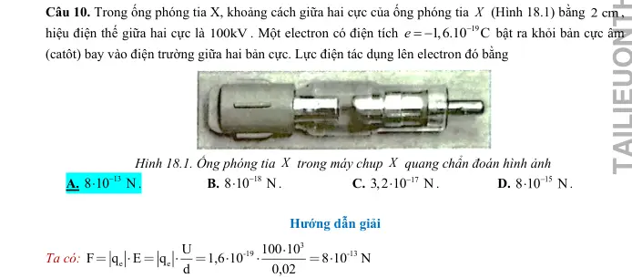{ loading=lazy }

#### Bài PDF 24

<!-- source-id: BT-Chuong-III-p84-q12-218 -->

Câu 12. Một êlectron được phóng đi từ O với vận tốc ban đầu
0v dọc theo chiều đường sức của một điện
trường đều cường độ E

. Quãng đường xa nhất mà nó di chuyển được trong điện trường cho tới khi vận
tốc của nó bằng không có biểu thức
A.
2
o
mv
2eE .
B.
2
o
2eE
mv .
C.
2
o
eE
mv .
D.
2
o
me
Ev .

#### Bài PDF 25

<!-- source-id: BT-Chuong-III-p84-q14-220 -->

Câu 14. Một hạt bụi khối lượng 10-8 g mang điện tích 5.10-5C chuyển động trong điện trường đều theo một
đường sức điện từ điểm M đến điểm N thì vật vận tốc tăng từ 2.104 m/s đến 3,6.104 m/s. Biết đoạn đường
MN dài 5cm, cường độ điện trường đều là
A. 2462 V/m
B. 1685 V/m
C. 2175 V/m
D. 1792 V/m.

#### Bài PDF 26

<!-- source-id: BT-Chuong-III-p85-q16-222 -->

Câu 16. Hai bản kim loại tích điện trái dấu có các bản song song đặt nằm ngang cách nhau 4 cm, chiều dài
các bản là 10 cm, hiệu điện thế giữa hai bản là 20 V. Một êlectron(
 ) bay
từ điểm O cách đều hai bản với vận tốc ban đầu là
 song song với các bản. Để êlectron có thể ra khỏi
hai bản thì giá trị nhỏ nhất của
 gần nhất với giá trị nào sau đây?

0
=
+
→
→
P
Fđ
19
31
q
1,6.10
;m
9,1.10
kg
−
−
= −
=
0v

0
v

A. 4,7.106 m/s.
B. 4,7.107 m/s.
C. 4,7.105m/s.
D. 4,7.104 m/s.

#### Bài PDF 27

<!-- source-id: BT-Chuong-III-p86-q17-223 -->

Câu 17. Để làm lệch hướng chuyển động của êlectron một góc α, người ta thiết lập một điện trường đều
có cường độ E và có hướng vuông góc với hướng chuyển động ban đầu của êlectron trong thời gian t. Khi
t = 1 ms thì
. Muốn êlectron lệch hướng chuyển động một góc
 thì thời gian thiết lập điện
trường là
A. 3,48 ms.
B. 2 ms.
C. 3 ms.
D. 1,73 ms.

#### Bài PDF 28

<!-- source-id: BT-Chuong-III-p101-q2-236 -->

Câu 2. Công của lực điện trường tác dụng lên một điện tích q chuyển động từ điểm M đến điểm N trong
một điện trường đều không phụ thuộc vào

A. cung đường dịch chuyển.
B. điện tích q.

C. vector cường độ điện trường.
D. vị trí của N.

#### Bài PDF 29

<!-- source-id: BT-Chuong-III-p101-q3-237 -->

Câu 3. Một điện tích q chuyển động trong điện trường đều theo một đường cong kín. Gọi công của lực
điện trong chuyển động đó là A thì

A. A &gt; 0 nếu q &gt; 0.

B. A &gt; 0 nếu q &lt; 0.

C. A  0 nếu điện trường không đổi.
D. A = 0.

#### Bài PDF 30

<!-- source-id: BT-Chuong-III-p102-q8-242 -->

Câu 8. Một điện tích q chuyển động từ điểm M đến Q, đến N, đến P trong điện trường đều như hình vẽ.
Đáp án nào là sai khi nói về mối quan hệ giữa công của lực điện trường dịch chuyển điện tích trên các đoạn
đường?

A. AMQ = – AQN.

B. AMN = ANP.

C. AQP = AQN.

D. AMQ = AMP.

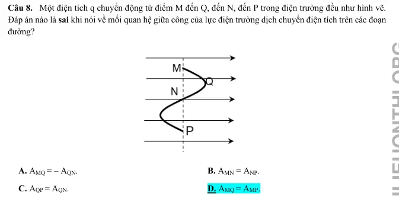{ loading=lazy }

#### Bài PDF 31

<!-- source-id: BT-Chuong-III-p106-q25-259 -->

Câu 25. Một electron chuyển động dọc theo đường sức của một điện trường đều, cường độ điện trường
có độ lớn E = 200 V/m. Khối lượng và điện tích của electron lần lượt là 9, 1.10−31 kg; −1,6.10−19 C. Tính
từ thời điểm tốc độ của electron là 3.105 m/s đến khi tốc độ của nó bằng 0 thì nó đã đi được đoạn đường
bằng

A. 5,12 mm.
B. 2,56 mm.
C. 1,28 mm.
D. 10,24 mm.

#### Bài PDF 32

<!-- source-id: BT-Chuong-III-p112-q2-276 -->

Câu 2. Một electron di chuyển không vận tốc đầu được một đoạn 1 cm dọc theo một đường sức điện, dưới
tác dụng của một lực điện trong một điện trường đều có cường độ 1 000 V/m. Công của lực điện khi đó
bằng

A. 1,6. 10−18 J.
B. −1,6. 10−18 J.
C. −1,6. 10−16 J.
D. 1,6. 10−16 J.

#### Bài PDF 33

<!-- source-id: BT-Chuong-III-p113-q8-282 -->

Câu 8. Một điện tích điểm q = 10 μC chuyển động từ đỉnh B đến đỉnh C của tam giác đều ABC, nằm trong
điện trường đều có cường độ 5 000 V/m có đường sức điện song song với cạnh BC có chiều từ B đến C.
Biết tam giác có cạnh bằng 10 cm. Công của lực điện trường khi di chuyển điện tích trên theo đoạn gấp
khúc BAC bằng

A. 5.10−3 J.
B. – 2,5.10−3 J.
C. – 5.10−3 J.
D. 2,5.10−3 J.

#### Bài PDF 34

<!-- source-id: BT-Chuong-III-p113-q9-283 -->

Câu 9. Một điện tích điểm q = 10 μC chuyển động từ đỉnh B đến đỉnh C của tam giác đều ABC nằm trong
điện trường đều có cường độ 5 000 V/m. Đường sức của điện trường này song song với cạnh BC và có
chiều từ C đến B. Cạnh của tam giác bằng 10 cm. Công của lực điện trường khi điện tích chuyển động trong
hai trường hợp, q  chuyển động theo đoạn thẳng BC và chuyển động theo đoạn gấp khúc BAC là
A. ABC = − 5.10−4 J, ABAC = − 10.10−4J.
B. ABC = −2, 5.10−3 J, ABAC = −2,5.10−3J.
C. ABC = − 5.10−3 J, ABAC = − 5.10−3 J.
D. ABC = − 5.10−4 J, ABAC = − 5.10−4 J.

#### Bài PDF 35

<!-- source-id: BT-Chuong-III-p114-q10-284 -->

Câu 10. Một điện tích âm bay theo phương của một đường sức điện trường. Lúc ở điểm A nó có tốc độ
2,5.104 m/s, khi đến điểm B tốc độ của nó bằng không. Biết electron có khối lượng 2,672.10-26 kg. Thế năng
điện tại A bằng − 8.10−17 J. Thế năng điện tại B bằng

A. − 8,5.10−17 J.
B. − 7,2.10−17 J.
C. 7,2.10−17 J.
D. 8,5.10−17 J.

#### Bài PDF 36

<!-- source-id: BT-Chuong-III-p114-q12-286 -->

Câu 12. Một proton chuyển động dọc theo đường sức của một điện trường đều, cường độ điện trường có
độ lớn E = 200 V/m. Khối lượng và điện tích của proton lần lượt là 1,67. 10−27 kg; 1,6.10−19 C. Tính từ
thời điểm tốc độ của proton bằng 0 đến khi tốc độ của nó bằng 3.104 m/s thì nó đã đi được đoạn đường
bằng

A. 51,2 mm.
B. 23,5 mm.
C. 12,8 mm.
D. − 12,8 mm.

#### Bài PDF 37

<!-- source-id: BT-Chuong-III-p115-q14-288 -->

Câu 14. Một electron đang bay với động năng 410 eV (1 eV = 1,6.10−19 J) theo hướng đường sức điện, từ
một điểm có thế năng điện W1 = −9,6. 10−17 J. Hãy xác định thế năng điện W2 tại điểm mà ở đó electron
dừng lại.

A. −3,04. 10−17 J.
B. −1,264. 10−16 J.
C. −1,76. 10−16 J.
D. −4. 10−17 J.

#### Bài PDF 38

<!-- source-id: BT-Chuong-III-p115-q16-290 -->

Câu 16. Một electron chuyển động dọc theo đường sức của một điện trường đều. Cường độ điện trường có
độ lớn bằng 200 V/m. Vận tốc ban đầu của electron là 3.106 m/s, khối lượng và điện tích của electron lần
lượt là 9,1.10−31 kg; −1,6.10−19 C. Từ lúc bắt đầu chuyển động đến khi có vận tốc bằng 0 thì electron đã đi
được quãng đường bằng

A. 5,12 mm.
B. 0,128 m.
C. 5,12 m.
D. 1,28 mm.

#### Bài PDF 39

<!-- source-id: BT-Chuong-III-p116-q18-292 -->

Câu 18. Hai bản kim loại tích điện trái dấu, đặt song song và cách nhau 3 cm. Độ lớn cường độ điện trường
giữa hai bản là 1 000 V/m. Một electron được đặt tại bản tích điện âm, thả cho electron chuyển động dọc
theo đường sức điện. Khối lượng và điện tích của electron lần lượt là 9,1.10−31 kg; −1,6.10−19 C. Tốc độ của
electron khi chạm vào bản tích điện dương bằng

A. 3,2. 106 m/s.
B. 3,2. 106 cm/s.
C. 1,6. 106 m/s.
D. 1,6. 106 cm/s.

#### Bài PDF 40

<!-- source-id: BT-Chuong-III-p131-q28-330 -->

Câu 28. Một điện tích q chuyển động từ điểm A đến B, đến C, đến D trong điện trường đều như hình vẽ. Công
của lực điện trường dịch chuyển điện tích trên các đoạn đường
A. AAB = ABC
B. AAC = ACD.
C. ABD = AAD.
D. AAB = AAD.

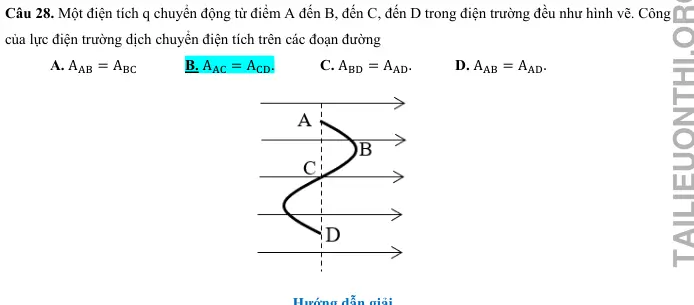{ loading=lazy }

#### Bài PDF 41

<!-- source-id: BT-Chuong-III-p132-q29-331 -->

Câu 29. Hai tấm kim loại phẳng nằm ngang song song cách nhau 5 cm. Hiệu điện thế giữa hai tấm là 100 V.
Một electron không vận tốc ban đầu chuyển động từ tấm tích điện âm về tấm tích điện dương, biết khối lượng
của electron là me = 9,1. 10−31 kg. Khi đến tấm tích điện dương thì electron có vận tốc là
A. 5,93. 106 m/s.
B. 3,52. 106 m/s.
C. 4,19. 106 m/s.
D. 6,85. 106 m/s.

#### Bài PDF 42

<!-- source-id: BT-Chuong-III-p140-q4-348 -->

Câu 4. Một điện tích q chuyển động trong điện trường không đều theo một đường cong kín. Gọi công của lực
điện trong chuyển động đó là A thì
A.  A &gt; 0 nếu q &gt; 0.
B. A &gt; 0 nếu q &lt; 0.
C. A ≠ 0 nếu q &gt; 0.
D. A = 0 với mọi trường hợp.

#### Bài PDF 43

<!-- source-id: BT-Chuong-III-p141-q12-356 -->

Câu 12. Khi bay từ M đến N trong điện trường đều, electron tăng tốc động năng tăng thêm 350eV. Hiệu điện
thế UMN bằng
 A. – 350 V.
B. 350 V.
C. – 150 V.
D. 150 V.

#### Bài PDF 44

<!-- source-id: BT-Chuong-III-p142-q17-361 -->

Câu 17. Hai tấm kim loại phẳng nằm ngang song song cách nhau 10 cm. Hiệu điện thế giữa hai tấm là 150 V.
Một electron không vận tốc ban đầu chuyển động từ tấm tích điện âm về tấm tích điện dương, biết khối lượng
của electron là me = 9,1. 10−31 kg. Khi đến tấm tích điện dương thì electron có vận tốc là
 A.  5,93. 106 m/s.
B. 3,52. 106 m/s.
C. 4,19. 106 m/s.
D. 7,26. 106 m/s.

### Nhận biết — Đúng/Sai

#### Bài PDF 45

<!-- source-id: BT-Chuong-III-p75-q5-198 -->

Câu 5. Ống tia âm cực (CRT) là một thiết bị thường được thấy trong dao động ký điện tử cũng như màn
hình tivi, máy tính (CRT)… cho thấy mô hình của một ống tia âm cực, bao gồm hai bản kim loại phẳng có
chiều dài 8 cm, tích điện trái dấu, đặt song song và cách nhau 2 cm. Hiệu điện thế giữa hai bản kim loại là
U = 12 V. Một electron được phóng ra từ điểm A cách đều hai bản kim loại với vận tốc ban đầu có độ lớn
v0 bằng 7.106 m/s và hướng dọc theo trục của ống cho rằng bản kim loại bên dưới có điện thế lớn hơn.
Xem tác dụng của trọng lực là không đáng kể lấy khối lượng của electron là 9,1.10-31 kg .
P = mg


A
F = - DVg


F = qE

5
4
9 10
10
9 10
N
−
−


= 
9
6
A
F
DgV
800 10 10
8 10 N
−
−
=
=


= 
A
P &gt; F

A
P + F + F = 0


A
P &gt; F 
F

A
F = P - F
4
6
9
5
mg - DgV
9 10
8 10
q E = mg - DgV
q =
2 10
C
E
4,1 10
−
−
−

−


=
=


đF = P
'
'
đ
đ
F &lt;P
P- F = ma
0


đ
mg
F
P
q E
mg
E
q
=

=

=
'
2
đ
q .0,5E
P
F
g
a
g
5 m/s
m
m
2
−
=
=
−
=
=
2s
2.0,05
t
0,14s
a
5
=
=
=

Phát biểu
Đúng
Sai
a
Điện trường giữa hai bản kim loại trên là điện trường đều.
Đ

b
Cường độ điện trường giữa hai bản kim loại hướng lên có độ lớn bằng
600V/m.

S
c
 Xác định tốc độ của electron khi vừa ra khỏi vùng không gian giữa hai
bản kim loại là
 /s
Đ

d
Sau khi ra khỏi vùng không gian nói trên hoặc chuyển động thẳng đều đến
đập vào màn hình quang S. Biết S cách hai bản kim loại một đoạn 15 cm.
Vị trí trên màn S mà electron này đập vào cách trục của ống một đoạn bằng
.
Đ

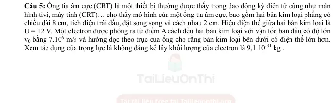{ loading=lazy }

#### Bài PDF 46

<!-- source-id: BT-Chuong-III-p87-q1-225 -->

Câu 1. Trong một ngày giông bão, xét một đám mây tích điện mang lượng điện tích âm có độ lớn

đang ở độ cao 1600 m so với mặt đất tích điện dương như hình. Xem như đám mây và mặt đất tương
đương với hai bản của một "tụ điện" phẳng với điện dung

Phát biểu
Đúng
Sai
a
Vector cường độ điện trường có phương thẳng đứng, hướng từ mặt đất lên
đám mây.
Đ

b
Hiệu điện thế giữa mặt đất và đám mây là 8.1010 V.
Đ

c
Cường độ điện trường trong khoảng giữa đám mây và mặt đất là 5.106 V/m.

S
=
t
0,9s
=
t
0,19s
=
t
0,09s
=
t
0,29s
P
F
=
P
F
=

=
=

=
U
qU
P
F
mg
qE
q
m
d
dg
−Δ
=
1
q(U
U)
F
.
d

1
F – F


Δ
Δ
−
=
=

=
1
q
U
U g
F
F
ma
a
.
d
U
=

=
Δ

=
=
2
1
1
1
2d
2d U
at
d
t
0,09s.
2
a
U g
40C
10
5.10
.
−
F

d
Nếu một hạt bụi có điện tích q0 = − 2.10-12 C dịch chuyển từ A đến B (như
hình vẽ) thì công của lực điện trường thực hiện sự dịch chuyển này có giá trị
là 0,16 J.
Đ

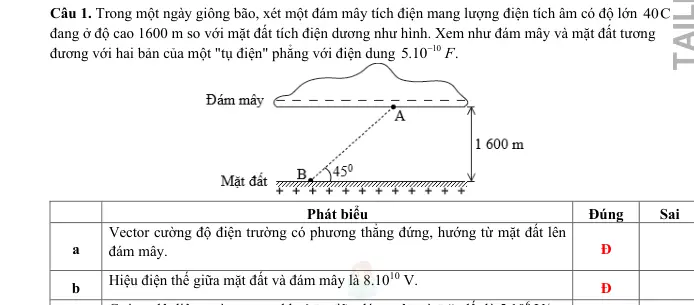{ loading=lazy }

#### Bài PDF 47

<!-- source-id: BT-Chuong-III-p89-q3-227 -->

Câu 3. Xét hai bản kim loại hình vuông đặt song song cách nhau 5mm,  tích điện bằng nhau nhưng trái
dấu. Hiệu điện thế giữa hai bản là 25 V. Xem điện trường giữa hai bản là đều, các đường sức điện vuông
góc với các bản. Thả một electron tại sát bản âm thì nó bắt đầu chuyển động về phía bản dương. Bỏ qua
trong lượng của electron.

Phát biểu
Đúng
Sai
a
Điện trường giữa hai bản có chiều từ bản âm tới bản dương.
Đ

b
 Độ lớn cường độ điện trường giữa hai bản kim loại là 5000 V / m.
Đ

c
 Tốc độ của electron khi nó đến bản dương là
6
1,6.10 m / s.

S
d
Quỹ đạo của electron trên có dạng 1 phần của parabol.

S

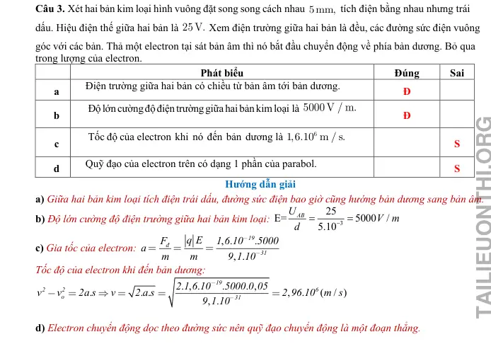{ loading=lazy }

#### Bài PDF 48

<!-- source-id: BT-Chuong-III-p89-q4-228 -->

Câu 4. Một nhóm học sinh nghiên cứu cơ chế lái tia điện tử của bản lái tia trong máy dao động kí. Họ phát
hiện rằng khi electron đi qua bản lái tia không chỉ thay đổi phương của chuyển động mà còn được tăng tốc.
Tụ điện phẳng được dùng để khảo sát có khoảng cách giữa hai bản tụ
 được mắc vào nguồn không
đổi hiệu điện thế
 Trong một thí nghiệm, khi cho một electron với vận tốc có độ lớn
 đi vào điện trường giữa hai bản tụ tại điểm
 nằm chính giữa hai bản tụ và đi ra khỏi
điện trường tại điểm
 cách bản cực dương
 như hình vẽ . Biết điện tích và khối lượng của
electron là

U
F
q E
q d
=
=
qU
qU
P
0
P
d
d
−
=
→
=
2
q.0,5U
P
ma
0,5P
ma
a
g / 2
5m / s
d
−
=

=

=
=
2
2
0
v
v
2ad
v
1m / s
−
=

=
d
1cm
=
U
12 V.
=
5
0
v
2.10 m / s
=
M
N
4,9mm
19
31
e
e
q
1,6.10
C;m
9,1.10
kg.
−
−
= −
=

Phát biểu
Đúng
Sai
a
Đường sức điện giữa hai bản tụ điện là những đường cong, cách đều,
hướng từ trên xuống dưới.

S
b
Cường độ điện trường giữa hai bản tụ có độ lớn
.
Đ

c
Quỹ đạo chuyển động của hạt electron là đường parabol.

S
d
 Vận tốc của electron khi đi ra khỏi điện trường là

S

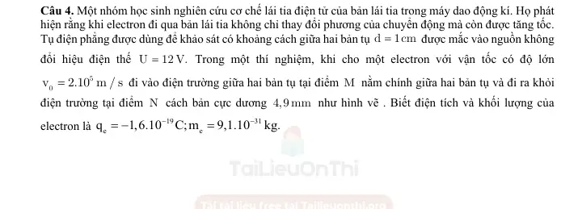{ loading=lazy }

#### Bài PDF 49

<!-- source-id: BT-Chuong-III-p107-q29-263 -->

Câu 29. Xét chuyển động của một hạt proton trong vùng không gian có điện trường đều. Cho 3 điểm A,
B, C tạo thành một tam giác đều có độ dài các cạnh bằng 4 cm, AB vuông góc với các đường sức điện như
hình vẽ. Biết cường độ điện trường có độ lớn E = 1 000 V/m; điện tích của proton qp = 1,6. 10−19 C.
14

Phát biểu
Đúng Sai
a)
Công của lực điện bằng 0 khi hạt proton dịch chuyển từ điểm A đến điểm B theo
phương AB.
Đ

b)
Công của lực điện bằng 0 khi hạt proton dịch chuyển từ điểm A đến điểm B theo
đoạn gấp khúc ACB.
Đ

c)
Công của lực điện khi hạt proton di chuyển từ điểm A đến điểm C bằng
3,2. 10−18. √3 J.

S
d)
Công của lực điện khi hạt proton di chuyển từ điểm C đến điểm B bằng
−3,2. 10−18. √3 J.

S

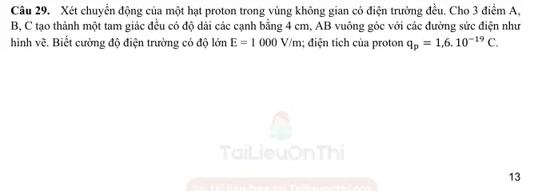{ loading=lazy }

#### Bài PDF 50

<!-- source-id: BT-Chuong-III-p116-q1-293 -->

Câu 1. Xét chuyển động của một điện tích q &gt; 0 trong điện trường đều có quỹ đạo là đường thẳng vuông
góc với các đường sức điện.
Trong các nhận định sau, nhận định nào đúng, nhận định nào sai?

Phát biểu
Đúng
Sai
a)
Điện trường sinh công âm trong quá trình điện tích chuyển động.

S
b)
Điện trường sinh công dương trong quá trình điện tích chuyển động.

S
c)
Điện trường không sinh công trong quá trình điện tích chuyển động.
Đ

d)
Điện trường sinh công dương trên nửa đoạn đường đầu và sinh công âm trên nửa
đoạn đường sau.

S

#### Bài PDF 51

<!-- source-id: BT-Chuong-III-p116-q2-294 -->

Câu 2. Trong khoảng không gian giữa hai bản kim loại phẳng tích điện trái dấu có độ lớn bằng nhau, cách
nhau một khoảng a, tồn tại một điện trường đều có cường độ E, cho một electron bắt đầu chuyển động từ
bản tích điện âm đến bản tích điện dương. Chọn mốc thế năng tại bản âm.
Trong các nhận định sau đây, nhận định nào đúng, nhận định nào sai?

23

Phát biểu
Đúng
Sai
a)
Lực điện thực hiện công âm.

S
b)
Tốc độ của electron khi chạm bản tích điện dương là v = √
2qe.E.d
me ;
với d = −a.
Đ

c)
Lực điện thực hiện công dương, thế năng của êlectron tăng.

S
d)
Lực điện thực hiện công dương, thế năng của êlectron giảm.
Đ

#### Bài PDF 52

<!-- source-id: BT-Chuong-III-p118-q4-296 -->

Câu 4. Một điện tích điểm q = +10 μC chuyển động trong điện trường đều có cường độ 5 000 V/m. Xét
tam giác đều MNP nằm trong điện trường đều, các đường sức song song với cạnh NP, có chiều từ N đến
P. Biết mỗi cạnh của tam giác MNP bằng 5 cm.

Phát biểu
Đúng
Sai
a)
Gọi H là chân đường vuông góc kẻ từ M đến NP. Khi đó, NH = HP = 2,5 cm.
Đ

b)
Công của lực điện làm điện tích q di chuyển từ M đến H xấp xỉ 0,002 J.

S
c)
Công của lực điện làm điện tích q di chuyển theo đường gấp khúc MPH xấp xỉ
0,02 J.

S
d)
Công của lực điện làm điện tích q di chuyển từ M đến N bằng − 0,00125 J.
Đ

#### Bài PDF 53

<!-- source-id: BT-Chuong-III-p134-q3-335 -->

Câu 3. Một điện tích q chuyển động từ điểm M đến Q, đến O, đến N, đến P và đến H trong điện trường đều như
hình vẽ.

Phát biểu
Đúng
Sai
a
Công của lực điện dịch chuyển điện tích: AMQ = AQO.

S
b
Công của lực điện dịch chuyển điện tích từ M đến P bằng 0 J.
Đ

c
Hiệu điện thế UQO &gt; UPH.

S
d
Điện thế tại hai điểm O và P bằng nhau.
Đ

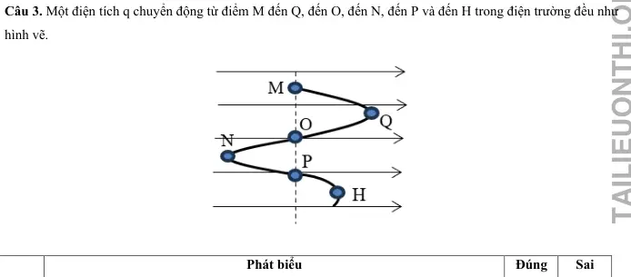{ loading=lazy }

#### Bài PDF 54

<!-- source-id: BT-Chuong-III-p135-q4-336 -->

Câu 4. Ba điểm A, B, C nằm trong điện trường đều sao cho E⃗ ∕/ CA. Cho AB ⊥AC và AB = 9 cm; AC = 12 cm.
Lấy D là trung điểm của AC, biết UCD = 180 V.

Phát biểu
Đúng
Sai
a
Cường độ điện trường E có độ lớn 3000 V/m.
Đ

b
Hiệu điện thế UBC = 360 V.

S
c
Công của lực điện trường khi electron dịch chuyển từ B đến C là −5,76. 10−17 J.

S
d
Công của lực điện trường khi electron dịch chuyển từ B đến D là 2,88. 10−17 J.
Đ

#### Bài PDF 55

<!-- source-id: BT-Chuong-III-p136-q6-338 -->

Câu 6. Một electron chuyển động với vận tốc ban đầu 4. 107 m/s vào vùng điện trường đều như hình. Biết
cường độ điện trường E = 103 V/m và khoảng cách giữa hai bản là d = 10 cm.

Phát biểu
Đúng
Sai
a
Điện trường có chiều từ trên xuống dưới.
Đ

b
Electron có xu hướng bay về phía bản tích điện dương.
Đ

c
Hiệu điện thế giữa hai bản tụ là 100 V.
Đ

d
Độ lớn gia tốc của electron khi dịch chuyển trong điện trường là 1,76. 1011 m/s2

S

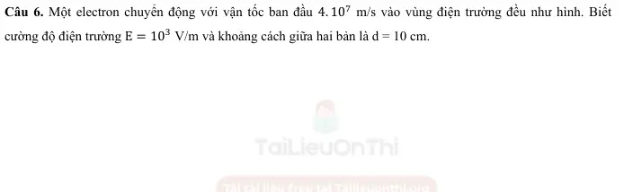{ loading=lazy }

#### Bài PDF 56

<!-- source-id: BT-Chuong-III-p143-q1-363 -->

Câu 1. Một đám mây dông bị phân thành hai tầng, tầng trên mang điện dương cách xa tầng dưới mang điện âm.
Đo bằng thực nghiệm, người ta thấy điện trường trong khoảng giữa hai tầng của đám mây dông đó gần đều với

E = 1000 V/m, khoảng cách giữa hai tầng là 1,2 km, điện tích của tầng phía trên ước tính được bằng Q2 = 3,24
C. Coi điện thế của tầng mây dưới là V1 = −500 kV.

Phát biểu
Đúng
Sai
a
Hiệu điện thế giữa hai tầng mây là 1,2. 106 V.
Đ

b
Điện thế của tầng mây trên bằng 0,7 kV.

S
c
Thế năng điện của tầng trên là 2268 J.

S
d
Nếu một hạt bụi mang điện tích q = 2.10-12 C rơi vào khoảng giữa hai tầng mây
thì công của lực điện để dịch chuyển hạt bụi từ tầng trên xuống tầng dưới là
2,4 μJ.
Đ

#### Bài PDF 57

<!-- source-id: BT-Chuong-III-p144-q2-364 -->

Câu 2. Cho ba bản kim loại phẳng tích điện 1, 2, 3 đặt song song lần lượt nhau cách nhau những khoảng d12 = 5
cm, d23 = 8 cm, bản 1 và 3 tích điện dương, bản 2 nằm ở giữa tích điện âm. E12 = 1200 V/m, E23 = 1500 V/m,
lấy gốc điện thế ở bản 1.

Phát biểu
Đúng
Sai
a
Nếu một hạt neutron được bắn theo phương vuông góc với điện trường E23
⃗⃗⃗⃗⃗⃗  thì
quỹ đạo của hạt sẽ bị lệch so với phương ban đầu.

S
b
Hiệu điện thế giữa hai bản (1) và (2) là 60 V.
Đ

c
Điện thế tại bản (3) là 60 V.
Đ

d
Công của lực điện để dịch chuyển một điện tích q = 2. 10−6 C từ bản (2) đến (3)
là 2,4. 10−4J.

S

#### Bài PDF 58

<!-- source-id: BT-Chuong-III-p145-q3-365 -->

Câu 3. Một điện tích q chuyển động từ điểm A đến B, đến C, đến D và về A trong điện trường đều như hình vẽ.

Phát biểu
Đúng
Sai
a
Công của lực điện dịch chuyển điện tích: AAB = −ABA.
Đ

b
Công của lực điện dịch chuyển điện tích từ B đến D có giá trị âm.
Đ

c
Công của lực điện dịch chuyển điện tích: ABC &lt; ACD.

S
d
Công của lực điện khi dịch chuyển điện tích đi hết chu trình bằng 0J.
Đ

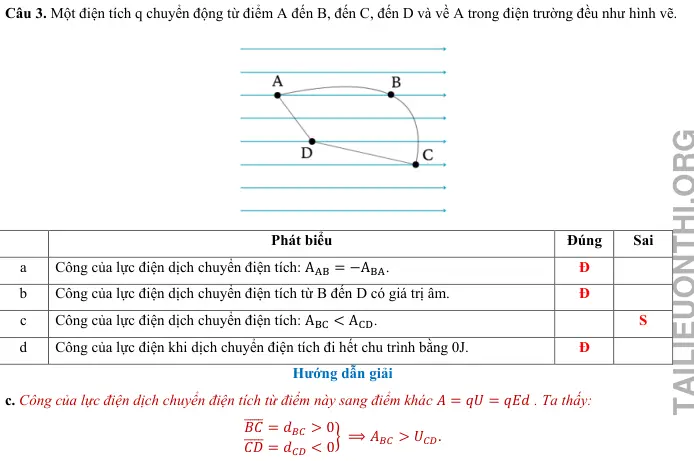{ loading=lazy }

#### Bài PDF 59

<!-- source-id: BT-Chuong-III-p145-q4-366 -->

Câu 4. Một electron chuyển động dọc theo một đường sức điện trong điện trường đều giữa hai bản kim loại tích
điện trái dấu. Hiệu điện thế giữa hai bản là 120V. Biết rằng electron được đặt không vận tốc ban đầu cách bản
điện tích dương 1,5cm. Khoảng cách giữa hai bản là 2cm. Điện tích của electron bằng -1,6.10-19 C, khối lượng
electron bằng 9,1.10-31 kg.

Phát biểu
Đúng
Sai
a
Cường độ điện trường giữa hai bản kim loại là 6000 V/m.
Đ

b
Electron bay về phía bản dương do chịu tác dụng của lực điện trường.
Đ

c
Công của lực điện dịch chuyển electron từ vị trí cách bản dương d’ = 1,5 cm về

S

bản dương là −1,44. 10−17 J.
d
Vận tốc của electron khi tới bản dương là 5,63. 106 m/s.
Đ

### Thông hiểu — Trắc nghiệm 4 lựa chọn

#### Bài PDF 60

<!-- source-id: BT-Chuong-III-p67-q7-180 -->

Câu 7. Khi một điện tích chuyển động vào điện trường đều theo phương vuông góc với đường sức điện (
Bỏ qua tác dụng của trọng lực, lực cản môi trường) thì yếu tố nào sẽ luôn giữ không đổi?
A. Gia tốc của chuyển động.      B. Phương của chuyển động.
C. Tốc độ của chuyển động.      D. Độ dịch chuyển sau một đơn vị thời gian.

#### Bài PDF 61

<!-- source-id: BT-Chuong-III-p67-q8-181 -->

Câu 8. Khi một điện tích chuyển động vào điện trường đều theo phương vuông góc với đường sức điện thì
điện trường sẽ không ảnh hưởng tới
A. gia tốc của chuyển động của điện tích trong điện trường.
B. vận tốc theo phương vuông góc với đường sức điện.
C. vận tốc theo phương song song với đường sức điện.
D. quỹ đạo của chuyển động của điện tích trong điện trường.

#### Bài PDF 62

<!-- source-id: BT-Chuong-III-p67-q9-182 -->

Câu 9. Quỹ đạo chuyển động của một điện tích điểm q bay vào một điện trường đều
 theo phương vuông
góc với đường sức không phụ thuộc vào yếu tố nào sau đây?
A. Độ lớn của điện tích q.

B. Cường độ điện trường E .
C. Vị trí của điện tích q bắt đầu bay vào điện trường.
D. Khối lượng m của điện tích.

#### Bài PDF 63

<!-- source-id: BT-Chuong-III-p128-q15-317 -->

Câu 15. Điện tích q chuyển động từ M đến N trong một điện trường đều, công của lực điện càng nhỏ nếu
A. hiệu điện thế UMN càng nhỏ.
B. hiệu điện thế UMN càng lớn.
C. đường đi từ M đến N càng dài.
D. đường đi từ M đến N càng ngắn.

### Vận dụng — Trắc nghiệm 4 lựa chọn

#### Bài PDF 64

<!-- source-id: BT-Chuong-III-p68-q11-184 -->

Câu 11. Để chuẩn đoán hình ảnh trong y học người ta thường sử dụng tia X (hay tia Rơn-ghen) để chụp X
quang và chụp CT. Cho rằng vùng điện trường giữa hai cực của ống tia X
(hình vẽ) , là một điện trường đều. Khoảng cách giữa hai cực bằng 2 cm,
hiệu điện thế giữa hai cực là 120 kV. Biết điện tích của electron
. Độ lớn lực điện trường tác dụng lên một êlectron bằng
A. 9,6.
 N.

B. 9,6.
 N.

C. 9,6.
 N.

D. 9,6.
 N.

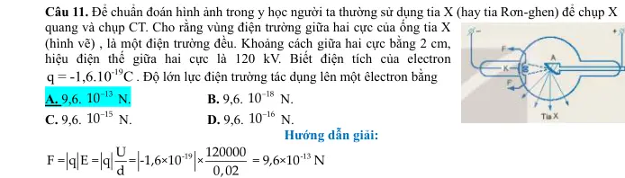{ loading=lazy }

#### Bài PDF 65

<!-- source-id: BT-Chuong-III-p104-q18-252 -->

Câu 18. Một electron đang ở độ cao 1,04 m so với mặt đất, tại nơi có điện trường Trái Đất bằng 115 V/m.
Mốc thế năng điện được chọn tại mặt đất, êlectron có điện tích qe = −1,6.10-19 C. Thế năng của electron đặt
tại điểm M có giá trị bằng
A. −191. 10−19 J.
B. −191. 10−19 J.
C. 191. 10−17 J.
D. −191. 10−17 J.

#### Bài PDF 66

<!-- source-id: BT-Chuong-III-p104-q19-253 -->

Câu 19. Một điện tích điểm q dương chuyển động dọc theo các cạnh của một tam giác đều ABC. Tam
giác ABC nằm trong điện trường đều, đường sức của điện trường này có chiều từ C đến B. Gọi AAB và AAC
lần lượt là công của lực điện sinh ra tương ứng khi điện tích q di chuyển từ A đến B và từ A đến C thì

A. AAB = – AAC.
B. AAB = AAC.
C. AAB = – 2AAC.
D. AAB = 2AAC.

