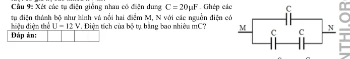
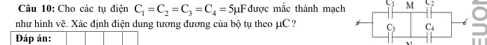
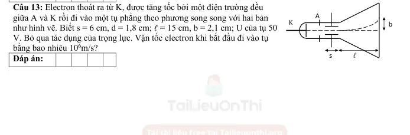
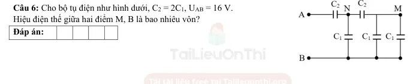

# Bài tập — Bài 8 — Ghép tụ và các bài toán tụ điện nâng cao

> Hệ bài tập được biên soạn theo các dạng xuất hiện trong bộ tài liệu Vật lí 11 của dự án. Câu hỏi được giữ ngắn, trực tiếp; độ khó tăng dần và không cố tình thêm dữ kiện gây nhiễu.

[← Trở lại bài học](../../08-advanced-capacitors.md)

## Phần A — Trắc nghiệm 4 lựa chọn

### Câu 1 — Mức 1 — Nhận biết

Hai tụ $C_1=3\,\mu$F, $C_2=6\,\mu$F mắc song song. Điện dung tương đương là

A. $2\,\mu$F.  
B. $3\,\mu$F.  
C. $9\,\mu$F.  
D. $18\,\mu$F.

### Câu 2 — Mức 1 — Nhận biết

Hai tụ $3\,\mu$F và $6\,\mu$F mắc nối tiếp. Điện dung tương đương là

A. $2\,\mu$F.  
B. $3\,\mu$F.  
C. $9\,\mu$F.  
D. $18\,\mu$F.

### Câu 3 — Mức 1 — Nhận biết

Trong mạch hai tụ nối tiếp đã ổn định, độ lớn điện tích trên mỗi tụ

A. luôn bằng nhau nếu nút giữa cô lập ban đầu trung hòa.  
B. tỉ lệ điện dung.  
C. luôn bằng 0.  
D. bằng hiệu điện thế.

### Câu 4 — Mức 1 — Nhận biết

Hai tụ song song đặt cùng hiệu điện thế U. Tụ có điện dung lớn hơn sẽ

A. có điện tích nhỏ hơn.  
B. có điện tích lớn hơn.  
C. có điện tích bằng nhau bắt buộc.  
D. không tích điện.

## Phần B — Đúng/Sai

### Câu 5 — Mức 2 — Thông hiểu

Ghép tụ điện:

a) Song song: hiệu điện thế trên các tụ bằng nhau.  
b) Nối tiếp chuẩn: độ lớn điện tích trên các tụ bằng nhau.  
c) Điện dung tương đương nối tiếp lớn hơn mọi điện dung thành phần.  
d) Điện dung tương đương song song bằng tổng các điện dung.

### Câu 6 — Mức 2 — Thông hiểu

Một tụ cô lập sau khi ngắt khỏi nguồn:

a) Tổng điện tích trên mỗi bản được bảo toàn nếu không rò điện.  
b) Thay đổi điện dung có thể làm hiệu điện thế thay đổi.  
c) Nếu C tăng mà Q giữ nguyên thì năng lượng $Q^2/(2C)$ giảm.  
d) Q luôn bằng CU với U không đổi bất kể thao tác.

## Phần C — Trả lời ngắn

### Câu 7 — Mức 3 — Vận dụng

Hai tụ $4\,\mu$F và $12\,\mu$F mắc nối tiếp vào $32$ V. Tính điện tích trên mỗi tụ và hiệu điện thế mỗi tụ.

### Câu 8 — Mức 3 — Vận dụng

Hai tụ $2\,\mu$F và $3\,\mu$F mắc song song vào $20$ V. Tính điện tích từng tụ và tổng năng lượng.

### Câu 9 — Mức 3 — Vận dụng

Tụ $C_1=6\,\mu$F tích đến $12$ V rồi ngắt nguồn. Nối song song với tụ $C_2=3\,\mu$F ban đầu chưa tích điện, cùng cực tính. Tính hiệu điện thế cuối.

## Phần D — Vận dụng và vận dụng cao

### Câu 10 — Mức 4 — Vận dụng cao

Hai tụ $C_1=4\,\mu$F và $C_2=6\,\mu$F được tích riêng đến cùng hiệu điện thế $U=10$ V. Sau đó ngắt nguồn và nối bản dương của tụ 1 với bản âm của tụ 2, hai bản còn lại nối với nhau. Tính hiệu điện thế cuối về độ lớn.

---

[Đáp án và lời giải →](solutions.md)

## Ngân hàng bài tập PDF mở rộng

> Nội dung câu hỏi và dữ kiện trong phần này được giữ nguyên; hệ thống chỉ chuẩn hóa xuống dòng và mã kí tự để hiển thị trên web. Câu trùng được loại bỏ. Với câu có công thức/kí hiệu bị sai khi trích xuất chữ từ PDF, đề bài được giữ dưới dạng ảnh để không làm thay đổi dữ kiện.

### Nhận biết — Trả lời ngắn

#### Bài PDF 1

<!-- source-id: BT-Chuong-III-p165-q9-429 -->

Câu 9. Xét các tụ điện giống nhau có điện dung C
20 F
=
μ. Ghép các
tụ điện thành bộ như hình và nối hai điểm M, N với các nguồn điện có
hiệu điện thế U = 12 V. Điện tích của bộ tụ bằng bao nhiêu mC?

{ loading=lazy }

#### Bài PDF 2

<!-- source-id: BT-Chuong-III-p165-q10-430 -->

Câu 10. Cho các tụ điện
1
2
3
4
C
C
C
C
5 F
=
=
=
= μđược mắc thành mạch
như hình vẽ. Xác định điện dung tương đương của bộ tụ theo C
μ
?

{ loading=lazy }

#### Bài PDF 3

<!-- source-id: BT-Chuong-III-p165-q11-431 -->

Câu 11. Ba tụ C1 = 2.10-9 F, C2 = 4.10-9 F, C3 = 6.10-9 F mắc nối tiếp. Hiệu
điện thế giới hạn của mỗi tụ là 500 V. Hiệu điện thế giới hạn của bộ tụ là bao nhiêu vôn?

#### Bài PDF 4

<!-- source-id: BT-Chuong-III-p165-q12-432 -->

Câu 12. Hai tụ điện có điện dung và hiệu điện thế giới hạn lần lượt là
1
1gh
C
5 F; U
500V
= μ
=

2
2gh
C
10
F; U
1000V
=
μ
=
. Hiệu điện thế giới hạn của bộ tụ khi ghép nối tiếp bằng bao nhiêu V?

#### Bài PDF 5

<!-- source-id: BT-Chuong-III-p165-q13-433 -->

Câu 13. Electron thoát ra từ K, được tăng tốc bởi một điện trường đều
giữa A và K rồi đi vào một tụ phẳng theo phương song song với hai bản
như hình vẽ. Biết s = 6 cm, d = 1,8 cm; ℓ = 15 cm, b = 2,1 cm; U của tụ 50
V. Bỏ qua tác dụng của trọng lực. Vận tốc electron khi bắt đầu đi vào tụ
bằng bao nhiêu 106m/s?

{ loading=lazy }

#### Bài PDF 6

<!-- source-id: BT-Chuong-III-p168-q2-457 -->

Câu 2. Hai tụ điện có điên dung C1 = 2μF, C2 = 3μF lần lượt được tích điện đến hiệu điện thế U1 = 200 V,
U2 = 400 V. Sau đó nối hai cặp bản tích điện cùng dấu của hai tụ điện với nhau. Hiệu điện thế của bộ tụ có
giá trị bao nhiêu vôn?

#### Bài PDF 7

<!-- source-id: BT-Chuong-III-p168-q5-460 -->

Câu 5. Trên vỏ tụ điện (1) ghi 4700 F
35V
μ−
và tụ điện (2) ghi 3300 F
25V
μ−
. Hiệu điện thế tối đa của
bộ tụ điện khi ghép nối tiếp hai tụ này là bao nhiêu vôn?

#### Bài PDF 8

<!-- source-id: BT-Chuong-III-p168-q6-461 -->

Câu 6. Cho bộ tụ điện như hình dưới, C2 = 2C1, UAB = 16 V.
Hiệu điện thế giữa hai điểm M, B là bao nhiêu vôn?

{ loading=lazy }

