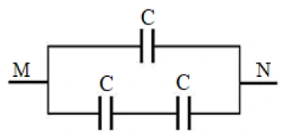
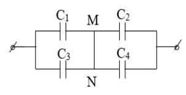
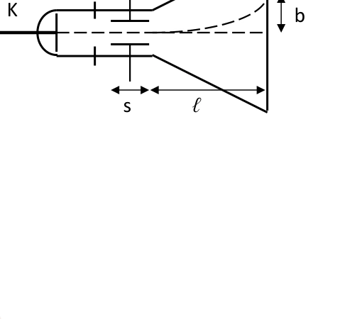
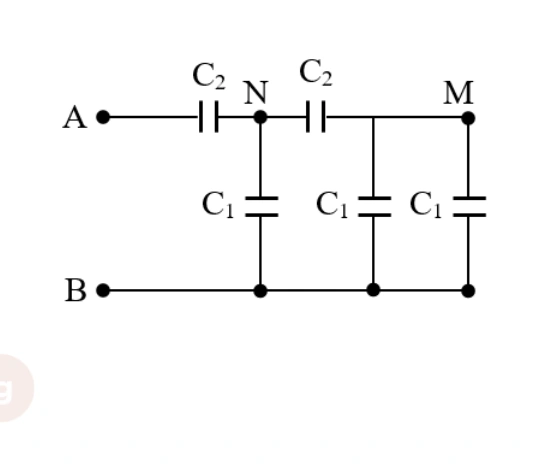

# Bài tập — Bài 8 — Ghép tụ và các bài toán tụ điện nâng cao

> Hệ bài tập được biên soạn theo các dạng xuất hiện trong bộ tài liệu Vật lí 11 của dự án. Câu hỏi được giữ ngắn, trực tiếp; độ khó tăng dần và không cố tình thêm dữ kiện gây nhiễu.

[← Trở lại bài học](../../08-advanced-capacitors.md)

## Phần A — Trắc nghiệm 4 lựa chọn

### Bài 1 — Mức 1 — Nhận biết

Hai tụ $C_1=3\,\mu$F, $C_2=6\,\mu$F mắc song song. Điện dung tương đương là

A. $2\,\mu$F.

B. $3\,\mu$F.

C. $9\,\mu$F.

D. $18\,\mu$F.

??? success "Đáp án và lời giải"
    Chọn **C**. Song song: $C_b=C_1+C_2$.

### Bài 2 — Mức 1 — Nhận biết

Hai tụ $3\,\mu$F và $6\,\mu$F mắc nối tiếp. Điện dung tương đương là

A. $2\,\mu$F.

B. $3\,\mu$F.

C. $9\,\mu$F.

D. $18\,\mu$F.

??? success "Đáp án và lời giải"
    Chọn **A**. $C_b=C_1C_2/(C_1+C_2)=18/9=2\,\mu$F.

### Bài 3 — Mức 1 — Nhận biết

Trong mạch hai tụ nối tiếp đã ổn định, độ lớn điện tích trên mỗi tụ

A. luôn bằng nhau nếu nút giữa cô lập ban đầu trung hòa.

B. tỉ lệ điện dung.

C. luôn bằng 0.

D. bằng hiệu điện thế.

??? success "Đáp án và lời giải"
    Chọn **A** trong cấu hình nối tiếp chuẩn.

### Bài 4 — Mức 1 — Nhận biết

Hai tụ song song đặt cùng hiệu điện thế U. Tụ có điện dung lớn hơn sẽ

A. có điện tích nhỏ hơn.

B. có điện tích lớn hơn.

C. có điện tích bằng nhau bắt buộc.

D. không tích điện.

??? success "Đáp án và lời giải"
    Chọn **B** vì $Q=CU$.

## Phần B — Đúng/Sai

### Bài 5 — Mức 2 — Thông hiểu

Ghép tụ điện:

a) Song song: hiệu điện thế trên các tụ bằng nhau.

b) Nối tiếp chuẩn: độ lớn điện tích trên các tụ bằng nhau.

c) Điện dung tương đương nối tiếp lớn hơn mọi điện dung thành phần.

d) Điện dung tương đương song song bằng tổng các điện dung.

??? success "Đáp án và lời giải"
    a) **Đúng**.
    b) **Đúng**.
    c) **Sai**: nhỏ hơn điện dung nhỏ nhất.
    d) **Đúng**.

### Bài 6 — Mức 2 — Thông hiểu

Một tụ cô lập sau khi ngắt khỏi nguồn:

a) Tổng điện tích trên mỗi bản được bảo toàn nếu không rò điện.

b) Thay đổi điện dung có thể làm hiệu điện thế thay đổi.

c) Nếu C tăng mà Q giữ nguyên thì năng lượng $Q^2/(2C)$ giảm.

d) Q luôn bằng CU với U không đổi bất kể thao tác.

??? success "Đáp án và lời giải"
    a) **Đúng**.
    b) **Đúng**.
    c) **Đúng**.
    d) **Sai**: U không nhất thiết không đổi khi đã ngắt nguồn.

## Phần C — Trả lời ngắn

### Bài 7 — Mức 3 — Vận dụng

Hai tụ $4\,\mu$F và $12\,\mu$F mắc nối tiếp vào $32$ V. Tính điện tích trên mỗi tụ và hiệu điện thế mỗi tụ.

??? success "Đáp án và lời giải"
    $C_b=4\cdot12/(4+12)=3\,\mu$F. $Q=C_bU=96\,\mu$C. Nối tiếp nên mỗi tụ có $|Q|=96\,\mu$C. $U_1=96/4=24$ V; $U_2=96/12=8$ V.

### Bài 8 — Mức 3 — Vận dụng

Hai tụ $2\,\mu$F và $3\,\mu$F mắc song song vào $20$ V. Tính điện tích từng tụ và tổng năng lượng.

??? success "Đáp án và lời giải"
    $Q_1=C_1U=40\,\mu$C; $Q_2=60\,\mu$C. $C_b=5\,\mu$F. $W=\frac12C_bU^2=0,5\cdot5\cdot10^{-6}\cdot400=1,0\cdot10^{-3}$ J.

### Bài 9 — Mức 3 — Vận dụng

Tụ $C_1=6\,\mu$F tích đến $12$ V rồi ngắt nguồn. Nối song song với tụ $C_2=3\,\mu$F ban đầu chưa tích điện, cùng cực tính. Tính hiệu điện thế cuối.

??? success "Đáp án và lời giải"
    Điện tích tổng bảo toàn: $Q_{tot}=C_1U_1=72\,\mu$C. Sau nối song song, $C_{tot}=9\,\mu$F. $U_f=Q_{tot}/C_{tot}=8$ V.

## Phần D — Vận dụng và vận dụng cao

### Bài 10 — Mức 4 — Vận dụng cao

Hai tụ $C_1=4\,\mu$F và $C_2=6\,\mu$F được tích riêng đến cùng hiệu điện thế $U=10$ V. Sau đó ngắt nguồn và nối bản dương của tụ 1 với bản âm của tụ 2, hai bản còn lại nối với nhau. Tính hiệu điện thế cuối về độ lớn.

??? success "Đáp án và lời giải"
    Đây là nối song song **ngược cực tính**. Chọn chiều điện tích dương của tụ 1 là dương. Điện tích đại số ban đầu trên nút nối tương ứng:

    $Q_{net}=C_1U-C_2U=(4-6)\cdot10=-20\,\mu$C.

    Sau khi nối, hai tụ có cùng độ lớn hiệu điện thế cuối và tổng điện dung $C_1+C_2=10\,\mu$F.

    $U_f=|Q_{net}|/(C_1+C_2)=20/10=2$ V.

    Chiều cực tính cuối theo tụ 2 vì $C_2U>C_1U$.

## Ngân hàng bài tập mở rộng

### Nhận biết — Trả lời ngắn

#### Bài 11

<!-- source-id: BT-Chuong-III-p165-q9-429 -->

Xét các tụ điện giống nhau có điện dung $C=20\,\mu\mathrm F$. Ghép các tụ thành bộ như hình và nối hai điểm M, N với nguồn có hiệu điện thế $U=12\,\mathrm V$. Điện tích của bộ tụ bằng bao nhiêu $\mathrm{mC}$?

{ loading=lazy }

??? success "Đáp án và lời giải"
    **Đáp án sau kiểm tra:** $0{,}36\,\mathrm{mC}$.

    **Hướng dẫn giải:**
    Nhánh trên có điện dung $C$; nhánh dưới gồm hai tụ $C$ nối tiếp nên có điện dung $C/2$. Hai nhánh song song:
    $C_{MN}=C+C/2=3C/2=30\,\mu\mathrm F$.
    Do đó $Q=C_{MN}U=30\cdot10^{-6}\cdot12=3{,}6\cdot10^{-4}\,\mathrm C=0{,}36\,\mathrm{mC}$.

    **Đối chiếu nguồn:** ô đáp án trong PDF để trống; kết quả trên được tính độc lập từ sơ đồ nguồn.

#### Bài 12

<!-- source-id: BT-Chuong-III-p165-q10-430 -->

Cho các tụ điện $C_1=C_2=C_3=C_4=5\,\mu\mathrm F$ được mắc thành mạch như hình. Xác định điện dung tương đương của bộ tụ theo $\mu\mathrm F$.

{ loading=lazy }

??? success "Đáp án và lời giải"
    **Đáp án sau kiểm tra:** $5\,\mu\mathrm F$.

    **Hướng dẫn giải:**
    M và N nối trực tiếp nên là cùng một nút. Vì vậy $C_1$ song song $C_3$ cho $10\,\mu\mathrm F$, còn $C_2$ song song $C_4$ cũng cho $10\,\mu\mathrm F$. Hai nhóm này nối tiếp nên
    $C_{\mathrm{eq}}=\dfrac{10\cdot10}{10+10}=5\,\mu\mathrm F$.

    **Đối chiếu nguồn:** ô đáp án trong PDF để trống; kết quả trên được tính độc lập từ sơ đồ nguồn.

#### Bài 13

<!-- source-id: BT-Chuong-III-p165-q11-431 -->

Ba tụ $C_1=2\cdot10^{-9}\,\mathrm F$, $C_2=4\cdot10^{-9}\,\mathrm F$, $C_3=6\cdot10^{-9}\,\mathrm F$ mắc nối tiếp. Hiệu
điện thế giới hạn của mỗi tụ là 500 V. Hiệu điện thế giới hạn của bộ tụ là bao nhiêu vôn?

??? success "Đáp án và lời giải"
    **Đáp án sau kiểm tra:** $916{,}7\,\mathrm V$ (xấp xỉ).

    **Hướng dẫn giải:**
    Ba tụ nối tiếp có cùng điện tích. Điều kiện giới hạn cho điện tích là
    $Q_{\max}=\min(C_1U_{1\max},C_2U_{2\max},C_3U_{3\max})=2\cdot10^{-9}\cdot500=10^{-6}\,\mathrm C$.
    Khi đó $U_1=500\,\mathrm V$, $U_2=250\,\mathrm V$, $U_3\approx166{,}7\,\mathrm V$, nên $U_{\max}\approx916{,}7\,\mathrm V$.

    **Đối chiếu nguồn:** ô đáp án trong PDF để trống; kết quả trên được tính độc lập.

#### Bài 14

<!-- source-id: BT-Chuong-III-p165-q12-432 -->

Hai tụ điện có điện dung và hiệu điện thế giới hạn lần lượt là $C_1=5\,\mu\mathrm F$, $U_{1\mathrm{gh}}=500\,\mathrm V$ và $C_2=10\,\mu\mathrm F$, $U_{2\mathrm{gh}}=1000\,\mathrm V$. Hiệu điện thế giới hạn của bộ tụ khi ghép nối tiếp bằng bao nhiêu vôn?

??? success "Đáp án và lời giải"
    **Đáp án sau kiểm tra:** $750\,\mathrm V$.

    **Hướng dẫn giải:**
    Khi ghép nối tiếp, hai tụ mang cùng độ lớn điện tích. Giới hạn điện tích là
    $Q_{\max}=\min(5\,\mu\mathrm F\cdot500\,\mathrm V,10\,\mu\mathrm F\cdot1000\,\mathrm V)=2{,}5\,\mathrm{mC}$.
    Khi đó $U_1=500\,\mathrm V$, $U_2=250\,\mathrm V$, nên hiệu điện thế giới hạn của bộ là $750\,\mathrm V$.

    **Đối chiếu nguồn:** ô đáp án trong PDF để trống; kết quả trên được tính độc lập.

#### Bài 15

<!-- source-id: BT-Chuong-III-p165-q13-433 -->

Electron thoát ra từ K, được tăng tốc bởi một điện trường đều giữa A và K rồi đi vào một tụ phẳng theo phương song song với hai bản như hình. Biết $s=6\,\mathrm{cm}$, $d=1{,}8\,\mathrm{cm}$, $\ell=15\,\mathrm{cm}$, $b=2{,}1\,\mathrm{cm}$; hiệu điện thế của tụ $U=50\,\mathrm V$. Bỏ qua tác dụng của trọng lực. Vận tốc electron khi bắt đầu đi vào tụ bằng bao nhiêu, theo đơn vị $10^6\,\mathrm{m/s}$?

{ loading=lazy }

??? success "Đáp án và lời giải"
    **Đáp án sau kiểm tra:** $15{,}9$ (đơn vị $10^6\,\mathrm{m/s}$, xấp xỉ).

    **Hướng dẫn giải:**
    Trong tụ, electron có gia tốc theo phương vuông góc với vận tốc ban đầu, có độ lớn $a=\dfrac{eU}{m_e d}$. Thời gian đi trong vùng bản tụ là $t_1=s/v$, nên độ lệch trong tụ là $y_1=as^2/(2v^2)$ và vận tốc lệch khi ra khỏi tụ là $v_y=as/v$.
    Trên quãng bay tự do $\ell$, độ lệch thêm là $y_2=v_y\ell/v=as\ell/v^2$. Vì $b=y_1+y_2$,
    $v=\sqrt{\dfrac{eUs(\ell+s/2)}{m_e d b}}\approx1{,}585\cdot10^7\,\mathrm{m/s}$.

    **Đối chiếu nguồn:** ô đáp án của Câu 13 trong PDF để trống; kết quả trên được tính độc lập với $e=1{,}6\cdot10^{-19}\,\mathrm C$ và $m_e=9{,}1\cdot10^{-31}\,\mathrm{kg}$.

#### Bài 16

<!-- source-id: BT-Chuong-III-p168-q2-457 -->

Hai tụ điện có điện dung $C_1=2\,\mu\mathrm F$, $C_2=3\,\mu\mathrm F$ lần lượt được tích điện đến hiệu điện thế $U_1=200\,\mathrm V$,
$U_2=400\,\mathrm V$. Sau đó nối hai cặp bản tích điện cùng dấu của hai tụ điện với nhau. Hiệu điện thế của bộ tụ có
giá trị bao nhiêu vôn?

??? success "Đáp án và lời giải"
    **Đáp án sau kiểm tra:** $320\,\mathrm V$.

    **Hướng dẫn giải:**
    Nối các bản cùng dấu nên điện tích toàn hệ được bảo toàn và hiệu điện thế cuối là
    $U=\dfrac{C_1U_1+C_2U_2}{C_1+C_2}=\dfrac{2\cdot200+3\cdot400}{2+3}=320\,\mathrm V$.

    **Đối chiếu nguồn:** ô đáp án trong PDF để trống; kết quả trên được tính độc lập.

#### Bài 17

<!-- source-id: BT-Chuong-III-p168-q5-460 -->

Trên vỏ tụ điện (1) ghi $4700\,\mu\mathrm F-35\,\mathrm V$ và tụ điện (2) ghi $3300\,\mu\mathrm F-25\,\mathrm V$. Hiệu điện thế tối đa của bộ tụ khi ghép nối tiếp hai tụ này bằng bao nhiêu vôn?

??? success "Đáp án và lời giải"
    **Đáp án sau kiểm tra:** $42{,}55\,\mathrm V$ (xấp xỉ).

    **Hướng dẫn giải:**
    Hai tụ nối tiếp có cùng độ lớn điện tích. Giới hạn là
    $Q_{\max}=\min(4700\,\mu\mathrm F\cdot35\,\mathrm V,3300\,\mu\mathrm F\cdot25\,\mathrm V)=82{,}5\,\mathrm{mC}$.
    Do đó $U_1=Q_{\max}/C_1\approx17{,}55\,\mathrm V$, $U_2=25\,\mathrm V$, nên $U_{\max}\approx42{,}55\,\mathrm V$.

    **Đối chiếu nguồn:** ô đáp án trong PDF để trống; kết quả trên được tính độc lập.

#### Bài 18

<!-- source-id: BT-Chuong-III-p168-q6-461 -->

Cho bộ tụ điện như hình dưới, $C_2=2C_1$, $U_{AB}=16\,\mathrm V$.
Hiệu điện thế giữa hai điểm M, B là bao nhiêu vôn?

{ loading=lazy }

??? success "Đáp án và lời giải"
    **Đáp án sau kiểm tra:** $4\,\mathrm V$.

    **Hướng dẫn giải:**
    Gọi $C_1=C$, khi đó $C_2=2C$. Từ M đến B có hai tụ $C_1$ song song nên $C_{MB}=2C$. Nhánh N–M có $C_2=2C$ nối tiếp với $C_{MB}=2C$, tương đương $C$; song song với tụ $C_1$ trực tiếp từ N xuống B nên $C_{NB}=2C$.
    Vì tụ A–N cũng có điện dung $C_2=2C$, hai phần A–N và N–B nối tiếp có điện dung bằng nhau nên $U_{NB}=8\,\mathrm V$. Trong nhánh N–M–B, hai phần đều có điện dung $2C$, nên chia đều $U_{NB}$ và $U_{MB}=4\,\mathrm V$.

    **Đối chiếu nguồn:** ô đáp án của Câu 6 trong PDF để trống; giá trị `1` trước đây không phù hợp với sơ đồ và đã được hiệu chỉnh sau khi tính độc lập.

