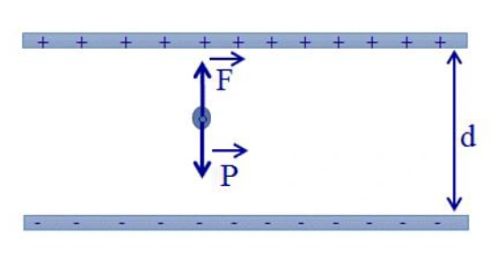
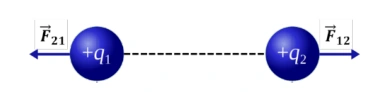
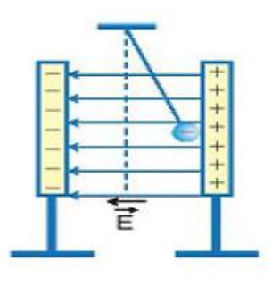

# Bài tập — Bài 9 — Cân bằng điện tích và con lắc trong điện trường

> Hệ bài tập được biên soạn theo các dạng xuất hiện trong bộ tài liệu Vật lí 11 của dự án. Câu hỏi được giữ ngắn, trực tiếp; độ khó tăng dần và không cố tình thêm dữ kiện gây nhiễu.

[← Trở lại bài học](../../09-electrostatic-equilibrium-charged-pendulum.md)

## Phần A — Trắc nghiệm 4 lựa chọn

### Bài 1 — Mức 1 — Nhận biết

Một quả cầu nhỏ khối lượng m, điện tích dương q treo bằng dây trong điện trường đều nằm ngang E. Ở cân bằng, dây lệch góc θ so với phương thẳng đứng. Hệ thức đúng là

A. $\tan\theta=mg/(qE)$.

B. $\tan\theta=qE/(mg)$.

C. $\sin\theta=qE/(mg)$ luôn đúng.

D. $\tan\theta=q/(mE)$.

??? success "Đáp án và lời giải"
    Chọn **B** từ cân bằng hai thành phần lực: $T\sin\theta=qE$, $T\cos\theta=mg$.

### Bài 2 — Mức 1 — Nhận biết

Nếu q âm trong điện trường ngang hướng sang phải, quả cầu cân bằng lệch về

A. bên phải.

B. bên trái.

C. không lệch.

D. lên trên.

??? success "Đáp án và lời giải"
    Chọn **B** vì lực điện ngược chiều E.

### Bài 3 — Mức 1 — Nhận biết

Trong điện trường đều thẳng đứng cùng chiều trọng lực, điện tích dương chịu gia tốc hiệu dụng về độ lớn

A. $g-qE/m$.

B. $g+qE/m$.

C. $qE/(mg)$.

D. luôn bằng g.

??? success "Đáp án và lời giải"
    Chọn **B** nếu lực điện cùng chiều trọng lực.

### Bài 4 — Mức 1 — Nhận biết

Hai điện tích dương giống nhau treo đối xứng bằng hai sợi dây. Khi điện tích tăng, các yếu tố khác giữ nguyên, góc lệch cân bằng thường

A. giảm.

B. tăng.

C. không đổi.

D. bằng 0.

??? success "Đáp án và lời giải"
    Chọn **B** vì lực đẩy Coulomb tăng.

## Phần B — Đúng/Sai

### Bài 5 — Mức 2 — Thông hiểu

Con lắc tích điện trong điện trường đều ngang:

a) Ở cân bằng, tổng lực bằng 0.

b) Có thể gộp trọng lực và lực điện thành một “trọng lực hiệu dụng” về mặt động lực học.

c) Nếu E ngang thì $g_{hiệu}=g+qE/m$ theo đại số một chiều.

d) Dấu điện tích quyết định phía lệch.

??? success "Đáp án và lời giải"
    a) **Đúng**.
    b) **Đúng**.
    c) **Sai**: hai gia tốc vuông góc nên $g_{hiệu}=\sqrt{g^2+(qE/m)^2}$.
    d) **Đúng**.

### Bài 6 — Mức 2 — Thông hiểu

Hai quả cầu nhỏ giống nhau tích điện cùng dấu, treo đối xứng:

a) Lực Coulomb là lực đẩy.

b) Ở cân bằng, thành phần ngang của lực căng cân bằng lực Coulomb.

c) Có thể bỏ trọng lực khi tính góc lệch mà không cần điều kiện.

d) Khoảng cách giữa hai quả cầu phụ thuộc chiều dài dây và góc lệch.

??? success "Đáp án và lời giải"
    a) **Đúng**.
    b) **Đúng**.
    c) **Sai**.
    d) **Đúng**.

## Phần C — Trả lời ngắn

### Bài 7 — Mức 3 — Vận dụng

Quả cầu $m=20$ g, $q=2\,\mu$C treo trong điện trường ngang $E=5\cdot10^4$ V/m. Lấy $g=10$ m/s². Tính góc lệch cân bằng.

??? success "Đáp án và lời giải"
    $qE=2\cdot10^{-6}\cdot5\cdot10^4=0,10$ N; $mg=0,20$ N. $\tan\theta=qE/(mg)=0,5$, nên $\theta\approx26,6^\circ$.

### Bài 8 — Mức 3 — Vận dụng

Với dữ kiện trên, tính lực căng dây ở cân bằng.

??? success "Đáp án và lời giải"
    $T=\sqrt{(mg)^2+(qE)^2}=\sqrt{0,20^2+0,10^2}=0,224$ N.

### Bài 9 — Mức 3 — Vận dụng

Một con lắc tích điện dương đặt trong điện trường thẳng đứng hướng xuống, $qE/m=2$ m/s², $g=10$ m/s². Tính chu kì góc nhỏ nếu $\ell=0,75$ m.

??? success "Đáp án và lời giải"
    Gia tốc hiệu dụng $g'=g+qE/m=12$ m/s². $T=2\pi\sqrt{\ell/g'}=2\pi\sqrt{0,75/12}=2\pi\cdot0,25=\pi/2\approx1,57$ s.

## Phần D — Vận dụng và vận dụng cao

### Bài 10 — Mức 4 — Vận dụng cao

Hai quả cầu nhỏ giống nhau, mỗi quả có khối lượng $m=10$ g và điện tích $q=0,20\,\mu$C, treo từ cùng một điểm bằng hai dây dài $\ell=0,50$ m. Ở cân bằng mỗi dây lệch góc nhỏ θ so với phương thẳng đứng. Lấy $g=10$ m/s², $k=9\cdot10^9$. Dùng gần đúng $\sin\theta\approx\tan\theta\approx\theta$ để ước tính θ.

??? success "Đáp án và lời giải"
    Khoảng cách hai quả cầu với góc nhỏ: $r\approx2\ell\theta$.

    Lực đẩy Coulomb:

    $F_e=kq^2/r^2\approx kq^2/(4\ell^2\theta^2)$.

    Cân bằng theo phương ngang: $mg\tan\theta\approx mg\theta=F_e$.

    Suy ra

    $mg\theta=\frac{kq^2}{4\ell^2\theta^2}$,

    $\theta^3=\frac{kq^2}{4mg\ell^2}$.

    Thay số: $q=2\cdot10^{-7}$ C, $m=0,01$ kg, $\ell=0,5$ m:

    $\theta^3=\frac{9\cdot10^9\cdot4\cdot10^{-14}}{4\cdot0,01\cdot10\cdot0,25}=0,0036$.

    $\theta\approx0,153$ rad $\approx8,8^\circ$. Giá trị khá nhỏ nên gần đúng góc nhỏ chấp nhận được ở mức ước tính.

## Ngân hàng bài tập mở rộng

### Nhận biết — Trả lời ngắn

#### Bài 11

<!-- source-id: BT-Chuong-III-p77-q3-201 -->

Một điện tích $80\,\mathrm{nC}$ lơ lửng trong không khí giữa hai bản kim loại song song, tích điện trái dấu, cách nhau $0{,}1\,\mathrm m$. Hiệu điện thế giữa hai bản là $4000\,\mathrm V$. Khối lượng của điện tích bằng bao nhiêu $\mathrm{mg}$?

??? success "Đáp án và lời giải"
    **Đáp án:** $32$

    **Hướng dẫn giải:**
    Điện tích chịu tác dụng của hai lực : Trọng lực
     ; lực điện

    Điều kiện cân bằng :

    Độ lớn

#### Bài 12

<!-- source-id: BT-Chuong-III-p78-q4-202 -->

Quả cầu nhỏ khối lượng $25\,\mathrm g$, mang điện tích $q=2{,}5\cdot10^{-7}\,\mathrm C$, được treo bởi một sợi dây không dãn, khối lượng không đáng kể và đặt trong một điện trường đều có phương nằm ngang, độ lớn $E=10^6\,\mathrm{V/m}$. Lấy $g=10\,\mathrm{m/s^2}$. Góc lệch của dây treo so với phương thẳng đứng khi vật ở vị trí cân bằng bằng bao nhiêu độ?

??? success "Đáp án và lời giải"
    **Đáp án:** $45$

    **Hướng dẫn giải:**

    Điện tích chịu tác dụng của ba lực : Trọng lực
     ; lực điện
     ; lực căng dây treo

    Điều kiện cân bằng :

    Từ hình vẽ ta có

#### Bài 13

<!-- source-id: BT-Chuong-III-p78-q5-203 -->

Một viên bi kim loại nhỏ có khối lượng $9\cdot10^{-5}\,\mathrm{kg}$, thể tích $10\,\mathrm{mm^3}$, được đặt trong dầu có khối lượng riêng $800\,\mathrm{kg/m^3}$. Hệ đặt trong điện trường đều $E=4{,}1\cdot10^5\,\mathrm{V/m}$ hướng thẳng đứng từ trên xuống; viên bi lơ lửng. Lấy $g=10\,\mathrm{m/s^2}$. Điện tích của viên bi bằng bao nhiêu $\mathrm{nC}$?

??? success "Đáp án và lời giải"
    **Đáp án:** 2

    **Hướng dẫn giải:**
    Điện tích chịu tác dụng của ba lực : Trọng lực
     ; lực điện
     ; lực đẩy archimedes

    Điều kiện cân bằng :

    Vì

    Nên lực điện cùng phương cùng chiều với lực đẩy archimedes
    Chiếu lên chiều dương ta có

#### Bài 14

<!-- source-id: BT-Chuong-III-p79-q6-204 -->

Trong vùng không gian giữa hai tấm kim loại phẳng, tích điện trái dấu nhau và cách nhau một đoạn $d=5\,\mathrm{cm}$, có một hạt bụi kim loại tích điện âm, khối lượng $m=2\cdot10^{-6}\,\mathrm g$, đang lơ lửng tại vị trí cách đều hai tấm kim loại như hình. Biết hiệu điện thế giữa hai tấm kim loại khi đó là $U=1000\,\mathrm V$. Nếu hiệu điện thế đột ngột giảm đến $U'=850\,\mathrm V$, lấy $g=10\,\mathrm{m/s^2}$. Thời gian để hạt bụi chạm đến một trong hai tấm kim loại nói trên là bao nhiêu giây? Kết quả làm tròn đến hàng phần trăm.

{ loading=lazy }

??? success "Đáp án và lời giải"
    **Đáp án:** $0{,}18$
    **Hướng dẫn giải:**

    Ở trạng thái cân bằng, tổng lực bằng 0; thường chiếu lực để có $T\cos\alpha=mg$, $T\sin\alpha=F_e$, nên $\tan\alpha=F_e/(mg)$.

    Ban đầu, điện tích chịu tác dụng của hai lực : Trọng lực
    Điều kiện cân bằng :
    Khi hiệu điện thế giảm đột ngột đến giá trị 850 V thì lực điện tác dụng lên điện tích giảm ⇒Điện tích
    chuyển động nhanh dần đều đến bản âm với gia tốc
    Thời gian hạt bụi chạm bản âm là

    Vậy kết quả cần tìm là **$0{,}18$**.
#### Bài 15

<!-- source-id: BT-Chuong-III-p91-q3-231 -->

Một hạt bụi có khối lượng $m=1\,\mathrm g$, mang điện tích $q=-2\cdot10^{-6}\,\mathrm C$, nằm cân bằng trong điện trường giữa hai bản kim loại tích điện trái dấu đặt song song, nằm ngang, cách nhau $d=4\,\mathrm{cm}$. Lấy $g=10\,\mathrm{m/s^2}$. Nếu điện tích hạt bụi giảm đi $20\%$, phải thay đổi hiệu điện thế giữa hai bản một lượng bao nhiêu vôn để hạt bụi vẫn cân bằng?

??? success "Đáp án và lời giải"
    **Đáp án:** $50$
    **Hướng dẫn giải:**

    Ở trạng thái cân bằng, tổng lực bằng 0; thường chiếu lực để có $T\cos\alpha=mg$, $T\sin\alpha=F_e$, nên $\tan\alpha=F_e/(mg)$.

    Hạt bụi nằm cân bằng trong điện trường đều dưới tác dụng hai lực: Trọng lực P
    có phương thẳng đứng
    hướng xuống, lực điện F
    có phương thẳng đứng hướng lên.
    hướng lên trên nên vecto cường độ điện trường E
    hướng xuống dưới.

    Vậy kết quả cần tìm là **$50$**.
#### Bài 16

<!-- source-id: BT-Chuong-III-p92-q4-232 -->

Một quả cầu khối lượng $m=1\,\mathrm g$ treo trên một sợi dây mảnh cách điện. Quả cầu nằm trong điện trường đều có phương nằm ngang, cường độ $E=2\cdot10^3\,\mathrm{V/m}$. Khi đó dây treo hợp với phương thẳng đứng một góc $60^\circ$. Hỏi sức căng của sợi dây là bao nhiêu N? Lấy $g=10\,\mathrm{m/s^2}$.

??? success "Đáp án và lời giải"
    **Đáp án:** $0{,}02\,\mathrm N$.

    **Hướng dẫn giải:**
    Ở trạng thái cân bằng, chiếu theo phương thẳng đứng: $T\cos60^\circ=mg$. Do đó
    $T=mg/\cos60^\circ=10^{-3}\cdot10/0{,}5=0{,}02\,\mathrm N$.

#### Bài 17

<!-- source-id: BT-Chuong-III-p93-q6-234 -->

Hai tấm kim loại phẳng nằm ngang nhiễm điện trái dấu đặt trong dầu; điện trường giữa hai bản hướng từ trên xuống dưới và có cường độ $20000\,\mathrm{V/m}$. Một quả cầu sắt bán kính $1\,\mathrm{cm}$ mang điện tích $q$ nằm lơ lửng giữa hai bản. Biết khối lượng riêng của sắt là $7800\,\mathrm{kg/m^3}$, của dầu là $800\,\mathrm{kg/m^3}$; lấy $g=10\,\mathrm{m/s^2}$. Độ lớn của $q$ bằng bao nhiêu $\mu\mathrm C$? Làm tròn đến hàng phần mười.

??? success "Đáp án và lời giải"
    **Đáp án:** $14{,}7$
    **Hướng dẫn giải:**

    Ở trạng thái cân bằng, tổng lực bằng 0; thường chiếu lực để có $T\cos\alpha=mg$, $T\sin\alpha=F_e$, nên $\tan\alpha=F_e/(mg)$.

    - Các lực tác dụng lên quả cầu:
    +Lực đẩy Ac-si-met
    +Lực điện trường:
    (hướng xuống nếu q > 0; hướng lên nếu q < 0).
    - Quả cầu nằm cân bằng (lơ lửng) khi:

    Vậy kết quả cần tìm là **$14{,}7$**.
### Nhận biết — Trắc nghiệm 4 lựa chọn

#### Bài 18

<!-- source-id: BT-Chuong-III-p5-q6-6 -->

Xét hai điện tích điểm $q_1,q_2$ có cặp lực tương tác tĩnh điện $\vec F_{12}$ và $\vec F_{21}$ được biểu diễn trong hình dưới. Cặp lực này là hai lực

{ loading=lazy }

A. cân bằng.

B. trực đối.

C. nằm ngang.

D. cùng hướng.

??? success "Đáp án và lời giải"
    **Đáp án:** B.

    **Hướng dẫn giải:**
    Cặp lực này cùng phương, ngược chiều, cùng độ lớn nhưng tác dụng lên hai vật khác nhau nên là cặp lực trực đối.

#### Bài 19

<!-- source-id: BT-Chuong-III-p68-q13-186 -->

Một hạt bụi tích điện có khối lượng $m=3\cdot10^{-6}\,\mathrm g$ nằm cân bằng trong điện trường đều thẳng đứng hướng xuống có cường độ $E=2000\,\mathrm{V/m}$. Lấy $g=10\,\mathrm{m/s^2}$. Điện tích hạt bụi là

A. $15\cdot10^{-9}\,\mathrm C$.

B. $-15\cdot10^{-12}\,\mathrm C$.

C. $-15\cdot10^{-9}\,\mathrm C$.

D. $15\cdot10^{-12}\,\mathrm C$.

??? success "Đáp án và lời giải"
    **Đáp án:** B

    **Hướng dẫn giải:**
    Hạt bụi cân bằng dưới tác dụng của trọng lực và lực điện. Vì $\vec E$ hướng xuống còn lực điện phải hướng lên để cân bằng trọng lực nên $q<0$.
    $|q|E=mg\Rightarrow q=-\dfrac{mg}{E}=-\dfrac{3\cdot10^{-9}\cdot10}{2000}=-15\cdot10^{-12}\,\mathrm C$.
    Chọn B.

#### Bài 20

<!-- source-id: BT-Chuong-III-p68-q14-187 -->

Quả cầu nhỏ khối lượng $20\,\mathrm g$ mang điện tích $10^{-7}\,\mathrm C$ được treo bằng dây mảnh trong điện trường đều có $\vec E$ nằm ngang. Khi cân bằng, dây treo hợp với phương đứng góc $\alpha=30^\circ$; lấy $g=10\,\mathrm{m/s^2}$. Độ lớn cường độ điện trường là

A. $1{,}15\cdot10^6\,\mathrm{V/m}$.

B. $2{,}5\cdot10^6\,\mathrm{V/m}$.

C. $3{,}5\cdot10^6\,\mathrm{V/m}$.

D. $2{,}7\cdot10^5\,\mathrm{V/m}$.

??? success "Đáp án và lời giải"
    **Đáp án:** A

    **Hướng dẫn giải:**
    Khi cân bằng: $T\sin\alpha=qE$, $T\cos\alpha=mg$, nên
    $\tan\alpha=\dfrac{qE}{mg}$.
    Do đó
    $E=\dfrac{mg}{q}\tan30^\circ=\dfrac{0{,}02\cdot10}{10^{-7}}\tan30^\circ\approx1{,}15\cdot10^6\,\mathrm{V/m}$.
    Chọn A.

#### Bài 21

<!-- source-id: BT-Chuong-III-p84-q13-219 -->

Quả cầu nhỏ $m=0{,}5\,\mathrm g$, mang điện tích $q_1=0{,}5\times10^{-8}\,\mathrm C$ treo trên một sợi dây mảnh trong điện trường đều có phương nằm ngang. Cường độ điện trường $E=10^6\,\mathrm{V/m}$. Lấy $g=10\,\mathrm{m/s^2}$. Góc lệch của dây so với phương thẳng đứng là

A. $15^\circ$.

B. $30^\circ$.

C. $45^\circ$.

D. $60^\circ$.

??? success "Đáp án và lời giải"
    **Đáp án:** C ($45^\circ$).

    **Hướng dẫn giải:**
    Ở trạng thái cân bằng, lực điện nằm ngang và trọng lực thẳng đứng nên

    $\tan\alpha=\dfrac{|q_1|E}{mg}$.

    Thay số:

    $\tan\alpha=\dfrac{0{,}5\times10^{-8}\cdot10^6}{0{,}5\times10^{-3}\cdot10}=1$.

    Suy ra $\alpha=45^\circ$, chọn **C**.

!!! warning "Đối chiếu nguồn"
    Câu dẫn PDF bị thiếu giá trị $q_1$. Trong lời giải, nguồn in $0{,}5\times10^{-4}$ C nhưng ngay sau đó lại tính tỉ số lực bằng $1$ và tô $45^\circ$. Với toàn bộ các số còn lại giữ nguyên, giá trị duy nhất làm chính phép tính đó đúng là $q_1=mg/E=5\times10^{-9}$ C $=0{,}5\times10^{-8}$ C. Bản learner-facing phục hồi dữ kiện này và sửa riêng số mũ bị in sai trong lời giải nguồn.

#### Bài 22

<!-- source-id: BT-Chuong-III-p85-q15-221 -->

Hạt bụi tích điện nằm lơ lửng trong điện trường. Cho biết gia tốc rơi tự do là $10\,\mathrm{m/s^2}$. Nếu điện tích hạt bụi giảm đi $10\%$ giá trị độ lớn thì gia tốc của hạt bụi thu được bằng

A. $9\,\mathrm{m/s^2}$.

B. $2\,\mathrm{m/s^2}$.

C. $8\,\mathrm{m/s^2}$.

D. $1\,\mathrm{m/s^2}$.

??? success "Đáp án và lời giải"
    **Đáp án:** D
    **Hướng dẫn giải:**

    Ở trạng thái cân bằng, tổng lực bằng 0; thường chiếu lực để có $T\cos\alpha=mg$, $T\sin\alpha=F_e$, nên $\tan\alpha=F_e/(mg)$.

    Khi điện tích giảm đi 10%, thì q’ = 0,9q.
    Áp dụng định luât II Newton:
    Chiếu theo chiều dương hướng xuống:

    Đối chiếu kết quả với các lựa chọn, phương án phù hợp là **D. 1 $\mathrm{m/s^2}$.**
#### Bài 23

<!-- source-id: BT-Chuong-III-p86-q18-224 -->

Hiệu điện thế giữa hai bản tụ điện phẳng bằng $U=300\,\mathrm V$. Một hạt bụi nằm cân bằng giữa hai bản và cách bản dưới $d_1=0{,}8\,\mathrm{cm}$. Nếu đột ngột hiệu điện thế giữa hai bản giảm đi $\Delta U=60\,\mathrm V$ thì hạt bụi sẽ rơi xuống bản dưới sau khoảng thời gian

A. $0{,}9\,\mathrm s$.

B. $0{,}19\,\mathrm s$.

C. $0{,}09\,\mathrm s$.

D. $0{,}29\,\mathrm s$.

??? success "Đáp án và lời giải"
    **Đáp án:** C

    **Hướng dẫn giải:**
    Ban đầu hạt bụi cân bằng nên $mg=qU/d$. Sau khi hiệu điện thế giảm còn $U-\Delta U$, lực điện giảm; hợp lực hướng xuống có độ lớn
    $F=mg-q\dfrac{U-\Delta U}{d}=q\dfrac{\Delta U}{d}$.
    Từ điều kiện ban đầu suy ra gia tốc rơi
    $a=\dfrac{F}{m}=g\dfrac{\Delta U}{U}=10\cdot\dfrac{60}{300}=2\,\mathrm{m/s^2}$.
    Với $d_1=0{,}8\,\mathrm{cm}=0{,}008\,\mathrm m$ và vận tốc đầu bằng 0:
    $d_1=\dfrac12at^2\Rightarrow t=\sqrt{\dfrac{2d_1}{a}}\approx0{,}089\,\mathrm s\approx0{,}09\,\mathrm s$.
    Chọn C.

### Nhận biết — Đúng/Sai

#### Bài 24

<!-- source-id: BT-Chuong-III-p15-q6-47 -->

Hai quả cầu nhỏ được tích điện như nhau và treo cạnh nhau bằng hai sợi dây mảnh ở trong không khí, mỗi quả có khối lượng $1{,}5\,\mathrm g$. Ở trạng thái cân bằng, hai quả cầu cách nhau $2{,}6\,\mathrm{cm}$ và dây treo tạo với phương thẳng đứng góc $20^\circ$. Lấy $g=9{,}8\,\mathrm{m/s^2}$.

a) Không thể kết luận hai quả cầu mang điện tích dương hay điện tích âm.

b) Đối với quả cầu A, trọng lực trực đối với hợp lực của lực điện và lực căng dây.

c) Lực điện tương tác giữa hai quả cầu có độ lớn khoảng $5{,}35\,\mathrm{mN}$.

d) Độ lớn điện tích của hai quả cầu nhỏ hơn $2\,\mu\mathrm C$.

??? success "Đáp án và lời giải"
    **Đáp án đã hiệu chỉnh:** a) Đúng; b) Đúng; c) Đúng; d) Đúng.

    **Hướng dẫn giải:**

    a) **Đúng.** Hai quả cầu lệch ra xa nhau nên lực điện là lực đẩy; vì thế hai điện tích cùng dấu. Dữ kiện chưa đủ để kết luận cùng dương hay cùng âm.

    b) **Đúng.** Ở trạng thái cân bằng, $\vec P+\vec T+\vec F_e=\vec0$, hay $\vec P=-(\vec T+\vec F_e)$. Do đó trọng lực trực đối với hợp lực của lực căng và lực điện.

    c) **Đúng.** Chiếu theo phương ngang và thẳng đứng: $F_e=T\sin\alpha$, $mg=T\cos\alpha$, nên $F_e=mg\tan\alpha\approx1{,}5\times10^{-3}\cdot9{,}8\tan20^\circ\approx5{,}35\ \text{mN}$.

    d) **Đúng.** Từ $F_e=kq^2/r^2$, suy ra $|q|=\sqrt{F_er^2/k}\approx2{,}0\times10^{-8}$ C $=0{,}020\ \mu\text{C}<2\ \mu\text{C}$.

    !!! warning "Đối chiếu nguồn"
        Bảng đáp án PDF đánh dấu ý b) sai, nhưng điều kiện cân bằng vector cho trực tiếp $\vec P=-(\vec T+\vec F_e)$. Vì vậy ý b) được hiệu chỉnh thành đúng.
#### Bài 25

<!-- source-id: BT-Chuong-III-p21-q1-72 -->

Hai vật nhỏ được tích điện giống nhau $q_1=q_2=10^{-6}\,\mathrm C$, ban đầu được đặt trong không khí và giữ ở vị trí cách nhau $2\,\mathrm{cm}$. Giả sử hai vật chỉ chịu tác dụng của lực tương tác tĩnh điện giữa chúng.

a) Hai vật nhỏ tích điện cùng dấu nên đẩy nhau.

b) Khi thả tự do thì hai vật sẽ chuyển động về hai hướng ngược nhau, trên đường nối đi qua tâm của hai vật.

c) Lực tĩnh điện do $q_1$ tác dụng lên $q_2$ và lực tĩnh điện do $q_2$ tác dụng lên $q_1$ là hai lực cân bằng.

d) Với $k=9\cdot10^9\,\mathrm{N\,m^2/C^2}$, lực tương tác giữa hai vật có độ lớn là $22{,}5\,\mathrm N$.

??? success "Đáp án và lời giải"
    **Đáp án:** a) Đúng; b) Đúng; c) Sai; d) Đúng.

    **Hướng dẫn giải:**
    a) **Đúng.** Hai điện tích cùng dấu nên đẩy nhau.

    b) **Đúng.** Hai lực tương tác cùng phương, ngược chiều và cùng độ lớn nên hai vật chuyển động theo hai hướng ngược nhau trên đường nối tâm.

    c) **Sai.** Đây là hai lực trực đối tác dụng lên hai vật khác nhau, không phải hai lực cân bằng trên cùng một vật.

    d) **Đúng.** $F=kq^2/r^2=9\cdot10^9(10^{-6})^2/(0{,}02)^2=22{,}5\,\mathrm N$.

#### Bài 26

<!-- source-id: BT-Chuong-III-p21-q2-73 -->

Hai quả cầu kim loại nhỏ có cùng kích thước, cùng khối lượng $90\,\mathrm g$, được treo vào cùng một điểm bằng hai sợi dây mảnh cách điện có cùng chiều dài $1{,}5\,\mathrm m$. Truyền cho mỗi quả cầu điện tích $2{,}4\cdot10^{-7}\,\mathrm C$ thì chúng đẩy nhau ra xa; khi cân bằng, hai điện tích cách nhau một đoạn $a$. Coi góc lệch của hai sợi dây so với phương thẳng đứng là rất nhỏ. Lấy $g=10\,\mathrm{m/s^2}$.

a) Lực đẩy do hai quả cầu tác dụng lên nhau có phương, chiều và độ lớn như nhau.

b) Khoảng cách từ vị trí của mỗi quả cầu khi cân bằng đến vị trí ban đầu là như nhau.

c) Khoảng cách $a=12\,\mathrm{cm}$.

d) Nếu nhúng cả hệ như cũ vào dầu có hằng số điện môi là $2$, khoảng cách $a$ sẽ giảm đi $1\,\mathrm{cm}$.

??? success "Đáp án và lời giải"
    **Đáp án:** a) Sai; b) Đúng; c) Đúng; d) Sai.

    **Hướng dẫn giải:**
    a) **Sai.** Hai lực có cùng phương, ngược chiều và cùng độ lớn.

    b) **Đúng.** Hai quả cầu có cùng khối lượng và điện tích nên cấu hình cân bằng đối xứng.

    c) **Đúng.** Với góc nhỏ, $\tan\alpha\approx\sin\alpha=a/(2l)$ và $F_d=kq^2/a^2$. Từ $\tan\alpha=F_d/(mg)$ suy ra
    $a=\sqrt[3]{\dfrac{2lkq^2}{mg}}=0{,}12\,\mathrm m=12\,\mathrm{cm}$.

    d) **Sai.** Trong dầu $\varepsilon=2$,
    $a'=\sqrt[3]{\dfrac{2lkq^2}{\varepsilon mg}}\approx0{,}095\,\mathrm m=9{,}5\,\mathrm{cm}$,
    nên $\Delta a=12-9{,}5=2{,}5\,\mathrm{cm}$, không phải $1\,\mathrm{cm}$.

#### Bài 27

<!-- source-id: BT-Chuong-III-p23-q4-75 -->

Một hệ gồm ba điện tích điểm dương $q$ giống nhau nằm ở ba đỉnh của một tam giác đều. Đặt thêm một điện tích điểm $Q$ sao cho hệ nằm cân bằng.

a) Khoảng cách giữa các điện tích điểm $q$ là như nhau.

b) Hệ ba điện tích điểm $q$ tương tác hút với nhau theo từng cặp.

c) Để hệ nằm cân bằng, điện tích điểm $Q$ phải nằm ở tâm của tam giác.

d) Điện tích $Q$ có giá trị là $Q=-\dfrac{q}{\sqrt3}$.

??? success "Đáp án và lời giải"
    **Đáp án:** a) Đúng; b) Sai; c) Đúng; d) Đúng.

    **Hướng dẫn giải:**

    a) **Đúng.** Ba điện tích $q$ đặt ở ba đỉnh tam giác đều nên khoảng cách giữa từng cặp bằng nhau.

    b) **Sai.** Cả ba điện tích đều dương nên từng cặp **đẩy** nhau, không hút nhau.

    c) **Đúng.** Do tính đối xứng, điện tích $Q$ phải đặt tại tâm tam giác để lực do $Q$ lên ba điện tích đỉnh có cùng độ lớn và đúng phương cân bằng hợp lực đẩy.

    d) **Đúng.** Xét một đỉnh: hợp lực của hai lực đẩy bằng $2(kq^2/a^2)\cos30^\circ=\sqrt3kq^2/a^2$. Khoảng cách từ tâm đến đỉnh là $a/\sqrt3$, nên lực hút của $Q$ là $3kq|Q|/a^2$. Cân bằng cho $|Q|=q/\sqrt3$; $Q$ phải âm, do đó $Q=-q/\sqrt3$.
#### Bài 28

<!-- source-id: BT-Chuong-III-p72-q1-194 -->

Một hạt bụi khối lượng $m=10^{-8}\,\mathrm g$, nằm cân bằng trong điện trường đều có phương thẳng đứng, hướng xuống, cường độ $E=10^3\,\mathrm{V/m}$. Lấy $g=10\,\mathrm{m/s^2}$.

a) Hạt bụi chịu tác dụng của trọng lực và lực điện.

b) Lực điện tác dụng lên hạt bụi có phương thẳng đứng chiều từ trên xuống dưới.

c) Hạt bụi mang điện tích âm.

d) Độ lớn điện tích của hạt bụi là $10^{-13}\,\mathrm C$.

??? success "Đáp án và lời giải"
    **Đáp án:** a) Đúng; b) Sai; c) Đúng; d) Đúng.

    **Hướng dẫn giải:**

    a) **Đúng.** Hạt nằm cân bằng nên hợp lực bằng $0$.

    b) **Sai.** Trọng lực hướng xuống, vì vậy lực điện phải hướng lên để cân bằng trọng lực.

    c) **Đúng.** Từ chiều điện trường trong hình và chiều lực điện hướng lên, suy ra điện tích của hạt phải âm.

    d) **Đúng.** Ở cân bằng $|q|E=mg$, nên $|q|=mg/E=10^{-13}$ C theo dữ kiện đề.
#### Bài 29

<!-- source-id: BT-Chuong-III-p73-q2-195 -->

Trong thí nghiệm về điện trường, người ta tạo ra một điện trường đều $E=10^5\,\mathrm{V/m}$ giữa hai bản kim loại, có phương nằm ngang và hướng từ tấm bên phải (+) sang tấm bên trái (-). Một viên bi nhỏ khối lượng $0{,}1\,\mathrm g$, tích điện âm $q=-10^{-8}\,\mathrm C$, được móc bằng dây chỉ xem như không dãn có chiều dài $l=50\,\mathrm{cm}$ và treo vào giá như hình. Lấy $g=10\,\mathrm{m/s^2}$; khoảng cách hai bản đủ rộng để bi không va chạm nếu cho dao động.

{ loading=lazy }

a) Lực tác dụng lên viên bi gồm có trọng lực $\vec P$ và lực điện $\vec F$.

b) Góc lệch giữa dây treo và phương thẳng đứng khi bi đứng cân bằng là $30^\circ$.

c) Nếu cho con lắc dao động thì chu kì dao động của nó là $1{,}181\,\mathrm s$.

d) Khi bi đang cân bằng, nếu đổi dấu điện tích của hai bản kim loại nhưng giữ nguyên độ lớn của cường độ điện trường thì viên bi sẽ dao động với tốc độ cực đại bằng $3{,}76\,\mathrm{m/s}$.

??? success "Đáp án và lời giải"
    **Đáp án theo nguồn:** a) Sai; b) Sai; c) Đúng; d) Đúng.

    **Hướng dẫn giải:**

    a) Ngoài trọng lực $\vec P$ và lực điện $\vec F$, viên bi còn chịu lực căng dây $\vec T$.

    b) Ở vị trí cân bằng, $\tan\alpha=\dfrac{|q|E}{mg}=1$, nên $\alpha=45^\circ$, không phải $30^\circ$.

    c) Gia tốc biểu kiến có độ lớn $g_{\mathrm{bk}}=\sqrt{g^2+(qE/m)^2}=14{,}142\,\mathrm{m/s^2}$. Do đó $T=2\pi\sqrt{l/g_{\mathrm{bk}}}=1{,}181\,\mathrm s$.

    d) Theo hướng dẫn nguồn, sau khi đổi dấu hai bản, vị trí cân bằng mới đối xứng với vị trí cân bằng cũ qua phương thẳng đứng, biên độ góc là $90^\circ$. Khi đó $v_{\max}=\sqrt{2g_{\mathrm{bk}}l(1-\cos90^\circ)}\approx3{,}76\,\mathrm{m/s}$.

#### Bài 30

<!-- source-id: BT-Chuong-III-p74-q3-196 -->

Một hòn bi kim loại nhỏ được đặt trong dầu. Bi có thể tích $V=10\,\mathrm{mm^3}$, khối lượng $m=9\cdot10^{-5}\,\mathrm{kg}$. Dầu có khối lượng riêng $D=800\,\mathrm{kg/m^3}$. Hệ được đặt trong điện trường đều $E=4{,}1\cdot10^5\,\mathrm{V/m}$ hướng thẳng đứng từ trên xuống. Cho $g=10\,\mathrm{m/s^2}$. Hòn bi cân bằng trong dầu.

a) Các lực tác dụng lên hòn bi gồm trọng lực, lực điện và lực đẩy Ac-si-met.

b) Độ lớn trọng lực nhỏ hơn độ lớn lực đẩy Ac-si-met.

c) Lực điện tác dụng lên bi hướng lên trên.

d) Điện tích của bi là $q=-4\cdot10^{-9}\,\mathrm C$.

??? success "Đáp án và lời giải"
    **Đáp án:** a) Đúng; b) Sai; c) Đúng; d) Sai.

    **Hướng dẫn giải:**

    Đổi $V=10\ \text{mm}^3=10^{-8}\ \text{m}^3$. Trọng lực $P=mg=9\times10^{-4}$ N; lực đẩy Ác-si-mét $F_A=\rho Vg=800\cdot10^{-8}\cdot10=8\times10^{-5}$ N.

    a) **Đúng.** Hòn bi chịu trọng lực, lực đẩy Ác-si-mét và lực điện.

    b) **Sai.** $P=9\times10^{-4}$ N lớn hơn $F_A=8\times10^{-5}$ N.

    c) **Đúng.** Để cân bằng, lực điện phải hướng lên. Vì $\vec E$ hướng xuống nên điện tích của bi âm.

    d) **Sai.** Điều kiện cân bằng $F_e+F_A=P$ cho $F_e=8{,}2\times10^{-4}$ N. Với $E=4{,}1\times10^5$ V/m, $q=-F_e/E=-2{,}0\times10^{-9}$ C, không phải $-4\times10^{-9}$ C.
#### Bài 31

<!-- source-id: BT-Chuong-III-p75-q4-197 -->

Một quả cầu nhỏ mang điện tích đang cân bằng trong điện trường đều do tác dụng của trọng lực và lực điện trường. Đột ngột giảm độ lớn điện trường còn một nửa nhưng vẫn giữ nguyên phương và chiều của đường sức điện. Lấy $g=10\,\mathrm{m/s^2}$.

a) Lúc đầu độ lớn lực điện tác dụng lên quả cầu là $F_\mathrm{đ}=P$.

b) Khi đột ngột giảm độ lớn điện trường còn một nửa thì quả cầu vẫn cân bằng trong điện trường.

c) Khi đột ngột giảm điện trường, quả cầu sẽ chuyển động theo hướng của trọng lực với gia tốc $5\,\mathrm{m/s^2}$.

d) Thời gian để quả cầu di chuyển được $5\,\mathrm{cm}$ trong điện trường là $0{,}14\,\mathrm s$.

??? success "Đáp án và lời giải"
    **Đáp án:** a) Đúng; b) Sai; c) Đúng; d) Đúng.

    **Hướng dẫn giải:**

    a) **Đúng.** Ban đầu vật cân bằng nên $F_\mathrm{đ}=P=mg$.

    b) **Sai.** Khi cường độ điện trường giảm còn một nửa, lực điện chỉ còn $mg/2$, không đủ cân bằng trọng lực.

    c) **Đúng.** Hợp lực hướng xuống có độ lớn $mg-mg/2=mg/2$, nên $a=g/2=5\,\mathrm{m/s^2}$.

    d) **Đúng.** Từ trạng thái nghỉ, $s=at^2/2$ với $s=0{,}05\,\mathrm m$, nên $t=\sqrt{2s/a}=\sqrt{0{,}10/5}\approx0{,}141\,\mathrm s\approx0{,}14\,\mathrm s$.

#### Bài 32

<!-- source-id: BT-Chuong-III-p88-q2-226 -->

Người ta dùng hai bản kim loại tích điện trái dấu đặt nằm ngang và song song với nhau, cách nhau $10\,\mathrm{cm}$. Ở gần sát với bản trên có một giọt thủy ngân tích điện dương $q$ nằm lơ lửng khi hiệu điện thế giữa hai bản là $U$.

a) Điện trường trong khoảng không gian giữa hai bản kim loại nói trên là điện trường đều.

b) Bản nhiễm điện dương nằm ở phía dưới.

c) Nếu điện tích giọt thủy ngân giảm chỉ còn $0{,}5q$ thì giọt thủy ngân sẽ chuyển động đi lên theo phương thẳng đứng.

d) Nếu hiệu điện thế giữa hai bản chỉ còn $0{,}5U$ (điện tích của giọt thủy ngân vẫn là $q$, chiều điện trường không thay đổi) thì vận tốc của giọt thủy ngân khi chạm vào bản kim loại theo chiều dịch chuyển là $5\,\mathrm{m/s}$.

??? success "Đáp án và lời giải"
    **Đáp án theo nguồn:** a) Đúng; b) Đúng; c) Sai; d) Sai.

    **Hướng dẫn giải:**

    a) Hai bản tích điện trái dấu, song song với nhau nên điện trường giữa hai bản được xem là điện trường đều.

    b) Ban đầu giọt thủy ngân cân bằng. Trọng lực hướng xuống nên lực điện phải hướng lên. Vì giọt mang điện dương, $\vec E$ cũng hướng lên; do đó bản dương ở phía dưới và bản âm ở phía trên.

    c) Khi điện tích chỉ còn $0{,}5q$, lực điện giảm còn một nửa trong khi trọng lực không đổi, nên giọt chuyển động xuống dưới, không phải đi lên.

    d) Ban đầu $qU/d=P$. Khi $U$ giảm còn $0{,}5U$, hợp lực hướng xuống bằng $0{,}5P$, nên $a=g/2=5\,\mathrm{m/s^2}$. Với $d=0{,}10\,\mathrm m$ và xuất phát từ nghỉ, $v=\sqrt{2ad}=1\,\mathrm{m/s}$; vì vậy phát biểu $5\,\mathrm{m/s}$ là sai.

### Thông hiểu — Trắc nghiệm 4 lựa chọn

#### Bài 33

<!-- source-id: BT-Chuong-III-p8-q23-23 -->

Hai quả cầu nhẹ cùng khối lượng được treo gần nhau bằng hai dây cách điện có cùng chiều dài và
hai quả cầu không chạm nhau. Tích cho hai quả cầu điện tích cùng dấu nhưng có độ lớn khác nhau thì lực
tác dụng làm dây treo hai điện tích lệch đi những góc so với phương thẳng đứng. Nhận định nào sau đây là
đúng?

A. Quả cầu nào tích điện có độ lớn điện tích lớn hơn thì có góc lệch lớn hơn.

B. Quả cầu nào tích điện có độ lớn điện tích nhỏ hơn thì có góc lệch nhỏ hơn.

C. Quả cầu nào tích điện có độ lớn điện tích lớn hơn thì có góc lệch nhỏ hơn.

D. Góc lệch của hai quả cầu bằng nhau.

??? success "Đáp án và lời giải"
    **Đáp án:** D
    **Hướng dẫn giải:**
    Mặc dù hai quả cầu được tích điện có độ lớn khác nhau nhưng lực tương tác giữa chúng là như nhau. Do
    đó làm cho hai quả cầu lệch với những góc bằng nhau.

#### Bài 34

<!-- source-id: BT-Chuong-III-p8-q24-24 -->

Ba điện tích điểm chỉ có thể nằm cân bằng dưới tác dụng của các lực điện khi ba điện tích

A. cùng loại nằm ở ba đỉnh của một tam giác đều.

B. không cùng loại nằm ở ba đỉnh của một tam giác đều.

C. không cùng loại nằm trên cùng một đường thẳng.

D. cùng loại nằm trên cùng một đường thẳng.

??? success "Đáp án và lời giải"
    **Đáp án:** C
    **Hướng dẫn giải:**
    Ba điện tích nằm cân bằng thì những lực điện tác dụng lên mỗi điện tích cân bằng lẫn nhau (Tức là các lực
    tác dụng lên mỗi điện tích cùng phương, ngược chiều và có độ lớn bằng nhau). Điều đó có nghĩa là tất cả
    các lực phải có cùng một giá hay ba điện tích phải nằm trên cùng một đường thẳng, và các điện tích không
    thể cùng dấu.

### Vận dụng — Trắc nghiệm 4 lựa chọn

#### Bài 35

<!-- source-id: BT-Chuong-III-p12-q39-39 -->

Hai quả cầu nhỏ giống nhau, có cùng khối lượng $2{,}5\,\mathrm g$, điện tích $5\cdot10^{-7}\,\mathrm C$, được treo tại cùng một điểm bằng hai dây mảnh. Do lực đẩy tĩnh điện, hai quả cầu tách ra xa nhau một đoạn $60\,\mathrm{cm}$. Lấy $g=10\,\mathrm{m/s^2}$. Góc lệch của dây so với phương thẳng đứng là

A. $14^\circ$.

B. $30^\circ$.

C. $45^\circ$.

D. $60^\circ$.

??? success "Đáp án và lời giải"
    **Đáp án:** A.

    **Hướng dẫn giải:**
    Ở trạng thái cân bằng, $\tan\alpha=F_d/(mg)$ với
    $F_d=kq^2/r^2=9\cdot10^9(5\cdot10^{-7})^2/0{,}6^2$. Suy ra $\tan\alpha=0{,}25$ và $\alpha\approx14^\circ$.

#### Bài 36

<!-- source-id: BT-Chuong-III-p13-q41-41 -->

Một điện tích $q$ đặt tại điểm chính giữa đoạn thẳng nối hai điện tích $Q$ bằng nhau. Hệ ba điện tích sẽ cân bằng nếu $q$ có giá trị là

A. $-Q/2$.

B. $-Q/4$.

C. $Q/2$.

D. $Q/4$.

??? success "Đáp án và lời giải"
    **Đáp án:** B.

    **Hướng dẫn giải:**
    Điện tích ở giữa phải trái dấu với $Q$. Xét cân bằng của một điện tích $Q$ ở đầu:
    $kQ^2/r^2=k|Qq|/(r/2)^2\Rightarrow|q|=|Q|/4$.
    Vì trái dấu nên $q=-Q/4$.

### Vận dụng — Đúng/Sai

#### Bài 37

<!-- source-id: BT-Chuong-III-p14-q3-44 -->

Cho hai điện tích điểm $q_1=6\,\mu\mathrm C$ và $q_2=54\,\mu\mathrm C$ đặt tại A, B trong không khí, cách nhau $6\,\mathrm{cm}$. Sau đó đặt điện tích $q_3$ tại điểm C.

a) Điện tích $q_1$ tác dụng lực đẩy lên $q_2$.

b) Để $q_3$ nằm cân bằng, phải đặt $q_3$ trong đoạn AB.

c) Điểm C cách A $4{,}5\,\mathrm{cm}$.

d) Để cả hệ cân bằng, giá trị của $q_3$ là $3{,}375\,\mu\mathrm C$.

??? success "Đáp án và lời giải"
    **Đáp án:** a) Đúng; b) Đúng; c) Sai; d) Sai.

    **Hướng dẫn giải:**

    a) **Đúng.** $q_1$ và $q_2$ cùng dấu nên đẩy nhau.

    b) **Đúng.** Muốn lực tổng hợp tác dụng lên $q_3$ bằng $0$, hai lực do $q_1,q_2$ gây ra phải ngược chiều; với hai điện tích cùng dấu, điểm cân bằng nằm giữa $A$ và $B$.

    c) **Sai.** Điều kiện cân bằng cho $|q_1|/AC^2=|q_2|/BC^2$, nên $AC/BC=\sqrt{6/54}=1/3$. Kết hợp $AC+BC=6$ cm suy ra $AC=1{,}5$ cm, $BC=4{,}5$ cm.

    d) **Sai.** Nếu yêu cầu cả hệ cân bằng thì $q_3$ phải trái dấu với $q_1,q_2$ và có độ lớn $3{,}375\ \mu\text{C}$, tức $q_3=-3{,}375\ \mu\text{C}$.
