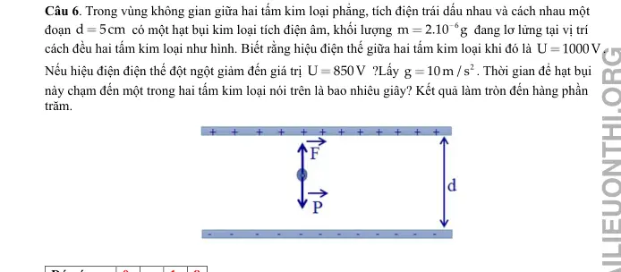
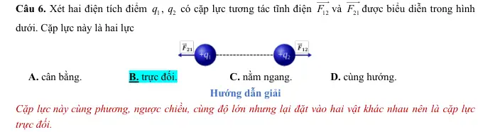
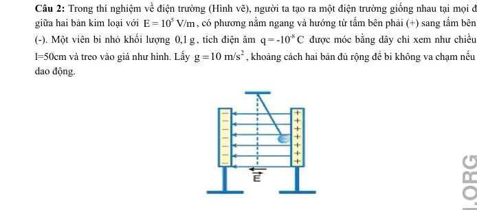

# Bài tập — Bài 9 — Cân bằng điện tích và con lắc trong điện trường

> Hệ bài tập được biên soạn theo các dạng xuất hiện trong bộ tài liệu Vật lí 11 của dự án. Câu hỏi được giữ ngắn, trực tiếp; độ khó tăng dần và không cố tình thêm dữ kiện gây nhiễu.

[← Trở lại bài học](../../09-electrostatic-equilibrium-charged-pendulum.md)

## Phần A — Trắc nghiệm 4 lựa chọn

### Câu 1 — Mức 1 — Nhận biết

Một quả cầu nhỏ khối lượng m, điện tích dương q treo bằng dây trong điện trường đều nằm ngang E. Ở cân bằng, dây lệch góc θ so với phương thẳng đứng. Hệ thức đúng là

A. $\tan\theta=mg/(qE)$.  
B. $\tan\theta=qE/(mg)$.  
C. $\sin\theta=qE/(mg)$ luôn đúng.  
D. $\tan\theta=q/(mE)$.

### Câu 2 — Mức 1 — Nhận biết

Nếu q âm trong điện trường ngang hướng sang phải, quả cầu cân bằng lệch về

A. bên phải.  
B. bên trái.  
C. không lệch.  
D. lên trên.

### Câu 3 — Mức 1 — Nhận biết

Trong điện trường đều thẳng đứng cùng chiều trọng lực, điện tích dương chịu gia tốc hiệu dụng về độ lớn

A. $g-qE/m$.  
B. $g+qE/m$.  
C. $qE/(mg)$.  
D. luôn bằng g.

### Câu 4 — Mức 1 — Nhận biết

Hai điện tích dương giống nhau treo đối xứng bằng hai sợi dây. Khi điện tích tăng, các yếu tố khác giữ nguyên, góc lệch cân bằng thường

A. giảm.  
B. tăng.  
C. không đổi.  
D. bằng 0.

## Phần B — Đúng/Sai

### Câu 5 — Mức 2 — Thông hiểu

Con lắc tích điện trong điện trường đều ngang:

a) Ở cân bằng, tổng lực bằng 0.  
b) Có thể gộp trọng lực và lực điện thành một “trọng lực hiệu dụng” về mặt động lực học.  
c) Nếu E ngang thì $g_{hiệu}=g+qE/m$ theo đại số một chiều.  
d) Dấu điện tích quyết định phía lệch.

### Câu 6 — Mức 2 — Thông hiểu

Hai quả cầu nhỏ giống nhau tích điện cùng dấu, treo đối xứng:

a) Lực Coulomb là lực đẩy.  
b) Ở cân bằng, thành phần ngang của lực căng cân bằng lực Coulomb.  
c) Có thể bỏ trọng lực khi tính góc lệch mà không cần điều kiện.  
d) Khoảng cách giữa hai quả cầu phụ thuộc chiều dài dây và góc lệch.

## Phần C — Trả lời ngắn

### Câu 7 — Mức 3 — Vận dụng

Quả cầu $m=20$ g, $q=2\,\mu$C treo trong điện trường ngang $E=5\cdot10^4$ V/m. Lấy $g=10$ m/s². Tính góc lệch cân bằng.

### Câu 8 — Mức 3 — Vận dụng

Với dữ kiện trên, tính lực căng dây ở cân bằng.

### Câu 9 — Mức 3 — Vận dụng

Một con lắc tích điện dương đặt trong điện trường thẳng đứng hướng xuống, $qE/m=2$ m/s², $g=10$ m/s². Tính chu kì góc nhỏ nếu $\ell=0,75$ m.

## Phần D — Vận dụng và vận dụng cao

### Câu 10 — Mức 4 — Vận dụng cao

Hai quả cầu nhỏ giống nhau, mỗi quả có khối lượng $m=10$ g và điện tích $q=0,20\,\mu$C, treo từ cùng một điểm bằng hai dây dài $\ell=0,50$ m. Ở cân bằng mỗi dây lệch góc nhỏ θ so với phương thẳng đứng. Lấy $g=10$ m/s², $k=9\cdot10^9$. Dùng gần đúng $\sin\theta\approx\tan\theta\approx\theta$ để ước tính θ.

---

[Đáp án và lời giải →](solutions.md)

## Ngân hàng bài tập PDF mở rộng

> Nội dung câu hỏi và dữ kiện trong phần này được giữ nguyên; hệ thống chỉ chuẩn hóa xuống dòng và mã kí tự để hiển thị trên web. Câu trùng được loại bỏ. Với câu có công thức/kí hiệu bị sai khi trích xuất chữ từ PDF, đề bài được giữ dưới dạng ảnh để không làm thay đổi dữ kiện.

### Nhận biết — Trả lời ngắn

#### Bài PDF 1

<!-- source-id: BT-Chuong-III-p77-q3-201 -->

Câu 3. Một điện tích 80nC lơ lửng trong không khí giữa hai bản kim loại song song, tíchđiện trái dấu,
cách nhau 0,1 m . Hiệu điện thế giữa hai bản kim loại đều với cường 4000 V. Khối lượng của điện tích
bằng bao nhiêu mg?

2
2
6
x
y
v = v +v
7,1 10 m/s


2
3
y
1
y =
a t
6,86 10 m
2
−



x
x
y
4
y
x
y
y
x
s = v t'
v
s = s
2,571.10 m
s = v t'
v
−





d
U
20
U
E
E
400V / m
d
0,05

E
2000V / m

6
d
F
qE
20 10
2000
0,04N


2
d
6
F
0,04
a
8000m / s
m
5 10


o
v
v
at
0
8000 0,5
4000m / s


#### Bài PDF 2

<!-- source-id: BT-Chuong-III-p78-q4-202 -->

Câu 4. Quả cầu nhỏ khối lượng 25 g, mang điện tích
 được treo bởi một sợi dây không
dãn, khối lượng không đáng kể và đặt vào trong một điện trường đều với cường độ điện trường có
phương nằm ngang và độ lớn
. lấy
. Góc lệch của dây treo so với phương
thẳng đứng khi vật ở vị trí cân bằng bằng bao nhiêu độ?

#### Bài PDF 3

<!-- source-id: BT-Chuong-III-p78-q5-203 -->

Câu 5. Một viên bi nhỏ kim loại khối lượng
, thể tích
 được đặt trong dầu có khối lượng
riêng
. Chúng đặt trong điện trường đều
 có hướng thẳng đứng từ trên
xuống, thấy viên bi nằm lơ lửng, lấy
. Điện tích của viên bi là bao nhiêu nC?

P

dF

d
d
P
F
0
F
P


9
5
d
qU
U
80 10
400
P
F
mg
qE
mg
q
m
3,2 10
(Kg)
32mg
d
dg
0,1 10





7
q
2,5.10
C


6
E
10 V / m

2
g
10m / s

P

dF

T

d
d
P
F
T
0
T
(F
P)


7
6
o
d
3
F
qE
2,5 10
10
tan
1
45
P
mg
25 10
10





5
9 10
kg


3
10mm
3
800kg / m
5
E
4,1 10 V / m

2
g
10m / s


#### Bài PDF 4

<!-- source-id: BT-Chuong-III-p79-q6-204 -->

Câu 6. Trong vùng không gian giữa hai tấm kim loại phẳng, tích điện trái dấu nhau và cách nhau một
đoạn
 có một hạt bụi kim loại tích điện âm, khối lượng
 đang lơ lửng tại vị trí
cách đều hai tấm kim loại như hình. Biết rằng hiệu điện thế giữa hai tấm kim loại khi đó là
.
Nếu hiệu điện điện thế đột ngột giảm đến giá trị
 ?Lấy
. Thời gian để hạt bụi
này chạm đến một trong hai tấm kim loại nói trên là bao nhiêu giây? Kết quả làm tròn đến hàng phần
trăm.

{ loading=lazy }

#### Bài PDF 5

<!-- source-id: BT-Chuong-III-p91-q3-231 -->

Câu 3. Một hạt bụi có khối lượng
=
m
1g mang điện tích
−
= −
6
q
2 10
Cnằm cân bằng trong điện trường
của hai bản kim loại tích điện trái dấu đặt song song, nằm ngang, cách nhau một khoảng
=
d
4 cm . Lấy
=
2
g
10m/s
Nếu điện tích hạt bụi giảm đi 20 %. Phải thay đổi hiệu điện thế giữa hai bản kim loại một lượng bằng
bao nhiêu Vôn để hạt bụi vẫn cân bằng?
(
)
(
)
(
)
(
)
2
2
2
e
0
y
0
19
2
5
4
31
q E
v
v
v
v
2.
.h
m
1,6.10
.1200
2.10
2.
.10
286701m / s
9,1.10
−
−
−
=
+
=
+
=
+
=
=
d
5 cm
50 V
=
=
=
=
3
U
50
E
1000V / m
10 V / m
d
0,05

5
5 10 m / s
10cm
−

27
6,67 10
kg
−

19
1,6 10
C

3
x 10 V / m
x

#### Bài PDF 6

<!-- source-id: BT-Chuong-III-p92-q4-232 -->

Câu 4. Một quả cầu khối lượng m = 1g treo trên một sợi dây mảnh cách điện. Quả cầu nằm trong điện
trường đều có phương nằm ngang, cường độ E = 2.103 V/m. Khi đó dây treo hợp với phương thẳng đứng
một góc 600. Hỏi sức căng của sợi dây là bao nhêu N? Lấy g =10m/s2.

#### Bài PDF 7

<!-- source-id: BT-Chuong-III-p93-q6-234 -->

Câu 6. Hai tấm kim loại phẳng nằm ngang nhiễm điện trái dấu đặt trong dầu, điện trường giữa hai bản là
điện trường đều hướng từ trên xuống dưới và có cường độ 20 000V/m. Một quả cầu bằng sắt bán kính 1cm
P

dF

T

d
d
P
F
T
0
T
(F
P)


19
31
q
1,6.10
;m
9,1.10
kg
−
−
= −
=

mang điện tích q nằm lơ lửng ở giữa khoảng không gian giữa hai tấm kim loại. Biết khối lượng riêng của
sắt là 7800kg/m3, của dầu là 800kg/m3, lấy g = 10m/s2. Độ lớn của q là bao nhiêu μC? (Kết quả làm tròn
đến hàng phần mười.).

### Nhận biết — Trắc nghiệm 4 lựa chọn

#### Bài PDF 8

<!-- source-id: BT-Chuong-III-p5-q6-6 -->

Câu 6. Xét hai điện tích điểm
1q ,
2q  có cặp lực tương tác tĩnh điện
12
F
υυυ
và
21
F
υυυ
được biểu diễn trong hình
dưới. Cặp lực này là hai lực

A. cân bằng.
 B. trực đối.
C. nằm ngang.
D. cùng hướng.

{ loading=lazy }

#### Bài PDF 9

<!-- source-id: BT-Chuong-III-p68-q13-186 -->

Câu 13. Một hạt bụi tích điện có khối lượng m = 3.10-6 g nằm cân bằng trong điện trường đều thẳng đứng
hướng xuống có cường độ E = 2000 V/m. Lấy g = 10 m/s2. Điện tích hạt bụi là
A. 15.10 -9C.
B. –15.10-12C.
C.–15.10-9C.
D. 15.10 -12C.

#### Bài PDF 10

<!-- source-id: BT-Chuong-III-p68-q14-187 -->

Câu 14. Quả cầu nhỏ khối lượng 20 g mang điện tích 10-7C được treo bởi dây mảnh trong điện trường đều
có vectơ
 nằm ngang. Khi quả cầu cân bằng, dây treo hợp với phương đứng một góc α = 300, lấy g = 10
m/s2. Độ lớn của cường độ điện trường là
-19
q = -1,6.10
C
13
10−
18
10−
15
10−
16
10−
-19
-13
U
120000
F = q E = q
= -1,6×10
×
 = 9,6×10
N
d
0,02
6
-9
U
0,07
E =
=
= 8,75.10 V/m
d
8.10
đF
P
0
+
=








=

=


đ
đ
F
P
F
E
q &lt; 0
F
P
q E
mg
9
12
mg
3 10
10
q
15.10
(C)
E
2000
−
−



= −
= −
= −
E


A. 1,15.106 V/m.
B. 2,5.106 V/m.
C. 3,5.106 V/m.
D. 2,7.105 V/m.

#### Bài PDF 11

<!-- source-id: BT-Chuong-III-p84-q13-219 -->

Câu 13. Quả cầu nhỏ m = 0,5g, mang điện tích q1 treo trên một sợi dây mảnh trong điện trường đều có
phương nằm ngang. Cường độ điện trường E =106 V/m. (g = 10m/s2). Góc lệch của dây so với phương
thẳng đứng là
A. 15o.

B. 30o.
C . 45o.

D. 60o.

#### Bài PDF 12

<!-- source-id: BT-Chuong-III-p85-q15-221 -->

Câu 15. Hạt bụi tích điện nằm lơ lửng trong điện trường. Cho biết gia tốc rơi tự do là 10 m/s2. Nếu điện
tích hạt bụi giảm đi 10% giá trị độ lớn thì gia tốc của hạt bụi thu được bằng
A.9 m/s2.
B. 2 m/s2.
C. 8 m/s2.
D. 1 m/s2.

#### Bài PDF 13

<!-- source-id: BT-Chuong-III-p86-q18-224 -->

Câu 18. Hiệu điện thế giữa hai bản tụ điện phẳng bằng
. Một hạt bụi nằm cân bằng giữa hai
bản tụ điện và cách bản dưới của tụ điện
. Nếu đột ngột hiệu điện thế giữa hai bản giảm đi
một lượng
 thì hạt bụi sẽ rơi xuống mặt bản tụ sau khoảng thời gian là
0
30
α=
0
60
α=
=
U
300 V
=
1
d
0,8cm
Δ
=
U
60 V

A.

B.

C.

D.

### Nhận biết — Đúng/Sai

#### Bài PDF 14

<!-- source-id: BT-Chuong-III-p15-q6-47 -->

Câu 6. Hai quả cầu nhỏ được tích điện như nhau và treo cạnh nhau bằng 2 sợi dây mảnh ở trong không khí,
mỗi quả có khối lượng 1,5 g. Ở trạng thái cân bằng, hai quả cầu cách nhau 2,6 cm và dây treo tạo với
phương thẳng đứng góc 20o. Lấy
2
9,8 m/s .
g =

Phát biểu
Đúng
Sai
a
Không thể kết luận hai quả cầu mang điện tích dương hay điện tích âm.
Đ

b
Đối với quả cầu A, trọng lực trực đối với hợp lực của lực điện và lực căng dây

S
c
Lực điện tương tác giữa hai quả cầu có độ lớn khoảng 5,35 mN.
Đ

d
Độ lớn điện tích của hai quả cầu nhỏ hơn 2 μC .
Đ

#### Bài PDF 15

<!-- source-id: BT-Chuong-III-p21-q1-72 -->

Câu 1. Hai vật nhỏ được tích điện giống nhau
6
1
2
10  C
q
q
−
=
=
 ban đầu được đặt trong không khí và giữ ở
vị trí cách nhau 2 cm. Giả sử hai vật chỉ chịu tác dụng của lực tương tác tĩnh điện giữa chúng.

Nội dung
Đúng
Sai
a
Hai vật nhỏ tích điện cùng dấu nên đẩy nhau.
Đ

b
Khi thả tự do thì hai vật sẽ chuyển động về hai hướng ngược nhau, trên đường
nối đi qua tâm của hai vật.
Đ

c
Lực tĩnh điện do
1q  tác dụng lên
2q  và lực tĩnh điện do
2q  tác dụng lên
1q  là hai
lực cân bằng.

S
d
Với
9
2
2
9.10  Nm /C
k =
, lực tương tác giữa hai vật có độ lớn là 22,5 N.
Đ

#### Bài PDF 16

<!-- source-id: BT-Chuong-III-p21-q2-73 -->

Câu 2. Hai quả cầu kim loại nhỏ có cùng kích thước, cùng khối lượng 90 g, được treo vào cùng một điểm
bằng hai sợi dây mảnh cách điện có cùng chiều dài 1,5 m. Truyền cho mỗi quả cầu một lượng điện
tích
7
2,4.10  C
−
 thì chúng đẩy nhau ra xa tới lúc cân bằng thì hai điện tích cách nhau một đoạn a. Coi góc
lệch của hai sợi dây so với phương thẳng đứng là rất nhỏ. Lấy g = 10 m/s2. Tính độ lớn của a.

Nội dung
Đúng
Sai
a
Lực đẩy do hai quả cầu tác dụng lên nhau có phương, chiều và độ lớn như nhau.

S
b
Khoảng cách vị trí của mỗi quả cầu khi cân bằng đến vị trí ban đầu là như nhau.
Đ

c
Khoảng cách
12 cm
a =
.
Đ

d
Nếu nhúng cả hệ như cũ vào dầu có hằng số điện môi là 2, khoảng cách a sẽ giảm
đi 1 cm.

S

#### Bài PDF 17

<!-- source-id: BT-Chuong-III-p23-q4-75 -->

Câu 4. Một hệ gồm ba điện tích điểm dương q giống nhau nằm ở ba đỉnh của một tam giác đều. Đặt thêm
một điện tích điểm Q  sao cho hệ nằm cân bằng.

Nội dung
Đúng
Sai
a
Khoảng cách giữa các điện tích điểm q là như nhau.
Đ

b
Hệ ba điện tích điểm q tương tác hút với nhau theo từng cặp.

S
c
Để hệ nằm cân bằng, điện tích điểm Q phải nằm ở tâm của tam giác.
Đ

d
Điện tích Q có giá trị là
3
q
Q = −

Đ

#### Bài PDF 18

<!-- source-id: BT-Chuong-III-p72-q1-194 -->

Câu 1. Một hạt bụi khối lượng
, nằm cân bằng trong điện trường đều có phương thẳng đứng,
hướng xuống, cường độ
. Lấy g =10 m/s2.

Phát biểu
Đúng
Sai
a
Hạt bụi chịu tác dụng của trọng lực và lực điện.
Đ

b
Lực điện tác dụng lên hạt bụi có phương thẳng đứng chiều từ
trên xuống dưới.

S
c
Hạt bụi mang điện tích âm.
Đ

d
 Độ lớn điện ích của hạt bụi là

Đ

#### Bài PDF 19

<!-- source-id: BT-Chuong-III-p73-q2-195 -->

Câu 2. Trong thí nghiệm về điện trường (Hình vẽ), người ta tạo ra một điện trường giống nhau tại mọi điểm
giữa hai bản kim loại với
, có phương nằm ngang và hướng từ tấm bên phải (+) sang tấm bên trái
(-). Một viên bi nhỏ khối lượng 0,1 g , tích điện âm
 được móc bằng dây chỉ xem như chiều dài
l=50cm và treo vào giá như hình. Lấy
, khoảng cách hai bản đủ rộng để bi không va chạm nếu cho
dao động.

Phát biểu
Đúng
Sai
a
Lực tác dụng lên viên bi gồm có trọng lực
 và lực điện
.

S
b
 Góc lệch giữa dây treo và phương thẳng đứng khi bi đứng cân
bằng là 300.

S
c
Nếu cho con lắc dao động thì chu kì dao động của nó là 1,181s
Đ

d
Khi Bi đang cân bằng nếu đổi dấu điện tích của hai bản kim loại,
nhưng giữ nguyên độ lớn của cường độ điện trường thì viên bi
sẽ dao động với tốc độ cực đại bằng 3,76 m/s
Đ

{ loading=lazy }

#### Bài PDF 20

<!-- source-id: BT-Chuong-III-p74-q3-196 -->

Câu 3. Một hòn bi nhỏ bằng kim loại được đặt trong dầu. Bi có thể tích V = 10mm3, khối lượng m = 9.10-
5kg. Dầu có khối lượng riêng D = 800(kg/m3). Tất cả được đặt trong một điện trường đều,
 hướng thẳng
đứng từ trên xuống
, Cho g = 10(m/s2). Hòn bi nằm cân bằng trong dầu.

Phát biểu
Đúng
Sai
a
Các lực tác dụng lên hòn bi gồm có trọng lực
, lực điện
 và lực đẩy
Ac-si-met
 .
Đ

b
 Độ lớn của trọng lực nhỏ hơn độ lớn lực đẩy Ac si met.

S
c
Lực điện tác dụng vào bi (điện tích) hướng lên trên .
Đ

d
Điện tích của bi là
.

S

#### Bài PDF 21

<!-- source-id: BT-Chuong-III-p75-q4-197 -->

Câu 4. Một quả cầu nhỏ mang điện tích đang được cân bằng trong điện trường đều do tác dụng của trọng
lực và lực điện trường. Đột ngột giảm độ lớn điện trường đi còn một nửa nhưng vẫn giữ nguyên phương
và chiều của đường sức điện. Lấy g =10 m/s2.

Phát biểu
Đúng
Sai
a
 Lúc đầu độ lớn lực điện tác dụng lên quả cầu là

Đ

b
 Khi đột ngột giảm độ lớn điện trường đi còn một nửa thì quả cầu vẫn cân
bằng trong điện trường.

S
c
Khi đột ngột giảm điện trường quả cầu sẽ chuyển động theo hướng của
trọng lực với gia tốc 5 m/s2.
Đ

d
Thời gian để quả cầu di chuyển được 5 cm trong điện trường là 0,14 s
Đ

#### Bài PDF 22

<!-- source-id: BT-Chuong-III-p88-q2-226 -->

Câu 2. Người ta dùng hai bản kim loại tích điện trái dấu đặt nằm ngang và song song với nhau, cách
nhau một khoảng
 Ở gần sát với bản trên có một giọt thủy ngân tích điện dương q nằm lơ lửng khi
hiệu điện thế giữa hai bản tụ là

Phát biểu
Đúng
Sai
a
Điện trường trong khoảng không gian giữa hai bản kim loại nói trên là
điện trường đều.
Đ

b
Bản nhiễm điện dương nằm ở phía dưới.
Đ

c
Nếu điện tích giọt thủy ngân giảm chỉ còn
 thì giọt thủy ngân sẽ
chuyển động đi lên theo phương thẳng đứng.

S
d
 Nếu hiệu điện thế giữa hai bản chỉ còn
 (điện tích của giọt thủy
ngân vẫn là q, chiều điện trường không thay đổi) thì vận tốc của giọt thủy
ngân khi chạm vào bản kim loại (theo chiều dịch chuyển của giọt thủy
ngân) là

S

### Thông hiểu — Trắc nghiệm 4 lựa chọn

#### Bài PDF 23

<!-- source-id: BT-Chuong-III-p8-q23-23 -->

Câu 23. Hai quả cầu nhẹ cùng khối lượng được treo gần nhau bằng hai dây cách điện có cùng chiều dài và
hai quả cầu không chạm nhau. Tích cho hai quả cầu điện tích cùng dấu nhưng có độ lớn khác nhau thì lực
tác dụng làm dây treo hai điện tích lệch đi những góc so với phương thẳng đứng. Nhận định nào sau đây là
đúng?

A. Quả cầu nào tích điện có độ lớn điện tích lớn hơn thì có góc lệch lớn hơn.

B. Quả cầu nào tích điện có độ lớn điện tích nhỏ hơn thì có góc lệch nhỏ hơn.

C. Quả cầu nào tích điện có độ lớn điện tích lớn hơn thì có góc lệch nhỏ hơn.

D. Góc lệch của hai quả cầu bằng nhau.

#### Bài PDF 24

<!-- source-id: BT-Chuong-III-p8-q24-24 -->

Câu 24. Ba điện tích điểm chỉ có thể nằm cân bằng dưới tác dụng của các lực điện khi ba điện tích

A. cùng loại nằm ở ba đỉnh của một tam giác đều.

B. không cùng loại nằm ở ba đỉnh của một tam giác đều.

C. không cùng loại nằm trên cùng một đường thẳng.

D. cùng loại nằm trên cùng một đường thẳng.

### Vận dụng — Trắc nghiệm 4 lựa chọn

#### Bài PDF 25

<!-- source-id: BT-Chuong-III-p12-q39-39 -->

Câu 39. Hai quả cầu nhỏ giống nhau, có cùng khối lượng 2,5 g, điện tích
7
5.10
C

−
 được treo tại cùng một
điểm bằng hai dây mảnh. Do lực đẩy tĩnh điện hai quả cầu tách ra xa nhau một đoạn 60 cm, lấy
2
10 m/s
g =
. Góc lệch của dây so với phương thẳng là

A. 14o.
B. 30o.
C. 45o.
D. 60o.

#### Bài PDF 26

<!-- source-id: BT-Chuong-III-p13-q41-41 -->

Câu 41. Một điện tích q đặt tại điểm chính giữa đoạn thẳng nối hai điện tích Q bằng nhau. Hệ ba điện tích
sẽ cân bằng nếu q có giá trị là

A.
2
Q
−
.
B.
4
Q
−
.
C.
2
Q
.
D.
4
Q
.

### Vận dụng — Đúng/Sai

#### Bài PDF 27

<!-- source-id: BT-Chuong-III-p14-q3-44 -->

Câu 3. Cho hai điện tích điểm
1
μC
6
q =
 và
2
μC
54
q =
 đặt tại hai điểm A, B trong không khí cách nhau 6
cm. Sau đó người ta đặt một điện tích q3 tại điểm C.

Nội dung
Đúng
Sai
a
Điện tích điểm
1q  tác dụng lực đẩy lên điện tích điểm
2q .
Đ

b
Để
3q nằm cân bằng, phải đặt
3q nằm trong đoạn AB.
Đ

c
Điểm C cách điểm A 4,5 cm.

S
d
Để cả hệ cân bằng, giá trị của
3q  là 3,375 μC.

S

