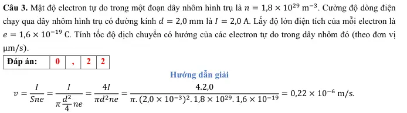
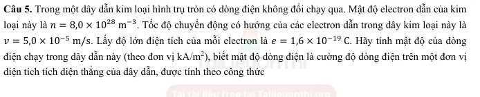
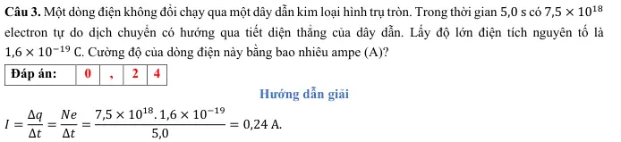
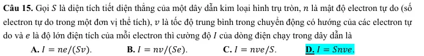
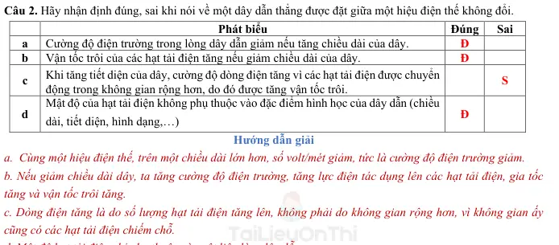
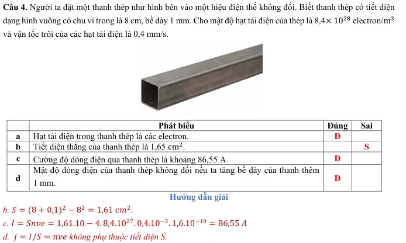
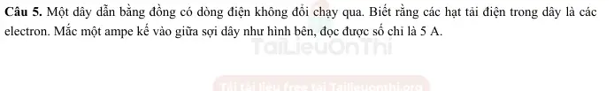
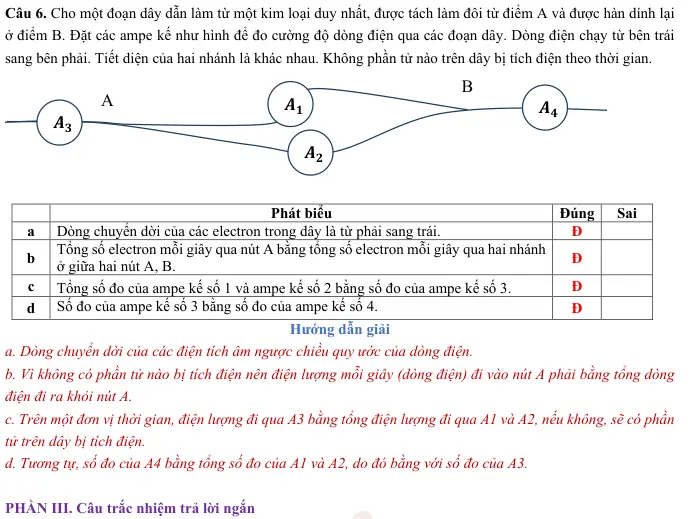
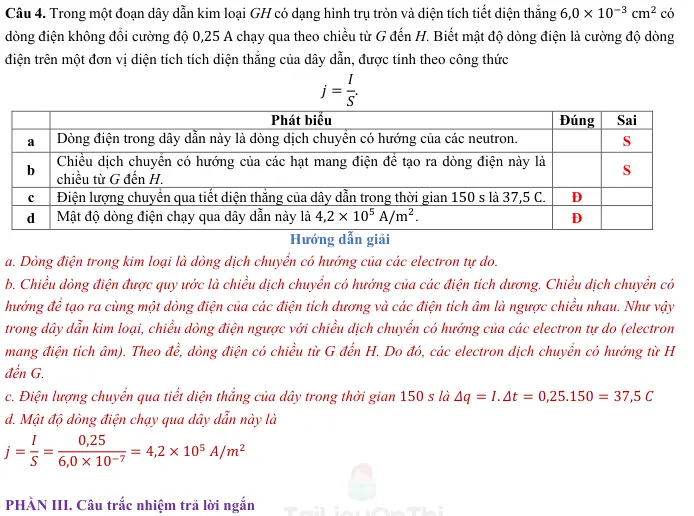
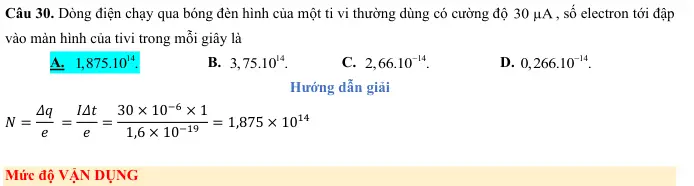

# Bài tập — Bài 1 — Dòng điện và cường độ dòng điện

> Hệ bài tập được biên soạn theo các dạng xuất hiện trong bộ tài liệu Vật lí 11 của dự án. Câu hỏi được giữ ngắn, trực tiếp; độ khó tăng dần và không cố tình thêm dữ kiện gây nhiễu.

[← Trở lại bài học](../../01-current-intensity.md)

## Phần A — Trắc nghiệm 4 lựa chọn

### Câu 1 — Mức 1 — Nhận biết

Điện lượng $12$ C đi qua tiết diện dây trong $4$ s. Cường độ dòng điện trung bình là

A. $0,33$ A.  
B. $3$ A.  
C. $8$ A.  
D. $48$ A.

### Câu 2 — Mức 1 — Nhận biết

Dòng điện không đổi là dòng điện có

A. chiều không đổi nhưng cường độ luôn biến đổi.  
B. cường độ và chiều không đổi theo thời gian.  
C. điện lượng bằng 0.  
D. chỉ tồn tại trong kim loại.

### Câu 3 — Mức 1 — Nhận biết

Dòng điện trong kim loại có chiều quy ước

A. cùng chiều chuyển động có hướng của electron.  
B. ngược chiều chuyển động có hướng của electron.  
C. không liên quan điện trường.  
D. từ cực âm sang cực dương ngoài nguồn.

### Câu 4 — Mức 1 — Nhận biết

Dòng điện $I=2$ A chạy trong $30$ s. Điện lượng qua tiết diện là

A. $15$ C.  
B. $28$ C.  
C. $60$ C.  
D. $120$ C.

## Phần B — Đúng/Sai

### Câu 5 — Mức 2 — Thông hiểu

Xét cường độ dòng điện:

a) $1$ A = $1$ C/s.  
b) $I=\Delta q/\Delta t$.  
c) Trong kim loại, hạt tải điện chủ yếu là electron tự do.  
d) Electron chuyển động nhiệt hỗn loạn hoàn toàn dừng lại khi có dòng điện.

### Câu 6 — Mức 2 — Thông hiểu

Một dây dẫn kim loại có mật độ electron tự do n, tiết diện S, tốc độ trôi trung bình v:

a) $I=neSv$ về độ lớn.  
b) Tăng S, các yếu tố khác giữ nguyên, I tăng.  
c) Tốc độ trôi bằng tốc độ lan truyền tín hiệu điện trong dây.  
d) Điện lượng qua tiết diện trong thời gian t là $It$ với dòng không đổi.

## Phần C — Trả lời ngắn

### Câu 7 — Mức 3 — Vận dụng

Dòng điện $0,50$ A chạy trong $2$ phút. Tính điện lượng và số electron qua tiết diện. Lấy $e=1,6\cdot10^{-19}$ C.

### Câu 8 — Mức 3 — Vận dụng

Trong $0,20$ s có $5\cdot10^{17}$ electron đi qua tiết diện dây. Tính cường độ dòng điện.

### Câu 9 — Mức 3 — Vận dụng

Dây dẫn có tiết diện $S=1$ mm², mật độ electron tự do $n=8,5\cdot10^{28}$ m⁻³, dòng điện $I=1,36$ A. Tính tốc độ trôi trung bình. Lấy $e=1,6\cdot10^{-19}$ C.

## Phần D — Vận dụng và vận dụng cao

### Câu 10 — Mức 4 — Vận dụng cao

Một dây dẫn hình trụ có đường kính giảm dần nhưng cùng vật liệu và cùng dòng điện không đổi chạy qua. Ở tiết diện 1, bán kính $r_1=2r_2$. Giả sử mật độ hạt tải n như nhau. So sánh tốc độ trôi $v_1$ và $v_2$.

---

[Đáp án và lời giải →](solutions.md)

## Ngân hàng bài tập PDF mở rộng

> Nội dung câu hỏi và dữ kiện trong phần này được giữ nguyên; hệ thống chỉ chuẩn hóa xuống dòng và mã kí tự để hiển thị trên web. Câu trùng được loại bỏ. Với câu có công thức/kí hiệu bị sai khi trích xuất chữ từ PDF, đề bài được giữ dưới dạng ảnh để không làm thay đổi dữ kiện.

### Nhận biết — Trả lời ngắn

#### Bài PDF 1

<!-- source-id: BT-Chuong-IV-p11-q1-47 -->

Câu 1. Cường độ của một dòng điện không đổi chạy qua dây tóc của một bóng đèn là 𝐼= 1,0 A. Điện lượng
chuyển qua tiết diện thẳng của dây tóc trong thời gian Δ𝑡= 1,5 phút là bao nhiêu (tính theo đơn vị C)?

#### Bài PDF 2

<!-- source-id: BT-Chuong-IV-p12-q2-48 -->

Câu 2. Trong thời gian Δ𝑡= 30 s, có một điện lượng Δ𝑞= 60 C chuyển qua tiết diện thẳng của dây dẫn. Số
electron chuyển qua tiết diện thẳng của dây dẫn trong thời gian Δ𝑡′ = 20 s là 𝑋× 2020. Giá trị của 𝑋 là

#### Bài PDF 3

<!-- source-id: BT-Chuong-IV-p12-q3-49 -->

Câu 3. Mật độ electron tự do trong một đoạn dây nhôm hình trụ là 𝑛= 1,8 × 1029 m−3. Cường độ dòng điện
chạy qua dây nhôm hình trụ có đường kính 𝑑= 2,0 mm là 𝐼= 2,0 A. Lấy độ lớn điện tích của mỗi electron là
𝑒= 1,6 × 10−19 C. Tính tốc độ dịch chuyển có hướng của các electron tự do trong dây nhôm đó (theo đơn vị
μm/s).

{ loading=lazy }

#### Bài PDF 4

<!-- source-id: BT-Chuong-IV-p12-q4-50 -->

Câu 4. Cho dòng điện không đổi cường độ 𝐼= 4,2 A chạy qua một đoạn dây dẫn bằng kim loại dài 𝑙= 80 cm
có đường kính tiết diện thẳng 𝑑= 2,5 mm. Mật độ electron dẫn của kim loại này là 𝑛= 8,5 × 1028 m−3. Lấy
độ lớn điện tích của mỗi electron là 𝑒= 1,6 × 10−19 C. Hãy tính thời gian trung bình 𝑡 để mỗi electron dẫn di
chuyển hết chiều dài đoạn dây (theo đơn vị giờ và làm tròn đến chữ số thập phân thứ nhất sau dấu phẩy).

#### Bài PDF 5

<!-- source-id: BT-Chuong-IV-p12-q5-51 -->

Câu 5. Trong một dây dẫn kim loại hình trụ tròn có dòng điện không đổi chạy qua. Mật độ electron dẫn của kim
loại này là 𝑛= 8,0 × 1028 m−3. Tốc độ chuyển động có hướng của các electron dẫn trong dây kim loại này là
𝑣= 5,0 × 10−5 m/s. Lấy độ lớn điện tích của mỗi electron là 𝑒= 1,6 × 10−19 C. Hãy tính mật độ của dòng
điện chạy trong dây dẫn này (theo đơn vị kA/m2), biết mật độ dòng điện là cường độ dòng điện trên một đơn vị
diện tích tích diện thẳng của dây dẫn, được tính theo công thức

𝑗= 𝐼
𝑆.

{ loading=lazy }

#### Bài PDF 6

<!-- source-id: BT-Chuong-IV-p13-q6-52 -->

Câu 6. Trong một thí nghiệm mạ bạc, cần có điện tích Δ𝑞= 8,2 × 103 C để lắng đọng một khối lượng bạc. Tính
thời gian để khối bạc này lắng đọng khi cường độ dòng điện là 𝐼= 0,20 A (theo đơn vị 104 s).

#### Bài PDF 7

<!-- source-id: BT-Chuong-IV-p17-q1-75 -->

Câu 1. Trong một dây dẫn có dòng điện không đổi chạy qua. Điện lượng chuyển qua tiết diện thẳng của dây dẫn
trong thời gian 300 s là 675 C. Cường độ của dòng điện này bằng bao nhiêu ampe (A)?

#### Bài PDF 8

<!-- source-id: BT-Chuong-IV-p18-q2-76 -->

Câu 2. Trong một dây dẫn có dòng điện không đổi cường độ 2,50 A chạy qua. Điện lượng chuyển qua tiết diện
thẳng của dây dẫn trong thời gian 200 s bằng bao nhiêu coulomb (C)?

#### Bài PDF 9

<!-- source-id: BT-Chuong-IV-p18-q3-77 -->

Câu 3. Một dòng điện không đổi chạy qua một dây dẫn kim loại hình trụ tròn. Trong thời gian 5,0 s có 7,5 × 1018
electron tự do dịch chuyển có hướng qua tiết diện thẳng của dây dẫn. Lấy độ lớn điện tích nguyên tố là
1,6 × 10−19 C. Cường độ của dòng điện này bằng bao nhiêu ampe (A)?

{ loading=lazy }

#### Bài PDF 10

<!-- source-id: BT-Chuong-IV-p18-q4-78 -->

Câu 4. Mắc nối tiếp một bóng đèn với một ampe kế rồi nối hai đầu đoạn mạch này vào một nguồn điện không
đổi thì thấy số chỉ của ampe kế là 450 mA. Điện lượng chuyển qua bóng đèn trong thời gian 600 s bằng bao
nhiêu coulomb (C)?

#### Bài PDF 11

<!-- source-id: BT-Chuong-IV-p18-q5-79 -->

Câu 5. Dòng điện không đổi có cường độ 3,30 A chạy trong một dây dẫn bằng đồng có đường kính tiết diện
thẳng 0,500 mm. Giả sử mỗi nguyên tử đồng có một electron tự do. Khối lượng riêng và nguyên tử lượng của
đồng lần lượt là 9,00 × 103 kg/m3 và 64,0 g/mol. Cho số Avogdro là 𝑁A = 6,02 × 1023 mol−1. Lấy độ lớn
điện tích của mỗi electron là 1,60 × 10−19 C. Tính độ lớn vận tốc trôi của các electron tự do tạo nên dòng điện
trong dây đồng này ra đơn vị mm/s (làm tròn đến 2 chữ số sau dấu phẩy thập phân).

#### Bài PDF 12

<!-- source-id: BT-Chuong-IV-p19-q6-80 -->

Câu 6. Cho dòng điện không đổi cường độ 4,25 A chạy qua một đoạn dây dẫn bằng kim loại dài 2,00 km có
đường kính tiết diện thẳng 2,50 mm. Mật độ electron dẫn của kim loại này là 8,50 × 1028 m−3. Lấy độ lớn điện
tích của mỗi electron là 1,60 × 10−19 C. Thời gian trung bình để một electron dẫn di chuyển từ đầu này đến đầu
kia của đoạn dây này là bao nhiêu tuần (làm tròn đến 1 chữ số sau dấu phẩy thập phân)?

### Nhận biết — Trắc nghiệm 4 lựa chọn

#### Bài PDF 13

<!-- source-id: BT-Chuong-IV-p4-q1-1 -->

Câu 1. Đơn vị nào sau đây là một đơn vị đo của cường độ dòng điện?
A. Coulomb.

B. Coulomb.giây.
C. Coulomb/giây.
 D. Coulomb2/giây.

#### Bài PDF 14

<!-- source-id: BT-Chuong-IV-p4-q2-2 -->

Câu 2. Hãy chọn thứ nguyên của cường độ dòng điện.
A. I.

B. L.T.

C. L2. T−3.
 D. I. T−1.

#### Bài PDF 15

<!-- source-id: BT-Chuong-IV-p4-q3-3 -->

Câu 3. Cường độ dòng điện có thể được đo bằng
A. thước kẻ.

B. ampe kế.

C. cân.
 D. đồng hồ.

#### Bài PDF 16

<!-- source-id: BT-Chuong-IV-p4-q4-4 -->

Câu 4. Cường độ dòng điện là đại lượng vật lý đặc trưng cho
A. độ mạnh yếu của dòng điện.

B. công suất của dòng điện.
C.  tốc độ tiêu thụ năng lượng của dòng điện
D. khả năng tỏa nhiệt của dòng điện.

#### Bài PDF 17

<!-- source-id: BT-Chuong-IV-p4-q5-5 -->

Câu 5. Cường độ dòng điện là đại lượng
A. vector.

B. vô hướng.

C. có thể đo bằng Watt kế.

D. có thể đo bằng lực kế.

#### Bài PDF 18

<!-- source-id: BT-Chuong-IV-p4-q6-6 -->

Câu 6. Một ampe là cường độ của một dòng điện tương ứng với …(1)… được chuyển qua tiết diện thẳng của
một dây dẫn trong …(2)… Từ thích hợp điền vào hai chỗ trống là
A. điện tích nguyên tố - một giây

B. 1,6 × 10−19 Coulomb – một giây
C. 1019 Coulomb – một phút

D. một Coulomb – một giây

#### Bài PDF 19

<!-- source-id: BT-Chuong-IV-p4-q7-7 -->

Câu 7. Một dòng chuyển dời có hướng của các hạt nào sau đây không được xem là một dòng điện?
A. Các hạt electron
B. Các hạt ion 𝐻+
C. Các hạt ion Cl−  D. Các phân tử Nitrogen

#### Bài PDF 20

<!-- source-id: BT-Chuong-IV-p4-q8-8 -->

Câu 8. Phát biểu nào sau đây về cường độ dòng điện là không đúng?

A. Đơn vị cường độ dòng điện là Ampe.

B. Cường độ dòng điện được đo bằng Ampe kế.

C. Cường độ dòng điện càng lớn thì trong một đơn vị thời gian điện lượng chuyển qua tiết diện thẳng
của vật dẫn càng nhiều.

D. Dòng điện không đổi là dòng điện chỉ có chiều không thay đổi theo thời gian.

#### Bài PDF 21

<!-- source-id: BT-Chuong-IV-p4-q9-9 -->

Câu 9. Cho các hạt ion dương và các hạt ion âm có cùng số lượng, độ lớn điện tích và tốc độ trôi, chuyển động
thành hai dòng có hướng. Đâu là một dòng điện có cường độ khác không?
A. Hai dòng ion khác dấu, ngược chiều.

B. Hai dòng ion khác dấu, cùng chiều.
C. Hai dòng ion dương, ngược chiều.

D. Hai dòng ion âm, ngược chiều.

#### Bài PDF 22

<!-- source-id: BT-Chuong-IV-p4-q10-10 -->

Câu 10. Dòng điện không đổi là dòng điện có

A. cường độ không đổi không đổi theo thời gian.

B. chiều không thay đổi theo thời gian.

C. chiều và cường độ thay đổi theo thời gian.

D. chiều và cường độ không thay đổi theo thời gian.

#### Bài PDF 23

<!-- source-id: BT-Chuong-IV-p5-q12-12 -->

Câu 12. Cường độ dòng điện không đổi qua một vật dẫn phụ thuộc vào những yếu tố nào?
I. Mật độ hạt tải điện trong vật dẫn
II. Bản chất của vật dẫn
III. Thời gian dòng điện qua vật dẫn.

A. I và II.

B. I.

C. I, II, III.
D. II và III.

#### Bài PDF 24

<!-- source-id: BT-Chuong-IV-p5-q13-13 -->

Câu 13. Điều kiện để có dòng điện là

A. phải có một vật dẫn điện.

B. phải có các hạt mang điện.

C. phải có các hạt mang điện chuyển động hỗn loạn.

D. phải có các hạt mang điện chuyển động có hướng.

#### Bài PDF 25

<!-- source-id: BT-Chuong-IV-p5-q14-14 -->

Câu 14. Dòng điện là

A. dòng chuyển động của các điện tích.
B. dòng chuyển dời có hướng của các điện tích.

C. dòng chuyển dời của eletron.
D. dòng chuyển dời của ion dương.

#### Bài PDF 26

<!-- source-id: BT-Chuong-IV-p5-q15-15 -->

Câu 15. Dòng điện trong kim loại là dòng chuyển dời có hướng của

A. các ion dương.

B. các electron.
C. các ion âm.
D. các nguyên tử.

#### Bài PDF 27

<!-- source-id: BT-Chuong-IV-p8-q38-38 -->

Câu 38. Một dây dẫn bằng kim loại có tiết diện tròn, đường kính tiết diện 3 mm, có dòng điện 4 A chạy qua.
Cho biết mật độ electron tự do trong dây dẫn là 8,45× 1028 m−3. Vận tốc trôi của các electron gần bằng

A. 0,01 mm/s

B. 0,04 mm/s.
C. 0,07 mm/s.
D. 1,2 mm/s.

#### Bài PDF 28

<!-- source-id: BT-Chuong-IV-p8-q39-39 -->

Câu 39. Dòng điện không đổi có cường độ 1,3 A chạy trong một ống đồng có đường kính trong là 1,8 mm,
đường kính ngoài là 2 mm. Khối lượng riêng và khối lượng mol của đồng lần lượt là 9 tấn/m3 và 64 g/mol. Mỗi
nguyên tử đồng cung cấp một electron tự do. Độ lớn vận tốc trôi của các electron tự do tạo nên dòng điện khoảng

A. 0,18 μm/s.
B. 0,28 μm/s.
C. 0,38 μm/s.

A. 0,48 μm/s.

#### Bài PDF 29

<!-- source-id: BT-Chuong-IV-p9-q40-40 -->

Câu 40. Giả sử có một vật được nối với hai dây dẫn mang hai dòng điện có cùng cường độ là 2 A. Một dòng
điện đi vào vật, một dòng điện đi ra khỏi vật. Số electron của vật thay đổi như thế nào theo thời gian?

A. Tăng 1,25 × 1019 hạt mỗi giây.
B. Giảm 1,25 × 1019 hạt mỗi giây.

C. Không đổi.

D. Tăng 2,5 × 1019 hạt mỗi giây.

#### Bài PDF 30

<!-- source-id: BT-Chuong-IV-p14-q1-53 -->

Câu 1. Chiều dòng điện được quy ước là chiều dịch chuyển có hướng của
A. electron.
B. neutron.
C. điện tích âm.
D. điện tích dương.

#### Bài PDF 31

<!-- source-id: BT-Chuong-IV-p14-q2-54 -->

Câu 2. Đơn vị đo cường độ dòng điện là

A. ampe (A).
B. volta (V).
C. ohm (Ω).
D. watt (W).

#### Bài PDF 32

<!-- source-id: BT-Chuong-IV-p14-q3-55 -->

Câu 3. Quả cầu kim loại P tích điện dương, quả cầu kim loại N tích điện âm. Nối hai quả cầu bằng một dây
đồng thì sẽ có

A. dòng electron chuyển từ N qua P.
B. dòng electron chuyển từ P qua N.

C. dòng proton chuyển từ N qua P.
D. dòng proton chuyển từ P qua N.

#### Bài PDF 33

<!-- source-id: BT-Chuong-IV-p14-q4-56 -->

Câu 4. Một proton và một electron đang bay theo phương ngang, cùng vận tốc dọc theo hướng từ Tây sang
Đông tương ứng với hai dòng điện
     A. cùng chiều từ Tây sang Đông.

B. ngược chiều và khác cường độ.

     C. cùng chiều từ Đông sang Tây.

D. ngược chiều và cùng cường độ.

#### Bài PDF 34

<!-- source-id: BT-Chuong-IV-p14-q5-57 -->

Câu 5. Dòng điện trong kim loại là dòng dịch chuyển

A. của các điện tích.

B. có hướng của các điện tích tự do.

C. có hướng của các hạt mang điện.

D. có hướng của các ion dương và âm.

#### Bài PDF 35

<!-- source-id: BT-Chuong-IV-p14-q6-58 -->

Câu 6. Chiều dòng điện trong một dây dẫn phụ thuộc vào

A. dấu của hạt tải điện trong dây dẫn ấy.

B. chiều của điện trường ngoài.

C. dấu của hạt tải điện trong dây dẫn và chiều của điện trường ngoài.

D. cường độ của điện trường ngoài

#### Bài PDF 36

<!-- source-id: BT-Chuong-IV-p14-q7-59 -->

Câu 7. Hạt tải điện trong kim loại là

A. electron tự do.
B. ion dương.
C. ion âm.
D. proton.

#### Bài PDF 37

<!-- source-id: BT-Chuong-IV-p14-q8-60 -->

Câu 8. Dòng điện không đổi là dòng điện có

A. chiều không thay đổi theo thời gian.

B. cường độ thay đổi theo thời gian.

C. điện lượng chuyển qua tiết diện thẳng của dây dẫn thay đổi theo thời gian.

D. chiều và cường độ không thay đổi theo thời gian.

#### Bài PDF 38

<!-- source-id: BT-Chuong-IV-p14-q9-61 -->

Câu 9. Trong một dây dẫn có dòng điện không đổi chạy qua. Điện lượng chuyển qua tiết diện thẳng của dây
trong thời gian Δ𝑡 là Δ𝑞 thì cường độ của dòng điện này là

A.
.
I
q t
= ΔΔ.
B.
q
I
t
Δ
= Δ
.
C.
t
I
q
Δ
= Δ
.
D.
2
q
I
t
Δ
=
Δ
.

#### Bài PDF 39

<!-- source-id: BT-Chuong-IV-p15-q11-63 -->

Câu 11. Điều kiện để có dòng điện là

A. chỉ cần có hiệu điện thế.

B. chỉ cần duy trì một hiệu điện thế giữa hai đầu vật dẫn.

C. chỉ cần có nguồn điện.

D. chỉ cần có các vật dẫn nối liền với nhau thành mạch điện kín.

#### Bài PDF 40

<!-- source-id: BT-Chuong-IV-p15-q12-64 -->

Câu 12. Tác dụng đặc trưng nhất của dòng điện là
A. tác dụng từ.
B. tác dụng nhiệt.
C. tác dụng hóa học. D. tác dụng cơ học.

#### Bài PDF 41

<!-- source-id: BT-Chuong-IV-p15-q13-65 -->

Câu 13. Trong nước muối, các hạt tải điện chủ yếu là
A. các electron tự do.
B. các ion Na+.
C. các ion Cl-
D. các ion Na+ và ion Cl-.

#### Bài PDF 42

<!-- source-id: BT-Chuong-IV-p15-q14-66 -->

Câu 14. Một dây dẫn điện bằng đồng có tiết diện nhỏ dần dọc theo dây từ đầu này sang đầu kia của dây. Trong
dây có dòng điện điện không đổi chạy qua. Tốc độ dịch chuyển có hướng của electron thay đổi như thế nào dọc
theo dây?

A. Giảm dần khi tiết diện dây nhỏ dần.
B. Tăng dần khi tiết diện dây nhỏ dần.

C. Không thay đổi.

D. Giảm dần rồi tăng dần khi tiết diện dây tăng dần.

#### Bài PDF 43

<!-- source-id: BT-Chuong-IV-p15-q15-67 -->

Câu 15. Gọi 𝑆 là diện tích tiết diện thẳng của một dây dẫn kim loại hình trụ tròn, 𝑛 là mật độ electron tự do (số
electron tự do trong một đơn vị thể tích), 𝑣 là tốc độ trung bình trong chuyển động có hướng của các electron tự
do và 𝑒 là độ lớn điện tích của mỗi electron thì cường độ 𝐼 của dòng điện chạy trong dây dẫn là

A. 𝐼= 𝑛𝑒/(𝑆𝑣).
B. 𝐼= 𝑛𝑣/(𝑆𝑒).
C. 𝐼= 𝑛𝑣𝑒/𝑆.
D. 𝐼= 𝑆𝑛𝑣𝑒.

{ loading=lazy }

#### Bài PDF 44

<!-- source-id: BT-Chuong-IV-p15-q16-68 -->

Câu 16. Một dòng điện đi qua hai đoạn dây dẫn đồng chất, ở đoạn dây mảnh hơn thì tốc độ dịch chuyển có
hướng của các hạt mang điện sẽ

A. nhỏ hơn.

B. lớn hơn.

C. vẫn bằng dây dẫn kia.
D. có thể nhỏ hơn hoặc lớn hơn.

#### Bài PDF 45

<!-- source-id: BT-Chuong-IV-p15-q17-69 -->

Câu 17. Điện lượng chuyển qua tiết diện thẳng của một dây dẫn kim loại trong thời gian 5,0 s là 1,2 C. Số
electron đi qua tiết diện thẳng của dây dẫn này trong thời gian nói trên là

A. 9,6 × 1019.
B. 3,4 × 1019.
C. 1,5 × 1018.
D. 7,5 × 1018.

#### Bài PDF 46

<!-- source-id: BT-Chuong-IV-p15-q18-70 -->

Câu 18. Số electron đi qua tiết diện thẳng của một dây dẫn kim loại trong 1,0 s khi có điện lượng 1,6 C dịch
chuyển qua tiết diện thẳng của dây dẫn đó trong 4,0 s là

A. 1,0 × 1019.
B. 2,5 × 1018.
C. 1,8 × 1018.
D. 4,4 × 1017.

### Nhận biết — Đúng/Sai

#### Bài PDF 47

<!-- source-id: BT-Chuong-IV-p9-q1-41 -->

Câu 1. Hãy nhận định đúng, sai khi nói về dòng điện.

Phát biểu
Đúng
Sai
a
Dòng điện có thể tồn tại trong kim loại.
Đ

b
Dòng điện không thể tồn tại trong chân không vì trong chân không không có hạt
tải điện.

S
c
Muốn có dòng điện, bắt buộc phải có các electron chuyển động thành một dòng
có hướng.

S
d
Nước tinh khiết là một chất có mật độ hạt tải điện rất cao.

S

#### Bài PDF 48

<!-- source-id: BT-Chuong-IV-p9-q2-42 -->

Câu 2. Hãy nhận định đúng, sai khi nói về một dây dẫn thẳng được đặt giữa một hiệu điện thế không đổi.

Phát biểu
Đúng
Sai
a
Cường độ điện trường trong lòng dây dẫn giảm nếu tăng chiều dài của dây.
Đ

b
Vận tốc trôi của các hạt tải điện tăng nếu giảm chiều dài của dây.
Đ

c
Khi tăng tiết diện của dây, cường độ dòng điện tăng vì các hạt tải điện được chuyển
động trong không gian rộng hơn, do đó được tăng vận tốc trôi.

S
d
Mật độ của hạt tải điện không phụ thuộc vào đặc điểm hình học của dây dẫn (chiều
dài, tiết diện, hình dạng,…)
Đ

{ loading=lazy }

#### Bài PDF 49

<!-- source-id: BT-Chuong-IV-p10-q3-43 -->

Câu 3. Cho một đoạn dây dẫn có tiết diện tròn, đường kính tiết diện đều như có một đoạn đường kính nhỏ hơn
so với phần còn lại của dây dẫn. Trong quá trình dòng điện chạy qua, đoạn dây có đường kính hẹp không bị tích
điện.

Phát biểu
Đúng
Sai
a
Tiết diện của đoạn hẹp bé hơn tiết diện của dây chính.
Đ

b
Cường độ dòng điện trong dây chính bằng với cường độ dòng điện qua đoạn bị
hẹp.
Đ

c
Mật độ electron dẫn ở đoạn bị hẹp thấp hơn so với trong dây chính.

S
d
Vận tốc trôi của electron trong đoạn bị hẹp lớn hơn so với trong dây chính.
Đ

#### Bài PDF 50

<!-- source-id: BT-Chuong-IV-p10-q4-44 -->

Câu 4. Người ta đặt một thanh thép như hình bên vào một hiệu điện thế không đổi. Biết thanh thép có tiết diện
dạng hình vuông có chu vi trong là 8 cm, bề dày 1 mm. Cho mật độ hạt tải điện của thép là 8,4× 1028 electron/m3
và vận tốc trôi của các hạt tải điện là 0,4 mm/s.

Phát biểu
Đúng
Sai
a
Hạt tải điện trong thanh thép là các electron.
Đ

b
Tiết diện thẳng của thanh thép là 1,65 cm2.

S
c
Cường độ dòng điện qua thanh thép là khoảng 86,55 A.
Đ

d
Mật độ dòng điện của thanh thép không đổi nếu ta tăng bề dày của thanh thêm
1 mm.
Đ

{ loading=lazy }

#### Bài PDF 51

<!-- source-id: BT-Chuong-IV-p10-q5-45 -->

Câu 5. Một dây dẫn bằng đồng có dòng điện không đổi chạy qua. Biết rằng các hạt tải điện trong dây là các
electron. Mắc một ampe kế vào giữa sợi dây như hình bên, đọc được số chỉ là 5 A.

Phát biểu
Đúng
Sai
a
Cường độ dòng điện qua dây là 5 A.
Đ

b
Trong mỗi giây, điện lượng truyền qua tiết diện của dây là 5 C.
Đ

c
Trong bốn phút, điện lượng truyền qua tiết diện của dây là 120 C.

S
d
Số electron đã truyền qua trong 4 phút trên là 7,5× 1021 hạt.
Đ

{ loading=lazy }

#### Bài PDF 52

<!-- source-id: BT-Chuong-IV-p11-q6-46 -->

Câu 6. Cho một đoạn dây dẫn làm từ một kim loại duy nhất, được tách làm đôi từ điểm A và được hàn dính lại
ở điểm B. Đặt các ampe kế như hình để đo cường độ dòng điện qua các đoạn dây. Dòng điện chạy từ bên trái
sang bên phải. Tiết diện của hai nhánh là khác nhau. Không phần tử nào trên dây bị tích điện theo thời gian.

Phát biểu
Đúng
Sai
a
Dòng chuyển dời của các electron trong dây là từ phải sang trái.
Đ

b
Tổng số electron mỗi giây qua nút A bằng tổng số electron mỗi giây qua hai nhánh
ở giữa hai nút A, B.
Đ

c
Tổng số đo của ampe kế số 1 và ampe kế số 2 bằng số đo của ampe kế số 3.
Đ

d
Số đo của ampe kế số 3 bằng số đo của ampe kế số 4.
Đ

{ loading=lazy }

#### Bài PDF 53

<!-- source-id: BT-Chuong-IV-p16-q1-71 -->

Câu 1. Trong một đoạn dây dẫn kim loại có dòng điện không đổi chạy qua.

Phát biểu
Đúng
Sai
a
Dòng điện này có cường độ không đổi.
Đ

b
Chiều của dòng điện này thay đổi theo thời gian.

S
c
Dòng điện này là dòng dịch chuyển có hướng của tất cả các electron có trong dây
kim loại.

S
d
Chiều của dòng điện này là chiều chuyển động của các hạt mang điện dịch chuyển
có hướng.

S

#### Bài PDF 54

<!-- source-id: BT-Chuong-IV-p16-q2-72 -->

Câu 2. Trong một đoạn dây dẫn kim loại có dòng điện không đổi cường độ 2,50 A chạy qua. Lấy độ lớn điện
tích nguyên tố là 1,6. 10−19 C.

Phát biểu
Đúng
Sai
a
Dòng điện trong dây dẫn này là dòng dịch chuyển có hướng của các proton.

S
b
Điện tích của mỗi electron tự do là 1,6. 10−19 C.

S
c
Điện lượng chuyển qua tiết diện thẳng của dây dẫn trong thời gian 120 s là 300 C.
Đ

d
Số electron tự do dịch chuyển qua tiết diện thẳng của dây trong thời gian 240 s là
3,75. 1021.
Đ

#### Bài PDF 55

<!-- source-id: BT-Chuong-IV-p16-q3-73 -->

Câu 3. Dòng điện không đổi chạy qua một đoạn dây dẫn kim loại MN theo chiều từ M đến N. Diện tích tiết diện
thẳng của dây dẫn tăng dần từ M đến N.

Phát biểu
Đúng
Sai
a
Các electron tự do dịch chuyển có hướng từ M đến N.

S
b
Trong cùng thời gian, điện lượng chuyển qua tiết diện thẳng của dây là như nhau
tại mọi vị trí.
Đ

c
Tốc độ chuyển động có hướng của electron giảm dần.

S
d
Mật độ của dòng điện này không thay đổi dọc theo đoạn dây MN. Biết mật độ
dòng điện là cường độ dòng điện trên một đơn vị diện tích tiết diện thẳng của dây
dẫn.

S

#### Bài PDF 56

<!-- source-id: BT-Chuong-IV-p17-q4-74 -->

Câu 4. Trong một đoạn dây dẫn kim loại GH có dạng hình trụ tròn và diện tích tiết diện thẳng 6,0 × 10−3 cm2 có
dòng điện không đổi cường độ 0,25 A chạy qua theo chiều từ G đến H. Biết mật độ dòng điện là cường độ dòng
điện trên một đơn vị diện tích tích diện thẳng của dây dẫn, được tính theo công thức
𝑗= 𝐼
𝑆.

Phát biểu
Đúng
Sai
a
Dòng điện trong dây dẫn này là dòng dịch chuyển có hướng của các neutron.

S
b
Chiều dịch chuyển có hướng của các hạt mang điện để tạo ra dòng điện này là
chiều từ G đến H.

S
c
Điện lượng chuyển qua tiết diện thẳng của dây dẫn trong thời gian 150 s là 37,5 C.
Đ

d
Mật độ dòng điện chạy qua dây dẫn này là 4,2 × 105 A/m2.
Đ

{ loading=lazy }

### Thông hiểu — Trắc nghiệm 4 lựa chọn

#### Bài PDF 57

<!-- source-id: BT-Chuong-IV-p5-q16-16 -->

Câu 16. Dòng điện chạy trong mạch điện nào dưới đây không phải là dòng điện không đổi ?
A. Trong mạch điện thắp sáng đèn của xe đạp với nguồn điện là dynamo.
B. Trong mạch điện kín của đèn pin.
C. Trong mạch điện kín thắp sáng đèn với nguồn điện là acquy.
D. Trong mạch điện kín thắp sáng đèn với nguồn điện là pin Mặt Trời.

#### Bài PDF 58

<!-- source-id: BT-Chuong-IV-p5-q17-17 -->

Câu 17. Điều kiện để có dòng điện là

A. có hiệu điện thế.

B. có điện tích tự do.

C. có điện trường và điện tích tự do.
D. có nguồn điện.

#### Bài PDF 59

<!-- source-id: BT-Chuong-IV-p5-q18-18 -->

Câu 18. Hạt nào sau đây không thể tải điện?

A. proton.

B. electron.
C. ion.
D. neutron.

#### Bài PDF 60

<!-- source-id: BT-Chuong-IV-p5-q19-19 -->

Câu 19. Tác dụng nào dưới đây không phải là tác dụng của dòng điện?

A. Tác dụng cơ.

B. Tác dụng nhiệt.
C. Tác dụng hoá học.
D. Tác dụng từ.

#### Bài PDF 61

<!-- source-id: BT-Chuong-IV-p5-q20-20 -->

Câu 20. Một dây dẫn (A) làm bằng một kim loại nào đó, có chiều dài 𝑙, có tiết diện đều 𝑆, vận tốc trôi của các
electron là 𝑣, mật độ electron dẫn là 𝑛. Dòng điện qua dây dẫn hoặc hệ dây dẫn nào sau đây có cùng cường độ
với dây dẫn A? Cho rằng vận tốc trôi của các electron dẫn là không đổi.
A. Một dây dẫn có cùng chiều dài, làm bằng cùng vật liệu, có tiết diện 𝑆/2.
B. Một dây dẫn có cùng chiều dài, làm bằng vật liệu có mật độ electron là 1,5𝑛, có tiết diện 1,5𝑆.
C. Hai dây (A) được hàn nối đuôi nhau, các electron chạy liên tục từ dây dẫn này sang dây dẫn kia.
D. Hai đoạn dây dẫn giống hệt với dây dẫn A, được cặp song song nhau và hàn dính lại.

#### Bài PDF 62

<!-- source-id: BT-Chuong-IV-p6-q22-22 -->

Câu 22. Những yếu tố nào sau đây ảnh hưởng đến cường độ dòng điện chạy qua một dây dẫn? Cho hiệu điện
thế hai đầu dây dẫn là không đổi.
I. Chiều dài của dây dẫn.
II. Tiết diện của dây dẫn.
III. Chất liệu làm dây dẫn.

A. I, II.
B. II, III.
C. III.
D. I, II, III.

#### Bài PDF 63

<!-- source-id: BT-Chuong-IV-p6-q23-23 -->

Câu 23. Tính số electron đi qua tiết diện thẳng của một dây dẫn kim loại trong 1 giây nếu có điện lượng 15 C
dịch chuyển qua tiết diện đó trong 30 giây.

A.
20
28,125.10 .

B.
18
3,125.10 .
C.
17
3,125.10 .
D.
21
28,125.10 .

#### Bài PDF 64

<!-- source-id: BT-Chuong-IV-p6-q24-24 -->

Câu 24. Cường độ dòng điện không đổi chạy qua dây tóc của một bóng đèn là 0,5 A thì điện lượng dịch chuyển
qua tiết diện thẳng của dây tóc trong một phút là

A. 70 C.

B. 60 C.
C. 80 C.
D. 30 C.

#### Bài PDF 65

<!-- source-id: BT-Chuong-IV-p6-q25-25 -->

Câu 25. Số electron đi qua tiết diện thẳng của một dây dẫn kim loại trong 1 giây là
19
1 25 10
,
.
. Điện lượng tải
qua tiết diện đó trong 15 giây là

A. 10 C.

B. 20 C.
C. 30 C.
D. 40 C.

#### Bài PDF 66

<!-- source-id: BT-Chuong-IV-p6-q26-26 -->

Câu 26. Một dòng điện không đổi chạy qua một tiết diện thẳng trong 10 s thì điện lượng chuyển chạy qua dây
là 5 C. Sau 50 s, điện lượng chuyển qua tiết diện thẳng đó là

A. 5 C.

B. 10 C.
C. 50 C.
D. 25 C.

#### Bài PDF 67

<!-- source-id: BT-Chuong-IV-p6-q27-27 -->

Câu 27. Cho một dòng điện không đổi trong 10 s, điện lượng chuyển qua một tiết diện thẳng là 2 C. Sau 50 s,
điện lượng chuyển qua tiết diện thẳng đó là

A. 5 C.

 B. 10 C.
 C. 50 C.
 D. 25 C.

#### Bài PDF 68

<!-- source-id: BT-Chuong-IV-p7-q28-28 -->

Câu 28. Một dòng điện không đổi, sau 2 phút có một điện lượng 24 C chuyển qua một tiết diện thẳng. Cường
độ của dòng điện đó là

A. 12 A.

B. 1 A.
12

C. 0,2 A.
D. 48 A.

#### Bài PDF 69

<!-- source-id: BT-Chuong-IV-p7-q29-29 -->

Câu 29. Số electron dịch chuyển qua tiết diện thẳng của dây trong thời gian 4 s là
18
6 25 10
,
.
, cường độ dòng điện
qua dây dẫn là

A. 1 A.

B. 2 A.
C. 0,25 A.
D. 0,5 A.

#### Bài PDF 70

<!-- source-id: BT-Chuong-IV-p7-q30-30 -->

Câu 30. Dòng điện chạy qua bóng đèn hình của một ti vi thường dùng có cường độ 30 µA , số electron tới đập
vào màn hình của tivi trong mỗi giây là

A.
14.
1 75.10
,8

B.
14.
3 5.10
,7

C.
14
10
.
2,66.
−

D.
14.
0
 10
,266.
−

{ loading=lazy }

### Vận dụng — Trắc nghiệm 4 lựa chọn

#### Bài PDF 71

<!-- source-id: BT-Chuong-IV-p7-q31-31 -->

Câu 31. Một dòng điện không đổi có cường độ 3 A thì sau một khoảng thời gian có một điện lượng 4 C chuyển
qua một tiết diện thẳng. Cùng thời gian đó, với dòng điện 4,5 A thì có một điện lượng chuyển qua tiết diện thằng
là

A. 4 C.

 B. 8 C.
 C. 4,5 C.
 D. 6 C.

#### Bài PDF 72

<!-- source-id: BT-Chuong-IV-p7-q32-32 -->

Câu 32. Một dòng điện không đổi trong thời gian 10 s có một điện lượng 1,6 C chạy qua, số electron chuyển
qua tiết diện thẳng của dây dẫn trong thời gian 100 s là

A.
18
10  electron.

B.
18
10− electron.
C.
20
10  electron.
D.
20
10− electron.

#### Bài PDF 73

<!-- source-id: BT-Chuong-IV-p7-q33-33 -->

Câu 33. Một dòng điện không đổi trong thời gian 10 s có một điện lượng 1,6 C chạy qua. Số electron chuyển
qua tiết diện thẳng của dây dẫn trong thời gian 1 s là

A.
18
10  electron.

B.
18
10−electron.
C.
20
10  electron.
D.
20
10−electron.

#### Bài PDF 74

<!-- source-id: BT-Chuong-IV-p8-q34-34 -->

Câu 34. Trong dây dẫn kim loại có một dòng điện không đổi chạy qua có cường độ là 1,6 mA chạy qua. Trong
một phút số lượng electron chuyển qua một tiết diện thẳng là

A.
16
10  electron.

B.
19
10 electron.
C.
18
6.10 electron.
D.
17
6.10 electron.

#### Bài PDF 75

<!-- source-id: BT-Chuong-IV-p8-q35-35 -->

Câu 35. Một tụ điện có điện dung 6 F
μ được tích điện bằng một hiệu điện thế 3 V. Sau đó nối hai cực của bản
tụ lại với nhau, thời gian điện tích trung hòa là
4
10 s
−
. Cường độ dòng điện trung bình chạy qua dây nối trong
thời gian đó là

A. 1,8 A.

B. 180 mA.
C. 600 mA.
D. 0,5 A.

#### Bài PDF 76

<!-- source-id: BT-Chuong-IV-p8-q36-36 -->

Câu 36. Cho một dòng điện 10 A chạy qua một đoạn dây dẫn bằng kim loại dài 70 cm có đường kính tiết diện
2,5 mm. Mật độ electron dẫn của kim loại này là 8,5× 1028 electron/m3. Thời gian trung bình mà mỗi electron
dẫn di chuyển đến hết chiều dài đoạn dây gần nhất với giá trị nào sau đây?

A. 4670 s.

B. 6470 s.
C. 4400 s.
D. 7640 s.

#### Bài PDF 77

<!-- source-id: BT-Chuong-IV-p8-q37-37 -->

Câu 37. Một ống chứa khí Hydrogen bị ion hóa đặt trong điện trường mạnh giữa hai điện cực. Các electron
chuyển động về cực dương, các proton chuyển động về cực âm. Biết mỗi giây có 2,4× 1018 electron và
1,2× 1018 ion dương (là một phân tử khí Hydrogen mất đi một electron) chuyển động qua tiết diện của ống. Hãy
xác định cường độ dòng điện trong ống.

A. 0,576 A.

B. 0,384 A.
C. 0,192 A.
D. 0,219 A.

