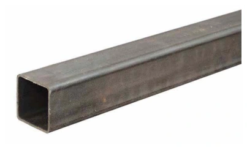
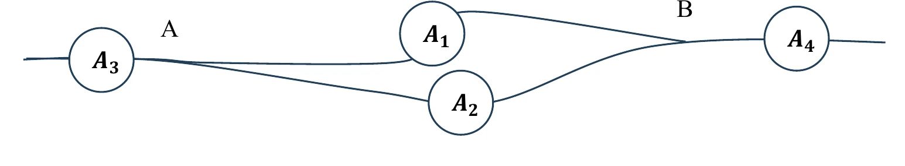

# Bài tập — Bài 1 — Dòng điện và cường độ dòng điện

[← Trở lại bài học](../../01-current-intensity.md)

## Phần A — Trắc nghiệm 4 lựa chọn

### Bài 1 — Mức 1 — Nhận biết

Điện lượng $12\,\mathrm C$ đi qua tiết diện dây trong $4\,\mathrm s$. Cường độ dòng điện trung bình là

A. $0,33\,\mathrm A$.

B. $3\,\mathrm A$.

C. $8\,\mathrm A$.

D. $48\,\mathrm A$.

??? success "Đáp án và lời giải"
    Chọn **B**. $I=\Delta q/\Delta t=12/4=3\,\mathrm A$.

### Bài 2 — Mức 1 — Nhận biết

Dòng điện không đổi là dòng điện có

A. chiều không đổi nhưng cường độ luôn biến đổi.

B. cường độ và chiều không đổi theo thời gian.

C. điện lượng bằng 0.

D. chỉ tồn tại trong kim loại.

??? success "Đáp án và lời giải"
    Chọn **B**.

### Bài 3 — Mức 1 — Nhận biết

Dòng điện trong kim loại có chiều quy ước

A. cùng chiều chuyển động có hướng của electron.

B. ngược chiều chuyển động có hướng của electron.

C. không liên quan điện trường.

D. từ cực âm sang cực dương ngoài nguồn.

??? success "Đáp án và lời giải"
    Chọn **B**. Chiều dòng điện quy ước là chiều chuyển động của điện tích dương.

### Bài 4 — Mức 1 — Nhận biết

Dòng điện $I=2\,\mathrm A$ chạy trong $30\,\mathrm s$. Điện lượng qua tiết diện là

A. $15\,\mathrm C$.

B. $28\,\mathrm C$.

C. $60\,\mathrm C$.

D. $120\,\mathrm C$.

??? success "Đáp án và lời giải"
    Chọn **C**. $q=It=2\cdot30=60\,\mathrm C$.

## Phần B — Đúng/Sai

### Bài 5 — Mức 2 — Thông hiểu

Xét cường độ dòng điện:

a) $1\,\mathrm A=1\,\mathrm{C/s}$.

b) $I=\Delta q/\Delta t$.

c) Trong kim loại, hạt tải điện chủ yếu là electron tự do.

d) Electron chuyển động nhiệt hỗn loạn hoàn toàn dừng lại khi có dòng điện.

??? success "Đáp án và lời giải"
    a) **Đúng.** Từ $I=\Delta q/\Delta t$, một ampe là dòng điện truyền một culông điện tích qua tiết diện trong một giây.

    b) **Đúng.** cho giá trị trung bình; dòng không đổi thì dùng trực tiếp.

    c) **Đúng.** Ion mạng tinh thể kim loại gần như cố định, còn electron dẫn có thể chuyển động có hướng và tạo dòng điện.

    d) **Sai.** chuyển động nhiệt vẫn tồn tại, chồng thêm chuyển động trôi có hướng.

### Bài 6 — Mức 2 — Thông hiểu

Một dây dẫn kim loại có mật độ electron tự do n, tiết diện S, tốc độ trôi trung bình v:

a) $I=neSv$ về độ lớn.

b) Tăng S, các yếu tố khác giữ nguyên, I tăng.

c) Tốc độ trôi bằng tốc độ lan truyền tín hiệu điện trong dây.

d) Điện lượng qua tiết diện trong thời gian t là $It$ với dòng không đổi.

??? success "Đáp án và lời giải"
    a) **Đúng.** Trong thời gian $\Delta t$, số hạt qua tiết diện là $nSv\Delta t$, nên $I=\Delta q/\Delta t=neSv$ về độ lớn.

    b) **Đúng.** Từ $I=neSv$, khi $n,e,v$ không đổi thì $I$ tỉ lệ thuận với tiết diện $S$.

    c) **Sai.** tốc độ trôi của electron rất nhỏ so với tốc độ truyền trường/tín hiệu.

    d) **Đúng.** Từ định nghĩa $I=\Delta q/\Delta t$, với dòng không đổi suy ra $q=It$.

## Phần C — Trả lời ngắn

### Bài 7 — Mức 3 — Vận dụng

Dòng điện $0,50\,\mathrm A$ chạy trong $2$ phút. Tính điện lượng và số electron qua tiết diện. Lấy $e=1,6\cdot10^{-19}\,\mathrm C$.

??? success "Đáp án và lời giải"
    $t=120\,\mathrm s$. $q=It=0,5\cdot120=60\,\mathrm C$. Số electron $N=q/e=60/(1,6\cdot10^{-19})=3,75\cdot10^{20}$.

### Bài 8 — Mức 3 — Vận dụng

Trong $0,20\,\mathrm s$ có $5\cdot10^{17}$ electron đi qua tiết diện dây. Tính cường độ dòng điện.

??? success "Đáp án và lời giải"
    $q=Ne=5\cdot10^{17}\cdot1,6\cdot10^{-19}=0,08\,\mathrm C$. $I=q/t=0,08/0,20=0,40\,\mathrm A$.

### Bài 9 — Mức 3 — Vận dụng

Dây dẫn có tiết diện $S=1\,\mathrm{mm^2}$, mật độ electron tự do $n=8,5\cdot10^{28}\,\mathrm m$⁻³, dòng điện $I=1,36\,\mathrm A$. Tính tốc độ trôi trung bình. Lấy $e=1,6\cdot10^{-19}\,\mathrm C$.

??? success "Đáp án và lời giải"
    $S=10^{-6}\,\mathrm{m^2}$. Từ $I=neSv$: $v=I/(neS)=1,36/(8,5\cdot10^{28}\cdot1,6\cdot10^{-19}\cdot10^{-6})=10^{-4}\,\mathrm{m/s}$ $=0,1\,\mathrm{mm/s}$.

## Phần D — Vận dụng và vận dụng cao

### Bài 10 — Mức 4 — Vận dụng cao

Một dây dẫn hình trụ có đường kính giảm dần nhưng cùng vật liệu và cùng dòng điện không đổi chạy qua. Ở tiết diện 1, bán kính $r_1=2r_2$. Giả sử mật độ hạt tải n như nhau. So sánh tốc độ trôi $v_1$ và $v_2$.

??? success "Đáp án và lời giải"
    Dòng điện liên tục nên $I=neSv$ như nhau tại hai tiết diện.

    $S\propto r^2$, nên $S_1/S_2=(r_1/r_2)^2=4$.

    Do $S_1v_1=S_2v_2$, suy ra $v_2=4v_1$. Hạt tải phải trôi nhanh hơn ở tiết diện nhỏ hơn để duy trì cùng dòng điện.

## Ngân hàng bài tập mở rộng

### Nhận biết — Trả lời ngắn

#### Bài 11

<!-- source-id: BT-Chuong-IV-p11-q1-47 -->

Cường độ của một dòng điện không đổi chạy qua dây tóc của một bóng đèn là $I=1{,}0\,\mathrm A$. Điện lượng chuyển qua tiết diện thẳng của dây tóc trong thời gian $\Delta t=1{,}5$ phút là bao nhiêu (tính theo đơn vị C)?

??? success "Đáp án và lời giải"
    **Đáp án:** $90$

    **Hướng dẫn giải:**

    $\Delta q=I\Delta t=1{,}0\cdot1{,}5\cdot60=90\,\mathrm C$.

    Vậy kết quả cần tìm là **$90$**.
#### Bài 12

<!-- source-id: BT-Chuong-IV-p12-q2-48 -->

Trong thời gian $\Delta t=30\,\mathrm s$, có một điện lượng $\Delta q=60\,\mathrm C$ chuyển qua tiết diện thẳng của dây dẫn. Số electron chuyển qua tiết diện thẳng của dây dẫn trong thời gian $\Delta t'=20\,\mathrm s$ là $X\times10^{20}$. Giá trị của $X$ là

??? success "Đáp án và lời giải"
    **Đáp án:** $2{,}5$

    **Hướng dẫn giải:**

    $I=\Delta q/\Delta t=60/30=2{,}0\,\mathrm A$.

    $N=I\Delta t'/e=2{,}0\cdot20/(1{,}6\times10^{-19})=2{,}5\times10^{20}$.

    Vậy $X=2{,}5$.
#### Bài 13

<!-- source-id: BT-Chuong-IV-p12-q3-49 -->

Mật độ electron tự do trong một đoạn dây nhôm hình trụ là $n=1{,}8\times10^{29}\,\mathrm{m^{-3}}$. Cường độ dòng điện chạy qua dây nhôm hình trụ có đường kính $d=2{,}0\,\mathrm{mm}$ là $I=2{,}0\,\mathrm A$. Lấy độ lớn điện tích của mỗi electron là $e=1{,}6\times10^{-19}\,\mathrm C$. Tính tốc độ dịch chuyển có hướng của các electron tự do trong dây nhôm đó (theo đơn vị $\mu\mathrm{m/s}$).

??? success "Đáp án và lời giải"
    **Đáp án:** $22{,}1$

    **Hướng dẫn giải:**

    Với $S=\pi d^2/4$ và $I=Snev$,

    $v=\dfrac{4I}{\pi d^2ne}\approx2{,}21\times10^{-5}\,\mathrm{m/s}=22{,}1\,\mu\mathrm{m/s}$.

    Vậy kết quả cần tìm là **$22{,}1$**.
#### Bài 14

<!-- source-id: BT-Chuong-IV-p12-q4-50 -->

Cho dòng điện không đổi cường độ $I=4{,}2\,\mathrm A$ chạy qua một đoạn dây dẫn bằng kim loại dài $l=80\,\mathrm{cm}$ có đường kính tiết diện thẳng $d=2{,}5\,\mathrm{mm}$. Mật độ electron dẫn của kim loại này là $n=8{,}5\times10^{28}\,\mathrm{m^{-3}}$. Lấy độ lớn điện tích của mỗi electron là $e=1{,}6\times10^{-19}\,\mathrm C$. Hãy tính thời gian trung bình $t$ để mỗi electron dẫn di chuyển hết chiều dài đoạn dây (theo đơn vị giờ và làm tròn đến chữ số thập phân thứ nhất sau dấu phẩy).

??? success "Đáp án và lời giải"
    **Đáp án:** $3{,}5$

    **Hướng dẫn giải:**

    Diện tích tiết diện dây là $S=\pi d^2/4$.

    Từ $I=Snev$ suy ra $v=4I/(\pi d^2ne)$.

    Do đó
    $t=l/v=l\pi d^2ne/(4I)\approx1{,}27\times10^4\,\mathrm s\approx3{,}53\,\mathrm h$.

    Làm tròn đến một chữ số sau dấu phẩy: **$3{,}5\,\mathrm h$**.
#### Bài 15

<!-- source-id: BT-Chuong-IV-p12-q5-51 -->

Trong một dây dẫn kim loại hình trụ tròn có dòng điện không đổi chạy qua. Mật độ electron dẫn của kim loại này là $n=8{,}0\times10^{28}\,\mathrm{m^{-3}}$. Tốc độ chuyển động có hướng của các electron dẫn trong dây kim loại này là $v=5{,}0\times10^{-5}\,\mathrm{m/s}$. Lấy độ lớn điện tích của mỗi electron là $e=1{,}6\times10^{-19}\,\mathrm C$. Hãy tính mật độ dòng điện chạy trong dây dẫn này (theo đơn vị $\mathrm{kA/m^2}$), biết

$j=I/S$.

??? success "Đáp án và lời giải"
    **Đáp án:** $640$

    **Hướng dẫn giải:**

    Từ $I=Snev$ suy ra $j=I/S=nev$.

    $j=8{,}0\times10^{28}\cdot5{,}0\times10^{-5}\cdot1{,}6\times10^{-19}=640\times10^3\,\mathrm{A/m^2}=640\,\mathrm{kA/m^2}$.

    Vậy kết quả cần tìm là **$640$**.
#### Bài 16

<!-- source-id: BT-Chuong-IV-p13-q6-52 -->

Trong một thí nghiệm mạ bạc, cần có điện tích $\Delta q=8{,}2\times10^3\,\mathrm C$ để lắng đọng một khối lượng bạc. Tính thời gian để khối bạc này lắng đọng khi cường độ dòng điện là $I=0{,}20\,\mathrm A$ (theo đơn vị $10^4\,\mathrm s$).

??? success "Đáp án và lời giải"
    **Đáp án:** $4{,}1$

    **Hướng dẫn giải:**

    $\Delta t=\Delta q/I=(8{,}2\times10^3)/0{,}20=4{,}1\times10^4\,\mathrm s$.

    Vậy kết quả cần tìm là **$4{,}1$**.
#### Bài 17

<!-- source-id: BT-Chuong-IV-p17-q1-75 -->

Trong một dây dẫn có dòng điện không đổi chạy qua. Điện lượng chuyển qua tiết diện thẳng của dây dẫn trong thời gian $300\,\mathrm s$ là $675\,\mathrm C$. Cường độ của dòng điện này bằng bao nhiêu ampe (A)?

??? success "Đáp án và lời giải"
    **Đáp án:** $2{,}25$

    **Hướng dẫn giải:**

    $I=\Delta q/\Delta t=675/300=2{,}25\,\mathrm A$.

    Vậy kết quả cần tìm là **$2{,}25$**.
#### Bài 18

<!-- source-id: BT-Chuong-IV-p18-q2-76 -->

Trong một dây dẫn có dòng điện không đổi cường độ $2{,}50\,\mathrm A$ chạy qua. Điện lượng chuyển qua tiết diện thẳng của dây dẫn trong thời gian $200\,\mathrm s$ bằng bao nhiêu coulomb (C)?

??? success "Đáp án và lời giải"
    **Đáp án:** $500$

    **Hướng dẫn giải:**

    $\Delta q=I\Delta t=2{,}50\cdot200=500\,\mathrm C$.

    Vậy kết quả cần tìm là **$500$**.
#### Bài 19

<!-- source-id: BT-Chuong-IV-p18-q3-77 -->

Một dòng điện không đổi chạy qua một dây dẫn kim loại hình trụ tròn. Trong thời gian $5{,}0\,\mathrm s$ có $7{,}5\times10^{18}$ electron tự do dịch chuyển có hướng qua tiết diện thẳng của dây dẫn. Lấy độ lớn điện tích nguyên tố là $1{,}6\times10^{-19}\,\mathrm C$. Cường độ của dòng điện này bằng bao nhiêu ampe (A)?

??? success "Đáp án và lời giải"
    **Đáp án:** $0{,}24$

    **Hướng dẫn giải:**

    $I=Ne/\Delta t=(7{,}5\times10^{18})(1{,}6\times10^{-19})/5{,}0=0{,}24\,\mathrm A$.

    Vậy kết quả cần tìm là **$0{,}24$**.
#### Bài 20

<!-- source-id: BT-Chuong-IV-p18-q4-78 -->

Mắc nối tiếp một bóng đèn với một ampe kế rồi nối hai đầu đoạn mạch này vào một nguồn điện không đổi thì thấy số chỉ của ampe kế là $450\,\mathrm{mA}$. Điện lượng chuyển qua bóng đèn trong thời gian $600\,\mathrm s$ bằng bao nhiêu coulomb (C)?

??? success "Đáp án và lời giải"
    **Đáp án:** $270$

    **Hướng dẫn giải:**

    Vì ampe kế mắc nối tiếp với bóng đèn nên cường độ dòng điện qua bóng đèn là $I=450\,\mathrm{mA}=0{,}450\,\mathrm A$.

    $\Delta q=I\Delta t=0{,}450\cdot600=270\,\mathrm C$.

#### Bài 21

<!-- source-id: BT-Chuong-IV-p18-q5-79 -->

Dòng điện không đổi có cường độ $3{,}30\,\mathrm A$ chạy trong một dây dẫn bằng đồng có đường kính tiết diện thẳng $0{,}500\,\mathrm{mm}$. Giả sử mỗi nguyên tử đồng có một electron tự do. Khối lượng riêng và nguyên tử lượng của đồng lần lượt là $9{,}00\times10^3\,\mathrm{kg/m^3}$ và $64{,}0\,\mathrm{g/mol}$. Cho số Avogadro là $N_A=6{,}02\times10^{23}\,\mathrm{mol^{-1}}$. Lấy độ lớn điện tích của mỗi electron là $1{,}60\times10^{-19}\,\mathrm C$. Tính độ lớn vận tốc trôi của các electron tự do tạo nên dòng điện trong dây đồng này ra đơn vị mm/s (làm tròn đến 2 chữ số sau dấu phẩy thập phân).

??? success "Đáp án và lời giải"
    **Đáp án:** $1{,}24$

    **Hướng dẫn giải:**

    Với khối lượng mol $M=64{,}0\times10^{-3}\,\mathrm{kg/mol}$, mật độ electron tự do là $n=N_A\rho/M$.

    Tiết diện dây $S=\pi d^2/4$. Từ $I=Snev$ suy ra
    $v=I/(Sne)\approx1{,}24\times10^{-3}\,\mathrm{m/s}=1{,}24\,\mathrm{mm/s}$.

    Vậy kết quả cần tìm là **$1{,}24$**.
#### Bài 22

<!-- source-id: BT-Chuong-IV-p19-q6-80 -->

Cho dòng điện không đổi cường độ $4{,}25\,\mathrm A$ chạy qua một đoạn dây dẫn bằng kim loại dài $2{,}00\,\mathrm{km}$ có đường kính tiết diện thẳng $2{,}50\,\mathrm{mm}$. Mật độ electron dẫn của kim loại này là $8{,}50\times10^{28}\,\mathrm{m^{-3}}$. Lấy độ lớn điện tích của mỗi electron là $1{,}60\times10^{-19}\,\mathrm C$. Thời gian trung bình để một electron dẫn di chuyển từ đầu này đến đầu kia của đoạn dây này là bao nhiêu tuần (làm tròn đến 1 chữ số sau dấu phẩy thập phân)?

??? success "Đáp án và lời giải"
    **Đáp án:** $51{,}9$

    **Hướng dẫn giải:**

    Từ $I=Snev$, với $S=\pi d^2/4$, suy ra
    $t=l/v=l\pi d^2ne/(4I)$.

    Thay số:
    $t\approx3{,}1416\times10^7\,\mathrm s$.

    Vì $1$ tuần $=604800\,\mathrm s$,
    $t\approx3{,}1416\times10^7/604800\approx51{,}94$ tuần.

    Làm tròn đến một chữ số sau dấu phẩy: **$51{,}9$ tuần**.
### Nhận biết — Trắc nghiệm 4 lựa chọn

#### Bài 23

<!-- source-id: BT-Chuong-IV-p4-q1-1 -->

Đơn vị nào sau đây là một đơn vị đo của cường độ dòng điện?

A. Coulomb.

B. Coulomb·giây.

C. Coulomb/giây.

D. Coulomb$^2$/giây.

??? success "Đáp án và lời giải"
    **Đáp án:** C

    **Hướng dẫn giải:**

    Vì $I=\Delta q/\Delta t$, đơn vị của cường độ dòng điện có thể viết là C/s.

    Vậy chọn **C**.
#### Bài 24

<!-- source-id: BT-Chuong-IV-p4-q2-2 -->

Hãy chọn thứ nguyên của cường độ dòng điện.

A. $I$.

B. $LT$.

C. $L^2T^{-3}$.

D. $IT^{-1}$.

??? success "Đáp án và lời giải"
    **Đáp án:** A

    **Hướng dẫn giải:**

    Thứ nguyên cơ bản của cường độ dòng điện là $I$.

    Vậy chọn **A**.
#### Bài 25

<!-- source-id: BT-Chuong-IV-p4-q3-3 -->

Cường độ dòng điện có thể được đo bằng

A. thước kẻ.

B. ampe kế.

C. cân.

D. đồng hồ.

??? success "Đáp án và lời giải"
    **Đáp án:** B

    **Hướng dẫn giải:**

    Ampe kế là dụng cụ dùng để đo cường độ dòng điện. Thước kẻ đo độ dài, cân đo khối lượng; “đồng hồ” nói chung không xác định đại lượng cần đo.
#### Bài 26

<!-- source-id: BT-Chuong-IV-p4-q4-4 -->

Cường độ dòng điện là đại lượng vật lý đặc trưng cho

A. độ mạnh yếu của dòng điện.

B. công suất của dòng điện.

C. tốc độ tiêu thụ năng lượng của dòng điện

D. khả năng tỏa nhiệt của dòng điện.

??? success "Đáp án và lời giải"
    **Đáp án:** A

    **Hướng dẫn giải:**

    Từ $I=\Delta q/\Delta t$, cường độ dòng điện cho biết mức điện lượng đi qua một tiết diện trong một đơn vị thời gian, tức đặc trưng cho độ mạnh yếu của dòng điện.
#### Bài 27

<!-- source-id: BT-Chuong-IV-p4-q5-5 -->

Cường độ dòng điện là đại lượng

A. vector.

B. vô hướng.

C. có thể đo bằng Watt kế.

D. có thể đo bằng lực kế.

??? success "Đáp án và lời giải"
    **Đáp án:** B

    **Hướng dẫn giải:**

    Cường độ dòng điện là đại lượng vô hướng. Đơn vị SI là ampe và dụng cụ đo trực tiếp là ampe kế.
#### Bài 28

<!-- source-id: BT-Chuong-IV-p4-q6-6 -->

Một ampe là cường độ của một dòng điện tương ứng với …(1)… được chuyển qua tiết diện thẳng của một dây dẫn trong …(2)… Từ thích hợp điền vào hai chỗ trống là

A. điện tích nguyên tố - một giây.

B. $1{,}6\times10^{-19}$ Coulomb – một giây.

C. $10^{19}$ Coulomb – một phút.

D. một Coulomb – một giây.

??? success "Đáp án và lời giải"
    **Đáp án:** D

    **Hướng dẫn giải:**

    $1\,\mathrm A=1\,\mathrm C/\mathrm s$.

    Vậy chọn **D**.
#### Bài 29

<!-- source-id: BT-Chuong-IV-p4-q7-7 -->

Một dòng chuyển dời có hướng của các hạt nào sau đây không được xem là một dòng điện?

A. Các hạt electron.

B. Các hạt ion $\mathrm H^+$.

C. Các hạt ion $\mathrm{Cl}^-$.

D. Các phân tử Nitrogen.

??? success "Đáp án và lời giải"
    **Đáp án:** D

    **Hướng dẫn giải:**

    Phân tử Nitrogen trung hòa điện nên dòng chuyển dời có hướng của chúng không tạo thành dòng điện.

    Vậy chọn **D**.
#### Bài 30

<!-- source-id: BT-Chuong-IV-p4-q8-8 -->

Phát biểu nào sau đây về cường độ dòng điện là không đúng?

A. Đơn vị cường độ dòng điện là Ampe.

B. Cường độ dòng điện được đo bằng Ampe kế.

C. Cường độ dòng điện càng lớn thì trong một đơn vị thời gian điện lượng chuyển qua tiết diện thẳng
của vật dẫn càng nhiều.

D. Dòng điện không đổi là dòng điện chỉ có chiều không thay đổi theo thời gian.

??? success "Đáp án và lời giải"
    **Đáp án:** D

    **Hướng dẫn giải:**

    Dòng điện không đổi phải có **cả chiều và cường độ không đổi theo thời gian**. Phương án D chỉ nêu điều kiện về chiều nên phát biểu không đầy đủ và là phát biểu sai cần chọn.
#### Bài 31

<!-- source-id: BT-Chuong-IV-p4-q9-9 -->

Cho các hạt ion dương và các hạt ion âm có cùng số lượng, độ lớn điện tích và tốc độ trôi, chuyển động
thành hai dòng có hướng. Đâu là một dòng điện có cường độ khác không?

A. Hai dòng ion khác dấu, ngược chiều.

B. Hai dòng ion khác dấu, cùng chiều.

C. Hai dòng ion dương, ngược chiều.

D. Hai dòng ion âm, ngược chiều.

??? success "Đáp án và lời giải"
    **Đáp án:** A

    **Hướng dẫn giải:**

    Dòng điện quy ước do ion dương chuyển động cùng chiều chuyển động của ion dương, còn do ion âm thì ngược chiều chuyển động của ion âm. Hai dòng ion trái dấu chuyển động ngược chiều vì thế tạo hai dòng điện quy ước **cùng chiều**, nên cường độ tổng khác không.
#### Bài 32

<!-- source-id: BT-Chuong-IV-p4-q10-10 -->

Dòng điện không đổi là dòng điện có

A. cường độ không đổi theo thời gian.

B. chiều không thay đổi theo thời gian.

C. chiều và cường độ thay đổi theo thời gian.

D. chiều và cường độ không thay đổi theo thời gian.

??? success "Đáp án và lời giải"
    **Đáp án:** D

    **Hướng dẫn giải:**

    Dòng điện không đổi có cả chiều và cường độ không thay đổi theo thời gian.

    Vậy chọn **D**.
#### Bài 33

<!-- source-id: BT-Chuong-IV-p5-q12-12 -->

Cường độ dòng điện không đổi qua một vật dẫn phụ thuộc vào những yếu tố nào?
I. Mật độ hạt tải điện trong vật dẫn
II. Bản chất của vật dẫn
III. Thời gian dòng điện qua vật dẫn.

A. I và II.

B. I.

C. I, II, III.

D. II và III.

??? success "Đáp án và lời giải"
    **Đáp án:** A

    **Hướng dẫn giải:**

    Với dòng điện không đổi, $I=neSv$. Mật độ hạt tải $n$ và đặc tính hạt tải/vật liệu ảnh hưởng đến dòng điện; thời gian dòng điện tồn tại không phải là một thông số trong biểu thức cường độ tức thời của trạng thái đã cho. Chọn I và II.
#### Bài 34

<!-- source-id: BT-Chuong-IV-p5-q13-13 -->

Điều kiện để có dòng điện là

A. phải có một vật dẫn điện.

B. phải có các hạt mang điện.

C. phải có các hạt mang điện chuyển động hỗn loạn.

D. phải có các hạt mang điện chuyển động có hướng.

??? success "Đáp án và lời giải"
    **Đáp án:** D

    **Hướng dẫn giải:**

    Dòng điện là chuyển động có hướng của điện tích. Vì vậy điều kiện trực tiếp phải có các hạt mang điện và chúng phải có chuyển động có hướng; chỉ có vật dẫn hay chuyển động nhiệt hỗn loạn chưa đủ.
#### Bài 35

<!-- source-id: BT-Chuong-IV-p5-q14-14 -->

Dòng điện là

A. dòng chuyển động của các điện tích.

B. dòng chuyển dời có hướng của các điện tích.

C. dòng chuyển dời của eletron.

D. dòng chuyển dời của ion dương.

??? success "Đáp án và lời giải"
    **Đáp án:** B

    **Hướng dẫn giải:**

    Định nghĩa dòng điện là dòng chuyển dời có hướng của các điện tích. Electron hay ion chỉ là các trường hợp hạt tải điện cụ thể.
#### Bài 36

<!-- source-id: BT-Chuong-IV-p5-q15-15 -->

Dòng điện trong kim loại là dòng chuyển dời có hướng của

A. các ion dương.

B. các electron.

C. các ion âm.

D. các nguyên tử.

??? success "Đáp án và lời giải"
    **Đáp án:** B

    **Hướng dẫn giải:**

    Trong kim loại, các ion dương nằm tại nút mạng; hạt tải điện chuyển động có hướng là các electron tự do. Vì vậy chọn B.
#### Bài 37

<!-- source-id: BT-Chuong-IV-p8-q38-38 -->

Một dây dẫn bằng kim loại có tiết diện tròn, đường kính tiết diện $3\,\mathrm{mm}$, có dòng điện $4\,\mathrm A$ chạy qua. Cho biết mật độ electron tự do trong dây dẫn là $8{,}45\times10^{28}\,\mathrm{m^{-3}}$. Vận tốc trôi của các electron gần bằng

A. $0{,}01\,\mathrm{mm/s}$.

B. $0{,}04\,\mathrm{mm/s}$.

C. $0{,}07\,\mathrm{mm/s}$.

D. $1{,}2\,\mathrm{mm/s}$.

??? success "Đáp án và lời giải"
    **Đáp án:** B

    **Hướng dẫn giải:**

    $v=I/(Sne)$ với $S=\pi d^2/4$, suy ra $v\approx0{,}042\,\mathrm{mm/s}$.

    Vậy chọn **B**.
#### Bài 38

<!-- source-id: BT-Chuong-IV-p8-q39-39 -->

Dòng điện không đổi có cường độ $1{,}3\,\mathrm A$ chạy trong một ống đồng có đường kính trong là $1{,}8\,\mathrm{mm}$, đường kính ngoài là $2\,\mathrm{mm}$. Khối lượng riêng và khối lượng mol của đồng lần lượt là $9\,\mathrm{tấn/m^3}$ và $64\,\mathrm{g/mol}$. Mỗi nguyên tử đồng cung cấp một electron tự do. Độ lớn vận tốc trôi của các electron tự do tạo nên dòng điện khoảng

A. $0{,}18\,\mu\mathrm{m/s}$.

B. $0{,}28\,\mu\mathrm{m/s}$.

C. $161\,\mu\mathrm{m/s}$.

D. $0{,}48\,\mu\mathrm{m/s}$.

??? success "Đáp án và lời giải"
    **Đáp án:** C

    **Hướng dẫn giải:**

    Mật độ electron tự do:

    $n=\dfrac{\rho}{M}N_A=\dfrac{9000}{0{,}064}\cdot6{,}02\cdot10^{23}\approx8{,}47\cdot10^{28}\,\mathrm{m^{-3}}$.

    Tiết diện dẫn điện của **ống** đồng là vành khăn:

    $S=\dfrac{\pi}{4}(D^2-d^2)=\dfrac{\pi}{4}[(2\cdot10^{-3})^2-(1{,}8\cdot10^{-3})^2]\approx5{,}97\cdot10^{-7}\,\mathrm{m^2}$.

    Dùng $I=nevS$:

    $v=\dfrac{I}{neS}\approx1{,}61\cdot10^{-4}\,\mathrm{m/s}\approx161\,\mu\mathrm{m/s}$.

    Vậy chọn **C**.

#### Bài 39

<!-- source-id: BT-Chuong-IV-p9-q40-40 -->

Giả sử có một vật được nối với hai dây dẫn mang hai dòng điện có cùng cường độ là $2\,\mathrm A$. Một dòng điện đi vào vật, một dòng điện đi ra khỏi vật. Số electron của vật thay đổi như thế nào theo thời gian?

A. Tăng $1{,}25\times10^{19}$ hạt mỗi giây.

B. Giảm $1{,}25\times10^{19}$ hạt mỗi giây.

C. Không đổi.

D. Tăng $2{,}5\times10^{19}$ hạt mỗi giây.

??? success "Đáp án và lời giải"
    **Đáp án:** C

    **Hướng dẫn giải:**

    Dòng điện đi vào vật bằng dòng điện đi ra khỏi vật nên vật không có sự tích trữ điện tích. Số electron của vật không đổi theo thời gian.
#### Bài 40

<!-- source-id: BT-Chuong-IV-p14-q1-53 -->

Chiều dòng điện được quy ước là chiều dịch chuyển có hướng của

A. electron.

B. neutron.

C. điện tích âm.

D. điện tích dương.

??? success "Đáp án và lời giải"
    **Đáp án:** D

    **Hướng dẫn giải:**

    Chiều dòng điện quy ước là chiều chuyển động có hướng của điện tích dương; với hạt tải âm thì chiều chuyển động của hạt ngược chiều dòng điện.
#### Bài 41

<!-- source-id: BT-Chuong-IV-p14-q2-54 -->

Đơn vị đo cường độ dòng điện là

A. ampe (A).

B. volta (V).

C. ohm (Ω).

D. watt (W).

??? success "Đáp án và lời giải"
    **Đáp án:** A

    **Hướng dẫn giải:**

    Đơn vị SI của cường độ dòng điện là ampe, ký hiệu A.
#### Bài 42

<!-- source-id: BT-Chuong-IV-p14-q3-55 -->

Quả cầu kim loại P tích điện dương, quả cầu kim loại N tích điện âm. Nối hai quả cầu bằng một dây
đồng thì sẽ có

A. dòng electron chuyển từ N qua P.

B. dòng electron chuyển từ P qua N.

C. dòng proton chuyển từ N qua P.

D. dòng proton chuyển từ P qua N.

??? success "Đáp án và lời giải"
    **Đáp án:** A

    **Hướng dẫn giải:**

    Quả cầu N tích điện âm có thừa electron, còn P tích điện dương thiếu electron. Khi nối bằng dây đồng, electron dịch chuyển từ N sang P, nên chọn A.
#### Bài 43

<!-- source-id: BT-Chuong-IV-p14-q4-56 -->

Một proton và một electron đang bay theo phương ngang, cùng vận tốc dọc theo hướng từ Tây sang
Đông tương ứng với hai dòng điện

A. cùng chiều từ Tây sang Đông.

B. ngược chiều và khác cường độ.

C. cùng chiều từ Đông sang Tây.

D. ngược chiều và cùng cường độ.

??? success "Đáp án và lời giải"
    **Đáp án:** D

    **Hướng dẫn giải:**

    Proton bay từ Tây sang Đông tạo dòng điện quy ước theo hướng Tây $\to$ Đông. Electron bay cùng hướng nhưng mang điện âm nên tạo dòng điện quy ước Đông $\to$ Tây. Vì $|q_p|=|q_e|$ và hai hạt có cùng tốc độ, hai cường độ bằng nhau về độ lớn.
#### Bài 44

<!-- source-id: BT-Chuong-IV-p14-q5-57 -->

Dòng điện trong kim loại là dòng dịch chuyển

A. của các điện tích.

B. có hướng của các điện tích tự do.

C. có hướng của các hạt mang điện.

D. có hướng của các ion dương và âm.

??? success "Đáp án và lời giải"
    **Đáp án:** B

    **Hướng dẫn giải:**

    Trong kim loại, dòng điện là chuyển động có hướng của các điện tích tự do, cụ thể là electron tự do. Phương án B diễn đạt đúng nhất trong các lựa chọn.
#### Bài 45

<!-- source-id: BT-Chuong-IV-p14-q6-58 -->

Chiều dòng điện trong một dây dẫn phụ thuộc vào

A. dấu của hạt tải điện trong dây dẫn ấy.

B. chiều của điện trường ngoài.

C. dấu của hạt tải điện trong dây dẫn và chiều của điện trường ngoài.

D. cường độ của điện trường ngoài

??? success "Đáp án và lời giải"
    **Đáp án:** B

    **Hướng dẫn giải:**

    Chiều dòng điện quy ước trùng chiều điện trường ngoài. Dấu hạt tải quyết định chiều chuyển động thực của hạt, nhưng không làm đổi quy ước chiều dòng điện đối với một điện trường đã cho.
#### Bài 46

<!-- source-id: BT-Chuong-IV-p14-q7-59 -->

Hạt tải điện trong kim loại là

A. electron tự do.

B. ion dương.

C. ion âm.

D. proton.

??? success "Đáp án và lời giải"
    **Đáp án:** A

    **Hướng dẫn giải:**

    Hạt tải điện có khả năng chuyển động trong kim loại là electron tự do; các ion dương của mạng tinh thể chỉ dao động quanh vị trí cân bằng.
#### Bài 47

<!-- source-id: BT-Chuong-IV-p14-q8-60 -->

Dòng điện không đổi là dòng điện có

A. chiều không thay đổi theo thời gian.

B. cường độ thay đổi theo thời gian.

C. điện lượng chuyển qua tiết diện thẳng của dây dẫn thay đổi theo thời gian.

D. chiều và cường độ không thay đổi theo thời gian.

??? success "Đáp án và lời giải"
    **Đáp án:** D

    **Hướng dẫn giải:**

    Dòng điện không đổi là dòng điện có **chiều và cường độ** không thay đổi theo thời gian. Vì vậy D đầy đủ.
#### Bài 48

<!-- source-id: BT-Chuong-IV-p14-q9-61 -->

Trong một dây dẫn có dòng điện không đổi chạy qua. Điện lượng chuyển qua tiết diện thẳng của dây trong thời gian $\Delta t$ là $\Delta q$ thì cường độ của dòng điện này là

A. $I=\Delta q\,\Delta t$.

B. $I=\dfrac{\Delta q}{\Delta t}$.

C. $I=\dfrac{\Delta t}{\Delta q}$.

D. $I=2\dfrac{\Delta q}{\Delta t}$.

??? success "Đáp án và lời giải"
    **Đáp án:** B

    **Hướng dẫn giải:**

    Theo định nghĩa cường độ dòng điện không đổi, $I=\Delta q/\Delta t$.

    Vậy chọn **B**.
#### Bài 49

<!-- source-id: BT-Chuong-IV-p15-q11-63 -->

Điều kiện để có dòng điện là

A. chỉ cần có hiệu điện thế.

B. chỉ cần duy trì một hiệu điện thế giữa hai đầu vật dẫn.

C. chỉ cần có nguồn điện.

D. chỉ cần có các vật dẫn nối liền với nhau thành mạch điện kín.

??? success "Đáp án và lời giải"
    **Đáp án:** B

    **Hướng dẫn giải:**

    Trong một vật dẫn đã có hạt tải tự do, duy trì hiệu điện thế giữa hai đầu vật dẫn tạo điện trường làm các hạt tải chuyển động có hướng. Trong các lựa chọn, B là điều kiện phù hợp nhất với ngữ cảnh nguồn.
#### Bài 50

<!-- source-id: BT-Chuong-IV-p15-q12-64 -->

Tác dụng đặc trưng nhất của dòng điện là

A. tác dụng từ.

B. tác dụng nhiệt.

C. tác dụng hóa học.

D. tác dụng cơ học.

??? success "Đáp án và lời giải"
    **Đáp án:** A

    **Hướng dẫn giải:**

    Tác dụng từ là tác dụng đặc trưng của dòng điện vì xuất hiện đối với dòng điện trong mọi môi trường; các tác dụng nhiệt hay hóa học phụ thuộc điều kiện và môi trường.
#### Bài 51

<!-- source-id: BT-Chuong-IV-p15-q13-65 -->

Trong nước muối, các hạt tải điện chủ yếu là

A. các electron tự do.

B. các ion Na+.

C. các ion Cl-

D. các ion Na+ và ion Cl-.

??? success "Đáp án và lời giải"
    **Đáp án:** D

    **Hướng dẫn giải:**

    Nước muối phân li thành các ion; cả $\mathrm{Na^+}$ và $\mathrm{Cl^-}$ đều là hạt tải điện và chuyển động có hướng trong điện trường.
#### Bài 52

<!-- source-id: BT-Chuong-IV-p15-q14-66 -->

Một dây dẫn điện bằng đồng có tiết diện nhỏ dần dọc theo dây từ đầu này sang đầu kia của dây. Trong
dây có dòng điện điện không đổi chạy qua. Tốc độ dịch chuyển có hướng của electron thay đổi như thế nào dọc
theo dây?

A. Giảm dần khi tiết diện dây nhỏ dần.

B. Tăng dần khi tiết diện dây nhỏ dần.

C. Không thay đổi.

D. Giảm dần rồi tăng dần khi tiết diện dây tăng dần.

??? success "Đáp án và lời giải"
    **Đáp án:** B

    **Hướng dẫn giải:**

    Dòng điện không đổi qua cùng vật liệu thỏa $I=neSv$. Với $I,n,e$ không đổi, $v\propto1/S$; tiết diện càng nhỏ thì tốc độ trôi càng lớn.
#### Bài 53

<!-- source-id: BT-Chuong-IV-p15-q15-67 -->

Gọi $S$ là diện tích tiết diện thẳng của một dây dẫn kim loại hình trụ tròn, $n$ là mật độ electron tự do (số electron tự do trong một đơn vị thể tích), $v$ là tốc độ trung bình trong chuyển động có hướng của các electron tự do và $e$ là độ lớn điện tích của mỗi electron thì cường độ $I$ của dòng điện chạy trong dây dẫn là

A. $I=ne/(Sv)$.

B. $I=nv/(Se)$.

C. $I=nve/S$.

D. $I=Snve$.

??? success "Đáp án và lời giải"
    **Đáp án:** D

    **Hướng dẫn giải:**

    Với dòng điện trong kim loại, $I=Snve$.

    Vậy chọn **D**.
#### Bài 54

<!-- source-id: BT-Chuong-IV-p15-q16-68 -->

Một dòng điện đi qua hai đoạn dây dẫn đồng chất, ở đoạn dây mảnh hơn thì tốc độ dịch chuyển có
hướng của các hạt mang điện sẽ

A. nhỏ hơn.

B. lớn hơn.

C. vẫn bằng dây dẫn kia.

D. có thể nhỏ hơn hoặc lớn hơn.

??? success "Đáp án và lời giải"
    **Đáp án:** B

    **Hướng dẫn giải:**

    Hai đoạn đồng chất mang cùng dòng điện nên $I=neSv$. Do $n$ như nhau và đoạn mảnh có $S$ nhỏ hơn, tốc độ trôi $v$ ở đoạn mảnh lớn hơn.
#### Bài 55

<!-- source-id: BT-Chuong-IV-p15-q17-69 -->

Điện lượng chuyển qua tiết diện thẳng của một dây dẫn kim loại trong thời gian $5{,}0\,\mathrm s$ là $1{,}2\,\mathrm C$. Số electron đi qua tiết diện thẳng của dây dẫn này trong thời gian nói trên là

A. $9{,}6\times10^{19}$.

B. $3{,}4\times10^{19}$.

C. $1{,}5\times10^{18}$.

D. $7{,}5\times10^{18}$.

??? success "Đáp án và lời giải"
    **Đáp án:** D

    **Hướng dẫn giải:**

    $N=\Delta q/e=1{,}2/(1{,}6\times10^{-19})=7{,}5\times10^{18}$.

    Vậy chọn **D**.
#### Bài 56

<!-- source-id: BT-Chuong-IV-p15-q18-70 -->

Số electron đi qua tiết diện thẳng của một dây dẫn kim loại trong $1{,}0\,\mathrm s$ khi có điện lượng $1{,}6\,\mathrm C$ dịch chuyển qua tiết diện thẳng của dây dẫn đó trong $4{,}0\,\mathrm s$ là

A. $1{,}0\times10^{19}$.

B. $2{,}5\times10^{18}$.

C. $1{,}8\times10^{18}$.

D. $4{,}4\times10^{17}$.

??? success "Đáp án và lời giải"
    **Đáp án:** B

    **Hướng dẫn giải:**

    Trong $1\,\mathrm s$, điện lượng qua tiết diện là $\Delta q=1{,}6/4=0{,}4\,\mathrm C$.

    $N=\Delta q/e=0{,}4/(1{,}6\times10^{-19})=2{,}5\times10^{18}$.

    Vậy chọn **B**.
### Nhận biết — Đúng/Sai

#### Bài 57

<!-- source-id: BT-Chuong-IV-p9-q1-41 -->

Hãy nhận định đúng, sai khi nói về dòng điện.

a) Dòng điện có thể tồn tại trong kim loại.

b) Dòng điện không thể tồn tại trong chân không vì trong chân không không có hạt tải điện.

c) Muốn có dòng điện, bắt buộc phải có các electron chuyển động thành một dòng có hướng.

d) Nước tinh khiết là một chất có mật độ hạt tải điện rất cao.

??? success "Đáp án và lời giải"
    **Đáp án:** a) Đúng; b) Sai; c) Sai; d) Sai

    **Hướng dẫn giải:**

    a) **Đúng.** Kim loại có electron tự do nên có thể tồn tại dòng điện khi có điện trường thích hợp.

    b) **Sai.** Chân không không có hạt tải sẵn như trong vật dẫn, nhưng chùm electron hoặc ion được phát vào chân không vẫn tạo được dòng điện.

    c) **Sai.** Dòng điện có thể do ion dương, ion âm hoặc các hạt mang điện khác chuyển động có hướng; không bắt buộc phải là electron.

    d) **Sai.** Nước tinh khiết có nồng độ ion rất nhỏ nên dẫn điện rất kém, không có mật độ hạt tải điện “rất cao”.
#### Bài 58

<!-- source-id: BT-Chuong-IV-p9-q2-42 -->

Hãy nhận định đúng, sai khi nói về một dây dẫn thẳng được đặt giữa một hiệu điện thế không đổi.

a) Cường độ điện trường trong lòng dây dẫn giảm nếu tăng chiều dài của dây.

b) Vận tốc trôi của các hạt tải điện tăng nếu giảm chiều dài của dây.

c) Khi tăng tiết diện của dây, cường độ dòng điện tăng vì các hạt tải điện được chuyển động trong không gian rộng hơn, do đó được tăng vận tốc trôi.

d) Mật độ của hạt tải điện không phụ thuộc vào đặc điểm hình học của dây dẫn (chiều dài, tiết diện, hình dạng,…).

??? success "Đáp án và lời giải"
    **Đáp án:** a) Đúng; b) Đúng; c) Sai; d) Đúng

    **Hướng dẫn giải:**

    a) **Đúng.** Với dây đồng chất đặt dưới hiệu điện thế không đổi, $E\approx U/l$; tăng $l$ làm $E$ giảm.

    b) **Đúng.** Giảm $l$ làm $E$ tăng; trong mô hình dẫn điện ohmic, tốc độ trôi tỉ lệ với điện trường nên tăng.

    c) **Sai.** Tăng tiết diện làm số hạt có thể qua một tiết diện trong mỗi giây tăng. Nó không làm tốc độ trôi tăng chỉ vì “không gian rộng hơn”.

    d) **Đúng.** Mật độ hạt tải $n$ là đặc trưng vi mô của vật liệu ở trạng thái xét, không do chiều dài hay tiết diện hình học quyết định.
#### Bài 59

<!-- source-id: BT-Chuong-IV-p10-q3-43 -->

Cho một đoạn dây dẫn có tiết diện tròn, đường kính tiết diện đều như có một đoạn đường kính nhỏ hơn
so với phần còn lại của dây dẫn. Trong quá trình dòng điện chạy qua, đoạn dây có đường kính hẹp không bị tích
điện.

a) Tiết diện của đoạn hẹp bé hơn tiết diện của dây chính.

b) Cường độ dòng điện trong dây chính bằng với cường độ dòng điện qua đoạn bị hẹp.

c) Mật độ electron dẫn ở đoạn bị hẹp thấp hơn so với trong dây chính.

d) Vận tốc trôi của electron trong đoạn bị hẹp lớn hơn so với trong dây chính.

??? success "Đáp án và lời giải"
    **Đáp án:** a) Đúng; b) Đúng; c) Sai; d) Đúng

    **Hướng dẫn giải:**

    a) **Đúng.** Đoạn có đường kính nhỏ hơn có tiết diện $S=\pi d^2/4$ nhỏ hơn.

    b) **Đúng.** Không có tích điện theo thời gian nên điện lượng qua các tiết diện trong cùng thời gian bằng nhau; cường độ dòng điện dọc dây bằng nhau.

    c) **Sai.** Hai đoạn là cùng vật liệu nên mật độ electron dẫn $n$ không giảm chỉ vì tiết diện nhỏ hơn.

    d) **Đúng.** Từ $I=neSv$, với $I,n,e$ không đổi và $S$ nhỏ hơn thì $v$ lớn hơn.
#### Bài 60

<!-- source-id: BT-Chuong-IV-p10-q4-44 -->

Người ta đặt một thanh thép như hình bên vào một hiệu điện thế không đổi. Biết thanh thép có tiết diện dạng hình vuông có chu vi trong là $8\,\mathrm{cm}$, bề dày $1\,\mathrm{mm}$. Cho mật độ hạt tải điện của thép là $8{,}4\times10^{28}$ electron/$\mathrm{m^3}$ và vận tốc trôi của các hạt tải điện là $0{,}4\,\mathrm{mm/s}$.

{ loading=lazy }

a) Hạt tải điện trong thanh thép là các electron.

b) Tiết diện thẳng của thanh thép là $1{,}65\,\mathrm{cm^2}$.

c) Cường độ dòng điện qua thanh thép là khoảng $86{,}55\,\mathrm A$.

d) Mật độ dòng điện của thanh thép không đổi nếu ta tăng bề dày của thanh thêm $1\,\mathrm{mm}$, còn hiệu điện thế và chiều dài thanh không đổi.

??? success "Đáp án và lời giải"
    **Đáp án:** a) Đúng; b) Sai; c) Sai; d) Đúng.

    **Hướng dẫn giải:**

    a) **Đúng.** Trong kim loại, hạt tải điện là electron tự do.

    b) **Sai.** Chu vi trong là $8\,\mathrm{cm}$ nên cạnh trong $a=8/4=2\,\mathrm{cm}$. Bề dày $t=1\,\mathrm{mm}$ $=0{,}1\,\mathrm{cm}$, do đó cạnh ngoài $a+2t=2{,}2\,\mathrm{cm}$. Tiết diện phần thép là $S=2{,}2^2-2^2=0{,}84\,\mathrm{cm^2}$.

    c) **Sai.** Đổi $S=8{,}4\cdot10^{-5}\,\mathrm{m^2}$ và $v=0{,}4\cdot10^{-3}\,\mathrm{m/s}$. Khi đó

    $I=neSv=8{,}4\cdot10^{28}\cdot1{,}6\cdot10^{-19}\cdot8{,}4\cdot10^{-5}\cdot0{,}4\cdot10^{-3}\approx451{,}6\,\mathrm A$,

    không phải $86{,}55\,\mathrm A$.

    d) **Đúng.** Với cùng vật liệu, cùng chiều dài và hiệu điện thế, điện trường trong thanh không đổi nên mật độ dòng điện $j=\sigma E$ không phụ thuộc tiết diện. Tăng bề dày làm tăng $I$ và $S$ cùng tỉ lệ nhưng không đổi $j=I/S$.

#### Bài 61

<!-- source-id: BT-Chuong-IV-p10-q5-45 -->

Một dây dẫn bằng đồng có dòng điện không đổi chạy qua. Biết rằng các hạt tải điện trong dây là các electron. Mắc một ampe kế vào giữa sợi dây như hình bên, đọc được số chỉ là $5\,\mathrm A$.

{ loading=lazy }

a) Cường độ dòng điện qua dây là $5\,\mathrm A$.

b) Trong mỗi giây, điện lượng truyền qua tiết diện của dây là $5\,\mathrm C$.

c) Trong bốn phút, điện lượng truyền qua tiết diện của dây là $120\,\mathrm C$.

d) Số electron đã truyền qua trong 4 phút trên là $7{,}5\times10^{21}$ hạt.

??? success "Đáp án và lời giải"
    **Đáp án:** a) Đúng; b) Đúng; c) Sai; d) Đúng

    **Hướng dẫn giải:**

    a) **Đúng.** Số chỉ ampe kế mắc nối tiếp là cường độ dòng điện qua dây: $I=5\,\mathrm A$.

    b) **Đúng.** Trong $1\,\mathrm s$, $q=It=5\cdot1=5\,\mathrm C$.

    c) **Sai.** Bốn phút là $240\,\mathrm s$, nên $q=5\cdot240=1200\,\mathrm C$, không phải $120\,\mathrm C$.

    d) **Đúng.** $N=q/e=1200/(1{,}6\times10^{-19})=7{,}5\times10^{21}$ electron.
#### Bài 62

<!-- source-id: BT-Chuong-IV-p11-q6-46 -->

Cho một đoạn dây dẫn làm từ một kim loại duy nhất, được tách làm đôi từ điểm A và được hàn dính lại ở điểm B. Đặt các ampe kế như hình để đo cường độ dòng điện qua các đoạn dây. Dòng điện chạy từ bên trái sang bên phải. Tiết diện của hai nhánh là khác nhau. Không phần tử nào trên dây bị tích điện theo thời gian.

{ loading=lazy }

a) Dòng chuyển dời của các electron trong dây là từ phải sang trái.

b) Tổng số electron mỗi giây qua nút A bằng tổng số electron mỗi giây qua hai nhánh ở giữa hai nút A, B.

c) Tổng số đo của ampe kế số 1 và ampe kế số 2 bằng số đo của ampe kế số 3.

d) Số đo của ampe kế số 3 bằng số đo của ampe kế số 4.

??? success "Đáp án và lời giải"
    **Đáp án:** a) Đúng; b) Đúng; c) Đúng; d) Đúng

    **Hướng dẫn giải:**

    a) **Đúng.** Dòng điện quy ước chạy từ trái sang phải nên electron trong kim loại dịch chuyển có hướng từ phải sang trái.

    b) **Đúng.** Nút A không tích điện theo thời gian nên điện lượng vào nút trong mỗi giây bằng tổng điện lượng đi ra hai nhánh.

    c) **Đúng.** Định luật nút cho $I_3=I_1+I_2$.

    d) **Đúng.** Tại nút B cũng không tích điện, nên $I_4=I_1+I_2=I_3$.
#### Bài 63

<!-- source-id: BT-Chuong-IV-p16-q1-71 -->

Trong một đoạn dây dẫn kim loại có dòng điện không đổi chạy qua.

a) Dòng điện này có cường độ không đổi.

b) Chiều của dòng điện này thay đổi theo thời gian.

c) Dòng điện này là dòng dịch chuyển có hướng của tất cả các electron có trong dây kim loại.

d) Chiều của dòng điện này là chiều chuyển động của các hạt mang điện dịch chuyển có hướng.

??? success "Đáp án và lời giải"
    **Đáp án:** a) Đúng; b) Sai; c) Sai; d) Sai

    **Hướng dẫn giải:**

    a) **Đúng.** Dòng điện không đổi có cường độ không đổi theo thời gian.

    b) **Sai.** Dòng điện không đổi còn có chiều không đổi theo thời gian.

    c) **Sai.** Chỉ các electron **tự do** tham gia chuyển động trôi tạo dòng điện; không phải tất cả electron trong nguyên tử kim loại.

    d) **Sai.** Chiều dòng điện là chiều chuyển động quy ước của điện tích dương. Trong kim loại, electron chuyển động ngược chiều dòng điện.
#### Bài 64

<!-- source-id: BT-Chuong-IV-p16-q2-72 -->

Trong một đoạn dây dẫn kim loại có dòng điện không đổi cường độ $2{,}50\,\mathrm A$ chạy qua. Lấy độ lớn điện tích nguyên tố là $1{,}6\times10^{-19}\,\mathrm C$.

a) Dòng điện trong dây dẫn này là dòng dịch chuyển có hướng của các proton.

b) Điện tích của mỗi electron tự do là $1{,}6\times10^{-19}\,\mathrm C$.

c) Điện lượng chuyển qua tiết diện thẳng của dây dẫn trong thời gian $120\,\mathrm s$ là $300\,\mathrm C$.

d) Số electron tự do dịch chuyển qua tiết diện thẳng của dây trong thời gian $240\,\mathrm s$ là $3{,}75\times10^{21}$.

??? success "Đáp án và lời giải"
    **Đáp án:** a) Sai; b) Sai; c) Đúng; d) Đúng

    **Hướng dẫn giải:**

    a) **Sai.** Hạt tải điện trong kim loại là electron tự do, không phải proton.

    b) **Sai.** Điện tích của electron là $q_e=-1{,}6\times10^{-19}\,\mathrm C$; $1{,}6\times10^{-19}\,\mathrm C$ chỉ là độ lớn điện tích nguyên tố.

    c) **Đúng.** $q=It=2{,}50\cdot120=300\,\mathrm C$.

    d) **Đúng.** Trong $240\,\mathrm s$, $q=2{,}50\cdot240=600\,\mathrm C$, nên $N=q/e=3{,}75\times10^{21}$ electron.
#### Bài 65

<!-- source-id: BT-Chuong-IV-p16-q3-73 -->

Dòng điện không đổi chạy qua một đoạn dây dẫn kim loại MN theo chiều từ M đến N. Diện tích tiết diện thẳng của dây dẫn tăng dần từ M đến N.

a) Các electron tự do dịch chuyển có hướng từ M đến N.

b) Trong cùng thời gian, điện lượng chuyển qua tiết diện thẳng của dây là như nhau tại mọi vị trí.

c) Tốc độ chuyển động có hướng của electron giảm dần.

d) Mật độ của dòng điện này không thay đổi dọc theo đoạn dây MN. Biết mật độ dòng điện là cường độ dòng điện trên một đơn vị diện tích tiết diện thẳng của dây dẫn.

??? success "Đáp án và lời giải"
    **Đáp án:** a) Sai; b) Đúng; c) Sai; d) Sai

    **Hướng dẫn giải:**

    a) **Sai.** Electron chuyển động có hướng ngược chiều dòng điện, tức từ N về M.

    b) **Đúng.** Với dòng điện không đổi, trong cùng khoảng thời gian $\Delta q=I\Delta t$ như nhau qua mọi tiết diện.

    c) **Sai.** Electron đi từ N về M, tức đi về phía tiết diện nhỏ dần; từ $I=neSv$ suy ra độ lớn tốc độ trôi tăng dần.

    d) **Sai.** $j=I/S$; $I$ không đổi nhưng $S$ tăng từ M đến N nên mật độ dòng điện giảm theo chiều M $\to$ N.
#### Bài 66

<!-- source-id: BT-Chuong-IV-p17-q4-74 -->

Trong một đoạn dây dẫn kim loại GH có dạng hình trụ tròn và diện tích tiết diện thẳng $6{,}0\times10^{-3}\,\mathrm{cm^2}$ có dòng điện không đổi cường độ $0{,}25\,\mathrm A$ chạy qua theo chiều từ G đến H. Biết mật độ dòng điện là cường độ dòng điện trên một đơn vị diện tích tiết diện thẳng của dây dẫn, được tính theo công thức $j=I/S$.

a) Dòng điện trong dây dẫn này là dòng dịch chuyển có hướng của các neutron.

b) Chiều dịch chuyển có hướng của các hạt mang điện để tạo ra dòng điện này là chiều từ G đến H.

c) Điện lượng chuyển qua tiết diện thẳng của dây dẫn trong thời gian $150\,\mathrm s$ là $37{,}5\,\mathrm C$.

d) Mật độ dòng điện chạy qua dây dẫn này là $4{,}2\times10^5\,\mathrm{A/m^2}$.

??? success "Đáp án và lời giải"
    **Đáp án:** a) Sai; b) Sai; c) Đúng; d) Đúng

    **Hướng dẫn giải:**

    a) **Sai.** Trong kim loại, dòng điện do electron tự do chuyển động có hướng tạo nên; neutron không mang điện.

    b) **Sai.** Dòng điện quy ước từ G đến H nên electron dịch chuyển có hướng từ H đến G.

    c) **Đúng.** $q=It=0{,}25\cdot150=37{,}5\,\mathrm C$.

    d) **Đúng.** $S=6{,}0\times10^{-3}\,\mathrm{cm^2}=6{,}0\times10^{-7}\,\mathrm{m^2}$, nên $j=I/S\approx4{,}17\times10^5\,\mathrm{A/m^2}\approx4{,}2\times10^5\,\mathrm{A/m^2}$.
### Thông hiểu — Trắc nghiệm 4 lựa chọn

#### Bài 67

<!-- source-id: BT-Chuong-IV-p5-q16-16 -->

Dòng điện chạy trong mạch điện nào dưới đây không phải là dòng điện không đổi ?

A. Trong mạch điện thắp sáng đèn của xe đạp với nguồn điện là dynamo.

B. Trong mạch điện kín của đèn pin.

C. Trong mạch điện kín thắp sáng đèn với nguồn điện là acquy.

D. Trong mạch điện kín thắp sáng đèn với nguồn điện là pin Mặt Trời.

??? success "Đáp án và lời giải"
    **Đáp án:** A

    **Hướng dẫn giải:**

    Dynamo xe đạp phát điện áp biến thiên theo chuyển động quay nên dòng qua đèn không phải dòng điện không đổi. Pin, ắc-quy và pin Mặt Trời trong mô hình bài học có thể cấp dòng một chiều ổn định cho mạch tải.
#### Bài 68

<!-- source-id: BT-Chuong-IV-p5-q17-17 -->

Điều kiện để có dòng điện là

A. có hiệu điện thế.

B. có điện tích tự do.

C. có điện trường và điện tích tự do.

D. có nguồn điện.

??? success "Đáp án và lời giải"
    **Đáp án:** C

    **Hướng dẫn giải:**

    Để có dòng điện cần có hạt mang điện tự do và tác nhân làm chúng chuyển động có hướng; trong mô hình dẫn điện đó là điện trường. Vì vậy chọn C.
#### Bài 69

<!-- source-id: BT-Chuong-IV-p5-q18-18 -->

Hạt nào sau đây không thể tải điện?

A. proton.

B. electron.

C. ion.

D. neutron.

??? success "Đáp án và lời giải"
    **Đáp án:** D

    **Hướng dẫn giải:**

    Neutron trung hòa điện nên không thể trực tiếp là hạt tải điện. Proton, electron và ion đều mang điện.
#### Bài 70

<!-- source-id: BT-Chuong-IV-p5-q19-19 -->

Tác dụng nào dưới đây không phải là tác dụng của dòng điện?

A. Tác dụng cơ.

B. Tác dụng nhiệt.

C. Tác dụng hoá học.

D. Tác dụng từ.

??? success "Đáp án và lời giải"
    **Đáp án:** A

    **Hướng dẫn giải:**

    Theo hệ tác dụng của dòng điện dùng trong nguồn, các tác dụng cơ bản được nêu là nhiệt, hóa học và từ; tác dụng cơ học là hệ quả có thể xuất hiện qua tương tác điện từ chứ không được xếp là tác dụng trực tiếp trong câu này.
#### Bài 71

<!-- source-id: BT-Chuong-IV-p5-q20-20 -->

Một dây dẫn (A) làm bằng một kim loại nào đó, có chiều dài $l$, có tiết diện đều $S$, vận tốc trôi của các electron là $v$, mật độ electron dẫn là $n$. Dòng điện qua dây dẫn hoặc hệ dây dẫn nào sau đây có cùng cường độ với dây dẫn A? Cho rằng vận tốc trôi của các electron dẫn là không đổi.

A. Một dây dẫn có cùng chiều dài, làm bằng cùng vật liệu, có tiết diện $S/2$.

B. Một dây dẫn có cùng chiều dài, làm bằng vật liệu có mật độ electron là $1,5n$, có tiết diện $1,5S$.

C. Hai dây (A) được hàn nối đuôi nhau, các electron chạy liên tục từ dây dẫn này sang dây dẫn kia.

D. Hai đoạn dây dẫn giống hệt với dây dẫn A, được cặp song song nhau và hàn dính lại.

??? success "Đáp án và lời giải"
    **Đáp án:** C

    **Hướng dẫn giải:**

    Với dòng điện trong kim loại, $I=neSv$. Ở phương án C, hai đoạn dây giống hệt được nối tiếp nên mật độ hạt tải, tiết diện và vận tốc trôi trong mỗi đoạn không đổi so với dây A; cường độ dòng điện vì thế vẫn bằng của dây A.

    Vì vậy chọn **C**.

#### Bài 72

<!-- source-id: BT-Chuong-IV-p6-q22-22 -->

Những yếu tố nào sau đây ảnh hưởng đến cường độ dòng điện chạy qua một dây dẫn? Cho hiệu điện
thế hai đầu dây dẫn là không đổi.
I. Chiều dài của dây dẫn.
II. Tiết diện của dây dẫn.
III. Chất liệu làm dây dẫn.

A. I, II.

B. II, III.

C. III.

D. I, II, III.

??? success "Đáp án và lời giải"
    **Đáp án:** D

    **Hướng dẫn giải:**

    Với hiệu điện thế không đổi, $I=U/R$ và $R=\rho l/S$, do đó $I=US/(\rho l)$. Vì thế chiều dài $l$, tiết diện $S$ và vật liệu (qua $\rho$) đều ảnh hưởng đến cường độ dòng điện.
#### Bài 73

<!-- source-id: BT-Chuong-IV-p6-q23-23 -->

Tính số electron đi qua tiết diện thẳng của một dây dẫn kim loại trong 1 giây nếu có điện lượng $15\,\mathrm C$ dịch chuyển qua tiết diện đó trong 30 giây.

A. $28{,}125\times10^{20}$.

B. $3{,}125\times10^{18}$.

C. $3{,}125\times10^{17}$.

D. $28{,}125\times10^{21}$.

??? success "Đáp án và lời giải"
    **Đáp án:** B

    **Hướng dẫn giải:**

    Trong $1\,\mathrm s$, $\Delta q=15/30=0{,}5\,\mathrm C$.

    $N=\Delta q/e=0{,}5/(1{,}6\times10^{-19})=3{,}125\times10^{18}$.

    Vậy chọn **B**.
#### Bài 74

<!-- source-id: BT-Chuong-IV-p6-q24-24 -->

Cường độ dòng điện không đổi chạy qua dây tóc của một bóng đèn là $0{,}5\,\mathrm A$ thì điện lượng dịch chuyển qua tiết diện thẳng của dây tóc trong một phút là

A. $70\,\mathrm C$.

B. $60\,\mathrm C$.

C. $80\,\mathrm C$.

D. $30\,\mathrm C$.

??? success "Đáp án và lời giải"
    **Đáp án:** D

    **Hướng dẫn giải:**

    $\Delta q=I\Delta t=0{,}5\cdot60=30\,\mathrm C$.

    Vậy chọn **D**.
#### Bài 75

<!-- source-id: BT-Chuong-IV-p6-q25-25 -->

Số electron đi qua tiết diện thẳng của một dây dẫn kim loại trong 1 giây là $1{,}25\times10^{19}$. Điện lượng tải qua tiết diện đó trong 15 giây là

A. $10\,\mathrm C$.

B. $20\,\mathrm C$.

C. $30\,\mathrm C$.

D. $40\,\mathrm C$.

??? success "Đáp án và lời giải"
    **Đáp án:** C

    **Hướng dẫn giải:**

    $\Delta q=Ne\Delta t=1{,}25\times10^{19}\cdot1{,}6\times10^{-19}\cdot15=30\,\mathrm C$.

    Vậy chọn **C**.
#### Bài 76

<!-- source-id: BT-Chuong-IV-p6-q26-26 -->

Một dòng điện không đổi chạy qua một tiết diện thẳng trong $10\,\mathrm s$ thì điện lượng chuyển qua dây là $5\,\mathrm C$. Sau $50\,\mathrm s$, điện lượng chuyển qua tiết diện thẳng đó là

A. $5\,\mathrm C$.

B. $10\,\mathrm C$.

C. $50\,\mathrm C$.

D. $25\,\mathrm C$.

??? success "Đáp án và lời giải"
    **Đáp án:** D

    **Hướng dẫn giải:**

    $\Delta q'=\Delta q\,\Delta t'/\Delta t=5\cdot50/10=25\,\mathrm C$.

    Vậy chọn **D**.
#### Bài 77

<!-- source-id: BT-Chuong-IV-p6-q27-27 -->

Cho một dòng điện không đổi trong $10\,\mathrm s$, điện lượng chuyển qua một tiết diện thẳng là $2\,\mathrm C$. Sau $50\,\mathrm s$, điện lượng chuyển qua tiết diện thẳng đó là

A. $5\,\mathrm C$.

B. $10\,\mathrm C$.

C. $50\,\mathrm C$.

D. $25\,\mathrm C$.

??? success "Đáp án và lời giải"
    **Đáp án:** B

    **Hướng dẫn giải:**

    $\Delta q'=\Delta q\,\Delta t'/\Delta t=2\cdot50/10=10\,\mathrm C$.

    Vậy chọn **B**.
#### Bài 78

<!-- source-id: BT-Chuong-IV-p7-q28-28 -->

Một dòng điện không đổi, sau 2 phút có một điện lượng $24\,\mathrm C$ chuyển qua một tiết diện thẳng. Cường độ của dòng điện đó là

A. $12\,\mathrm A$.

B. $\dfrac{1}{12}\,\mathrm A$.

C. $0{,}2\,\mathrm A$.

D. $48\,\mathrm A$.

??? success "Đáp án và lời giải"
    **Đáp án:** C

    **Hướng dẫn giải:**

    $I=\Delta q/\Delta t=24/(2\cdot60)=0{,}2\,\mathrm A$.

    Vậy chọn **C**.
#### Bài 79

<!-- source-id: BT-Chuong-IV-p7-q29-29 -->

Số electron dịch chuyển qua tiết diện thẳng của dây trong thời gian $4\,\mathrm s$ là $6{,}25\times10^{18}$, cường độ dòng điện qua dây dẫn là

A. $1\,\mathrm A$.

B. $2\,\mathrm A$.

C. $0{,}25\,\mathrm A$.

D. $0{,}5\,\mathrm A$.

??? success "Đáp án và lời giải"
    **Đáp án:** C

    **Hướng dẫn giải:**

    $I=Ne/\Delta t=6{,}25\times10^{18}\cdot1{,}6\times10^{-19}/4=0{,}25\,\mathrm A$.

    Vậy chọn **C**.
#### Bài 80

<!-- source-id: BT-Chuong-IV-p7-q30-30 -->

Dòng điện chạy qua bóng đèn hình của một ti vi thường dùng có cường độ $30\,\mu\mathrm A$, số electron tới đập vào màn hình của tivi trong mỗi giây là

A. $1{,}875\times10^{14}$.

B. $3{,}75\times10^{14}$.

C. $2{,}66\times10^{-14}$.

D. $0{,}266\times10^{-14}$.

??? success "Đáp án và lời giải"
    **Đáp án:** A

    **Hướng dẫn giải:**

    $N=I\Delta t/e=30\times10^{-6}/(1{,}6\times10^{-19})=1{,}875\times10^{14}$ electron trong mỗi giây.

    Vậy chọn **A**.
### Vận dụng — Trắc nghiệm 4 lựa chọn

#### Bài 81

<!-- source-id: BT-Chuong-IV-p7-q31-31 -->

Một dòng điện không đổi có cường độ $3\,\mathrm A$ thì sau một khoảng thời gian có một điện lượng $4\,\mathrm C$ chuyển qua một tiết diện thẳng. Cùng thời gian đó, với dòng điện $4{,}5\,\mathrm A$ thì có một điện lượng chuyển qua tiết diện thẳng là

A. $4\,\mathrm C$.

B. $8\,\mathrm C$.

C. $4{,}5\,\mathrm C$.

D. $6\,\mathrm C$.

??? success "Đáp án và lời giải"
    **Đáp án:** D

    **Hướng dẫn giải:**

    Cùng thời gian nên $\Delta q_2/\Delta q_1=I_2/I_1$.

    $\Delta q_2=4\cdot4{,}5/3=6\,\mathrm C$.

    Vậy chọn **D**.
#### Bài 82

<!-- source-id: BT-Chuong-IV-p7-q32-32 -->

Một dòng điện không đổi trong thời gian $10\,\mathrm s$ có một điện lượng $1{,}6\,\mathrm C$ chạy qua, số electron chuyển qua tiết diện thẳng của dây dẫn trong thời gian $100\,\mathrm s$ là

A. $10^{18}$ electron.

B. $10^{-18}$ electron.

C. $10^{20}$ electron.

D. $10^{-20}$ electron.

??? success "Đáp án và lời giải"
    **Đáp án:** C

    **Hướng dẫn giải:**

    Điện lượng trong $100\,\mathrm s$ là $16\,\mathrm C$, nên $N=16/(1{,}6\times10^{-19})=10^{20}$.

    Vậy chọn **C**.
#### Bài 83

<!-- source-id: BT-Chuong-IV-p7-q33-33 -->

Một dòng điện không đổi trong thời gian $10\,\mathrm s$ có một điện lượng $1{,}6\,\mathrm C$ chạy qua. Số electron chuyển qua tiết diện thẳng của dây dẫn trong thời gian $1\,\mathrm s$ là

A. $10^{18}$ electron.

B. $10^{-18}$ electron.

C. $10^{20}$ electron.

D. $10^{-20}$ electron.

??? success "Đáp án và lời giải"
    **Đáp án:** A

    **Hướng dẫn giải:**

    Trong $1\,\mathrm s$, điện lượng là $0{,}16\,\mathrm C$, nên $N=0{,}16/(1{,}6\times10^{-19})=10^{18}$.

    Vậy chọn **A**.
#### Bài 84

<!-- source-id: BT-Chuong-IV-p8-q34-34 -->

Trong dây dẫn kim loại có một dòng điện không đổi cường độ $1{,}6\,\mathrm{mA}$. Trong một phút số lượng electron chuyển qua một tiết diện thẳng là

A. $10^{16}$ electron.

B. $10^{19}$ electron.

C. $6\times10^{18}$ electron.

D. $6\times10^{17}$ electron.

??? success "Đáp án và lời giải"
    **Đáp án:** D

    **Hướng dẫn giải:**

    $N=I\Delta t/e=1{,}6\times10^{-3}\cdot60/(1{,}6\times10^{-19})=6\times10^{17}$.

    Vậy chọn **D**.
#### Bài 85

<!-- source-id: BT-Chuong-IV-p8-q35-35 -->

Một tụ điện có điện dung $6\,\mu\mathrm F$ được tích điện bằng một hiệu điện thế $3\,\mathrm V$. Sau đó nối hai cực của bản tụ lại với nhau, thời gian điện tích trung hòa là $10^{-4}\,\mathrm s$. Cường độ dòng điện trung bình chạy qua dây nối trong thời gian đó là

A. $1{,}8\,\mathrm A$.

B. $180\,\mathrm{mA}$.

C. $600\,\mathrm{mA}$.

D. $0{,}5\,\mathrm A$.

??? success "Đáp án và lời giải"
    **Đáp án:** B

    **Hướng dẫn giải:**

    $I=Q/t=CU/t=6\times10^{-6}\cdot3/10^{-4}=0{,}18\,\mathrm A=180\,\mathrm{mA}$.

    Vậy chọn **B**.
#### Bài 86

<!-- source-id: BT-Chuong-IV-p8-q36-36 -->

Cho một dòng điện $10\,\mathrm A$ chạy qua một đoạn dây dẫn bằng kim loại dài $70\,\mathrm{cm}$ có đường kính tiết diện $2{,}5\,\mathrm{mm}$. Mật độ electron dẫn của kim loại này là $8{,}5\times10^{28}$ electron/$\mathrm{m^3}$. Thời gian trung bình mà mỗi electron dẫn di chuyển đến hết chiều dài đoạn dây gần nhất với giá trị nào sau đây?

A. $4670\,\mathrm s$.

B. $6470\,\mathrm s$.

C. $4400\,\mathrm s$.

D. $7640\,\mathrm s$.

??? success "Đáp án và lời giải"
    **Đáp án:** A

    **Hướng dẫn giải:**

    Từ $I=Snev$ và $t=l/v$,
    $t=n\pi d^2el/(4I)\approx4670{,}75\,\mathrm s$.

    Vậy chọn **A**.
#### Bài 87

<!-- source-id: BT-Chuong-IV-p8-q37-37 -->

Một ống chứa khí Hydrogen bị ion hóa đặt trong điện trường mạnh giữa hai điện cực. Các electron chuyển động về cực dương, các proton chuyển động về cực âm. Biết mỗi giây có $2{,}4\times10^{18}$ electron và $1{,}2\times10^{18}$ ion dương (là một phân tử khí Hydrogen mất đi một electron) chuyển động qua tiết diện của ống. Hãy xác định cường độ dòng điện trong ống.

A. $0{,}576\,\mathrm A$.

B. $0{,}384\,\mathrm A$.

C. $0{,}192\,\mathrm A$.

D. $0{,}219\,\mathrm A$.

??? success "Đáp án và lời giải"
    **Đáp án:** A. $0{,}576\,\mathrm A$.

    **Hướng dẫn giải:**

    Electron chuyển về cực dương và ion dương chuyển về cực âm nhưng **cả hai đều tạo dòng điện quy ước cùng chiều**, nên cường độ dòng điện là tổng hai phần đóng góp.

    Trong $1\,\mathrm s$, số điện tích nguyên tố đi qua tiết diện là $N=(2{,}4+1{,}2)\times10^{18}=3{,}6\times10^{18}$.

    Do đó $I=Ne/\Delta t=3{,}6\times10^{18}\cdot1{,}6\times10^{-19}=0{,}576\,\mathrm A$. Vậy chọn **A**.

