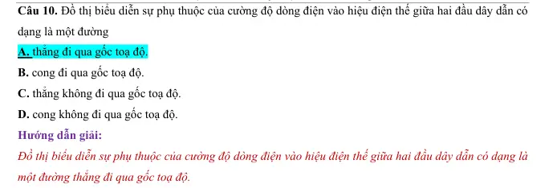
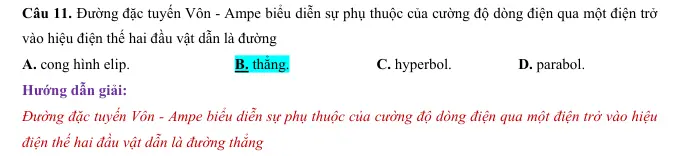
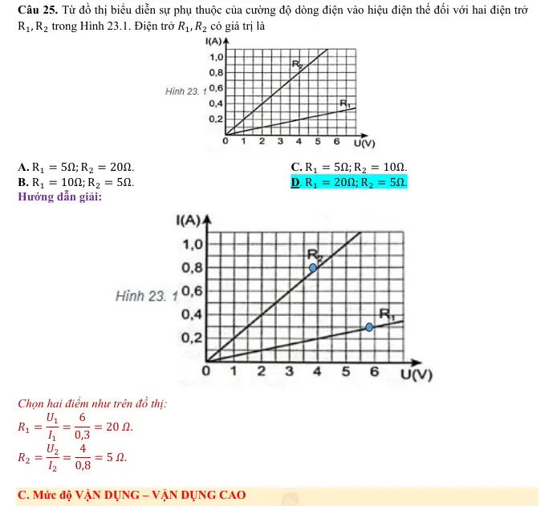
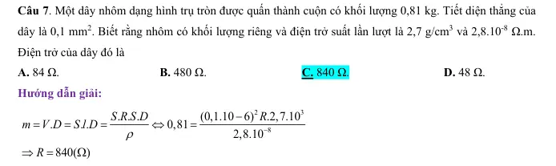
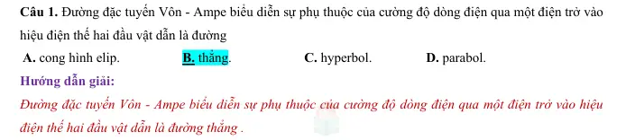
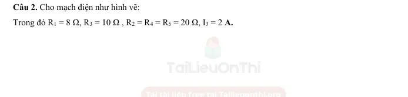
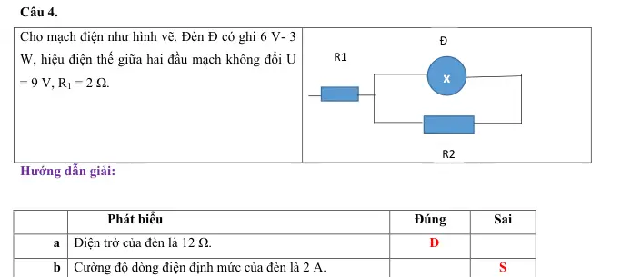
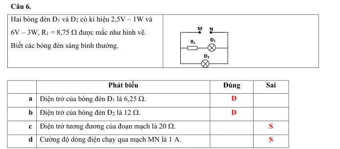
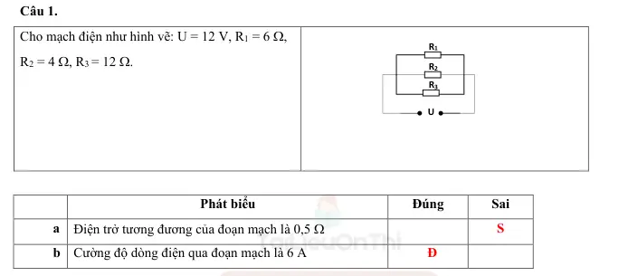

# Bài tập — Bài 2 — Điện trở và định luật Ohm cho đoạn mạch

> Hệ bài tập được biên soạn theo các dạng xuất hiện trong bộ tài liệu Vật lí 11 của dự án. Câu hỏi được giữ ngắn, trực tiếp; độ khó tăng dần và không cố tình thêm dữ kiện gây nhiễu.

[← Trở lại bài học](../../02-resistance-ohm-law.md)

## Phần A — Trắc nghiệm 4 lựa chọn

### Câu 1 — Mức 1 — Nhận biết

Điện trở dây đồng chất dài l, tiết diện S, điện trở suất ρ là

A. $R=\rho S/l$.  
B. $R=\rho l/S$.  
C. $R=l/(\rho S)$.  
D. $R=\rho lS$.

### Câu 2 — Mức 1 — Nhận biết

Hai điện trở $4\,\Omega$ và $6\,\Omega$ mắc nối tiếp. Điện trở tương đương

A. $2,4\,\Omega$.  
B. $5\,\Omega$.  
C. $10\,\Omega$.  
D. $24\,\Omega$.

### Câu 3 — Mức 1 — Nhận biết

Hai điện trở $6\,\Omega$ và $3\,\Omega$ mắc song song. Điện trở tương đương

A. $2\,\Omega$.  
B. $3\,\Omega$.  
C. $4,5\,\Omega$.  
D. $9\,\Omega$.

### Câu 4 — Mức 1 — Nhận biết

Một điện trở thuần $R=10\,\Omega$ đặt dưới hiệu điện thế $20$ V. Dòng điện là

A. $0,5$ A.  
B. $2$ A.  
C. $10$ A.  
D. $200$ A.

## Phần B — Đúng/Sai

### Câu 5 — Mức 2 — Thông hiểu

Điện trở kim loại trong mô hình phổ thông:

a) $R=\rho l/S$.  
b) Tăng chiều dài dây làm R tăng.  
c) Tăng tiết diện dây làm R tăng.  
d) Với nhiều kim loại trong khoảng nhiệt độ vừa phải, R tăng gần tuyến tính theo nhiệt độ.

### Câu 6 — Mức 2 — Thông hiểu

Định luật Ohm cho đoạn mạch chỉ có điện trở:

a) $I=U/R$.  
b) Với R không đổi, đồ thị I–U là đường thẳng qua gốc.  
c) Điện trở tương đương song song lớn hơn từng điện trở thành phần.  
d) Mạch nối tiếp có cùng dòng điện qua các phần tử.

## Phần C — Trả lời ngắn

### Câu 7 — Mức 3 — Vận dụng

Dây nicrom dài $2$ m, tiết diện $0,5$ mm², điện trở suất $1,1\cdot10^{-6}\,\Omega$m. Tính điện trở.

### Câu 8 — Mức 3 — Vận dụng

Một dây có $R_0=20\,\Omega$ ở $20^\circ$C, hệ số nhiệt điện trở $\alpha=4\cdot10^{-3}$ K⁻¹. Tính R ở $70^\circ$C.

### Câu 9 — Mức 3 — Vận dụng

Ba điện trở $2\,\Omega$, $3\,\Omega$, $6\,\Omega$ mắc song song. Tính điện trở tương đương.

## Phần D — Vận dụng và vận dụng cao

### Câu 10 — Mức 4 — Vận dụng cao

Một dây đồng chất có điện trở R. Kéo đều dây sao cho chiều dài tăng gấp đôi, thể tích coi như không đổi và điện trở suất không đổi. Tính điện trở mới theo R.

---

[Đáp án và lời giải →](solutions.md)

## Ngân hàng bài tập PDF mở rộng

> Nội dung câu hỏi và dữ kiện trong phần này được giữ nguyên; hệ thống chỉ chuẩn hóa xuống dòng và mã kí tự để hiển thị trên web. Câu trùng được loại bỏ. Với câu có công thức/kí hiệu bị sai khi trích xuất chữ từ PDF, đề bài được giữ dưới dạng ảnh để không làm thay đổi dữ kiện.

### Nhận biết — Trả lời ngắn

#### Bài PDF 1

<!-- source-id: BT-Chuong-IV-p43-q1-147 -->

Câu 1. Tìm điện trở tương đương của mạch. (tính theo Ω)

#### Bài PDF 2

<!-- source-id: BT-Chuong-IV-p43-q2-148 -->

Câu 2. Tính hiệu điện thế giữa hai đầu điện trở R1.(tính theo V)

#### Bài PDF 3

<!-- source-id: BT-Chuong-IV-p43-q3-151 -->

Câu 3. Dây có tiết diện là bao nhiêu? Làm tròn đến phần trăm (tính theo 10-7 m2)
R1
R3
R2
U

#### Bài PDF 4

<!-- source-id: BT-Chuong-IV-p44-q4-152 -->

Câu 4. Tính đường kính tiết diện của dây nung. Làm tròn đến hàng đơn vị (tính theo 10-4 m)

#### Bài PDF 5

<!-- source-id: BT-Chuong-IV-p44-q5-155 -->

Câu 5. Tính chiều dài của cuộn dây. Làm tròn đến hàng phần mười (tính theo m)

#### Bài PDF 6

<!-- source-id: BT-Chuong-IV-p44-q6-156 -->

Câu 6. Tìm điện trở của cuộn dây ? Làm tròn đến hàng phần trăm (tính theo Ω)

#### Bài PDF 7

<!-- source-id: BT-Chuong-IV-p53-q1-181 -->

Câu 1. Tính cường độ dòng điện chạy qua điện trở R3?  (tính theo A)

#### Bài PDF 8

<!-- source-id: BT-Chuong-IV-p53-q2-182 -->

Câu 2. Hiệu điện thế giữa hai đầu R1? (tính theo V)

#### Bài PDF 9

<!-- source-id: BT-Chuong-IV-p53-q3-185 -->

Câu 3. Tính điện trở của đoạn mạch? (tính theo Ω )

#### Bài PDF 10

<!-- source-id: BT-Chuong-IV-p53-q4-186 -->

Câu 4. Nếu hiệu điện thế đặt vào hai đầu dây dẫn đó tăng lên đến 48V thì cường độ dòng điện chạy qua nó
là bao nhiêu ? ( Tính theo đon vị A)

#### Bài PDF 11

<!-- source-id: BT-Chuong-IV-p53-q5-189 -->

Câu 5. Tính điện trở tương đương R12 (tính theo Ω )

#### Bài PDF 12

<!-- source-id: BT-Chuong-IV-p54-q6-190 -->

Câu 6. Mắc thêm R = 15 Ω vào nối tiếp hai điện trở trên. Tính điện trở tương đương của toàn mạch. (tính
theo Ω )

### Nhận biết — Trắc nghiệm 4 lựa chọn

#### Bài PDF 13

<!-- source-id: BT-Chuong-IV-p26-q1-81 -->

Câu 1. Đơn vị đo điện trở là
A. ôm (Ω).
B. fara (F).
C. henry (H).
D. oát (W).

#### Bài PDF 14

<!-- source-id: BT-Chuong-IV-p26-q2-82 -->

Câu 2. Phát biểu nào sau đây sai.
A. Điện trở có vạch màu là căn cứ để xác định trị số.
B. Đối với điện trở nhiệt có hệ số dương, khi nhiệt độ tăng thì điện trở tăng.
C. Đối với điện trở biến đổi theo điện áp, khi U tăng thì điện trở tăng.
D. Đối với điện trở quang, khi ánh sáng thích hợp rọi vào thì điện trở giảm.

#### Bài PDF 15

<!-- source-id: BT-Chuong-IV-p26-q3-83 -->

Câu 3. Đặc điểm của điện trở nhiệt có hệ số nhiệt điện trở
A. dương khi nhiệt độ tăng thì điện trở tăng.

B. dương khi nhiệt độ tăng thì điện trở giảm.
C. âm khi nhiệt độ tăng thì điện trở tăng.
D. âm khi nhiệt độ tăng thì điện trở giảm về bằng 0.

#### Bài PDF 16

<!-- source-id: BT-Chuong-IV-p26-q4-84 -->

Câu 4. Chọn biến đổi đúng trong các biến đổi sau
Α. 1 Ω = 0,001 kΩ = 0,0001 ΜΩ.

Β. 10 Ω = 0,1 kΩ = 0,00001 ΜΩ.
C. 1 kΩ = 1 000 Ω = 0,01 ΜΩ.

D. 1 MΩ = 1 000 kΩ = 1 000 000 Ω.

#### Bài PDF 17

<!-- source-id: BT-Chuong-IV-p26-q5-85 -->

Câu 5. Biến trở là điện trở
A. có thể thay đổi trị số và dùng để điều chỉnh chiều dòng điện trong mạch.

B. có thể thay đổi trị số và dùng để điều chỉnh cường độ và chiều dòng điện trong mạch.
C. có thể thay đổi trị số và dùng để điều chỉnh cường độ dòng điện trong mạch.
D. không thay đổi trị số và dùng để điều chỉnh cường độ dòng điện trong mạch.

#### Bài PDF 18

<!-- source-id: BT-Chuong-IV-p27-q6-86 -->

Câu 6. Trước khi mắc biến trở vào mạch điện để điều chỉnh cường độ dòng điện thì cần điều chỉnh biến
trở có giá trị nào dưới đây?
A. Có giá trị bằng 0.
B. Có giá trị nhỏ.

C. Có giá trị lớn.
D. Có giá trị lớn nhất.

#### Bài PDF 19

<!-- source-id: BT-Chuong-IV-p27-q7-87 -->

Câu 7. Trong mạch điện gia đình, tại sao dây dẫn thường được làm từ đồng hoặc nhôm?
A. Vì các vật liệu này nhẹ, dễ uốn.
B. Vì chúng có điện trở suất nhỏ, dẫn điện tốt.
C. Vì chúng có giá thành rẻ và bền.
D. Vì chúng không bị oxy hóa.

#### Bài PDF 20

<!-- source-id: BT-Chuong-IV-p27-q8-88 -->

Câu 8. Biểu thức đúng của định luật Ohm là
A.
.
I
RU
=
.

B.
U
I
R
=
.

C.
I
U
R
=
.

D.
.
U
I R
=
.

#### Bài PDF 21

<!-- source-id: BT-Chuong-IV-p27-q9-89 -->

Câu 9. Khi hiệu điện thế giữa hai đầu dây dẫn tăng thì cường độ dòng điện chạy qua dây dẫn
A. không thay đổi.
B. giảm, tỉ lệ với hiệu điện thế.
C. có lúc tăng, có lúc giảm.
D. tăng, tỉ lệ với hiệu điện thế.

#### Bài PDF 22

<!-- source-id: BT-Chuong-IV-p28-q10-90 -->

Câu 10. Đồ thị biểu diễn sự phụ thuộc của cường độ dòng điện vào hiệu điện thế giữa hai đầu dây dẫn có
dạng là một đường
A. thẳng đi qua gốc toạ độ.

B. cong đi qua gốc toạ độ.
C. thẳng không đi qua gốc toạ độ.
D. cong không đi qua gốc toạ độ.

{ loading=lazy }

#### Bài PDF 23

<!-- source-id: BT-Chuong-IV-p28-q11-91 -->

Câu 11. Đường đặc tuyến Vôn - Ampe biểu diễn sự phụ thuộc của cường độ dòng điện qua một điện trở
vào hiệu điện thế hai đầu vật dẫn là đường
A. cong hình elip.
B. thẳng.
C. hyperbol.
D. parabol.

{ loading=lazy }

#### Bài PDF 24

<!-- source-id: BT-Chuong-IV-p28-q12-92 -->

Câu 12. Câu nào dưới đây cho biết kim loại dẫn điện tốt?
A. Khoảng cách giữa các ion nút mạng trong kim loại rất lớn.
B. Mật độ electron tự do trong kim loại rất lớn.
C. Mật độ các ion tự do lớn.
D. Giá trị điện tích chứa trong mỗi electron tự do của kim loại lớn hơn ở các chất khác.

#### Bài PDF 25

<!-- source-id: BT-Chuong-IV-p28-q13-93 -->

Câu 13. Nếu chiều dài và đường kính của một dây dẫn bằng đồng có tiết diện tròn được tăng lên gấp đôi
thì điện trở của dây dẫn sẽ
A. không thay đổi.

B. tăng lên hai lần.

C. tăng lên gấp bốn lần.

D. giảm đi hai lần.

#### Bài PDF 26

<!-- source-id: BT-Chuong-IV-p28-q14-94 -->

Câu 14. Khi mắc hai điện trở song song, điện trở tương đương của mạch
A. lớn hơn giá trị của từng điện trở.
B. nhỏ hơn giá trị của từng điện trở.

C. bằng giá trị lớn nhất trong hai điện trở.
D. bằng tổng của hai điện trở.

#### Bài PDF 27

<!-- source-id: BT-Chuong-IV-p29-q15-95 -->

Câu 15. Nguyên nhân cơ bản gây ra điện trở của kim loại là do
A. sự va chạm của các electron tự do với các ion ở nút mạng tinh thể.
B. cấu trúc mạng tinh thể của kim loại.
C. nhiệt độ của kim loại thay đổi.
D. chuyển động nhiệt của các electron tự do trong kim loại.

#### Bài PDF 28

<!-- source-id: BT-Chuong-IV-p29-q16-96 -->

Câu 16. Đại lượng đặc trưng cho mức độ cản trở dòng điện là
A. điện trở
B. hiệu điện thế
C. cường độ dòng điện
D. điện thế

#### Bài PDF 29

<!-- source-id: BT-Chuong-IV-p29-q17-97 -->

Câu 17. Phát biểu nào sau đây là đúng về định luật Ohm?
A. Cường độ dòng điện chạy qua vật dẫn kim loại tỉ lệ nghịch với hiệu điện thế ở hai đầu vật dẫn, tỉ lệ
thuận điện trở của vật dẫn.
B. Cường độ dòng điện chạy qua vật dẫn kim loại tỉ lệ thuận với hiệu điện thế ở hai đầu vật dẫn, tỉ lệ
nghịch điện trở của vật dẫn.
C. Cường độ dòng điện chạy qua vật dẫn kim loại tỉ lệ thuận với hiệu điện thế ở hai đầu vật dẫn và điện
trở của vật dẫn.
D. Cường độ dòng điện chạy qua vật dẫn kim loại luôn không đổi.

#### Bài PDF 30

<!-- source-id: BT-Chuong-IV-p29-q18-98 -->

Câu 18. Nhiệt điện trở là loại điện trở có giá trị
A. thay đổi tùy theo nhiệt độ.
B. không phụ thuộc vào nhiệt độ.
C. chỉ tăng khi nhiệt độ thay đổi.
D. chỉ giảm khi nhiệt độ thay đổi.

#### Bài PDF 31

<!-- source-id: BT-Chuong-IV-p30-q19-99 -->

Câu 19. Trong đoạn mạch kín, nếu ta mắc hai điện trở R1 và R2 nối tiếp nhau thì điện trở tương đương
trong đoạn mạch là
A. Rtd = R1 + R2.
B. Rtd =
R1.R2
R1+R2.
C. Rtd = R1. R2.
D. Rtd =
R1
R2.

#### Bài PDF 32

<!-- source-id: BT-Chuong-IV-p30-q20-100 -->

Câu 20. Trong đoạn mạch kín, nếu ta mắc hai điện trở R1 và R2 song song nhau thì điện trở tương đương
trong đoạn mạch là
A. Rtd = R1 + R2.
B. Rtd =
R1.R2
R1+R2.
C. Rtd = R1 −R2.
D. Rtd =
R1+R2
R1.R2 .

#### Bài PDF 33

<!-- source-id: BT-Chuong-IV-p30-q21-101 -->

Câu 21. Khi nhiệt độ của dây dẫn kim loại tăng, điện trở của nó sẽ
A. không đổi.
B. tăng.
C. giảm.
D. tăng rồi giảm.

#### Bài PDF 34

<!-- source-id: BT-Chuong-IV-p30-q22-102 -->

Câu 22. Phát biểu nào sau đây là sai?
A. Điện trở là đại lượng đặc trưng cho mức độ cản trở dòng điện của vật dẫn.
B. Biến trở là điện trở có thể thay đổi giá trị.
C. Nhiệt độ của kim loại không ảnh hưởng đến giá trị điện trở của nó.
D. Dây dẫn càng dài thì điện trở càng lớn.

#### Bài PDF 35

<!-- source-id: BT-Chuong-IV-p30-q23-103 -->

Câu 23. Những yếu tố nào sau đây ảnh hưởng đến điện trở của dây dẫn kim loại?
(1). Hiệu điện thế đặt vào hai đầu dây dẫn.

(2). Đường kính của sợi dây.
(3). Chất liệu của dây dẫn.
(4). Chiều dài của dây dẫn.
A. (1); (3); (4).
B. (1); (2); (4).
C. (2); (3); (4).
D. (1): (2): (3).

#### Bài PDF 36

<!-- source-id: BT-Chuong-IV-p31-q2-107 -->

Câu 2. Một sợi dây bạc có điện trở ở 500C là 37Ω. Khi nhiệt độ của t0C thì có điện trở là 43Ω. Biết hệ
số nhiệt điện trở
3
1
4,3.10
.
K
α
−
−
=
Nhiệt độ t0C có giá trị
A. 250C.
B. 750C.
C. 900C.
D. 1000C.

#### Bài PDF 37

<!-- source-id: BT-Chuong-IV-p31-q3-108 -->

Câu 3. Ở nhiệt độ 200C điện trở suất của bạch kim là 10,6.10-8 Ω.m. Biết hệ số nhiệt điện trở của bạch
kim là 3,9.10-3 K-1. Ở nhiệt độ 10000C thì điện trở suất của bạch kim là bao nhiêu?

A. 48,2. 10−8Ω. m.
B. 62,0. 10−8Ω. m.
C. 58,5. 10−8Ω. m.
D. 51,1. 10−8Ω. m.

#### Bài PDF 38

<!-- source-id: BT-Chuong-IV-p31-q24-104 -->

Câu 24. Điện trở R của kim loại phụ thuộc nhiệt độ t theo công thức nào dưới đây?
A. R = R0[1 + α(t + t0)].
B. R = R0[1 + α(t −t0)].
C. R = R0[1 −α(t −t0)].
D. R = R0[1 −α(t + t0)].

#### Bài PDF 39

<!-- source-id: BT-Chuong-IV-p31-q25-105 -->

Câu 25. Điện trở suất của kim loại phụ thuộc vào yếu tố nào?
A. Nhiệt độ của kim loại.
B. Kích thước của vật dẫn kim loại.
C. Bản chất của kim loại.
D. Nhiệt độ và bản chất của vật dẫn kim loại.

#### Bài PDF 40

<!-- source-id: BT-Chuong-IV-p32-q6-111 -->

Câu 6. Đặt một hiệu điện thế 12 V vào giữa hai đầu một điện trở 4 Ω thì lượng điện tích chạy qua điện
trở trong mỗi dây là
A. 3 C.
B. 4 C.
C. 12 C.
D. 48 C.

#### Bài PDF 41

<!-- source-id: BT-Chuong-IV-p32-q7-112 -->

Câu 7. Đặt một hiệu điện thế U = 12 V vào hai đầu một điện trở. Cường độ dòng điện là 2 A. Nếu tăng
hiệu điện thế lên 1,5 lần thì cường độ dòng điện là
A. 3 A.

B. 1 A.
C. 0,5 A.

D. 0,25 A.

#### Bài PDF 42

<!-- source-id: BT-Chuong-IV-p32-q8-113 -->

Câu 8. Khi đặt vào hai đầu dây dẫn một hiệu điện thế 12 V thì cường độ dòng điện chạy qua dây dẫn là
0,5 A. Nếu tăng hiệu điện thế thêm 18 V thì cường độ dòng điện qua dây dẫn là
A. 1,25 A.
B. 0,75 A.
C. 0,50 A.
D. 0,25 A.

#### Bài PDF 43

<!-- source-id: BT-Chuong-IV-p33-q9-114 -->

Câu 9. Một quạt điện có điện trở R, khi hoạt động lâu dài, nhiệt độ của quạt tăng. Điều này sẽ dẫn đến
A. Điện trở của quạt tăng lên.
B. Điện trở của quạt giảm xuống.
C. Dòng điện qua quạt tăng.
D. Hiệu điện thế qua quạt giảm.

#### Bài PDF 44

<!-- source-id: BT-Chuong-IV-p33-q10-115 -->

Câu 10. Xác định giá trị của điện trở dựa vào các thông tin dưới đây
A. 10 ± 5%.
B. 100 ± 5%.
C. 10 ± 1%.
D. 100 ± 1%.

#### Bài PDF 45

<!-- source-id: BT-Chuong-IV-p33-q11-116 -->

Câu 11. Điện trở R của dây dẫn biểu thị cho tính cản trở
A. dòng điện nhiều hay ít của dây.
B. hiệu điện thế nhiều hay ít của dây.
C. electron nhiều hay ít của dây.
D. điện lượng nhiều hay ít của dây.

#### Bài PDF 46

<!-- source-id: BT-Chuong-IV-p34-q12-117 -->

Câu 12. Cường độ dòng điện qua bóng đèn tỉ lệ thuận với hiệu điện thế giữa hai đầu bóng đèn. Điều đó
có nghĩa là nếu hiệu điện thế tăng 1,2 lần thì cường độ dòng điện
A. tăng 2,4 lần.

B. giảm 2,4 lần.
C. giảm 1,2 lần.

D. tăng 1,2 lần.

#### Bài PDF 47

<!-- source-id: BT-Chuong-IV-p34-q13-118 -->

Câu 13. Một dây dẫn khi mắc vào hiệu điện thế 6 V thì cường độ dòng điện qua dây dẫn là 1,5 A. Điện
trở R có giá trị
A.
9 .
R = Ω

B.
7,5 .
R =
Ω
C.
4 .
R = Ω

D.
0,25 .
R =
Ω

#### Bài PDF 48

<!-- source-id: BT-Chuong-IV-p34-q14-119 -->

Câu 14. Một bóng đèn có điện trở 9Ω, cường độ dòng điện qua bóng đèn là 0,5A. Hiệu điện thế hai đầu
bóng đèn là
A. 4,5 V.
B. 9,0 V.
C. 12,5 V.
D. 15,0 V.

#### Bài PDF 49

<!-- source-id: BT-Chuong-IV-p34-q15-120 -->

Câu 15. Trong đoạn mạch mắc nối tiếp, cường độ dòng điện qua vật dẫn
A. càng nhỏ nếu điện trở vật dẫn đó càng nhỏ.
B. càng lớn nếu điện trở vật dẫn đó càng lớn.
C. bằng nhau với mọi vật dẫn.
D. phụ thuộc vào điện trở của vật dẫn đó.

#### Bài PDF 50

<!-- source-id: BT-Chuong-IV-p34-q16-121 -->

Câu 16. Hai điện trở R1 và R2 mắc nối tiếp. Hệ thức nào sau đây là đúng.
A.
1
2
2
1
2
.
U
U
U
R
R
+
=

B.
2
1
1
2
.
U
U
R
R
=

C.
1
2
1
2
.
U
U
R
R
=

D.
1
2
1
2
1
.
U
U
U
R
R
+
=

#### Bài PDF 51

<!-- source-id: BT-Chuong-IV-p34-q17-122 -->

Câu 17. Khi đặt cùng một hiệu điện thế vào hai đầu dây dẫn cùng chất liệu có điện trở R1 và R2 = 3R1 thì
tỉ số dòng điện qua dây
𝐼1
𝐼2 bằng
A. 1 3
⁄ .
B. 3.
C. 6.
D. 1 6
⁄ .

#### Bài PDF 52

<!-- source-id: BT-Chuong-IV-p35-q18-123 -->

Câu 18. Mạch điện kín gồm hai bóng đèn được mắc nối tiếp, khi một trong hai bóng đèn bị hỏng thì
bóng đèn còn lại sẽ
A. sáng hơn.
B. vẫn sáng như cũ.
C. không hoạt động.

D. tối hơn.

#### Bài PDF 53

<!-- source-id: BT-Chuong-IV-p35-q19-124 -->

Câu 19. Trong một mạch điện, nếu chỉ giảm tiết diện dây dẫn mà giữ nguyên chiều dài và vật liệu làm
dây, điều gì sẽ xảy ra?
A. Điện trở của dây dẫn sẽ tăng lên.
B. Dòng điện trong mạch sẽ tăng.
C. Điện trở của dây dẫn sẽ giảm.
D. Không có gì thay đổi.

#### Bài PDF 54

<!-- source-id: BT-Chuong-IV-p35-q20-125 -->

Câu 20. Trong một đoạn mạch, hai điện trở R1 = 4 Ω và R2 = 6 Ω được mắc nối tiếp nhau. Điện trở
tương đương của đoạn mạch là
A. 2,0 Ω.
B. 2,4 Ω.
C. 10,0 Ω.
D. 24,0 Ω.

#### Bài PDF 55

<!-- source-id: BT-Chuong-IV-p35-q21-126 -->

Câu 21. Hai điện trở
1
3
R = Ω;
2
6
R = Ω mắc song song với nhau, điện trở tương đương của đoạn mạch là
A. 2 .
Ω

B. 3 .
Ω
C. 6 .
Ω

D. 9 .
Ω

#### Bài PDF 56

<!-- source-id: BT-Chuong-IV-p35-q22-127 -->

Câu 22. Hai bóng đèn có ghi 220 V – 25 W; 220 V – 40 W. Để hai bóng đèn trên hoạt động bình
thường ta mắc song song vào nguồn điện
A. 220 V.

B. 110 V.

C. 40 V.

D. 25 V.

#### Bài PDF 57

<!-- source-id: BT-Chuong-IV-p35-q23-128 -->

Câu 23. Khi mắc R1 và R2 song song với nhau vào một hiệu điện thế U. Cường độ dòng điện chạy qua
các mạch rẽ I1 = 0,5 A, I2  = 0,7 A. Cường độ dòng điện qua mạch chính là
A. 0,2 A.

B. 0,7 A.

C. 0,5 A.

D. 1,2 A.

#### Bài PDF 58

<!-- source-id: BT-Chuong-IV-p36-q24-129 -->

Câu 24. Khi mắc R1 và R2 nối tiếp với nhau vào một hiệu điện thế U. Hiệu điện thế giữa hai đầu các điện
trở R1 và R2 lần lượt là 6 V và 9 V. Hiệu điện thế U là
A. 3 V.
B. 6 V.
C. 9 V.
D. 15 V.

#### Bài PDF 59

<!-- source-id: BT-Chuong-IV-p36-q25-130 -->

Câu 25. Từ đồ thị biểu diễn sự phụ thuộc của cường độ dòng điện vào hiệu điện thế đối với hai điện trở
R1, R2 trong Hình 23.1. Điện trở 𝑅1, 𝑅2 có giá trị là
A. R1 = 5Ω; R2 = 20Ω.
B. R1 = 10Ω; R2 = 5Ω.
C. R1 = 5Ω; R2 = 10Ω.
D. R1 = 20Ω; R2 = 5Ω.

{ loading=lazy }

#### Bài PDF 60

<!-- source-id: BT-Chuong-IV-p37-q3-133 -->

Câu 3. Điện trở của một đoạn dây đồng dài 4 m có tiết diện tròn, đường kính d = 1 mm là ( biết điện trở
suất của đồng là 1,7.10-8 Ω.m)
A. 0,09 Ω.

B. 1 Ω. C. 0,086 Ω.

D. 0,08 Ω.

#### Bài PDF 61

<!-- source-id: BT-Chuong-IV-p37-q4-134 -->

Câu 4. Đặt vào hai đầu một điện trở R một hiệu điện thế U = 12 V, khi đó cường độ dòng điện chạy qua
điện trở là 1,2 A. Nếu giữ nguyên hiệu điện thế nhưng muốn cường độ dòng điện qua điện trở là 0,8 A thì
ta phải tăng điện trở thêm một lượng là
A. 15 Ω.

B. 25 Ω.

C. 5 Ω.

D. 10 Ω.

#### Bài PDF 62

<!-- source-id: BT-Chuong-IV-p37-q5-135 -->

Câu 5. Hai bóng đèn khi sáng bình thường có điện trở là R1 = 7,5 Ω và R2 = 4,5 Ω. Dòng điện chạy qua hai
đèn đều có cường độ định mức là I = 0,8 A. Hai đèn này được mắc nối tiếp với nhau và với một điện trở
R3 để mắc vào hiệu điện thế U = 12V. Để hai đèn sáng bình thường thì điện trở R3
A. 1 Ω.

B. 2 Ω.

C. 3 Ω.

D. 4 Ω.

#### Bài PDF 63

<!-- source-id: BT-Chuong-IV-p38-q6-136 -->

Câu 6. Một biến trở con chạy có điện trở lớn nhất là 40 Ω. Dây điện trở của biến trở là một dây hợp kim
nicrom có tiết diện 0,5 mm2 và được quấn đều xung quanh một lõi sứ tròn có đường kính 2 cm. Biết điện
trở suất của nicrom là 1,1.10-6 Ω.m. Số vòng dây của biến trở này là
A. 290 vòng.
B. 380 vòng.
C. 150 vòng.
D. 200 vòng.

#### Bài PDF 64

<!-- source-id: BT-Chuong-IV-p38-q7-137 -->

Câu 7. Một dây nhôm dạng hình trụ tròn được quấn thành cuộn có khối lượng 0,81 kg. Tiết diện thẳng của
dây là 0,1 mm2. Biết rằng nhôm có khối lượng riêng và điện trở suất lần lượt là 2,7 g/cm3 và 2,8.10-8 Ω.m.
Điện trở của dây đó là
A. 84 Ω.
B. 480 Ω.
C. 840 Ω.
D. 48 Ω.

{ loading=lazy }

#### Bài PDF 65

<!-- source-id: BT-Chuong-IV-p38-q9-139 -->

Câu 9. Khi đặt hiệu điện thế 4,5 V vào hai đầu một dây dẫn thì dòng điện chạy qua dây này có cường độ
0,3 A. Nếu tăng cho hiệu điện thế này thêm 3 V nữa thì dòng điện chạy qua dây dẫn có cường độ là
A. 0,2 A.

B. 0,5 A.

C. 0,32 A.

D. 0,6 A.

#### Bài PDF 66

<!-- source-id: BT-Chuong-IV-p39-q10-140 -->

Câu 10. Điện trở tương đương của đoạn mạch gồm hai điện trở mắc nối tiếp bằng 100 Ω. Biết rằng một
trong hai điện trở có giá trị lớn gấp 3 lần điện trở kia. Giá trị của hai điện trở là
A. 20 Ω, 60 Ω.
B. 20 Ω, 90 Ω.
C. 40 Ω, 60 Ω.
 D. 25 Ω, 75 Ω.

#### Bài PDF 67

<!-- source-id: BT-Chuong-IV-p45-q1-159 -->

Câu 1. Đường đặc tuyến Vôn - Ampe biểu diễn sự phụ thuộc của cường độ dòng điện qua một điện trở vào
hiệu điện thế hai đầu vật dẫn là đường
A. cong hình elip.

B. thẳng.

C. hyperbol.
D. parabol.

{ loading=lazy }

#### Bài PDF 68

<!-- source-id: BT-Chuong-IV-p45-q2-160 -->

Câu 2. Câu nào dưới đây cho biết kim loại dẫn điện tốt?
A. Khoảng cách giữa các ion nút mạng trong kim loại rất lớn.

B. Mật độ electron tự do trong kim loại rất lớn.
C. Mật độ các ion tự do lớn.
D. Giá trị điện tích chứa trong mỗi electron tự do của kim loại lớn hơn ở các chất khác.

#### Bài PDF 69

<!-- source-id: BT-Chuong-IV-p46-q3-161 -->

Câu 3. Điện trở suất của kim loại phụ thuộc vào yếu tố nào?
A. Nhiệt độ của kim loại.
B. Kích thước của vật dẫn kim loại.
C. Bản chất của kim loại.
D. Nhiệt độ và bản chất của vật dẫn kim loại.

#### Bài PDF 70

<!-- source-id: BT-Chuong-IV-p46-q4-162 -->

Câu 4. Khi tiết diện của khối kim loại đồng chất, tiết diện đều tăng 2 lần thì điện trở của khối kim loại
A. tăng 2 lần.            B. tăng 4 lần.
C. giảm 2 lần.             D. giảm 4 lần.

#### Bài PDF 71

<!-- source-id: BT-Chuong-IV-p46-q5-163 -->

Câu 5. Khi xảy ra hiện tượng siêu dẫn thì
A. điện trở suất của kim loại giảm.
B. điện trở suất của kim loại tăng.
C. điện trở suất không thay đổi.

D. điện trở suất tăng rồi lại giảm.

#### Bài PDF 72

<!-- source-id: BT-Chuong-IV-p46-q6-164 -->

Câu 6. Đặt vào hai đầu một điện trở R = 20 Ω một hiệu điện thế U = 2 V trong khoảng thời gian t = 20 s.
Lượng điện tích di chuyển qua điện trở là
A. q = 4 C

B. q = 1 C

C. q = 2 C

D. q = 5 mC.

#### Bài PDF 73

<!-- source-id: BT-Chuong-IV-p46-q7-165 -->

Câu 7. Điện trở suất ρ của kim loại phụ thuộc nhiệt độ t theo công thức
A.
0
0
[1
(
)].
t
t
ρ
ρ
α
=
−
−

B.
0
0
(
).
t
t
ρ
ρ
α
=
−
−

C.
0
0
[1
(
)].
t
t
ρ
ρ
α
=
+
−

D.
0
0
(
).
t
t
ρ
ρ
α
=
+
−

#### Bài PDF 74

<!-- source-id: BT-Chuong-IV-p47-q8-166 -->

Câu 8. Hệ số nhiệt điện trở α của kim loại phụ thuộc vào yếu tố nào sau đây?
A. Khoảng nhiệt độ và chế độ gia công của vật liệu đó.
B. Độ sạch của kim loại và chế độ gia công của vật liệu đó.
C. Độ sạch của kim loại.
D. Khoảng nhiệt độ, độ sạch của kim loại và chế độ gia công của vật liệu đó.

#### Bài PDF 75

<!-- source-id: BT-Chuong-IV-p47-q9-167 -->

Câu 9. Trong đoạn mạch nối tiếp, kí hiệu R là điện trở, U là hiệu điện thế, I là cường độ dòng điện, công
thức nào sau đây là sai?
A. R = R1 + R2 + … + Rn.

B. I = I1 = I2 = … = In.
C. R = R1 = R2 = … = Rn.

D. U = U1 + U2 + … + Un.

#### Bài PDF 76

<!-- source-id: BT-Chuong-IV-p47-q10-168 -->

Câu 10. Hai điện trở R1 = 8 Ω, R2 = 8 Ω mắc nối tiếp. Điện trở tương đương có giá trị
A. 8 Ω.
B. 4 Ω.
C. 16 Ω.

D. 64 Ω.

#### Bài PDF 77

<!-- source-id: BT-Chuong-IV-p47-q11-169 -->

Câu 11. Điện trở suất của đồng là 1,7.10-8 Ω.m, của nhôm là 2,8.10-8 Ω.m. Nếu thay một dây tải điện bằng
đồng, tiết diện 2 cm2 bằng dây nhôm, thì dây nhôm phải có tiết diện là
A. 3,3 cm2.

B. 1,65 cm2.
C. 1,2 cm2.

D. 0,6 cm2.

#### Bài PDF 78

<!-- source-id: BT-Chuong-IV-p47-q12-170 -->

Câu 12. Điện trở của dây dẫn phụ thuộc vào
A. chiều dài dây.
B. vật liệu làm dây.

C. tiết diện và chiều dài dây.
D. tiết diện, chiều dài dây và vật liệu làm dây.

#### Bài PDF 79

<!-- source-id: BT-Chuong-IV-p48-q13-171 -->

Câu 13. Đâu là công thức tính điện trở của một đoạn dây dẫn?
A.
l
R
S
ρ
=
.

B.
S
R
l
ρ
=
.
C. R
S l
ρ
=
.
D.
S
R
l ρ
=
.

#### Bài PDF 80

<!-- source-id: BT-Chuong-IV-p48-q14-172 -->

Câu 14. Một dây dẫn thẳng bằng nikelin dài 20 m, tiết diện 0,05 mm2. Điện trở suất của nikelin là
0,4.10-6 Ω.m. Điện trở của dây dẫn này là
A. 0,16 Ω       B. 1,6 Ω

C. 16 Ω

D. 160 Ω.

#### Bài PDF 81

<!-- source-id: BT-Chuong-IV-p48-q15-173 -->

Câu 15. Hai đoạn dây dẫn bằng đồng có cùng tiết diện. Dây thứ nhất có chiều dài l1; dây dẫn thứ 2 có
chiều dài l2 = 3l1. Điều nào sau đây là đúng khi nói về điện trở R1 và R2.
A. R1 = R2       B. R1 = 3R2

C. R2 = 3R1
D.
2
1
1
.
3
R
R
=

#### Bài PDF 82

<!-- source-id: BT-Chuong-IV-p48-q16-174 -->

Câu 16. Biết điện trở suất của nhôm là 2,8.10-8 Ω.m; điện trở suất của đồng là 1,7.10-8 Ω.m; của vonfram
là 5,5.10-8 Ω.m. Chọn kết luận đúng
A. Vonfram dẫn điện tốt hơn nhôm, nhôm dẫn điện tốt hơn đồng
B. Vonfarm dẫn điện tốt hơn đồng, đồng dẫn điện tốt hơn nhôm.
C. Đồng dẫn điện tốt hơn Vonfram, Vonfram dẫn điện tốt hơn nhôm.
D. Đồng dẫn điện tốt hơn nhôm, nhôm dẫn điện tốt hơn Vonfram.

#### Bài PDF 83

<!-- source-id: BT-Chuong-IV-p48-q17-175 -->

Câu 17. Điện trở suất của nikelin là 0,4.10-6 Ω.m. Điện trở của dây dẫn nikelin dài 1 m và có tiết diện 0,5
mm2 là
A. 0,4.10-6 Ω.

B. 0,8.10-6 Ω.

C. 0,4 Ω.
D. 0,8 Ω.

#### Bài PDF 84

<!-- source-id: BT-Chuong-IV-p49-q18-176 -->

Câu 18. Một dây dẫn bằng đồng dài 25 m có điện trở 42,5 Ω. Tiết điện của dây dẫn này là
A. 1,7 mm2.
B. 0,58 mm2.
C. 0,1 mm2.
D. 0,01 mm2.

### Nhận biết — Đúng/Sai

#### Bài PDF 85

<!-- source-id: BT-Chuong-IV-p39-q1-141 -->

Câu 1. Một đoạn dây dẫn bằng đồng có điện trở suất 1,69.10-8 Ω.m, dài 2,0 m và đường kính tiết diện là
1,0 mm. Cho dòng điện 1,5 A chạy qua đoạn dây.

Phát biểu
Đúng
Sai
a Tiết diện của đoạn dây dẫn bằng 9.10-7 m2.

S
b Điện trở của đoạn dây là 0,043 Ω
Đ

c
Hiệu điện thế giữa hai đầu đoạn dây là 0,065 V.
Đ

d
Nếu cho cường độ dòng điện qua đoạn mạch 3A thì hiệu
điện thế giữa hai đầu đoạn dây là 13 V

S

#### Bài PDF 86

<!-- source-id: BT-Chuong-IV-p39-q2-142 -->

Câu 2. Cho mạch điện như hình vẽ:
Trong đó R1 = 8 Ω, R3 = 10 Ω , R2 = R4 = R5 = 20 Ω, I3 = 2 A.

Phát biểu
Đúng
Sai
a Hiệu điện thế giữa hai đầu điện trợ R3 là 10 V.

S
b Cường độ dòng điện qua R2 là 2 A.

S
c
Điện trở tương đương toàn mạch là
Ω
6,4
.
Đ

d Hiệu điện thế giữa hai đầu R2 là 60 V.
Đ

{ loading=lazy }

#### Bài PDF 87

<!-- source-id: BT-Chuong-IV-p40-q3-143 -->

Câu 3. Cho đoạn mạch gồm điện trở R1=100 Ω, mắc nối tiếp với điện trở R2=200 Ω, hiệu điện thế giữa hai
đầu đoạn mạch là 12 V.

Phát biểu
Đúng
Sai
a Điện trở tương đương của đoạn mạch là 300 Ω.
Đ

b Cường độ dòng điện qua đoạn mạch là 0,04 A.
Đ

c
Hiện điện thế giữa hai đầu R1 là 8 V.

S

d Hiện điện thế giữa hai đầu R2 là 4 V.

S

#### Bài PDF 88

<!-- source-id: BT-Chuong-IV-p41-q4-144 -->

Câu 4.
Cho mạch điện như hình vẽ. Đèn Đ có ghi 6 V- 3
W, hiệu điện thế giữa hai đầu mạch không đổi U
= 9 V, R 1 = 2 Ω.

{ loading=lazy }

#### Bài PDF 89

<!-- source-id: BT-Chuong-IV-p42-q5-145 -->

Câu 5. Cho mạch điện gồm 3 điện trở ghép nối tiếp R1 = 5 Ω, R2 = 10 Ω, R3 =  3 Ω mắc vào mạch điện có
hiệu điện thế U = 18 V.

Phát biểu
Đúng
Sai
a Điện trở tương đương của đoạn mạch là 18 Ω.
Đ

b Cường độ dòng điện qua mạch chính là 0,5 A.

S
c
Hiệu điện thế giữa hai đầu điện trở R1 là 5 V.
Đ

d Hiệu điện thế giữa hai đầu điện trở R2 là 10 V.
Đ

#### Bài PDF 90

<!-- source-id: BT-Chuong-IV-p42-q6-146 -->

Câu 6.
Hai bóng đèn Đ1 và Đ2 có kí hiệu 2,5V – 1W và
6V – 3W, R1 = 8,75 Ω được mắc như hình vẽ.
Biết các bóng đèn sáng bình thường.

Phát biểu
Đúng
Sai
a Điện trở của bóng đèn Đ1 là 6,25 Ω.
Đ

b Điện trở của bóng đèn Đ2 là 12 Ω.
Đ

c
Điện trở tương đương của đoạn mạch là 20 Ω.

S
d Cường độ dòng điện chạy qua mạch MN là 1 A.

S

{ loading=lazy }

#### Bài PDF 91

<!-- source-id: BT-Chuong-IV-p49-q1-177 -->

Câu 1.
Cho mạch điện như hình vẽ: U = 12 V, R1 = 6 Ω,
R2 = 4 Ω, R3 = 12 Ω.

Phát biểu
Đúng
Sai
a Điện trở tương đương của đoạn mạch là 0,5 Ω

S
b Cường độ dòng điện qua đoạn mạch là 6 A
Đ

c
Hiệu điện thế giữa hai đầu điện trở R1 là 36 V

S
d Cường độ dòng điện qua điện trở R3 là 1 A
Đ

{ loading=lazy }

#### Bài PDF 92

<!-- source-id: BT-Chuong-IV-p50-q2-178 -->

Câu 2. Một dây dẫn đồng dài 120 m được dùng để quấn thành một cuộn dây. Khi đặt hiệu điện thế 30 V
vào hai đầu cuộn dây này thì cường độ dòng điện qua cuộn dây là 125 mA. Điện trở suất của đồng là
1,7.10-8 Ω
( .m)

Phát biểu
Đúng
Sai
a Cường độ dòng điện qua cuộn dây là 0,125 A
Đ

b Điện trở của dây dẫn là
Ω
24( )

S
c
Tiết diện của dây là 8,5.10-9 (m2)
Đ

d
Mỗi đoạn dây dài 1 m của cuộn dây có điện trở bằng
Ω
20( )

S

### Thông hiểu — Trắc nghiệm 4 lựa chọn

#### Bài PDF 93

<!-- source-id: BT-Chuong-IV-p31-q1-106 -->

Câu 1. Một sợi dây đồng có điện trở R1 ở 500C, hệ số nhiệt điện trở
3
1
4,3.10
.
K
α
−
−
=
 Điện trở của sợi
dây đó ở 1000 C là 90 Ω. Điện trở của sợi dây đồng ở 500 C là
A. 45 Ω.
B. 74,1 Ω.              C. 135 Ω.                        D. 180 Ω.

### Vận dụng cao — Trắc nghiệm 4 lựa chọn

#### Bài PDF 94

<!-- source-id: BT-Chuong-IV-p36-q1-131 -->

Câu 1. Một đoạn dây chì có điện trở R. Dùng máy kéo sợi kéo cho đường kính của dây giảm đi 2 lần thì
điện trở của dây tăng lên bao nhiêu lần.
A. 4 lần.

B. 2 lần.

C. 8 lần.

D. 16 lần.

#### Bài PDF 95

<!-- source-id: BT-Chuong-IV-p37-q2-132 -->

Câu 2. Có hai dây dẫn, 1 dây làm bằng đồng còn dây kia làm bằng nhôm. Dây đồng có tiết diện 0,5 lần dây
nhôm và có chiều dài gấp 0,75 lần chiều dài dây nhôm. Biết dây đồng có điện trở 10 Ω, điện trở suất của
đồng là 1,7.10-8 Ωm, điện trở suất của đồng là 2,7.10-8 Ωm. Điện trở của dây nhôm là
A. 11 Ω.

B. 0,11 Ω.

C. 0,09 Ω.

D. 22 Ω.

