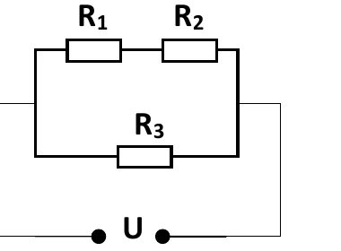
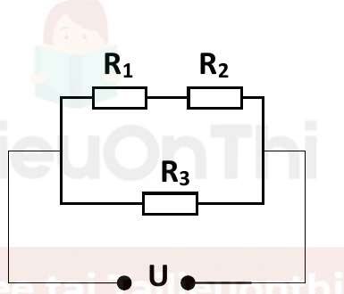
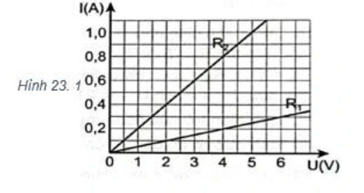
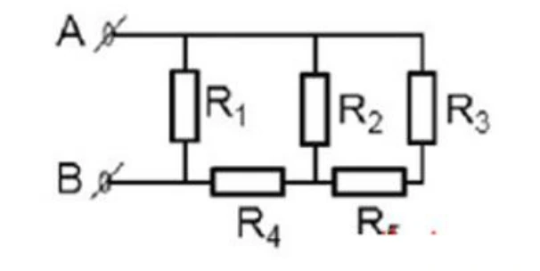
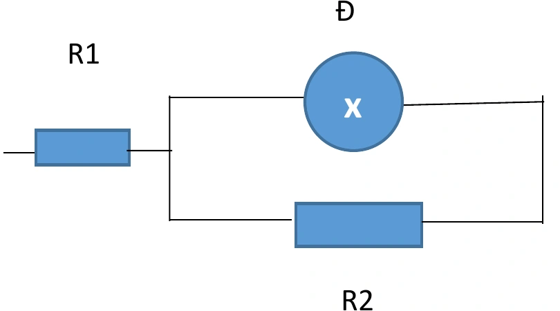
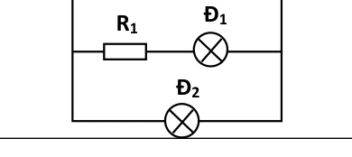
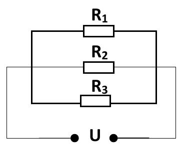

# Bài tập — Bài 2 — Điện trở và định luật Ohm cho đoạn mạch

> Hệ bài tập được biên soạn theo các dạng xuất hiện trong bộ tài liệu Vật lí 11 của dự án. Câu hỏi được giữ ngắn, trực tiếp; độ khó tăng dần và không cố tình thêm dữ kiện gây nhiễu.

[← Trở lại bài học](../../02-resistance-ohm-law.md)

## Phần A — Trắc nghiệm 4 lựa chọn

### Bài 1 — Mức 1 — Nhận biết

Điện trở dây đồng chất dài l, tiết diện S, điện trở suất ρ là

A. $R=\rho S/l$.

B. $R=\rho l/S$.

C. $R=l/(\rho S)$.

D. $R=\rho lS$.

??? success "Đáp án và lời giải"
    Chọn **B**.

### Bài 2 — Mức 1 — Nhận biết

Hai điện trở $4\,\Omega$ và $6\,\Omega$ mắc nối tiếp. Điện trở tương đương

A. $2,4\,\Omega$.

B. $5\,\Omega$.

C. $10\,\Omega$.

D. $24\,\Omega$.

??? success "Đáp án và lời giải"
    Chọn **C**.

### Bài 3 — Mức 1 — Nhận biết

Hai điện trở $6\,\Omega$ và $3\,\Omega$ mắc song song. Điện trở tương đương

A. $2\,\Omega$.

B. $3\,\Omega$.

C. $4,5\,\Omega$.

D. $9\,\Omega$.

??? success "Đáp án và lời giải"
    Chọn **A**. $R=6\cdot3/(6+3)=2\,\Omega$.

### Bài 4 — Mức 1 — Nhận biết

Một điện trở thuần $R=10\,\Omega$ đặt dưới hiệu điện thế $20$ V. Dòng điện là

A. $0,5$ A.

B. $2$ A.

C. $10$ A.

D. $200$ A.

??? success "Đáp án và lời giải"
    Chọn **B**. $I=U/R=2$ A.

## Phần B — Đúng/Sai

### Bài 5 — Mức 2 — Thông hiểu

Điện trở kim loại trong mô hình phổ thông:

a) $R=\rho l/S$.

b) Tăng chiều dài dây làm R tăng.

c) Tăng tiết diện dây làm R tăng.

d) Với nhiều kim loại trong khoảng nhiệt độ vừa phải, R tăng gần tuyến tính theo nhiệt độ.

??? success "Đáp án và lời giải"
    a) **Đúng**.
    b) **Đúng**.
    c) **Sai**: R giảm khi S tăng.
    d) **Đúng** trong gần đúng tuyến tính.

### Bài 6 — Mức 2 — Thông hiểu

Định luật Ohm cho đoạn mạch chỉ có điện trở:

a) $I=U/R$.

b) Với R không đổi, đồ thị I–U là đường thẳng qua gốc.

c) Điện trở tương đương song song lớn hơn từng điện trở thành phần.

d) Mạch nối tiếp có cùng dòng điện qua các phần tử.

??? success "Đáp án và lời giải"
    a) **Đúng**.
    b) **Đúng** với vật dẫn ohmic.
    c) **Sai**.
    d) **Đúng**.

## Phần C — Trả lời ngắn

### Bài 7 — Mức 3 — Vận dụng

Dây nicrom dài $2$ m, tiết diện $0,5$ mm², điện trở suất $1,1\cdot10^{-6}\,\Omega$m. Tính điện trở.

??? success "Đáp án và lời giải"
    $S=0,5\cdot10^{-6}$ m². $R=\rho l/S=1,1\cdot10^{-6}\cdot2/(0,5\cdot10^{-6})=4,4\,\Omega$.

### Bài 8 — Mức 3 — Vận dụng

Một dây có $R_0=20\,\Omega$ ở $20^\circ$C, hệ số nhiệt điện trở $\alpha=4\cdot10^{-3}$ K⁻¹. Tính R ở $70^\circ$C.

??? success "Đáp án và lời giải"
    $R=R_0[1+\alpha(T-T_0)]=20[1+0,004\cdot50]=24\,\Omega$.

### Bài 9 — Mức 3 — Vận dụng

Ba điện trở $2\,\Omega$, $3\,\Omega$, $6\,\Omega$ mắc song song. Tính điện trở tương đương.

??? success "Đáp án và lời giải"
    $1/R=1/2+1/3+1/6=1$, nên $R=1\,\Omega$.

## Phần D — Vận dụng và vận dụng cao

### Bài 10 — Mức 4 — Vận dụng cao

Một dây đồng chất có điện trở R. Kéo đều dây sao cho chiều dài tăng gấp đôi, thể tích coi như không đổi và điện trở suất không đổi. Tính điện trở mới theo R.

??? success "Đáp án và lời giải"
    Thể tích $V=lS$ không đổi. Khi $l'=2l$ thì $S'=S/2$.

    $R'=\rho l'/S'=\rho(2l)/(S/2)=4\rho l/S=4R$.

    Điện trở tăng 4 lần, không chỉ 2 lần, vì vừa tăng chiều dài vừa giảm tiết diện.

## Ngân hàng bài tập mở rộng

### Nhận biết — Trả lời ngắn

#### Bài 11

<!-- source-id: BT-Chuong-IV-p43-q1-147 -->

Cho mạch điện như hình vẽ: $U=12\,\mathrm V$, $R_1=6\,\Omega$, $R_2=3\,\Omega$, $R_3=6\,\Omega$.

{ loading=lazy }

Tìm điện trở tương đương của mạch (tính theo $\Omega$).

??? success "Đáp án và lời giải"
    **Đáp án:** $3{,}6$

    **Hướng dẫn giải:**
    $R_{12}=R_1+R_2=9\,\Omega$.

    Nhánh $R_{12}$ song song với $R_3$, nên $R=\dfrac{R_{12}R_3}{R_{12}+R_3}=\dfrac{9\cdot6}{9+6}=3{,}6\,\Omega$.

#### Bài 12

<!-- source-id: BT-Chuong-IV-p43-q2-148 -->

Cho mạch điện như hình vẽ: $U=12\,\mathrm V$, $R_1=6\,\Omega$, $R_2=3\,\Omega$, $R_3=6\,\Omega$.

{ loading=lazy }

Tính hiệu điện thế giữa hai đầu điện trở $R_1$ (tính theo V).

??? success "Đáp án và lời giải"
    **Đáp án:** $8$

    **Hướng dẫn giải:**
    $R_{12}=R_1+R_2=9\,\Omega$ và $U_{12}=U=12\,\mathrm V$, nên $I_{12}=12/9=4/3\,\mathrm A$.

    Do đó $U_1=I_{12}R_1=(4/3)\cdot6=8\,\mathrm V$.

#### Bài 13

<!-- source-id: BT-Chuong-IV-p43-q3-151 -->

Người ta dùng dây nicrom có điện trở suất $\rho=1{,}1\times10^{-6}\,\Omega\,\mathrm m$ để làm dây nung cho một bếp điện. Điện trở của dây nung ở nhiệt độ bình thường là $R=4{,}5\,\Omega$ và chiều dài tổng cộng là $l=0{,}8\,\mathrm m$.

Dây có tiết diện là bao nhiêu? Làm tròn đến hàng phần trăm (tính theo $10^{-7}\,\mathrm{m^2}$).

??? success "Đáp án và lời giải"
    **Đáp án:** $1{,}96$

    **Hướng dẫn giải:**
    $S=\dfrac{\rho l}{R}=\dfrac{1{,}1\times10^{-6}\cdot0{,}8}{4{,}5}\approx1{,}96\times10^{-7}\,\mathrm{m^2}$.

    Theo đơn vị yêu cầu, kết quả là $1{,}96$.

#### Bài 14

<!-- source-id: BT-Chuong-IV-p44-q4-152 -->

Người ta dùng dây nicrom có điện trở suất $\rho=1{,}1\times10^{-6}\,\Omega\,\mathrm m$ để làm dây nung cho một bếp điện. Điện trở của dây nung ở nhiệt độ bình thường là $R=4{,}5\,\Omega$ và chiều dài tổng cộng là $l=0{,}8\,\mathrm m$.

Tính đường kính tiết diện của dây nung. Làm tròn đến hàng đơn vị (tính theo $10^{-4}\,\mathrm m$).

??? success "Đáp án và lời giải"
    **Đáp án:** $5$

    **Hướng dẫn giải:**
    Từ $S=\rho l/R\approx1{,}96\times10^{-7}\,\mathrm{m^2}$ và $S=\pi d^2/4$, suy ra $d\approx5\times10^{-4}\,\mathrm m$.

    Theo đơn vị yêu cầu, kết quả là $5$.

#### Bài 15

<!-- source-id: BT-Chuong-IV-p44-q5-155 -->

Một cuộn dây dẫn bằng đồng có khối lượng $m=0{,}5\,\mathrm{kg}$, tiết diện dây $S=1\,\mathrm{mm^2}$. Biết điện trở suất của đồng là $\rho=1{,}7\times10^{-8}\,\Omega\,\mathrm m$ và khối lượng riêng của đồng là $D=8900\,\mathrm{kg/m^3}$.

Tính chiều dài của cuộn dây. Làm tròn đến hàng phần mười (tính theo m).

??? success "Đáp án và lời giải"
    **Đáp án:** $56{,}2$

    **Hướng dẫn giải:**
    $m=DSl$, nên $l=\dfrac{m}{DS}=\dfrac{0{,}5}{8900\cdot10^{-6}}\approx56{,}2\,\mathrm m$.

#### Bài 16

<!-- source-id: BT-Chuong-IV-p44-q6-156 -->

Một cuộn dây dẫn bằng đồng có khối lượng $m=0{,}5\,\mathrm{kg}$, tiết diện dây $S=1\,\mathrm{mm^2}$. Biết điện trở suất của đồng là $\rho=1{,}7\times10^{-8}\,\Omega\,\mathrm m$ và khối lượng riêng của đồng là $D=8900\,\mathrm{kg/m^3}$.

Tìm điện trở của cuộn dây. Làm tròn đến hàng phần trăm (tính theo $\Omega$).

??? success "Đáp án và lời giải"
    **Đáp án:** $0{,}96$

    **Hướng dẫn giải:**
    Từ $m=DSl$ suy ra $l\approx56{,}2\,\mathrm m$.

    $R=\dfrac{\rho l}{S}=\dfrac{1{,}7\times10^{-8}\cdot56{,}2}{10^{-6}}\approx0{,}96\,\Omega$.

#### Bài 17

<!-- source-id: BT-Chuong-IV-p53-q1-181 -->

Cho mạch điện như hình vẽ: $U=6\,\mathrm V$, $R_1=1\,\Omega$, $R_2=R_3=2\,\Omega$.

{ loading=lazy }

Tính cường độ dòng điện chạy qua điện trở $R_3$ (tính theo A).

??? success "Đáp án và lời giải"
    **Đáp án:** $3$

    **Hướng dẫn giải:**
    Vì $R_3$ mắc trực tiếp vào hai đầu nguồn nên $U_3=U=6\,\mathrm V$.

    $I_3=U_3/R_3=6/2=3\,\mathrm A$.

#### Bài 18

<!-- source-id: BT-Chuong-IV-p53-q2-182 -->

Cho mạch điện như hình vẽ: $U=6\,\mathrm V$, $R_1=1\,\Omega$, $R_2=R_3=2\,\Omega$.

{ loading=lazy }

Hiệu điện thế giữa hai đầu $R_1$ bằng bao nhiêu (tính theo V)?

??? success "Đáp án và lời giải"
    **Đáp án:** $2$

    **Hướng dẫn giải:**
    $R_{12}=R_1+R_2=3\,\Omega$ và $U_{12}=U=6\,\mathrm V$, nên $I_{12}=6/3=2\,\mathrm A$.

    $U_1=I_{12}R_1=2\cdot1=2\,\mathrm V$.

#### Bài 19

<!-- source-id: BT-Chuong-IV-p53-q3-185 -->

Khi đặt vào hai đầu dây dẫn một hiệu điện thế $U=18\,\mathrm V$ thì cường độ dòng điện chạy qua nó là $I=0{,}6\,\mathrm A$.

Tính điện trở của đoạn mạch (tính theo $\Omega$).

??? success "Đáp án và lời giải"
    **Đáp án:** $30$

    **Hướng dẫn giải:**
    $R=U/I=18/0{,}6=30\,\Omega$.

#### Bài 20

<!-- source-id: BT-Chuong-IV-p53-q4-186 -->

Khi đặt vào hai đầu dây dẫn một hiệu điện thế $U_1=18\,\mathrm V$ thì cường độ dòng điện chạy qua nó là $I_1=0{,}6\,\mathrm A$.

Nếu hiệu điện thế đặt vào hai đầu dây dẫn tăng lên đến $U_2=48\,\mathrm V$ thì cường độ dòng điện chạy qua nó là bao nhiêu (tính theo A)?

??? success "Đáp án và lời giải"
    **Đáp án:** $1{,}6$

    **Hướng dẫn giải:**
    Điện trở của dây dẫn $R=U_1/I_1=18/0{,}6=30\,\Omega$.

    Do đó $I_2=U_2/R=48/30=1{,}6\,\mathrm A$.

#### Bài 21

<!-- source-id: BT-Chuong-IV-p53-q5-189 -->

Cho hai điện trở $R_1=15\,\Omega$, $R_2=10\,\Omega$ mắc nối tiếp với nhau.

Tính điện trở tương đương $R_{12}$ (tính theo $\Omega$).

??? success "Đáp án và lời giải"
    **Đáp án:** $25$

    **Hướng dẫn giải:**
    $R_{12}=R_1+R_2=15+10=25\,\Omega$.

#### Bài 22

<!-- source-id: BT-Chuong-IV-p54-q6-190 -->

Cho hai điện trở $R_1=15\,\Omega$, $R_2=10\,\Omega$ mắc nối tiếp với nhau. Mắc thêm điện trở $R=15\,\Omega$ nối tiếp với hai điện trở trên.

Tính điện trở tương đương của toàn mạch (tính theo $\Omega$).

??? success "Đáp án và lời giải"
    **Đáp án:** $40$

    **Hướng dẫn giải:**
    $R_{12}=R_1+R_2=25\,\Omega$.

    Điện trở toàn mạch $R_{\rm td}=R_{12}+R=25+15=40\,\Omega$.

### Nhận biết — Trắc nghiệm 4 lựa chọn

#### Bài 23

<!-- source-id: BT-Chuong-IV-p26-q1-81 -->

Đơn vị đo điện trở là

A. ôm (Ω).

B. fara (F).

C. henry (H).

D. oát (W).

??? success "Đáp án và lời giải"
    **Đáp án:** A
    **Hướng dẫn giải:**
    Đơn vị đo điện trở là ôm (Ω).

#### Bài 24

<!-- source-id: BT-Chuong-IV-p26-q2-82 -->

Phát biểu nào sau đây sai.

A. Điện trở có vạch màu là căn cứ để xác định trị số.

B. Đối với điện trở nhiệt có hệ số dương, khi nhiệt độ tăng thì điện trở tăng.

C. Đối với điện trở biến đổi theo điện áp, khi U tăng thì điện trở tăng.

D. Đối với điện trở quang, khi ánh sáng thích hợp rọi vào thì điện trở giảm.

??? success "Đáp án và lời giải"
    **Đáp án:** C
    **Hướng dẫn giải:**
    Đối với điện trở biến đổi theo điện áp, khi U tăng thì điện trở tăng.

#### Bài 25

<!-- source-id: BT-Chuong-IV-p26-q3-83 -->

Đặc điểm của điện trở nhiệt có hệ số nhiệt điện trở

A. dương khi nhiệt độ tăng thì điện trở tăng.

B. dương khi nhiệt độ tăng thì điện trở giảm.

C. âm khi nhiệt độ tăng thì điện trở tăng.

D. âm khi nhiệt độ tăng thì điện trở giảm về bằng 0.

??? success "Đáp án và lời giải"
    **Đáp án:** A
    **Hướng dẫn giải:**

    Dùng $R=\rho l/S$ và $I=U/R$; với sự phụ thuộc nhiệt độ của kim loại dùng $R=R_0[1+\alpha(t-t_0)]$.

    Đặc điểm của điện trở nhiệt có hệ số nhiệt điện trở dương khi nhiệt độ tăng thì điện trở tăng. Công thức
    nên khi nhiệt độ tăng thì điện trở suất tăng do đó điện trở tăng.

    Đối chiếu kết quả với các lựa chọn, phương án phù hợp là **A. dương khi nhiệt độ tăng thì điện trở tăng.**
#### Bài 26

<!-- source-id: BT-Chuong-IV-p26-q4-84 -->

Chọn biến đổi đúng trong các biến đổi sau.

A. $1\,\Omega=0{,}001\,\mathrm{k}\Omega=0{,}0001\,\mathrm{M}\Omega$.

B. $10\,\Omega=0{,}1\,\mathrm{k}\Omega=0{,}00001\,\mathrm{M}\Omega$.

C. $1\,\mathrm{k}\Omega=1000\,\Omega=0{,}01\,\mathrm{M}\Omega$.

D. $1\,\mathrm{M}\Omega=1000\,\mathrm{k}\Omega=1\,000\,000\,\Omega$.

??? success "Đáp án và lời giải"
    **Đáp án:** D

    **Hướng dẫn giải:**
    $1\,\mathrm{M}\Omega=1000\,\mathrm{k}\Omega=1\,000\,000\,\Omega$.

#### Bài 27

<!-- source-id: BT-Chuong-IV-p26-q5-85 -->

Biến trở là điện trở

A. có thể thay đổi trị số và dùng để điều chỉnh chiều dòng điện trong mạch.

B. có thể thay đổi trị số và dùng để điều chỉnh cường độ và chiều dòng điện trong mạch.

C. có thể thay đổi trị số và dùng để điều chỉnh cường độ dòng điện trong mạch.

D. không thay đổi trị số và dùng để điều chỉnh cường độ dòng điện trong mạch.

??? success "Đáp án và lời giải"
    **Hướng dẫn giải:**
    Biến trở là điện trở có thể thay đổi trị số và dùng để điều chỉnh cường độ dòng điện trong mạch.

#### Bài 28

<!-- source-id: BT-Chuong-IV-p27-q6-86 -->

Trước khi mắc biến trở vào mạch điện để điều chỉnh cường độ dòng điện thì cần điều chỉnh biến
trở có giá trị nào dưới đây?

A. Có giá trị bằng 0.

B. Có giá trị nhỏ.

C. Có giá trị lớn.

D. Có giá trị lớn nhất.

??? success "Đáp án và lời giải"
    **Đáp án:** D
    **Hướng dẫn giải:**
    Trước khi mắc biến trở vào mạch để điều chỉnh cường độ dòng điện thì cần điều chỉnh biến trở có giá trị
    lớn nhất, như vậy cường độ dòng điện qua mạch sẽ nhỏ nhất. Khi chỉnh biến trở, điện trở của mạch sẽ
    giảm dần nên cường độ dòng điện trong mạch sẽ tăng dần → tránh hư hỏng thiết bị gắn trong mạch do
    việc dòng điện tăng đột ngột.

#### Bài 29

<!-- source-id: BT-Chuong-IV-p27-q7-87 -->

Trong mạch điện gia đình, tại sao dây dẫn thường được làm từ đồng hoặc nhôm?

A. Vì các vật liệu này nhẹ, dễ uốn.

B. Vì chúng có điện trở suất nhỏ, dẫn điện tốt.

C. Vì chúng có giá thành rẻ và bền.

D. Vì chúng không bị oxy hóa.

??? success "Đáp án và lời giải"
    **Đáp án:** B
    **Hướng dẫn giải:**
    Đồng và nhôm là những vật liệu dẫn điện tốt nhất được sử dụng phổ biến

#### Bài 30

<!-- source-id: BT-Chuong-IV-p27-q8-88 -->

Biểu thức đúng của định luật Ohm là

A. $I=RU$.

B. $I=\dfrac{U}{R}$.

C. $U=\dfrac{I}{R}$.

D. $U=IR$.

??? success "Đáp án và lời giải"
    **Đáp án:** B

    **Hướng dẫn giải:**
    Định luật Ohm cho đoạn mạch chỉ chứa điện trở viết dưới dạng

    $I=\frac{U}{R}.$

#### Bài 31

<!-- source-id: BT-Chuong-IV-p27-q9-89 -->

Khi hiệu điện thế giữa hai đầu dây dẫn tăng thì cường độ dòng điện chạy qua dây dẫn

A. không thay đổi.

B. giảm, tỉ lệ với hiệu điện thế.

C. có lúc tăng, có lúc giảm.

D. tăng, tỉ lệ với hiệu điện thế.

??? success "Đáp án và lời giải"
    **Đáp án:** D
    **Hướng dẫn giải:**
    Cường độ dòng điện chạy qua dây dẫn tăng, tỉ lệ với hiệu điện thế.

#### Bài 32

<!-- source-id: BT-Chuong-IV-p28-q10-90 -->

Đồ thị biểu diễn sự phụ thuộc của cường độ dòng điện vào hiệu điện thế giữa hai đầu dây dẫn có
dạng là một đường

A. thẳng đi qua gốc toạ độ.

B. cong đi qua gốc toạ độ.

C. thẳng không đi qua gốc toạ độ.

D. cong không đi qua gốc toạ độ.
??? success "Đáp án và lời giải"
    **Đáp án:** A
    **Hướng dẫn giải:**
    Đồ thị biểu diễn sự phụ thuộc của cường độ dòng điện vào hiệu điện thế giữa hai đầu dây dẫn có dạng là
    một đường thẳng đi qua gốc toạ độ.

#### Bài 33

<!-- source-id: BT-Chuong-IV-p28-q11-91 -->

Đường đặc tuyến Vôn - Ampe biểu diễn sự phụ thuộc của cường độ dòng điện qua một điện trở
vào hiệu điện thế hai đầu vật dẫn là đường

A. cong hình elip.

B. thẳng.

C. hyperbol.

D. parabol.
??? success "Đáp án và lời giải"
    **Đáp án:** B
    **Hướng dẫn giải:**
    Đường đặc tuyến Vôn - Ampe biểu diễn sự phụ thuộc của cường độ dòng điện qua một điện trở vào hiệu
    điện thế hai đầu vật dẫn là đường thẳng

#### Bài 34

<!-- source-id: BT-Chuong-IV-p28-q12-92 -->

Câu nào dưới đây cho biết kim loại dẫn điện tốt?

A. Khoảng cách giữa các ion nút mạng trong kim loại rất lớn.

B. Mật độ electron tự do trong kim loại rất lớn.

C. Mật độ các ion tự do lớn.

D. Giá trị điện tích chứa trong mỗi electron tự do của kim loại lớn hơn ở các chất khác.

??? success "Đáp án và lời giải"
    **Đáp án:** B
    **Hướng dẫn giải:**
    Vật dẫn điện là vật có chứa nhiều điện tích tự do. Theo thuyết electron về tính dẫn điện của kim loại: mật
    độ hạt tải điện trong kim loại là các electron tự do rất cao nên kim loại dẫn điện rất tốt.

#### Bài 35

<!-- source-id: BT-Chuong-IV-p28-q13-93 -->

Nếu chiều dài và đường kính của một dây dẫn bằng đồng có tiết diện tròn được tăng lên gấp đôi
thì điện trở của dây dẫn sẽ

A. không thay đổi.

B. tăng lên hai lần.

C. tăng lên gấp bốn lần.

D. giảm đi hai lần.

??? success "Đáp án và lời giải"
    **Đáp án:** D
    **Hướng dẫn giải:**

    Dùng $R=\rho l/S$ và $I=U/R$; với sự phụ thuộc nhiệt độ của kim loại dùng $R=R_0[1+\alpha(t-t_0)]$.

    Do đó nếu l tăng 2, d tăng 2 thì R giảm 2

    Đối chiếu kết quả với các lựa chọn, phương án phù hợp là **D. giảm đi hai lần.**
#### Bài 36

<!-- source-id: BT-Chuong-IV-p28-q14-94 -->

Khi mắc hai điện trở song song, điện trở tương đương của mạch

A. lớn hơn giá trị của từng điện trở.

B. nhỏ hơn giá trị của từng điện trở.

C. bằng giá trị lớn nhất trong hai điện trở.

D. bằng tổng của hai điện trở.

??? success "Đáp án và lời giải"
    **Đáp án:** B
    **Hướng dẫn giải:**
    Điện trở tương đương của mạch song song luôn nhỏ hơn từng điện trở riêng lẻ.

#### Bài 37

<!-- source-id: BT-Chuong-IV-p29-q15-95 -->

Nguyên nhân cơ bản gây ra điện trở của kim loại là do

A. sự va chạm của các electron tự do với các ion ở nút mạng tinh thể.

B. cấu trúc mạng tinh thể của kim loại.

C. nhiệt độ của kim loại thay đổi.

D. chuyển động nhiệt của các electron tự do trong kim loại.

??? success "Đáp án và lời giải"
    **Đáp án:** A
    **Hướng dẫn giải:**
    Nguyên nhân gây ra nó là sự va chạm của các electron tự do với chỗ mất trật tự của ion dương nút
    mạng.

#### Bài 38

<!-- source-id: BT-Chuong-IV-p29-q16-96 -->

Đại lượng đặc trưng cho mức độ cản trở dòng điện là

A. điện trở

B. hiệu điện thế

C. cường độ dòng điện

D. điện thế

??? success "Đáp án và lời giải"
    **Đáp án:** A
    **Hướng dẫn giải:**
    Đại lượng đặc trưng cho mức độ cản trở dòng điện của vật dẫn gọi là điện trở.

#### Bài 39

<!-- source-id: BT-Chuong-IV-p29-q17-97 -->

Phát biểu nào sau đây là đúng về định luật Ohm?

A. Cường độ dòng điện chạy qua vật dẫn kim loại tỉ lệ nghịch với hiệu điện thế ở hai đầu vật dẫn, tỉ lệ
thuận điện trở của vật dẫn.

B. Cường độ dòng điện chạy qua vật dẫn kim loại tỉ lệ thuận với hiệu điện thế ở hai đầu vật dẫn, tỉ lệ
nghịch điện trở của vật dẫn.

C. Cường độ dòng điện chạy qua vật dẫn kim loại tỉ lệ thuận với hiệu điện thế ở hai đầu vật dẫn và điện
trở của vật dẫn.

D. Cường độ dòng điện chạy qua vật dẫn kim loại luôn không đổi.

??? success "Đáp án và lời giải"
    **Đáp án:** B
    **Hướng dẫn giải:**
    Định luật Ohm: Cường độ dòng điện chạy qua vật dẫn kim loại tỉ lệ thuận với hiệu điện thế ở hai đầu vật
    dẫn, tỉ lệ nghịch điện trở của vật dẫn.

#### Bài 40

<!-- source-id: BT-Chuong-IV-p29-q18-98 -->

Nhiệt điện trở là loại điện trở có giá trị

A. thay đổi tùy theo nhiệt độ.

B. không phụ thuộc vào nhiệt độ.

C. chỉ tăng khi nhiệt độ thay đổi.

D. chỉ giảm khi nhiệt độ thay đổi.

??? success "Đáp án và lời giải"
    **Đáp án:** A
    **Hướng dẫn giải:**
    Nhiệt điện trở là loại điện trở có giá trị thay đổi đáng kể theo nhiệt độ.

#### Bài 41

<!-- source-id: BT-Chuong-IV-p30-q19-99 -->

Trong đoạn mạch kín, nếu ta mắc hai điện trở $R_1$ và $R_2$ nối tiếp nhau thì điện trở tương đương trong đoạn mạch là

A. $R_{\rm td}=R_1+R_2$.

B. $R_{\rm td}=\dfrac{R_1R_2}{R_1+R_2}$.

C. $R_{\rm td}=R_1R_2$.

D. $R_{\rm td}=\dfrac{R_1}{R_2}$.

??? success "Đáp án và lời giải"
    **Đáp án:** A

    **Hướng dẫn giải:**
    Hai điện trở mắc nối tiếp có $R_{\rm td}=R_1+R_2$.

#### Bài 42

<!-- source-id: BT-Chuong-IV-p30-q20-100 -->

Trong đoạn mạch kín, nếu ta mắc hai điện trở $R_1$ và $R_2$ song song nhau thì điện trở tương đương trong đoạn mạch là

A. $R_{\rm td}=R_1+R_2$.

B. $R_{\rm td}=\dfrac{R_1R_2}{R_1+R_2}$.

C. $R_{\rm td}=R_1-R_2$.

D. $R_{\rm td}=\dfrac{R_1+R_2}{R_1R_2}$.

??? success "Đáp án và lời giải"
    **Đáp án:** B

    **Hướng dẫn giải:**
    Với hai điện trở mắc song song, $R_{\rm td}=\dfrac{R_1R_2}{R_1+R_2}$.

#### Bài 43

<!-- source-id: BT-Chuong-IV-p30-q21-101 -->

Khi nhiệt độ của dây dẫn kim loại tăng, điện trở của nó sẽ

A. không đổi.

B. tăng.

C. giảm.

D. tăng rồi giảm.

??? success "Đáp án và lời giải"
    **Đáp án:** B

    **Hướng dẫn giải:**
    Điện trở kim loại phụ thuộc nhiệt độ theo $R=R_0[1+\alpha(t-t_0)]$. Với kim loại trong khoảng nhiệt độ xét, $\alpha>0$, nên nhiệt độ tăng thì điện trở tăng.

#### Bài 44

<!-- source-id: BT-Chuong-IV-p30-q22-102 -->

Phát biểu nào sau đây là sai?

A. Điện trở là đại lượng đặc trưng cho mức độ cản trở dòng điện của vật dẫn.

B. Biến trở là điện trở có thể thay đổi giá trị.

C. Nhiệt độ của kim loại không ảnh hưởng đến giá trị điện trở của nó.

D. Dây dẫn càng dài thì điện trở càng lớn.

??? success "Đáp án và lời giải"
    **Đáp án:** C

    **Hướng dẫn giải:**
    Điện trở kim loại phụ thuộc nhiệt độ theo $R=R_0[1+\alpha(t-t_0)]$, nên phát biểu C sai.

#### Bài 45

<!-- source-id: BT-Chuong-IV-p30-q23-103 -->

Những yếu tố nào sau đây ảnh hưởng đến điện trở của dây dẫn kim loại?

(1) Hiệu điện thế đặt vào hai đầu dây dẫn.

(2) Đường kính của sợi dây.

(3) Chất liệu của dây dẫn.

(4) Chiều dài của dây dẫn.

A. (1), (3), (4).

B. (1), (2), (4).

C. (2), (3), (4).

D. (1), (2), (3).

??? success "Đáp án và lời giải"
    **Đáp án:** C

    **Hướng dẫn giải:**
    $R=\rho l/S$. Vì vậy điện trở phụ thuộc chất liệu (qua $\rho$), chiều dài và tiết diện/đường kính dây; không phụ thuộc trực tiếp vào hiệu điện thế đặt vào hai đầu dây trong mô hình vật dẫn ohmic đang xét.

#### Bài 46

<!-- source-id: BT-Chuong-IV-p31-q2-107 -->

Một sợi dây bạc có điện trở $37\,\Omega$ ở $50\,^{\circ}\mathrm C$. Khi nhiệt độ là $t\,^{\circ}\mathrm C$ thì điện trở của dây là $43\,\Omega$. Biết hệ số nhiệt điện trở $\alpha=4{,}3\times10^{-3}\,\mathrm{K^{-1}}$. Nhiệt độ $t$ có giá trị

A. $25\,^{\circ}\mathrm C$.

B. $75\,^{\circ}\mathrm C$.

C. $90\,^{\circ}\mathrm C$.

D. $100\,^{\circ}\mathrm C$.

??? success "Đáp án và lời giải"
    **Đáp án:** C

    **Hướng dẫn giải:**
    $43=37[1+4{,}3\times10^{-3}(t-50)]$, suy ra $t\approx90\,^{\circ}\mathrm C$.

    Vậy chọn **C**.

#### Bài 47

<!-- source-id: BT-Chuong-IV-p31-q3-108 -->

Ở $20\,^{\circ}\mathrm C$, điện trở suất của bạch kim là $10{,}6\times10^{-8}\,\Omega\,\mathrm m$. Biết hệ số nhiệt điện trở của bạch kim là $3{,}9\times10^{-3}\,\mathrm{K^{-1}}$. Ở $1000\,^{\circ}\mathrm C$ thì điện trở suất của bạch kim là bao nhiêu?

A. $48{,}2\times10^{-8}\,\Omega\,\mathrm m$.

B. $62{,}0\times10^{-8}\,\Omega\,\mathrm m$.

C. $58{,}5\times10^{-8}\,\Omega\,\mathrm m$.

D. $51{,}1\times10^{-8}\,\Omega\,\mathrm m$.

??? success "Đáp án và lời giải"
    **Đáp án:** D

    **Hướng dẫn giải:**
    $\rho=\rho_0[1+\alpha(t-t_0)]$.

    Thay số: $\rho=10{,}6\times10^{-8}[1+3{,}9\times10^{-3}(1000-20)]\approx51{,}1\times10^{-8}\,\Omega\,\mathrm m$.

    Vậy chọn **D**.

#### Bài 48

<!-- source-id: BT-Chuong-IV-p31-q24-104 -->

Điện trở $R$ của kim loại phụ thuộc nhiệt độ $t$ theo công thức nào dưới đây?

A. $R=R_0[1+\alpha(t+t_0)]$.

B. $R=R_0[1+\alpha(t-t_0)]$.

C. $R=R_0[1-\alpha(t-t_0)]$.

D. $R=R_0[1-\alpha(t+t_0)]$.

??? success "Đáp án và lời giải"
    **Đáp án:** B

    **Hướng dẫn giải:**
    Điện trở kim loại phụ thuộc nhiệt độ theo $R=R_0[1+\alpha(t-t_0)]$. Vậy chọn **B**.

#### Bài 49

<!-- source-id: BT-Chuong-IV-p31-q25-105 -->

Điện trở suất của kim loại phụ thuộc vào yếu tố nào?

A. Nhiệt độ của kim loại.

B. Kích thước của vật dẫn kim loại.

C. Bản chất của kim loại.

D. Nhiệt độ và bản chất của vật dẫn kim loại.

??? success "Đáp án và lời giải"
    **Đáp án:** D

    **Hướng dẫn giải:**
    Điện trở suất phụ thuộc vào bản chất vật liệu và nhiệt độ; trong khoảng nhiệt độ xét có thể viết $\rho=\rho_0[1+\alpha(t-t_0)]$. Vậy chọn **D**.

#### Bài 50

<!-- source-id: BT-Chuong-IV-p32-q6-111 -->

Đặt một hiệu điện thế $12\,\mathrm V$ vào hai đầu một điện trở $4\,\Omega$ thì lượng điện tích chạy qua điện trở trong mỗi giây là

A. $3\,\mathrm C$.

B. $4\,\mathrm C$.

C. $12\,\mathrm C$.

D. $48\,\mathrm C$.

??? success "Đáp án và lời giải"
    **Đáp án:** A

    **Hướng dẫn giải:**
    $I=U/R=12/4=3\,\mathrm A$.

    Trong $\Delta t=1\,\mathrm s$, $\Delta q=I\Delta t=3\,\mathrm C$. Vậy chọn **A**.

#### Bài 51

<!-- source-id: BT-Chuong-IV-p32-q7-112 -->

Đặt hiệu điện thế $U_1=12\,\mathrm V$ vào hai đầu một điện trở thì cường độ dòng điện là $I_1=2\,\mathrm A$. Nếu tăng hiệu điện thế lên $1{,}5$ lần thì cường độ dòng điện là

A. $3\,\mathrm A$.

B. $1\,\mathrm A$.

C. $0{,}5\,\mathrm A$.

D. $0{,}25\,\mathrm A$.

??? success "Đáp án và lời giải"
    **Đáp án:** A

    **Hướng dẫn giải:**
    Với điện trở không đổi, $I\propto U$. Do $U_2=1{,}5U_1$ nên $I_2=1{,}5I_1=3\,\mathrm A$.

    Vậy chọn **A**.

#### Bài 52

<!-- source-id: BT-Chuong-IV-p32-q8-113 -->

Khi đặt vào hai đầu dây dẫn hiệu điện thế $U_1=12\,\mathrm V$ thì cường độ dòng điện chạy qua dây dẫn là $I_1=0{,}5\,\mathrm A$. Nếu tăng hiệu điện thế thêm $18\,\mathrm V$ thì cường độ dòng điện qua dây dẫn là

A. $1{,}25\,\mathrm A$.

B. $0{,}75\,\mathrm A$.

C. $0{,}50\,\mathrm A$.

D. $0{,}25\,\mathrm A$.

??? success "Đáp án và lời giải"
    **Đáp án:** A

    **Hướng dẫn giải:**
    $U_2=12+18=30\,\mathrm V$. Với điện trở không đổi, $I_2/I_1=U_2/U_1$, nên $I_2=0{,}5\cdot30/12=1{,}25\,\mathrm A$.

    Vậy chọn **A**.

#### Bài 53

<!-- source-id: BT-Chuong-IV-p33-q9-114 -->

Một quạt điện có điện trở R, khi hoạt động lâu dài, nhiệt độ của quạt tăng. Điều này sẽ dẫn đến

A. Điện trở của quạt tăng lên.

B. Điện trở của quạt giảm xuống.

C. Dòng điện qua quạt tăng.

D. Hiệu điện thế qua quạt giảm.

??? success "Đáp án và lời giải"
    **Đáp án:** B
    **Hướng dẫn giải:**
    Khi nhiệt độ tăng, điện trở của các dây dẫn kim loại cũng tăng theo

#### Bài 54

<!-- source-id: BT-Chuong-IV-p33-q10-115 -->

Xác định giá trị của điện trở dựa vào các thông tin dưới đây.

A. $10\,\Omega\pm5\%$.

B. $100\,\Omega\pm5\%$.

C. $10\,\Omega\pm1\%$.

D. $100\,\Omega\pm1\%$.

??? success "Đáp án và lời giải"
    **Đáp án:** B

    **Hướng dẫn giải:**
    Vạch 1 màu nâu ứng với $1$, vạch 2 màu đen ứng với $0$, vạch 3 màu nâu là hệ số nhân $10$, vạch 4 màu vàng nhũ cho dung sai $5\%$.

    Do đó $R=100\,\Omega\pm5\%$. Vậy chọn **B**.

#### Bài 55

<!-- source-id: BT-Chuong-IV-p33-q11-116 -->

Điện trở R của dây dẫn biểu thị cho tính cản trở

A. dòng điện nhiều hay ít của dây.

B. hiệu điện thế nhiều hay ít của dây.

C. electron nhiều hay ít của dây.

D. điện lượng nhiều hay ít của dây.

??? success "Đáp án và lời giải"
    **Đáp án:** A
    **Hướng dẫn giải:**
    Điện trở của một dây dẫn là đại lượng đặc trưng cho tính cản trở dòng điện của dây dẫn đó.

#### Bài 56

<!-- source-id: BT-Chuong-IV-p34-q12-117 -->

Cường độ dòng điện qua bóng đèn tỉ lệ thuận với hiệu điện thế giữa hai đầu bóng đèn. Điều đó
có nghĩa là nếu hiệu điện thế tăng 1,2 lần thì cường độ dòng điện

A. tăng 2,4 lần.

B. giảm 2,4 lần.

C. giảm 1,2 lần.

D. tăng 1,2 lần.

??? success "Đáp án và lời giải"
    **Đáp án:** D
    **Hướng dẫn giải:**
    Nếu hiệu điện thế tăng 1,2 lần thì cường độ dòng điện tăng 1,2 lần.

#### Bài 57

<!-- source-id: BT-Chuong-IV-p34-q13-118 -->

Một dây dẫn khi mắc vào hiệu điện thế $6\,\mathrm V$ thì cường độ dòng điện qua dây dẫn là $1{,}5\,\mathrm A$. Điện trở $R$ có giá trị

A. $9\,\Omega$.

B. $7{,}5\,\Omega$.

C. $4\,\Omega$.

D. $0{,}25\,\Omega$.

??? success "Đáp án và lời giải"
    **Đáp án:** C

    **Hướng dẫn giải:**
    $R=U/I=6/1{,}5=4\,\Omega$. Vậy chọn **C**.

#### Bài 58

<!-- source-id: BT-Chuong-IV-p34-q14-119 -->

Một bóng đèn có điện trở $9\,\Omega$, cường độ dòng điện qua bóng đèn là $0{,}5\,\mathrm A$. Hiệu điện thế hai đầu bóng đèn là

A. $4{,}5\,\mathrm V$.

B. $9{,}0\,\mathrm V$.

C. $12{,}5\,\mathrm V$.

D. $15{,}0\,\mathrm V$.

??? success "Đáp án và lời giải"
    **Đáp án:** A

    **Hướng dẫn giải:**
    $U=IR=0{,}5\cdot9=4{,}5\,\mathrm V$. Vậy chọn **A**.

#### Bài 59

<!-- source-id: BT-Chuong-IV-p34-q15-120 -->

Trong đoạn mạch mắc nối tiếp, cường độ dòng điện qua vật dẫn

A. càng nhỏ nếu điện trở vật dẫn đó càng nhỏ.

B. càng lớn nếu điện trở vật dẫn đó càng lớn.

C. bằng nhau với mọi vật dẫn.

D. phụ thuộc vào điện trở của vật dẫn đó.

??? success "Đáp án và lời giải"
    **Đáp án:** C

    **Hướng dẫn giải:**
    Trong mạch nối tiếp, $I=I_1=I_2=\cdots=I_n$. Vậy chọn **C**.

#### Bài 60

<!-- source-id: BT-Chuong-IV-p34-q16-121 -->

Hai điện trở $R_1$ và $R_2$ mắc nối tiếp. Hệ thức nào sau đây là đúng?

A. $\dfrac{U_1+U_2}{R_1}=\dfrac{U_2}{R_2}$.

B. $\dfrac{U_2}{R_1}=\dfrac{U_1}{R_2}$.

C. $\dfrac{U_1}{R_1}=\dfrac{U_2}{R_2}$.

D. $\dfrac{U_1+U_2}{R_2}=\dfrac{U_1}{R_1}$.

??? success "Đáp án và lời giải"
    **Đáp án:** C

    **Hướng dẫn giải:**
    Mạch nối tiếp có cùng dòng điện qua hai điện trở: $I=U_1/R_1=U_2/R_2$. Vậy chọn **C**.

#### Bài 61

<!-- source-id: BT-Chuong-IV-p34-q17-122 -->

Khi đặt cùng một hiệu điện thế vào hai đầu hai dây dẫn cùng chất liệu có điện trở $R_1$ và $R_2=3R_1$ thì tỉ số dòng điện $I_1/I_2$ bằng

A. $1/3$.

B. $3$.

C. $6$.

D. $1/6$.

??? success "Đáp án và lời giải"
    **Đáp án:** B

    **Hướng dẫn giải:**
    Với cùng hiệu điện thế, $I=U/R$, nên $I_1/I_2=R_2/R_1=3$. Vậy chọn **B**.

#### Bài 62

<!-- source-id: BT-Chuong-IV-p35-q18-123 -->

Mạch điện kín gồm hai bóng đèn được mắc nối tiếp, khi một trong hai bóng đèn bị hỏng thì
bóng đèn còn lại sẽ

A. sáng hơn.

B. vẫn sáng như cũ.

C. không hoạt động.

D. tối hơn.

??? success "Đáp án và lời giải"
    **Đáp án:** C
    **Hướng dẫn giải:**
    Mạch điện kín gồm hai bóng đèn được mắc nối tiếp, khi một trong hai bóng đèn bị hỏng thì mạch bị hở nên
    bóng đèn còn lại sẽ không hoạt động.

#### Bài 63

<!-- source-id: BT-Chuong-IV-p35-q19-124 -->

Trong một mạch điện, nếu chỉ giảm tiết diện dây dẫn mà giữ nguyên chiều dài và vật liệu làm
dây, điều gì sẽ xảy ra?

A. Điện trở của dây dẫn sẽ tăng lên.

B. Dòng điện trong mạch sẽ tăng.

C. Điện trở của dây dẫn sẽ giảm.

D. Không có gì thay đổi.

??? success "Đáp án và lời giải"
    **Đáp án:** A
    **Hướng dẫn giải:**
    Điện trở tỉ lệ nghịch với tiết diện nên tiết diện giảm thì điện trở tăng.

#### Bài 64

<!-- source-id: BT-Chuong-IV-p35-q20-125 -->

Trong một đoạn mạch, hai điện trở R1 = 4 Ω và R2 = 6 Ω được mắc nối tiếp nhau. Điện trở
tương đương của đoạn mạch là

A. 2,0 Ω.

B. 2,4 Ω.

C. 10,0 Ω.

D. 24,0 Ω.

??? success "Đáp án và lời giải"
    **Đáp án:** C
    **Hướng dẫn giải:**

    Dùng $R=\rho l/S$ và $I=U/R$; với sự phụ thuộc nhiệt độ của kim loại dùng $R=R_0[1+\alpha(t-t_0)]$.

    R = R1 + R2 = 4 + 6 = 10 Ω.

    Đối chiếu kết quả với các lựa chọn, phương án phù hợp là **C. 10,0 Ω.**
#### Bài 65

<!-- source-id: BT-Chuong-IV-p35-q21-126 -->

Hai điện trở $R_1=3\,\Omega$, $R_2=6\,\Omega$ mắc song song với nhau. Điện trở tương đương của đoạn mạch là

A. $2\,\Omega$.

B. $3\,\Omega$.

C. $6\,\Omega$.

D. $9\,\Omega$.

??? success "Đáp án và lời giải"
    **Đáp án:** A

    **Hướng dẫn giải:**
    $R_{\rm td}=\dfrac{R_1R_2}{R_1+R_2}=\dfrac{3\cdot6}{3+6}=2\,\Omega$. Vậy chọn **A**.

#### Bài 66

<!-- source-id: BT-Chuong-IV-p35-q22-127 -->

Hai bóng đèn có ghi 220 V – 25 W; 220 V – 40 W. Để hai bóng đèn trên hoạt động bình
thường ta mắc song song vào nguồn điện

A. 220 V.

B. 110 V.

C. 40 V.

D. 25 V.

??? success "Đáp án và lời giải"
    **Đáp án:** A
    **Hướng dẫn giải:**

    Dùng $R=\rho l/S$ và $I=U/R$; với sự phụ thuộc nhiệt độ của kim loại dùng $R=R_0[1+\alpha(t-t_0)]$.

    Đối chiếu kết quả với các lựa chọn, phương án phù hợp là **A. 220 V.**
#### Bài 67

<!-- source-id: BT-Chuong-IV-p35-q23-128 -->

Khi mắc $R_1$ và $R_2$ song song với nhau vào một hiệu điện thế $U$, cường độ dòng điện chạy qua các mạch rẽ là $I_1=0{,}5\,\mathrm A$, $I_2=0{,}7\,\mathrm A$. Cường độ dòng điện qua mạch chính là

A. $0{,}2\,\mathrm A$.

B. $0{,}7\,\mathrm A$.

C. $0{,}5\,\mathrm A$.

D. $1{,}2\,\mathrm A$.

??? success "Đáp án và lời giải"
    **Đáp án:** D

    **Hướng dẫn giải:**
    $I=I_1+I_2=0{,}5+0{,}7=1{,}2\,\mathrm A$. Vậy chọn **D**.

#### Bài 68

<!-- source-id: BT-Chuong-IV-p36-q24-129 -->

Khi mắc R1 và R2 nối tiếp với nhau vào một hiệu điện thế U. Hiệu điện thế giữa hai đầu các điện
trở R1 và R2 lần lượt là 6 V và 9 V. Hiệu điện thế U là

A. 3 V.

B. 6 V.

C. 9 V.

D. 15 V.

??? success "Đáp án và lời giải"
    **Đáp án:** D
    **Hướng dẫn giải:**

    Dùng $R=\rho l/S$ và $I=U/R$; với sự phụ thuộc nhiệt độ của kim loại dùng $R=R_0[1+\alpha(t-t_0)]$.

    U = U1 + U2 = 6 + 9 = 15 V.

    Đối chiếu kết quả với các lựa chọn, phương án phù hợp là **D. 15 V.**
#### Bài 69

<!-- source-id: BT-Chuong-IV-p36-q25-130 -->

Từ đồ thị biểu diễn sự phụ thuộc của cường độ dòng điện vào hiệu điện thế đối với hai điện trở $R_1$, $R_2$ trong Hình 23.1, điện trở $R_1$, $R_2$ có giá trị là

{ loading=lazy }

A. $R_1=5\,\Omega$; $R_2=20\,\Omega$.

B. $R_1=10\,\Omega$; $R_2=5\,\Omega$.

C. $R_1=5\,\Omega$; $R_2=10\,\Omega$.

D. $R_1=20\,\Omega$; $R_2=5\,\Omega$.

??? success "Đáp án và lời giải"
    **Đáp án:** D

    **Hướng dẫn giải:**
    Từ các điểm đọc trên đồ thị: $R_1=U_1/I_1=6/0{,}3=20\,\Omega$ và $R_2=U_2/I_2=4/0{,}8=5\,\Omega$.

    Vậy chọn **D**.

#### Bài 70

<!-- source-id: BT-Chuong-IV-p37-q3-133 -->

Điện trở của một đoạn dây đồng dài $l=4\,\mathrm m$, tiết diện tròn có đường kính $d=1\,\mathrm{mm}$, biết điện trở suất của đồng là $\rho=1{,}7\times10^{-8}\,\Omega\,\mathrm m$, là

A. $0{,}09\,\Omega$.

B. $1\,\Omega$.

C. $0{,}086\,\Omega$.

D. $0{,}08\,\Omega$.

??? success "Đáp án và lời giải"
    **Đáp án:** A

    **Hướng dẫn giải:**
    $S=\pi d^2/4\approx7{,}85\times10^{-7}\,\mathrm{m^2}$.

    $R=\rho l/S\approx0{,}0866\,\Omega\approx0{,}09\,\Omega$. Vậy chọn **A**.

#### Bài 71

<!-- source-id: BT-Chuong-IV-p37-q4-134 -->

Đặt vào hai đầu một điện trở $R$ hiệu điện thế $U=12\,\mathrm V$, khi đó cường độ dòng điện là $1{,}2\,\mathrm A$. Nếu giữ nguyên hiệu điện thế nhưng muốn cường độ dòng điện qua điện trở là $0{,}8\,\mathrm A$ thì phải tăng điện trở thêm một lượng là

A. $15\,\Omega$.

B. $25\,\Omega$.

C. $5\,\Omega$.

D. $10\,\Omega$.

??? success "Đáp án và lời giải"
    **Đáp án:** C

    **Hướng dẫn giải:**
    Ban đầu $R_1=12/1{,}2=10\,\Omega$. Muốn $I_2=0{,}8\,\mathrm A$ thì $R_2=12/0{,}8=15\,\Omega$.

    Cần tăng $R_2-R_1=5\,\Omega$. Vậy chọn **C**.

#### Bài 72

<!-- source-id: BT-Chuong-IV-p37-q5-135 -->

Hai bóng đèn khi sáng bình thường có điện trở $R_1=7{,}5\,\Omega$ và $R_2=4{,}5\,\Omega$. Dòng điện qua hai đèn đều có cường độ định mức $I=0{,}8\,\mathrm A$. Hai đèn được mắc nối tiếp với nhau và với điện trở $R_3$ vào hiệu điện thế $U=12\,\mathrm V$. Để hai đèn sáng bình thường thì $R_3$ bằng

A. $1\,\Omega$.

B. $2\,\Omega$.

C. $3\,\Omega$.

D. $4\,\Omega$.

??? success "Đáp án và lời giải"
    **Đáp án:** C

    **Hướng dẫn giải:**
    Tổng điện trở cần có: $R_{\rm td}=U/I=12/0{,}8=15\,\Omega$.

    $R_3=15-(7{,}5+4{,}5)=3\,\Omega$. Vậy chọn **C**.

#### Bài 73

<!-- source-id: BT-Chuong-IV-p38-q6-136 -->

Một biến trở con chạy có điện trở lớn nhất $40\,\Omega$. Dây điện trở là hợp kim nicrom có tiết diện $0{,}5\,\mathrm{mm^2}$ và được quấn đều quanh lõi sứ tròn đường kính $2\,\mathrm{cm}$. Biết điện trở suất của nicrom là $1{,}1\times10^{-6}\,\Omega\,\mathrm m$. Số vòng dây của biến trở là

A. $290$ vòng.

B. $380$ vòng.

C. $150$ vòng.

D. $200$ vòng.

??? success "Đáp án và lời giải"
    **Đáp án:** A

    **Hướng dẫn giải:**
    Chiều dài dây $l=RS/\rho=40\cdot0{,}5\times10^{-6}/(1{,}1\times10^{-6})\approx18{,}18\,\mathrm m$.

    Mỗi vòng dài $\pi d=\pi\cdot0{,}02\,\mathrm m$, nên số vòng $N\approx18{,}18/(0{,}02\pi)\approx289\approx290$. Vậy chọn **A**.

#### Bài 74

<!-- source-id: BT-Chuong-IV-p38-q7-137 -->

Một dây nhôm dạng hình trụ tròn được quấn thành cuộn có khối lượng $0{,}81\,\mathrm{kg}$. Tiết diện thẳng của dây là $0{,}1\,\mathrm{mm^2}$. Biết khối lượng riêng của nhôm là $2{,}7\,\mathrm{g/cm^3}$ và điện trở suất là $2{,}8\times10^{-8}\,\Omega\,\mathrm m$. Điện trở của dây là

A. $84\,\Omega$.

B. $480\,\Omega$.

C. $840\,\Omega$.

D. $48\,\Omega$.

??? success "Đáp án và lời giải"
    **Đáp án:** C

    **Hướng dẫn giải:**
    $D=2700\,\mathrm{kg/m^3}$, nên thể tích dây $V=m/D=3\times10^{-4}\,\mathrm{m^3}$.

    Với $S=10^{-7}\,\mathrm{m^2}$, chiều dài $l=V/S=3000\,\mathrm m$.

    $R=\rho l/S=2{,}8\times10^{-8}\cdot3000/10^{-7}=840\,\Omega$. Vậy chọn **C**.

#### Bài 75

<!-- source-id: BT-Chuong-IV-p38-q9-139 -->

Khi đặt hiệu điện thế $4{,}5\,\mathrm V$ vào hai đầu một dây dẫn thì dòng điện chạy qua dây có cường độ $0{,}3\,\mathrm A$. Nếu tăng hiệu điện thế thêm $3\,\mathrm V$ thì dòng điện chạy qua dây dẫn có cường độ là

A. $0{,}2\,\mathrm A$.

B. $0{,}5\,\mathrm A$.

C. $0{,}32\,\mathrm A$.

D. $0{,}6\,\mathrm A$.

??? success "Đáp án và lời giải"
    **Đáp án:** B

    **Hướng dẫn giải:**
    $R=4{,}5/0{,}3=15\,\Omega$. Điện áp mới $U'=7{,}5\,\mathrm V$, nên $I'=7{,}5/15=0{,}5\,\mathrm A$.

    Vậy chọn **B**.

#### Bài 76

<!-- source-id: BT-Chuong-IV-p39-q10-140 -->

Điện trở tương đương của đoạn mạch gồm hai điện trở mắc nối tiếp bằng $100\,\Omega$. Biết một điện trở có giá trị lớn gấp $3$ lần điện trở kia. Giá trị của hai điện trở là

A. $20\,\Omega$, $60\,\Omega$.

B. $20\,\Omega$, $90\,\Omega$.

C. $40\,\Omega$, $60\,\Omega$.

D. $25\,\Omega$, $75\,\Omega$.

??? success "Đáp án và lời giải"
    **Đáp án:** D

    **Hướng dẫn giải:**
    Gọi điện trở nhỏ là $R$, điện trở lớn là $3R$. Khi nối tiếp: $R+3R=100\,\Omega$, nên $R=25\,\Omega$ và $3R=75\,\Omega$.

    Vậy chọn **D**.

#### Bài 77

<!-- source-id: BT-Chuong-IV-p46-q4-162 -->

Khi tiết diện của khối kim loại đồng chất, tiết diện đều tăng $2$ lần thì điện trở của khối kim loại

A. tăng $2$ lần.

B. tăng $4$ lần.

C. giảm $2$ lần.

D. giảm $4$ lần.

??? success "Đáp án và lời giải"
    **Đáp án:** C

    **Hướng dẫn giải:**
    Với $R=\rho l/S$, khi $\rho$ và $l$ không đổi mà $S$ tăng $2$ lần thì $R$ giảm $2$ lần. Vậy chọn **C**.

#### Bài 78

<!-- source-id: BT-Chuong-IV-p46-q5-163 -->

Khi xảy ra hiện tượng siêu dẫn thì

A. điện trở suất của kim loại giảm.

B. điện trở suất của kim loại tăng.

C. điện trở suất không thay đổi.

D. điện trở suất tăng rồi lại giảm.

??? success "Đáp án và lời giải"
    **Đáp án:** A
    **Hướng dẫn giải:**
    Khi xảy ra hiện tượng siêu dẫn thì điện trở suất của kim loại giảm.

#### Bài 79

<!-- source-id: BT-Chuong-IV-p46-q6-164 -->

Đặt vào hai đầu một điện trở R = 20 Ω một hiệu điện thế U = 2 V trong khoảng thời gian t = 20 s.
Lượng điện tích di chuyển qua điện trở là

A. q = 4 C

B. q = 1 C

C. q = 2 C

D. q = 5 mC.

??? success "Đáp án và lời giải"
    **Đáp án:** C
    **Hướng dẫn giải:**

    Dùng $R=\rho l/S$ và $I=U/R$; với sự phụ thuộc nhiệt độ của kim loại dùng $R=R_0[1+\alpha(t-t_0)]$.

    Đối chiếu kết quả với các lựa chọn, phương án phù hợp là **C. q = 2 C**
#### Bài 80

<!-- source-id: BT-Chuong-IV-p46-q7-165 -->

Điện trở suất $\rho$ của kim loại phụ thuộc nhiệt độ $t$ theo công thức

A. $\rho=\rho_0[1-\alpha(t-t_0)]$.

B. $\rho=\rho_0-\alpha(t-t_0)$.

C. $\rho=\rho_0[1+\alpha(t-t_0)]$.

D. $\rho=\rho_0+\alpha(t-t_0)$.

??? success "Đáp án và lời giải"
    **Đáp án:** C

    **Hướng dẫn giải:**
    Trong khoảng nhiệt độ xét, điện trở suất kim loại được mô tả bởi $\rho=\rho_0[1+\alpha(t-t_0)]$. Vậy chọn **C**.

#### Bài 81

<!-- source-id: BT-Chuong-IV-p47-q8-166 -->

Hệ số nhiệt điện trở α của kim loại phụ thuộc vào yếu tố nào sau đây?

A. Khoảng nhiệt độ và chế độ gia công của vật liệu đó.

B. Độ sạch của kim loại và chế độ gia công của vật liệu đó.

C. Độ sạch của kim loại.

D. Khoảng nhiệt độ, độ sạch của kim loại và chế độ gia công của vật liệu đó.

??? success "Đáp án và lời giải"
    **Đáp án:** D
    **Hướng dẫn giải:**
    Hệ số nhiệt điện trở không những phụ thuộc vào nhiệt độ, mà còn phụ thuộc vào cả độ sạch và chế độ gia
    công của vật liệu đó.

#### Bài 82

<!-- source-id: BT-Chuong-IV-p47-q9-167 -->

Trong đoạn mạch nối tiếp, kí hiệu R là điện trở, U là hiệu điện thế, I là cường độ dòng điện, công
thức nào sau đây là sai?

A. R = R1 + R2 + … + Rn.

B. I = I1 = I2 = … = In.

C. R = R1 = R2 = … = Rn.

D. U = U1 + U2 + … + Un.

??? success "Đáp án và lời giải"
    **Đáp án:** C
    **Hướng dẫn giải:**
    Mạch ghép nối tiếp
    R = R1 + R2 + … + Rn.

    I = I1 = I2 = … = In.
    U = U1 + U2 + … + Un.

#### Bài 83

<!-- source-id: BT-Chuong-IV-p47-q10-168 -->

Hai điện trở R1 = 8 Ω, R2 = 8 Ω mắc nối tiếp. Điện trở tương đương có giá trị

A. 8 Ω.

B. 4 Ω.

C. 16 Ω.

D. 64 Ω.

??? success "Đáp án và lời giải"
    **Đáp án:** C
    **Hướng dẫn giải:**

    Dùng $R=\rho l/S$ và $I=U/R$; với sự phụ thuộc nhiệt độ của kim loại dùng $R=R_0[1+\alpha(t-t_0)]$.

    Đối chiếu kết quả với các lựa chọn, phương án phù hợp là **C. 16 Ω.**
#### Bài 84

<!-- source-id: BT-Chuong-IV-p47-q11-169 -->

Điện trở suất của đồng là $1{,}7\times10^{-8}\,\Omega\,\mathrm m$, của nhôm là $2{,}8\times10^{-8}\,\Omega\,\mathrm m$. Nếu thay một dây tải điện bằng đồng tiết diện $2\,\mathrm{cm^2}$ bằng dây nhôm có cùng chiều dài và cùng điện trở thì dây nhôm phải có tiết diện là

A. $3{,}3\,\mathrm{cm^2}$.

B. $1{,}65\,\mathrm{cm^2}$.

C. $1{,}2\,\mathrm{cm^2}$.

D. $0{,}6\,\mathrm{cm^2}$.

??? success "Đáp án và lời giải"
    **Đáp án:** A

    **Hướng dẫn giải:**
    Cùng $R$ và $l$ nên $S\propto\rho$. Do đó $S_{Al}=2\cdot(2{,}8/1{,}7)\approx3{,}3\,\mathrm{cm^2}$.

    Vậy chọn **A**.

#### Bài 85

<!-- source-id: BT-Chuong-IV-p47-q12-170 -->

Điện trở của dây dẫn phụ thuộc vào

A. chiều dài dây.

B. vật liệu làm dây.

C. tiết diện và chiều dài dây.

D. tiết diện, chiều dài dây và vật liệu làm dây.

??? success "Đáp án và lời giải"
    **Đáp án:** D
    **Hướng dẫn giải:**

    Điện trở của dây dẫn phụ thuộc vào tiết diện, chiều dài dây và vật liệu làm dây.

#### Bài 86

<!-- source-id: BT-Chuong-IV-p48-q13-171 -->

Đâu là công thức tính điện trở của một đoạn dây dẫn?

A. $R=\rho\dfrac{l}{S}$.

B. $R=\rho\dfrac{S}{l}$.

C. $R=S\dfrac{\rho}{l}$.

D. $R=l\dfrac{S}{\rho}$.

??? success "Đáp án và lời giải"
    **Đáp án:** A

    **Hướng dẫn giải:**
    Điện trở của dây dẫn đồng chất, tiết diện đều: $R=\rho l/S$. Vậy chọn **A**.

#### Bài 87

<!-- source-id: BT-Chuong-IV-p48-q14-172 -->

Một dây dẫn thẳng bằng nikelin dài $20\,\mathrm m$, tiết diện $0{,}05\,\mathrm{mm^2}$. Điện trở suất của nikelin là $0{,}4\times10^{-6}\,\Omega\,\mathrm m$. Điện trở của dây dẫn là

A. $0{,}16\,\Omega$.

B. $1{,}6\,\Omega$.

C. $16\,\Omega$.

D. $160\,\Omega$.

??? success "Đáp án và lời giải"
    **Đáp án:** D

    **Hướng dẫn giải:**
    $S=0{,}05\times10^{-6}\,\mathrm{m^2}$.

    $R=\rho l/S=0{,}4\times10^{-6}\cdot20/(0{,}05\times10^{-6})=160\,\Omega$. Vậy chọn **D**.

#### Bài 88

<!-- source-id: BT-Chuong-IV-p48-q15-173 -->

Hai đoạn dây dẫn bằng đồng có cùng tiết diện. Dây thứ nhất có chiều dài $l_1$; dây thứ hai có chiều dài $l_2=3l_1$. Điều nào sau đây là đúng khi nói về điện trở $R_1$ và $R_2$?

A. $R_1=R_2$.

B. $R_1=3R_2$.

C. $R_2=3R_1$.

D. $R_2=\dfrac13R_1$.

??? success "Đáp án và lời giải"
    **Đáp án:** C

    **Hướng dẫn giải:**
    Cùng vật liệu và tiết diện nên $R\propto l$. Vì $l_2=3l_1$ nên $R_2=3R_1$. Vậy chọn **C**.

#### Bài 89

<!-- source-id: BT-Chuong-IV-p48-q16-174 -->

Biết điện trở suất của nhôm là $2{,}8\times10^{-8}\,\Omega\,\mathrm m$; của đồng là $1{,}7\times10^{-8}\,\Omega\,\mathrm m$; của vonfram là $5{,}5\times10^{-8}\,\Omega\,\mathrm m$. Chọn kết luận đúng.

A. Vonfram dẫn điện tốt hơn nhôm, nhôm dẫn điện tốt hơn đồng.

B. Vonfram dẫn điện tốt hơn đồng, đồng dẫn điện tốt hơn nhôm.

C. Đồng dẫn điện tốt hơn vonfram, vonfram dẫn điện tốt hơn nhôm.

D. Đồng dẫn điện tốt hơn nhôm, nhôm dẫn điện tốt hơn vonfram.

??? success "Đáp án và lời giải"
    **Đáp án:** D

    **Hướng dẫn giải:**
    Điện trở suất càng nhỏ thì vật liệu dẫn điện càng tốt. Vì $\rho_{Cu}<\rho_{Al}<\rho_W$, nên đồng dẫn điện tốt hơn nhôm và nhôm dẫn điện tốt hơn vonfram.

    Vậy chọn **D**.

#### Bài 90

<!-- source-id: BT-Chuong-IV-p48-q17-175 -->

Điện trở suất của nikelin là $0{,}4\times10^{-6}\,\Omega\,\mathrm m$. Điện trở của dây dẫn nikelin dài $1\,\mathrm m$ và có tiết diện $0{,}5\,\mathrm{mm^2}$ là

A. $0{,}4\times10^{-6}\,\Omega$.

B. $0{,}8\times10^{-6}\,\Omega$.

C. $0{,}4\,\Omega$.

D. $0{,}8\,\Omega$.

??? success "Đáp án và lời giải"
    **Đáp án:** D

    **Hướng dẫn giải:**
    $S=0{,}5\times10^{-6}\,\mathrm{m^2}$.

    $R=\rho l/S=0{,}4\times10^{-6}/(0{,}5\times10^{-6})=0{,}8\,\Omega$. Vậy chọn **D**.

#### Bài 91

<!-- source-id: BT-Chuong-IV-p49-q18-176 -->

Một dây dẫn bằng đồng dài $25\,\mathrm m$ có điện trở $42{,}5\,\Omega$. Tiết diện của dây dẫn này là

A. $1{,}7\,\mathrm{mm^2}$.

B. $0{,}58\,\mathrm{mm^2}$.

C. $0{,}1\,\mathrm{mm^2}$.

D. $0{,}01\,\mathrm{mm^2}$.

??? success "Đáp án và lời giải"
    **Đáp án:** D

    **Hướng dẫn giải:**
    Với điện trở suất của đồng $\rho=1{,}7\times10^{-8}\,\Omega\,\mathrm m$, từ $R=\rho l/S$ suy ra
    $S=\rho l/R=1{,}0\times10^{-8}\,\mathrm{m^2}=0{,}01\,\mathrm{mm^2}$.

    Vậy chọn **D**.

### Nhận biết — Đúng/Sai

#### Bài 92

<!-- source-id: BT-Chuong-IV-p39-q1-141 -->

Một đoạn dây dẫn bằng đồng có điện trở suất $1{,}69\times10^{-8}\,\Omega\,\mathrm m$, dài $2{,}0\,\mathrm m$ và đường kính tiết diện $1{,}0\,\mathrm{mm}$. Cho dòng điện $1{,}5\,\mathrm A$ chạy qua đoạn dây.

a) Tiết diện của đoạn dây dẫn bằng $9\times10^{-7}\,\mathrm{m^2}$.

b) Điện trở của đoạn dây là $0{,}043\,\Omega$.

c) Hiệu điện thế giữa hai đầu đoạn dây là $0{,}065\,\mathrm V$.

d) Nếu cho cường độ dòng điện qua đoạn mạch là $3\,\mathrm A$ thì hiệu điện thế giữa hai đầu đoạn dây là $13\,\mathrm V$.

??? success "Đáp án và lời giải"
    **Đáp án:** a) Sai; b) Đúng; c) Đúng; d) Sai.

    **Hướng dẫn giải:**
    Đường kính $d=1{,}0\,\mathrm{mm}$ nên $S=\pi d^2/4\approx7{,}85\times10^{-7}\,\mathrm{m^2}$.

    a) **Sai.** Giá trị trên không phải $9\times10^{-7}\,\mathrm{m^2}$.

    b) **Đúng.** $R=\rho l/S\approx0{,}043\,\Omega$.

    c) **Đúng.** $U=IR\approx1{,}5\cdot0{,}043\approx0{,}065\,\mathrm V$.

    d) **Sai.** Với $I=3\,\mathrm A$, $U\approx3\cdot0{,}043=0{,}129\,\mathrm V\approx0{,}13\,\mathrm V$, không phải $13\,\mathrm V$.

#### Bài 93

<!-- source-id: BT-Chuong-IV-p39-q2-142 -->

Cho mạch điện như hình vẽ, trong đó $R_1=8\,\Omega$, $R_3=10\,\Omega$, $R_2=R_4=R_5=20\,\Omega$, $I_3=2\,\mathrm A$.

{ loading=lazy }

a) Hiệu điện thế giữa hai đầu điện trở $R_3$ là $10\,\mathrm V$.

b) Cường độ dòng điện qua $R_2$ là $2\,\mathrm A$.

c) Điện trở tương đương toàn mạch là $6{,}4\,\Omega$.

d) Hiệu điện thế giữa hai đầu $R_2$ là $60\,\mathrm V$.

??? success "Đáp án và lời giải"
    **Đáp án:** a) Sai; b) Sai; c) Đúng; d) Đúng.

    **Hướng dẫn giải:**
    a) **Sai.** $U_3=I_3R_3=2\cdot10=20\,\mathrm V$.

    b) **Sai.** Từ sơ đồ, nhánh chứa $R_3,R_5$ có $R_{35}=30\,\Omega$ và hiệu điện thế nhánh $U_{35}=60\,\mathrm V$; suy ra $I_2=U_{35}/R_2=3\,\mathrm A$, không phải $2\,\mathrm A$.

    c) **Đúng.** Rút gọn mạch theo sơ đồ cho $R_{\rm td}=6{,}4\,\Omega$.

    d) **Đúng.** $R_2$ mắc song song với nhánh tương ứng nên $U_2=60\,\mathrm V$.

#### Bài 94

<!-- source-id: BT-Chuong-IV-p40-q3-143 -->

Cho đoạn mạch gồm điện trở $R_1=100\,\Omega$ mắc nối tiếp với điện trở $R_2=200\,\Omega$, hiệu điện thế giữa hai đầu đoạn mạch là $12\,\mathrm V$.

a) Điện trở tương đương của đoạn mạch là $300\,\Omega$.

b) Cường độ dòng điện qua đoạn mạch là $0{,}04\,\mathrm A$.

c) Hiệu điện thế giữa hai đầu $R_1$ là $8\,\mathrm V$.

d) Hiệu điện thế giữa hai đầu $R_2$ là $4\,\mathrm V$.

??? success "Đáp án và lời giải"
    **Đáp án:** a) Đúng; b) Đúng; c) Sai; d) Sai.

    **Hướng dẫn giải:**
    a) **Đúng.** $R_{\rm td}=R_1+R_2=300\,\Omega$.

    b) **Đúng.** $I=U/R_{\rm td}=12/300=0{,}04\,\mathrm A$.

    c) **Sai.** $U_1=IR_1=0{,}04\cdot100=4\,\mathrm V$.

    d) **Sai.** $U_2=IR_2=0{,}04\cdot200=8\,\mathrm V$.

#### Bài 95

<!-- source-id: BT-Chuong-IV-p41-q4-144 -->

Cho mạch điện như hình vẽ. Đèn Đ có ghi $6\,\mathrm V-3\,\mathrm W$, hiệu điện thế giữa hai đầu mạch không đổi $U=9\,\mathrm V$, $R_1=2\,\Omega$.

{ loading=lazy }

a) Điện trở của đèn là $12\,\Omega$.

b) Cường độ dòng điện định mức của đèn là $2\,\mathrm A$.

c) Để đèn sáng bình thường thì điện trở $R_2=6\,\Omega$.

d) Cường độ dòng điện qua $R_2$ là $1\,\mathrm A$.

??? success "Đáp án và lời giải"
    **Đáp án:** a) Đúng; b) Sai; c) Đúng; d) Đúng.

    **Hướng dẫn giải:**

    a) **Đúng.** Điện trở định mức của đèn $R_\text{đ}=U_\text{đm}^2/P_\text{đm}=6^2/3=12\ \Omega$.

    b) **Sai.** Dòng định mức $I_\text{đm}=P_\text{đm}/U_\text{đm}=3/6=0{,}5$ A.

    c) **Đúng.** Khi đèn sáng bình thường, dùng các quan hệ dòng - áp trên sơ đồ suy ra $R_2=6\ \Omega$.

    d) **Đúng.** Với $R_2=6\ \Omega$ và hiệu điện thế tương ứng $6$ V, $I_2=1$ A.
#### Bài 96

<!-- source-id: BT-Chuong-IV-p42-q5-145 -->

Cho mạch điện gồm ba điện trở ghép nối tiếp $R_1=5\,\Omega$, $R_2=10\,\Omega$, $R_3=3\,\Omega$ mắc vào hiệu điện thế $U=18\,\mathrm V$.

a) Điện trở tương đương của đoạn mạch là $18\,\Omega$.

b) Cường độ dòng điện qua mạch chính là $0{,}5\,\mathrm A$.

c) Hiệu điện thế giữa hai đầu điện trở $R_1$ là $5\,\mathrm V$.

d) Hiệu điện thế giữa hai đầu điện trở $R_2$ là $10\,\mathrm V$.

??? success "Đáp án và lời giải"
    **Đáp án:** a) Đúng; b) Sai; c) Đúng; d) Đúng.

    **Hướng dẫn giải:**
    a) **Đúng.** $R_{\rm td}=5+10+3=18\,\Omega$.

    b) **Sai.** $I=18/18=1\,\mathrm A$.

    c) **Đúng.** $U_1=IR_1=5\,\mathrm V$.

    d) **Đúng.** $U_2=IR_2=10\,\mathrm V$.

#### Bài 97

<!-- source-id: BT-Chuong-IV-p42-q6-146 -->

Hai bóng đèn Đ1 và Đ2 có kí hiệu $2{,}5\,\mathrm V-1\,\mathrm W$ và $6\,\mathrm V-3\,\mathrm W$, $R_1=8{,}75\,\Omega$ được mắc như hình vẽ. Biết các bóng đèn sáng bình thường.

{ loading=lazy }

a) Điện trở của bóng đèn Đ1 là $6{,}25\,\Omega$.

b) Điện trở của bóng đèn Đ2 là $12\,\Omega$.

c) Điện trở tương đương của đoạn mạch là $20\,\Omega$.

d) Cường độ dòng điện chạy qua mạch MN là $1\,\mathrm A$.

??? success "Đáp án và lời giải"
    **Đáp án:** a) Đúng; b) Đúng; c) Sai; d) Sai.

    **Hướng dẫn giải:**
    a) **Đúng.** $R_{\mathrm{Đ1}}=U_1^2/P_1=2{,}5^2/1=6{,}25\,\Omega$.

    b) **Đúng.** $R_{\mathrm{Đ2}}=6^2/3=12\,\Omega$.

    Khi hai đèn sáng bình thường, $I_{\mathrm{Đ1}}=1/2{,}5=0{,}4\,\mathrm A$ và $I_{\mathrm{Đ2}}=3/6=0{,}5\,\mathrm A$. Điện trở $R_1=8{,}75\,\Omega$ nối tiếp đèn 1 nên sụt áp trên $R_1$ là $0{,}4\cdot8{,}75=3{,}5\,\mathrm V$; cộng với $2{,}5\,\mathrm V$ trên đèn 1 được $6\,\mathrm V$, bằng điện áp nhánh đèn 2.

    c) **Sai.** Dòng toàn mạch $I=0{,}4+0{,}5=0{,}9\,\mathrm A$, nên $R_{\rm td}=6/0{,}9\approx6{,}67\,\Omega$.

    d) **Sai.** Dòng qua đoạn chính MN là $0{,}9\,\mathrm A$, không phải $1\,\mathrm A$.

#### Bài 98

<!-- source-id: BT-Chuong-IV-p49-q1-177 -->

Cho mạch điện như hình vẽ: $U=12\,\mathrm V$, $R_1=6\,\Omega$, $R_2=4\,\Omega$, $R_3=12\,\Omega$.

{ loading=lazy }

a) Điện trở tương đương của đoạn mạch là $0{,}5\,\Omega$.

b) Cường độ dòng điện qua đoạn mạch là $6\,\mathrm A$.

c) Hiệu điện thế giữa hai đầu điện trở $R_1$ là $36\,\mathrm V$.

d) Cường độ dòng điện qua điện trở $R_3$ là $1\,\mathrm A$.

??? success "Đáp án và lời giải"
    **Đáp án:** a) Sai; b) Đúng; c) Sai; d) Đúng.

    **Hướng dẫn giải:**
    a) **Sai.** $1/R_{\rm td}=1/6+1/4+1/12=1/2$, nên $R_{\rm td}=2\,\Omega$.

    b) **Đúng.** $I=U/R_{\rm td}=12/2=6\,\mathrm A$.

    c) **Sai.** Mạch song song nên $U_1=12\,\mathrm V$.

    d) **Đúng.** $I_3=U/R_3=12/12=1\,\mathrm A$.

#### Bài 99

<!-- source-id: BT-Chuong-IV-p50-q2-178 -->

Một dây dẫn đồng dài $120\,\mathrm m$ được dùng để quấn thành một cuộn dây. Khi đặt hiệu điện thế $30\,\mathrm V$ vào hai đầu cuộn dây thì cường độ dòng điện qua cuộn dây là $125\,\mathrm{mA}$. Điện trở suất của đồng là $1{,}7\times10^{-8}\,\Omega\,\mathrm m$.

a) Cường độ dòng điện qua cuộn dây là $0{,}125\,\mathrm A$.

b) Điện trở của dây dẫn là $24\,\Omega$.

c) Tiết diện của dây là $8{,}5\times10^{-9}\,\mathrm{m^2}$.

d) Mỗi đoạn dây dài $1\,\mathrm m$ của cuộn dây có điện trở bằng $20\,\Omega$.

??? success "Đáp án và lời giải"
    **Đáp án:** a) Đúng; b) Sai; c) Đúng; d) Sai.

    **Hướng dẫn giải:**
    a) **Đúng.** $125\,\mathrm{mA}=0{,}125\,\mathrm A$.

    b) **Sai.** $R=U/I=30/0{,}125=240\,\Omega$.

    c) **Đúng.** $S=\rho l/R=1{,}7\times10^{-8}\cdot120/240=8{,}5\times10^{-9}\,\mathrm{m^2}$.

    d) **Sai.** Điện trở trên mỗi mét dây là $R/l=240/120=2\,\Omega/\mathrm m$, không phải $20\,\Omega$ cho mỗi mét.

### Thông hiểu — Trắc nghiệm 4 lựa chọn

#### Bài 100

<!-- source-id: BT-Chuong-IV-p31-q1-106 -->

Một sợi dây đồng có điện trở $R_1$ ở $50\,^{\circ}\mathrm C$, hệ số nhiệt điện trở $\alpha=4{,}3\times10^{-3}\,\mathrm{K^{-1}}$. Điện trở của sợi dây ở $100\,^{\circ}\mathrm C$ là $90\,\Omega$. Điện trở của sợi dây đồng ở $50\,^{\circ}\mathrm C$ là

A. $45\,\Omega$.

B. $74{,}1\,\Omega$.

C. $135\,\Omega$.

D. $180\,\Omega$.

??? success "Đáp án và lời giải"
    **Đáp án:** B

    **Hướng dẫn giải:**
    $R_{100}=R_{50}[1+\alpha(100-50)]$.

    Suy ra $R_{50}=90/[1+4{,}3\times10^{-3}\cdot50]\approx74{,}1\,\Omega$. Vậy chọn **B**.

### Vận dụng cao — Trắc nghiệm 4 lựa chọn

#### Bài 101

<!-- source-id: BT-Chuong-IV-p36-q1-131 -->

Một đoạn dây chì có điện trở R. Dùng máy kéo sợi kéo cho đường kính của dây giảm đi 2 lần thì
điện trở của dây tăng lên bao nhiêu lần.

A. 4 lần.

B. 2 lần.

C. 8 lần.

D. 16 lần.

??? success "Đáp án và lời giải"
    **Đáp án:** D
    **Hướng dẫn giải:**
    Đường kính sợi dây sau khi kéo là: d' = d/2.
    Vì tiết diện S tỷ lệ với bình phương đường kính nên tiết diện giảm 4 lần.
    Thể tích dây không đổi nên chiều dài tăng 4 lần =&gt; R tăng 16 lần.

#### Bài 102

<!-- source-id: BT-Chuong-IV-p37-q2-132 -->

Có hai dây dẫn, một dây làm bằng đồng và một dây làm bằng nhôm. Dây đồng có tiết diện bằng $0{,}5$ lần tiết diện dây nhôm và có chiều dài bằng $0{,}75$ lần chiều dài dây nhôm. Biết dây đồng có điện trở $10\ \Omega$, điện trở suất của đồng là $1{,}7\times10^{-8}\ \Omega\,\text{m}$ và điện trở suất của nhôm là $2{,}7\times10^{-8}\ \Omega\,\text{m}$. Điện trở của dây nhôm là

A. 11 Ω.

B. 0,11 Ω.

C. 0,09 Ω.

D. 22 Ω.

??? success "Đáp án và lời giải"
    **Đáp án:** **A. $11\ \Omega$**.

    **Hướng dẫn giải:**

    Với dây dẫn đồng chất:

    $R=\rho\frac{l}{S}.$

    Gọi các đại lượng của dây đồng là chỉ số $d$, của dây nhôm là chỉ số $n$. Từ đề bài:

    $S_d=0{,}5S_n, \qquad l_d=0{,}75l_n.$

    Lập tỉ số để khử các đại lượng chưa biết:

    $\frac{R_n}{R_d} =\frac{\rho_n}{\rho_d} \frac{l_n}{l_d} \frac{S_d}{S_n}.$

    Thay số:

    $\frac{R_n}{10} =\frac{2{,}7}{1{,}7} \cdot\frac{1}{0{,}75} \cdot0{,}5 \approx1{,}0588.$

    Do đó

    $R_n\approx10{,}59\ \Omega\approx11\ \Omega.$

    Vậy chọn **A**.

    !!! warning "Đối chiếu nguồn"
        PDF lặp cụm “điện trở suất của đồng” ở dữ kiện thứ hai. Do bài đang so sánh dây đồng với dây nhôm và giá trị $2{,}7\times10^{-8}\ \Omega\,\text{m}$ được dùng cho dây nhôm trong chính lời giải nguồn, câu chữ được hiệu chỉnh tối thiểu thành “điện trở suất của nhôm”.
