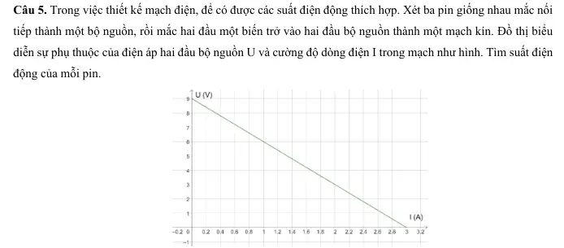
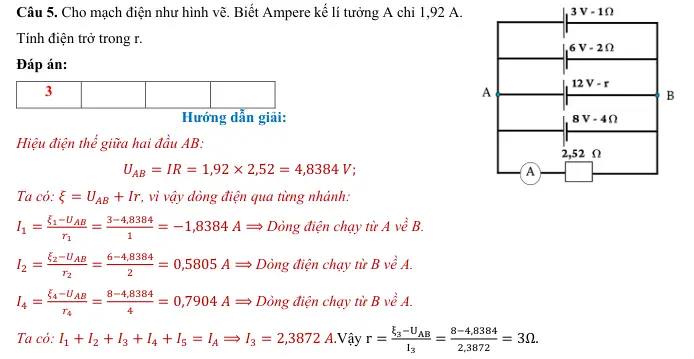
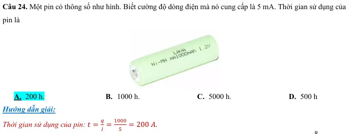
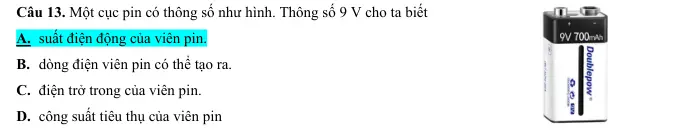
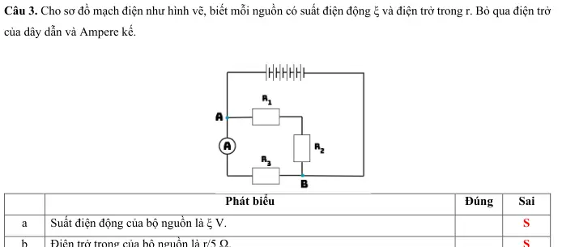
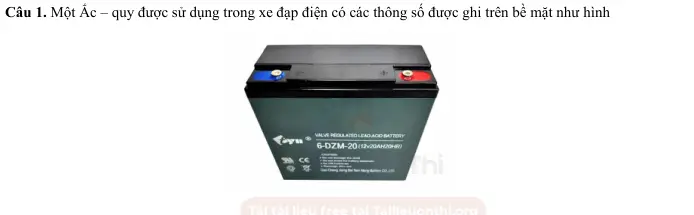
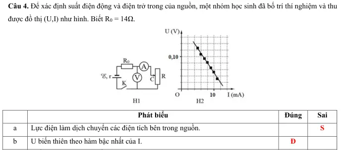
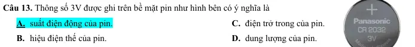
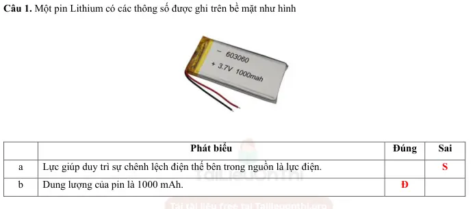
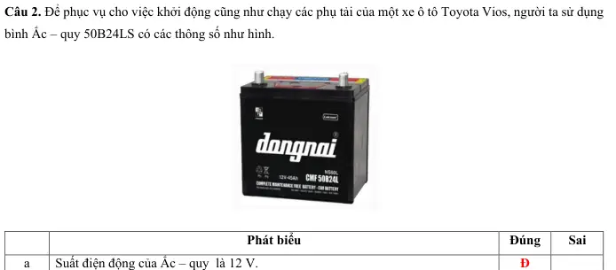

# Bài tập — Bài 3 — Nguồn điện, suất điện động và điện trở trong

> Hệ bài tập được biên soạn theo các dạng xuất hiện trong bộ tài liệu Vật lí 11 của dự án. Câu hỏi được giữ ngắn, trực tiếp; độ khó tăng dần và không cố tình thêm dữ kiện gây nhiễu.

[← Trở lại bài học](../../03-emf-internal-resistance.md)

## Phần A — Trắc nghiệm 4 lựa chọn

### Câu 1 — Mức 1 — Nhận biết

Suất điện động của nguồn được định nghĩa bởi

A. $\mathcal E=A_{ng}/q$.  
B. $\mathcal E=q/A_{ng}$.  
C. $\mathcal E=IR$.  
D. $\mathcal E=P/t$.

### Câu 2 — Mức 1 — Nhận biết

Nguồn có suất điện động $12$ V, điện trở trong $1\,\Omega$, đang phát dòng $2$ A. Hiệu điện thế hai cực nguồn là

A. $10$ V.  
B. $12$ V.  
C. $14$ V.  
D. $24$ V.

### Câu 3 — Mức 1 — Nhận biết

Khi mạch ngoài hở, dòng điện bằng 0, hiệu điện thế hai cực của nguồn lí tưởng mô hình hóa bằng

A. 0.  
B. $Ir$.  
C. $\mathcal E$.  
D. $\mathcal E/2$.

### Câu 4 — Mức 1 — Nhận biết

Điện trở trong của nguồn gây ra

A. sụt áp $Ir$ khi có dòng.  
B. tăng vô hạn điện áp ngoài.  
C. làm dòng bằng 0 trong mọi mạch.  
D. không ảnh hưởng mạch.

## Phần B — Đúng/Sai

### Câu 5 — Mức 2 — Thông hiểu

Nguồn đang phát điện:

a) $U=\mathcal E-Ir$.  
b) Khi I tăng, U thường giảm nếu $\mathcal E,r$ không đổi.  
c) Khi hở mạch, U bằng suất điện động.  
d) Suất điện động có đơn vị ampe.

### Câu 6 — Mức 2 — Thông hiểu

Về công của nguồn:

a) $\mathcal E$ biểu thị công của lực lạ trên một đơn vị điện tích.  
b) Công của nguồn trong thời gian t có thể viết $A_{ng}=\mathcal E It$ khi dòng không đổi.  
c) Điện trở trong càng lớn luôn làm hiệu suất nguồn tăng.  
d) Nguồn thực có thể nóng lên do tổn hao trong.

## Phần C — Trả lời ngắn

### Câu 7 — Mức 3 — Vận dụng

Nguồn có $\mathcal E=9$ V, $r=0,5\,\Omega$, phát dòng $I=1,2$ A. Tính U hai cực.

### Câu 8 — Mức 3 — Vận dụng

Một nguồn hở mạch đo được $12$ V. Khi phát dòng $2$ A, hiệu điện thế hai cực còn $11$ V. Tính điện trở trong.

### Câu 9 — Mức 3 — Vận dụng

Nguồn $6$ V, $r=1\,\Omega$ phát dòng $0,50$ A trong 2 phút. Tính công của nguồn và nhiệt tỏa trên điện trở trong.

## Phần D — Vận dụng và vận dụng cao

### Câu 10 — Mức 4 — Vận dụng cao

Một nguồn có $\mathcal E=12$ V. Khi dòng phát là $1$ A, U hai cực $11,5$ V. Khi dòng phát $3$ A, U hai cực là bao nhiêu nếu mô hình nguồn tuyến tính không đổi?

---

[Đáp án và lời giải →](solutions.md)

## Ngân hàng bài tập PDF mở rộng

> Nội dung câu hỏi và dữ kiện trong phần này được giữ nguyên; hệ thống chỉ chuẩn hóa xuống dòng và mã kí tự để hiển thị trên web. Câu trùng được loại bỏ. Với câu có công thức/kí hiệu bị sai khi trích xuất chữ từ PDF, đề bài được giữ dưới dạng ảnh để không làm thay đổi dữ kiện.

### Nhận biết — Trả lời ngắn

#### Bài PDF 1

<!-- source-id: BT-Chuong-IV-p74-q1-229 -->

Câu 1. Suất điện động của bộ nguồn điện một chiều là ξ = 9 V. Công của lực lạ làm dịch chuyển một lượng
điện tích q = 2 mC giữa hai điện cực bằng bao nhiêu mJ?

#### Bài PDF 2

<!-- source-id: BT-Chuong-IV-p75-q5-233 -->

Câu 5. Trong việc thiết kế mạch điện, để có được các suất điện động thích hợp. Xét ba pin giống nhau mắc nối
tiếp thành một bộ nguồn, rồi mắc hai đầu một biến trở vào hai đầu bộ nguồn thành một mạch kín. Đồ thị biểu
diễn sự phụ thuộc của điện áp hai đầu bộ nguồn U và cường độ dòng điện I trong mạch như hình. Tìm suất điện
động của mỗi pin.

{ loading=lazy }

#### Bài PDF 3

<!-- source-id: BT-Chuong-IV-p86-q1-257 -->

Câu 1. Qua một nguồn điện có suất điện động không đổi, để chuyển một điện lượng 5 C thì lực lạ phải sinh
một công là 20 mJ. Để chuyển một điện lượng 20 C qua nguồn thì lực lạ phải sinh một công bằng bao nhiêu
mJ?

#### Bài PDF 4

<!-- source-id: BT-Chuong-IV-p86-q2-258 -->

Câu 2. Suất điện động của một pin là 1,5 V. Để dịch chuyển một điện tích q từ cực âm tới cực dương bên trong
nguồn điện cần tốn một công 7,5 J. Tính giá trị điện tích q.

#### Bài PDF 5

<!-- source-id: BT-Chuong-IV-p87-q5-261 -->

Câu 5. Cho mạch điện như hình vẽ. Biết Ampere kế lí tưởng A chỉ 1,92 A.
Tính điện trở trong r.

{ loading=lazy }

### Nhận biết — Trắc nghiệm 4 lựa chọn

#### Bài PDF 6

<!-- source-id: BT-Chuong-IV-p62-q2-194 -->

Câu 2. Đơn vị của suất điện động là
      A. A.
A. B. V.
C. F.
D. V/m.

#### Bài PDF 7

<!-- source-id: BT-Chuong-IV-p62-q3-195 -->

Câu 3. Suất điện động của nguồn điện là đại lượng đặc trưng cho khả năng
A. sinh công của mạch điện
B. thực hiện công của nguồn điện.
C. tác dụng lực của nguồn điện.
D. dự trữ điện tích của nguồn điện.

#### Bài PDF 8

<!-- source-id: BT-Chuong-IV-p62-q4-196 -->

Câu 4. Hiệu điện thế giữa hai cực của một nguồn điện có độ lớn
A. luôn bằng suất điện động của nguồn điện khi có dòng điện chạy qua nguồn.
B. luôn lớn hơn suất điện động của nguồn điện khi có dòng điện chạy qua nguồn.
C. luôn nhỏ hơn suất điện động của nguồn điện khi có dòng điện chạy qua nguồn.
D. luôn lớn hơn hoặc bằng suất điện động của nguồn điện khi có dòng điện chạy qua nguồn.

#### Bài PDF 9

<!-- source-id: BT-Chuong-IV-p62-q5-197 -->

Câu 5. Kết luận nào sau đây đúng khi nói về tác dụng của nguồn điện? Nguồn điện dùng để
A. tạo ra và duy trì sự chênh lệch điện thế.
B. tạo ra các ion dương.
C. tạo ra các ion âm.
D. chuyển hóa điện năng thành các dạng năng lượng khác.

#### Bài PDF 10

<!-- source-id: BT-Chuong-IV-p62-q6-198 -->

Câu 6. Biểu thức tính công của nguồn điện có dòng điện không đổi là
A. A = UIt.
B. A = ξIt.
C. A = ξIt + 𝑟2𝐼𝑡.
D. A = ξIt −𝑟2𝐼𝑡.

#### Bài PDF 11

<!-- source-id: BT-Chuong-IV-p63-q9-201 -->

Câu 9. Với nguồn điện là pin, ắc quy, thì “lực lạ” có bản chất là
A. lực điện từ.
B. lực hóa học.
C. lực tĩnh điện.
D. lực điện trường.

#### Bài PDF 12

<!-- source-id: BT-Chuong-IV-p63-q10-202 -->

Câu 10. Một pin sau một thời gian đem sử dụng thì
A. suất điện động và điện trở trong của pin đều tăng.
B. suất điện động và điện trở trong của pin đều giảm.
C. suất điện động của pin tăng và điện trở trong của pin giảm.
D. suất điện động của pin giảm và điện trở trong của pin tăng.

#### Bài PDF 13

<!-- source-id: BT-Chuong-IV-p65-q24-215 -->

Câu 24. Một pin có thông số như hình. Biết cường độ dòng điện mà nó cung cấp là 5 mA. Thời gian sử dụng của
pin là
A. 200 h.
B. 1000 h.
C. 5000 h.
D. 500 h

{ loading=lazy }

#### Bài PDF 14

<!-- source-id: BT-Chuong-IV-p78-q1-235 -->

Câu 1. Đại lượng đặc trưng cho khả năng thực hiện công của nguồn điện là
A. suất điện động.
B. hiệu điện thế.
C. cường độ dòng điện.
D. điện lượng.

#### Bài PDF 15

<!-- source-id: BT-Chuong-IV-p78-q2-236 -->

Câu 2. Kết luận nào sau đây là sai khi nói về nguồn điện?
A. Dùng để tạo ra sự chênh lệch điện thế.
B. Dùng để duy trì sự chênh lệch điện thế.
C. Dùng để tạo ra các ion âm.
D. Dùng để duy trì dòng điện trong mạch.

#### Bài PDF 16

<!-- source-id: BT-Chuong-IV-p78-q3-237 -->

Câu 3. “Lực lạ” trong pin điện hóa có bản chất là
A. lực điện.
B. lực đàn hồi.
C. lực hấp dẫn.
D. lực hóa học.

#### Bài PDF 17

<!-- source-id: BT-Chuong-IV-p78-q4-238 -->

Câu 4. Với nguồn điện là máy phát điện, thì “lực lạ” có bản chất là
A. lực điện từ.
B. lực hóa học.
C. lực tĩnh điện.
D. lực điện trường.

#### Bài PDF 18

<!-- source-id: BT-Chuong-IV-p78-q5-239 -->

Câu 5. Phát biểu nào sau đây là sai khi nói về suất điện động và hiệu điện thế?
A. Đều đặc trưng cho khả năng thực hiện công.
B. Đều có đơn vị là Volt.
C. Luôn bằng nhau khi không có dòng điện chạy qua nguồn.
D. Đều đặc trưng cho khả năng thực hiện công của nguồn điện.

#### Bài PDF 19

<!-- source-id: BT-Chuong-IV-p78-q6-240 -->

Câu 6. A là công của lực lạ, q là điện tích dịch chuyển trong nguồn và t là thời gian điện tích dịch chuyển. Suất
điện động của nguồn được tính theo công thức
A.  ξ =
A
t.
B. ξ =
q
t.
C. ξ =
A
q.
D. ξ = A. t.

#### Bài PDF 20

<!-- source-id: BT-Chuong-IV-p78-q7-241 -->

Câu 7. Phát biểu nào sau đây là đúng?
A. Trong nguồn điện hoá học (pin, ácquy), có sự chuyển hoá từ nội năng thành điện năng.
B. Trong nguồn điện hoá học (pin, ácquy), có sự chuyển hoá từ cơ năng thành điện năng.
C. Trong nguồn điện hoá học (pin, ácquy), có sự chuyển hoá từ hoá năng thành điện năng.
D. Trong nguồn điện hoá học (pin, ácquy), có sự chuyển hoá từ quang năng thành điện năng

#### Bài PDF 21

<!-- source-id: BT-Chuong-IV-p78-q8-242 -->

Câu 8. Một nguồn điện có điện trở trong 0,5 Ω được mắc với điện trở 4,5 Ω thành mạch kín. Khi đó suất điện
động là 12 V. Cường độ dòng điện trong mạch là
A. 2,4 A.
B. 24 A.
C. 2,5 A.
D. 25 A.

#### Bài PDF 22

<!-- source-id: BT-Chuong-IV-p79-q12-246 -->

Câu 12. Suất điện động của một Ắc – quy là 15 V. Công của nguồn điện khi dịch chuyển lượng điện tích là 0,2
C từ cực âm tới cực dương của nó là

A. 75 J.
B. 3 J.
C. 15 J.
D. 5 J.

#### Bài PDF 23

<!-- source-id: BT-Chuong-IV-p80-q13-247 -->

Câu 13. Một cục pin có thông số như hình. Thông số 9 V cho ta biết
A. suất điện động của viên pin.
B. dòng điện viên pin có thể tạo ra.
C. điện trở trong của viên pin.
D. công suất tiêu thụ của viên pin

{ loading=lazy }

### Nhận biết — Đúng/Sai

#### Bài PDF 24

<!-- source-id: BT-Chuong-IV-p70-q3-225 -->

Câu 3. Cho sơ đồ mạch điện như hình vẽ, biết mỗi nguồn có suất điện động ξ và điện trở trong r. Bỏ qua điện trở
của dây dẫn và Ampere kế.

Phát biểu
Đúng
Sai
a
Suất điện động của bộ nguồn là ξ V.

S
b
Điện trở trong của bộ nguồn là r/5 Ω.

S
c
Ở mạch chính, (R1 nt R2) // R3.
Đ

d
Số chỉ Ampere kế chính bằng cường độ dòng điện chạy trong mạch.

S

{ loading=lazy }

#### Bài PDF 25

<!-- source-id: BT-Chuong-IV-p81-q1-253 -->

Câu 1. Một Ắc – quy được sử dụng trong xe đạp điện có các thông số được ghi trên bề mặt như hình

Phát biểu
Đúng
Sai
a
Ắc – quy giúp tạo ra và duy trì sự chênh lệch điện thế nhằm duy trì dòng điện.
Đ

b
Suất điện động của Ắc – quy là 20 V.

S
c
Ắc – quy có dung lượng là 20Ah.
Đ

d
Để có thể duy trì trong vòng 20h thì Ắc – quy cần cung cấp dòng điện có cường độ
là 0,5 A.

S

{ loading=lazy }

#### Bài PDF 26

<!-- source-id: BT-Chuong-IV-p84-q4-256 -->

Câu 4. Để xác định suất điện động và điện trở trong của nguồn, một nhóm học sinh đã bố trí thí nghiệm và thu
được đồ thị (U,I) như hình. Biết R0 = 14Ω.

Phát biểu
Đúng
Sai
a
Lực điện làm dịch chuyển các điện tích bên trong nguồn.

S
b
U biến thiên theo hàm bậc nhất của I.
Đ

c
Suất điện động của nguồn là 0,4 V.

S
d
Điện trở trong của nguồn là 1 Ω.
Đ

{ loading=lazy }

### Thông hiểu — Trắc nghiệm 4 lựa chọn

#### Bài PDF 27

<!-- source-id: BT-Chuong-IV-p63-q11-203 -->

Câu 11. Ngoài đơn vị là Volt (V), suất điện động có thể có đơn vị là
A. J/s.
B. C/s.
C. J/C.
D. A.s.

#### Bài PDF 28

<!-- source-id: BT-Chuong-IV-p63-q12-204 -->

Câu 12. Khẳng định nào dưới đây sai khi nói về dung lượng của Ắc – quy?
A. Dung lượng của một acquy là xác định.
B. Là điện lượng lớn nhất mà acquy đó có thể cung cấp kể từ khi nó phát điện tới khi phải nạp điện lại.
C. Được tính bằng đơn vị Jun (J).
D. Được tính bằng đơn vị ampe giờ (A.h).

#### Bài PDF 29

<!-- source-id: BT-Chuong-IV-p63-q13-205 -->

Câu 13. Thông số 3V được ghi trên bề mặt pin như hình bên có ý nghĩa là
A. suất điện động của pin.
B. hiệu điện thế của pin.
C. điện trở trong của pin.
D. dung lượng của pin.

{ loading=lazy }

#### Bài PDF 30

<!-- source-id: BT-Chuong-IV-p63-q14-206 -->

Câu 14. Các lực lạ bên trong nguồn điện không có tác dụng
A. làm cho điện tích dịch chuyển ngược chiều điện trường bên trong nguồn điện.
B. tạo ra các điện tích mới cho nguồn điện.
C. tạo ra và duy trì hiệu điện thế giữa các cực của nguồn điện.
D. tạo ra sự tích điện khác nhau giữa hai cực của nguồn điện.

#### Bài PDF 31

<!-- source-id: BT-Chuong-IV-p63-q15-207 -->

Câu 15. Khi nói về suất điện động của nguồn điện, phát biểu nào dưới đây sai?
A. Là đại lượng đặc trưng cho khả năng thực hiện công của nguồn điện.
B. Suất điện động của nguồn điện đặc trưng cho khả năng tích điện của nguồn.
C. Được xác định bằng biểu thức A = ξq = ξIt.
D. Có đơn vị là Volt (V).

#### Bài PDF 32

<!-- source-id: BT-Chuong-IV-p64-q17-209 -->

Câu 17. Khi dòng điện chạy qua nguồn điện thì các hạt mang điện chuyển động có hướng dưới tác dụng của lực
     A. Cu lông.
B. hấp dẫn.
C. lực lạ.
D. điện trường.

#### Bài PDF 33

<!-- source-id: BT-Chuong-IV-p64-q19-211 -->

Câu 19. Khi nói về nguồn điện, phát biểu nào dưới đây là sai?
A. Mỗi nguồn điện có hai cực luôn ở trạng thái nhiễm điện dương và âm.
B. Nguồn điện là cơ cấu để tạo ra và duy trì hiệu điện thế nhằm duy trì dòng điện trong đoạn mạch.
C. Để tạo ra các cực nhiễm điện, cần phải có lực thực hiện công tách và chuyển các electron hoặc ion dương
ra khỏi điện cực, lực này gọi là lực lạ.
D. Nguồn điện là pin có lực lạ là lực tĩnh điện.

#### Bài PDF 34

<!-- source-id: BT-Chuong-IV-p64-q20-212 -->

Câu 20. Phát biểu nào sau đây là sai?
A. Suất điện động của nguồn điện là đại lượng đặc trưng cho khả năng sinh công của nguồn điện.
B. Suất điện động của nguồn điện được xác định bằng công suất dịch chuyển vòng kín của mạch điện.
C. Suất điện động của nguồn điện bằng công dịch chuyển điện tích dương 1 C từ cực âm đến cực dương bên
trong nguồn.
D. Suất điện động được đo bằng thương số giữa công A của lực lạ để di chuyển một điện tích dương q từ cực
âm đến cực dương bên trong nguồn điện và độ lớn của điện tích đó.

#### Bài PDF 35

<!-- source-id: BT-Chuong-IV-p64-q21-213 -->

Câu 21. Nguồn điện tạo ra điện thế giữa hai cực bằng cách
A. tách electron ra khỏi nguyên tử và chuyển electron, ion ra khỏi các cực của nguồn.
B. sinh ra electron ở cực âm và dịch chuyển chúng về phía cực dương.
C. sinh ra electron ở cực dương và dịch chuyển chúng về phía cực âm.
D. làm biến mất electron ở cực dương.
Câu 22 Mắc hai đầu điện trở 9 Ω vào hai cực của một nguồn điện có điện trở trong là 1 Ω, dòng điện chạy trong
mạch là 1,5 A. Suất điện động của nguồn là

A. ξ = 12 V.
B. ξ = 13 V.
C. ξ = 14 V.
D. ξ = 15 V.

#### Bài PDF 36

<!-- source-id: BT-Chuong-IV-p65-q23-214 -->

Câu 23. Một nguồn điện có điện trở trong 0,2 Ω được mắc với điện trở 4,8 Ω thành mạch kín. Khi đó hiệu điện
thế đặt ở hai cực của nguồn điện là 12 V. Cường độ dòng điện trong mạch là
A. I = 2,4 A.
B. I = 24,0 A.
C. I = 2,5 A.
D. I = 25,0 A.

### Vận dụng — Đúng/Sai

#### Bài PDF 37

<!-- source-id: BT-Chuong-IV-p68-q1-223 -->

Câu 1. Một pin Lithium có các thông số được ghi trên bề mặt như hình

Phát biểu
Đúng
Sai
a
Lực giúp duy trì sự chênh lệch điện thế bên trong nguồn là lực điện.

S
b
Dung lượng của pin là 1000 mAh.
Đ

B
A
R1
R2
R3
A
ξ, r
B
A
R1
R2
R3
A
ξ, r

c
Hiệu điện thế giữa hai đầu cực của nguồn là 3,7 V khi có dòng điện chạy qua nguồn.

S
d
Nếu cường độ dòng điện chạy trong nguồn là 4mA thì thời gian sử dụng của pin là
250 giờ.
Đ

{ loading=lazy }

#### Bài PDF 38

<!-- source-id: BT-Chuong-IV-p69-q2-224 -->

Câu 2. Để phục vụ cho việc khởi động cũng như chạy các phụ tải của một xe ô tô Toyota Vios, người ta sử dụng
bình Ắc – quy 50B24LS có các thông số như hình.

Phát biểu
Đúng
Sai
a
Suất điện động của Ắc – quy  là 12 V.
Đ

b
Nếu dòng điện chạy qua Ắc – quy có cường độ là 5 A thì Ắc – quy có thể cung cấp
điện liên tục trong 9h.
Đ

c
Trong trường hợp Ắc – quy sản sinh ra một công là 720 kJ, thì điện lượng dịch
chuyển trong Ắc – quy là 16000 C.

S
d
Để Ắc – quy có thể hoạt động liên tục trong 15h thì cường độ dòng điện mà Ắc –
quy có thể cung cấp là 3 A.
Đ

{ loading=lazy }

