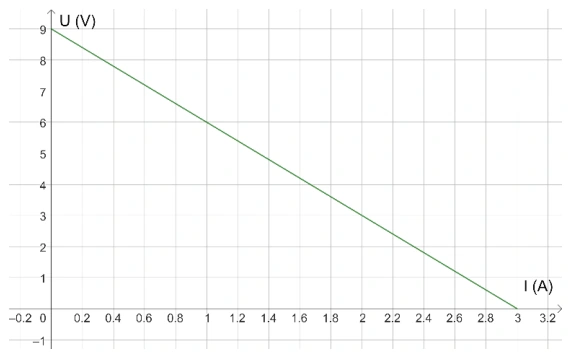
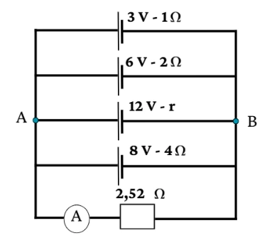
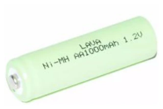
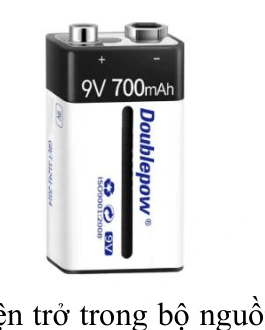
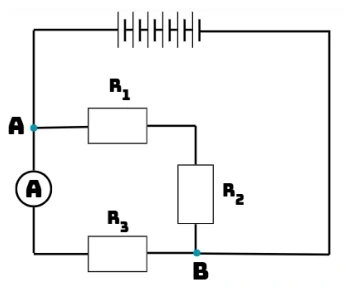
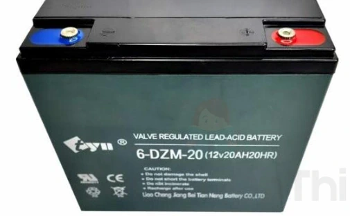
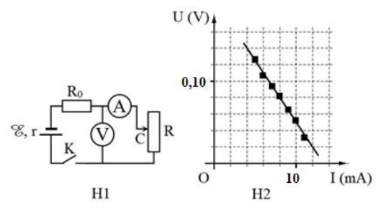
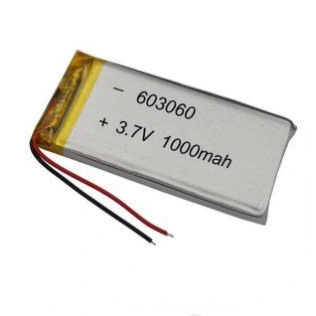
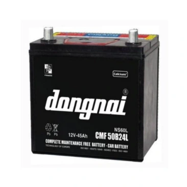

# Bài tập — Bài 3 — Nguồn điện, suất điện động và điện trở trong

> Hệ bài tập được biên soạn theo các dạng xuất hiện trong bộ tài liệu Vật lí 11 của dự án. Câu hỏi được giữ ngắn, trực tiếp; độ khó tăng dần và không cố tình thêm dữ kiện gây nhiễu.

[← Trở lại bài học](../../03-emf-internal-resistance.md)

## Phần A — Trắc nghiệm 4 lựa chọn

### Bài 1 — Mức 1 — Nhận biết

Suất điện động của nguồn được định nghĩa bởi

A. $\mathcal E=A_{ng}/q$.
B. $\mathcal E=q/A_{ng}$.
C. $\mathcal E=IR$.
D. $\mathcal E=P/t$.

??? success "Đáp án và lời giải"
    Chọn **A**, với $A_{ng}$ là công của lực lạ bên trong nguồn để dịch chuyển điện tích q.

### Bài 2 — Mức 1 — Nhận biết

Nguồn có suất điện động $12$ V, điện trở trong $1\,\Omega$, đang phát dòng $2$ A. Hiệu điện thế hai cực nguồn là

A. $10$ V.
B. $12$ V.
C. $14$ V.
D. $24$ V.

??? success "Đáp án và lời giải"
    Chọn **A**. Khi nguồn phát điện: $U=\mathcal E-Ir=12-2=10$ V.

### Bài 3 — Mức 1 — Nhận biết

Khi mạch ngoài hở, dòng điện bằng 0, hiệu điện thế hai cực của nguồn lí tưởng mô hình hóa bằng

A. 0.
B. $Ir$.
C. $\mathcal E$.
D. $\mathcal E/2$.

??? success "Đáp án và lời giải"
    Chọn **C** vì sụt áp trong bằng 0.

### Bài 4 — Mức 1 — Nhận biết

Điện trở trong của nguồn gây ra

A. sụt áp $Ir$ khi có dòng.
B. tăng vô hạn điện áp ngoài.
C. làm dòng bằng 0 trong mọi mạch.
D. không ảnh hưởng mạch.

??? success "Đáp án và lời giải"
    Chọn **A**.

## Phần B — Đúng/Sai

### Bài 5 — Mức 2 — Thông hiểu

Nguồn đang phát điện:

a) $U=\mathcal E-Ir$.
b) Khi I tăng, U thường giảm nếu $\mathcal E,r$ không đổi.
c) Khi hở mạch, U bằng suất điện động.
d) Suất điện động có đơn vị ampe.

??? success "Đáp án và lời giải"
    a) **Đúng**.
    b) **Đúng**.
    c) **Đúng**.
    d) **Sai**: đơn vị vôn.

### Bài 6 — Mức 2 — Thông hiểu

Về công của nguồn:

a) $\mathcal E$ biểu thị công của lực lạ trên một đơn vị điện tích.
b) Công của nguồn trong thời gian t có thể viết $A_{ng}=\mathcal E It$ khi dòng không đổi.
c) Điện trở trong càng lớn luôn làm hiệu suất nguồn tăng.
d) Nguồn thực có thể nóng lên do tổn hao trong.

??? success "Đáp án và lời giải"
    a) **Đúng**.
    b) **Đúng**.
    c) **Sai**.
    d) **Đúng**.

## Phần C — Trả lời ngắn

### Bài 7 — Mức 3 — Vận dụng

Nguồn có $\mathcal E=9$ V, $r=0,5\,\Omega$, phát dòng $I=1,2$ A. Tính U hai cực.

??? success "Đáp án và lời giải"
    $U=9-1,2\cdot0,5=8,4$ V.

### Bài 8 — Mức 3 — Vận dụng

Một nguồn hở mạch đo được $12$ V. Khi phát dòng $2$ A, hiệu điện thế hai cực còn $11$ V. Tính điện trở trong.

??? success "Đáp án và lời giải"
    $\mathcal E\approx12$ V khi hở mạch. $r=(\mathcal E-U)/I=(12-11)/2=0,5\,\Omega$.

### Bài 9 — Mức 3 — Vận dụng

Nguồn $6$ V, $r=1\,\Omega$ phát dòng $0,50$ A trong 2 phút. Tính công của nguồn và nhiệt tỏa trên điện trở trong.

??? success "Đáp án và lời giải"
    $t=120$ s. Công nguồn $A=\mathcal E It=6\cdot0,5\cdot120=360$ J. Nhiệt trên r: $Q=I^2rt=0,25\cdot1\cdot120=30$ J.

## Phần D — Vận dụng và vận dụng cao

### Bài 10 — Mức 4 — Vận dụng cao

Một nguồn có $\mathcal E=12$ V. Khi dòng phát là $1$ A, U hai cực $11,5$ V. Khi dòng phát $3$ A, U hai cực là bao nhiêu nếu mô hình nguồn tuyến tính không đổi?

??? success "Đáp án và lời giải"
    Từ trạng thái đầu: $r=(12-11,5)/1=0,5\,\Omega$.

    Ở $I=3$ A:

    $U=\mathcal E-Ir=12-3\cdot0,5=10,5$ V.

    Ta đã dùng giả thiết $\mathcal E$ và r không đổi trong khoảng làm việc.

## Ngân hàng bài tập mở rộng

> Các bài dưới đây được đánh số nối tiếp phần bài tập phía trên. Đề bài được trình bày bằng Markdown; chỉ đồ thị, hình vẽ hoặc sơ đồ thực sự cần thiết mới được giữ dưới dạng hình. Đáp án và lời giải được đặt trong nút mở rộng ngay dưới từng bài.

### Nhận biết — Trả lời ngắn

#### Bài 11

<!-- source-id: BT-Chuong-IV-p74-q1-229 -->

Suất điện động của bộ nguồn điện một chiều là ξ = 9 V. Công của lực lạ làm dịch chuyển một lượng
điện tích q = 2 mC giữa hai điện cực bằng bao nhiêu mJ?

??? success "Đáp án và lời giải"
    **Đáp án:** $18{,}0$

    **Hướng dẫn giải:**
    Công của lực lạ làm dịch chuyển một lượng điện tích q = 2 mC giữa hai điện cực:
    𝐴= 𝜉𝑞= 9 × 2. 10−3 = 0,018 𝐽= 18,0 𝑚𝐽.

#### Bài 12

<!-- source-id: BT-Chuong-IV-p75-q5-233 -->

Trong việc thiết kế mạch điện, để có được các suất điện động thích hợp. Xét ba pin giống nhau mắc nối
tiếp thành một bộ nguồn, rồi mắc hai đầu một biến trở vào hai đầu bộ nguồn thành một mạch kín. Đồ thị biểu
diễn sự phụ thuộc của điện áp hai đầu bộ nguồn U và cường độ dòng điện I trong mạch như hình. Tìm suất điện
động của mỗi pin.

{ loading=lazy }

??? success "Đáp án và lời giải"
    **Đáp án:** 9

    **Hướng dẫn giải:**
    Do các bộ nguồn được ghép nối tiếp nên ta thu được:
    𝜉𝑏= 𝐼(𝑅+ 𝑟𝑏) = 𝑈+ 𝐼𝑟𝑏
    ⟹𝑈= 𝜉𝑏−𝐼𝑟𝑏 ;
    Từ đồ thị ta thấy được hai điểm (I, U) có tọa độ: (0, 9) và (3, 0). Ta thu được hệ phương trình: {9 = 𝜉𝑏−0𝑟𝑏
    0 = 𝜉𝑏−3𝑟𝑏;
    Giải hệ phương trình, ta thu được: {𝜉𝑏= 9 𝑉
    𝑟𝑏= 3 𝛺.
    𝜉𝑏
    3 = 3 𝑉.

#### Bài 13

<!-- source-id: BT-Chuong-IV-p86-q1-257 -->

Qua một nguồn điện có suất điện động không đổi, để chuyển một điện lượng 5 C thì lực lạ phải sinh
một công là 20 mJ. Để chuyển một điện lượng 20 C qua nguồn thì lực lạ phải sinh một công bằng bao nhiêu
mJ?

??? success "Đáp án và lời giải"
    **Đáp án:** $80$

    **Hướng dẫn giải:**
    Công của lực lạ: 𝐴= 𝜉𝑞
    Ta có:
    𝐴1
    𝐴2
    = 𝑞1
    𝑞2
    ⟹𝐴2 = 20
    5 × 20 = 80 𝑚𝐽.

#### Bài 14

<!-- source-id: BT-Chuong-IV-p86-q2-258 -->

Suất điện động của một pin là 1,5 V. Để dịch chuyển một điện tích q từ cực âm tới cực dương bên trong
nguồn điện cần tốn một công 7,5 J. Tính giá trị điện tích q.

??? success "Đáp án và lời giải"
    **Đáp án:** 5

    **Hướng dẫn giải:**
    𝐴
    𝜉=
    7,5
    1,5 = 5 𝐶.

#### Bài 15

<!-- source-id: BT-Chuong-IV-p87-q5-261 -->

Cho mạch điện như hình vẽ. Biết Ampere kế lí tưởng A chỉ 1,92

A. Tính điện trở trong r.

{ loading=lazy }

??? success "Đáp án và lời giải"
    **Đáp án:** 3

    **Hướng dẫn giải:**
    Hiệu điện thế giữa hai đầu AB:
    𝑈𝐴𝐵= 𝐼𝑅= 1,92 × 2,52 = 4,8384 𝑉;
    Ta có: 𝜉= 𝑈𝐴𝐵+ 𝐼𝑟, vì vậy dòng điện qua từng nhánh:
    𝐼1 =
    𝜉1−𝑈𝐴𝐵
    𝑟1
    =
    3−4,8384
    1
    = −1,8384 𝐴⟹ Dòng điện chạy từ A về B.
    𝐼2 =
    𝜉2−𝑈𝐴𝐵
    𝑟2
    =
    6−4,8384
    2
    = 0,5805 𝐴⟹ Dòng điện chạy từ B về A.
    𝐼4 =
    𝜉4−𝑈𝐴𝐵
    𝑟4
    =
    8−4,8384
    4
    = 0,7904 𝐴⟹ Dòng điện chạy từ B về A.
    ξ3−UAB
    I3
    =
    8−4,8384
    2,3872 = 3Ω.

### Nhận biết — Trắc nghiệm 4 lựa chọn

#### Bài 16

<!-- source-id: BT-Chuong-IV-p62-q2-194 -->

Đơn vị của suất điện động là

A. A.

A. B. V.

C. F.

D. V/m.

??? success "Đáp án và lời giải"
    **Đáp án:** B
    **Hướng dẫn giải:**

    Suất điện động là công của nguồn trên một đơn vị điện tích; khi nguồn phát điện, hiệu điện thế hai cực dùng $U=\mathcal E-Ir$.

    Vậy kết quả cần tìm là **B**.
#### Bài 17

<!-- source-id: BT-Chuong-IV-p62-q3-195 -->

Suất điện động của nguồn điện là đại lượng đặc trưng cho khả năng

A. sinh công của mạch điện

B. thực hiện công của nguồn điện.

C. tác dụng lực của nguồn điện.

D. dự trữ điện tích của nguồn điện.

??? success "Đáp án và lời giải"
    **Đáp án:** B
    **Hướng dẫn giải:**

    Suất điện động là công của nguồn trên một đơn vị điện tích; khi nguồn phát điện, hiệu điện thế hai cực dùng $U=\mathcal E-Ir$.

    Đối chiếu kết quả với các lựa chọn, phương án phù hợp là **B. thực hiện công của nguồn điện.**
#### Bài 18

<!-- source-id: BT-Chuong-IV-p62-q4-196 -->

Hiệu điện thế giữa hai cực của một nguồn điện có độ lớn

A. luôn bằng suất điện động của nguồn điện khi có dòng điện chạy qua nguồn.

B. luôn lớn hơn suất điện động của nguồn điện khi có dòng điện chạy qua nguồn.

C. luôn nhỏ hơn suất điện động của nguồn điện khi có dòng điện chạy qua nguồn.

D. luôn lớn hơn hoặc bằng suất điện động của nguồn điện khi có dòng điện chạy qua nguồn.

??? success "Đáp án và lời giải"
    **Đáp án:** C
    **Hướng dẫn giải:**

    Suất điện động là công của nguồn trên một đơn vị điện tích; khi nguồn phát điện, hiệu điện thế hai cực dùng $U=\mathcal E-Ir$.

    Đối chiếu kết quả với các lựa chọn, phương án phù hợp là **C. luôn nhỏ hơn suất điện động của nguồn điện khi có dòng điện chạy qua nguồn.**
#### Bài 19

<!-- source-id: BT-Chuong-IV-p62-q5-197 -->

Kết luận nào sau đây đúng khi nói về tác dụng của nguồn điện? Nguồn điện dùng để

A. tạo ra và duy trì sự chênh lệch điện thế.

B. tạo ra các ion dương.

C. tạo ra các ion âm.

D. chuyển hóa điện năng thành các dạng năng lượng khác.

??? success "Đáp án và lời giải"
    **Đáp án:** A
    **Hướng dẫn giải:**

    Suất điện động là công của nguồn trên một đơn vị điện tích; khi nguồn phát điện, hiệu điện thế hai cực dùng $U=\mathcal E-Ir$.

    Đối chiếu kết quả với các lựa chọn, phương án phù hợp là **A. tạo ra và duy trì sự chênh lệch điện thế.**
#### Bài 20

<!-- source-id: BT-Chuong-IV-p62-q6-198 -->

Biểu thức tính công của nguồn điện có dòng điện không đổi là

A. A = UIt.

B. A = ξIt.

C. A = ξIt + 𝑟2𝐼𝑡.

D. A = ξIt −𝑟2𝐼𝑡.

??? success "Đáp án và lời giải"
    **Đáp án:** B
    **Hướng dẫn giải:**

    Suất điện động là công của nguồn trên một đơn vị điện tích; khi nguồn phát điện, hiệu điện thế hai cực dùng $U=\mathcal E-Ir$.

    Đối chiếu kết quả với các lựa chọn, phương án phù hợp là **B. A = ξIt.**
#### Bài 21

<!-- source-id: BT-Chuong-IV-p63-q9-201 -->

Với nguồn điện là pin, ắc quy, thì “lực lạ” có bản chất là

A. lực điện từ.

B. lực hóa học.

C. lực tĩnh điện.

D. lực điện trường.

??? success "Đáp án và lời giải"
    **Đáp án:** B
    **Hướng dẫn giải:**

    Suất điện động là công của nguồn trên một đơn vị điện tích; khi nguồn phát điện, hiệu điện thế hai cực dùng $U=\mathcal E-Ir$.

    Đối chiếu kết quả với các lựa chọn, phương án phù hợp là **B. lực hóa học.**
#### Bài 22

<!-- source-id: BT-Chuong-IV-p63-q10-202 -->

Một pin sau một thời gian đem sử dụng thì

A. suất điện động và điện trở trong của pin đều tăng.

B. suất điện động và điện trở trong của pin đều giảm.

C. suất điện động của pin tăng và điện trở trong của pin giảm.

D. suất điện động của pin giảm và điện trở trong của pin tăng.

??? success "Đáp án và lời giải"
    **Đáp án:** D
    **Hướng dẫn giải:**

    Suất điện động là công của nguồn trên một đơn vị điện tích; khi nguồn phát điện, hiệu điện thế hai cực dùng $U=\mathcal E-Ir$.

    Đối chiếu kết quả với các lựa chọn, phương án phù hợp là **D. suất điện động của pin giảm và điện trở trong của pin tăng.**
#### Bài 23

<!-- source-id: BT-Chuong-IV-p65-q24-215 -->

Một pin có thông số như hình. Biết cường độ dòng điện mà nó cung cấp là 5 mA. Thời gian sử dụng của
pin là

A. 200 h.

B. 1000 h.

C. 5000 h.

D. 500 h

{ loading=lazy }

??? success "Đáp án và lời giải"
    **Đáp án:** A
    **Hướng dẫn giải:**
    𝑞
    𝐼=
    1000
    5
    = 200 𝐴.

#### Bài 24

<!-- source-id: BT-Chuong-IV-p78-q1-235 -->

Đại lượng đặc trưng cho khả năng thực hiện công của nguồn điện là

A. suất điện động.

B. hiệu điện thế.

C. cường độ dòng điện.

D. điện lượng.

??? success "Đáp án và lời giải"
    **Đáp án:** A
    **Hướng dẫn giải:**

    Suất điện động là công của nguồn trên một đơn vị điện tích; khi nguồn phát điện, hiệu điện thế hai cực dùng $U=\mathcal E-Ir$.

    Đối chiếu kết quả với các lựa chọn, phương án phù hợp là **A. suất điện động.**
#### Bài 25

<!-- source-id: BT-Chuong-IV-p78-q2-236 -->

Kết luận nào sau đây là sai khi nói về nguồn điện?

A. Dùng để tạo ra sự chênh lệch điện thế.

B. Dùng để duy trì sự chênh lệch điện thế.

C. Dùng để tạo ra các ion âm.

D. Dùng để duy trì dòng điện trong mạch.

??? success "Đáp án và lời giải"
    **Đáp án:** C
    **Hướng dẫn giải:**

    Suất điện động là công của nguồn trên một đơn vị điện tích; khi nguồn phát điện, hiệu điện thế hai cực dùng $U=\mathcal E-Ir$.

    Đối chiếu kết quả với các lựa chọn, phương án phù hợp là **C. Dùng để tạo ra các ion âm.**
#### Bài 26

<!-- source-id: BT-Chuong-IV-p78-q3-237 -->

“Lực lạ” trong pin điện hóa có bản chất là

A. lực điện.

B. lực đàn hồi.

C. lực hấp dẫn.

D. lực hóa học.

??? success "Đáp án và lời giải"
    **Đáp án:** D
    **Hướng dẫn giải:**

    Suất điện động là công của nguồn trên một đơn vị điện tích; khi nguồn phát điện, hiệu điện thế hai cực dùng $U=\mathcal E-Ir$.

    Đối chiếu kết quả với các lựa chọn, phương án phù hợp là **D. lực hóa học.**
#### Bài 27

<!-- source-id: BT-Chuong-IV-p78-q4-238 -->

Với nguồn điện là máy phát điện, thì “lực lạ” có bản chất là

A. lực điện từ.

B. lực hóa học.

C. lực tĩnh điện.

D. lực điện trường.

??? success "Đáp án và lời giải"
    **Đáp án:** A
    **Hướng dẫn giải:**

    Suất điện động là công của nguồn trên một đơn vị điện tích; khi nguồn phát điện, hiệu điện thế hai cực dùng $U=\mathcal E-Ir$.

    Đối chiếu kết quả với các lựa chọn, phương án phù hợp là **A. lực điện từ.**
#### Bài 28

<!-- source-id: BT-Chuong-IV-p78-q5-239 -->

Phát biểu nào sau đây là sai khi nói về suất điện động và hiệu điện thế?

A. Đều đặc trưng cho khả năng thực hiện công.

B. Đều có đơn vị là Volt.

C. Luôn bằng nhau khi không có dòng điện chạy qua nguồn.

D. Đều đặc trưng cho khả năng thực hiện công của nguồn điện.

??? success "Đáp án và lời giải"
    **Đáp án:** D
    **Hướng dẫn giải:**

    Suất điện động là công của nguồn trên một đơn vị điện tích; khi nguồn phát điện, hiệu điện thế hai cực dùng $U=\mathcal E-Ir$.

    Đối chiếu kết quả với các lựa chọn, phương án phù hợp là **D. Đều đặc trưng cho khả năng thực hiện công của nguồn điện.**
#### Bài 29

<!-- source-id: BT-Chuong-IV-p78-q6-240 -->

A là công của lực lạ, q là điện tích dịch chuyển trong nguồn và t là thời gian điện tích dịch chuyển. Suất
điện động của nguồn được tính theo công thức

A. ξ =
A
t.

B. ξ =
q
t.

C. ξ =
A
q.

D. ξ =

A. t.

??? success "Đáp án và lời giải"
    **Đáp án:** C
    **Hướng dẫn giải:**

    Suất điện động là công của nguồn trên một đơn vị điện tích; khi nguồn phát điện, hiệu điện thế hai cực dùng $U=\mathcal E-Ir$.

    Đối chiếu kết quả với các lựa chọn, phương án phù hợp là **C. ξ = A q.**
#### Bài 30

<!-- source-id: BT-Chuong-IV-p78-q7-241 -->

Phát biểu nào sau đây là đúng?

A. Trong nguồn điện hoá học (pin, ácquy), có sự chuyển hoá từ nội năng thành điện năng.

B. Trong nguồn điện hoá học (pin, ácquy), có sự chuyển hoá từ cơ năng thành điện năng.

C. Trong nguồn điện hoá học (pin, ácquy), có sự chuyển hoá từ hoá năng thành điện năng.

D. Trong nguồn điện hoá học (pin, ácquy), có sự chuyển hoá từ quang năng thành điện năng

??? success "Đáp án và lời giải"
    **Đáp án:** C
    **Hướng dẫn giải:**

    Suất điện động là công của nguồn trên một đơn vị điện tích; khi nguồn phát điện, hiệu điện thế hai cực dùng $U=\mathcal E-Ir$.

    Đối chiếu kết quả với các lựa chọn, phương án phù hợp là **C. Trong nguồn điện hoá học (pin, ácquy), có sự chuyển hoá từ hoá năng thành điện năng.**
#### Bài 31

<!-- source-id: BT-Chuong-IV-p78-q8-242 -->

Một nguồn điện có điện trở trong 0,5 Ω được mắc với điện trở 4,5 Ω thành mạch kín. Khi đó suất điện
động là 12 V. Cường độ dòng điện trong mạch là

A. 2,4

A. B. 24

A. C. 2,5

A. D. 25 A.

??? success "Đáp án và lời giải"
    **Đáp án:** A
    **Hướng dẫn giải:**
    𝜉
    𝑅+𝑟=
    12
    4,5+0,5 = 2,4 𝐴.

#### Bài 32

<!-- source-id: BT-Chuong-IV-p79-q12-246 -->

Suất điện động của một Ắc – quy là 15 V. Công của nguồn điện khi dịch chuyển lượng điện tích là 0,2
C từ cực âm tới cực dương của nó là

A. 75 J.

B. 3 J.

C. 15 J.

D. 5 J.

??? success "Đáp án và lời giải"
    **Hướng dẫn giải:**
    Công của nguồn điện: 𝐴= 𝜉× 𝑞= 15 × 0,2 = 3 J.

#### Bài 33

<!-- source-id: BT-Chuong-IV-p80-q13-247 -->

Một cục pin có thông số như hình. Thông số 9 V cho ta biết

A. suất điện động của viên pin.

B. dòng điện viên pin có thể tạo ra.

C. điện trở trong của viên pin.

D. công suất tiêu thụ của viên pin

{ loading=lazy }

??? success "Đáp án và lời giải"
    **Đáp án:** A
    **Hướng dẫn giải:**

    Suất điện động là công của nguồn trên một đơn vị điện tích; khi nguồn phát điện, hiệu điện thế hai cực dùng $U=\mathcal E-Ir$.

    Đối chiếu kết quả với các lựa chọn, phương án phù hợp là **A. suất điện động của viên pin.**
### Nhận biết — Đúng/Sai

#### Bài 34

<!-- source-id: BT-Chuong-IV-p70-q3-225 -->

Cho sơ đồ mạch điện như hình vẽ, biết mỗi nguồn có suất điện động ξ và điện trở trong r. Bỏ qua điện trở
của dây dẫn và Ampere kế.

a) Suất điện động của bộ nguồn là ξ V.
b) Điện trở trong của bộ nguồn là r/5 Ω.
c) Ở mạch chính, (R1 nt R2) // R3.
d) Số chỉ Ampere kế chính bằng cường độ dòng điện chạy trong mạch.

{ loading=lazy }

??? success "Đáp án và lời giải"
    **Hướng dẫn giải:**
    Ta vẽ lại mạch điện:

    Do các nguồn đang mắc nối tiếp nhau nên:
    a. Suất điện động của bộ nguồn là 𝜉𝑏= 𝑛𝜉= 5𝜉 𝑉.
    b. Điện trở trong của bộ nguồn là 𝑟𝑏= 𝑛𝑟= 5𝑟 𝛺.
    d. Số chỉ Ampere kế chính bằng cường độ dòng điện chạy qua điện trở R3.

#### Bài 35

<!-- source-id: BT-Chuong-IV-p81-q1-253 -->

Một Ắc – quy được sử dụng trong xe đạp điện có các thông số được ghi trên bề mặt như hình

a) Ắc – quy giúp tạo ra và duy trì sự chênh lệch điện thế nhằm duy trì dòng điện.
b) Suất điện động của Ắc – quy là 20 V.
c) Ắc – quy có dung lượng là 20Ah.
d) Để có thể duy trì trong vòng 20h thì Ắc – quy cần cung cấp dòng điện có cường độ là 0,5
A.

{ loading=lazy }

??? success "Đáp án và lời giải"
    **Đáp án:** a) Đúng; b) Sai; c) Đúng; d) Sai.

    **Hướng dẫn giải:**

    a) **Đúng.** Ắc-quy là nguồn điện, có nhiệm vụ tạo và duy trì hiệu điện thế để duy trì dòng điện trong mạch.

    b) **Sai.** Nhãn trên ắc-quy ghi **12 V**, không phải 20 V.

    c) **Đúng.** Nhãn ghi dung lượng **20 Ah**.

    d) **Sai.** Nếu coi dòng phóng không đổi, $I=Q/t=20\ \text{Ah}/20\ \text{h}=1$ A, không phải $0{,}5$ A.
#### Bài 36

<!-- source-id: BT-Chuong-IV-p84-q4-256 -->

Để xác định suất điện động và điện trở trong của nguồn, một nhóm học sinh đã bố trí thí nghiệm và thu
được đồ thị (U,I) như hình. Biết R0 = 14Ω.

a) Lực điện làm dịch chuyển các điện tích bên trong nguồn.
b) U biến thiên theo hàm bậc nhất của I.
c) Suất điện động của nguồn là 0,4 V.
d) Điện trở trong của nguồn là 1 Ω.

{ loading=lazy }

??? success "Đáp án và lời giải"
    **Đáp án:** a) Sai; b) Đúng; c) Sai; d) Đúng.

    **Hướng dẫn giải:**

    a) **Sai.** Bên trong nguồn, điện tích được dịch chuyển ngược chiều lực điện nhờ **lực lạ**, không phải do lực điện thực hiện toàn bộ quá trình đó.

    b) **Đúng.** Với điện trở phụ $R_0$, ta có $\xi=U+I(r+R_0)$ nên $U=\xi-I(r+R_0)$, là hàm bậc nhất của $I$.

    c) **Sai.** Từ hai điểm trên đồ thị $(4\times10^{-3}\ \text{A};0{,}14\ \text{V})$ và $(12\times10^{-3}\ \text{A};0{,}02\ \text{V})$, giải hệ thu được $\xi=0{,}20$ V, không phải $0{,}40$ V.

    d) **Đúng.** Cùng hệ phương trình cho $r=1\ \Omega$.
### Thông hiểu — Trắc nghiệm 4 lựa chọn

#### Bài 37

<!-- source-id: BT-Chuong-IV-p63-q11-203 -->

Ngoài đơn vị là Volt (V), suất điện động có thể có đơn vị là

A. J/s.

B. C/s.

C. J/C.

D. A.s.

??? success "Đáp án và lời giải"
    **Đáp án:** C
    **Hướng dẫn giải:**

    Suất điện động là công của nguồn trên một đơn vị điện tích; khi nguồn phát điện, hiệu điện thế hai cực dùng $U=\mathcal E-Ir$.

    Đối chiếu kết quả với các lựa chọn, phương án phù hợp là **C. J/C.**
#### Bài 38

<!-- source-id: BT-Chuong-IV-p63-q12-204 -->

Khẳng định nào dưới đây sai khi nói về dung lượng của Ắc – quy?

A. Dung lượng của một acquy là xác định.

B. Là điện lượng lớn nhất mà acquy đó có thể cung cấp kể từ khi nó phát điện tới khi phải nạp điện lại.

C. Được tính bằng đơn vị Jun (J).

D. Được tính bằng đơn vị ampe giờ (A.h).

??? success "Đáp án và lời giải"
    **Đáp án:** C
    **Hướng dẫn giải:**

    Suất điện động là công của nguồn trên một đơn vị điện tích; khi nguồn phát điện, hiệu điện thế hai cực dùng $U=\mathcal E-Ir$.

    Đối chiếu kết quả với các lựa chọn, phương án phù hợp là **C. Được tính bằng đơn vị Jun (J).**
#### Bài 39

<!-- source-id: BT-Chuong-IV-p63-q13-205 -->

Thông số 3V được ghi trên bề mặt pin như hình bên có ý nghĩa là

A. suất điện động của pin.

B. hiệu điện thế của pin.

C. điện trở trong của pin.

D. dung lượng của pin.

{ loading=lazy }

??? success "Đáp án và lời giải"
    **Đáp án:** A
    **Hướng dẫn giải:**

    Suất điện động là công của nguồn trên một đơn vị điện tích; khi nguồn phát điện, hiệu điện thế hai cực dùng $U=\mathcal E-Ir$.

    Đối chiếu kết quả với các lựa chọn, phương án phù hợp là **A. suất điện động của pin.**
#### Bài 40

<!-- source-id: BT-Chuong-IV-p63-q14-206 -->

Các lực lạ bên trong nguồn điện không có tác dụng

A. làm cho điện tích dịch chuyển ngược chiều điện trường bên trong nguồn điện.

B. tạo ra các điện tích mới cho nguồn điện.

C. tạo ra và duy trì hiệu điện thế giữa các cực của nguồn điện.

D. tạo ra sự tích điện khác nhau giữa hai cực của nguồn điện.

??? success "Đáp án và lời giải"
    **Đáp án:** B
    **Hướng dẫn giải:**

    Suất điện động là công của nguồn trên một đơn vị điện tích; khi nguồn phát điện, hiệu điện thế hai cực dùng $U=\mathcal E-Ir$.

    Đối chiếu kết quả với các lựa chọn, phương án phù hợp là **B. tạo ra các điện tích mới cho nguồn điện.**
#### Bài 41

<!-- source-id: BT-Chuong-IV-p63-q15-207 -->

Khi nói về suất điện động của nguồn điện, phát biểu nào dưới đây sai?

A. Là đại lượng đặc trưng cho khả năng thực hiện công của nguồn điện.

B. Suất điện động của nguồn điện đặc trưng cho khả năng tích điện của nguồn.

C. Được xác định bằng biểu thức A = ξq = ξIt.

D. Có đơn vị là Volt (V).

??? success "Đáp án và lời giải"
    **Đáp án:** B
    **Hướng dẫn giải:**

    Suất điện động là công của nguồn trên một đơn vị điện tích; khi nguồn phát điện, hiệu điện thế hai cực dùng $U=\mathcal E-Ir$.

    Đối chiếu kết quả với các lựa chọn, phương án phù hợp là **B. Suất điện động của nguồn điện đặc trưng cho khả năng tích điện của nguồn.**
#### Bài 42

<!-- source-id: BT-Chuong-IV-p64-q17-209 -->

Khi dòng điện chạy qua nguồn điện thì các hạt mang điện chuyển động có hướng dưới tác dụng của lực

A. Cu lông.

B. hấp dẫn.

C. lực lạ.

D. điện trường.

??? success "Đáp án và lời giải"
    **Đáp án:** C
    **Hướng dẫn giải:**

    Suất điện động là công của nguồn trên một đơn vị điện tích; khi nguồn phát điện, hiệu điện thế hai cực dùng $U=\mathcal E-Ir$.

    Đối chiếu kết quả với các lựa chọn, phương án phù hợp là **C. lực lạ.**
#### Bài 43

<!-- source-id: BT-Chuong-IV-p64-q19-211 -->

Khi nói về nguồn điện, phát biểu nào dưới đây là sai?

A. Mỗi nguồn điện có hai cực luôn ở trạng thái nhiễm điện dương và âm.

B. Nguồn điện là cơ cấu để tạo ra và duy trì hiệu điện thế nhằm duy trì dòng điện trong đoạn mạch.

C. Để tạo ra các cực nhiễm điện, cần phải có lực thực hiện công tách và chuyển các electron hoặc ion dương
ra khỏi điện cực, lực này gọi là lực lạ.

D. Nguồn điện là pin có lực lạ là lực tĩnh điện.

??? success "Đáp án và lời giải"
    **Đáp án:** D
    **Hướng dẫn giải:**

    Suất điện động là công của nguồn trên một đơn vị điện tích; khi nguồn phát điện, hiệu điện thế hai cực dùng $U=\mathcal E-Ir$.

    Đối chiếu kết quả với các lựa chọn, phương án phù hợp là **D. Nguồn điện là pin có lực lạ là lực tĩnh điện.**
#### Bài 44

<!-- source-id: BT-Chuong-IV-p64-q20-212 -->

Phát biểu nào sau đây là sai?

A. Suất điện động của nguồn điện là đại lượng đặc trưng cho khả năng sinh công của nguồn điện.

B. Suất điện động của nguồn điện được xác định bằng công suất dịch chuyển vòng kín của mạch điện.

C. Suất điện động của nguồn điện bằng công dịch chuyển điện tích dương 1 C từ cực âm đến cực dương bên
trong nguồn.

D. Suất điện động được đo bằng thương số giữa công A của lực lạ để di chuyển một điện tích dương q từ cực
âm đến cực dương bên trong nguồn điện và độ lớn của điện tích đó.

??? success "Đáp án và lời giải"
    **Đáp án:** B
    **Hướng dẫn giải:**

    Suất điện động là công của nguồn trên một đơn vị điện tích; khi nguồn phát điện, hiệu điện thế hai cực dùng $U=\mathcal E-Ir$.

    Đối chiếu kết quả với các lựa chọn, phương án phù hợp là **B. Suất điện động của nguồn điện được xác định bằng công suất dịch chuyển vòng kín của mạch điện.**
#### Bài 45

<!-- source-id: BT-Chuong-IV-p64-q21-213 -->

Nguồn điện tạo ra điện thế giữa hai cực bằng cách

A. tách electron ra khỏi nguyên tử và chuyển electron, ion ra khỏi các cực của nguồn.

B. sinh ra electron ở cực âm và dịch chuyển chúng về phía cực dương.

C. sinh ra electron ở cực dương và dịch chuyển chúng về phía cực âm.

D. làm biến mất electron ở cực dương.
Câu 22 Mắc hai đầu điện trở 9 Ω vào hai cực của một nguồn điện có điện trở trong là 1 Ω, dòng điện chạy trong
mạch là 1,5

A. Suất điện động của nguồn là

A. ξ = 12 V.

B. ξ = 13 V.

C. ξ = 14 V.

D. ξ = 15 V.

??? success "Đáp án và lời giải"
    **Hướng dẫn giải:**
    Suất điện động của nguồn: 𝜉= 𝐼. (𝑅+ 𝑟) = 1,5 × (9 + 1) = 15 𝑉.

#### Bài 46

<!-- source-id: BT-Chuong-IV-p65-q23-214 -->

Một nguồn điện có điện trở trong 0,2 Ω được mắc với điện trở 4,8 Ω thành mạch kín. Khi đó hiệu điện
thế đặt ở hai cực của nguồn điện là 12 V. Cường độ dòng điện trong mạch là

A. I = 2,4

A. B. I = 24,0

A. C. I = 2,5

A. D. I = 25,0 A.

??? success "Đáp án và lời giải"
    **Đáp án:** C
    **Hướng dẫn giải:**
    𝑈
    𝑅=
    12
    4,8 = 2,5 𝐴.

### Vận dụng — Đúng/Sai

#### Bài 47

<!-- source-id: BT-Chuong-IV-p68-q1-223 -->

Một pin Lithium có các thông số được ghi trên bề mặt như hình

a) Lực giúp duy trì sự chênh lệch điện thế bên trong nguồn là lực điện.
b) Dung lượng của pin là 1000 mAh. B A R1 R2 R3 A ξ, r B A R1 R2 R3 A ξ, r
c) Hiệu điện thế giữa hai đầu cực của nguồn là 3,7 V khi có dòng điện chạy qua nguồn.
d) Nếu cường độ dòng điện chạy trong nguồn là 4mA thì thời gian sử dụng của pin là 250 giờ.

{ loading=lazy }

??? success "Đáp án và lời giải"
    **Đáp án:** a) Sai; b) Đúng; c) Sai; d) Đúng.

    **Hướng dẫn giải:**

    a) **Sai.** Bên trong nguồn, lực duy trì sự phân li điện tích là **lực lạ**, không phải lực điện.

    b) **Đúng.** Trên vỏ pin ghi dung lượng $1000$ mAh.

    c) **Sai.** Con số $3{,}7$ V trên vỏ là điện áp danh định/suất điện động đặc trưng; khi nguồn đang cấp dòng, điện áp hai cực còn phụ thuộc dòng tải và điện trở trong, nên không thể khẳng định luôn bằng đúng $3{,}7$ V.

    d) **Đúng.** Với dòng $4$ mA, thời gian lí tưởng $t=1000/4=250$ h.
#### Bài 48

<!-- source-id: BT-Chuong-IV-p69-q2-224 -->

Để phục vụ cho việc khởi động cũng như chạy các phụ tải của một xe ô tô Toyota Vios, người ta sử dụng
bình Ắc – quy 50B24LS có các thông số như hình.

a) Suất điện động của Ắc – quy là 12 V.
b) Nếu dòng điện chạy qua Ắc – quy có cường độ là 5 A thì Ắc – quy có thể cung cấp điện liên tục trong 9h.
c) Trong trường hợp Ắc – quy sản sinh ra một công là 720 kJ, thì điện lượng dịch
c) huyển trong Ắc – quy là 16000

C. d) Để Ắc – quy có thể hoạt động liên tục trong 15h thì cường độ dòng điện mà Ắc – quy có thể cung cấp là 3
A.

{ loading=lazy }

??? success "Đáp án và lời giải"
    **Hướng dẫn giải:**
    b. Thời gian mà ắc – quy có thể cung cấp điện liên tục khi cường độ dòng điện chạy qua Ắc – quy là 5 A:
    ∆𝑡= 𝛥𝑞
    𝐼= 45
    5 = 9ℎ.
    c. Điện lượng dịch chuyển bên trong Ắc – quy khi nó sản sinh ra một công là 720 kJ:

    𝑞= 𝐴
    𝜉= 720. 103
    12
    = 60000 𝐶.
    d. Cường độ dòng điện để Ắc – quy có thể hoạt động liên tục trong 15h:
    𝐼= 𝛥𝑞
    𝛥𝑡= 45
    15 = 3 𝐴.
