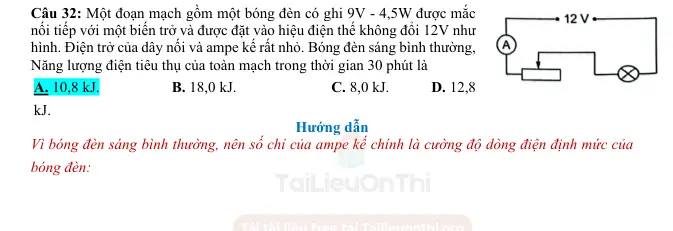
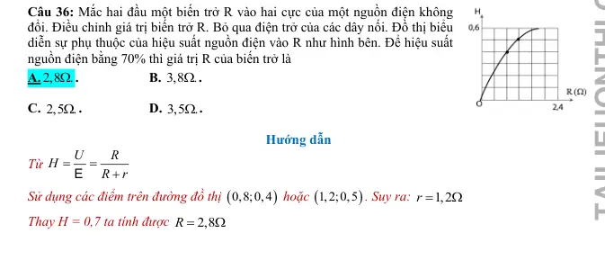
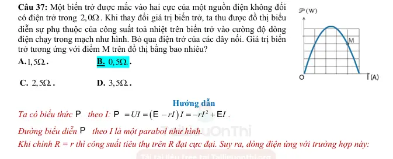
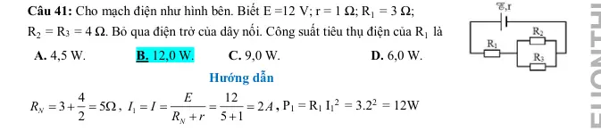
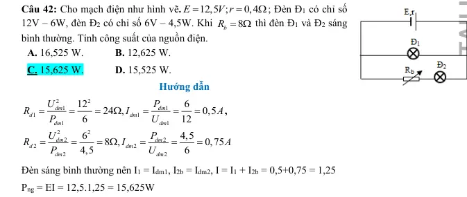
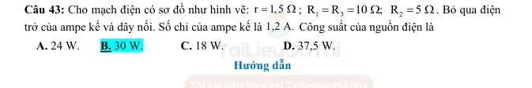
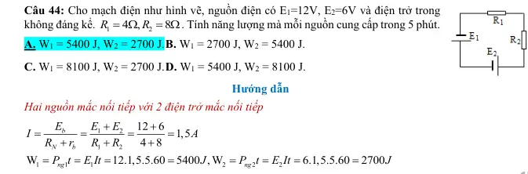
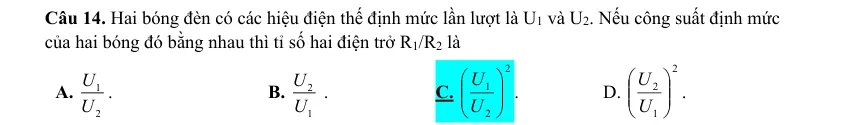
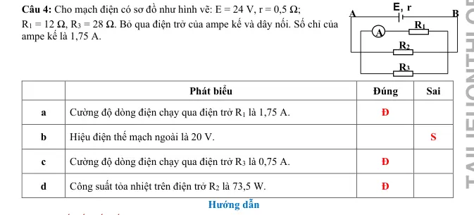
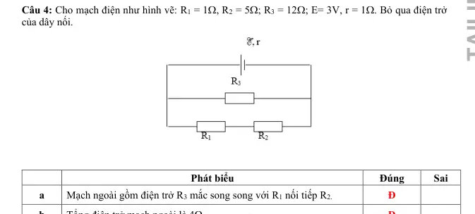

# Bài tập — Bài 4 — Năng lượng điện, công suất và định luật Joule–Lenz

> Hệ bài tập được biên soạn theo các dạng xuất hiện trong bộ tài liệu Vật lí 11 của dự án. Câu hỏi được giữ ngắn, trực tiếp; độ khó tăng dần và không cố tình thêm dữ kiện gây nhiễu.

[← Trở lại bài học](../../04-energy-power-joule.md)

## Phần A — Trắc nghiệm 4 lựa chọn

### Câu 1 — Mức 1 — Nhận biết

Công suất tiêu thụ của điện trở R có thể viết

A. $P=UI$.  
B. $P=U/I$.  
C. $P=It/U$.  
D. $P=R/U^2$.

### Câu 2 — Mức 1 — Nhận biết

Điện trở $10\,\Omega$ có dòng $2$ A chạy qua. Công suất tỏa nhiệt là

A. $5$ W.  
B. $20$ W.  
C. $40$ W.  
D. $200$ W.

### Câu 3 — Mức 1 — Nhận biết

Một thiết bị ghi 220 V – 1100 W. Dòng định mức gần bằng

A. $0,2$ A.  
B. $5$ A.  
C. $10$ A.  
D. $242$ A.

### Câu 4 — Mức 1 — Nhận biết

Định luật Joule–Lenz cho nhiệt lượng tỏa ra trên điện trở trong dòng không đổi là

A. $Q=I^2Rt$.  
B. $Q=IR/t$.  
C. $Q=U/I$.  
D. $Q=R/(I^2t)$.

## Phần B — Đúng/Sai

### Câu 5 — Mức 2 — Thông hiểu

Điện năng và công suất:

a) $1$ kWh là đơn vị năng lượng.  
b) $1$ kWh = $3,6\cdot10^6$ J.  
c) Với điện trở thuần, $P=U^2/R$.  
d) Tăng R trong khi giữ I không đổi làm công suất giảm.

### Câu 6 — Mức 2 — Thông hiểu

Một nguồn có suất điện động E, phát dòng I:

a) Công suất của nguồn là $\mathcal E I$.  
b) Công suất hao phí trong nguồn là $I^2r$.  
c) Công suất mạch ngoài bằng $UI$.  
d) Hiệu suất nguồn luôn 100% nếu r khác 0.

## Phần C — Trả lời ngắn

### Câu 7 — Mức 3 — Vận dụng

Ấm điện $1200$ W hoạt động 15 phút. Tính điện năng theo kWh và J.

### Câu 8 — Mức 3 — Vận dụng

Điện trở $R=44\,\Omega$ mắc vào $220$ V trong 5 phút. Tính dòng, công suất và nhiệt lượng.

### Câu 9 — Mức 3 — Vận dụng

Một bếp điện truyền $1,5\cdot10^6$ J nhiệt hữu ích cho nước khi tiêu thụ $2,0\cdot10^6$ J điện năng. Tính hiệu suất.

## Phần D — Vận dụng và vận dụng cao

### Câu 10 — Mức 4 — Vận dụng cao

Ấm điện công suất danh định $1000$ W dùng để đun $1,5$ kg nước từ $20^\circ$C lên $100^\circ$C. Hiệu suất 80%, lấy $c=4200$ J/(kg·K). Tính thời gian đun.

---

[Đáp án và lời giải →](solutions.md)

## Ngân hàng bài tập PDF mở rộng

> Nội dung câu hỏi và dữ kiện trong phần này được giữ nguyên; hệ thống chỉ chuẩn hóa xuống dòng và mã kí tự để hiển thị trên web. Câu trùng được loại bỏ. Với câu có công thức/kí hiệu bị sai khi trích xuất chữ từ PDF, đề bài được giữ dưới dạng ảnh để không làm thay đổi dữ kiện.

### Nhận biết — Trả lời ngắn

#### Bài PDF 1

<!-- source-id: BT-Chuong-IV-p105-q1-315 -->

Câu 1. Công suất điện tiêu thụ trung bình của trường học trên là bao nhiêu kW?

#### Bài PDF 2

<!-- source-id: BT-Chuong-IV-p105-q2-316 -->

Câu 2. Năng lượng điện tiêu thụ của trường học trên 30 ngày là bao nhiêu kWh?

#### Bài PDF 3

<!-- source-id: BT-Chuong-IV-p105-q3-317 -->

Câu 3. Tiền điện của trường học trên phải trả trong 30 ngày với giá điện 2000 đ/kWh là bao nhiêu
triệu đồng?

#### Bài PDF 4

<!-- source-id: BT-Chuong-IV-p105-q4-318 -->

Câu 4. Nếu tại các phòng học của trường học trên, các bạn học sinh đều có ý thức tiết kiệm điện bằng
cách tắt các thiết bị điện khi không sử dụng. Thời gian dùng các thiết bị điện ở mỗi phòng học chỉ
còn 8 giờ mỗi ngày. Tiền điện mà trường học trên đã tiết kiệm được trong một năm học (9 tháng, mỗi
tháng 30 ngày) là bao nhiêu triệu đồng?

#### Bài PDF 5

<!-- source-id: BT-Chuong-IV-p105-q5-319 -->

Câu 5. Cường độ dòng điện qua bình nóng lạnh là bao nhiêu A? (Kết quả làm tròn đến 3 chữ số có
nghĩa)

#### Bài PDF 6

<!-- source-id: BT-Chuong-IV-p105-q6-320 -->

Câu 6. Giả sử mỗi ngày, một gia đình sử dụng bình nóng lạnh trong 90 phút. Nếu giá bản điện là 2
500 đồng/kWh thì số tiền gia đình phải trả mỗi ngày để sử dụng bình nóng lạnh là bao nhiêu triệu
đồng? (Kết quả làm tròn đến 3 chữ số có nghĩa)

#### Bài PDF 7

<!-- source-id: BT-Chuong-IV-p112-q1-343 -->

Câu 1. Nhiệt lượng cần để tăng nhiệt độ của ấm nhôm từ 20°C tới 100°C là bao nhiêu kJ? (Kết quả
làm tròn đến 3 chữ số có nghĩa)

#### Bài PDF 8

<!-- source-id: BT-Chuong-IV-p112-q2-344 -->

Câu 2. Nhiệt lượng cần để tăng nhiệt độ của nước từ 20°C tới 100°C là bao nhiêu kJ? (Kết quả làm
tròn đến 3 chữ số có nghĩa)

#### Bài PDF 9

<!-- source-id: BT-Chuong-IV-p112-q3-345 -->

Câu 3. Muốn đun sôi lượng nước đó trong 16 phút thì ấm phải có công suất là bao nhiêu W? (Kết
quả làm tròn đến 4 chữ số có nghĩa)

#### Bài PDF 10

<!-- source-id: BT-Chuong-IV-p112-q4-346 -->

Câu 4. Điện trở của bóng đèn pin là bao nhiêu Ω? (Kết quả làm tròn sau
dấu phẩy hai chữ số thập phân)

#### Bài PDF 11

<!-- source-id: BT-Chuong-IV-p113-q5-347 -->

Câu 5. Công suất chuyển năng lượng ở điện trở trong (thành nội năng trong pin) là bao nhiêu W?
(Kết quả làm tròn sau dấu phẩy hai chữ số thập phân)

### Nhận biết — Trắc nghiệm 4 lựa chọn

#### Bài PDF 12

<!-- source-id: BT-Chuong-IV-p96-q24-286 -->

Câu 24. Đặt một hiệu điện thế 12 V vào hai đầu một điện trở 8Ω. Nhiệt lượng tỏa ra trên điện trở
sau 1 phút là
A. 1800 J.                   B. 1080 J.                C. 1008 J.                      D. 1090 J.

#### Bài PDF 13

<!-- source-id: BT-Chuong-IV-p96-q25-287 -->

Câu 25. Mắc hai cực của một nguồn điện không đổi có suất điện động 6,0 V và điện trở trong 0,5Ω
vào hai đầu một điện trở R
3,5
=
Ω để tạo thành mạch kín. Bỏ qua điện trở các dây nối. Nhiệt lượng
toả ra trên điện trở R trong 1 phút là
A. 724,5 J.                   B. 472,5 J.                C. 274 J.                      D. 452,7 J.

#### Bài PDF 14

<!-- source-id: BT-Chuong-IV-p96-q26-288 -->

Câu 26. Một nguồn điện có suất điện động 12V. Khi mắc nguồn điện này với bóng đèn để thành
mạch kín thì nó cung cấp một dòng điện có cường độ 0,8A. Công suất của nguồn điện khi đó là
A. 10,7 W.                   B. 17,0 W.                C. 9,6 W.                      D. 12 W.

#### Bài PDF 15

<!-- source-id: BT-Chuong-IV-p97-q27-289 -->

Câu 27. Tính công suất điện hao phí dưới dạng nhiệt trên một dây cáp dài 15 km dẫn dòng điện có
cường độ 100 A. Biết điện trở trên một đơn vị chiều dài của dây cáp này là 0,20
/ km
Ω
.
A. 20 000 W.                   B. 45 000 W.                C. 15 000 W.                      D. 30 000 W.

#### Bài PDF 16

<!-- source-id: BT-Chuong-IV-p97-q28-290 -->

Câu 28. Một bóng đèn pin đang sáng với hiệu điện thế giữa hai đầu bóng đèn là 2,2 V và cường độ
dòng điện qua đèn là 0,25 A. Năng lượng tiêu thụ trên bóng đèn khi mỗi culông điện tích truyền qua
là
A. 2 J.                   B. 3,2 J.                C. 3 J.                      D. 2,2 J.

#### Bài PDF 17

<!-- source-id: BT-Chuong-IV-p97-q29-291 -->

Câu 29. Một  acquy ô tô có suất điện động12 V cung cấp dòng điện có cường độ 5 A trong thời gian
2,0 giờ. Năng lượng mà acquy cung cấp trong thời gian này là
A. 342 kJ.                   B. 234 kJ.                C. 432 kJ.                      D. 324 kJ.

#### Bài PDF 18

<!-- source-id: BT-Chuong-IV-p97-q30-292 -->

Câu 30. Một thiết bị làm nóng trong phòng thí nghiệm có điện trở 5,0 Ω. Thiết bị được nối với bộ
acquy 12 V. Bỏ qua điện trở của acquy. Công suất của thiết bị này là
A. 29 W.                   B. 17 W.                C. 9,7 W.                      D. 12 W.

#### Bài PDF 19

<!-- source-id: BT-Chuong-IV-p97-q31-293 -->

Câu 31. Người ta dùng số ampe-giờ (Ah) để biểu diễn năng lượng lưu trữ của pin hoặc acquy. Một
acquy 60 Ah có thể cung cấp dòng điện có cường độ 60 A trong 1 giờ hoặc 30 A trong 2 giờ. Năng
lượng được lưu trữ trong acquy ô tô 12 V, 80 Ah là
A. 3,25.106 J.                   B. 3,5.105 J.                C. 3,5.106 J.                      D. 3,2.105 J.

#### Bài PDF 20

<!-- source-id: BT-Chuong-IV-p97-q32-294 -->

Câu 32. Một đoạn mạch gồm một bóng đèn có ghi 9V - 4,5W được mắc
nối tiếp với một biến trở và được đặt vào hiệu điện thế không đổi 12V như
hình. Điện trở của dây nối và ampe kế rất nhỏ. Bóng đèn sáng bình thường,
Năng lượng điện tiêu thụ của toàn mạch trong thời gian 30 phút là
A. 10,8 kJ.                   B. 18,0 kJ.                         C. 8,0 kJ.           D. 12,8
kJ.

{ loading=lazy }

#### Bài PDF 21

<!-- source-id: BT-Chuong-IV-p98-q33-295 -->

Câu 33. Nguồn điện có điện trở trong r
2
= Ω, cung cấp một công suất P cho mạch ngoài là điện
trở
1
R
0,5 .
=
Ω Mắc thêm vào mạch ngoài điện trở
2
R  thì công suất tiêu thụ mạch ngoài không đổi.
Ta cần mắc
2
R  nối tiếp hay song song với
1
R  và có giá trị bao nhiêu?
A. Mắc nối tiếp và R2 = 7,5 Ω.                   B. Mắc nối tiếp và R2 = 5,5 Ω.
C. Mắc song song và R2 = 7,5 Ω.               D. Mắc song song và R2 = 5,5 Ω.

#### Bài PDF 22

<!-- source-id: BT-Chuong-IV-p98-q34-296 -->

Câu 34. Có hai điện trở mắc giữa hai điểm có hiệu điện thế là 12 V. Khi R1 nối tiếp R2 thì công suất
của mạch là 4 W. Khi R1 mắc song song R2 thì công suất của mạch là 18 W. Nếu R2 &gt; R1, thì R1 và
R2 có giá trị là
A. R1 = 12Ω và R2 = 24 Ω .
A. R1 = 24Ω và R2 = 48 Ω .

C. R1 = 10Ω và R2 = 24 Ω .
D. R1 = 6Ω và R2 = 24 Ω
.

#### Bài PDF 23

<!-- source-id: BT-Chuong-IV-p99-q35-297 -->

Câu 35. Một ắc quy nếu nó phát dòng điện có cường độ
1I
15A
=
thì công suất điện ở mạch ngoài
1P
136W
=
, còn nếu nó phát dòng điện có cường độ
2I
6A
=
thì công suất điện ở mạch ngoài
2P
64,8W
=
. Suất điện động và điện trở trong của ắc quy là
A.
12 ,
0,9 .
E
V r
=
=
Ω .

B.
10 ,
1,1 .
E
V r
=
=
Ω.
A.
12 ,
1,1 .
E
V r
=
=
Ω.

B.
10 ,
0,9 .
E
V r
=
=
Ω.

#### Bài PDF 24

<!-- source-id: BT-Chuong-IV-p99-q36-298 -->

Câu 36. Mắc hai đầu một biến trở R vào hai cực của một nguồn điện không
đổi. Điều chỉnh giá trị biến trở R. Bỏ qua điện trở của các dây nối. Đồ thị biểu
diễn sự phụ thuộc của hiệu suất nguồn điện vào R như hình bên. Để hiệu suất
nguồn điện bằng 70% thì giá trị R của biến trở là
A. 2,8 .
Ω.

B. 3,8 .
Ω.

C. 2,5 .
Ω.

D. 3,5 .
Ω.

{ loading=lazy }

#### Bài PDF 25

<!-- source-id: BT-Chuong-IV-p99-q37-299 -->

Câu 37. Một biến trở được mắc vào hai cực của một nguồn điện không đổi
có điện trở trong 2,0Ω. Khi thay đổi giá trị biến trở, ta thu được đồ thị biểu
diễn sự phụ thuộc của công suất toả nhiệt trên biến trở vào cường độ dòng
điện chạy trong mạch như hình. Bỏ qua điện trở của các dây nối. Giá trị biến
trở tương ứng với điểm M trên đồ thị bằng bao nhiêu?
A.1,5 .
Ω.

B. 0,5 .
Ω.

C. 2,5 .
Ω.

D. 3,5 .
Ω.

{ loading=lazy }

#### Bài PDF 26

<!-- source-id: BT-Chuong-IV-p100-q38-300 -->

Câu 38. Hai nguồn điện giống hệt nhau được mắc thành bộ rồi nối hai cực của bộ nguồn với hai đầu
của một điện trở thì kết quả là cường độ dòng điện qua điện trở trong trường hợp hai nguồn mắc nối
tiếp và hai nguồn mắc song song đều bằng nhau. Hiệu suất của bộ nguồn trong hai trường hợp mắc
nối tiếp và song song lần lượt là
A. 1
2
3
3
va
.

B. 1
1
4
2
va
.

C. 2
1
3
3
va
.

D. 1
1
2
4
va
.

#### Bài PDF 27

<!-- source-id: BT-Chuong-IV-p100-q39-301 -->

Câu 39. Bóng đèn huỳnh quang công suất 40W chiếu sáng tương đương với bóng đèn dây tóc công
suất 120W. Nếu trung bình một ngày thắp sáng 8 tiếng trong một tháng (30 ngày) sẽ tiết kiệm được
bao nhiêu số điện?
A. 18,2 kWh.               B. 19,2 kWh.                        C. 20,2 kWh.               D. 21,2 kWh.

#### Bài PDF 28

<!-- source-id: BT-Chuong-IV-p101-q41-303 -->

Câu 41. Cho mạch điện như hình bên. Biết E =12 V; r = 1 Ω; R1 = 3 Ω;
R2 = R3 = 4 Ω. Bỏ qua điện trở của dây nối. Công suất tiêu thụ điện của R1 là
A. 4,5 W.               B. 12,0 W.
C. 9,0 W.                          D. 6,0 W.

{ loading=lazy }

#### Bài PDF 29

<!-- source-id: BT-Chuong-IV-p101-q42-304 -->

Câu 42. Cho mạch điện như hình vẽ.
12,5 ;
0,4
E
V r
=
=
Ω; Đèn Đ1 có chỉ số
12V – 6W, đèn Đ2 có chỉ số 6V – 4,5W. Khi
8
b
R = Ω thì đèn Đ1 và Đ2 sáng
bình thường. Tính công suất của nguồn điện.
A. 16,525 W.
B. 12,625 W.
C. 15,625 W.
D. 15,525 W.

{ loading=lazy }

#### Bài PDF 30

<!-- source-id: BT-Chuong-IV-p101-q43-305 -->

Câu 43. Cho mạch điện có sơ đồ như hình vẽ:
;

. Bỏ qua điện
trở của ampe kế và dây nối. Số chỉ của ampe kế là
 Công suất của nguồn điện là
 A. 24 W.       B. 30 W.          C. 18 W.
D. 37,5 W.

{ loading=lazy }

#### Bài PDF 31

<!-- source-id: BT-Chuong-IV-p102-q44-306 -->

Câu 44. Cho mạch điện như hình vẽ, nguồn điện có E1=12V, E2=6V và điện trở trong
không đáng kể.
1
2
4 ,
8
R
R
= Ω
= Ω. Tính năng lượng mà mỗi nguồn cung cấp trong 5 phút.
A. W1 = 5400 J, W2 = 2700 J. B. W1 = 2700 J, W2 = 5400 J.

C. W1 = 8100 J, W2 = 2700 J. D. W1 = 5400 J, W2 = 8100 J.

{ loading=lazy }

#### Bài PDF 32

<!-- source-id: BT-Chuong-IV-p102-q45-307 -->

Câu 45. Một nguồn điện có suất điện động E= 6V, điện trở trong r= 2Ω, mạch ngoài có biến trở R.
Thay đổi R thì thấy khi R=R1 hoặc R=R2, công suất tiêu thụ ở mạch ngoài không đổi và bằng 4W. R1
và R2 bằng
A. R1 = 1Ω; R2 = 4Ω.

B. R1 = R2  = 2Ω.

C. R1 = 2Ω; R2 = 3Ω.

D. R1 = 3Ω; R2 = 1Ω.

#### Bài PDF 33

<!-- source-id: BT-Chuong-IV-p102-q46-308 -->

Câu 46. Xác định điện trở trong của nguồn điện, biết rằng khi điện trở ngoài là R1 = 2Ω hoặc R2 =
8Ω thì công suất toả nhiệt trên hai điện trở đó bằng nhau
A. 4Ω.

B. 2Ω.

C. 3Ω.

D. 1Ω.

#### Bài PDF 34

<!-- source-id: BT-Chuong-IV-p107-q1-321 -->

Câu 1. Năng lượng điện tiêu thụ của một đoạn mạch được đo bằng
A. công suất tiêu thụ của đoạn mạch.
B. điện trở của đoạn mạch.
C. công của lực điện thực hiện khi dịch chuyển các điện tích qua đoạn mạch.
D. hiệu điện thế giữa hai đầu đoạn mạch.

#### Bài PDF 35

<!-- source-id: BT-Chuong-IV-p107-q2-322 -->

Câu 2. Một bóng đèn có công suất định mức là 100 W. Nếu bóng đèn được sử dụng liên tục trong 5
giờ, thì điện năng tiêu thụ của bóng đèn là
A. 500 Wh.

B. 1800 kJ.

C. 500 kJ.
D. 1800 Wh.

#### Bài PDF 36

<!-- source-id: BT-Chuong-IV-p107-q3-323 -->

Câu 3. Công suất tiêu thụ điện của một đoạn mạch là
A. năng lượng điện mà đoạn mạch tiêu thụ trong một đơn vị thời gian.
B. lượng điện tích dịch chuyển qua đoạn mạch trong một đơn vị thời gian.
C. công của lực điện thực hiện khi dịch chuyển một đơn vị điện tích.
D. điện trở của đoạn mạch.

#### Bài PDF 37

<!-- source-id: BT-Chuong-IV-p107-q4-324 -->

Câu 4. Một gia đình sử dụng một máy điều hòa có công suất 1200 W trung bình 3 giờ mỗi ngày. Biết
giá tiền điện là 2000 đồng/kWh. Tiền điện phải trả cho việc sử dụng máy điều hòa trong một tháng
(30 ngày) là
A. 216000 đồng.
B. 21600 đồng.

C. 72000 đồng.
D. 7200 đồng.

#### Bài PDF 38

<!-- source-id: BT-Chuong-IV-p107-q5-325 -->

Câu 5. Một đoạn mạch có điện trở R tiêu thụ công suất P. Nếu tăng hiệu điện thế giữa hai đầu đoạn
mạch lên 2 lần thì công suất tiêu thụ của đoạn mạch sẽ
A. tăng 2 lần.
B. tăng 4 lần.  C. giảm 2 lần.
D. giảm 4 lần.

#### Bài PDF 39

<!-- source-id: BT-Chuong-IV-p107-q6-326 -->

Câu 6. Một bóng đèn có ghi 220 V – 60 W. Nếu mắc bóng đèn vào hiệu điện thế 110 V thì công suất
tiêu thụ của bóng đèn là
A. 60W.
 B. 30W.
 C. 15W.
 D. 45 W.

#### Bài PDF 40

<!-- source-id: BT-Chuong-IV-p108-q8-328 -->

Câu 8. Trong đoạn mạch chỉ có điện trở thuần, với thời gian như nhau, nếu cường độ dòng điện
giảm 2 lần thì nhiệt lượng tỏa ra trên mạch
A. giảm 2 lần.
B. giảm 4 lần. C. tăng 2 lần. D. tăng 4 lần.

#### Bài PDF 41

<!-- source-id: BT-Chuong-IV-p108-q9-329 -->

Câu 9. Điện năng biến đổi hoàn toàn thành nhiệt năng ở dụng cụ hay thiết bị điện nào sau đây?
A. Quạt điện. B. Ấm điện.

C. Ắc quy đang nạp điện.
D. Bình điện phân.

#### Bài PDF 42

<!-- source-id: BT-Chuong-IV-p108-q10-330 -->

Câu 10. Khi một động cơ điện đang hoạt động thì điện năng được biến đổi thành
A. năng lượng cơ học.
B. năng lượng cơ học và năng lượng nhiệt.
C. năng lượng cơ học, năng lượng nhiệt và năng lượng điện trường.
D. năng lượng cơ học, năng lượng nhiệt và năng lượng ánh sáng.

#### Bài PDF 43

<!-- source-id: BT-Chuong-IV-p108-q11-331 -->

Câu 11. Trong các nhận xét sau về công suất điện của một đoạn mạch, nhận xét nào không đúng?
A. Công suất tỉ lệ thuận với hiệu điện thế hai đầu mạch.
B. Công suất tỉ lệ thuận với cường độ dòng điện chạy qua mạch.
C. Công suất tỉ lệ nghịch với thời gian dòng điện chạy qua mạch.
D. Công suất có đơn vị là oát (W).

#### Bài PDF 44

<!-- source-id: BT-Chuong-IV-p108-q12-332 -->

Câu 12. Trên một bóng đèn có ghi 12 V – 1,25 A. Kết luận nào dưới đây là sai?
A. Bóng đèn này luôn có công suất là 15 W khi hoạt động.
B. Bóng đèn này chỉ có công suất 15 W khi mắc nó vào hiệu điện thế 12 V.
C. Bóng đèn này tiêu thụ điện năng 15 J trong 1 giây khi hoạt động bình thường.
D. Bóng đèn này có điện trở 9,6 Ohm khi hoạt động bình thường.

#### Bài PDF 45

<!-- source-id: BT-Chuong-IV-p108-q13-333 -->

Câu 13. Ngoài đơn vị là oát (W) công suất điện có thể có đơn vị là
A. Jun (J)

B. Vôn trên am pe (V/A)

C. Jun trên giây J/s

D. Ampe nhân giây (A.s)

#### Bài PDF 46

<!-- source-id: BT-Chuong-IV-p108-q14-334 -->

{ loading=lazy }

#### Bài PDF 47

<!-- source-id: BT-Chuong-IV-p108-q15-335 -->

Câu 15. Trong mạch điện chỉ có R, khi dòng điện có cường độ I chạy qua mạch thì nhiệt lượng toả
ra trong đoạn mạch trong khoảng thời gian t được tính bằng công thức
A. Q = R2It.

B. Q = U2I t.
C. Q = RI2t.

D. Q = RIt.

#### Bài PDF 48

<!-- source-id: BT-Chuong-IV-p109-q16-336 -->

Câu 16. Một nguồn điện có suất điện động 11,5 V và điện trở trong 0,8 Ω được nối với mạch ngoài
gồm các điện trở tạo thành một mạch kín. Nguồn phát dòng điện có cường độ 1 A. Công suất điện
mà nguồn cung cấp cho mạch ngoài là
A. 10,7 W.                   B. 17,0 W.                C. 9,7 W.                      D. 12 W.

#### Bài PDF 49

<!-- source-id: BT-Chuong-IV-p109-q17-337 -->

Câu 17. Một acquy có suất điện động 15,0 V. Hiệu điện thế giữa hai cực của acquy là 11,6 V khi nó
cung cấp công suất điện 20,0 W cho điện trở ngoài R. Điện trở trong của acquy này là
A. 1,972 Ω.                   B. 1,297 Ω.                         C. 2,972 Ω.           D. 2,729 Ω.

### Nhận biết — Đúng/Sai

#### Bài PDF 50

<!-- source-id: BT-Chuong-IV-p103-q1-311 -->

Câu 1. Khi nói về công suất điện.

Phát biểu
Đúng
Sai
a
Công suất điện là đại lượng đo bằng Jun (J).

S
b
Công suất điện cho biết tốc độ thực hiện công của dòng điện.

Đ

c
Nếu hiệu điện thế không đổi thì công suất điện tỉ lệ nghịch với
điện trở của mạch.
Đ

d
Công suất điện không phụ thuộc vào hiệu điện thế đặt vào mạch.

S

#### Bài PDF 51

<!-- source-id: BT-Chuong-IV-p103-q2-312 -->

Câu 2. Một nguồn 9,00 V cung cấp dòng điện 1,34 A cho bóng đèn trong 2 phút.

Phát biểu
Đúng
Sai
a
Điện tích đi qua đèn là 160,8 C.
Đ

b
Số electron chuyển qua đèn là 1,01.1021 electron.
Đ

c
Năng lượng mà nguồn cung cấp cho đèn 1,45.103 J.
Đ

d
Công suất của nguồn là 12,06 kW.

S

#### Bài PDF 52

<!-- source-id: BT-Chuong-IV-p104-q3-313 -->

Câu 3. Một bộ pin có suất điện động 12,0 V và điện trở trong r = 0,05 Ω. Người ta mắc vào hai cực
của nó một điện trở R = 3,00 Ω.

Phát biểu
Đúng
Sai
a
Cường độ dòng điện trong mạch là 4 A.

S
b
Hiệu điện thế giữa hai cực của bộ pin là 11,8 V.
Đ

c
Công suất điện cung cấp cho điện trở R là 46,3 W.
Đ

d
Công suất điện cung cấp cho điện trở trong là 0,772 W.
Đ

#### Bài PDF 53

<!-- source-id: BT-Chuong-IV-p104-q4-314 -->

Câu 4. Cho mạch điện có sơ đồ như hình vẽ: E = 24 V, r = 0,5 Ω;
R1 = 12 Ω, R3 = 28 Ω. Bỏ qua điện trở của ampe kế và dây nối. Số chỉ của
ampe kế là 1,75 A.

Phát biểu
Đúng
Sai
a
Cường độ dòng điện chạy qua điện trở R1 là 1,75 A.
Đ

b
Hiệu điện thế mạch ngoài là 20 V.

S
c
Cường độ dòng điện chạy qua điện trở R3 là 0,75 A.
Đ

d
Công suất tỏa nhiệt trên điện trở R2 là 73,5 W.
Đ

{ loading=lazy }

#### Bài PDF 54

<!-- source-id: BT-Chuong-IV-p109-q1-339 -->

Câu 1. Một bếp điện khi hoạt động bình thường có điện trở 80 Ω và cường độ dòng điện qua
bếp khi đó là 2,5A. Mỗi ngày sử dụng bếp này trong 3 giờ.

E, r
R1
R

Phát biểu
Đúng
Sai
a
Nhiệt lượng mà bếp tỏa ra trong thời gian 1 phút là 30 kJ.
Đ

b
Dùng bếp điện trên để đun sôi 1,5 lít nước có nhiệt độ ban đầu
là 250C thì thời gian đun sôi nước là 20 phút. Coi rằng nhiệt
lượng cần thiết để đun sôi nước là có ích. Biết nhiệt dung riêng
của nước là 4200 J/kg.K, khối lượng riêng của nước là D = 1000
kg/m3. Hiệu suất của bếp là 80%.

S
c
Điện năng bếp điện tiêu thụ trong 30 ngày là 45 kWh.
Đ

d
Tiền điện phải trả cho việc sử dụng bếp điện đó trong 30 ngày là
90 000 đồng nếu giá 1 kWh là 2000 đồng.
Đ

#### Bài PDF 55

<!-- source-id: BT-Chuong-IV-p110-q2-340 -->

Câu 2. Hai dây điện trở của một bếp điện được mắc song song giữa hai điểm A và B có hiệu điện
thế 220V. Cường độ dòng điện qua mỗi dây có giá trị lần lượt là 1,5A và 3,5A.

Phát biểu
Đúng
Sai
a
Điện trở của dây thứ nhất là 146,7 Ω.
Đ

b
Điện trở của dây thứ hai là 63 Ω.
Đ

c
Điện trở tương đương của đoạn mạch là 40 Ω.

S
d
Để có công suất của bếp là 1600W, người ta phải cắt bỏ bớt một
đoạn của dây thứ nhất rồi lại mắc song song với dây thứ hai vào
hiệu điện thế nói trên. Điện trở của sợi dây bị cắt bỏ đó là 88,4 Ω.
Đ

#### Bài PDF 56

<!-- source-id: BT-Chuong-IV-p111-q3-341 -->

Câu 3. Khi nói về năng lượng và công suất điện.

Phát biểu
Đúng
Sai
a
Năng lượng điện tiêu thụ của một đoạn mạch được đo bằng công
của lực điện thực hiện khi dịch chuyển các điện tích.
Đ

b
Công suất tiêu thụ năng lượng điện của một đoạn mạch là năng
lượng điện mà đoạn mạch tiêu thụ trong một đơn vị thời gian.
Đ

c
Năng lượng điện có thể chuyển hóa thành các dạng năng lượng
khác.
Đ

d
Công suất điện có đơn vị là Jun (J).

S

#### Bài PDF 57

<!-- source-id: BT-Chuong-IV-p111-q4-342 -->

Câu 4. Cho mạch điện như hình vẽ: R1 = 1Ω, R2 = 5Ω; R3 = 12Ω; E= 3V, r = 1Ω. Bỏ qua điện trở
của dây nối.

Phát biểu
Đúng
Sai
a
Mạch ngoài gồm điện trở R3 mắc song song với R1 nối tiếp R2.
Đ

b
Tổng điện trở mạch ngoài là 4Ω.
Đ

c
Cường độ dòng điện chạy trong mạch là 0,8 A

S
d
Công suất mạch ngoài là 1,55 W.

S

{ loading=lazy }

### Thông hiểu — Trắc nghiệm 4 lựa chọn

#### Bài PDF 58

<!-- source-id: BT-Chuong-IV-p94-q1-263 -->

Câu 1. Công thức nào trong các công thức sau đây cho phép xác định năng lượng điện tiêu thụ của
đoạn mạch (trong trường hợp dòng điện không đổi)?
A.
2
A
UI t.
=

B.
2
A
U It.
=

C. A
UIt.
=

D.
UI
A
.
t
=

#### Bài PDF 59

<!-- source-id: BT-Chuong-IV-p94-q2-264 -->

Câu 2. Đơn vị đo năng lượng điện tiêu thụ là
A. kW.
B. kV.
C. k .
Ω
D. kWh.

#### Bài PDF 60

<!-- source-id: BT-Chuong-IV-p94-q3-265 -->

Câu 3. Đơn vị của công suất điện là
A. Oát.
B. Jun.
C. Ampe.
D. Vôn.

#### Bài PDF 61

<!-- source-id: BT-Chuong-IV-p94-q4-266 -->

Câu 4. Dụng cụ nào sau đây được dùng để đo điện năng tiêu thụ
A.
.
B.
.
C.
.
D.
.

#### Bài PDF 62

<!-- source-id: BT-Chuong-IV-p94-q5-267 -->

Câu 5. Công của nguồn điện trong thời gian t được tính bằng công thức
A. A = E It.
B. A = E I/t.
C. A = E t/I.
D. A = It/E .

#### Bài PDF 63

<!-- source-id: BT-Chuong-IV-p94-q6-268 -->

Câu 6. Công suất của nguồn được tính bằng công thức
A. P = E /r.
B. P = E r.
C. P =E .I.
D. P = E I/r.

#### Bài PDF 64

<!-- source-id: BT-Chuong-IV-p94-q7-269 -->

Câu 7. Công của dòng điện được đo bằng
A. Ampe kế.
B. Vôn kế.
C. Tĩnh điện kế. D. Công tơ điện.

#### Bài PDF 65

<!-- source-id: BT-Chuong-IV-p94-q8-270 -->

Câu 8. Theo định luật Jun-Len xơ, điện năng biến đổi thành
A. hóa năng.
B. nhiệt năng.
C. cơ năng.
D. nội năng.

#### Bài PDF 66

<!-- source-id: BT-Chuong-IV-p94-q9-271 -->

Câu 9. Điện năng tiêu thụ của đoạn mạch không tỉ lệ thuận với
A. hiệu điện thế hai đầu mạch.
B. nhiệt độ của vật dẫn trong mạch.
C. cường độ dòng điện trong mạch.
D. thời gian dòng điện chạy qua mạch.

#### Bài PDF 67

<!-- source-id: BT-Chuong-IV-p94-q10-272 -->

Câu 10. Trong một đoạn mạch, công của dòng điện bằng
A. nhiệt lượng tỏa ra trên dây nối.
B. tích của suất điện động với cường độ dòng điện.
C. điện năng tiêu thụ trên đoạn mạch.
D. tích của hiệu điện thế giữa 2 đầu đoạn mạch và cường độ dòng điện qua đoạn mạch.

#### Bài PDF 68

<!-- source-id: BT-Chuong-IV-p94-q11-273 -->

Câu 11. Công suất của nguồn điện được xác định bằng
A. công của dòng điện chạy trong mạch kín sinh ra trong một giây.

B. công của dòng điện thực hiện khi dịch chuyển 1 đơn vị điện tích dương chạy trong
1 mạch kín.
C. lượng điện tích mà nguồn điện sinh ra trong 1 giây.
D. công mà lực lạ thực hiện khi dịch chuyển 1 đơn vị điện tích dương ngược chiều
điện trường bên trong nguồn.

#### Bài PDF 69

<!-- source-id: BT-Chuong-IV-p95-q12-274 -->

Câu 12. Hai nguồn điện có ghi 20V và 40V, nhận xét nào sau đây là đúng?
A. Hai nguồn này luôn tạo ra một hiệu điện thế 20V và 40V cho mạch ngoài.
B. Khả năng sinh công của hai nguồn là 20J và 40J.
C. Khả năng sinh công của nguồn thứ nhất bằng một nửa nguồn thứ hai.
D. Nguồn thứ nhất luôn sinh công bằng một nửa nguồn thứ hai.

#### Bài PDF 70

<!-- source-id: BT-Chuong-IV-p95-q13-275 -->

Câu 13. Trong các nhận xét sau về công suất điện của một đoạn mạch, nhận xét nào không
đúng?
A. Công suất tỉ lệ thuận với hiệu điện thế hai đầu mạch.
B. Công suất tỉ lệ thuận với cường độ dòng điện chạy qua mạch.
C. Công suất tỉ lệ nghịch với thời gian dòng điện chạy qua mạch.
D. Công suất có đơn vị là oát (W).

#### Bài PDF 71

<!-- source-id: BT-Chuong-IV-p95-q14-276 -->

Câu 14. Hai đầu đoạn mạch có một hiệu điện thế không đổi, nếu điện trở của mạch giảm 2 lần
thì công suất điện của mạch
A. tăng 4 lần.
B. không đổi.
C. giảm 4 lần. D. tăng 2 lần.

#### Bài PDF 72

<!-- source-id: BT-Chuong-IV-p95-q15-277 -->

Câu 15. Trong một đoạn mạch có điện trở thuần không đổi, nếu muốn tăng công suất tỏa nhiệt
lên 4 lần thì phải
A. tăng hiệu điện thế 2 lần.
B. tăng hiệu điện thế 4 lần.
C. giảm hiệu điện thế 2 lần.
D. giảm hiệu điện thế 4 lần.

#### Bài PDF 73

<!-- source-id: BT-Chuong-IV-p95-q17-279 -->

Câu 17. Hai bóng đèn có công suất lần lượt là P1 &lt; P2 đều làm việc bình thường ở hiệu điện thế U.
Cường độ dòng điện qua mỗi bóng đèn và điện trở của bóng nào lớn hơn?
A. I1 &lt; I2 và R1&gt;R2  .

B. I1 &gt; I2 và R1 &gt; R2.

C. I1 &lt; I2 và R1&lt;R2 .

D. I1 &gt; I2 và R1 &lt; R2.

#### Bài PDF 74

<!-- source-id: BT-Chuong-IV-p95-q18-280 -->

Câu 18. Theo định luật Jun – Len – xơ, nhiệt lượng toả ra trên dây dẫn tỉ lệ
A. với cường độ dòng điện qua dây dẫn.

C. nghịch với bình phương cường độ dòng điện qua dây dẫn.

B. với bình phương điện trở của dây dẫn.

D. với bình phương cường độ dòng điện qua dây dẫn.

### Vận dụng — Trắc nghiệm 4 lựa chọn

#### Bài PDF 75

<!-- source-id: BT-Chuong-IV-p96-q20-282 -->

Câu 20. Một gia đình sử dụng 2 bóng đèn (mỗi bóng 40 W), một quạt điện 75 W và một tivi 80 W
mỗi ngày trung bình 5 giờ. Nếu các thiết bị hoạt động bình thường thì điện năng tiêu thụ của gia đình
trong một ngày là
A. 1,175 kWh.
B. 1175 Wh.
C. 1150 kJ.

D. 1510 kJ.

#### Bài PDF 76

<!-- source-id: BT-Chuong-IV-p96-q21-283 -->

Câu 21. Một đoạn mạch có điện trở 20Ω được mắc vào hiệu điện thế 12V. Công suất tiêu thụ của
đoạn mạch là
A. 240 W.
 B. 12 W.
 C. 7,2 W.
 D. 2,4 W.

#### Bài PDF 77

<!-- source-id: BT-Chuong-IV-p96-q22-284 -->

Câu 22. Khi một bóng đèn có công suất 60 W hoạt động trong 1 giờ, nó tiêu thụ một lượng điện năng
là
A. 60 J.

B. 60 kJ.

C. 216 kJ.

D. 3600 J.

#### Bài PDF 78

<!-- source-id: BT-Chuong-IV-p96-q23-285 -->

Câu 23. Một bóng đèn sáng bình thường ở hiệu điện thế 220V với số chỉ ampe kế là 0,2A. Tính điện
năng bóng đèn tiêu thụ trong 30 ngày biết rằng mỗi ngày trung bình đèn thắp sáng trong 4 giờ?
A. 5,28 kWh.                   B. 6 kWh.                C. 6,5 kWh.                      D. 7 kWh.

