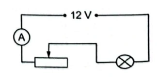
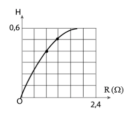
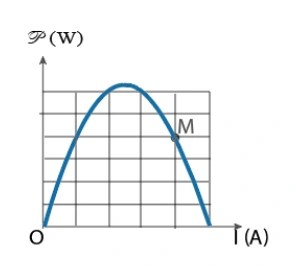
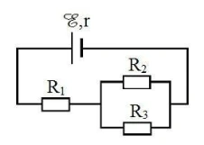
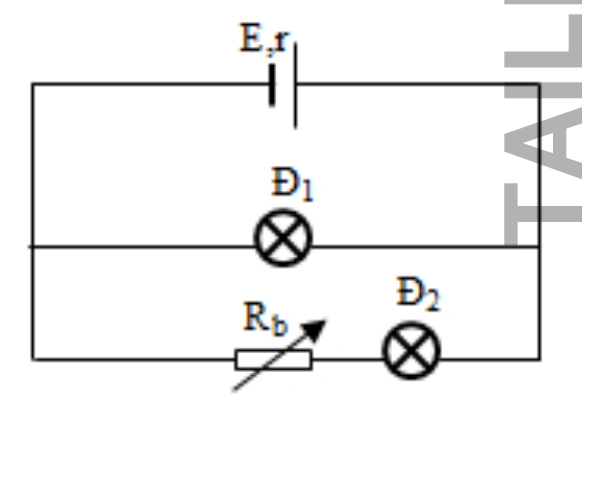
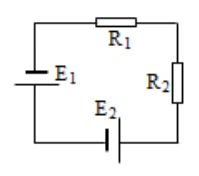
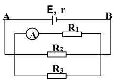
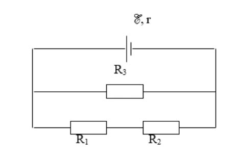
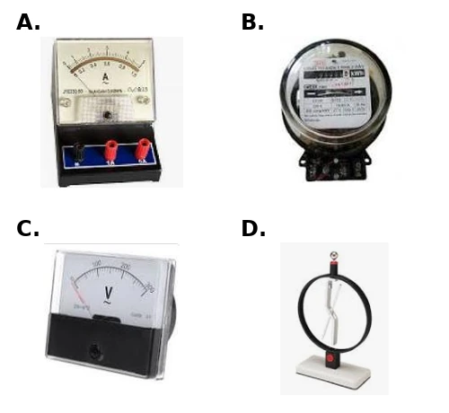

# Bài tập — Bài 4 — Năng lượng điện, công suất và định luật Joule–Lenz

[← Trở lại bài học](../../04-energy-power-joule.md)

## Phần A — Trắc nghiệm 4 lựa chọn

### Bài 1 — Mức 1 — Nhận biết

Công suất tiêu thụ của điện trở R có thể viết

A. $P=UI$.

B. $P=U/I$.

C. $P=It/U$.

D. $P=R/U^2$.

??? success "Đáp án và lời giải"
    Chọn **A**; với điện trở thuần còn có $P=I^2R=U^2/R$.

### Bài 2 — Mức 1 — Nhận biết

Điện trở $10\,\Omega$ có dòng $2\,\mathrm A$ chạy qua. Công suất tỏa nhiệt là

A. $5\,\mathrm W$.

B. $20\,\mathrm W$.

C. $40\,\mathrm W$.

D. $200\,\mathrm W$.

??? success "Đáp án và lời giải"
    Chọn **C**. $P=I^2R=4\cdot10=40\,\mathrm W$.

### Bài 3 — Mức 1 — Nhận biết

Một thiết bị ghi $220\,\mathrm V$ – $1100\,\mathrm W$. Dòng định mức gần bằng

A. $0,2\,\mathrm A$.

B. $5\,\mathrm A$.

C. $10\,\mathrm A$.

D. $242\,\mathrm A$.

??? success "Đáp án và lời giải"
    Chọn **B**. $I=P/U=1100/220=5\,\mathrm A$.

### Bài 4 — Mức 1 — Nhận biết

Định luật Joule–Lenz cho nhiệt lượng tỏa ra trên điện trở trong dòng không đổi là

A. $Q=I^2Rt$.

B. $Q=IR/t$.

C. $Q=U/I$.

D. $Q=R/(I^2t)$.

??? success "Đáp án và lời giải"
    Chọn **A**.

## Phần B — Đúng/Sai

### Bài 5 — Mức 2 — Thông hiểu

Điện năng và công suất:

a) $1\,\mathrm{kWh}$ là đơn vị năng lượng.

b) $1\,\mathrm{kWh}=3,6\cdot10^6\,\mathrm J$.

c) Với điện trở thuần, $P=U^2/R$.

d) Tăng R trong khi giữ I không đổi làm công suất giảm.

??? success "Đáp án và lời giải"
    a) **Đúng.** kW là đơn vị công suất và giờ là đơn vị thời gian, nên tích kW·h là đơn vị của năng lượng.

    b) **Đúng.** $1\,\mathrm{kWh}=1000\,\mathrm W\times3600\,\mathrm s=3{,}6\times10^6\,\mathrm J$.

    c) **Đúng.** Từ $P=UI$ và định luật Ohm $I=U/R$, suy ra $P=U^2/R$.

    d) **Sai.** với I không đổi, $P=I^2R$ nên tăng.

### Bài 6 — Mức 2 — Thông hiểu

Một nguồn có suất điện động E, phát dòng I:

a) Công suất của nguồn là $\mathcal E I$.

b) Công suất hao phí trong nguồn là $I^2r$.

c) Công suất mạch ngoài bằng $UI$.

d) Hiệu suất nguồn luôn 100% nếu r khác 0.

??? success "Đáp án và lời giải"
    a) **Đúng.** Vì công của nguồn trong thời gian $t$ là $A=\mathcal E It$, nên công suất $P=A/t=\mathcal E I$.

    b) **Đúng.** Phần điện trở trong $r$ tỏa nhiệt theo định luật Joule với công suất $P_{\text{hao}}=I^2r$.

    c) **Đúng.** Điện năng mạch ngoài nhận trong thời gian $t$ là $A=UIt$, nên công suất bằng $P=UI$.

    d) **Sai.** vì có tổn hao trong.

## Phần C — Trả lời ngắn

### Bài 7 — Mức 3 — Vận dụng

Ấm điện $1200\,\mathrm W$ hoạt động 15 phút. Tính điện năng theo kWh và J.

??? success "Đáp án và lời giải"
    $P=1,2$ kW, $t=0,25$ h nên $A=0,30\,\mathrm{kWh}$. Đổi ra J: $0,30\cdot3,6\cdot10^6=1,08\cdot10^6\,\mathrm J$.

### Bài 8 — Mức 3 — Vận dụng

Điện trở $R=44\,\Omega$ mắc vào $220\,\mathrm V$ trong 5 phút. Tính dòng, công suất và nhiệt lượng.

??? success "Đáp án và lời giải"
    $I=U/R=220/44=5\,\mathrm A$. $P=UI=1100\,\mathrm W$. $Q=Pt=1100\cdot300=3,3\cdot10^5\,\mathrm J$.

### Bài 9 — Mức 3 — Vận dụng

Một bếp điện truyền $1,5\cdot10^6\,\mathrm J$ nhiệt hữu ích cho nước khi tiêu thụ $2,0\cdot10^6\,\mathrm J$ điện năng. Tính hiệu suất.

??? success "Đáp án và lời giải"
    $H=A_{ích}/A_{vào}=1,5/2,0=0,75=75\%$.

## Phần D — Vận dụng và vận dụng cao

### Bài 10 — Mức 4 — Vận dụng cao

Ấm điện công suất danh định $1000\,\mathrm W$ dùng để đun $1,5\,\mathrm{kg}$ nước từ $20^\circ\,\mathrm C$ lên $100^\circ\,\mathrm C$. Hiệu suất 80%, lấy $c=4200\,\mathrm J$/(kg·K). Tính thời gian đun.

??? success "Đáp án và lời giải"
    Nhiệt nước cần nhận:

    $Q=mc\Delta T=1,5\cdot4200\cdot80=504000\,\mathrm J$.

    Vì hiệu suất $H=0,80$, điện năng cần cung cấp:

    $A=Q/H=504000/0,80=630000\,\mathrm J$.

    $t=A/P=630000/1000=630\,\mathrm s$ $=10,5$ phút.

## Ngân hàng bài tập mở rộng

### Nhận biết — Trả lời ngắn

#### Bài 11

<!-- source-id: BT-Chuong-IV-p105-q1-315 -->

Dữ kiện nguồn cho Bài 11–14: một trường có $20$ phòng học; trung bình mỗi phòng sử dụng thiết bị điện $10$ giờ mỗi ngày với công suất tiêu thụ $500\,\mathrm W$.

Công suất điện tiêu thụ trung bình của trường học trên là bao nhiêu kW?

??? success "Đáp án và lời giải"
    **Đáp án:** $10\,\mathrm{kW}$

    **Hướng dẫn giải:**

    Tổng công suất của 20 phòng: $P=20\cdot500=10\,000\,\mathrm W=10\,\mathrm{kW}$.
#### Bài 12

<!-- source-id: BT-Chuong-IV-p105-q2-316 -->

Dữ kiện nguồn cho Bài 11–14: một trường có $20$ phòng học; trung bình mỗi phòng sử dụng thiết bị điện $10$ giờ mỗi ngày với công suất tiêu thụ $500\,\mathrm W$.

Năng lượng điện tiêu thụ của trường học trên 30 ngày là bao nhiêu kWh?

??? success "Đáp án và lời giải"
    **Đáp án:** $3000\,\mathrm{kWh}$

    **Hướng dẫn giải:**

    Mỗi ngày trường dùng điện trong $10\,\mathrm h$, nên trong 30 ngày: $A=Pt=10\,\mathrm{kW}\cdot(10\cdot30)\,\mathrm h=3000\,\mathrm{kWh}$.
#### Bài 13

<!-- source-id: BT-Chuong-IV-p105-q3-317 -->

Dữ kiện nguồn cho Bài 11–14: một trường có $20$ phòng học; trung bình mỗi phòng sử dụng thiết bị điện $10$ giờ mỗi ngày với công suất tiêu thụ $500\,\mathrm W$.

Tiền điện của trường học trên phải trả trong 30 ngày với giá điện 2000 đ/kWh là bao nhiêu
triệu đồng?

??? success "Đáp án và lời giải"
    **Đáp án:** $6$ triệu đồng

    **Hướng dẫn giải:**

    Điện năng 30 ngày là $3000\,\mathrm{kWh}$. Tiền điện: $3000\cdot2000=6\,000\,000$ đồng, tức $6$ triệu đồng.
#### Bài 14

<!-- source-id: BT-Chuong-IV-p105-q4-318 -->

Dữ kiện nguồn cho Bài 11–14: một trường có $20$ phòng học; trung bình mỗi phòng sử dụng thiết bị điện $10$ giờ mỗi ngày với công suất tiêu thụ $500\,\mathrm W$.

Nếu tại các phòng học của trường học trên, các bạn học sinh đều có ý thức tiết kiệm điện bằng
cách tắt các thiết bị điện khi không sử dụng. Thời gian dùng các thiết bị điện ở mỗi phòng học chỉ
còn 8 giờ mỗi ngày. Tiền điện mà trường học trên đã tiết kiệm được trong một năm học (9 tháng, mỗi
tháng 30 ngày) là bao nhiêu triệu đồng?

??? success "Đáp án và lời giải"
    **Đáp án:** $10{,}8$ triệu đồng

    **Hướng dẫn giải:**

    Mỗi phòng giảm từ 10 xuống 8 giờ, tức tiết kiệm $2\,\mathrm h$/ngày. Công suất toàn trường là $10\,\mathrm{kW}$ nên trong $9\cdot30=270$ ngày, điện năng tiết kiệm $A=10\cdot2\cdot270=5400\,\mathrm{kWh}$. Tiền tiết kiệm: $5400\cdot2000=10{,}8$ triệu đồng.
#### Bài 15

<!-- source-id: BT-Chuong-IV-p105-q5-319 -->

Dữ kiện nguồn cho Bài 15–16: bình nóng lạnh hoạt động ở hiệu điện thế $230\,\mathrm V$ với công suất $9{,}5\,\mathrm{kW}$.

Cường độ dòng điện qua bình nóng lạnh là bao nhiêu A? (Kết quả làm tròn đến 3 chữ số có
nghĩa)

??? success "Đáp án và lời giải"
    **Đáp án:** $41{,}3\,\mathrm A$

    **Hướng dẫn giải:**

    Đổi $P=9{,}5\,\mathrm{kW}=9500\,\mathrm W$. Từ $P=UI$, $I=P/U=9500/230\approx41{,}3\,\mathrm A$.
#### Bài 16

<!-- source-id: BT-Chuong-IV-p105-q6-320 -->

Dữ kiện nguồn cho Bài 15–16: bình nóng lạnh hoạt động ở hiệu điện thế $230\,\mathrm V$ với công suất $9{,}5\,\mathrm{kW}$.

Giả sử mỗi ngày, một gia đình sử dụng bình nóng lạnh trong 90 phút. Nếu giá bản điện là 2
500 đồng/kWh thì số tiền gia đình phải trả mỗi ngày để sử dụng bình nóng lạnh là bao nhiêu triệu
đồng? (Kết quả làm tròn đến 3 chữ số có nghĩa)

??? success "Đáp án và lời giải"
    **Đáp án:** $0{,}0356$ triệu đồng/ngày

    **Hướng dẫn giải:**

    Đổi $90$ phút $=1{,}5\,\mathrm h$. Điện năng mỗi ngày: $A=Pt=9{,}5\cdot1{,}5=14{,}25\,\mathrm{kWh}$. Chi phí: $14{,}25\cdot2500=35\,625$ đồng $=0{,}035625$ triệu đồng, làm tròn 3 chữ số có nghĩa được $0{,}0356$ triệu đồng/ngày.

    !!! warning "Đối chiếu nguồn"
        PDF ghi $1{,}07$ triệu đồng; giá trị đó xấp xỉ chi phí **30 ngày** ($35\,625\cdot30=1\,068\,750$ đồng), trong khi câu hỏi in trong PDF hỏi chi phí **mỗi ngày**. Bản này giữ đúng đại lượng được hỏi.
#### Bài 17

<!-- source-id: BT-Chuong-IV-p112-q1-343 -->

Dữ kiện nguồn cho Bài 17–19: ấm nhôm khối lượng $0{,}4\,\mathrm{kg}$ chứa $2\,\mathrm{kg}$ nước ở $20^\circ\mathrm C$; $c_{\text{nước}}=4200\,\mathrm{J/(kg\cdot K)}$, $c_{\text{Al}}=880\,\mathrm{J/(kg\cdot K)}$; $27{,}1\%$ nhiệt lượng tỏa ra môi trường.

Nhiệt lượng cần để tăng nhiệt độ của ấm nhôm từ 20°C tới 100°C là bao nhiêu kJ? (Kết quả
làm tròn đến 3 chữ số có nghĩa)

??? success "Đáp án và lời giải"
    **Đáp án:** $28{,}2\,\mathrm{kJ}$

    **Hướng dẫn giải:**

    Độ tăng nhiệt độ là $\Delta T=100-20=80\,\mathrm K$. Nhiệt lượng làm nóng ấm nhôm: $Q_{\mathrm{Al}}=mc\Delta T=0{,}4\cdot880\cdot80=28\,160\,\mathrm J=28{,}16\,\mathrm{kJ}\approx28{,}2\,\mathrm{kJ}$.
#### Bài 18

<!-- source-id: BT-Chuong-IV-p112-q2-344 -->

Dữ kiện nguồn cho Bài 17–19: ấm nhôm khối lượng $0{,}4\,\mathrm{kg}$ chứa $2\,\mathrm{kg}$ nước ở $20^\circ\mathrm C$; $c_{\text{nước}}=4200\,\mathrm{J/(kg\cdot K)}$, $c_{\text{Al}}=880\,\mathrm{J/(kg\cdot K)}$; $27{,}1\%$ nhiệt lượng tỏa ra môi trường.

Nhiệt lượng cần để tăng nhiệt độ của nước từ 20°C tới 100°C là bao nhiêu kJ? (Kết quả làm
tròn đến 3 chữ số có nghĩa)

??? success "Đáp án và lời giải"
    **Đáp án:** $672\,\mathrm{kJ}$

    **Hướng dẫn giải:**

    Nhiệt lượng làm nóng $2\,\mathrm{kg}$ nước từ $20^\circ\mathrm C$ đến $100^\circ\mathrm C$: $Q_{\mathrm n}=mc\Delta T=2\cdot4200\cdot80=672\,000\,\mathrm J=672\,\mathrm{kJ}$.
#### Bài 19

<!-- source-id: BT-Chuong-IV-p112-q3-345 -->

Dữ kiện nguồn cho Bài 17–19: ấm nhôm khối lượng $0{,}4\,\mathrm{kg}$ chứa $2\,\mathrm{kg}$ nước ở $20^\circ\mathrm C$; $c_{\text{nước}}=4200\,\mathrm{J/(kg\cdot K)}$, $c_{\text{Al}}=880\,\mathrm{J/(kg\cdot K)}$; $27{,}1\%$ nhiệt lượng tỏa ra môi trường.

Muốn đun sôi lượng nước đó trong 16 phút thì ấm phải có công suất là bao nhiêu W? (Kết
quả làm tròn đến 4 chữ số có nghĩa)

??? success "Đáp án và lời giải"
    **Đáp án:** $1000\,\mathrm W$

    **Hướng dẫn giải:**

    Tổng nhiệt lượng có ích cần cho ấm và nước: $Q=28\,160+672\,000=700\,160\,\mathrm J$. Do mất $27{,}1\%$, hiệu suất $H=72{,}9\%=0{,}729$. Với $t=16\,\mathrm{min}=960\,\mathrm s$, $Q=HPt$, nên $P=Q/(Ht)=700\,160/(0{,}729\cdot960)\approx1000\,\mathrm W$.
#### Bài 20

<!-- source-id: BT-Chuong-IV-p112-q4-346 -->

Dữ kiện nguồn cho Bài 20–21: đèn pin dùng hai pin mắc nối tiếp; mỗi pin có suất điện động $1{,}50\,\mathrm V$, điện trở trong lần lượt $r_1=0{,}255\,\Omega$, $r_2=0{,}153\,\Omega$; khi đóng công tắc, dòng qua bóng đèn là $I=0{,}600\,\mathrm A$.

Điện trở của bóng đèn pin là bao nhiêu Ω? (Kết quả làm tròn sau
dấu phẩy hai chữ số thập phân)

??? success "Đáp án và lời giải"
    **Đáp án:** $4{,}59\,\Omega$

    **Hướng dẫn giải:**

    Hai pin nối tiếp cùng chiều có $\mathcal E_b=2\cdot1{,}50=3{,}00\,\mathrm V$ và $r_b=0{,}255+0{,}153=0{,}408\,\Omega$. Từ $I=\mathcal E_b/(R+r_b)$, suy ra $R=\mathcal E_b/I-r_b=3/0{,}600-0{,}408=4{,}592\,\Omega\approx4{,}59\,\Omega$.
#### Bài 21

<!-- source-id: BT-Chuong-IV-p113-q5-347 -->

Dữ kiện nguồn cho Bài 20–21: đèn pin dùng hai pin mắc nối tiếp; mỗi pin có suất điện động $1{,}50\,\mathrm V$, điện trở trong lần lượt $r_1=0{,}255\,\Omega$, $r_2=0{,}153\,\Omega$; khi đóng công tắc, dòng qua bóng đèn là $I=0{,}600\,\mathrm A$.

Công suất chuyển năng lượng ở điện trở trong (thành nội năng trong pin) là bao nhiêu W?
(Kết quả làm tròn sau dấu phẩy hai chữ số thập phân)

??? success "Đáp án và lời giải"
    **Đáp án:** $0{,}15\,\mathrm W$

    **Hướng dẫn giải:**

    Công suất tỏa nhiệt trên tổng điện trở trong: $P_{\mathrm{trong}}=I^2(r_1+r_2)=0{,}600^2(0{,}255+0{,}153)=0{,}14688\,\mathrm W\approx0{,}15\,\mathrm W$.
### Nhận biết — Trắc nghiệm 4 lựa chọn

#### Bài 22

<!-- source-id: BT-Chuong-IV-p96-q24-286 -->

Đặt một hiệu điện thế $12\,\mathrm V$ vào hai đầu một điện trở $8\,\Omega$. Nhiệt lượng tỏa ra trên điện trở
sau 1 phút là

A. $1800\,\mathrm J$.

B. $1080\,\mathrm J$.

C. $1008\,\mathrm J$.

D. $1090\,\mathrm J$.

??? success "Đáp án và lời giải"
    **Đáp án:** B

    **Hướng dẫn giải:**

    Công suất tỏa nhiệt $P=U^2/R=12^2/8=18\,\mathrm W$. Trong $60\,\mathrm s$, $Q=Pt=18\cdot60=1080\,\mathrm J$, chọn B.
#### Bài 23

<!-- source-id: BT-Chuong-IV-p96-q25-287 -->

Mắc hai cực của một nguồn điện không đổi có suất điện động $6,0\,\mathrm V$ và điện trở trong $0,5\ \Omega$ vào hai đầu một điện trở $R=3,5\ \Omega$ để tạo thành mạch kín. Bỏ qua điện trở các dây nối. Nhiệt lượng tỏa ra trên điện trở $R$ trong 1 phút là

A. $724,5\,\mathrm J$.

B. $472,5\,\mathrm J$.

C. $274\,\mathrm J$.

D. $452,7\,\mathrm J$.

??? success "Đáp án và lời giải"
    **Đáp án:** B

    **Hướng dẫn giải:**

    Cường độ dòng điện qua điện trở $R$ là
    $I=\dfrac{\mathcal{E}}{R+r}=\dfrac{6}{3,5+0,5}=1,5\,\mathrm A$.

    Trong $t=60\,\mathrm s$, nhiệt lượng tỏa ra trên $R$ là
    $Q=I^2Rt=1,5^2\cdot3,5\cdot60=472,5\,\mathrm J$.

    Vì vậy chọn **B**.

#### Bài 24

<!-- source-id: BT-Chuong-IV-p96-q26-288 -->

Một nguồn điện có suất điện động $12\,\mathrm V$. Khi mắc nguồn điện này với bóng đèn để thành
mạch kín thì nó cung cấp một dòng điện có cường độ $0,8\,\mathrm A$. Công suất của nguồn điện khi đó là

A. $10,7\,\mathrm W$.

B. $17,0\,\mathrm W$.

C. $9,6\,\mathrm W$.

D. $12\,\mathrm W$.

??? success "Đáp án và lời giải"
    **Đáp án:** C

    **Hướng dẫn giải:**

    Công suất của nguồn $P_{\mathrm{ng}}=\mathcal E I=12\cdot0{,}8=9{,}6\,\mathrm W$, chọn C.
#### Bài 25

<!-- source-id: BT-Chuong-IV-p97-q27-289 -->

Tính công suất điện hao phí dưới dạng nhiệt trên một dây cáp dài $15\,\mathrm{km}$ dẫn dòng điện có cường độ $100\,\mathrm A$. Biết điện trở trên một đơn vị chiều dài của dây cáp là $0{,}20\,\Omega/\mathrm{km}$.

A. $20000\,\mathrm W$.

B. $45000\,\mathrm W$.

C. $15000\,\mathrm W$.

D. $30000\,\mathrm W$.

??? success "Đáp án và lời giải"
    **Đáp án:** D

    **Hướng dẫn giải:**

    Điện trở dây cáp $R=0{,}20\cdot15=3\,\Omega$.

    $P=I^2R=100^2\cdot3=30000\,\mathrm W$.

    Vậy chọn **D**.

#### Bài 26

<!-- source-id: BT-Chuong-IV-p97-q28-290 -->

Một bóng đèn pin đang sáng với hiệu điện thế hai đầu $2{,}2\,\mathrm V$ và cường độ dòng điện qua đèn $0{,}25\,\mathrm A$. Năng lượng tiêu thụ trên bóng đèn khi mỗi culông điện tích truyền qua là

A. $2\,\mathrm J$.

B. $3{,}2\,\mathrm J$.

C. $3\,\mathrm J$.

D. $2{,}2\,\mathrm J$.

??? success "Đáp án và lời giải"
    **Đáp án:** D

    **Hướng dẫn giải:**

    Với $q=1\,\mathrm C$, năng lượng tiêu thụ $A=qU=1\cdot2{,}2=2{,}2\,\mathrm J$.

    Vậy chọn **D**.

#### Bài 27

<!-- source-id: BT-Chuong-IV-p97-q29-291 -->

Một acquy ô tô có suất điện động $12\,\mathrm V$ cung cấp dòng điện có cường độ $5\,\mathrm A$ trong thời gian $2{,}0\,\mathrm h$. Năng lượng mà acquy cung cấp trong thời gian này là

A. $342\,\mathrm{kJ}$.

B. $234\,\mathrm{kJ}$.

C. $432\,\mathrm{kJ}$.

D. $324\,\mathrm{kJ}$.

??? success "Đáp án và lời giải"
    **Đáp án:** C

    **Hướng dẫn giải:**

    $t=2{,}0\,\mathrm h=7200\,\mathrm s$. Công nguồn $A=\mathcal E It=12\cdot5\cdot7200=432\,000\,\mathrm J=432\,\mathrm{kJ}$, chọn C.
#### Bài 28

<!-- source-id: BT-Chuong-IV-p97-q30-292 -->

Một thiết bị làm nóng trong phòng thí nghiệm có điện trở 5,0 Ω. Thiết bị được nối với bộ
acquy $12\,\mathrm V$. Bỏ qua điện trở của acquy. Công suất của thiết bị này là

A. $29\,\mathrm W$.

B. $17\,\mathrm W$.

C. $9,7\,\mathrm W$.

D. $12\,\mathrm W$.

??? success "Đáp án và lời giải"
    **Đáp án:** A

    **Hướng dẫn giải:**

    Bỏ qua điện trở nguồn nên thiết bị nhận $U=12\,\mathrm V$. $P=U^2/R=144/5=28{,}8\,\mathrm W\approx29\,\mathrm W$, chọn A.
#### Bài 29

<!-- source-id: BT-Chuong-IV-p97-q31-293 -->

Người ta dùng số ampe-giờ (Ah) để biểu diễn năng lượng lưu trữ của pin hoặc acquy. Một
acquy 60 Ah có thể cung cấp dòng điện có cường độ $60\,\mathrm A$ trong 1 giờ hoặc $30\,\mathrm A$ trong 2 giờ. Năng
lượng được lưu trữ trong acquy ô tô $12\,\mathrm V$, 80 Ah là

A. $3{,}25\times10^5\,\mathrm J$.

B. $3{,}5\times10^5\,\mathrm J$.

C. $3{,}5\times10^6\,\mathrm J$.

D. $3{,}2\times10^5\,\mathrm J$.

??? success "Đáp án và lời giải"
    **Đáp án:** C

    **Hướng dẫn giải:**

    Dung lượng $80\,\mathrm{Ah}$ tương ứng $q=80\cdot3600\,\mathrm C$. Với $U=12\,\mathrm V$, $A=Uq=12\cdot80\cdot3600=3{,}456\times10^6\,\mathrm J\approx3{,}5\times10^6\,\mathrm J$, chọn C.
#### Bài 30

<!-- source-id: BT-Chuong-IV-p97-q32-294 -->

Một đoạn mạch gồm bóng đèn ghi $9\,\mathrm V-4{,}5\,\mathrm W$ mắc nối tiếp với một biến trở và đặt vào hiệu điện thế không đổi $12\,\mathrm V$ như hình. Điện trở dây nối và ampe kế rất nhỏ. Bóng đèn sáng bình thường. Năng lượng điện tiêu thụ của toàn mạch trong $30$ phút là

{ loading=lazy }

A. $10{,}8\,\mathrm{kJ}$.

B. $18{,}0\,\mathrm{kJ}$.

C. $8{,}0\,\mathrm{kJ}$.

D. $12{,}8\,\mathrm{kJ}$.

??? success "Đáp án và lời giải"
    **Đáp án:** A

    **Hướng dẫn giải:**

    Đèn sáng bình thường nên dòng mạch chính bằng dòng định mức:

    $I=P_d/U_d=4{,}5/9=0{,}5\,\mathrm A$.

    Công suất toàn mạch $P=UI=12\cdot0{,}5=6\,\mathrm W$.

    Trong $t=30\cdot60=1800\,\mathrm s$:

    $A=Pt=6\cdot1800=10800\,\mathrm J=10{,}8\,\mathrm{kJ}$.

    Vậy chọn **A**.

#### Bài 31

<!-- source-id: BT-Chuong-IV-p98-q33-295 -->

Nguồn điện có điện trở trong $r=2\,\Omega$, cung cấp cùng một công suất $P$ cho mạch ngoài khi mạch ngoài chỉ có $R_1=0{,}5\,\Omega$ và khi mắc thêm $R_2$. Cần mắc $R_2$ nối tiếp hay song song với $R_1$ và $R_2$ bằng bao nhiêu?

A. Mắc nối tiếp và $R_2=7{,}5\,\Omega$.

B. Mắc nối tiếp và $R_2=5{,}5\,\Omega$.

C. Mắc song song và $R_2=7{,}5\,\Omega$.

D. Mắc song song và $R_2=5{,}5\,\Omega$.

??? success "Đáp án và lời giải"
    **Đáp án:** A

    **Hướng dẫn giải:**

    Với điện trở mạch ngoài $R_N$, $P=\dfrac{\mathcal E^2R_N}{(R_N+r)^2}$.

    Đặt $R_N=R_1=0{,}5\,\Omega$ và $R_N=R_{12}$ cho cùng công suất, giải được $R_{12}=8\,\Omega$ (nghiệm $0{,}5\,\Omega$ là trạng thái ban đầu).

    Vì $R_{12}>R_1$, $R_2$ phải mắc nối tiếp và $R_2=8-0{,}5=7{,}5\,\Omega$.

#### Bài 32

<!-- source-id: BT-Chuong-IV-p98-q34-296 -->

Có hai điện trở mắc giữa hai điểm có hiệu điện thế $12\,\mathrm V$. Khi $R_1$ nối tiếp $R_2$ thì công suất mạch là $4\,\mathrm W$. Khi $R_1$ song song $R_2$ thì công suất mạch là $18\,\mathrm W$. Nếu $R_2>R_1$, thì

A. $R_1=12\,\Omega$, $R_2=24\,\Omega$.

B. $R_1=24\,\Omega$, $R_2=48\,\Omega$.

C. $R_1=10\,\Omega$, $R_2=24\,\Omega$.

D. $R_1=6\,\Omega$, $R_2=24\,\Omega$.

??? success "Đáp án và lời giải"
    **Đáp án:** A

    **Hướng dẫn giải:**

    $P_{nt}=U^2/(R_1+R_2)=4$ và $P_{ss}=U^2(R_1+R_2)/(R_1R_2)=18$.

    Suy ra $2(R_1+R_2)^2=9R_1R_2$, hay $(2R_1-R_2)(2R_2-R_1)=0$.

    Vì $R_2>R_1$, $R_2=2R_1$. Kết hợp $4=12^2/(R_1+R_2)$ cho $R_1=12\,\Omega$, $R_2=24\,\Omega$.

#### Bài 33

<!-- source-id: BT-Chuong-IV-p99-q35-297 -->

Một ắc-quy phát dòng $I_1=15\,\mathrm A$ thì công suất mạch ngoài $P_1=136\,\mathrm W$; khi phát dòng $I_2=6\,\mathrm A$ thì công suất mạch ngoài $P_2=64{,}8\,\mathrm W$. Suất điện động và điện trở trong của ắc-quy là

A. $\mathcal E=12\,\mathrm V$, $r=0{,}9\,\Omega$.

B. $\mathcal E=10\,\mathrm V$, $r=1{,}1\,\Omega$.

C. $\mathcal E=12\,\mathrm V$, $r=1{,}1\,\Omega$.

D. $\mathcal E=10\,\mathrm V$, $r=0{,}9\,\Omega$.

??? success "Đáp án và lời giải"
    **Đáp án:** Không có phương án nào đúng hoàn toàn.

    **Hướng dẫn giải:**

    Với nguồn phát điện, công suất mạch ngoài là $P=(\mathcal E-Ir)I$.

    Từ hai trạng thái:

    $136=(\mathcal E-15r)15$,

    $64{,}8=(\mathcal E-6r)6$.

    Giải hệ được $r=26/135\,\Omega\approx0{,}193\,\Omega$ và $\mathcal E=538/45\,\mathrm V\approx11{,}96\,\mathrm V$.

    Giá trị $\mathcal E$ gần $12\,\mathrm V$ nhưng $r$ không gần $0{,}9\,\Omega$ hay $1{,}1\,\Omega$, nên không phương án nào đúng.

    !!! warning "Đối chiếu nguồn"
        Chính lời giải PDF cũng thu được $r=26/135\,\Omega$ nhưng sau đó ghi sai $r\approx0{,}9\,\Omega$ và tô A. Bản trình bày này giữ nghiệm chính xác của hệ phương trình và không ép chọn phương án sai.

#### Bài 34

<!-- source-id: BT-Chuong-IV-p99-q36-298 -->

Mắc biến trở $R$ vào hai cực của một nguồn điện không đổi. Đồ thị biểu diễn sự phụ thuộc của hiệu suất nguồn điện vào $R$ như hình. Để hiệu suất nguồn điện bằng $70\%$ thì $R$ bằng

{ loading=lazy }

A. $2{,}8\,\Omega$.

B. $3{,}8\,\Omega$.

C. $2{,}5\,\Omega$.

D. $3{,}5\,\Omega$.

??? success "Đáp án và lời giải"
    **Đáp án:** A

    **Hướng dẫn giải:**

    $H=U/\mathcal E=R/(R+r)$.

    Từ các điểm trên đồ thị $(0{,}8;0{,}4)$ hoặc $(1{,}2;0{,}5)$ suy ra $r=1{,}2\,\Omega$.

    Với $H=0{,}7$: $0{,}7=R/(R+1{,}2)$, nên $R=2{,}8\,\Omega$.

#### Bài 35

<!-- source-id: BT-Chuong-IV-p99-q37-299 -->

Một biến trở mắc vào hai cực của nguồn có điện trở trong $r=2{,}0\,\Omega$. Đồ thị biểu diễn công suất tỏa nhiệt trên biến trở theo cường độ dòng điện như hình. Giá trị biến trở ứng với điểm $M$ là

{ loading=lazy }

A. $1{,}5\,\Omega$.

B. $0{,}5\,\Omega$.

C. $2{,}5\,\Omega$.

D. $3{,}5\,\Omega$.

??? success "Đáp án và lời giải"
    **Đáp án:** B

    **Hướng dẫn giải:**

    $P=UI=(\mathcal E-rI)I=-rI^2+\mathcal EI$.

    Khi $R=r$, công suất trên $R$ cực đại nên $I_{P\max}=\mathcal E/(2r)$. Tại điểm $M$, $I_M=\mathcal E/(R_M+r)$.

    Từ đồ thị, $I_M/I_{P\max}=4/2{,}5$. Do đó

    $\dfrac{2r}{R_M+r}=\dfrac{4}{2{,}5}$.

    Với $r=2\,\Omega$, suy ra $R_M=0{,}5\,\Omega$.

#### Bài 36

<!-- source-id: BT-Chuong-IV-p100-q38-300 -->

Hai nguồn điện giống hệt nhau được mắc thành bộ rồi nối với cùng một điện trở ngoài. Cường độ dòng điện qua điện trở khi hai nguồn mắc nối tiếp và khi hai nguồn mắc song song bằng nhau. Hiệu suất của bộ nguồn trong hai trường hợp mắc nối tiếp và song song lần lượt là

A. $\dfrac13$ và $\dfrac23$.

B. $\dfrac14$ và $\dfrac12$.

C. $\dfrac23$ và $\dfrac13$.

D. $\dfrac12$ và $\dfrac14$.

??? success "Đáp án và lời giải"
    **Đáp án:** A

    **Hướng dẫn giải:**

    Mắc nối tiếp: $I_1=2\mathcal E/(R+2r)$.

    Mắc song song: $I_2=\mathcal E/(R+r/2)$.

    Điều kiện $I_1=I_2$ cho $R=r$.

    Vì $H=R/(R+r_b)$, suy ra $H_1=r/(r+2r)=1/3$ và $H_2=r/(r+r/2)=2/3$.

#### Bài 37

<!-- source-id: BT-Chuong-IV-p100-q39-301 -->

Bóng đèn huỳnh quang công suất $40\,\mathrm W$ chiếu sáng tương đương với bóng đèn dây tóc công
suất $120\,\mathrm W$. Nếu trung bình một ngày thắp sáng 8 tiếng trong một tháng (30 ngày) sẽ tiết kiệm được
bao nhiêu số điện?

A. $18,2\,\mathrm{kWh}$.

B. $19,2\,\mathrm{kWh}$.

C. $20,2\,\mathrm{kWh}$.

D. $21,2\,\mathrm{kWh}$.

??? success "Đáp án và lời giải"
    **Đáp án:** B

    **Hướng dẫn giải:**

    Mỗi ngày dùng $8\,\mathrm h$, trong 30 ngày là $240\,\mathrm h$. Đèn huỳnh quang tiêu thụ $A_1=0{,}040\cdot240=9{,}6\,\mathrm{kWh}$; đèn dây tóc tiêu thụ $A_2=0{,}120\cdot240=28{,}8\,\mathrm{kWh}$. Phần tiết kiệm $A_2-A_1=19{,}2\,\mathrm{kWh}$, chọn B.
#### Bài 38

<!-- source-id: BT-Chuong-IV-p101-q41-303 -->

Cho mạch điện như hình. Biết $\mathcal E=12\,\mathrm V$, $r=1\,\Omega$, $R_1=3\,\Omega$, $R_2=R_3=4\,\Omega$. Bỏ qua điện trở dây nối. Công suất tiêu thụ điện của $R_1$ là

{ loading=lazy }

A. $4{,}5\,\mathrm W$.

B. $12{,}0\,\mathrm W$.

C. $9{,}0\,\mathrm W$.

D. $6{,}0\,\mathrm W$.

??? success "Đáp án và lời giải"
    **Đáp án:** B

    **Hướng dẫn giải:**

    $R_N=R_1+(R_2\parallel R_3)=3+2=5\,\Omega$.

    $I=\mathcal E/(R_N+r)=12/(5+1)=2\,\mathrm A$.

    $P_1=R_1I^2=3\cdot2^2=12\,\mathrm W$.

#### Bài 39

<!-- source-id: BT-Chuong-IV-p101-q42-304 -->

Cho mạch điện như hình vẽ. $\mathcal E=12{,}5\,\mathrm V$, $r=0{,}4\,\Omega$; đèn $Đ_1$ ghi $12\,\mathrm V-6\,\mathrm W$, đèn $Đ_2$ ghi $6\,\mathrm V-4{,}5\,\mathrm W$. Khi $R_b=8\,\Omega$ thì hai đèn sáng bình thường. Công suất của nguồn điện là

{ loading=lazy }

A. $16{,}525\,\mathrm W$.

B. $12{,}625\,\mathrm W$.

C. $15{,}625\,\mathrm W$.

D. $15{,}525\,\mathrm W$.

??? success "Đáp án và lời giải"
    **Đáp án:** C

    **Hướng dẫn giải:**

    Dòng định mức của hai đèn: $I_1=6/12=0{,}5\,\mathrm A$, $I_2=4{,}5/6=0{,}75\,\mathrm A$.

    Hai đèn sáng bình thường nên dòng nguồn $I=I_1+I_2=1{,}25\,\mathrm A$.

    $P_{ng}=\mathcal EI=12{,}5\cdot1{,}25=15{,}625\,\mathrm W$.

#### Bài 40

<!-- source-id: BT-Chuong-IV-p101-q43-305 -->

Cho mạch điện gồm nhánh $R_1$ nối tiếp $R_2$ mắc song song với nhánh $R_3$; ampe kế mắc nối tiếp $R_3$. Biết $r=1{,}5\,\Omega$, $R_1=R_3=10\,\Omega$, $R_2=5\,\Omega$. Bỏ qua điện trở ampe kế và dây nối. Số chỉ ampe kế là $1{,}2\,\mathrm A$. Công suất của nguồn điện là

A. $24\,\mathrm W$.

B. $30\,\mathrm W$.

C. $18\,\mathrm W$.

D. $37{,}5\,\mathrm W$.

??? success "Đáp án và lời giải"
    **Đáp án:** B

    **Hướng dẫn giải:**

    $I_3=1{,}2\,\mathrm A$, $R_{12}=R_1+R_2=15\,\Omega$.

    $U_{12}=U_3=I_3R_3=12\,\mathrm V$, nên $I_{12}=12/15=0{,}8\,\mathrm A$.

    Dòng nguồn $I=I_3+I_{12}=2\,\mathrm A$ và $R_N=15\parallel10=6\,\Omega$.

    $P_{ng}=I^2(R_N+r)=2^2(6+1{,}5)=30\,\mathrm W$.

#### Bài 41

<!-- source-id: BT-Chuong-IV-p102-q44-306 -->

Cho mạch điện như hình vẽ, hai nguồn có $\mathcal E_1=12\,\mathrm V$, $\mathcal E_2=6\,\mathrm V$ và điện trở trong không đáng kể; $R_1=4\,\Omega$, $R_2=8\,\Omega$. Năng lượng mỗi nguồn cung cấp trong $5$ phút là

{ loading=lazy }

A. $W_1=5400\,\mathrm J$, $W_2=2700\,\mathrm J$.

B. $W_1=2700\,\mathrm J$, $W_2=5400\,\mathrm J$.

C. $W_1=8100\,\mathrm J$, $W_2=2700\,\mathrm J$.

D. $W_1=5400\,\mathrm J$, $W_2=8100\,\mathrm J$.

??? success "Đáp án và lời giải"
    **Đáp án:** A

    **Hướng dẫn giải:**

    Hai nguồn và hai điện trở mắc nối tiếp nên

    $I=(\mathcal E_1+\mathcal E_2)/(R_1+R_2)=18/12=1{,}5\,\mathrm A$.

    Với $t=5\cdot60=300\,\mathrm s$:

    $W_1=\mathcal E_1It=12\cdot1{,}5\cdot300=5400\,\mathrm J$,

    $W_2=\mathcal E_2It=6\cdot1{,}5\cdot300=2700\,\mathrm J$.

#### Bài 42

<!-- source-id: BT-Chuong-IV-p102-q45-307 -->

Một nguồn điện có suất điện động $\mathcal E=6\,\mathrm V$, điện trở trong $r=2\,\Omega$, mạch ngoài có biến trở $R$.
Thay đổi $R$ thì thấy khi $R=R_1$ hoặc $R=R_2$, công suất tiêu thụ ở mạch ngoài không đổi và bằng $4\,\mathrm W$. $R_1$
và $R_2$ bằng

A. $R_1=1\,\Omega$; $R_2=4\,\Omega$.

B. $R_1=R_2=2\,\Omega$.

C. $R_1=2\,\Omega$; $R_2=3\,\Omega$.

D. $R_1=3\,\Omega$; $R_2=1\,\Omega$.

??? success "Đáp án và lời giải"
    **Đáp án:** A

    **Hướng dẫn giải:**

    $P=\mathcal E^2R/(R+r)^2$. Điều kiện $4=36R/(R+2)^2$ cho $9R=(R+2)^2$, hay $R^2-5R+4=0$. Hai nghiệm $R=1\,\Omega$ và $R=4\,\Omega$, chọn A.
#### Bài 43

<!-- source-id: BT-Chuong-IV-p102-q46-308 -->

Xác định điện trở trong của nguồn điện, biết rằng khi điện trở ngoài là $R_1=2\,\Omega$ hoặc $R_2=8\,\Omega$ thì công suất toả nhiệt trên hai điện trở đó bằng nhau

A. $4\,\Omega$.

B. $2\,\Omega$.

C. $3\,\Omega$.

D. $1\,\Omega$.

??? success "Đáp án và lời giải"
    **Đáp án:** A

    **Hướng dẫn giải:**

    Với cùng nguồn, hai điện trở ngoài cho cùng công suất thỏa $R_1R_2=r^2$. Suy ra $r=\sqrt{2\cdot8}=4\,\Omega$, chọn A.
#### Bài 44

<!-- source-id: BT-Chuong-IV-p107-q1-321 -->

Năng lượng điện tiêu thụ của một đoạn mạch được đo bằng

A. công suất tiêu thụ của đoạn mạch.

B. điện trở của đoạn mạch.

C. công của lực điện thực hiện khi dịch chuyển các điện tích qua đoạn mạch.

D. hiệu điện thế giữa hai đầu đoạn mạch.

??? success "Đáp án và lời giải"
    **Đáp án:** C

    **Hướng dẫn giải:**

    Điện năng đoạn mạch tiêu thụ bằng công của lực điện khi dịch chuyển các điện tích qua đoạn mạch. Chọn C.
#### Bài 45

<!-- source-id: BT-Chuong-IV-p107-q2-322 -->

Một bóng đèn có công suất định mức là $100\,\mathrm W$. Nếu bóng đèn được sử dụng liên tục trong 5
giờ, thì điện năng tiêu thụ của bóng đèn là

A. $500\,\mathrm{Wh}$.

B. $1800\,\mathrm{kJ}$.

C. $500\,\mathrm{kJ}$.

D. $1800\,\mathrm{Wh}$.

??? success "Đáp án và lời giải"
    **Đáp án:** A theo nguồn; B có cùng giá trị vật lí

    **Hướng dẫn giải:**

    $A=Pt=100\,\mathrm W\cdot5\,\mathrm h=500\,\mathrm{Wh}$. Mà $500\,\mathrm{Wh}=1800\,\mathrm{kJ}$, nên A và B biểu diễn cùng một điện năng.

    !!! warning "Đối chiếu nguồn"
        PDF chọn A nhưng giữ đồng thời B = $1800\,\mathrm{kJ}$; hai lựa chọn tương đương. Bản này giữ nguyên phương án nguồn và nêu rõ tính không đơn trị.
#### Bài 46

<!-- source-id: BT-Chuong-IV-p107-q3-323 -->

Công suất tiêu thụ điện của một đoạn mạch là

A. năng lượng điện mà đoạn mạch tiêu thụ trong một đơn vị thời gian.

B. lượng điện tích dịch chuyển qua đoạn mạch trong một đơn vị thời gian.

C. công của lực điện thực hiện khi dịch chuyển một đơn vị điện tích.

D. điện trở của đoạn mạch.

??? success "Đáp án và lời giải"
    **Đáp án:** A

    **Hướng dẫn giải:**

    Công suất là năng lượng điện tiêu thụ trong một đơn vị thời gian: $P=A/t$. Chọn A.
#### Bài 47

<!-- source-id: BT-Chuong-IV-p107-q4-324 -->

Một gia đình sử dụng một máy điều hòa có công suất $1200\,\mathrm W$ trung bình 3 giờ mỗi ngày. Biết
giá tiền điện là 2000 đồng/kWh. Tiền điện phải trả cho việc sử dụng máy điều hòa trong một tháng
(30 ngày) là

A. 216000 đồng.

B. 21600 đồng.

C. 72000 đồng.

D. 7200 đồng.

??? success "Đáp án và lời giải"
    **Đáp án:** A

    **Hướng dẫn giải:**

    Mỗi ngày, điện năng máy điều hòa tiêu thụ là $A_{\text{ngày}}=Pt=1{,}2\,\mathrm{kW}\cdot3\,\mathrm h=3{,}6\,\mathrm{kWh}$.

    Trong 30 ngày, $A_{\text{tháng}}=3{,}6\cdot30=108\,\mathrm{kWh}$.

    Tiền điện là $108\cdot2000=216\,000$ đồng. Vì vậy chọn A.

#### Bài 48

<!-- source-id: BT-Chuong-IV-p107-q5-325 -->

Một đoạn mạch có điện trở R tiêu thụ công suất P. Nếu tăng hiệu điện thế giữa hai đầu đoạn
mạch lên 2 lần thì công suất tiêu thụ của đoạn mạch sẽ

A. tăng 2 lần.

B. tăng 4 lần.

C. giảm 2 lần.

D. giảm 4 lần.

??? success "Đáp án và lời giải"
    **Đáp án:** B

    **Hướng dẫn giải:**

    P = U2 / R nên U tăng 2 thì P tăng 4.

#### Bài 49

<!-- source-id: BT-Chuong-IV-p107-q6-326 -->

Một bóng đèn có ghi $220\,\mathrm V$ – $60\,\mathrm W$. Nếu mắc bóng đèn vào hiệu điện thế $110\,\mathrm V$ thì công suất
tiêu thụ của bóng đèn là

A. $60\,\mathrm W$.

B. $30\,\mathrm W$.

C. $15\,\mathrm W$.

D. $45\,\mathrm W$.

??? success "Đáp án và lời giải"
    **Đáp án:** C

    **Hướng dẫn giải:**

    Công suất tỉ lệ thuận với bình phương hiệu điện thế, nên khi giảm hiệu điện thế đi 2 lần thì công
    suất giảm đi 4 lần: P' = P/4 = 60/4 = $15\,\mathrm W$

#### Bài 50

<!-- source-id: BT-Chuong-IV-p108-q8-328 -->

Trong đoạn mạch chỉ có điện trở thuần, với thời gian như nhau, nếu cường độ dòng điện
giảm 2 lần thì nhiệt lượng tỏa ra trên mạch

A. giảm 2 lần.

B. giảm 4 lần.

C. tăng 2 lần.

D. tăng 4 lần.

??? success "Đáp án và lời giải"
    **Đáp án:** B

    **Hướng dẫn giải:**

    Với điện trở thuần và cùng $R,t$, $Q=I^2Rt$. Nếu $I$ giảm 2 lần thì $Q$ giảm $2^2=4$ lần. Chọn B.

    !!! warning "Đối chiếu nguồn"
        PDF tô B và phép tính độc lập cũng cho B. Đáp án C ở bản trước không khớp với phép tính.
#### Bài 51

<!-- source-id: BT-Chuong-IV-p108-q9-329 -->

Điện năng biến đổi hoàn toàn thành nhiệt năng ở dụng cụ hay thiết bị điện nào sau đây?

A. Quạt điện.

B. Ấm điện.

C. Ắc quy đang nạp điện.

D. Bình điện phân.

??? success "Đáp án và lời giải"
    **Đáp án:** B

    **Hướng dẫn giải:**

    Ấm điện được mô hình là tải điện trở, điện năng cấp vào chuyển chủ yếu thành nhiệt năng theo hiệu ứng Joule. Chọn B.
#### Bài 52

<!-- source-id: BT-Chuong-IV-p108-q10-330 -->

Khi một động cơ điện đang hoạt động thì điện năng được biến đổi thành

A. năng lượng cơ học.

B. năng lượng cơ học và năng lượng nhiệt.

C. năng lượng cơ học, năng lượng nhiệt và năng lượng điện trường.

D. năng lượng cơ học, năng lượng nhiệt và năng lượng ánh sáng.

??? success "Đáp án và lời giải"
    **Đáp án:** B

    **Hướng dẫn giải:**

    Động cơ điện biến đổi điện năng chủ yếu thành cơ năng và đồng thời có hao phí thành nhiệt năng. Chọn B.
#### Bài 53

<!-- source-id: BT-Chuong-IV-p108-q11-331 -->

Trong các nhận xét sau về công suất điện của một đoạn mạch, nhận xét nào không đúng?

A. Công suất tỉ lệ thuận với hiệu điện thế hai đầu mạch.

B. Công suất tỉ lệ thuận với cường độ dòng điện chạy qua mạch.

C. Công suất tỉ lệ nghịch với thời gian dòng điện chạy qua mạch.

D. Công suất có đơn vị là oát (W).

??? success "Đáp án và lời giải"
    **Đáp án:** C

    **Hướng dẫn giải:**

    $P=A/t=UI$. Công suất không phải là đại lượng tỉ lệ nghịch với thời gian dòng điện chạy qua khi trạng thái điện của đoạn mạch đã cho. Nhận xét C sai.
#### Bài 54

<!-- source-id: BT-Chuong-IV-p108-q12-332 -->

Trên một bóng đèn có ghi $12\,\mathrm V-1{,}25\,\mathrm A$. Kết luận nào dưới đây là sai?

A. Bóng đèn này luôn có công suất $15\,\mathrm W$ khi hoạt động.

B. Bóng đèn này chỉ có công suất $15\,\mathrm W$ khi mắc vào hiệu điện thế $12\,\mathrm V$ và hoạt động ở dòng định mức.

C. Bóng đèn này tiêu thụ điện năng $15\,\mathrm J$ trong $1\,\mathrm s$ khi hoạt động bình thường.

D. Bóng đèn này có điện trở $9{,}6\,\Omega$ khi hoạt động bình thường.

??? success "Đáp án và lời giải"
    **Đáp án:** A

    **Hướng dẫn giải:**

    Ở chế độ định mức, $P=UI=12\cdot1{,}25=15\,\mathrm W$ và $R=U/I=9{,}6\,\Omega$.

    Công suất $15\,\mathrm W$ không phải là giá trị bất biến ở mọi chế độ hoạt động, nên A sai.

#### Bài 55

<!-- source-id: BT-Chuong-IV-p108-q13-333 -->

Ngoài đơn vị là oát (W) công suất điện có thể có đơn vị là

A. Jun (J)

B. Vôn trên am pe (V/A)

C. Jun trên giây J/s

D. Ampe nhân giây (A.s)

??? success "Đáp án và lời giải"
    **Đáp án:** C

    **Hướng dẫn giải:**

    Từ $P=A/t$, $1\,\mathrm W=1\,\mathrm{J/s}$, nên chọn C.
#### Bài 56

<!-- source-id: BT-Chuong-IV-p108-q14-334 -->

Hai bóng đèn có hiệu điện thế định mức lần lượt là $U_1$ và $U_2$. Nếu công suất định mức của hai bóng bằng nhau thì tỉ số hai điện trở $R_1/R_2$ là

A. $\dfrac{U_1}{U_2}$.

B. $\dfrac{U_2}{U_1}$.

C. $\left(\dfrac{U_1}{U_2}\right)^2$.

D. $\left(\dfrac{U_2}{U_1}\right)^2$.

??? success "Đáp án và lời giải"
    **Đáp án:** C

    **Hướng dẫn giải:**

    Ở định mức $P=U^2/R$. Hai bóng có cùng $P$ nên $U_1^2/R_1=U_2^2/R_2$, suy ra $R_1/R_2=(U_1/U_2)^2$. Chọn C.
#### Bài 57

<!-- source-id: BT-Chuong-IV-p108-q15-335 -->

Trong mạch điện chỉ có điện trở $R$, khi dòng điện có cường độ $I$ chạy qua mạch thì nhiệt lượng toả
ra trong đoạn mạch trong khoảng thời gian $t$ được tính bằng công thức

A. $Q=R^2It$.

B. $Q=U^2It$.

C. $Q=RI^2t$.

D. $Q=RIt$.

??? success "Đáp án và lời giải"
    **Đáp án:** C

    **Hướng dẫn giải:**

    Theo định luật Joule–Lenz, $Q=I^2Rt=RI^2t$. Vì vậy chọn **C**.

#### Bài 58

<!-- source-id: BT-Chuong-IV-p109-q16-336 -->

Một nguồn điện có suất điện động $11{,}5\,\mathrm V$, điện trở trong $0{,}8\,\Omega$, phát dòng $1\,\mathrm A$. Công suất điện mà nguồn cung cấp cho mạch ngoài là

A. $10{,}7\,\mathrm W$.

B. $17{,}0\,\mathrm W$.

C. $9{,}7\,\mathrm W$.

D. $12\,\mathrm W$.

??? success "Đáp án và lời giải"
    **Đáp án:** A

    **Hướng dẫn giải:**

    Điện áp mạch ngoài $U=\mathcal E-Ir=11{,}5-1\cdot0{,}8=10{,}7\,\mathrm V$.

    $P_N=UI=10{,}7\cdot1=10{,}7\,\mathrm W$.

#### Bài 59

<!-- source-id: BT-Chuong-IV-p109-q17-337 -->

Một acquy có suất điện động $15,0\,\mathrm V$. Hiệu điện thế giữa hai cực của acquy là $11,6\,\mathrm V$ khi nó
cung cấp công suất điện $20,0\,\mathrm W$ cho điện trở ngoài R. Điện trở trong của acquy này là

A. $1,972\,\Omega$.

B. $1,297\,\Omega$.

C. $2,972\,\Omega$.

D. $2,729\,\Omega$.

??? success "Đáp án và lời giải"
    **Đáp án:** A

    **Hướng dẫn giải:**

    $I=P/U=20{,}0/11{,}6\approx1{,}724\,\mathrm A$. Khi nguồn phát điện $U=\mathcal E-Ir$, nên $r=(15{,}0-11{,}6)/1{,}724\approx1{,}972\,\Omega$, chọn A.
### Nhận biết — Đúng/Sai

#### Bài 60

<!-- source-id: BT-Chuong-IV-p103-q1-311 -->

Khi nói về công suất điện.

a) Công suất điện là đại lượng đo bằng Jun (J).

b) Công suất điện cho biết tốc độ thực hiện công của dòng điện.

c) Nếu hiệu điện thế không đổi thì công suất điện tỉ lệ nghịch với điện trở của mạch.

d) Công suất điện không phụ thuộc vào hiệu điện thế đặt vào mạch.

??? success "Đáp án và lời giải"
    **Đáp án:** a) Sai; b) Đúng; c) Đúng; d) Sai

    **Hướng dẫn giải:**

    a) **Sai.** Công suất có đơn vị oát (W), không phải jun (J); $1\,\mathrm W=1\,\mathrm{J/s}$.

    b) **Đúng.** $P=A/t$ cho biết tốc độ thực hiện công hay tốc độ chuyển hóa năng lượng.

    c) **Đúng.** Với tải thuần trở và $U$ không đổi, $P=U^2/R$, nên $P$ tỉ lệ nghịch với $R$.

    d) **Sai.** Công suất phụ thuộc hiệu điện thế; chẳng hạn $P=UI$ và với điện trở thuần $P=U^2/R$.
#### Bài 61

<!-- source-id: BT-Chuong-IV-p103-q2-312 -->

Một nguồn $9{,}00\,\mathrm V$ cung cấp dòng điện $1{,}34\,\mathrm A$ cho bóng đèn trong $2$ phút.

a) Điện tích đi qua đèn là $160{,}8\,\mathrm C$.

b) Số electron chuyển qua đèn là $1{,}01\times10^{21}$ electron.

c) Năng lượng mà nguồn cung cấp cho đèn là $1{,}45\times10^3\,\mathrm J$.

d) Công suất của nguồn là $12{,}06\,\mathrm{kW}$.

??? success "Đáp án và lời giải"
    **Đáp án:** a) Đúng; b) Đúng; c) Đúng; d) Sai.

    **Hướng dẫn giải:**

    a) **Đúng.** $q=It=1{,}34\cdot120=160{,}8\,\mathrm C$.

    b) **Đúng.** $n=q/e=160{,}8/(1{,}6\times10^{-19})\approx1{,}01\times10^{21}$ electron.

    c) **Đúng.** $A=\mathcal EIt=9\cdot1{,}34\cdot120\approx1{,}45\times10^3\,\mathrm J$.

    d) **Sai.** $P=\mathcal EI=9\cdot1{,}34=12{,}06\,\mathrm W$, không phải kW.

#### Bài 62

<!-- source-id: BT-Chuong-IV-p104-q3-313 -->

Một bộ pin có suất điện động $12{,}0\,\mathrm V$ và điện trở trong $r=0{,}05\,\Omega$. Mắc vào hai cực bộ pin điện trở $R=3{,}00\,\Omega$.

a) Cường độ dòng điện trong mạch là $4\,\mathrm A$.

b) Hiệu điện thế giữa hai cực của bộ pin là $11{,}8\,\mathrm V$.

c) Công suất điện cung cấp cho điện trở $R$ là $46{,}3\,\mathrm W$.

d) Công suất điện cung cấp cho điện trở trong là $0{,}772\,\mathrm W$.

??? success "Đáp án và lời giải"
    **Đáp án:** a) Sai; b) Đúng; c) Đúng; d) Đúng.

    **Hướng dẫn giải:**

    a) **Sai.** $I=12/(3+0{,}05)\approx3{,}93\,\mathrm A$.

    b) **Đúng.** $U=IR\approx11{,}8\,\mathrm V$.

    c) **Đúng.** $P_R=I^2R\approx46{,}3\,\mathrm W$.

    d) **Đúng.** $P_r=I^2r\approx0{,}772\,\mathrm W$.

#### Bài 63

<!-- source-id: BT-Chuong-IV-p104-q4-314 -->

Cho mạch điện như hình vẽ: $\mathcal E=24\,\mathrm V$, $r=0{,}5\,\Omega$, $R_1=12\,\Omega$, $R_3=28\,\Omega$. Bỏ qua điện trở ampe kế và dây nối. Số chỉ ampe kế là $1{,}75\,\mathrm A$.

{ loading=lazy }

a) Cường độ dòng điện chạy qua $R_1$ là $1{,}75\,\mathrm A$.

b) Hiệu điện thế mạch ngoài là $20\,\mathrm V$.

c) Cường độ dòng điện chạy qua $R_3$ là $0{,}75\,\mathrm A$.

d) Công suất tỏa nhiệt trên $R_2$ là $73{,}5\,\mathrm W$.

??? success "Đáp án và lời giải"
    **Đáp án:** a) Đúng; b) Sai; c) Đúng; d) Đúng.

    **Hướng dẫn giải:**

    a) **Đúng.** Ampe kế nối tiếp $R_1$, nên $I_1=1{,}75\,\mathrm A$.

    b) **Sai.** $U=I_1R_1=1{,}75\cdot12=21\,\mathrm V$.

    c) **Đúng.** $I_3=U/R_3=21/28=0{,}75\,\mathrm A$.

    d) **Đúng.** $I=(24-21)/0{,}5=6\,\mathrm A$, nên $I_2=6-1{,}75-0{,}75=3{,}5\,\mathrm A$ và $P_2=UI_2=73{,}5\,\mathrm W$.

#### Bài 64

<!-- source-id: BT-Chuong-IV-p109-q1-339 -->

Một bếp điện khi hoạt động bình thường có điện trở $80\,\Omega$ và cường độ dòng điện qua bếp $2{,}5\,\mathrm A$. Mỗi ngày sử dụng bếp trong $3$ giờ.

a) Nhiệt lượng bếp tỏa ra trong $1$ phút là $30\,\mathrm{kJ}$.

b) Dùng bếp để đun sôi $1{,}5$ lít nước có nhiệt độ ban đầu $25^\circ\mathrm C$ thì thời gian đun sôi là $20$ phút. Coi nhiệt lượng cần thiết để đun sôi nước là có ích; $c=4200\,\mathrm{J/(kg\cdot K)}$, $D=1000\,\mathrm{kg/m^3}$. Hiệu suất của bếp là $80\%$.

c) Điện năng bếp tiêu thụ trong $30$ ngày là $45\,\mathrm{kWh}$.

d) Tiền điện phải trả trong $30$ ngày là $90000$ đồng nếu giá $1\,\mathrm{kWh}$ là $2000$ đồng.

??? success "Đáp án và lời giải"
    **Đáp án:** a) Đúng; b) Sai; c) Đúng; d) Đúng.

    **Hướng dẫn giải:**

    a) **Đúng.** $Q=I^2Rt=2{,}5^2\cdot80\cdot60=30000\,\mathrm J=30\,\mathrm{kJ}$.

    b) **Sai.** Nước thu $Q_{thu}=mc\Delta T=1{,}5\cdot4200\cdot(100-25)=472500\,\mathrm J$. Trong 20 phút bếp tỏa $Q_{toa}=30000\cdot20=600000\,\mathrm J$, nên $H=472500/600000=78{,}75\%$, không phải $80\%$.

    c) **Đúng.** $A=I^2Rt=2{,}5^2\cdot80\cdot3\cdot30=45000\,\mathrm{Wh}=45\,\mathrm{kWh}$.

    d) **Đúng.** $45\cdot2000=90000$ đồng.

#### Bài 65

<!-- source-id: BT-Chuong-IV-p110-q2-340 -->

Hai dây điện trở của một bếp điện được mắc song song giữa hai điểm A và B có hiệu điện
thế $220\,\mathrm V$. Cường độ dòng điện qua mỗi dây có giá trị lần lượt là $1,5\,\mathrm A$ và $3,5\,\mathrm A$.

a) Điện trở của dây thứ nhất là 146,7 Ω.

b) Điện trở của dây thứ hai là 63 Ω.

c) Điện trở tương đương của đoạn mạch là 40 Ω.

d) Để có công suất của bếp là $1600\,\mathrm W$, người ta phải cắt bỏ bớt một đoạn của dây thứ nhất rồi lại mắc song song với dây thứ hai vào hiệu điện thế nói trên. Điện trở của sợi dây bị cắt bỏ đó là 88,4 Ω.

??? success "Đáp án và lời giải"
    **Đáp án:** a) Đúng; b) Đúng; c) Sai; d) Đúng

    **Hướng dẫn giải:**

    a) **Đúng.** $R_1=U/I_1=220/1{,}5\approx146{,}7\,\Omega$.

    b) **Đúng.** $R_2=220/3{,}5\approx62{,}86\,\Omega\approx63\,\Omega$.

    c) **Sai.** $I=1{,}5+3{,}5=5\,\mathrm A$, nên $R_{\mathrm{td}}=220/5=44\,\Omega$, không phải $40\,\Omega$.

    d) **Đúng.** Dây 2 vẫn có $P_2=220\cdot3{,}5=770\,\mathrm W$. Muốn tổng $1600\,\mathrm W$, dây 1 phải có $P'_1=830\,\mathrm W$, nên $R'_1=220^2/830\approx58{,}31\,\Omega$. Phần bị cắt có điện trở $146{,}67-58{,}31=88{,}36\,\Omega\approx88{,}4\,\Omega$.
#### Bài 66

<!-- source-id: BT-Chuong-IV-p111-q3-341 -->

Khi nói về năng lượng và công suất điện:

a) Năng lượng điện tiêu thụ của một đoạn mạch được đo bằng công của lực điện thực hiện khi dịch chuyển các điện tích.

b) Công suất tiêu thụ năng lượng điện của một đoạn mạch là năng lượng điện mà đoạn mạch tiêu thụ trong một đơn vị thời gian.

c) Năng lượng điện có thể chuyển hóa thành các dạng năng lượng khác.

d) Công suất điện có đơn vị là Jun (J).

??? success "Đáp án và lời giải"
    **Đáp án:** a) Đúng; b) Đúng; c) Đúng; d) Sai.

    **Hướng dẫn giải:**

    a) **Đúng.** Điện năng tiêu thụ được đo bằng công của lực điện.

    b) **Đúng.** $P=A/t$.

    c) **Đúng.** Điện năng có thể chuyển hóa thành nhiệt năng, cơ năng, quang năng,...

    d) **Sai.** Đơn vị công suất là oát (W), không phải jun (J).

#### Bài 67

<!-- source-id: BT-Chuong-IV-p111-q4-342 -->

Cho mạch điện như hình vẽ: $R_1=1\,\Omega$, $R_2=5\,\Omega$, $R_3=12\,\Omega$, $\mathcal E=3\,\mathrm V$, $r=1\,\Omega$. Bỏ qua điện trở dây nối.

{ loading=lazy }

a) Mạch ngoài gồm $R_3$ mắc song song với $R_1$ nối tiếp $R_2$.

b) Tổng điện trở mạch ngoài là $4\,\Omega$.

c) Cường độ dòng điện chạy trong mạch là $0{,}8\,\mathrm A$.

d) Công suất mạch ngoài là $1{,}55\,\mathrm W$.

??? success "Đáp án và lời giải"
    **Đáp án:** a) Đúng; b) Đúng; c) Sai; d) Sai.

    **Hướng dẫn giải:**

    a) **Đúng.** $R_1$ nối tiếp $R_2$ rồi song song $R_3$.

    b) **Đúng.** $R_{12}=6\,\Omega$, nên $R_N=6\parallel12=4\,\Omega$.

    c) **Sai.** $I=3/(4+1)=0{,}6\,\mathrm A$.

    d) **Sai.** $P_N=I^2R_N=0{,}6^2\cdot4=1{,}44\,\mathrm W$.

### Thông hiểu — Trắc nghiệm 4 lựa chọn

#### Bài 68

<!-- source-id: BT-Chuong-IV-p94-q1-263 -->

Công thức nào trong các công thức sau đây cho phép xác định năng lượng điện tiêu thụ của đoạn mạch (trong trường hợp dòng điện không đổi)?

A. $A=UI^2t$.

B. $A=U^2It$.

C. $A=UIt$.

D. $A=\dfrac{UI}{t}$.

??? success "Đáp án và lời giải"
    **Đáp án:** C

    **Hướng dẫn giải:**

    Với dòng điện không đổi, điện năng tiêu thụ là $A=UIt$. Chọn C.
#### Bài 69

<!-- source-id: BT-Chuong-IV-p94-q2-264 -->

Đơn vị đo năng lượng điện tiêu thụ là

A. kW.

B. kV.

C. $k\Omega$.

D. kWh.

??? success "Đáp án và lời giải"
    **Đáp án:** D

    **Hướng dẫn giải:**

    $\mathrm{kWh}$ là đơn vị năng lượng; $\mathrm{kW}$ là công suất, $\mathrm{kV}$ là điện áp và $\mathrm{k\Omega}$ là điện trở.
#### Bài 70

<!-- source-id: BT-Chuong-IV-p94-q3-265 -->

Đơn vị của công suất điện là

A. Oát.

B. Jun.

C. Ampe.

D. Vôn.

??? success "Đáp án và lời giải"
    **Đáp án:** A

    **Hướng dẫn giải:**

    Đơn vị SI của công suất là oát (watt), ký hiệu W.
#### Bài 71

<!-- source-id: BT-Chuong-IV-p94-q4-266 -->

Dụng cụ nào sau đây được dùng để đo điện năng tiêu thụ?

{ loading=lazy }

A. Dụng cụ A.

B. Dụng cụ B.

C. Dụng cụ C.

D. Dụng cụ D.

??? success "Đáp án và lời giải"
    **Đáp án:** B

    **Hướng dẫn giải:**

    Dụng cụ B là công tơ điện (điện năng kế), dùng để đo điện năng tiêu thụ. A là ampe kế, C là vôn kế và D là điện nghiệm. Vì vậy chọn B.
#### Bài 72

<!-- source-id: BT-Chuong-IV-p94-q5-267 -->

Công của nguồn điện trong thời gian t được tính bằng công thức

A. A = E It.

B. A = E I/t.

C. A = E t/I.

D. A = It/E .

??? success "Đáp án và lời giải"
    **Đáp án:** A

    **Hướng dẫn giải:**

    $A=\mathcal E q$ và $q=It$, nên công của nguồn trong thời gian $t$ là $A=\mathcal E It$. Chọn A.
#### Bài 73

<!-- source-id: BT-Chuong-IV-p94-q6-268 -->

Công suất của nguồn được tính bằng công thức

A. P = E /r.

B. P = E r.

C. P =E .I.

D. P = E I/r.

??? success "Đáp án và lời giải"
    **Đáp án:** C

    **Hướng dẫn giải:**

    Công suất của nguồn $P_{\mathrm{ng}}=A/t=\mathcal E I$. Chọn C.
#### Bài 74

<!-- source-id: BT-Chuong-IV-p94-q7-269 -->

Công của dòng điện được đo bằng

A. Ampe kế.

B. Vôn kế.

C. Tĩnh điện kế.

D. Công tơ điện.

??? success "Đáp án và lời giải"
    **Đáp án:** D

    **Hướng dẫn giải:**

    Công tơ điện đo điện năng tiêu thụ của tải. Ampe kế đo cường độ dòng điện, vôn kế đo hiệu điện thế. Chọn D.
#### Bài 75

<!-- source-id: BT-Chuong-IV-p94-q8-270 -->

Theo định luật Jun-Len xơ, điện năng biến đổi thành

A. hóa năng.

B. nhiệt năng.

C. cơ năng.

D. nội năng.

??? success "Đáp án và lời giải"
    **Đáp án:** B

    **Hướng dẫn giải:**

    Định luật Joule-Lenz mô tả điện năng biến đổi thành nhiệt năng trên vật dẫn có điện trở. Chọn B.
#### Bài 76

<!-- source-id: BT-Chuong-IV-p94-q9-271 -->

Điện năng tiêu thụ của đoạn mạch không tỉ lệ thuận với

A. hiệu điện thế hai đầu mạch.

B. nhiệt độ của vật dẫn trong mạch.

C. cường độ dòng điện trong mạch.

D. thời gian dòng điện chạy qua mạch.

??? success "Đáp án và lời giải"
    **Đáp án:** B

    **Hướng dẫn giải:**

    Với dòng điện không đổi, $A=UIt$ nên điện năng tỉ lệ với $U$, $I$ và $t$; nhiệt độ vật dẫn không phải hệ số tỉ lệ trực tiếp trong biểu thức. Chọn B.
#### Bài 77

<!-- source-id: BT-Chuong-IV-p94-q10-272 -->

Trong một đoạn mạch, công của dòng điện bằng

A. nhiệt lượng tỏa ra trên dây nối.

B. tích của suất điện động với cường độ dòng điện.

C. điện năng tiêu thụ trên đoạn mạch.

D. tích của hiệu điện thế giữa 2 đầu đoạn mạch và cường độ dòng điện qua đoạn mạch.

??? success "Đáp án và lời giải"
    **Đáp án:** C

    **Hướng dẫn giải:**

    Công của dòng điện trên đoạn mạch chính là điện năng đoạn mạch tiêu thụ. Tích $UI$ chỉ là công suất; muốn tính công còn phải nhân thời gian. Chọn C.
#### Bài 78

<!-- source-id: BT-Chuong-IV-p94-q11-273 -->

Công suất của nguồn điện được xác định bằng

A. công của dòng điện chạy trong mạch kín sinh ra trong một giây.

B. công của dòng điện thực hiện khi dịch chuyển 1 đơn vị điện tích dương chạy trong
1 mạch kín.

C. lượng điện tích mà nguồn điện sinh ra trong 1 giây.

D. công mà lực lạ thực hiện khi dịch chuyển 1 đơn vị điện tích dương ngược chiều
điện trường bên trong nguồn.

??? success "Đáp án và lời giải"
    **Đáp án:** A

    **Hướng dẫn giải:**

    Công suất là công thực hiện trong một đơn vị thời gian; vì vậy có thể hiểu là công nguồn thực hiện trong $1\,\mathrm s$. Phương án D mô tả suất điện động. Chọn A.
#### Bài 79

<!-- source-id: BT-Chuong-IV-p95-q12-274 -->

Hai nguồn điện có ghi $20\,\mathrm V$ và $40\,\mathrm V$, nhận xét nào sau đây là đúng?

A. Hai nguồn này luôn tạo ra một hiệu điện thế $20\,\mathrm V$ và $40\,\mathrm V$ cho mạch ngoài.

B. Khả năng sinh công của hai nguồn là $20\,\mathrm J$ và $40\,\mathrm J$.

C. Khả năng sinh công của nguồn thứ nhất bằng một nửa nguồn thứ hai.

D. Nguồn thứ nhất luôn sinh công bằng một nửa nguồn thứ hai.

??? success "Đáp án và lời giải"
    **Đáp án:** C

    **Hướng dẫn giải:**

    Suất điện động là công của nguồn trên một đơn vị điện tích, $A/q=\mathcal E$. Vì $20/40=1/2$, với cùng điện lượng nguồn thứ nhất có khả năng thực hiện công bằng một nửa nguồn thứ hai. Chọn C.
#### Bài 80

<!-- source-id: BT-Chuong-IV-p95-q14-276 -->

Hai đầu đoạn mạch có một hiệu điện thế không đổi, nếu điện trở của mạch giảm 2 lần
thì công suất điện của mạch

A. tăng 4 lần.

B. không đổi.

C. giảm 4 lần.

D. tăng 2 lần.

??? success "Đáp án và lời giải"
    **Đáp án:** D

    **Hướng dẫn giải:**

    P = U2/R, khi U không đổi R giảm 2 lần thì P tăng 2 lần.

#### Bài 81

<!-- source-id: BT-Chuong-IV-p95-q15-277 -->

Trong một đoạn mạch có điện trở thuần không đổi, nếu muốn tăng công suất tỏa nhiệt
lên 4 lần thì phải

A. tăng hiệu điện thế 2 lần.

B. tăng hiệu điện thế 4 lần.

C. giảm hiệu điện thế 2 lần.

D. giảm hiệu điện thế 4 lần.

??? success "Đáp án và lời giải"
    **Đáp án:** A

    **Hướng dẫn giải:**

    P = U2/R, khi R không đổi để P tăng 4 lần thì U tăng 2 lần.

#### Bài 82

<!-- source-id: BT-Chuong-IV-p95-q17-279 -->

Hai bóng đèn có công suất lần lượt là P1 &lt; P2 đều làm việc bình thường ở hiệu điện thế U.
Cường độ dòng điện qua mỗi bóng đèn và điện trở của bóng nào lớn hơn?

A. I1 &lt; I2 và R1&gt;R2 .

B. I1 &gt; I2 và R1 &gt; R2.

C. I1 &lt; I2 và R1&lt;R2 .

D. I1 &gt; I2 và R1 &lt; R2.

??? success "Đáp án và lời giải"
    **Đáp án:** A

    **Hướng dẫn giải:**

    Cùng điện áp $U$: $I=P/U$ nên $P_1<P_2\Rightarrow I_1<I_2$; còn $R=U^2/P$ nên $R_1>R_2$. Chọn A.
#### Bài 83

<!-- source-id: BT-Chuong-IV-p95-q18-280 -->

Theo định luật Jun–Len-xơ, nhiệt lượng tỏa ra trên dây dẫn tỉ lệ

A. với cường độ dòng điện qua dây dẫn.

B. với bình phương điện trở của dây dẫn.

C. nghịch với bình phương cường độ dòng điện qua dây dẫn.

D. với bình phương cường độ dòng điện qua dây dẫn.

??? success "Đáp án và lời giải"
    **Đáp án:** D

    **Hướng dẫn giải:**

    Theo $Q=I^2Rt$, khi $R$ và $t$ cố định, nhiệt lượng tỏa ra tỉ lệ với $I^2$. Vậy chọn **D**.

### Vận dụng — Trắc nghiệm 4 lựa chọn

#### Bài 84

<!-- source-id: BT-Chuong-IV-p96-q20-282 -->

Một gia đình sử dụng 2 bóng đèn (mỗi bóng $40\,\mathrm W$), một quạt điện $75\,\mathrm W$ và một tivi $80\,\mathrm W$
mỗi ngày trung bình 5 giờ. Nếu các thiết bị hoạt động bình thường thì điện năng tiêu thụ của gia đình
trong một ngày là

A. $1{,}175\,\mathrm{kWh}$.

B. $1175\,\mathrm{Wh}$.

C. $1150\,\mathrm{kJ}$.

D. $1510\,\mathrm{kJ}$.

??? success "Đáp án và lời giải"
    **Đáp án:** A theo nguồn; B có cùng giá trị vật lí

    **Hướng dẫn giải:**

    Tổng công suất $P=2\cdot40+75+80=235\,\mathrm W$. Trong $5\,\mathrm h$, $A=235\cdot5=1175\,\mathrm{Wh}=1{,}175\,\mathrm{kWh}$. Do đó A và B là hai cách viết cùng một giá trị.

    !!! warning "Đối chiếu nguồn"
        PDF nguồn có đồng thời A = $1{,}175\,\mathrm{kWh}$ và B = $1175\,\mathrm{Wh}$. Hai phương án tương đương. Bản trước đã đổi B thành $117{,}5\,\mathrm{Wh}$; bản này khôi phục đúng phương án PDF và không ép câu thành đơn đáp án.
#### Bài 85

<!-- source-id: BT-Chuong-IV-p96-q21-283 -->

Một đoạn mạch có điện trở $20\,\Omega$ được mắc vào hiệu điện thế $12\,\mathrm V$. Công suất tiêu thụ của
đoạn mạch là

A. $240\,\mathrm W$.

B. $12\,\mathrm W$.

C. $7,2\,\mathrm W$.

D. $2,4\,\mathrm W$.

??? success "Đáp án và lời giải"
    **Đáp án:** C

    **Hướng dẫn giải:**

    $P=U^2/R=12^2/20=7{,}2\,\mathrm W$, chọn C.
#### Bài 86

<!-- source-id: BT-Chuong-IV-p96-q22-284 -->

Khi một bóng đèn có công suất $60\,\mathrm W$ hoạt động trong 1 giờ, nó tiêu thụ một lượng điện năng
là

A. $60\,\mathrm J$.

B. $60\,\mathrm{kJ}$.

C. $216\,\mathrm{kJ}$.

D. $3600\,\mathrm J$.

??? success "Đáp án và lời giải"
    **Đáp án:** C

    **Hướng dẫn giải:**

    $A=Pt=60\cdot3600=216\,000\,\mathrm J=216\,\mathrm{kJ}$, chọn C.
#### Bài 87

<!-- source-id: BT-Chuong-IV-p96-q23-285 -->

Một bóng đèn sáng bình thường ở hiệu điện thế $220\,\mathrm V$ với số chỉ ampe kế là $0,2\,\mathrm A$. Tính điện
năng bóng đèn tiêu thụ trong 30 ngày biết rằng mỗi ngày trung bình đèn thắp sáng trong 4 giờ?

A. $5,28\,\mathrm{kWh}$.

B. $6\,\mathrm{kWh}$.

C. $6,5\,\mathrm{kWh}$.

D. $7\,\mathrm{kWh}$.

??? success "Đáp án và lời giải"
    **Đáp án:** A

    **Hướng dẫn giải:**

    Điện năng mà bóng đèn tiêu thụ trong 30 ngày:
    A = UIt = 220.0,2.30.4.60.60 = $19008000\,\mathrm J=5,28\,\mathrm{kWh}$
