# Bài tập — Bài 5 — Định luật Ohm cho toàn mạch

> Hệ bài tập được biên soạn theo các dạng xuất hiện trong bộ tài liệu Vật lí 11 của dự án. Câu hỏi được giữ ngắn, trực tiếp; độ khó tăng dần và không cố tình thêm dữ kiện gây nhiễu.

[← Trở lại bài học](../../05-full-circuit-ohm-law.md)

## Phần A — Trắc nghiệm 4 lựa chọn

### Bài 1 — Mức 1 — Nhận biết

Mạch kín gồm nguồn $\mathcal E=12$ V, $r=1\,\Omega$ và điện trở ngoài $R=5\,\Omega$. Dòng điện là

A. $1$ A.

B. $2$ A.

C. $2,4$ A.

D. $12$ A.

??? success "Đáp án và lời giải"
    Chọn **B**. $I=\mathcal E/(R+r)=12/6=2$ A.

### Bài 2 — Mức 1 — Nhận biết

Hiệu suất của nguồn trong mạch đơn R nối tiếp r có thể viết

A. $H=R/(R+r)$.

B. $H=r/(R+r)$.

C. $H=(R+r)/R$.

D. $H=Rr$.

??? success "Đáp án và lời giải"
    Chọn **A** vì $H=P_{ngoài}/P_{nguồn}=UI/(\mathcal EI)=U/\mathcal E=R/(R+r)$.

### Bài 3 — Mức 1 — Nhận biết

Dòng ngắn mạch của nguồn là

A. $I_{sc}=\mathcal E/R$.

B. $I_{sc}=\mathcal E/r$.

C. $I_{sc}=r/\mathcal E$.

D. 0.

??? success "Đáp án và lời giải"
    Chọn **B** trong mô hình nguồn có điện trở trong r.

### Bài 4 — Mức 1 — Nhận biết

Trong mạch đơn, công suất mạch ngoài đạt cực đại khi

A. $R=0$.

B. $R=r$.

C. $R=2r$.

D. $R\to\infty$.

??? success "Đáp án và lời giải"
    Chọn **B** theo định lí truyền công suất cực đại.

## Phần B — Đúng/Sai

### Bài 5 — Mức 2 — Thông hiểu

Định luật Ohm toàn mạch:

a) $I=\mathcal E/(R+r)$.

b) $U_R=IR=\mathcal E-Ir$.

c) Tăng R luôn làm I tăng.

d) Khi R rất lớn, I tiến về 0 và U hai cực tiến gần $\mathcal E$.

??? success "Đáp án và lời giải"
    a) **Đúng**.
    b) **Đúng**.
    c) **Sai**.
    d) **Đúng**.

### Bài 6 — Mức 2 — Thông hiểu

Công suất mạch ngoài $P_R=\mathcal E^2R/(R+r)^2$:

a) Bằng 0 khi R=0.

b) Tiến về 0 khi R rất lớn.

c) Có cực đại tại R=r.

d) Tại cực đại, hiệu suất nguồn là 100%.

??? success "Đáp án và lời giải"
    a) **Đúng**.
    b) **Đúng**.
    c) **Đúng**.
    d) **Sai**: khi R=r thì $H=R/(R+r)=1/2=50\%$.

## Phần C — Trả lời ngắn

### Bài 7 — Mức 3 — Vận dụng

Nguồn $9$ V, $r=1\,\Omega$ nối với $R=8\,\Omega$. Tính I, U ngoài và hiệu suất.

??? success "Đáp án và lời giải"
    $I=9/(8+1)=1$ A. $U=IR=8$ V. $H=U/\mathcal E=8/9\approx88,9\%$.

### Bài 8 — Mức 3 — Vận dụng

Nguồn có $\mathcal E=6$ V, r chưa biết. Mắc R=$5\,\Omega$ thì I=$1$ A. Tính r.

??? success "Đáp án và lời giải"
    $R+r=\mathcal E/I=6\,\Omega$, nên $r=1\,\Omega$.

### Bài 9 — Mức 3 — Vận dụng

Nguồn $12$ V, $r=3\,\Omega$. Tìm R để công suất mạch ngoài cực đại và giá trị cực đại.

??? success "Đáp án và lời giải"
    Cực đại khi $R=r=3\,\Omega$. $P_{max}=\mathcal E^2/(4r)=144/12=12$ W.

## Phần D — Vận dụng và vận dụng cao

### Bài 10 — Mức 4 — Vận dụng cao

Nguồn có $\mathcal E=10$ V, $r=1\,\Omega$. Mạch ngoài là biến trở R. Tìm hai giá trị R để công suất trên R bằng $16$ W.

??? success "Đáp án và lời giải"
    Ta có

    $P_R=\frac{\mathcal E^2R}{(R+r)^2}=\frac{100R}{(R+1)^2}=16$.

    Suy ra $100R=16(R^2+2R+1)$,

    $16R^2-68R+16=0$, chia 4: $4R^2-17R+4=0$.

    $R=[17\pm\sqrt{289-64}]/8=[17\pm15]/8$.

    Vậy $R=4\,\Omega$ hoặc $R=0,25\,\Omega$. Hai giá trị có tích $R_1R_2=r^2=1$, phù hợp tính chất đối xứng của bài cực trị công suất.

## Ngân hàng bài tập mở rộng

### Nhận biết — Trả lời ngắn

#### Bài 11

<!-- source-id: BT-Chuong-IV-p74-q2-230 -->

Một mạch điện gồm một pin $11\,\mathrm V$, điện trở mạch ngoài $3\,\Omega$, cường độ dòng điện toàn mạch $2\,\mathrm A$. Xác định điện trở trong của nguồn.

??? success "Đáp án và lời giải"
    **Đáp án:** $2{,}5\,\Omega$

    **Hướng dẫn giải:**

    $\xi=I(R+r)$ nên

    $r=\dfrac{\xi}{I}-R=\dfrac{11}{2}-3=2{,}5\,\Omega$.

#### Bài 12

<!-- source-id: BT-Chuong-IV-p74-q4-232 -->

Cho mạch điện như hình. Trong đó $\xi=26\,\mathrm V$, $r=4\,\Omega$, $R_1=5\,\Omega$, $R_2=6\,\Omega$. Tính cường độ dòng điện chạy trong mạch.

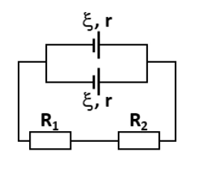{ loading=lazy }

??? success "Đáp án và lời giải"
    **Đáp án:** $2\,\mathrm A$

    **Hướng dẫn giải:**

    Hai nguồn giống nhau mắc song song nên $\xi_b=26\,\mathrm V$, $r_b=r/2=2\,\Omega$.

    $R_N=R_1+R_2=11\,\Omega$.

    $I=\dfrac{\xi_b}{R_N+r_b}=\dfrac{26}{11+2}=2\,\mathrm A$.

#### Bài 13

<!-- source-id: BT-Chuong-IV-p76-q6-234 -->

Cho mạch điện như hình. $\xi=12\,\mathrm V$, $r=0{,}5\,\Omega$, $R_1=R_2=2\,\Omega$, $R_3=R_5=4\,\Omega$, $R_4=6\,\Omega$. Điện trở ampe kế và dây nối không đáng kể. Số chỉ ampe kế bằng bao nhiêu?

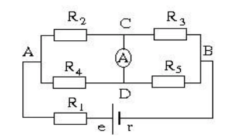{ loading=lazy }

??? success "Đáp án và lời giải"
    **Đáp án:** $0{,}5\,\mathrm A$

    **Hướng dẫn giải:**

    $R_N=R_1+(R_2\parallel R_4)+(R_3\parallel R_5)=2+1{,}5+2=5{,}5\,\Omega$.

    $I=12/(5{,}5+0{,}5)=2\,\mathrm A$.

    $U_{24}=I(R_2\parallel R_4)=3\,\mathrm V$ nên $I_2=3/2=1{,}5\,\mathrm A$.

    $U_{35}=I(R_3\parallel R_5)=4\,\mathrm V$ nên $I_3=4/4=1\,\mathrm A$.

    Theo định luật nút tại điểm nối, $I_A=I_2-I_3=0{,}5\,\mathrm A$.

#### Bài 14

<!-- source-id: BT-Chuong-IV-p86-q3-259 -->

Cho mạch điện như hình, bỏ qua điện trở dây nối. Biết $\xi_1=4\,\mathrm V$, $r_1=0{,}5\,\Omega$, $\xi_2=6\,\mathrm V$, $r_2=0{,}5\,\Omega$; cường độ dòng điện qua mỗi nguồn bằng $2\,\mathrm A$. Điện trở mạch ngoài có giá trị bằng

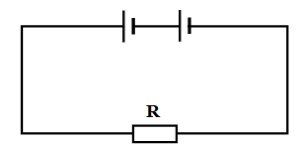{ loading=lazy }

??? success "Đáp án và lời giải"
    **Đáp án sau kiểm tra:** $R=4\,\Omega$.

    **Hướng dẫn giải:**
    Theo sơ đồ, hai nguồn mắc nối tiếp cùng chiều nên $\xi_b=\xi_1+\xi_2=10$ V và $r_b=r_1+r_2=1\,\Omega$.

    Với $I=2$ A, định luật Ôm toàn mạch cho

    $R=\dfrac{\xi_b}{I}-r_b=\dfrac{10}{2}-1=4\,\Omega$.

!!! warning "Đối chiếu nguồn"
    PDF ghi đáp án $2{,}5\,\Omega$, nhưng phần lời giải tự đổi dữ kiện thành $\xi_1=3$ V và $r_1=r_2=1\,\Omega$. Không có cơ sở thay các số đã in trong đề; dùng đúng $\xi_1=4$ V, $r_1=r_2=0{,}5\,\Omega$ cho kết quả duy nhất $4\,\Omega$.

#### Bài 15

<!-- source-id: BT-Chuong-IV-p86-q4-260 -->

Cho mạch điện như hình, bỏ qua điện trở dây nối. Biết $\xi=4\,\mathrm V$, $r=2\,\Omega$, $R_1=1\,\Omega$, $R_2=R_3=2\,\Omega$, $R_4=4\,\Omega$. Tìm số chỉ ampe kế.

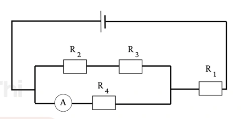{ loading=lazy }

??? success "Đáp án và lời giải"
    **Đáp án:** $0{,}4\,\mathrm A$

    **Hướng dẫn giải:**

    $R_N=R_1+[(R_2+R_3)\parallel R_4]=1+(4\parallel4)=3\,\Omega$.

    $I=4/(3+2)=0{,}8\,\mathrm A$.

    Điện áp trên nhóm song song là $U=0{,}8\cdot2=1{,}6\,\mathrm V$, nên dòng qua $R_4$ và số chỉ ampe kế là $I_A=1{,}6/4=0{,}4\,\mathrm A$.

### Nhận biết — Trắc nghiệm 4 lựa chọn

#### Bài 16

<!-- source-id: BT-Chuong-IV-p62-q1-193 -->

Công của nguồn điện là công của

A. lực lạ trong nguồn.

B. lực điện trường dịch chuyển điện tích ở mạch ngoài.

C. lực cơ học mà dòng điện đó có thể sinh ra.

D. lực dịch chuyển nguồn điện từ vị trí này đến vị trí khác.

??? success "Đáp án và lời giải"
    **Đáp án:** A
    **Hướng dẫn giải:**

    Rút gọn mạch ngoài trước, rồi dùng $I=\mathcal E/(R+r)$ và $U=IR=\mathcal E-Ir$.

    Đối chiếu kết quả với các lựa chọn, phương án phù hợp là **A. lực lạ trong nguồn.**
#### Bài 17

<!-- source-id: BT-Chuong-IV-p65-q25-216 -->

Cho mạch điện như hình, bỏ qua điện trở dây nối và ampe kế, $\xi=3\,\mathrm V$, $r=1\,\Omega$, ampe kế chỉ $0{,}5\,\mathrm A$. Giá trị của $R$ là

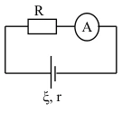{ loading=lazy }

A. $1\,\Omega$.

B. $2\,\Omega$.

C. $5\,\Omega$.

D. $3\,\Omega$.

??? success "Đáp án và lời giải"
    **Đáp án:** C

    **Hướng dẫn giải:**

    $I=\xi/(R+r)$ nên $R=\xi/I-r=3/0{,}5-1=5\,\Omega$.

#### Bài 18

<!-- source-id: BT-Chuong-IV-p79-q9-243 -->

Một nguồn điện gồm 6 ắc-quy giống nhau mắc như hình. Mỗi ắc-quy có $\xi=2\,\mathrm V$, $r=1\,\Omega$. Suất điện động và điện trở trong của bộ nguồn là

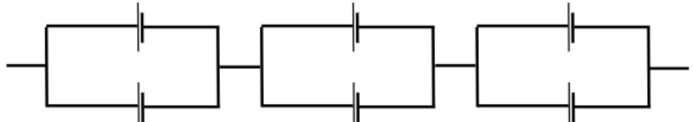{ loading=lazy }

A. $6\,\mathrm V$; $1{,}5\,\Omega$.

B. $6\,\mathrm V$; $3\,\Omega$.

C. $12\,\mathrm V$; $3\,\Omega$.

D. $12\,\mathrm V$; $6\,\Omega$.

??? success "Đáp án và lời giải"
    **Đáp án:** A

    **Hướng dẫn giải:**

    Mỗi nhóm gồm 2 ắc-quy song song nên $\xi_2=2\,\mathrm V$, $r_2=r/2=0{,}5\,\Omega$.

    Ba nhóm đó mắc nối tiếp, vì vậy $\xi_b=3\xi_2=6\,\mathrm V$, $r_b=3r_2=1{,}5\,\Omega$.

#### Bài 19

<!-- source-id: BT-Chuong-IV-p80-q15-249 -->

Cho mạch điện như hình. $R_1=R_2=R_V=9\,\Omega$, $\xi=28\,\mathrm V$, $r=0{,}5\,\Omega$. Bỏ qua điện trở dây nối. Số chỉ vôn kế là

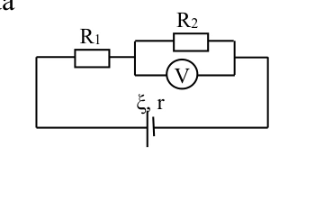{ loading=lazy }

A. $15\,\mathrm V$.

B. $2\,\mathrm V$.

C. $9\,\mathrm V$.

D. $18\,\mathrm V$.

??? success "Đáp án và lời giải"
    **Đáp án:** C

    **Hướng dẫn giải:**

    $R_N=R_1+(R_2\parallel R_V)=9+4{,}5=13{,}5\,\Omega$.

    $I=28/(13{,}5+0{,}5)=2\,\mathrm A$.

    Số chỉ vôn kế bằng điện áp trên nhánh $R_2\parallel R_V$: $U=2\cdot4{,}5=9\,\mathrm V$.

#### Bài 20

<!-- source-id: BT-Chuong-IV-p81-q18-252 -->

Cho mạch điện như hình. Biết $\xi=10\,\mathrm V$, $r=1\,\Omega$, $R_1=5\,\Omega$, $R_2=R_3=10\,\Omega$. Bỏ qua điện trở dây nối. Hiệu điện thế giữa hai đầu $R_1$ là

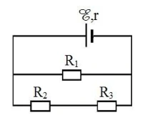{ loading=lazy }

A. $10\,\mathrm V$.

B. $4\,\mathrm V$.

C. $6\,\mathrm V$.

D. $8\,\mathrm V$.

??? success "Đáp án và lời giải"
    **Đáp án:** D

    **Hướng dẫn giải:**

    Theo sơ đồ, $R_1$ song song với $(R_2+R_3)$, nên $R_N=5\parallel20=4\,\Omega$.

    $I=10/(4+1)=2\,\mathrm A$.

    Điện áp mạch ngoài và trên $R_1$ là $U=\xi-Ir=10-2\cdot1=8\,\mathrm V$.

### Nhận biết — Đúng/Sai

#### Bài 21

<!-- source-id: BT-Chuong-IV-p71-q4-226 -->

Cho mạch điện như hình, bỏ qua điện trở dây nối và ampe kế, $\xi=6\,\mathrm V$, $r=1\,\Omega$, $R_1=3\,\Omega$, $R_2=6\,\Omega$, $R_3=2\,\Omega$.

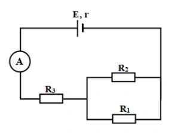{ loading=lazy }

a) Điện trở tương đương của mạch ngoài là $4\,\Omega$.

b) Số chỉ ampe kế là $1{,}5\,\mathrm A$.

c) Hiệu điện thế của $R_3$ là $3\,\mathrm V$.

d) Cường độ dòng điện qua $R_2$ là $0{,}4\,\mathrm A$.

??? success "Đáp án và lời giải"
    **Đáp án:** a) Đúng; b) Sai; c) Sai; d) Đúng.

    **Hướng dẫn giải:**

    $R_{12}=R_1\parallel R_2=2\,\Omega$, $R_N=R_{12}+R_3=4\,\Omega$.

    $I=6/(4+1)=1{,}2\,\mathrm A$.

    a) **Đúng.** $R_N=4\,\Omega$.

    b) **Sai.** Ampe kế chỉ $1{,}2\,\mathrm A$.

    c) **Sai.** $U_3=IR_3=2{,}4\,\mathrm V$.

    d) **Đúng.** $U_{12}=2{,}4\,\mathrm V$ nên $I_2=2{,}4/6=0{,}4\,\mathrm A$.

#### Bài 22

<!-- source-id: BT-Chuong-IV-p72-q6-228 -->

Cho mạch điện như hình. $\xi=48\,\mathrm V$, $r=2\,\Omega$, $R_1=2\,\Omega$, $R_2=8\,\Omega$, $R_3=6\,\Omega$, $R_4=16\,\Omega$. Điện trở dây nối không đáng kể.

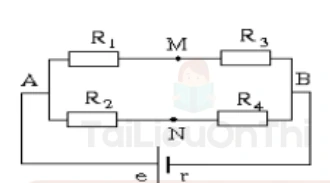{ loading=lazy }

a) Điện trở tương đương mạch ngoài là $8\,\Omega$.

b) Cường độ dòng điện chạy trong mạch là $6\,\mathrm A$.

c) Hiệu điện thế giữa hai điểm $M$ và $N$ là $3\,\mathrm V$.

d) Nếu chập hai điểm $M$ và $N$ thì sơ đồ mạch điện vẫn không đổi.

??? success "Đáp án và lời giải"
    **Đáp án:** a) Sai; b) Đúng; c) Đúng; d) Sai.

    **Hướng dẫn giải:**

    $R_{13}=R_1+R_3=8\,\Omega$, $R_{24}=R_2+R_4=24\,\Omega$, nên $R_N=8\parallel24=6\,\Omega$.

    a) **Sai.** $R_N=6\,\Omega$.

    b) **Đúng.** $I=48/(6+2)=6\,\mathrm A$.

    c) **Đúng.** $U_{AB}=36\,\mathrm V$, nên $I_{13}=4{,}5\,\mathrm A$, $I_{24}=1{,}5\,\mathrm A$; $U_{AM}=9\,\mathrm V$, $U_{AN}=12\,\mathrm V$, suy ra $U_{MN}=3\,\mathrm V$.

    d) **Sai.** Chập $M,N$ làm thay đổi cách ghép các điện trở.

#### Bài 23

<!-- source-id: BT-Chuong-IV-p83-q3-255 -->

Cho mạch điện như hình, bỏ qua điện trở dây nối và ampe kế, $\xi=12\,\mathrm V$, $r=0{,}5\,\Omega$, $R_1=13\,\Omega$, $R_2=35\,\Omega$, $R_3=15\,\Omega$.

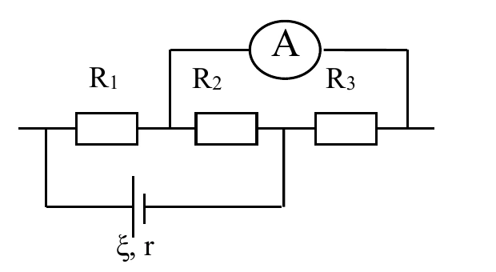{ loading=lazy }

a) Sơ đồ mạch chính là $R_1$ nối tiếp $(R_2\parallel R_3)$.

b) Cường độ dòng điện chạy qua mạch là $0{,}5\,\mathrm A$.

c) Hiệu điện thế chạy qua $R_1$ là $5{,}25\,\mathrm V$.

d) Số chỉ ampe kế là $0{,}74\,\mathrm A$.

??? success "Đáp án và lời giải"
    **Đáp án:** a) Đúng; b) Đúng; c) Sai; d) Sai.

    **Hướng dẫn giải:**

    $R_{23}=35\parallel15=10{,}5\,\Omega$, $R_N=13+10{,}5=23{,}5\,\Omega$.

    a) **Đúng.** Theo sơ đồ tương đương, $R_1$ nối tiếp $(R_2\parallel R_3)$.

    b) **Đúng.** $I=12/(23{,}5+0{,}5)=0{,}5\,\mathrm A$.

    c) **Sai.** $U_1=IR_1=6{,}5\,\mathrm V$; $5{,}25\,\mathrm V$ là điện áp trên nhóm song song.

    d) **Sai.** $I_3=5{,}25/15=0{,}35\,\mathrm A$.

### Thông hiểu — Trắc nghiệm 4 lựa chọn

#### Bài 24

<!-- source-id: BT-Chuong-IV-p64-q16-208 -->

Khi dòng điện chạy qua đoạn mạch ngoài nối giữa hai cực của nguồn điện thì các hạt mang điện chuyển
động có hướng dưới tác dụng của lực

A. cu lông.

B. hấp dẫn.

C. lực lạ.

D. điện trường.

??? success "Đáp án và lời giải"
    **Đáp án:** D
    **Hướng dẫn giải:**

    Rút gọn mạch ngoài trước, rồi dùng $I=\mathcal E/(R+r)$ và $U=IR=\mathcal E-Ir$.

    Đối chiếu kết quả với các lựa chọn, phương án phù hợp là **D. điện trường.**
#### Bài 25

<!-- source-id: BT-Chuong-IV-p64-q18-210 -->

Với mạch kín gồm nguồn có suất điện động $\xi$, điện trở trong $r$, nối với mạch ngoài có điện trở $R$, hiệu điện thế giữa hai cực nguồn **không thể** tính bằng

A. $U=IR$.

B. $U=\dfrac{\xi R}{R+r}$.

C. $U=\xi-Ir$.

D. $U=\dfrac{\xi R}{R-r}$.

??? success "Đáp án và lời giải"
    **Đáp án:** D

    **Hướng dẫn giải:**

    $I=\xi/(R+r)$ nên $U=IR=\xi R/(R+r)=\xi-Ir$. Biểu thức ở D không đúng.

### Vận dụng — Trắc nghiệm 4 lựa chọn

#### Bài 26

<!-- source-id: BT-Chuong-IV-p65-q26-217 -->

Một nguồn điện có điện trở trong $1\,\Omega$ được mắc với điện trở $R=6\,\Omega$ thành mạch kín. Hiệu điện thế giữa hai cực nguồn là $12\,\mathrm V$. Suất điện động của nguồn là

A. $\xi=12\,\mathrm V$.

B. $\xi=13\,\mathrm V$.

C. $\xi=14\,\mathrm V$.

D. $\xi=15\,\mathrm V$.

??? success "Đáp án và lời giải"
    **Đáp án:** C

    **Hướng dẫn giải:**

    $I=U/R=12/6=2\,\mathrm A$.

    $\xi=I(R+r)=2(6+1)=14\,\mathrm V$.

#### Bài 27

<!-- source-id: BT-Chuong-IV-p66-q27-218 -->

Một mạch có các nguồn giống nhau $(\xi=3\,\mathrm V;\ r=0{,}3\,\Omega)$ mắc như hình. Suất điện động và điện trở trong của bộ nguồn là

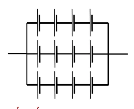{ loading=lazy }

A. $\xi_b=3\,\mathrm V$; $r_b=0{,}4\,\Omega$.

B. $\xi_b=12\,\mathrm V$; $r_b=0{,}1\,\Omega$.

C. $\xi_b=12\,\mathrm V$; $r_b=0{,}4\,\Omega$.

D. $\xi_b=3\,\mathrm V$; $r_b=0{,}1\,\Omega$.

??? success "Đáp án và lời giải"
    **Đáp án:** C

    **Hướng dẫn giải:**

    Bộ nguồn có 3 dãy song song, mỗi dãy 4 nguồn nối tiếp.

    $\xi_b=4\xi=12\,\mathrm V$,

    $r_b=4r/3=0{,}4\,\Omega$.

#### Bài 28

<!-- source-id: BT-Chuong-IV-p66-q28-219 -->

Cho mạch điện như hình. $R_1=R_2=R_V=10\,\Omega$, $\xi=2\,\mathrm V$, $r=1\,\Omega$. Bỏ qua điện trở dây nối. Số chỉ vôn kế là

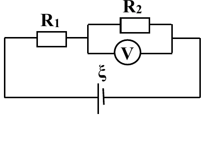{ loading=lazy }

A. $0{,}55\,\mathrm V$.

B. $1{,}00\,\mathrm V$.

C. $0{,}80\,\mathrm V$.

D. $0{,}63\,\mathrm V$.

??? success "Đáp án và lời giải"
    **Đáp án:** D

    **Hướng dẫn giải:**

    $R_N=R_1+(R_2\parallel R_V)=10+5=15\,\Omega$.

    $I=2/(15+1)=0{,}125\,\mathrm A$.

    Điện áp trên nhánh song song là $U=I(R_2\parallel R_V)=0{,}125\cdot5=0{,}625\,\mathrm V\approx0{,}63\,\mathrm V$.

#### Bài 29

<!-- source-id: BT-Chuong-IV-p66-q29-220 -->

Cho sơ đồ mạch điện như hình. $\xi=1{,}2\,\mathrm V$, $r=0{,}5\,\Omega$, $R_1=R_3=2\,\Omega$, $R_2=R_4=4\,\Omega$. Hiệu điện thế giữa hai điểm $A,B$ là

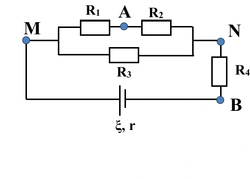{ loading=lazy }

A. $1{,}0\,\mathrm V$.

B. $0{,}2\,\mathrm V$.

C. $0{,}8\,\mathrm V$.

D. $0{,}6\,\mathrm V$.

??? success "Đáp án và lời giải"
    **Đáp án:** **A. $1{,}0\,\mathrm V$**.

    **Hướng dẫn giải:**

    $R_{12}=R_1+R_2=6\,\Omega$, $R_{123}=R_{12}\parallel R_3=1{,}5\,\Omega$, nên $R_N=R_{123}+R_4=5{,}5\,\Omega$.

    $I=1{,}2/(5{,}5+0{,}5)=0{,}20\,\mathrm A$.

    $U_{NB}=IR_4=0{,}80\,\mathrm V$; điện áp trên nhóm $R_{12}\parallel R_3$ là $0{,}30\,\mathrm V$, nên $I_{12}=0{,}30/6=0{,}05\,\mathrm A$ và $U_{AN}=I_{12}R_2=0{,}20\,\mathrm V$.

    Do đó $U_{AB}=U_{AN}+U_{NB}=1{,}00\,\mathrm V$.

    !!! note "Đối chiếu nguồn"
        Lời giải PDF có hai lỗi gõ ở bước giữa: ghi $R_{123}\parallel R_4$ dù sơ đồ và phép tính cho thấy chúng nối tiếp, đồng thời xuất hiện $I=0{,}15\,\mathrm A$ rồi các bước sau lại dùng đúng $0{,}20\,\mathrm A$. Phần giải trên giữ đúng sơ đồ và dữ kiện đề.

#### Bài 30

<!-- source-id: BT-Chuong-IV-p68-q31-222 -->

Cho mạch điện như hình, bỏ qua điện trở dây nối và ampe kế, $\xi=15\,\mathrm V$, $r=1\,\Omega$, $R_1=12\,\Omega$, $R_2=36\,\Omega$, $R_3=15\,\Omega$. Số chỉ ampe kế là

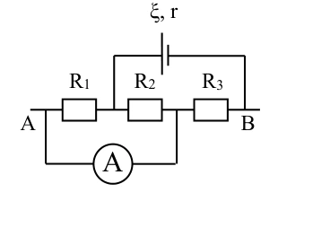{ loading=lazy }

A. $0{,}45\,\mathrm A$.

B. $0{,}65\,\mathrm A$.

C. $0{,}75\,\mathrm A$.

D. $1{,}00\,\mathrm A$.

??? success "Đáp án và lời giải"
    **Đáp án:** A

    **Hướng dẫn giải:**

    $(R_1\parallel R_2)$ nối tiếp $R_3$, nên

    $R_N=12\parallel36+15=9+15=24\,\Omega$.

    $I=15/(24+1)=0{,}6\,\mathrm A$.

    Điện áp trên $R_1\parallel R_2$ là $U=0{,}6\cdot9=5{,}4\,\mathrm V$.

    Số chỉ ampe kế bằng dòng qua $R_1$: $I_A=5{,}4/12=0{,}45\,\mathrm A$.

