# Bài tập — Bài 5 — Định luật Ohm cho toàn mạch

> Hệ bài tập được biên soạn theo các dạng xuất hiện trong bộ tài liệu Vật lí 11 của dự án. Câu hỏi được giữ ngắn, trực tiếp; độ khó tăng dần và không cố tình thêm dữ kiện gây nhiễu.

[← Trở lại bài học](../../05-full-circuit-ohm-law.md)

## Phần A — Trắc nghiệm 4 lựa chọn

### Câu 1 — Mức 1 — Nhận biết

Mạch kín gồm nguồn $\mathcal E=12$ V, $r=1\,\Omega$ và điện trở ngoài $R=5\,\Omega$. Dòng điện là

A. $1$ A.  
B. $2$ A.  
C. $2,4$ A.  
D. $12$ A.

### Câu 2 — Mức 1 — Nhận biết

Hiệu suất của nguồn trong mạch đơn R nối tiếp r có thể viết

A. $H=R/(R+r)$.  
B. $H=r/(R+r)$.  
C. $H=(R+r)/R$.  
D. $H=Rr$.

### Câu 3 — Mức 1 — Nhận biết

Dòng ngắn mạch của nguồn là

A. $I_{sc}=\mathcal E/R$.  
B. $I_{sc}=\mathcal E/r$.  
C. $I_{sc}=r/\mathcal E$.  
D. 0.

### Câu 4 — Mức 1 — Nhận biết

Trong mạch đơn, công suất mạch ngoài đạt cực đại khi

A. $R=0$.  
B. $R=r$.  
C. $R=2r$.  
D. $R\to\infty$.

## Phần B — Đúng/Sai

### Câu 5 — Mức 2 — Thông hiểu

Định luật Ohm toàn mạch:

a) $I=\mathcal E/(R+r)$.  
b) $U_R=IR=\mathcal E-Ir$.  
c) Tăng R luôn làm I tăng.  
d) Khi R rất lớn, I tiến về 0 và U hai cực tiến gần $\mathcal E$.

### Câu 6 — Mức 2 — Thông hiểu

Công suất mạch ngoài $P_R=\mathcal E^2R/(R+r)^2$:

a) Bằng 0 khi R=0.  
b) Tiến về 0 khi R rất lớn.  
c) Có cực đại tại R=r.  
d) Tại cực đại, hiệu suất nguồn là 100%.

## Phần C — Trả lời ngắn

### Câu 7 — Mức 3 — Vận dụng

Nguồn $9$ V, $r=1\,\Omega$ nối với $R=8\,\Omega$. Tính I, U ngoài và hiệu suất.

### Câu 8 — Mức 3 — Vận dụng

Nguồn có $\mathcal E=6$ V, r chưa biết. Mắc R=$5\,\Omega$ thì I=$1$ A. Tính r.

### Câu 9 — Mức 3 — Vận dụng

Nguồn $12$ V, $r=3\,\Omega$. Tìm R để công suất mạch ngoài cực đại và giá trị cực đại.

## Phần D — Vận dụng và vận dụng cao

### Câu 10 — Mức 4 — Vận dụng cao

Nguồn có $\mathcal E=10$ V, $r=1\,\Omega$. Mạch ngoài là biến trở R. Tìm hai giá trị R để công suất trên R bằng $16$ W.

---

[Đáp án và lời giải →](solutions.md)

## Ngân hàng bài tập PDF mở rộng

> Nội dung câu hỏi và dữ kiện trong phần này được giữ nguyên; hệ thống chỉ chuẩn hóa xuống dòng và mã kí tự để hiển thị trên web. Câu trùng được loại bỏ. Với câu có công thức/kí hiệu bị sai khi trích xuất chữ từ PDF, đề bài được giữ dưới dạng ảnh để không làm thay đổi dữ kiện.

### Nhận biết — Trả lời ngắn

#### Bài PDF 1

<!-- source-id: BT-Chuong-IV-p74-q2-230 -->

Câu 2. Một mạch điện gồm một pin 11 V, điện trở mạch ngoài 3 Ω, cường độ dòng điện trong toàn mạch là 2
A. Xác định giá trị điện trở trong của nguồn.

#### Bài PDF 2

<!-- source-id: BT-Chuong-IV-p74-q4-232 -->

Câu 4. Cho mạch điện như hình bên. Trong đó ξ = 26 V; r = 4 Ω; R1 = 5 Ω; R2 = 6 Ω .
Tính cường độ dòng điện chạy trong mạch.

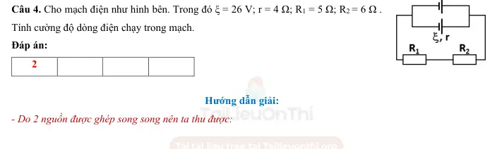{ loading=lazy }

#### Bài PDF 3

<!-- source-id: BT-Chuong-IV-p76-q6-234 -->

Câu 6. Cho mạch điện như hình vẽ. Trong đó ξ = 12 V, r = 0,5 Ω, R1 = R2
= 2 Ω, R3 = R5 = 4 Ω, R4 = 6 Ω. Điện trở của ampe kế và của các dây nối
không đáng kể. Số chỉ của ampe kế có giá trị bằng bao nhiêu?

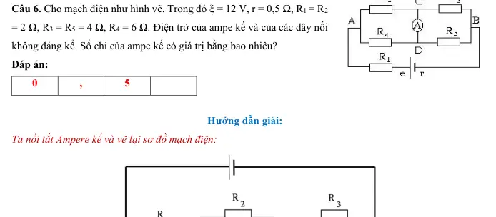{ loading=lazy }

#### Bài PDF 4

<!-- source-id: BT-Chuong-IV-p86-q3-259 -->

Câu 3. Cho mạch điện như hình, bỏ qua điện trở của dây nối, biết ξ 1 = 4 V;
r1 = 0,5 Ω; ξ 2 = 6 V; r2 = 0,5 Ω; cường độ dòng điện qua mỗi nguồn bằng 2 A.
Điện trở mạch ngoài có giá trị bằng

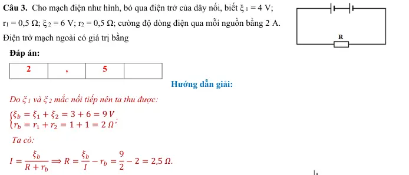{ loading=lazy }

#### Bài PDF 5

<!-- source-id: BT-Chuong-IV-p86-q4-260 -->

Câu 4. Cho mạch điện như hình vẽ, bỏ qua điện trở của dây nối.
Biết ξ = 4 V; r = 2 Ω. Biết R1 = 1 Ω; R2 = R3 = 2 Ω; R4 = 4 Ω. Tìm
số chỉ Ampere kế.

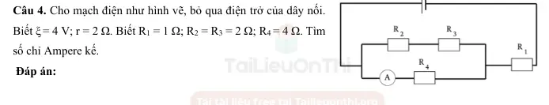{ loading=lazy }

### Nhận biết — Trắc nghiệm 4 lựa chọn

#### Bài PDF 6

<!-- source-id: BT-Chuong-IV-p62-q1-193 -->

Câu 1. Công của nguồn điện là công của
A. lực lạ trong nguồn.
B. lực điện trường dịch chuyển điện tích ở mạch ngoài.
C. lực cơ học mà dòng điện đó có thể sinh ra.
D. lực dịch chuyển nguồn điện từ vị trí này đến vị trí khác.

#### Bài PDF 7

<!-- source-id: BT-Chuong-IV-p65-q25-216 -->

Câu 25. Cho mạch điện như hình vẽ, bỏ qua các điện trở dây nối và ampe kế, ξ = 3V, r = 1Ω,
Ampere kế chỉ 0,5A. Giá trị của điện trở R là

 A.  1 Ω.
B. 2 Ω.
C. 5 Ω.
D. 3 Ω.

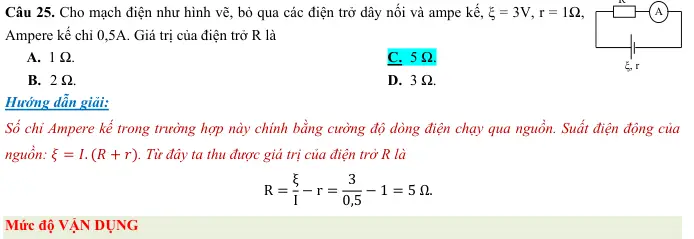{ loading=lazy }

#### Bài PDF 8

<!-- source-id: BT-Chuong-IV-p79-q9-243 -->

Câu 9. Một nguồn điện gồm 6 Ắc – quy giống nhau mắc như hình vẽ. Mỗi acquy có suất điện động ξ = 2V,
r = 1Ω. Suất điện động và điện trở trong của bộ nguồn này là

A. 6 V; 1,5 Ω.
B. 6 V; 3 Ω.
C. 12 V; 3 Ω.
D. 12 V; 6 Ω.

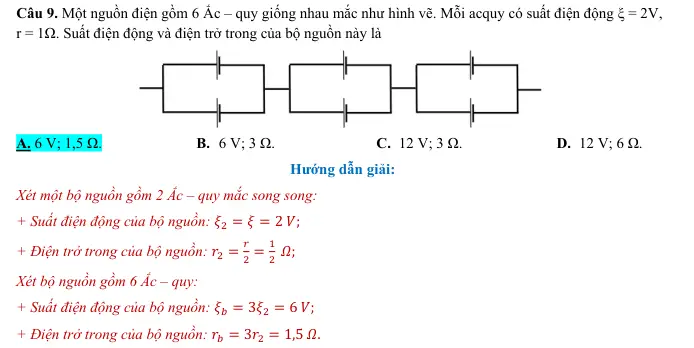{ loading=lazy }

#### Bài PDF 9

<!-- source-id: BT-Chuong-IV-p80-q15-249 -->

Câu 15. Cho mạch điện như hình vẽ. R1 = R2 = RV = 9 Ω, ξ = 28 V, r = 0,5 Ω. Bỏ qua
điện trở dây nối, số chỉ vôn kế là

 A.  15 V.
B. 2 V.
C. 9 V.
D. 18 V.

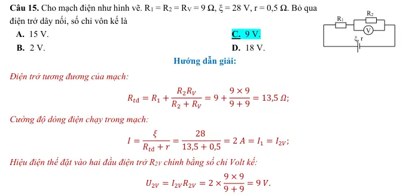{ loading=lazy }

#### Bài PDF 10

<!-- source-id: BT-Chuong-IV-p81-q18-252 -->

Câu 18. Cho mạch điện như hình bên. Biết ξ = 10 V; r = 1 Ω; R1 = 5  Ω; R2 = R3  = 10 Ω.
Bỏ qua điện trở của dây nối. Hiệu điện thế giữa hai đầu R1 là
   A.  10 V.
B. 4 V.
C. 6 V.
D. 8 V.

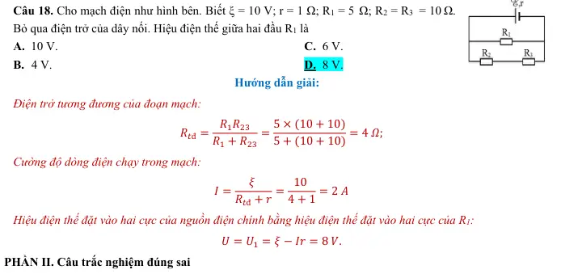{ loading=lazy }

### Nhận biết — Đúng/Sai

#### Bài PDF 11

<!-- source-id: BT-Chuong-IV-p71-q4-226 -->

Câu 4. Cho mạch điện như hình vẽ, bỏ qua điện trở của dây nối và Ampre kế, ξ = 6V, r = 1Ω, R1 = 3Ω, R2 = 6Ω,
R3 = 2Ω.

Phát biểu
Đúng
Sai
a
Điện trở tương đương của mạch ngoài là 4 Ω.
Đ

b
Số chỉ Ampere kế trong trường hợp này là 1,5 A.

S
c
Hiệu điện thế của R3 là 3 V.

S
d
Cường độ dòng điện chạy qua R2 là 0,4 A.
Đ

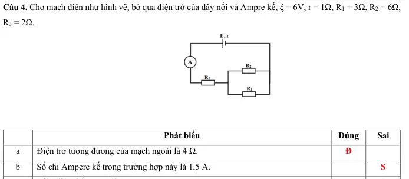{ loading=lazy }

#### Bài PDF 12

<!-- source-id: BT-Chuong-IV-p72-q6-228 -->

Câu 6. Cho mạch điện như hình vẽ. Trong đó ξ = 48 V, r = 2 Ω, R1= 2 Ω, R2 = 8 Ω, R3 = 6 Ω, R4 = 16 Ω. Điện
trở của các dây nối không đáng kể.

Phát biểu
Đúng
Sai
a
Điện trở tương đương trong trường hợp này là 8 Ω.

S
b
Cường độ dòng điện chạy trong mạch là 6 A.
Đ

c
Hiệu điện thế giữa hai điểm M và N là 3 V.
Đ

d
Nếu chập hai điểm M và N thì sơ đồ mạch điện vẫn không đổi.

S

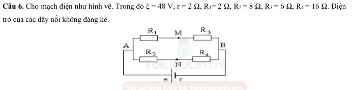{ loading=lazy }

#### Bài PDF 13

<!-- source-id: BT-Chuong-IV-p83-q3-255 -->

Câu 3. Cho mạch điện như hình. Bỏ qua điện trở của dây nối và Ampere kế,
ξ = 12 V, r = 0,5 Ω, R1 = 13 Ω, R2 = 35 Ω, R3 = 15 Ω.

Phát biểu
Đúng
Sai
a
Sơ đồ mạch chính là R1 nt (R2//R3).
Đ

b
Cường độ dòng điện chạy qua mạch là 0,5 A.
Đ

c
Hiệu điện thế chạy qua R1 là 5,25 V.

S
d
Số chỉ Ampere kế là 0,74 A

S

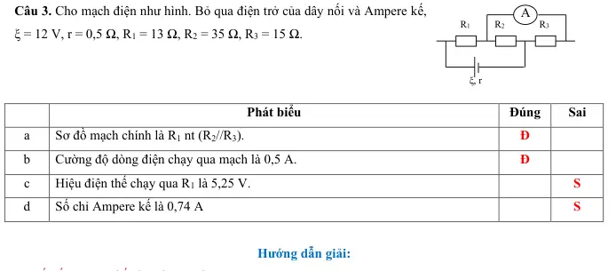{ loading=lazy }

### Thông hiểu — Trắc nghiệm 4 lựa chọn

#### Bài PDF 14

<!-- source-id: BT-Chuong-IV-p64-q16-208 -->

Câu 16. Khi dòng điện chạy qua đoạn mạch ngoài nối giữa hai cực của nguồn điện thì các hạt mang điện chuyển
động có hướng dưới tác dụng của lực
      A. cu lông.
B. hấp dẫn.
C. lực lạ.
D. điện trường.

#### Bài PDF 15

<!-- source-id: BT-Chuong-IV-p64-q18-210 -->

Câu 18. Với mạch kín gồm nguồn có suất điện động ξ, điện trở trong r nối mạch ngoài có điện trở R, thì hiệu
điện thế giữa 2 cực nguồn điện không thể tính bằng
A. U = I. R.
B. U =
ξ R
(R+r).
C. U = ξ −Ir.
D. U =
ξ R
(R−r).

### Vận dụng — Trắc nghiệm 4 lựa chọn

#### Bài PDF 16

<!-- source-id: BT-Chuong-IV-p65-q26-217 -->

Câu 26. Một nguồn điện có điện trở trong 1 Ω được mắc với điện trở R = 6 Ω thành mạch kín. Khi đó hiệu điện
thế giữa hai cực của nguồn điện là 12 V. Suất điện động của nguồn điện là

A. ξ = 12V.
B. ξ = 13V.
C. ξ = 14V.
D. ξ = 15V.

#### Bài PDF 17

<!-- source-id: BT-Chuong-IV-p66-q27-218 -->

Câu 27. Một mạch có các nguồn giống nhau (ξ = 3V; r = 0,3 Ω) được mắc như hình. Suất
điện động và điện trở trong của bộ nguồn là

A.  ξ𝑏= 3 V; ξ𝑏= 0,4 Ω.
B. ξ𝑏= 12 V; ξ𝑏= 0,1 Ω.
C. ξ𝑏= 12 V; ξ𝑏= 0,4 Ω.
D. ξ𝑏= 3 V; ξ𝑏= 0,1 Ω.

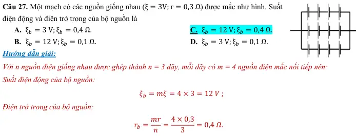{ loading=lazy }

#### Bài PDF 18

<!-- source-id: BT-Chuong-IV-p66-q28-219 -->

Câu 28. Cho mạch điện như hình vẽ. R1 = R2 = RV = 10 Ω, ξ = 2 V, r = 1 Ω. Bỏ qua điện
trở dây nối, số chỉ Volt kế là
      A.   0,55 V.
B. 1,00 V.
C. 0, 80 V.
D. 0,63 V.

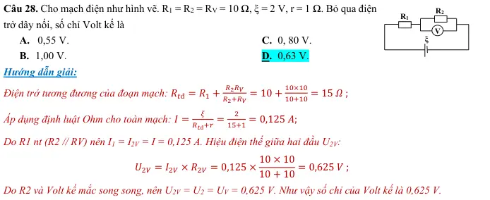{ loading=lazy }

#### Bài PDF 19

<!-- source-id: BT-Chuong-IV-p66-q29-220 -->

Câu 29. Cho sơ đồ mạch điện như hình bên. Trong đó ξ = 1,2 V, r = 0,5 Ω, R1 = R3 =
2Ω, R2 = R4 = 4 Ω. Hiệu điện thế giữa hai điểm A, B là
A. 1,0 V.
B. 0,2 V.
C. 0,8 V.
D. 0, 6 V.

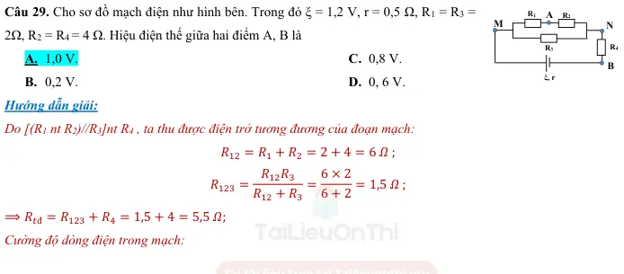{ loading=lazy }

#### Bài PDF 20

<!-- source-id: BT-Chuong-IV-p68-q31-222 -->

Câu 31. Cho mạch điện như hình. Bỏ qua điện trở của dây nối và Ampere kế, ξ = 15
V, r = 1 Ω, R1 = 12 Ω, R2 = 36 Ω, R3 = 15 Ω. Số chỉ Ampere kế là

 A.  0,45 A.
B. 0,65 A.
C. 0,75 A.
D. 1,00 A.

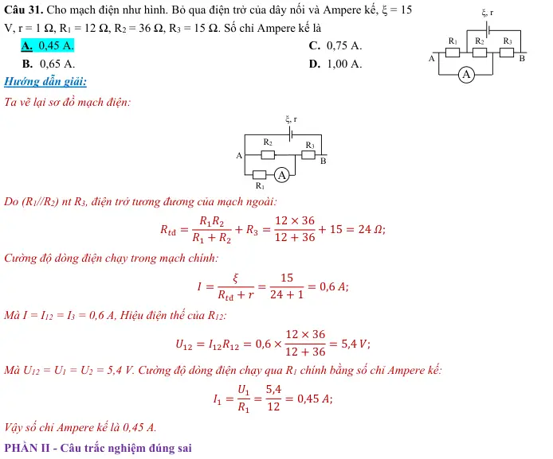{ loading=lazy }

