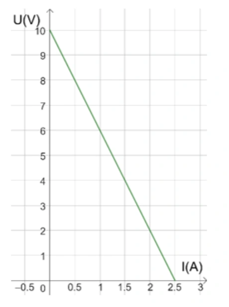
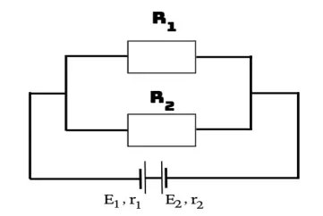

# Bài tập — Bài 6 — Ghép nguồn thành bộ

> Hệ bài tập được biên soạn theo các dạng xuất hiện trong bộ tài liệu Vật lí 11 của dự án. Câu hỏi được giữ ngắn, trực tiếp; độ khó tăng dần và không cố tình thêm dữ kiện gây nhiễu.

[← Trở lại bài học](../../06-source-combinations.md)

## Phần A — Trắc nghiệm 4 lựa chọn

### Bài 1 — Mức 1 — Nhận biết

Ba nguồn giống nhau, mỗi nguồn có suất điện động E và điện trở trong r, ghép nối tiếp cùng chiều. Bộ nguồn có

A. $\mathcal E_b=E$, $r_b=3r$.
B. $\mathcal E_b=3E$, $r_b=3r$.
C. $\mathcal E_b=3E$, $r_b=r/3$.
D. $\mathcal E_b=E/3$, $r_b=r/3$.

??? success "Đáp án và lời giải"
    Chọn **B**.

### Bài 2 — Mức 1 — Nhận biết

Ba nguồn giống nhau ghép song song đúng cực. Bộ nguồn có

A. $\mathcal E_b=E$, $r_b=r/3$.
B. $\mathcal E_b=3E$, $r_b=r/3$.
C. $\mathcal E_b=E/3$, $r_b=3r$.
D. $\mathcal E_b=3E$, $r_b=3r$.

??? success "Đáp án và lời giải"
    Chọn **A**.

### Bài 3 — Mức 1 — Nhận biết

Ghép nối tiếp nguồn giống nhau phù hợp khi cần

A. tăng suất điện động bộ.
B. giữ suất điện động bằng một nguồn và giảm điện trở trong.
C. làm suất điện động bằng 0 trong mọi trường hợp.
D. chỉ để trang trí mạch.

??? success "Đáp án và lời giải"
    Chọn **A**.

### Bài 4 — Mức 1 — Nhận biết

Ghép song song các nguồn giống nhau đúng cực thường nhằm

A. tăng suất điện động lên n lần.
B. giảm điện trở trong tương đương.
C. đảo cực mọi nguồn.
D. làm r tăng n lần.

??? success "Đáp án và lời giải"
    Chọn **B**.

## Phần B — Đúng/Sai

### Bài 5 — Mức 2 — Thông hiểu

Với n nguồn giống nhau:

a) Nối tiếp: $\mathcal E_b=n\mathcal E$, $r_b=nr$.
b) Song song: $\mathcal E_b=\mathcal E$, $r_b=r/n$.
c) Ghép song song tùy ý các nguồn có suất điện động rất khác nhau luôn an toàn.
d) Khi thiết kế bộ hỗn hợp đối xứng cần xét cả suất điện động và điện trở trong.

??? success "Đáp án và lời giải"
    a) **Đúng**.
    b) **Đúng**.
    c) **Sai**: có thể xuất hiện dòng tuần hoàn lớn giữa nguồn.
    d) **Đúng**.

### Bài 6 — Mức 2 — Thông hiểu

Bộ gồm m nhánh song song, mỗi nhánh có n nguồn giống nhau mắc nối tiếp:

a) Tổng số nguồn N=mn.
b) Suất điện động mỗi nhánh là $n\mathcal E$.
c) Điện trở trong bộ là $nr/m$.
d) Suất điện động bộ là $m\mathcal E$.

??? success "Đáp án và lời giải"
    a) **Đúng**.
    b) **Đúng**.
    c) **Đúng**.
    d) **Sai**: các nhánh song song cùng suất điện động $n\mathcal E$, nên suất điện động bộ bằng $n\mathcal E$.

## Phần C — Trả lời ngắn

### Bài 7 — Mức 3 — Vận dụng

Bốn pin giống nhau, mỗi pin $1,5$ V, $r=0,5\,\Omega$, ghép nối tiếp. Tính $\mathcal E_b$, $r_b$.

??? success "Đáp án và lời giải"
    $\mathcal E_b=4\cdot1,5=6$ V; $r_b=4\cdot0,5=2\,\Omega$.

### Bài 8 — Mức 3 — Vận dụng

Bốn pin giống nhau như trên ghép song song. Tính $\mathcal E_b$, $r_b$.

??? success "Đáp án và lời giải"
    $\mathcal E_b=1,5$ V; $r_b=0,5/4=0,125\,\Omega$.

### Bài 9 — Mức 3 — Vận dụng

Sáu nguồn giống nhau $\mathcal E=2$ V, $r=1\,\Omega$ ghép thành 2 nhánh song song, mỗi nhánh 3 nguồn nối tiếp. Tính bộ nguồn.

??? success "Đáp án và lời giải"
    Mỗi nhánh: $\mathcal E_n=3\cdot2=6$ V, $r_n=3\,\Omega$. Hai nhánh song song giống nhau: $\mathcal E_b=6$ V, $r_b=3/2=1,5\,\Omega$.

## Phần D — Vận dụng và vận dụng cao

### Bài 10 — Mức 4 — Vận dụng cao

Có 12 nguồn giống nhau, mỗi nguồn $\mathcal E=1,5$ V, $r=0,5\,\Omega$. Ghép thành m nhánh song song giống nhau, mỗi nhánh n nguồn nối tiếp, mn=12. Mạch ngoài R=$2\,\Omega$. So sánh dòng mạch chính cho các phương án n=1,2,3,4,6,12 và chọn phương án lớn nhất.

??? success "Đáp án và lời giải"
    Với cấu hình n nguồn nối tiếp mỗi nhánh và m=12/n nhánh song song:

    $\mathcal E_b=1,5n$, $r_b=nr/m=n^2r/12=n^2/24\,\Omega$.

    $I=\frac{1,5n}{2+n^2/24}$.

    Tính nhanh:

    - n=1: $I\approx0,735$ A.
    - n=2: $I\approx1,385$ A.
    - n=3: $I\approx1,895$ A.
    - n=4: $I=6/(2+2/3)=2,25$ A.
    - n=6: $I=9/(2+1,5)=2,571$ A.
    - n=12: $I=18/(2+6)=2,25$ A.

    Trong các phương án nguyên cho trước, **n=6, m=2** cho dòng lớn nhất. Kết quả phù hợp nguyên tắc tối ưu khi điện trở trong bộ gần điện trở ngoài.

## Ngân hàng bài tập mở rộng

> Các bài dưới đây được đánh số nối tiếp phần bài tập phía trên. Đề bài được trình bày bằng Markdown; chỉ đồ thị, hình vẽ hoặc sơ đồ thực sự cần thiết mới được giữ dưới dạng hình. Đáp án và lời giải được đặt trong nút mở rộng ngay dưới từng bài.

### Nhận biết — Trả lời ngắn

#### Bài 11

<!-- source-id: BT-Chuong-IV-p74-q3-231 -->

Nếu ghép 3 pin giống nhau nối tiếp thu được bộ nguồn 7,5 V và 3 Ω thì khi mắc 3 pin đó song song thu
được bộ nguồn có suất điện động là bao nhiêu?

??? success "Đáp án và lời giải"
    **Đáp án:** $7{,}5$

    **Hướng dẫn giải:**
    Do 3 pin giống nhau được ghép song song. Nên giá trị suất điện động của bộ nguồn chính bằng giá trị của từng
    pin. Tức là 𝜉𝑏= 𝜉= 7,5 𝑉.

#### Bài 12

<!-- source-id: BT-Chuong-IV-p87-q6-262 -->

Trong việc thiết kế mạch điện, để có được các suất điện động thích hợp. Xét bốn pin giống nhau mắc
nối tiếp thành một bộ nguồn, rồi mắc hai đầu một biến trở vào hai đầu bộ nguồn thành một mạch kín. Đồ thị
biểu diễn sự phụ thuộc của điện áp hai đầu bộ nguồn U và cường độ dòng điện I trong mạch như hình. Tìm điện
trở trong của mỗi pin.

{ loading=lazy }

??? success "Đáp án và lời giải"
    **Đáp án:** 1

    **Hướng dẫn giải:**
    Do các bộ nguồn được ghép nối tiếp nên ta thu được:
    𝜉𝑏= 𝐼(𝑅+ 𝑟𝑏) = 𝑈+ 𝐼𝑟𝑏
    ⟹𝑈= 𝜉𝑏−𝐼𝑟𝑏 ;
    Từ đồ thị ta thấy được hai điểm (I, U) có tọa độ: (0;10) và (2,5;0). Ta thu được hệ phương trình:
    {10 = 𝜉𝑏−0𝑟𝑏
    0 = 𝜉𝑏−2,5𝑟𝑏;
    Giải hệ phương trình, ta thu được: {𝜉𝑏= 10 𝑉
    𝑟𝑏= 4 𝛺.
    𝑟𝑏
    4 = 1 𝛺.

    Chủ đề 24: NĂNG LƯỢNG VÀ CÔNG SUẤT ĐIỆN

    • Yêu cầu cần đạt (Trích từ CTGDPT Vật lí 2018):
    – Nêu được năng lượng điện tiêu thụ của đoạn mạch được đo bằng công của lực điện thực hiện khi
    dịch chuyển các điện tích; công suất tiêu thụ năng lượng điện của một đoạn mạch là năng lượng
    điện mà đoạn mạch tiêu thụ trong một đơn vị thời gian.
    – Tính được năng lượng điện và công suất tiêu thụ năng lượng điện của đoạn mạch.
    • Cấu trúc nội dung:
    I. TÓM TẮT LÝ THUYẾT …………………………………………………………………
    Lý thuyết chung của chủ đề + Phương pháp giải kèm ví dụ.
    II. BÀI TẬP PHÂN DẠNG THEO MỨC ĐỘ………………………………………………..
     (Theo cấu trúc định dạng đề thi kỳ thi tốt nghiệp trung học phổ thông từ năm 2025 – Quyết định số
    764/QĐ - BGDĐT)
    1. Câu trắc nhiệm nhiều phương án lựa chọn
    2. Câu trắc nghiệm đúng sai:
    3. Câu trắc nghiệm trả lời ngắn :

### Nhận biết — Trắc nghiệm 4 lựa chọn

#### Bài 13

<!-- source-id: BT-Chuong-IV-p62-q7-199 -->

Một mạch điện có n nguồn điện giống nhau (ξ0; r0) mắc nối tiếp. Suất điện động và điện trở trong bộ
nguồn tính theo công thức

A. ξb = n.ξ0 ; rb = r0/n.

B. ξb = ξ0 ; rb = n.r0.

C. ξb = n.ξ0 ; rb = n.r0.

D. ξb = ξ0 ; rb = r0/n.

??? success "Đáp án và lời giải"
    **Đáp án:** C
    **Hướng dẫn giải:**

    Tính suất điện động bộ và điện trở trong bộ theo đúng cách ghép nguồn, sau đó áp dụng định luật Ohm cho toàn mạch.

    Đối chiếu kết quả với các lựa chọn, phương án phù hợp là **C. ξb = n.ξ0 ; rb = n.r0.**
#### Bài 14

<!-- source-id: BT-Chuong-IV-p79-q10-244 -->

Một nguồn điện với suất điện động ξ , điện trở trong r, mắc với một điện trở ngoài R = r thì cường độ
dòng điện chạy trong mạch là I. Nếu thay nguồn điện đó bằng 3 nguồn điện giống hệt nó mắc nối tiếp thì cường
độ dòng điện trong mạch

A. bằng 3I.

B. bằng 2I.

C. bằng 1,5I.

D. bằng 2,5I.

??? success "Đáp án và lời giải"
    **Đáp án:** C
    **Hướng dẫn giải:**

    Tính suất điện động bộ và điện trở trong bộ theo đúng cách ghép nguồn, sau đó áp dụng định luật Ohm cho toàn mạch.

    Đối chiếu kết quả với các lựa chọn, phương án phù hợp là **C. bằng 1,5I.**
#### Bài 15

<!-- source-id: BT-Chuong-IV-p79-q11-245 -->

Muốn ghép 3 pin giống nhau mỗi pin có suất điện động 3 V thành bộ nguồn 9 V thì

A. phải ghép 2 pin song song và nối tiếp với pin còn lại.

B. ghép 3 pin song song.

C. ghép 3 pin nối tiếp.

D. không ghép được.

??? success "Đáp án và lời giải"
    **Đáp án:** C
    **Hướng dẫn giải:**
    Với các nguồn giống nhau khi mắc nối tiếp thì suất điện động của bộ nguồn: 𝜉𝑏= 𝑛𝜉= 3 × 3 = 9 𝑉.

#### Bài 16

<!-- source-id: BT-Chuong-IV-p80-q14-248 -->

Có n nguồn điện giống nhau (ξ0; r0) mắc song song. Suất điện động và điện trở trong bộ nguồn tính
theo công thức

A. ξb = n. ξ0 ; rb = r0/n.

B. ξb = ξ0 ; rb = n.r0.

C. ξb = n. ξ0 ; rb = n.r.

D. ξb = ξ0 ; rb = r0/n.

??? success "Đáp án và lời giải"
    **Đáp án:** D
    **Hướng dẫn giải:**

    Tính suất điện động bộ và điện trở trong bộ theo đúng cách ghép nguồn, sau đó áp dụng định luật Ohm cho toàn mạch.

    Đối chiếu kết quả với các lựa chọn, phương án phù hợp là **D. ξb = ξ0 ; rb = r0/n.**
#### Bài 17

<!-- source-id: BT-Chuong-IV-p80-q16-250 -->

Có một số nguồn giống nhau mắc nối tiếp vào mạch mạch ngoài có điện trở R = 10 Ω. Nếu dùng 6
nguồn này thì cường độ dòng điện trong mạch là 3A. Nếu dùng 12 nguồn thì cường độ dòng điện trong mạch
là 5A. Tính suất điện động và điện trở trong của mỗi nguồn.

A. ξ = 6,25V, r = 5/12 Ω.

B. ξ = 6,25V, r = 1,2 Ω.

C. ξ = 12,5 V, r = 5/12 Ω.

D. ξ = 12,5 V, r = 1,2 Ω.

??? success "Đáp án và lời giải"
    **Đáp án:** A
    **Hướng dẫn giải:**

    Tính suất điện động bộ và điện trở trong bộ theo đúng cách ghép nguồn, sau đó áp dụng định luật Ohm cho toàn mạch.

    Với 6 nguồn, cường độ dòng điện chạy trong mạch:
    Với 12 nguồn, cường độ dòng điện chạy trong mạch:
    Ta thu được hệ phương trình {

    Đối chiếu kết quả với các lựa chọn, phương án phù hợp là **A. ξ = 6,25V, r = 5/12 Ω.**
#### Bài 18

<!-- source-id: BT-Chuong-IV-p81-q17-251 -->

Ghép song song một bộ 2024 pin giống nhau loại (ξ = 9V; r = 1Ω) thì thu được một bộ nguồn có suất
điện động là

A. 18216 V.

B. 9 V.

C. 2024 V.

D. 18 V.

??? success "Đáp án và lời giải"
    **Đáp án:** B
    **Hướng dẫn giải:**
    Khi ghép song song các nguồn giống nhau, 𝜉𝑏= 𝜉= 9 𝑉.

### Nhận biết — Đúng/Sai

#### Bài 19

<!-- source-id: BT-Chuong-IV-p72-q5-227 -->

Cho mạch điện như hình vẽ. Biết ξ1 = 48 V, ξ2 = 36 V, r1 = 0,4 Ω , r2 = 0,2 Ω; R1 = 4 Ω ; R2 = 6 Ω . Bỏ
qua điện trở của dây dẫn.

a) Nguồn ξ1 mắc nối tiếp với nguồn ξ2.
b) Suất điện động của bộ nguồn là 12 V.
c) Hiệu điện thế đặt vào hai đầu nguồn điện luôn bằng suất điện động của bộ nguồn khi có dòng điện chạy qua nguồn.
d) Cường độ dòng điện chạy trong mạch có giá trị là 4
A.

{ loading=lazy }

??? success "Đáp án và lời giải"
    **Đáp án:** a) Sai; b) Đúng; c) Sai; d) Đúng.

    **Hướng dẫn giải:**

    a) **Sai.** Quan sát cực tính cho thấy hai bộ nguồn mắc đối nhau, không cùng chiều.

    b) **Đúng.** Suất điện động tương đương là hiệu hai bộ: $\xi_b=48-36=12$ V.

    c) **Sai.** Khi mạch có dòng điện, hiệu điện thế mạch ngoài nói chung không bằng suất điện động vì còn sụt áp trên điện trở trong: $U=\xi-Ir$.

    d) **Đúng.** Điện trở ngoài $R=4\parallel6=2{,}4\ \Omega$; tổng điện trở trong của hai bộ là $0{,}4+0{,}2=0{,}6\ \Omega$. Vì vậy $I=12/(2{,}4+0{,}6)=4$ A.
#### Bài 20

<!-- source-id: BT-Chuong-IV-p82-q2-254 -->

Người ta mắc một bộ 5 pin giống nhau song song thì thu được một bộ nguồn có suất điện động 12 V và
điện trở trong 0,4Ω. Mạch ngoài gồm 1 bóng đèn có điện trở R = 2 Ω.

a) Mỗi pin có suất điện động là 12 V.
b) Điện trở trong của mỗi pin là 0,4Ω.
c) Hiệu điện thế đặt vào hai đầu bóng đèn là 10V.
d) Nếu ta mắc 5 pin nối tiếp nhau, cường độ dòng điện trong mạch khi này là 5A.

??? success "Đáp án và lời giải"
    **Đáp án:** a) Đúng; b) Sai; c) Đúng; d) Đúng.

    **Hướng dẫn giải:**

    Năm pin giống nhau mắc song song cho $\xi_b=\xi=12$ V và $r_b=r/5=0{,}4\ \Omega$.

    a) **Đúng.** Mỗi pin có suất điện động $\xi=12$ V.

    b) **Sai.** $r=5r_b=5\cdot0{,}4=2\ \Omega$, không phải $0{,}4\ \Omega$.

    c) **Đúng.** Với $R=2\ \Omega$, $I=12/(2+0{,}4)=5$ A và $U=IR=10$ V.

    d) **Đúng.** Nếu mắc nối tiếp: $\xi'_b=5\xi=60$ V, $r'_b=5r=10\ \Omega$. Khi đó $I'=60/(2+10)=5$ A.
### Vận dụng — Trắc nghiệm 4 lựa chọn

#### Bài 21

<!-- source-id: BT-Chuong-IV-p67-q30-221 -->

Mạch điện gồm 4 nguồn nối tiếp , mỗi nguồn có ξ0 = 3 V ; r0 = 1 Ω . Mạch ngoài
R1 và R2 = 10 Ω . Khi K mở, Ampere kế chỉ 0,6

A. Khi K đóng, số chỉ Ampere kế bằng

A. 1,5

A. B. 0,5

A. C. 0,6

A. D. 1,2 A.

??? success "Đáp án và lời giải"
    **Đáp án:** D
    **Hướng dẫn giải:**
    Do 4 nguồn ghép nối tiếp nên ta thu được:
    𝜉𝑏= 𝑛𝜉0 = 4 × 3 = 12𝑉 ;
    𝑟𝑏= 𝑛𝑟0 = 4 × 1 = 4𝛺 ;
    Khi K mở, R1 nt R2 nên điện trở tương đương của mạch khi này Rtd = R1 + R2. Số chỉ Ampere kế khi này chính
    bằng cường độ dòng điện chạy trong mạch chính, ta có suất điện động của bộ nguồn:
    𝜉𝑏= 𝐼(𝑅𝑡đ + 𝑟𝑏) = 𝐼(𝑅1 + 𝑅2 + 𝑟𝑏)
    ⟹𝑅1 = 𝜉𝑏
    𝐼−(𝑅2 + 𝑟𝑏) = 12
    0,6 −(10 + 4) = 6 𝛺 ;
    Khi K đóng, Sơ đồ mạch điện được vẽ lại như hình:
    Số chỉ Ampere kế khi này:
    𝐼=
    𝜉𝑏
    𝑅1 + 𝑟𝑏
    =
    12
    6 + 4 = 1,2 𝐴.
    A
    K
    R1 R2
    A
    R1
