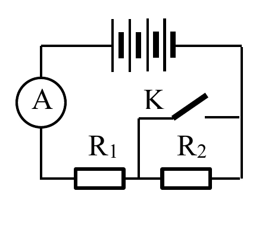

# Bài tập — Bài 6 — Ghép nguồn thành bộ

> Hệ bài tập được biên soạn theo các dạng xuất hiện trong bộ tài liệu Vật lí 11 của dự án. Câu hỏi được giữ ngắn, trực tiếp; độ khó tăng dần và không cố tình thêm dữ kiện gây nhiễu.

[← Trở lại bài học](../../06-source-combinations.md)

## Phần A — Trắc nghiệm 4 lựa chọn

### Bài 1 — Mức 1 — Nhận biết

Ba nguồn giống nhau, mỗi nguồn có suất điện động E và điện trở trong r, ghép nối tiếp cùng chiều. Bộ nguồn có

A. $\mathcal E_b=E$, $r_b=3r$.

B. $\mathcal E_b=3E$, $r_b=3r$.

C. $\mathcal E_b=3E$, $r_b=r/3$.

D. $\mathcal E_b=E/3$, $r_b=r/3$.

??? success "Đáp án và lời giải"
    Chọn **B**.

### Bài 2 — Mức 1 — Nhận biết

Ba nguồn giống nhau ghép song song đúng cực. Bộ nguồn có

A. $\mathcal E_b=E$, $r_b=r/3$.

B. $\mathcal E_b=3E$, $r_b=r/3$.

C. $\mathcal E_b=E/3$, $r_b=3r$.

D. $\mathcal E_b=3E$, $r_b=3r$.

??? success "Đáp án và lời giải"
    Chọn **A**.

### Bài 3 — Mức 1 — Nhận biết

Ghép nối tiếp nguồn giống nhau phù hợp khi cần

A. tăng suất điện động bộ.

B. giữ suất điện động bằng một nguồn và giảm điện trở trong.

C. làm suất điện động bằng 0 trong mọi trường hợp.

D. chỉ để trang trí mạch.

??? success "Đáp án và lời giải"
    Chọn **A**.

### Bài 4 — Mức 1 — Nhận biết

Ghép song song các nguồn giống nhau đúng cực thường nhằm

A. tăng suất điện động lên n lần.

B. giảm điện trở trong tương đương.

C. đảo cực mọi nguồn.

D. làm r tăng n lần.

??? success "Đáp án và lời giải"
    Chọn **B**.

## Phần B — Đúng/Sai

### Bài 5 — Mức 2 — Thông hiểu

Với n nguồn giống nhau:

a) Nối tiếp: $\mathcal E_b=n\mathcal E$, $r_b=nr$.

b) Song song: $\mathcal E_b=\mathcal E$, $r_b=r/n$.

c) Ghép song song tùy ý các nguồn có suất điện động rất khác nhau luôn an toàn.

d) Khi thiết kế bộ hỗn hợp đối xứng cần xét cả suất điện động và điện trở trong.

??? success "Đáp án và lời giải"
    a) **Đúng**.
    b) **Đúng**.
    c) **Sai**: có thể xuất hiện dòng tuần hoàn lớn giữa nguồn.
    d) **Đúng**.

### Bài 6 — Mức 2 — Thông hiểu

Bộ gồm m nhánh song song, mỗi nhánh có n nguồn giống nhau mắc nối tiếp:

a) Tổng số nguồn N=mn.

b) Suất điện động mỗi nhánh là $n\mathcal E$.

c) Điện trở trong bộ là $nr/m$.

d) Suất điện động bộ là $m\mathcal E$.

??? success "Đáp án và lời giải"
    a) **Đúng**.
    b) **Đúng**.
    c) **Đúng**.
    d) **Sai**: các nhánh song song cùng suất điện động $n\mathcal E$, nên suất điện động bộ bằng $n\mathcal E$.

## Phần C — Trả lời ngắn

### Bài 7 — Mức 3 — Vận dụng

Bốn pin giống nhau, mỗi pin $1,5$ V, $r=0,5\,\Omega$, ghép nối tiếp. Tính $\mathcal E_b$, $r_b$.

??? success "Đáp án và lời giải"
    $\mathcal E_b=4\cdot1,5=6$ V; $r_b=4\cdot0,5=2\,\Omega$.

### Bài 8 — Mức 3 — Vận dụng

Bốn pin giống nhau như trên ghép song song. Tính $\mathcal E_b$, $r_b$.

??? success "Đáp án và lời giải"
    $\mathcal E_b=1,5$ V; $r_b=0,5/4=0,125\,\Omega$.

### Bài 9 — Mức 3 — Vận dụng

Sáu nguồn giống nhau $\mathcal E=2$ V, $r=1\,\Omega$ ghép thành 2 nhánh song song, mỗi nhánh 3 nguồn nối tiếp. Tính bộ nguồn.

??? success "Đáp án và lời giải"
    Mỗi nhánh: $\mathcal E_n=3\cdot2=6$ V, $r_n=3\,\Omega$. Hai nhánh song song giống nhau: $\mathcal E_b=6$ V, $r_b=3/2=1,5\,\Omega$.

## Phần D — Vận dụng và vận dụng cao

### Bài 10 — Mức 4 — Vận dụng cao

Có 12 nguồn giống nhau, mỗi nguồn $\mathcal E=1,5$ V, $r=0,5\,\Omega$. Ghép thành m nhánh song song giống nhau, mỗi nhánh n nguồn nối tiếp, mn=12. Mạch ngoài R=$2\,\Omega$. So sánh dòng mạch chính cho các phương án n=1,2,3,4,6,12 và chọn phương án lớn nhất.

??? success "Đáp án và lời giải"
    Với cấu hình n nguồn nối tiếp mỗi nhánh và m=12/n nhánh song song:

    $\mathcal E_b=1,5n$, $r_b=nr/m=n^2r/12=n^2/24\,\Omega$.

    $I=\frac{1,5n}{2+n^2/24}$.

    Tính nhanh:

    - n=1: $I\approx0,735$ A.
    - n=2: $I\approx1,385$ A.
    - n=3: $I\approx1,895$ A.
    - n=4: $I=6/(2+2/3)=2,25$ A.
    - n=6: $I=9/(2+1,5)=2,571$ A.
    - n=12: $I=18/(2+6)=2,25$ A.

    Trong các phương án nguyên cho trước, **n=6, m=2** cho dòng lớn nhất. Kết quả phù hợp nguyên tắc tối ưu khi điện trở trong bộ gần điện trở ngoài.

## Ngân hàng bài tập mở rộng

### Nhận biết — Trả lời ngắn

#### Bài 11

<!-- source-id: BT-Chuong-IV-p74-q3-231 -->

Nếu ghép 3 pin giống nhau nối tiếp thu được bộ nguồn $7{,}5\,\mathrm V$ và $3\,\Omega$ thì khi mắc 3 pin đó song song, bộ nguồn có suất điện động bằng bao nhiêu?

??? success "Đáp án và lời giải"
    **Đáp án:** $2{,}5\,\mathrm V$.

    **Hướng dẫn giải:**
    Khi ba pin giống nhau nối tiếp, $\xi_b=3\xi=7{,}5\,\mathrm V$, nên $\xi=2{,}5\,\mathrm V$.

    Khi ghép ba pin giống nhau song song, suất điện động của bộ bằng suất điện động của mỗi pin:
    $\xi'_b=\xi=2{,}5\,\mathrm V$.

    !!! warning "Đối chiếu nguồn"
        PDF ghi đáp án $7{,}5\,\mathrm V$ và đồng thời nêu quy tắc “ghép song song thì suất điện động của bộ bằng suất điện động của từng pin”. Hai phần này mâu thuẫn với dữ kiện ban đầu $3\xi=7{,}5\,\mathrm V$. Kết quả độc lập đúng là **$2{,}5\,\mathrm V$**.
#### Bài 12

<!-- source-id: BT-Chuong-IV-p87-q6-262 -->

Trong việc thiết kế mạch điện, để có được các suất điện động thích hợp, xét bốn pin giống nhau mắc nối tiếp thành một bộ nguồn rồi mắc một biến trở vào hai đầu bộ nguồn thành mạch kín. Đồ thị biểu diễn sự phụ thuộc của điện áp hai đầu bộ nguồn $U$ vào cường độ dòng điện $I$ như hình. Tìm điện trở trong của mỗi pin.

{ loading=lazy }

??? success "Đáp án và lời giải"
    **Đáp án:** $1\,\Omega$.

    **Hướng dẫn giải:**
    Với bộ bốn pin nối tiếp:
    $U=\xi_b-Ir_b$.

    Từ đồ thị, đường thẳng đi qua $(I,U)=(0,10)$ và $(2{,}5,0)$, nên $\xi_b=10\,\mathrm V$ và
    $r_b=\dfrac{10-0}{2{,}5-0}=4\,\Omega$.

    Bốn pin giống nhau mắc nối tiếp nên $r_b=4r$. Do đó
    $r=\dfrac{r_b}{4}=1\,\Omega$.
### Nhận biết — Trắc nghiệm 4 lựa chọn

#### Bài 13

<!-- source-id: BT-Chuong-IV-p62-q7-199 -->

Một mạch điện có n nguồn điện giống nhau (ξ0; r0) mắc nối tiếp. Suất điện động và điện trở trong bộ
nguồn tính theo công thức

A. ξb = n.ξ0 ; rb = r0/n.

B. ξb = ξ0 ; rb = n.r0.

C. ξb = n.ξ0 ; rb = n.r0.

D. ξb = ξ0 ; rb = r0/n.

??? success "Đáp án và lời giải"
    **Đáp án:** C
    **Hướng dẫn giải:**

    Tính suất điện động bộ và điện trở trong bộ theo đúng cách ghép nguồn, sau đó áp dụng định luật Ohm cho toàn mạch.

    Đối chiếu kết quả với các lựa chọn, phương án phù hợp là **C. ξb = n.ξ0 ; rb = n.r0.**
#### Bài 14

<!-- source-id: BT-Chuong-IV-p79-q10-244 -->

Một nguồn điện với suất điện động ξ , điện trở trong r, mắc với một điện trở ngoài R = r thì cường độ
dòng điện chạy trong mạch là I. Nếu thay nguồn điện đó bằng 3 nguồn điện giống hệt nó mắc nối tiếp thì cường
độ dòng điện trong mạch

A. bằng 3I.

B. bằng 2I.

C. bằng 1,5I.

D. bằng 2,5I.

??? success "Đáp án và lời giải"
    **Đáp án:** C
    **Hướng dẫn giải:**

    Tính suất điện động bộ và điện trở trong bộ theo đúng cách ghép nguồn, sau đó áp dụng định luật Ohm cho toàn mạch.

    Đối chiếu kết quả với các lựa chọn, phương án phù hợp là **C. bằng 1,5I.**
#### Bài 15

<!-- source-id: BT-Chuong-IV-p79-q11-245 -->

Muốn ghép 3 pin giống nhau, mỗi pin có suất điện động $3\,\mathrm V$, thành bộ nguồn $9\,\mathrm V$ thì

A. phải ghép 2 pin song song và nối tiếp với pin còn lại.

B. ghép 3 pin song song.

C. ghép 3 pin nối tiếp.

D. không ghép được.

??? success "Đáp án và lời giải"
    **Đáp án:** C

    **Hướng dẫn giải:**
    Với ba nguồn giống nhau mắc nối tiếp, $\xi_b=3\xi=3\cdot3=9\,\mathrm V$. Vì vậy chọn **C**.
#### Bài 16

<!-- source-id: BT-Chuong-IV-p80-q14-248 -->

Có n nguồn điện giống nhau (ξ0; r0) mắc song song. Suất điện động và điện trở trong bộ nguồn tính
theo công thức

A. ξb = n. ξ0 ; rb = r0/n.

B. ξb = ξ0 ; rb = n.r0.

C. ξb = n. ξ0 ; rb = n.r.

D. ξb = ξ0 ; rb = r0/n.

??? success "Đáp án và lời giải"
    **Đáp án:** D
    **Hướng dẫn giải:**

    Tính suất điện động bộ và điện trở trong bộ theo đúng cách ghép nguồn, sau đó áp dụng định luật Ohm cho toàn mạch.

    Đối chiếu kết quả với các lựa chọn, phương án phù hợp là **D. ξb = ξ0 ; rb = r0/n.**
#### Bài 17

<!-- source-id: BT-Chuong-IV-p80-q16-250 -->

Có một số nguồn giống nhau mắc nối tiếp vào mạch mạch ngoài có điện trở R = 10 Ω. Nếu dùng 6
nguồn này thì cường độ dòng điện trong mạch là 3A. Nếu dùng 12 nguồn thì cường độ dòng điện trong mạch
là 5A. Tính suất điện động và điện trở trong của mỗi nguồn.

A. ξ = 6,25V, r = 5/12 Ω.

B. ξ = 6,25V, r = 1,2 Ω.

C. ξ = 12,5 V, r = 5/12 Ω.

D. ξ = 12,5 V, r = 1,2 Ω.

??? success "Đáp án và lời giải"
    **Đáp án:** A
    **Hướng dẫn giải:**

    Tính suất điện động bộ và điện trở trong bộ theo đúng cách ghép nguồn, sau đó áp dụng định luật Ohm cho toàn mạch.

    Với 6 nguồn, cường độ dòng điện chạy trong mạch:
    Với 12 nguồn, cường độ dòng điện chạy trong mạch:
    Ta thu được hệ phương trình {

    Đối chiếu kết quả với các lựa chọn, phương án phù hợp là **A. ξ = 6,25V, r = 5/12 Ω.**
#### Bài 18

<!-- source-id: BT-Chuong-IV-p81-q17-251 -->

Ghép song song một bộ 2024 pin giống nhau loại $(\xi=9\,\mathrm V;\ r=1\,\Omega)$ thì thu được một bộ nguồn có suất điện động là

A. $18216\,\mathrm V$.

B. $9\,\mathrm V$.

C. $2024\,\mathrm V$.

D. $18\,\mathrm V$.

??? success "Đáp án và lời giải"
    **Đáp án:** B

    **Hướng dẫn giải:**
    Khi ghép song song các nguồn giống nhau, suất điện động của bộ bằng suất điện động của mỗi nguồn: $\xi_b=\xi=9\,\mathrm V$. Chọn **B**.
### Nhận biết — Đúng/Sai

#### Bài 19

<!-- source-id: BT-Chuong-IV-p72-q5-227 -->

Cho mạch điện như hình vẽ. Biết $\xi_1=48\,\mathrm V$, $\xi_2=36\,\mathrm V$, $r_1=0{,}4\,\Omega$, $r_2=0{,}2\,\Omega$, $R_1=4\,\Omega$, $R_2=6\,\Omega$. Bỏ qua điện trở của dây dẫn.

{ loading=lazy }

a) Nguồn $\xi_1$ mắc nối tiếp với nguồn $\xi_2$.

b) Suất điện động của bộ nguồn là $12\,\mathrm V$.

c) Hiệu điện thế đặt vào hai đầu nguồn điện luôn bằng suất điện động của bộ nguồn khi có dòng điện chạy qua nguồn.

d) Cường độ dòng điện chạy trong mạch có giá trị là $4\,\mathrm A$.

??? success "Đáp án và lời giải"
    **Đáp án:** a) Sai; b) Đúng; c) Sai; d) Đúng.

    **Hướng dẫn giải:**

    a) **Sai.** Quan sát cực tính cho thấy hai nguồn mắc xung đối.

    b) **Đúng.** Suất điện động tương đương là $\xi_b=\xi_1-\xi_2=48-36=12\,\mathrm V$.

    c) **Sai.** Khi mạch có dòng điện, hiệu điện thế hai đầu nguồn nói chung không bằng suất điện động vì còn sụt áp trên điện trở trong.

    d) **Đúng.** Điện trở mạch ngoài là $R=R_1\parallel R_2=2{,}4\,\Omega$. Do đó
    $I=\frac{\xi_b}{R+r_1+r_2} =\frac{12}{2{,}4+0{,}4+0{,}2} =4\,\mathrm A.$
#### Bài 20

<!-- source-id: BT-Chuong-IV-p82-q2-254 -->

Người ta mắc một bộ 5 pin giống nhau song song thì thu được một bộ nguồn có suất điện động 12 V và
điện trở trong 0,4Ω. Mạch ngoài gồm 1 bóng đèn có điện trở R = 2 Ω.

a) Mỗi pin có suất điện động là 12 V.

b) Điện trở trong của mỗi pin là 0,4Ω.

c) Hiệu điện thế đặt vào hai đầu bóng đèn là 10V.

d) Nếu ta mắc 5 pin nối tiếp nhau, cường độ dòng điện trong mạch khi này là 5A.

??? success "Đáp án và lời giải"
    **Đáp án:** a) Đúng; b) Sai; c) Đúng; d) Đúng.

    **Hướng dẫn giải:**

    Năm pin giống nhau mắc song song cho $\xi_b=\xi=12$ V và $r_b=r/5=0{,}4\ \Omega$.

    a) **Đúng.** Mỗi pin có suất điện động $\xi=12$ V.

    b) **Sai.** $r=5r_b=5\cdot0{,}4=2\ \Omega$, không phải $0{,}4\ \Omega$.

    c) **Đúng.** Với $R=2\ \Omega$, $I=12/(2+0{,}4)=5$ A và $U=IR=10$ V.

    d) **Đúng.** Nếu mắc nối tiếp: $\xi'_b=5\xi=60$ V, $r'_b=5r=10\ \Omega$. Khi đó $I'=60/(2+10)=5$ A.
### Vận dụng — Trắc nghiệm 4 lựa chọn

#### Bài 21

<!-- source-id: BT-Chuong-IV-p67-q30-221 -->

Mạch điện gồm 4 nguồn nối tiếp, mỗi nguồn có $\xi_0=3\,\mathrm V$, $r_0=1\,\Omega$. Mạch ngoài gồm $R_1$ và $R_2=10\,\Omega$. Khi $K$ mở, ampe kế chỉ $0{,}6\,\mathrm A$. Khi $K$ đóng, số chỉ ampe kế bằng

{ loading=lazy }

A. $1{,}5\,\mathrm A$.

B. $0{,}5\,\mathrm A$.

C. $0{,}6\,\mathrm A$.

D. $1{,}2\,\mathrm A$.

??? success "Đáp án và lời giải"
    **Đáp án:** D

    **Hướng dẫn giải:**

    Bốn nguồn ghép nối tiếp nên
    $\xi_b=4\xi_0=12\,\mathrm V,\qquad r_b=4r_0=4\,\Omega.$

    Khi $K$ mở, $R_1$ nối tiếp $R_2$. Từ số chỉ $I=0{,}6\,\mathrm A$:
    $\xi_b=I(R_1+R_2+r_b) \Rightarrow R_1=\frac{12}{0{,}6}-(10+4)=6\,\Omega.$

    Khi $K$ đóng, $R_2$ bị nối tắt nên
    $I=\frac{\xi_b}{R_1+r_b}=\frac{12}{6+4}=1{,}2\,\mathrm A.$

    Chọn **D**.
