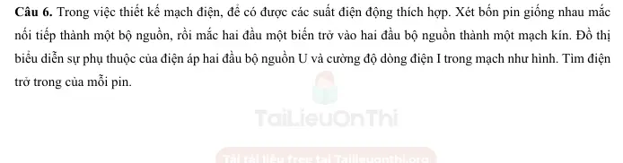
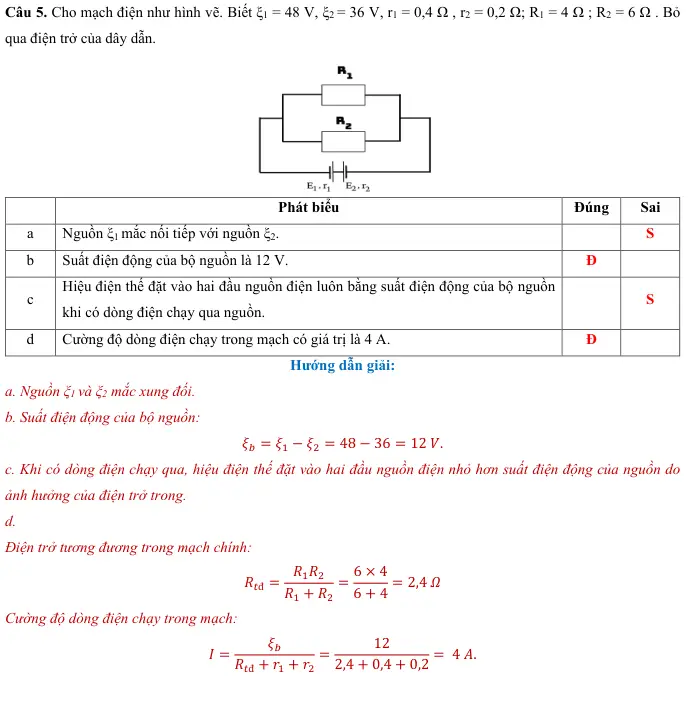

# Bài tập — Bài 6 — Ghép nguồn thành bộ

> Hệ bài tập được biên soạn theo các dạng xuất hiện trong bộ tài liệu Vật lí 11 của dự án. Câu hỏi được giữ ngắn, trực tiếp; độ khó tăng dần và không cố tình thêm dữ kiện gây nhiễu.

[← Trở lại bài học](../../06-source-combinations.md)

## Phần A — Trắc nghiệm 4 lựa chọn

### Câu 1 — Mức 1 — Nhận biết

Ba nguồn giống nhau, mỗi nguồn có suất điện động E và điện trở trong r, ghép nối tiếp cùng chiều. Bộ nguồn có

A. $\mathcal E_b=E$, $r_b=3r$.  
B. $\mathcal E_b=3E$, $r_b=3r$.  
C. $\mathcal E_b=3E$, $r_b=r/3$.  
D. $\mathcal E_b=E/3$, $r_b=r/3$.

### Câu 2 — Mức 1 — Nhận biết

Ba nguồn giống nhau ghép song song đúng cực. Bộ nguồn có

A. $\mathcal E_b=E$, $r_b=r/3$.  
B. $\mathcal E_b=3E$, $r_b=r/3$.  
C. $\mathcal E_b=E/3$, $r_b=3r$.  
D. $\mathcal E_b=3E$, $r_b=3r$.

### Câu 3 — Mức 1 — Nhận biết

Ghép nối tiếp nguồn giống nhau phù hợp khi cần

A. tăng suất điện động bộ.  
B. giữ suất điện động bằng một nguồn và giảm điện trở trong.  
C. làm suất điện động bằng 0 trong mọi trường hợp.  
D. chỉ để trang trí mạch.

### Câu 4 — Mức 1 — Nhận biết

Ghép song song các nguồn giống nhau đúng cực thường nhằm

A. tăng suất điện động lên n lần.  
B. giảm điện trở trong tương đương.  
C. đảo cực mọi nguồn.  
D. làm r tăng n lần.

## Phần B — Đúng/Sai

### Câu 5 — Mức 2 — Thông hiểu

Với n nguồn giống nhau:

a) Nối tiếp: $\mathcal E_b=n\mathcal E$, $r_b=nr$.  
b) Song song: $\mathcal E_b=\mathcal E$, $r_b=r/n$.  
c) Ghép song song tùy ý các nguồn có suất điện động rất khác nhau luôn an toàn.  
d) Khi thiết kế bộ hỗn hợp đối xứng cần xét cả suất điện động và điện trở trong.

### Câu 6 — Mức 2 — Thông hiểu

Bộ gồm m nhánh song song, mỗi nhánh có n nguồn giống nhau mắc nối tiếp:

a) Tổng số nguồn N=mn.  
b) Suất điện động mỗi nhánh là $n\mathcal E$.  
c) Điện trở trong bộ là $nr/m$.  
d) Suất điện động bộ là $m\mathcal E$.

## Phần C — Trả lời ngắn

### Câu 7 — Mức 3 — Vận dụng

Bốn pin giống nhau, mỗi pin $1,5$ V, $r=0,5\,\Omega$, ghép nối tiếp. Tính $\mathcal E_b$, $r_b$.

### Câu 8 — Mức 3 — Vận dụng

Bốn pin giống nhau như trên ghép song song. Tính $\mathcal E_b$, $r_b$.

### Câu 9 — Mức 3 — Vận dụng

Sáu nguồn giống nhau $\mathcal E=2$ V, $r=1\,\Omega$ ghép thành 2 nhánh song song, mỗi nhánh 3 nguồn nối tiếp. Tính bộ nguồn.

## Phần D — Vận dụng và vận dụng cao

### Câu 10 — Mức 4 — Vận dụng cao

Có 12 nguồn giống nhau, mỗi nguồn $\mathcal E=1,5$ V, $r=0,5\,\Omega$. Ghép thành m nhánh song song giống nhau, mỗi nhánh n nguồn nối tiếp, mn=12. Mạch ngoài R=$2\,\Omega$. So sánh dòng mạch chính cho các phương án n=1,2,3,4,6,12 và chọn phương án lớn nhất.

---

[Đáp án và lời giải →](solutions.md)

## Ngân hàng bài tập PDF mở rộng

> Nội dung câu hỏi và dữ kiện trong phần này được giữ nguyên; hệ thống chỉ chuẩn hóa xuống dòng và mã kí tự để hiển thị trên web. Câu trùng được loại bỏ. Với câu có công thức/kí hiệu bị sai khi trích xuất chữ từ PDF, đề bài được giữ dưới dạng ảnh để không làm thay đổi dữ kiện.

### Nhận biết — Trả lời ngắn

#### Bài PDF 1

<!-- source-id: BT-Chuong-IV-p74-q3-231 -->

Câu 3. Nếu ghép 3 pin giống nhau nối tiếp thu được bộ nguồn 7,5 V và 3 Ω thì khi mắc 3 pin đó song song thu
được bộ nguồn có suất điện động là bao nhiêu?

#### Bài PDF 2

<!-- source-id: BT-Chuong-IV-p87-q6-262 -->

Câu 6. Trong việc thiết kế mạch điện, để có được các suất điện động thích hợp. Xét bốn pin giống nhau mắc
nối tiếp thành một bộ nguồn, rồi mắc hai đầu một biến trở vào hai đầu bộ nguồn thành một mạch kín. Đồ thị
biểu diễn sự phụ thuộc của điện áp hai đầu bộ nguồn U và cường độ dòng điện I trong mạch như hình. Tìm điện
trở trong của mỗi pin.

{ loading=lazy }

### Nhận biết — Trắc nghiệm 4 lựa chọn

#### Bài PDF 3

<!-- source-id: BT-Chuong-IV-p62-q7-199 -->

Câu 7. Một mạch điện có n nguồn điện giống nhau (ξ0; r0) mắc nối tiếp. Suất điện động và điện trở trong bộ
nguồn tính theo công thức
A. ξb = n.ξ0  ; rb = r0/n.
B. ξb = ξ0  ; rb = n.r0.
C. ξb = n.ξ0  ; rb = n.r0.
D. ξb = ξ0  ; rb = r0/n.

#### Bài PDF 4

<!-- source-id: BT-Chuong-IV-p63-q8-200 -->

Câu 8. Một mạch điện có n nguồn điện giống nhau (ξ0; r0) mắc nối tiếp. Suất điện động và điện trở trong bộ
nguồn tính theo công thức
A. ξb = n.ξ0  ; rb = r0/n.
B. ξb = ξ0  ; rb = n.r0.
C. ξb = n.ξ0  ; rb = n.r0.
D. ξb = ξ0  ; rb = r0/n.

#### Bài PDF 5

<!-- source-id: BT-Chuong-IV-p79-q10-244 -->

Câu 10. Một nguồn điện với suất điện động ξ , điện trở trong r, mắc với một điện trở ngoài R = r thì cường độ
dòng điện chạy trong mạch là I. Nếu thay nguồn điện đó bằng 3 nguồn điện giống hệt nó mắc nối tiếp thì cường
độ dòng điện trong mạch
A. bằng 3I.
B. bằng 2I.
C. bằng 1,5I.
D. bằng 2,5I.

#### Bài PDF 6

<!-- source-id: BT-Chuong-IV-p79-q11-245 -->

Câu 11. Muốn ghép 3 pin giống nhau mỗi pin có suất điện động 3 V thành bộ nguồn 9 V thì
A. phải ghép 2 pin song song và nối tiếp với pin còn lại.
B. ghép 3 pin song song.
C. ghép 3 pin nối tiếp.
D. không ghép được.

#### Bài PDF 7

<!-- source-id: BT-Chuong-IV-p80-q14-248 -->

Câu 14. Có n nguồn điện giống nhau (ξ0; r0) mắc song song. Suất điện động và điện trở trong bộ nguồn tính
theo công thức
A. ξb = n. ξ0  ; rb = r0/n.
B. ξb = ξ0  ; rb = n.r0.
C. ξb = n. ξ0  ; rb = n.r.
D. ξb = ξ0  ; rb = r0/n.

#### Bài PDF 8

<!-- source-id: BT-Chuong-IV-p80-q16-250 -->

Câu 16. Có một số nguồn giống nhau mắc nối tiếp vào mạch mạch ngoài có điện trở R = 10 Ω. Nếu dùng 6
nguồn này thì cường độ dòng điện trong mạch là 3A. Nếu dùng 12 nguồn thì cường độ dòng điện trong mạch
là 5A. Tính suất điện động và điện trở trong của mỗi nguồn.
   A. ξ = 6,25V, r = 5/12 Ω.
B. ξ = 6,25V, r = 1,2 Ω.
C. ξ = 12,5 V, r = 5/12 Ω.
D. ξ = 12,5 V, r = 1,2 Ω.

#### Bài PDF 9

<!-- source-id: BT-Chuong-IV-p81-q17-251 -->

Câu 17. Ghép song song một bộ 2024 pin giống nhau loại (ξ = 9V; r = 1Ω) thì thu được một bộ nguồn có suất
điện động là
A. 18216 V.
B. 9 V.
C. 2024 V.
D. 18 V.

### Nhận biết — Đúng/Sai

#### Bài PDF 10

<!-- source-id: BT-Chuong-IV-p72-q5-227 -->

Câu 5. Cho mạch điện như hình vẽ. Biết ξ1 = 48 V, ξ2 = 36 V, r1 = 0,4 Ω , r2 = 0,2 Ω; R1 = 4 Ω ; R2 = 6 Ω . Bỏ
qua điện trở của dây dẫn.

Phát biểu
Đúng
Sai
a
Nguồn ξ1 mắc nối tiếp với nguồn ξ2.

S
b
Suất điện động của bộ nguồn là 12 V.
Đ

c
Hiệu điện thế đặt vào hai đầu nguồn điện luôn bằng suất điện động của bộ nguồn
khi có dòng điện chạy qua nguồn.

S
d
Cường độ dòng điện chạy trong mạch có giá trị là 4 A.
Đ

{ loading=lazy }

#### Bài PDF 11

<!-- source-id: BT-Chuong-IV-p82-q2-254 -->

Câu 2. Người ta mắc một bộ 5 pin giống nhau song song thì thu được một bộ nguồn có suất điện động 12 V và
điện trở trong 0,4Ω. Mạch ngoài gồm 1 bóng đèn có điện trở R = 2 Ω.

Phát biểu
Đúng
Sai
a
Mỗi pin có suất điện động là 12 V.
Đ

b
Điện trở trong của mỗi pin là 0,4Ω.

S
c
Hiệu điện thế đặt vào hai đầu bóng đèn là 10V.
Đ

d
Nếu ta mắc 5 pin nối tiếp nhau, cường độ dòng điện trong mạch khi này là 5A.
Đ

### Vận dụng — Trắc nghiệm 4 lựa chọn

#### Bài PDF 12

<!-- source-id: BT-Chuong-IV-p67-q30-221 -->

Câu 30. Mạch điện gồm 4 nguồn nối tiếp , mỗi nguồn có ξ0 = 3 V ; r0 = 1 Ω . Mạch ngoài
R1 và R2 = 10 Ω . Khi K mở, Ampere kế chỉ 0,6 A. Khi K đóng, số chỉ Ampere kế bằng
A. 1,5 A.
B. 0,5 A.
C. 0,6 A.
D. 1,2 A.

