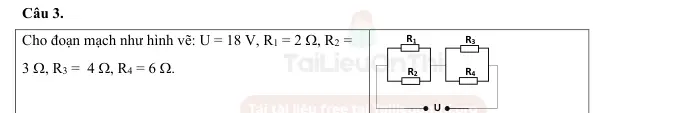
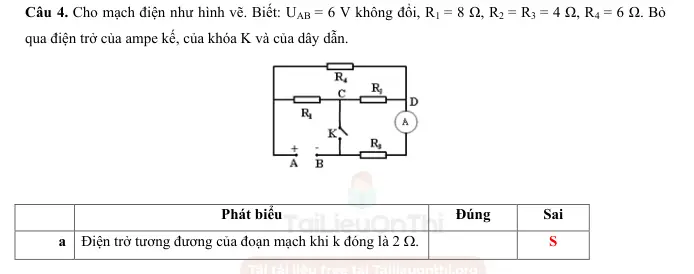

# Bài tập — Bài 7 — Đọc và biến đổi mạch; ampe kế, vôn kế lí tưởng

> Hệ bài tập được biên soạn theo các dạng xuất hiện trong bộ tài liệu Vật lí 11 của dự án. Câu hỏi được giữ ngắn, trực tiếp; độ khó tăng dần và không cố tình thêm dữ kiện gây nhiễu.

[← Trở lại bài học](../../07-circuit-reading-meters.md)

## Phần A — Trắc nghiệm 4 lựa chọn

### Câu 1 — Mức 1 — Nhận biết

Ampe kế lí tưởng có điện trở

A. bằng 0.  
B. vô hạn.  
C. bằng 1 Ω.  
D. thay đổi tùy dòng.

### Câu 2 — Mức 1 — Nhận biết

Vôn kế lí tưởng có điện trở

A. bằng 0.  
B. rất nhỏ.  
C. vô hạn.  
D. bằng điện trở mạch.

### Câu 3 — Mức 1 — Nhận biết

Hai điểm nối trực tiếp bằng dây dẫn lí tưởng, không có phần tử giữa chúng, được xem là

A. khác điện thế bất kì.  
B. cùng một nút điện thế.  
C. luôn có dòng bằng 0.  
D. luôn hở mạch.

### Câu 4 — Mức 1 — Nhận biết

Vôn kế lí tưởng mắc nối tiếp trong mạch sẽ gần như

A. ngắn mạch.  
B. làm hở nhánh đó.  
C. không ảnh hưởng.  
D. tăng dòng vô hạn.

## Phần B — Đúng/Sai

### Câu 5 — Mức 2 — Thông hiểu

Khi đọc mạch:

a) Dây nối lí tưởng có thể dùng để nhận diện các điểm cùng điện thế.  
b) Ampe kế lí tưởng được thay bằng dây dẫn.  
c) Vôn kế lí tưởng được thay bằng nhánh hở khi tính dòng mạch chính.  
d) Hai điện trở có một đầu chung thì chắc chắn mắc song song.

### Câu 6 — Mức 2 — Thông hiểu

Mạch có R1 và R2 nối tiếp:

a) Dòng qua hai điện trở bằng nhau.  
b) Hiệu điện thế phân chia tỉ lệ điện trở.  
c) Vôn kế lí tưởng đo áp trên R1 nếu mắc song song hai đầu R1.  
d) Ampe kế lí tưởng phải mắc song song R1 để đo dòng qua R1.

## Phần C — Trả lời ngắn

### Câu 7 — Mức 3 — Vận dụng

R1=$4\,\Omega$, R2=$6\,\Omega$ nối tiếp vào 20 V. Ampe kế lí tưởng nối tiếp mạch chỉ bao nhiêu? Vôn kế lí tưởng mắc hai đầu R2 chỉ bao nhiêu?

### Câu 8 — Mức 3 — Vận dụng

R1=$6\,\Omega$, R2=$3\,\Omega$ song song dưới 12 V. Tính dòng mạch chính và dòng mỗi nhánh.

### Câu 9 — Mức 3 — Vận dụng

Một mạch có R1=$2\,\Omega$ nối tiếp với bộ song song R2=$3\,\Omega$, R3=$6\,\Omega$. Đặt 12 V. Tính dòng qua từng điện trở.

## Phần D — Vận dụng và vận dụng cao

### Câu 10 — Mức 4 — Vận dụng cao

Mạch cầu gồm bốn điện trở: R1=2 Ω, R2=4 Ω ở nhánh trên; R3=3 Ω, R4=6 Ω ở nhánh dưới, nối giữa cùng hai nút nguồn. Một vôn kế lí tưởng nối giữa hai điểm giữa hai nhánh. Chứng minh vôn kế chỉ 0.

---

[Đáp án và lời giải →](solutions.md)

## Ngân hàng bài tập PDF mở rộng

> Nội dung câu hỏi và dữ kiện trong phần này được giữ nguyên; hệ thống chỉ chuẩn hóa xuống dòng và mã kí tự để hiển thị trên web. Câu trùng được loại bỏ. Với câu có công thức/kí hiệu bị sai khi trích xuất chữ từ PDF, đề bài được giữ dưới dạng ảnh để không làm thay đổi dữ kiện.

### Nhận biết — Trắc nghiệm 4 lựa chọn

#### Bài PDF 1

<!-- source-id: BT-Chuong-IV-p32-q4-109 -->

Câu 4. Muốn đo hiệu điện thế giữa hai cực của một nguồn điện, nhưng không có vôn kế, một học sinh đã
sử dụng một ampe kế và một điện trở có giá trị
50
R =
Ω mắc nối tiếp nhau, sau đó mắc vào nguồn điện,
biết ampe kế chỉ 1,2 A. Hiệu điện thế giữa hai cực nguồn điện có giá trị bằng
A. 120 V.

B. 50 V.

C. 12 V.

D. 60 V.

### Nhận biết — Đúng/Sai

#### Bài PDF 2

<!-- source-id: BT-Chuong-IV-p50-q3-179 -->

Câu 3.
Cho đoạn mạch như hình vẽ: U = 18 V, R1 = 2 Ω, R2 =
3 Ω, R3 =  4 Ω, R4 = 6 Ω.

R1
R3
U
R2
R4

Phát biểu
Đúng
Sai
a Điện trở tương đương của đoạn mạch là 3,6 Ω
Đ

b Hiệu điện thế giữa hai đầu R1 là 18 V

S
c
Cường độ dòng điện qua điện trở R2 là 3 A.

S
d Cường độ dòng điện qua điện trở R4 là 2 A.
Đ

{ loading=lazy }

#### Bài PDF 3

<!-- source-id: BT-Chuong-IV-p51-q4-180 -->

Câu 4. Cho mạch điện như hình vẽ. Biết: UAB = 6 V không đổi, R1 = 8 Ω, R2 = R3 = 4 Ω, R4 = 6 Ω. Bỏ
qua điện trở của ampe kế, của khóa K và của dây dẫn.

Phát biểu
Đúng
Sai
a Điện trở tương đương của đoạn mạch khi k đóng là 2 Ω.

S

b Điện trở tương đương của đoạn mạch khi k mở là 8 Ω.
Đ

c
Khi k mở, số chỉ của ampe kế là 0,75 A.
Đ

d Khi k đóng, số chỉ của ampe kế là 0,375 A.

S

{ loading=lazy }

