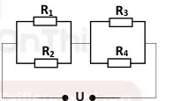
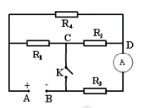

# Bài tập — Bài 7 — Đọc và biến đổi mạch; ampe kế, vôn kế lí tưởng

> Hệ bài tập được biên soạn theo các dạng xuất hiện trong bộ tài liệu Vật lí 11 của dự án. Câu hỏi được giữ ngắn, trực tiếp; độ khó tăng dần và không cố tình thêm dữ kiện gây nhiễu.

[← Trở lại bài học](../../07-circuit-reading-meters.md)

## Phần A — Trắc nghiệm 4 lựa chọn

### Bài 1 — Mức 1 — Nhận biết

Ampe kế lí tưởng có điện trở

A. bằng 0.
B. vô hạn.
C. bằng 1 Ω.
D. thay đổi tùy dòng.

??? success "Đáp án và lời giải"
    Chọn **A**.

### Bài 2 — Mức 1 — Nhận biết

Vôn kế lí tưởng có điện trở

A. bằng 0.
B. rất nhỏ.
C. vô hạn.
D. bằng điện trở mạch.

??? success "Đáp án và lời giải"
    Chọn **C**.

### Bài 3 — Mức 1 — Nhận biết

Hai điểm nối trực tiếp bằng dây dẫn lí tưởng, không có phần tử giữa chúng, được xem là

A. khác điện thế bất kì.
B. cùng một nút điện thế.
C. luôn có dòng bằng 0.
D. luôn hở mạch.

??? success "Đáp án và lời giải"
    Chọn **B**.

### Bài 4 — Mức 1 — Nhận biết

Vôn kế lí tưởng mắc nối tiếp trong mạch sẽ gần như

A. ngắn mạch.
B. làm hở nhánh đó.
C. không ảnh hưởng.
D. tăng dòng vô hạn.

??? success "Đáp án và lời giải"
    Chọn **B** vì điện trở vô hạn.

## Phần B — Đúng/Sai

### Bài 5 — Mức 2 — Thông hiểu

Khi đọc mạch:

a) Dây nối lí tưởng có thể dùng để nhận diện các điểm cùng điện thế.
b) Ampe kế lí tưởng được thay bằng dây dẫn.
c) Vôn kế lí tưởng được thay bằng nhánh hở khi tính dòng mạch chính.
d) Hai điện trở có một đầu chung thì chắc chắn mắc song song.

??? success "Đáp án và lời giải"
    a) **Đúng**.
    b) **Đúng**.
    c) **Đúng**.
    d) **Sai**: muốn song song phải chung cả hai nút đầu cuối.

### Bài 6 — Mức 2 — Thông hiểu

Mạch có R1 và R2 nối tiếp:

a) Dòng qua hai điện trở bằng nhau.
b) Hiệu điện thế phân chia tỉ lệ điện trở.
c) Vôn kế lí tưởng đo áp trên R1 nếu mắc song song hai đầu R1.
d) Ampe kế lí tưởng phải mắc song song R1 để đo dòng qua R1.

??? success "Đáp án và lời giải"
    a) **Đúng**.
    b) **Đúng**.
    c) **Đúng**.
    d) **Sai**: ampe kế phải mắc nối tiếp với nhánh cần đo.

## Phần C — Trả lời ngắn

### Bài 7 — Mức 3 — Vận dụng

R1=$4\,\Omega$, R2=$6\,\Omega$ nối tiếp vào 20 V. Ampe kế lí tưởng nối tiếp mạch chỉ bao nhiêu? Vôn kế lí tưởng mắc hai đầu R2 chỉ bao nhiêu?

??? success "Đáp án và lời giải"
    $R_t=10\,\Omega$, $I=20/10=2$ A. Vôn kế trên R2: $U_2=IR_2=12$ V.

### Bài 8 — Mức 3 — Vận dụng

R1=$6\,\Omega$, R2=$3\,\Omega$ song song dưới 12 V. Tính dòng mạch chính và dòng mỗi nhánh.

??? success "Đáp án và lời giải"
    $I_1=12/6=2$ A; $I_2=12/3=4$ A. Dòng chính $I=6$ A.

### Bài 9 — Mức 3 — Vận dụng

Một mạch có R1=$2\,\Omega$ nối tiếp với bộ song song R2=$3\,\Omega$, R3=$6\,\Omega$. Đặt 12 V. Tính dòng qua từng điện trở.

??? success "Đáp án và lời giải"
    $R_{23}=3\cdot6/(3+6)=2\,\Omega$. Tổng $R=4\,\Omega$, dòng chính và qua R1: $I_1=3$ A. Điện áp trên bộ song song $U_{23}=3\cdot2=6$ V. $I_2=6/3=2$ A; $I_3=6/6=1$ A.

## Phần D — Vận dụng và vận dụng cao

### Bài 10 — Mức 4 — Vận dụng cao

Mạch cầu gồm bốn điện trở: R1=2 Ω, R2=4 Ω ở nhánh trên; R3=3 Ω, R4=6 Ω ở nhánh dưới, nối giữa cùng hai nút nguồn. Một vôn kế lí tưởng nối giữa hai điểm giữa hai nhánh. Chứng minh vôn kế chỉ 0.

??? success "Đáp án và lời giải"
    Hai nhánh là các bộ chia điện áp độc lập vì vôn kế lí tưởng không lấy dòng.

    Điểm giữa nhánh trên có tỉ phần điện áp theo R1:R2 = 2:4 = 1:2. Nhánh dưới có R3:R4 = 3:6 = 1:2. Vì tỉ số giống nhau, điện thế tại hai điểm giữa bằng nhau.

    Có thể viết điều kiện cầu cân bằng:

    $R_1/R_2=R_3/R_4$.

    Ở đây $2/4=3/6=1/2$, nên $U_V=0$.

## Ngân hàng bài tập mở rộng

> Các bài dưới đây được đánh số nối tiếp phần bài tập phía trên. Đề bài được trình bày bằng Markdown; chỉ đồ thị, hình vẽ hoặc sơ đồ thực sự cần thiết mới được giữ dưới dạng hình. Đáp án và lời giải được đặt trong nút mở rộng ngay dưới từng bài.

### Nhận biết — Trắc nghiệm 4 lựa chọn

#### Bài 11

<!-- source-id: BT-Chuong-IV-p32-q4-109 -->

Muốn đo hiệu điện thế giữa hai cực của một nguồn điện, nhưng không có vôn kế, một học sinh đã
sử dụng một ampe kế và một điện trở có giá trị
50
R =
Ω mắc nối tiếp nhau, sau đó mắc vào nguồn điện,
biết ampe kế chỉ 1,2

A. Hiệu điện thế giữa hai cực nguồn điện có giá trị bằng

A. 120 V.

B. 50 V.

C. 12 V.

D. 60 V.

??? success "Đáp án và lời giải"
    **Đáp án:** D
    **Hướng dẫn giải:**

    Với dụng cụ lí tưởng: ampe kế có điện trở không đáng kể, vôn kế có điện trở rất lớn; vẽ lại các nút cùng điện thế trước khi tính.

    Đối chiếu kết quả với các lựa chọn, phương án phù hợp là **D. 60 V.**
### Nhận biết — Đúng/Sai

#### Bài 12

<!-- source-id: BT-Chuong-IV-p50-q3-179 -->

Cho đoạn mạch như hình vẽ: U = 18 V, R1 = 2 Ω, R2 =
3 Ω, R3 = 4 Ω, R4 = 6 Ω.

R1
R3
U
R2
R4

a) Điện trở tương đương của đoạn mạch là 3,6 Ω
b) Hiệu điện thế giữa hai đầu R1 là 18 V
c) Cường độ dòng điện qua điện trở R2 là 3

A. d) Cường độ dòng điện qua điện trở R4 là 2
A.

{ loading=lazy }

??? success "Đáp án và lời giải"
    **Đáp án:** a) Đúng; b) Sai; c) Sai; d) Đúng.

    **Hướng dẫn giải:**

    Từ sơ đồ, nhóm $R_1=2\ \Omega$ song song $R_2=3\ \Omega$ có $R_{12}=1{,}2\ \Omega$; nhóm $R_3=4\ \Omega$ song song $R_4=6\ \Omega$ có $R_{34}=2{,}4\ \Omega$. Hai nhóm nối tiếp.

    a) **Đúng.** $R_{\rm td}=R_{12}+R_{34}=3{,}6\ \Omega$.

    b) **Sai.** Dòng mạch chính $I=18/3{,}6=5$ A; điện áp nhóm đầu $U_{12}=IR_{12}=6$ V, nên $U_1=6$ V, không phải $18$ V.

    c) **Sai.** $I_2=U_{12}/R_2=6/3=2$ A.

    d) **Đúng.** $U_{34}=18-6=12$ V nên $I_4=12/6=2$ A.
#### Bài 13

<!-- source-id: BT-Chuong-IV-p51-q4-180 -->

Cho mạch điện như hình vẽ. Biết: UAB = 6 V không đổi, R1 = 8 Ω, R2 = R3 = 4 Ω, R4 = 6 Ω. Bỏ
qua điện trở của ampe kế, của khóa K và của dây dẫn.

a) Điện trở tương đương của đoạn mạch khi k đóng là 2 Ω.
b) Điện trở tương đương của đoạn mạch khi k mở là 8 Ω.
c) Khi k mở, số chỉ của ampe kế là 0,75

A. d) Khi k đóng, số chỉ của ampe kế là 0,375
A.

{ loading=lazy }

??? success "Đáp án và lời giải"
    **Đáp án:** a) Sai; b) Đúng; c) Đúng; d) Đúng.

    **Hướng dẫn giải:**

    Ampe kế lí tưởng có điện trở bằng $0$.

    a) **Sai.** Khi $K$ đóng, $C$ nối với $B$. Khi đó $R_2\parallel R_3=4\parallel4=2\ \Omega$; nhánh qua $R_4$ có điện trở $6+2=8\ \Omega$, song song với $R_1=8\ \Omega$. Vì vậy $R_{\rm td}=8\parallel8=4\ \Omega$, không phải $2\ \Omega$.

    b) **Đúng.** Khi $K$ mở, $R_1+R_2=12\ \Omega$ song song $R_4=6\ \Omega$, được $4\ \Omega$; nhóm này nối tiếp $R_3=4\ \Omega$, nên $R_{\rm td}=8\ \Omega$.

    c) **Đúng.** Khi $K$ mở, ampe kế nằm nối tiếp với $R_3$ và dòng mạch chính $I=U/R_{\rm td}=6/8=0{,}75$ A.

    d) **Đúng.** Khi $K$ đóng, dòng trong nhánh $R_4+[R_2\parallel R_3]$ là $6/8=0{,}75$ A. Dòng chia đều qua $R_2=R_3=4\ \Omega$, nên ampe kế chỉ $I_3=0{,}375$ A.
