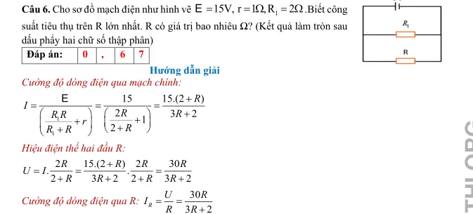
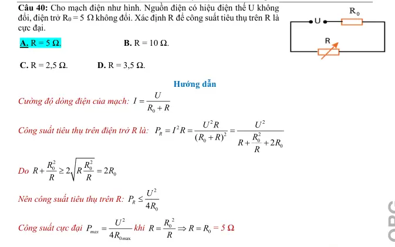
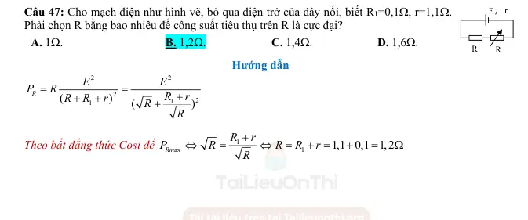
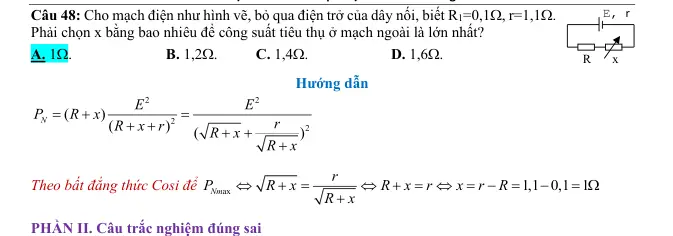
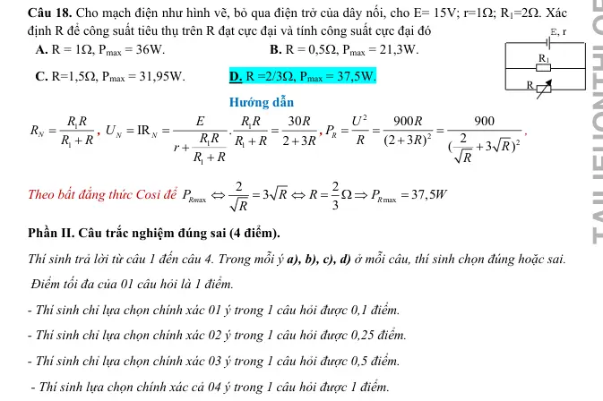

# Bài tập — Bài 8 — Kirchhoff, xếp chồng, nguồn tương đương và mạch RC

> Hệ bài tập được biên soạn theo các dạng xuất hiện trong bộ tài liệu Vật lí 11 của dự án. Câu hỏi được giữ ngắn, trực tiếp; độ khó tăng dần và không cố tình thêm dữ kiện gây nhiễu.

[← Trở lại bài học](../../08-advanced-circuit-methods.md)

## Phần A — Trắc nghiệm 4 lựa chọn

### Câu 1 — Mức 1 — Nhận biết

Định luật nút Kirchhoff dựa trên

A. bảo toàn điện tích.  
B. bảo toàn khối lượng cơ học.  
C. định luật phản xạ ánh sáng.  
D. lực Lorentz.

### Câu 2 — Mức 1 — Nhận biết

Định luật vòng Kirchhoff phát biểu tổng đại số các độ tăng và sụt điện thế quanh một vòng kín bằng

A. 1.  
B. 0.  
C. vô hạn.  
D. dòng điện.

### Câu 3 — Mức 1 — Nhận biết

Định lí Thévenin cho phép thay mạng tuyến tính nhìn từ hai cực bằng

A. một nguồn áp Thévenin nối tiếp điện trở Thévenin.  
B. chỉ một điện trở bằng 0.  
C. chỉ một tụ điện.  
D. một nguồn dòng nối tiếp điện trở.

### Câu 4 — Mức 1 — Nhận biết

Trong trạng thái xác lập DC lâu dài, tụ điện lí tưởng trong nhánh mạch được xem gần như

A. dây dẫn ngắn mạch.  
B. nhánh hở đối với dòng một chiều.  
C. nguồn dòng.  
D. điện trở âm.

## Phần B — Đúng/Sai

### Câu 5 — Mức 2 — Thông hiểu

Về phương pháp mạch nâng cao:

a) Kirchhoff dùng được cho mạng nhiều vòng.  
b) Xếp chồng áp dụng cho mạng tuyến tính với nhiều nguồn độc lập.  
c) Khi “tắt” nguồn áp lí tưởng trong xếp chồng, thay nó bằng ngắn mạch.  
d) Khi “tắt” nguồn dòng lí tưởng, thay bằng ngắn mạch.

### Câu 6 — Mức 2 — Thông hiểu

Tụ điện trong mạch DC:

a) Ngay sau thao tác đóng/ngắt, điện áp trên tụ không thể nhảy đột ngột trong mô hình lí tưởng nếu không có dòng xung vô hạn.  
b) Ở xác lập lâu dài, dòng qua tụ bằng 0.  
c) Năng lượng tụ là $\frac12CU^2$.  
d) Tụ luôn tương đương ngắn mạch ở mọi thời điểm.

## Phần C — Trả lời ngắn

### Câu 7 — Mức 3 — Vận dụng

Tại một nút có dòng $I_1=2$ A và $I_2=1,5$ A đi vào; dòng $I_3=0,8$ A đi ra và dòng I4 chưa biết đi ra. Tính I4.

### Câu 8 — Mức 3 — Vận dụng

Một nguồn Thévenin có $V_{th}=12$ V, $R_{th}=3\,\Omega$ cấp tải $R_L=9\,\Omega$. Tính dòng và áp tải.

### Câu 9 — Mức 3 — Vận dụng

Tụ $C=100\,\mu$F được nạp đến 20 V. Tính điện tích và năng lượng trước khi chuyển mạch.

## Phần D — Vận dụng và vận dụng cao

### Câu 10 — Mức 4 — Vận dụng cao

Mạch hai vòng có một nguồn 12 V. Vòng trái gồm nguồn và R1=2 Ω; điện trở chung giữa hai vòng R3=4 Ω; vòng phải có R2=6 Ω. Chọn dòng vòng I1 theo chiều kim đồng hồ ở vòng trái và I2 theo chiều kim đồng hồ ở vòng phải, nên dòng qua R3 theo hướng vòng trái là I1-I2. Lập và giải hệ dòng vòng.

---

[Đáp án và lời giải →](solutions.md)

## Ngân hàng bài tập PDF mở rộng

> Nội dung câu hỏi và dữ kiện trong phần này được giữ nguyên; hệ thống chỉ chuẩn hóa xuống dòng và mã kí tự để hiển thị trên web. Câu trùng được loại bỏ. Với câu có công thức/kí hiệu bị sai khi trích xuất chữ từ PDF, đề bài được giữ dưới dạng ảnh để không làm thay đổi dữ kiện.

### Nhận biết — Trả lời ngắn

#### Bài PDF 1

<!-- source-id: BT-Chuong-IV-p113-q6-348 -->

Câu 6. Cho sơ đồ mạch điện như hình vẽ
1
15V, r
1 ,R
2
=
= Ω
= Ω
E
.Biết công
suất tiêu thụ trên R lớn nhất. R có giá trị bao nhiêu Ω? (Kết quả làm tròn sau
dấu phẩy hai chữ số thập phân)

{ loading=lazy }

### Nhận biết — Trắc nghiệm 4 lựa chọn

#### Bài PDF 2

<!-- source-id: BT-Chuong-IV-p32-q5-110 -->

Câu 5. Tại sao cần sử dụng cầu chì trong mạch điện gia đình?
A. Để làm mạch hoạt động hiệu quả hơn.
B. Để bảo vệ các thiết bị khi dòng điện vượt mức cho phép.
C. Để tăng công suất cho mạch điện.
D. Để giảm điện trở trong mạch.

#### Bài PDF 3

<!-- source-id: BT-Chuong-IV-p38-q8-138 -->

Câu 8. Để bóng đèn 120 V – 60 W sáng bình thường ở mạng điện có hiệu điện thế 220 V người ta mắc
nối tiếp nó với điện trở R có giá trị là
A. 240 Ω.

B. 200 Ω.

C. 120 Ω.
D. 180 Ω.

#### Bài PDF 4

<!-- source-id: BT-Chuong-IV-p101-q40-302 -->

Câu 40. Cho mạch điện như hình. Nguồn điện có hiệu điện thế U không
đổi, điện trở R0 = 5 Ωkhông đổi. Xác định R để công suất tiêu thụ trên R là
cực đại.
A. R = 5 Ω.

B. R = 10 Ω.

C. R = 2,5 Ω.
D. R = 3,5 Ω.

{ loading=lazy }

#### Bài PDF 5

<!-- source-id: BT-Chuong-IV-p102-q47-309 -->

Câu 47. Cho mạch điện như hình vẽ, bỏ qua điện trở của dây nối, biết R1=0,1Ω, r=1,1Ω.
Phải chọn R bằng bao nhiêu để công suất tiêu thụ trên R là cực đại?
A. 1Ω.

B. 1,2Ω.

C. 1,4Ω.

D. 1,6Ω.

{ loading=lazy }

#### Bài PDF 6

<!-- source-id: BT-Chuong-IV-p103-q48-310 -->

Câu 48. Cho mạch điện như hình vẽ, bỏ qua điện trở của dây nối, biết R1=0,1Ω, r=1,1Ω.
Phải chọn x bằng bao nhiêu để công suất tiêu thụ ở mạch ngoài là lớn nhất?
A. 1Ω.

B. 1,2Ω.
C. 1,4Ω.

D. 1,6Ω.

{ loading=lazy }

#### Bài PDF 7

<!-- source-id: BT-Chuong-IV-p109-q18-338 -->

Câu 18. Cho mạch điện như hình vẽ, bỏ qua điện trở của dây nối, cho E= 15V; r=1Ω; R1=2Ω. Xác
định R để công suất tiêu thụ trên R đạt cực đại và tính công suất cực đại đó
A. R = 1Ω, Pmax = 36W.

B. R = 0,5Ω, Pmax = 21,3W.
C. R=1,5Ω, Pmax = 31,95W.
D. R =2/3Ω, Pmax = 37,5W.

{ loading=lazy }

### Thông hiểu — Trắc nghiệm 4 lựa chọn

#### Bài PDF 8

<!-- source-id: BT-Chuong-IV-p95-q16-278 -->

Câu 16. Công suất định mức của các dụng cụ điện là công suất
A. lớn nhất mà dụng cụ đó có thể đạt được.
B. tối thiểu mà dụng cụ đó có thể đạt được.
C. mà dụng cụ đó đạt được khi hoạt động bình thường.
D. mà dụng cụ đó có thể đạt được bất cứ lúc nào.

