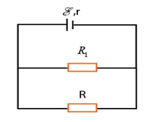
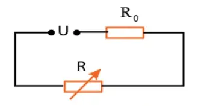
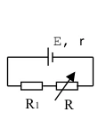
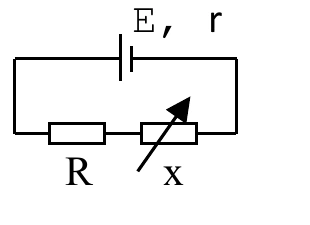
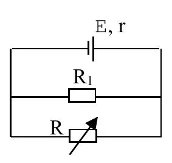

# Bài tập — Bài 8 — Kirchhoff, xếp chồng, nguồn tương đương và mạch RC

> Hệ bài tập được biên soạn theo các dạng xuất hiện trong bộ tài liệu Vật lí 11 của dự án. Câu hỏi được giữ ngắn, trực tiếp; độ khó tăng dần và không cố tình thêm dữ kiện gây nhiễu.

[← Trở lại bài học](../../08-advanced-circuit-methods.md)

## Phần A — Trắc nghiệm 4 lựa chọn

### Bài 1 — Mức 1 — Nhận biết

Định luật nút Kirchhoff dựa trên

A. bảo toàn điện tích.

B. bảo toàn khối lượng cơ học.

C. định luật phản xạ ánh sáng.

D. lực Lorentz.

??? success "Đáp án và lời giải"
    Chọn **A**: tổng dòng vào nút bằng tổng dòng ra ở trạng thái ổn định.

### Bài 2 — Mức 1 — Nhận biết

Định luật vòng Kirchhoff phát biểu tổng đại số các độ tăng và sụt điện thế quanh một vòng kín bằng

A. 1.

B. 0.

C. vô hạn.

D. dòng điện.

??? success "Đáp án và lời giải"
    Chọn **B**.

### Bài 3 — Mức 1 — Nhận biết

Định lí Thévenin cho phép thay mạng tuyến tính nhìn từ hai cực bằng

A. một nguồn áp Thévenin nối tiếp điện trở Thévenin.

B. chỉ một điện trở bằng 0.

C. chỉ một tụ điện.

D. một nguồn dòng nối tiếp điện trở.

??? success "Đáp án và lời giải"
    Chọn **A**.

### Bài 4 — Mức 1 — Nhận biết

Trong trạng thái xác lập DC lâu dài, tụ điện lí tưởng trong nhánh mạch được xem gần như

A. dây dẫn ngắn mạch.

B. nhánh hở đối với dòng một chiều.

C. nguồn dòng.

D. điện trở âm.

??? success "Đáp án và lời giải"
    Chọn **B**.

## Phần B — Đúng/Sai

### Bài 5 — Mức 2 — Thông hiểu

Về phương pháp mạch nâng cao:

a) Kirchhoff dùng được cho mạng nhiều vòng.

b) Xếp chồng áp dụng cho mạng tuyến tính với nhiều nguồn độc lập.

c) Khi “tắt” nguồn áp lí tưởng trong xếp chồng, thay nó bằng ngắn mạch.

d) Khi “tắt” nguồn dòng lí tưởng, thay bằng ngắn mạch.

??? success "Đáp án và lời giải"
    a) **Đúng**.
    b) **Đúng**.
    c) **Đúng**.
    d) **Sai**: nguồn dòng lí tưởng bị thay bằng hở mạch.

### Bài 6 — Mức 2 — Thông hiểu

Tụ điện trong mạch DC:

a) Ngay sau thao tác đóng/ngắt, điện áp trên tụ không thể nhảy đột ngột trong mô hình lí tưởng nếu không có dòng xung vô hạn.

b) Ở xác lập lâu dài, dòng qua tụ bằng 0.

c) Năng lượng tụ là $\frac12CU^2$.

d) Tụ luôn tương đương ngắn mạch ở mọi thời điểm.

??? success "Đáp án và lời giải"
    a) **Đúng**.
    b) **Đúng**.
    c) **Đúng**.
    d) **Sai**.

## Phần C — Trả lời ngắn

### Bài 7 — Mức 3 — Vận dụng

Tại một nút có dòng $I_1=2$ A và $I_2=1,5$ A đi vào; dòng $I_3=0,8$ A đi ra và dòng I4 chưa biết đi ra. Tính I4.

??? success "Đáp án và lời giải"
    Bảo toàn điện tích tại nút: $I_1+I_2=I_3+I_4$. $I_4=2+1,5-0,8=2,7$ A.

### Bài 8 — Mức 3 — Vận dụng

Một nguồn Thévenin có $V_{th}=12$ V, $R_{th}=3\,\Omega$ cấp tải $R_L=9\,\Omega$. Tính dòng và áp tải.

??? success "Đáp án và lời giải"
    $I=V_{th}/(R_{th}+R_L)=12/12=1$ A. $U_L=IR_L=9$ V.

### Bài 9 — Mức 3 — Vận dụng

Tụ $C=100\,\mu$F được nạp đến 20 V. Tính điện tích và năng lượng trước khi chuyển mạch.

??? success "Đáp án và lời giải"
    $Q=CU=100\cdot10^{-6}\cdot20=2\cdot10^{-3}$ C. $W=\frac12CU^2=0,5\cdot100\cdot10^{-6}\cdot400=0,020$ J.

## Phần D — Vận dụng và vận dụng cao

### Bài 10 — Mức 4 — Vận dụng cao

Mạch hai vòng có một nguồn 12 V. Vòng trái gồm nguồn và R1=2 Ω; điện trở chung giữa hai vòng R3=4 Ω; vòng phải có R2=6 Ω. Chọn dòng vòng I1 theo chiều kim đồng hồ ở vòng trái và I2 theo chiều kim đồng hồ ở vòng phải, nên dòng qua R3 theo hướng vòng trái là I1-I2. Lập và giải hệ dòng vòng.

??? success "Đáp án và lời giải"
    Phương trình vòng trái:

    $12-2I_1-4(I_1-I_2)=0$, hay $6I_1-4I_2=12$.

    Vòng phải không có nguồn:

    $-6I_2-4(I_2-I_1)=0$, hay $-4I_1+10I_2=0$.

    Từ phương trình hai: $I_1=2,5I_2$. Thay vào phương trình một:

    $6(2,5I_2)-4I_2=12\Rightarrow11I_2=12$.

    $I_2=12/11\approx1,091$ A; $I_1=30/11\approx2,727$ A.

    Dòng qua R3 theo hướng vòng trái: $I_3=I_1-I_2=18/11\approx1,636$ A.

## Ngân hàng bài tập mở rộng

### Nhận biết — Trả lời ngắn

#### Bài 11

<!-- source-id: BT-Chuong-IV-p113-q6-348 -->

Cho sơ đồ mạch điện như hình vẽ, biết $\mathcal E=15\,\mathrm V$, $r=1\,\Omega$, $R_1=2\,\Omega$. Biết công suất tiêu thụ trên $R$ lớn nhất. Giá trị của $R$ bằng bao nhiêu $\Omega$? (Kết quả làm tròn đến hai chữ số thập phân.)

{ loading=lazy }

??? success "Đáp án và lời giải"
    **Đáp án:** $0{,}67\,\Omega$.

    **Hướng dẫn giải:**
    Điện trở mạch ngoài là $R_N=R_1\parallel R=\dfrac{2R}{2+R}$, nên
    $I=\dfrac{\mathcal E}{R_N+r}=\dfrac{15(2+R)}{3R+2}$.

    Hiệu điện thế hai đầu $R$:
    $U=IR_N=\dfrac{30R}{3R+2}$.

    Vì vậy
    $P_R=\dfrac{U^2}{R}=\dfrac{900R}{(3R+2)^2}=\dfrac{900}{9R+12+4/R}$.

    Theo AM-GM, $9R+4/R\ge12$, dấu bằng khi $9R=4/R$, tức $R=2/3\,\Omega\approx0{,}67\,\Omega$.
### Nhận biết — Trắc nghiệm 4 lựa chọn

#### Bài 12

<!-- source-id: BT-Chuong-IV-p32-q5-110 -->

Tại sao cần sử dụng cầu chì trong mạch điện gia đình?

A. Để làm mạch hoạt động hiệu quả hơn.

B. Để bảo vệ các thiết bị khi dòng điện vượt mức cho phép.

C. Để tăng công suất cho mạch điện.

D. Để giảm điện trở trong mạch.

??? success "Đáp án và lời giải"
    **Đáp án:** B
    **Hướng dẫn giải:**
    Cầu chì ngắt mạch khi dòng điện quá lớn, bảo vệ thiết bị khỏi hư hại

#### Bài 13

<!-- source-id: BT-Chuong-IV-p38-q8-138 -->

Để bóng đèn $120\,\mathrm V-60\,\mathrm W$ sáng bình thường ở mạng điện có hiệu điện thế $220\,\mathrm V$, người ta mắc nối tiếp nó với điện trở $R$ có giá trị là

A. $240\,\Omega$.

B. $200\,\Omega$.

C. $120\,\Omega$.

D. $180\,\Omega$.

??? success "Đáp án và lời giải"
    **Đáp án:** B

    **Hướng dẫn giải:**
    Khi đèn sáng bình thường, $I=P/U=60/120=0{,}5\,\mathrm A$.

    Điện trở định mức của đèn là $R_\text{đ}=U^2/P=120^2/60=240\,\Omega$.

    Tổng điện trở nối tiếp cần có là $R_\text{tđ}=220/0{,}5=440\,\Omega$, nên
    $R=440-240=200\,\Omega$.

    Chọn **B**.
#### Bài 14

<!-- source-id: BT-Chuong-IV-p101-q40-302 -->

Cho mạch điện như hình. Nguồn điện có hiệu điện thế $U$ không đổi, điện trở $R_0=5\,\Omega$ không đổi. Xác định $R$ để công suất tiêu thụ trên $R$ là cực đại.

{ loading=lazy }

A. $R=5\,\Omega$.

B. $R=10\,\Omega$.

C. $R=2{,}5\,\Omega$.

D. $R=3{,}5\,\Omega$.

??? success "Đáp án và lời giải"
    **Đáp án:** A

    **Hướng dẫn giải:**

    Cường độ dòng điện là
    $I=\frac{U}{R_0+R}.$
    Công suất trên $R$:
    $P_R=I^2R=\frac{U^2R}{(R_0+R)^2} =\frac{U^2}{R+\dfrac{R_0^2}{R}+2R_0}.$
    Theo AM-GM, $R+\dfrac{R_0^2}{R}\ge2R_0$, dấu bằng khi $R=R_0=5\,\Omega$. Vì vậy $P_R$ cực đại khi $R=5\,\Omega$.

    Chọn **A**.
#### Bài 15

<!-- source-id: BT-Chuong-IV-p102-q47-309 -->

Cho mạch điện như hình vẽ, bỏ qua điện trở của dây nối, biết $R_1=0{,}1\,\Omega$, $r=1{,}1\,\Omega$. Phải chọn $R$ bằng bao nhiêu để công suất tiêu thụ trên $R$ là cực đại?

{ loading=lazy }

A. $1\,\Omega$.

B. $1{,}2\,\Omega$.

C. $1{,}4\,\Omega$.

D. $1{,}6\,\Omega$.

??? success "Đáp án và lời giải"
    **Đáp án:** B

    **Hướng dẫn giải:**

    Dòng điện trong mạch là $I=\dfrac{E}{R+R_1+r}$, nên
    $P_R=I^2R =\frac{E^2R}{(R+R_1+r)^2} =\frac{E^2}{R+\dfrac{(R_1+r)^2}{R}+2(R_1+r)}.$
    Công suất cực đại khi $R=R_1+r=0{,}1+1{,}1=1{,}2\,\Omega$.

    Chọn **B**.
#### Bài 16

<!-- source-id: BT-Chuong-IV-p103-q48-310 -->

Cho mạch điện như hình vẽ, bỏ qua điện trở của dây nối, biết $R_1=0{,}1\,\Omega$, $r=1{,}1\,\Omega$. Phải chọn $x$ bằng bao nhiêu để công suất tiêu thụ ở mạch ngoài là lớn nhất?

{ loading=lazy }

A. $1\,\Omega$.

B. $1{,}2\,\Omega$.

C. $1{,}4\,\Omega$.

D. $1{,}6\,\Omega$.

??? success "Đáp án và lời giải"
    **Đáp án:** A

    **Hướng dẫn giải:**

    Điện trở mạch ngoài là $R_N=R_1+x$. Công suất tiêu thụ ở mạch ngoài:
    $P_N=\frac{E^2R_N}{(R_N+r)^2}.$
    Công suất mạch ngoài cực đại khi $R_N=r$, do đó
    $R_1+x=r \Rightarrow x=r-R_1=1{,}1-0{,}1=1\,\Omega.$

    Chọn **A**.
#### Bài 17

<!-- source-id: BT-Chuong-IV-p109-q18-338 -->

Cho mạch điện như hình vẽ, bỏ qua điện trở của dây nối, cho $E=15\,\mathrm V$, $r=1\,\Omega$, $R_1=2\,\Omega$. Xác định $R$ để công suất tiêu thụ trên $R$ đạt cực đại và tính công suất cực đại đó.

{ loading=lazy }

A. $R=1\,\Omega$, $P_{\max}=36\,\mathrm W$.

B. $R=0{,}5\,\Omega$, $P_{\max}=21{,}3\,\mathrm W$.

C. $R=1{,}5\,\Omega$, $P_{\max}=31{,}95\,\mathrm W$.

D. $R=\dfrac{2}{3}\,\Omega$, $P_{\max}=37{,}5\,\mathrm W$.

??? success "Đáp án và lời giải"
    **Đáp án:** D

    **Hướng dẫn giải:**

    Điện trở mạch ngoài tương đương là $R_N=\dfrac{R_1R}{R_1+R}$. Với $E=15\,\mathrm V$, $r=1\,\Omega$, $R_1=2\,\Omega$, hiệu điện thế hai đầu $R$ là
    $U=\frac{30R}{2+3R}.$
    Do đó
    $P_R=\frac{U^2}{R} =\frac{900R}{(2+3R)^2} =\frac{900}{\dfrac{4}{R}+12+9R}.$
    Theo AM-GM, $\dfrac{4}{R}+9R\ge12$, dấu bằng khi $\dfrac{4}{R}=9R$, tức $R=\dfrac{2}{3}\,\Omega$. Khi đó
    $P_{\max}=\frac{900}{24}=37{,}5\,\mathrm W.$

    Chọn **D**.
### Thông hiểu — Trắc nghiệm 4 lựa chọn

#### Bài 18

<!-- source-id: BT-Chuong-IV-p95-q16-278 -->

Công suất định mức của các dụng cụ điện là công suất

A. lớn nhất mà dụng cụ đó có thể đạt được.

B. tối thiểu mà dụng cụ đó có thể đạt được.

C. mà dụng cụ đó đạt được khi hoạt động bình thường.

D. mà dụng cụ đó có thể đạt được bất cứ lúc nào.

??? success "Đáp án và lời giải"
    **Đáp án:** C

    **Hướng dẫn giải:**

    Công suất định mức là công suất của dụng cụ khi hoạt động bình thường ở các điều kiện định mức. Vì vậy chọn **C**.
