# Bài tập — Bài 9 — Thực hành đo suất điện động và điện trở trong của pin

> Hệ bài tập được biên soạn theo các dạng xuất hiện trong bộ tài liệu Vật lí 11 của dự án. Câu hỏi được giữ ngắn, trực tiếp; độ khó tăng dần và không cố tình thêm dữ kiện gây nhiễu.

[← Trở lại bài học](../../09-practical-emf-internal-resistance.md)

## Phần A — Trắc nghiệm 4 lựa chọn

### Câu 1 — Mức 1 — Nhận biết

Khi đo quan hệ U–I của nguồn đang phát điện, đồ thị lí tưởng có dạng

A. $U=\mathcal E-rI$.  
B. $U=\mathcal E+rI$.  
C. $U=r/I$.  
D. $U=0$ mọi I.

### Câu 2 — Mức 1 — Nhận biết

Trên đồ thị U theo I của nguồn, tung độ gốc biểu diễn

A. điện trở ngoài.  
B. suất điện động $\mathcal E$.  
C. công suất.  
D. điện lượng.

### Câu 3 — Mức 1 — Nhận biết

Độ lớn hệ số góc của đường thẳng U–I bằng

A. $\mathcal E$.  
B. r.  
C. R ngoài.  
D. I ngắn mạch.

### Câu 4 — Mức 1 — Nhận biết

Trong thí nghiệm, thao tác nào không an toàn cho nguồn thực?

A. Thay đổi biến trở để lấy nhiều điểm U–I.  
B. Đo U và I trong giới hạn dụng cụ.  
C. Nối tắt trực tiếp nguồn trong thời gian dài để đo dòng ngắn mạch.  
D. Mở khóa K giữa các lần chỉnh mạch.

## Phần B — Đúng/Sai

### Câu 5 — Mức 2 — Thông hiểu

Thí nghiệm xác định $\mathcal E,r$:

a) Cần đo nhiều cặp (I,U) để giảm ảnh hưởng sai số.  
b) Có thể lấy $\mathcal E$ từ giao điểm trục U.  
c) r lấy từ độ lớn độ dốc của đồ thị U theo I.  
d) Chỉ cần một cặp U,I bất kì là luôn xác định được cả $\mathcal E$ và r mà không có dữ kiện khác.

### Câu 6 — Mức 2 — Thông hiểu

Với nguồn đang phát điện:

a) U giảm gần tuyến tính khi I tăng nếu $\mathcal E,r$ không đổi.  
b) I=0 cho U=$\mathcal E$.  
c) Giao điểm trục I của đường kéo dài là $I_{sc}=\mathcal E/r$.  
d) Nên luôn trực tiếp đo I_sc để chính xác nhất.

## Phần C — Trả lời ngắn

### Câu 7 — Mức 3 — Vận dụng

Hai điểm đo: $(I_1,U_1)=(0,5\text{ A},5,7\text{ V})$ và $(I_2,U_2)=(1,5\text{ A},5,1\text{ V})$. Tính r và $\mathcal E$.

### Câu 8 — Mức 3 — Vận dụng

Đồ thị U–I đi qua $(0,6\text{ A},8,7\text{ V})$ và $(1,8\text{ A},8,1\text{ V})$. Tính $\mathcal E,r$.

### Câu 9 — Mức 3 — Vận dụng

Nguồn có $\mathcal E=3,0$ V, $r=0,40\,\Omega$. Dự đoán U khi I=2,0 A.

## Phần D — Vận dụng và vận dụng cao

### Câu 10 — Mức 4 — Vận dụng cao

Bốn cặp số đo $(I,U)$ là: (0,5 A; 5,82 V), (1,0 A; 5,61 V), (1,5 A; 5,39 V), (2,0 A; 5,20 V). Hãy ước tính r và $\mathcal E$ bằng cách dùng hai điểm đầu–cuối, sau đó kiểm tra hai điểm giữa có phù hợp gần đúng không.

---

[Đáp án và lời giải →](solutions.md)

## Ngân hàng bài tập PDF mở rộng

> Nội dung câu hỏi và dữ kiện trong phần này được giữ nguyên; hệ thống chỉ chuẩn hóa xuống dòng và mã kí tự để hiển thị trên web. Câu trùng được loại bỏ. Với câu có công thức/kí hiệu bị sai khi trích xuất chữ từ PDF, đề bài được giữ dưới dạng ảnh để không làm thay đổi dữ kiện.

### Nhận biết — Trả lời ngắn

#### Bài PDF 1

<!-- source-id: BT-Chuong-IV-p130-q1-379 -->

Câu 1. Khi thực hiện thí nghiệm đo suất điện động ξ và điện trở trong r của nguồn, điều chỉnh biến trở tại vị
trí 90 Ω, ta thu được các kết quả của hiệu điện thế lần lượt là 2,84 V; 2,86 V; 2,87 V. Giá trị trung bình của
hiệu điện thế trong trường hợp này (theo đơn vị V và đúng với số chữ số có nghĩa của phép đo) là bao nhiêu?

#### Bài PDF 2

<!-- source-id: BT-Chuong-IV-p130-q2-380 -->

Câu 2. Khi thực hiện thí nghiệm đo suất điện động ξ và điện trở trong r của nguồn, điều chỉnh biến trở tại vị
trí 90 Ω, ta thu được các kết quả của hiệu điện thế lần lượt là 2,84 V; 2,86 V; 2,87 V. Giá trị sai số tuyệt đối
trung bình của hiệu điện thế trong trường hợp này (theo đơn vị V và đúng với số chữ số có nghĩa của phép
đo) là bao nhiêu? Bỏ qua sai số dụng cụ.

#### Bài PDF 3

<!-- source-id: BT-Chuong-IV-p130-q3-381 -->

Câu 3. Một học sinh thực hiện thí nghiệm đo suất điện động ξ và điện trở trong r của nguồn và vẽ được đồ
thị mô tả mối quan hệ giữa U – I như hình bên dưới. Hãy ước lượng giá trị suất điện động ξ (V) của nguồn.

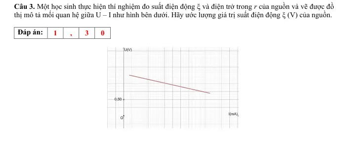{ loading=lazy }

#### Bài PDF 4

<!-- source-id: BT-Chuong-IV-p131-q4-382 -->

Câu 4. Một học sinh thực hiện thí nghiệm đo suất điện động ξ và điện trở trong r của nguồn và vẽ được đồ
thị mô tả mối quan hệ giữa U – I như hình bên dưới. Hãy xác định giá trị điện trở trong r (Ω) của nguồn.

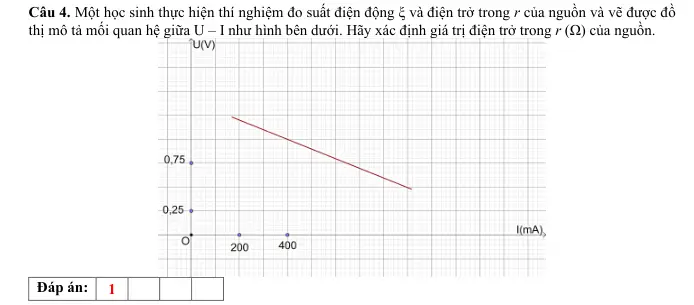{ loading=lazy }

### Nhận biết — Trắc nghiệm 4 lựa chọn

#### Bài PDF 5

<!-- source-id: BT-Chuong-IV-p118-q6-354 -->

Câu 6. Ta có thể không thể sử dụng đồ hồ đa năng để đo trực tiếp đại lượng nào sau đây?
A. Suất điện động của nguồn.
B. Hiệu điện thế giữa hai cực của đoạn mạch.
C. Điện trở trong của nguồn.
D. Dòng điện chạy trong đoạn mạch.

#### Bài PDF 6

<!-- source-id: BT-Chuong-IV-p119-q8-356 -->

Câu 8. Khi ta sử dụng đồng hồ điện đa năng hiện số như hình . Để tiến hành đo hiệu điện thế giữa
hai đầu mạch điện thì ta xoay núm vặn về chế độ đo hiệu điện thế DC và cần
nối dây vào

A. (3) và (4).

C. (1) và (3).
B. (2) và (3).

D. (1) và (4).

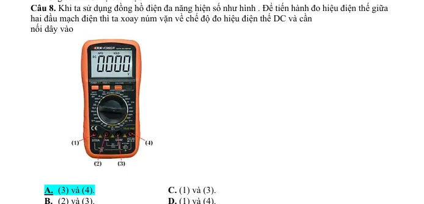{ loading=lazy }

#### Bài PDF 7

<!-- source-id: BT-Chuong-IV-p119-q9-357 -->

Câu 9. Những dụng cụ chính để đo suất điện động ξ và điện trở trong r của nguồn trong phòng thí
nghiệm là
A. pin điện hóa; điện trở có giá trị xác định; hai đồng hồ điện đa năng hiện số; khóa K; bảng lắp mạch
điện và dây nối.
B. pin điện hóa; biến trở 100 Ω; điện trở có giá trị xác định; hai đồng hồ điện đa năng hiện số; khóa K;
bảng lắp mạch điện và dây nối.
C. pin điện hóa; biến trở 100 Ω; điện trở có giá trị xác định; hai đồng hồ điện đa năng hiện số; khóa K
và bảng lắp mạch điện.
D. pin điện hóa; biến trở 100 Ω; điện trở có giá trị xác định; hai đồng hồ điện đa năng hiện số; khóa K;
bảng từ và dây nối.

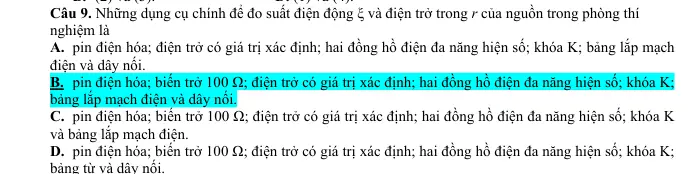{ loading=lazy }

#### Bài PDF 8

<!-- source-id: BT-Chuong-IV-p119-q11-359 -->

Câu 11. Bên dưới là các hình ảnh của một dụng cụ dùng trong thí nghiệm đo suất điện động ξ và điện
trở trong r. Tên của loại dụng cụ này là

A.  biến trở.

C. nguồn điện.
B. đồng hồ điện đa năng hiện số.

D. máy biến áp.

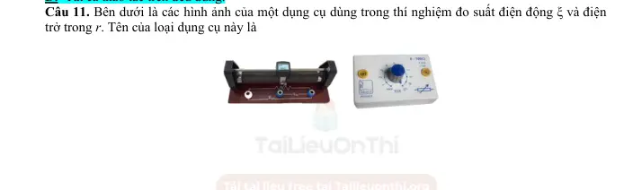{ loading=lazy }

#### Bài PDF 9

<!-- source-id: BT-Chuong-IV-p120-q12-360 -->

Câu 12. Dụng cụ nào sau đây được sử dụng trong bộ thí nghiệm đo suất điện động ξ và điện trở
trong r?

Hình 1. Pin điện hóa Hình 2. Máy phát tần số
Hình 3. Khóa K
Hình 4. Dây dẫn
A.  Hình 1,2,3.
B. Hình 2,3,4.
C. Hình 1,3,4.
D. Hình 1,2,4.

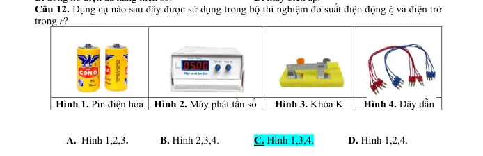{ loading=lazy }

#### Bài PDF 10

<!-- source-id: BT-Chuong-IV-p120-q14-362 -->

Câu 14. Khi vẽ đồ thị mô tả U – I trong bài thí nghiệm đo suất điện động ξ và điện trở trong r thì
ta sẽ thu được đồ thị có dạng

   A.  Hình 1.
B. Hình 2.

C. Hình 3.

D. Hình 4.

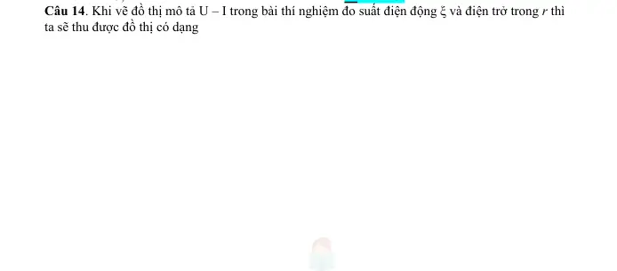{ loading=lazy }

#### Bài PDF 11

<!-- source-id: BT-Chuong-IV-p121-q16-364 -->

Câu 16. Hãy sắp xếp các bước thực hiện thí nghiệm đo suất điện động ξ
và điện trở trong r của nguồn với dụng cụ được bố trí như sơ đồ.
(I). Ghi giá trị hiệu điện thế U và cường độ dòng điện I trên đồng hồ.
Ngắt khóa K. Lặp lại 4 lần các bước 2, 3, 4 với giá trị Rx giảm dần.
(II). Chọn hai điểm A và B bất kì trên đồ thị với các giá trị U, I tương
ứng và xác định điện trở trong bằng công thức:
r = UA −UB
IB −IA

(III). Điều chỉnh biến trở đến giá trị Rx = 100 Ω. Đóng khóa K, bật đồng hồ đo hiệu điện thế và
cường độ dòng điện.
(IV). Đánh dấu các điểm thực nghiệm lên hệ trục tọa độ (U – I) và vẽ đường thẳng đi gần nhất các
điểm thực nghiệm. Kéo dài đường độ thị cắt trục tung tại U0 và xác định suất điện động ξ của pin
chính bằng giá trị U0.
A. (I) – (III) – (IV) – (II).
B. (II) – (I) – (III) – (IV).
C. (III) – (I) – (IV) – (II).
D. (III) – (I) – (II) – (IV).

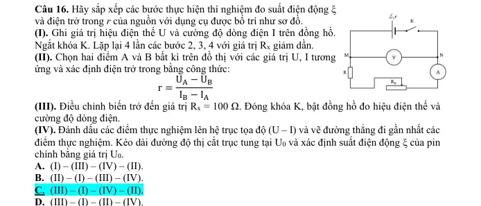{ loading=lazy }

#### Bài PDF 12

<!-- source-id: BT-Chuong-IV-p121-q17-365 -->

Câu 17. Khóa K có tác dụng
A. hiển thị giá trị hiệu điện thế giữa hai đầu mạch điện.
B. hiển thị giá trị cường độ dòng điện chạy trong mạch.
C. tạo thành mạch điện kín hoặc mạch hở.
D. điều chỉnh điện trở tương đương trong mạch.

#### Bài PDF 13

<!-- source-id: BT-Chuong-IV-p123-q25-373 -->

Câu 25. Một học sinh thực hiện thí nghiệm đo suất điện động ξ và điện trở trong r của nguồn và vẽ
được đồ thị mô tả mối quan hệ giữa U – I như hình bên dưới. Hãy ước lượng giá trị suất điện động ξ
của nguồn.

A. 1,50 V.
B. 1,25 V.
C. 1,30 V.
D. 1,40 V.

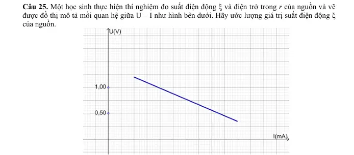{ loading=lazy }

#### Bài PDF 14

<!-- source-id: BT-Chuong-IV-p124-q26-374 -->

Câu 26. Một học sinh thực hiện thí nghiệm đo suất điện động ξ và điện trở trong r của nguồn và
vẽ được đồ thị mô tả mối quan hệ giữa U – I như hình bên dưới. Hãy xác định giá trị điện trở trong
r của nguồn.

𝐀.
A. 0,75 Ω.
B. 0,56 Ω.
C. 0,37 Ω.
D. 0,45 Ω

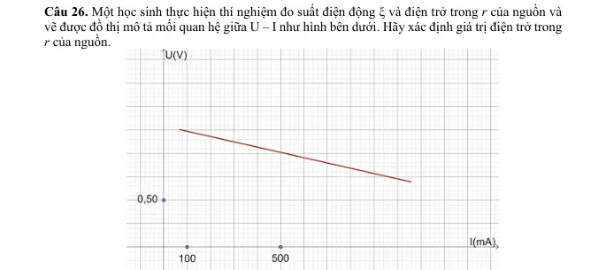{ loading=lazy }

### Nhận biết — Đúng/Sai

#### Bài PDF 15

<!-- source-id: BT-Chuong-IV-p126-q1-375 -->

Câu 1. Để thực hiện thí nghiệm đo suất điện động ξ và điện trở trong r của nguồn, dụng cụ thí nghiệm được
bố trí như sơ đồ. Xác định nhận định sau đây đúng hay sai?

Phát biểu
Đúng
Sai
a
Ta cần kiểm tra thiết bị, dụng cụ thí nghiệm trước khi tiến hành thí nghiệm nhằm
đảm bảo các quy tắc an toàn trong phòng thí nghiệm.
Đ

b
Biến trở có công dụng điều chỉnh điện trở trong của nguồn.

S
c
Khi ta vẽ đồ thị mô tả mối liên hệ giữa (U – I), đường thẳng kéo dài cách trục tung
tại một điểm mà tại đó UMN = ξ.
Đ

d
Trong quá trình thực hiện thí nghiệm, việc lựa chọn thang đo trên đồng hồ đo điện
đa năng không làm ảnh hưởng đến kết quả.

S

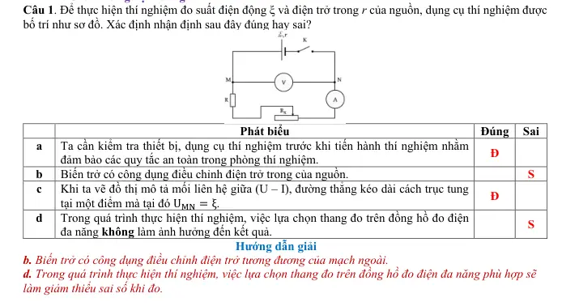{ loading=lazy }

#### Bài PDF 16

<!-- source-id: BT-Chuong-IV-p126-q2-376 -->

Câu 2. Để thực hiện thí nghiệm đo suất điện động ξ và điện trở trong r của nguồn, dụng cụ thí nghiệm được
bố trí như sơ đồ. Người ta sử dụng đồng hồ đo điện đa năng như hình bên dưới để thu nhận các giá trị hiệu
điện thế, cường độ dòng điện trong mạch. Xác định nhận định sau đây đúng hay sai?

Phát biểu
Đúng
Sai
a
Điện trở giúp kiểm soát cường độ dòng điện chạy trong mạch, tránh việc quá tải
trong mạch.
Đ

b
Khi ta vẽ đồ thị mô tả mối liên hệ giữa (U – I), nếu ta chọn 2 điểm A, B nằm trên
đồ thị thì điện trở trong r của nguồn được tính bằng công thức:
r = UA −UB
IA −IB

S
c
Để thu được giá trị hiệu điện thế U  0 thì ta cần xoay núm của đồng hồ điện vặn
về chế độ đo hiệu điện thế DC; chân (4) nối với điểm M, chân (3) nối với điểm N.

S
d
Để đo cường độ dòng điện có độ lớn khoảng mA, ta cần xoay núm của đồng hồ điện
vặn về chế độ đo cường độ dòng điện DC và lựa chọn cổng số (2) và (3) trên đồng
hồ điện đo cường độ dòng điện trong mạch.
Đ

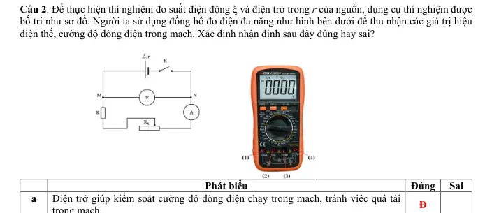{ loading=lazy }

#### Bài PDF 17

<!-- source-id: BT-Chuong-IV-p127-q3-377 -->

Câu 3. Để thực hiện thí nghiệm đo suất điện động ξ và điện trở trong r của nguồn, dụng cụ thí nghiệm được
bố trí như sơ đồ. Người ta sử dụng đồng hồ đo điện đa năng như hình bên dưới để thu nhận các giá trị hiệu
điện thế, cường độ dòng điện trong mạch và thu được đồ thị biểu diễn mối quan hệ giữa U – I như hình bên
dưới.

Phát biểu
Đúng
Sai
a
Khi thực hiện thí nghiệm, hạn chế việc đóng mở khóa K để tránh gây sai số.

S
b
Một trong những nguyên nhân gây ra sai số là do trong dây dẫn và đồng hồ đo điện
đa năng có điện trở.
Đ

c
Để thu được giá trị cường độ dòng điện (khoảng mA) I  0 thì ta cần xoay núm của
đồng hồ điện vặn về chế độ đo cường độ dòng điện DC; chân (3) nối tiếp với biến
trở, chân (2) nối tiếp với điểm N.
Đ

d
Suất điện động trong trường hợp này là 1,48 V.

S

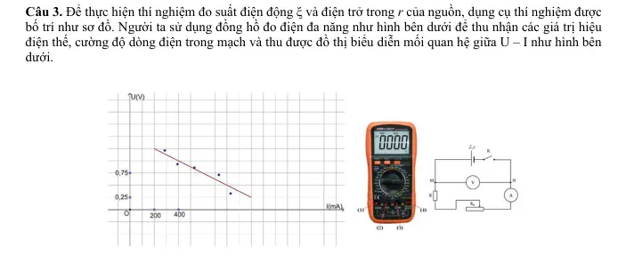{ loading=lazy }

#### Bài PDF 18

<!-- source-id: BT-Chuong-IV-p128-q4-378 -->

Câu 4. Để thực hiện thí nghiệm đo suất điện động ξ và điện trở trong r của nguồn, dụng cụ thí nghiệm được
bố trí như sơ đồ. Học sinh thu được đồ thị biểu diễn mối quan hệ giữa U – I như hình bên dưới.

Phát biểu
Đúng
Sai
a
Để hạn chế sai số, ta cần lựa chọn thang đo phù hợp trên đồng hồ đo điện đa năng.
Đ

b
Sau khi đã lắp xong mạch điện, học sinh tiến hành ngay việc lấy số liệu mà không
cần thông qua giáo viên.

S
c
Suất điện động trong trường hợp này là 1,50 V.
Đ

d
Điện trở trong trong trường hợp này là 1,25 Ω.
Đ

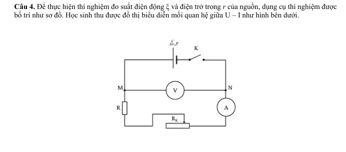{ loading=lazy }

### Thông hiểu — Trắc nghiệm 4 lựa chọn

#### Bài PDF 19

<!-- source-id: BT-Chuong-IV-p118-q1-349 -->

Câu 1. Ghép cột A và cột B tương ứng để thể hiện các dụng cụ thí nghiệm trong bài thực hành đo
suất điện động ξ và điện trở trong r của nguồn.
Cột A

Cột B
(1)

(a). Khóa K.
(2)

(b). Điện trở đã biết giá trị.
(3)

(c). Bảng lắp mạch điện.
(4)

(d). Pin điện hóa.
(5)

(e). Biến trở 100 Ω.
(6)

(f). Đồng hồ điện đa năng hiện số.
(7)

(g). Dây nối
A. (1) – (a); (2) – (f); (3) – (e); (4) – (c); (5) – (b); (6) – (d); (7) – (g).
B. (1) – (d); (2) – (e); (3) – (b); (4) – (f); (5) – (a); (6) – (c); (7) – (g).
C. (1) – (d); (2) – (b); (3) – (e); (4) – (f); (5) – (a); (6) – (c); (7) – (g).
D. (1) – (a); (2) – (d); (3) – (e); (4) – (f); (5) – (b); (6) – (c); (7) – (g).

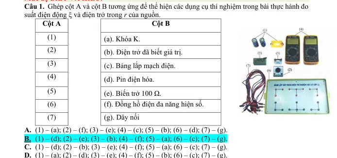{ loading=lazy }

### Vận dụng — Trắc nghiệm 4 lựa chọn

#### Bài PDF 20

<!-- source-id: BT-Chuong-IV-p122-q21-369 -->

Câu 21. Khi thực hiện thí nghiệm đo suất điện động ξ và điện trở trong r của nguồn. Điều chỉnh
biến trở tại vị trí 100 Ω, ta thu được các kết quả của hiệu điện thế lần lượt là 1,42 V; 1,41 V; 1,39
V. Giá trị trung bình của hiệu điện thế trong trường hợp này là
A. 1,42 V.
B. 1,41 V.
C. 1,40 V.
D. 1,39 V.

#### Bài PDF 21

<!-- source-id: BT-Chuong-IV-p122-q22-370 -->

Câu 22. Khi thực hiện thí nghiệm đo suất điện động ξ và điện trở trong r của nguồn. Điều chỉnh
biến trở tại vị trí 100 Ω, ta thu được các kết quả của cường độ dòng điện lần lượt là 51 mA; 54
mA; 52 mA. Bỏ qua sai số dụng cụ, Sai số tuyệt đối trung bình của cường độ dòng điện trong
trường hợp này  là
A. 1,0 A.
B. 1,0 mA.
C. 52 mA.
D. 52 A.

#### Bài PDF 22

<!-- source-id: BT-Chuong-IV-p122-q23-371 -->

Câu 23. Khi thực hiện thí nghiệm đo suất điện động ξ và điện trở trong r của nguồn, điều chỉnh
biến trở tại vị trí 90 Ω, ta thu được các kết quả của hiệu điện thế lần lượt là 1,38 V; 1,40 V; 1,37
V. Bỏ qua sai số của dụng cụ. Cách ghi kết quả thí nghiệm hiệu điện thế nào sau đây đúng với số
chữ số có nghĩa?
A. (1,38 ± 0,01) V.
B. (1,383 ± 0,010) V.
C. (1,4 ± 0,1) V.
D. (1,38 ± 0,02) V.

#### Bài PDF 23

<!-- source-id: BT-Chuong-IV-p123-q24-372 -->

Câu 24. Thực hiện thí nghiệm đo suất điện động ξ và điện trở trong r của nguồn. Điều chỉnh biến
trở tại vị trí 80 Ω, ta thu được các kết quả của hiệu điện thế lần lượt là 1,35 V; 1,32 V; 1,31 V. Biết
độ chia nhỏ nhất (ĐCNN) của Volt kế là 0,01V, sai số của dụng cụ đo bằng một nửa ĐCNN. Cách
ghi kết quả thí nghiệm hiệu điện thế nào sau đây đúng với số chữ số có nghĩa?
A.  (1,3 ± 0,1)V.
B. (1,327 ± 0,018) V.
C. (1,32 ± 0,01)V.
D. (1,32 ± 0,02) V.

