# Bài tập — Bài 9 — Thực hành đo suất điện động và điện trở trong của pin

> Hệ bài tập được biên soạn theo các dạng xuất hiện trong bộ tài liệu Vật lí 11 của dự án. Câu hỏi được giữ ngắn, trực tiếp; độ khó tăng dần và không cố tình thêm dữ kiện gây nhiễu.

[← Trở lại bài học](../../09-practical-emf-internal-resistance.md)

## Phần A — Trắc nghiệm 4 lựa chọn

### Bài 1 — Mức 1 — Nhận biết

Khi đo quan hệ U–I của nguồn đang phát điện, đồ thị lí tưởng có dạng

A. $U=\mathcal E-rI$.

B. $U=\mathcal E+rI$.

C. $U=r/I$.

D. $U=0$ mọi I.

??? success "Đáp án và lời giải"
    Chọn **A**.

### Bài 2 — Mức 1 — Nhận biết

Trên đồ thị U theo I của nguồn, tung độ gốc biểu diễn

A. điện trở ngoài.

B. suất điện động $\mathcal E$.

C. công suất.

D. điện lượng.

??? success "Đáp án và lời giải"
    Chọn **B**.

### Bài 3 — Mức 1 — Nhận biết

Độ lớn hệ số góc của đường thẳng U–I bằng

A. $\mathcal E$.

B. r.

C. R ngoài.

D. I ngắn mạch.

??? success "Đáp án và lời giải"
    Chọn **B** vì hệ số góc là $-r$.

### Bài 4 — Mức 1 — Nhận biết

Trong thí nghiệm, thao tác nào không an toàn cho nguồn thực?

A. Thay đổi biến trở để lấy nhiều điểm U–I.

B. Đo U và I trong giới hạn dụng cụ.

C. Nối tắt trực tiếp nguồn trong thời gian dài để đo dòng ngắn mạch.

D. Mở khóa K giữa các lần chỉnh mạch.

??? success "Đáp án và lời giải"
    Chọn **C** vì dòng ngắn mạch có thể rất lớn và làm nóng/hỏng nguồn, dây, dụng cụ.

## Phần B — Đúng/Sai

### Bài 5 — Mức 2 — Thông hiểu

Thí nghiệm xác định $\mathcal E,r$:

a) Cần đo nhiều cặp (I,U) để giảm ảnh hưởng sai số.

b) Có thể lấy $\mathcal E$ từ giao điểm trục U.

c) r lấy từ độ lớn độ dốc của đồ thị U theo I.

d) Chỉ cần một cặp U,I bất kì là luôn xác định được cả $\mathcal E$ và r mà không có dữ kiện khác.

??? success "Đáp án và lời giải"
    a) **Đúng**.
    b) **Đúng**.
    c) **Đúng**.
    d) **Sai**: một phương trình $U=\mathcal E-rI$ có hai ẩn.

### Bài 6 — Mức 2 — Thông hiểu

Với nguồn đang phát điện:

a) U giảm gần tuyến tính khi I tăng nếu $\mathcal E,r$ không đổi.

b) I=0 cho U=$\mathcal E$.

c) Giao điểm trục I của đường kéo dài là $I_{sc}=\mathcal E/r$.

d) Nên luôn trực tiếp đo I_sc để chính xác nhất.

??? success "Đáp án và lời giải"
    a) **Đúng**.
    b) **Đúng**.
    c) **Đúng** về mô hình.
    d) **Sai** vì nguy cơ ngắn mạch; thường suy ra từ đường thẳng an toàn hơn.

## Phần C — Trả lời ngắn

### Bài 7 — Mức 3 — Vận dụng

Hai điểm đo: $(I_1,U_1)=(0,5\text{ A},5,7\text{ V})$ và $(I_2,U_2)=(1,5\text{ A},5,1\text{ V})$. Tính r và $\mathcal E$.

??? success "Đáp án và lời giải"
    Từ $U=\mathcal E-rI$: $r=(U_1-U_2)/(I_2-I_1)=(5,7-5,1)/(1,5-0,5)=0,6\,\Omega$. $\mathcal E=U_1+rI_1=5,7+0,6\cdot0,5=6,0$ V.

### Bài 8 — Mức 3 — Vận dụng

Đồ thị U–I đi qua $(0,6\text{ A},8,7\text{ V})$ và $(1,8\text{ A},8,1\text{ V})$. Tính $\mathcal E,r$.

??? success "Đáp án và lời giải"
    $r=(8,7-8,1)/(1,8-0,6)=0,5\,\Omega$. $\mathcal E=8,7+0,5\cdot0,6=9,0$ V.

### Bài 9 — Mức 3 — Vận dụng

Nguồn có $\mathcal E=3,0$ V, $r=0,40\,\Omega$. Dự đoán U khi I=2,0 A.

??? success "Đáp án và lời giải"
    $U=3,0-0,40\cdot2,0=2,2$ V.

## Phần D — Vận dụng và vận dụng cao

### Bài 10 — Mức 4 — Vận dụng cao

Bốn cặp số đo $(I,U)$ là: (0,5 A; 5,82 V), (1,0 A; 5,61 V), (1,5 A; 5,39 V), (2,0 A; 5,20 V). Hãy ước tính r và $\mathcal E$ bằng cách dùng hai điểm đầu–cuối, sau đó kiểm tra hai điểm giữa có phù hợp gần đúng không.

??? success "Đáp án và lời giải"
    Dùng đầu–cuối:

    $r\approx(5,82-5,20)/(2,0-0,5)=0,62/1,5\approx0,413\,\Omega$.

    $\mathcal E\approx U+rI=5,82+0,413\cdot0,5\approx6,03$ V.

    Dự đoán tại I=1,0 A: $U\approx6,03-0,413=5,62$ V, rất gần 5,61 V.

    Tại I=1,5 A: $U\approx6,03-0,620=5,41$ V, gần 5,39 V.

    Các điểm phù hợp với mô hình tuyến tính trong sai số đo nhỏ. Khi làm thực nghiệm thật, nên hồi quy tuyến tính toàn bộ dữ liệu thay vì chỉ hai điểm.

## Ngân hàng bài tập mở rộng

### Nhận biết — Trả lời ngắn

#### Bài 11

<!-- source-id: BT-Chuong-IV-p130-q1-379 -->

Khi thực hiện thí nghiệm đo suất điện động $\xi$ và điện trở trong $r$ của nguồn, điều chỉnh biến trở tại vị trí $90\,\Omega$, ta thu được các giá trị hiệu điện thế lần lượt là $2{,}84\,\mathrm V$; $2{,}86\,\mathrm V$; $2{,}87\,\mathrm V$. Giá trị trung bình của hiệu điện thế trong trường hợp này (theo đơn vị V và đúng với số chữ số có nghĩa của phép đo) là bao nhiêu?

??? success "Đáp án và lời giải"
    **Đáp án:** $2{,}86\,\mathrm V$.

    **Hướng dẫn giải:**
    $\overline U=\dfrac{2{,}84+2{,}86+2{,}87}{3}=2{,}856\ldots\,\mathrm V\approx2{,}86\,\mathrm V$.
#### Bài 12

<!-- source-id: BT-Chuong-IV-p130-q2-380 -->

Khi thực hiện thí nghiệm đo suất điện động $\xi$ và điện trở trong $r$ của nguồn, điều chỉnh biến trở tại vị trí $90\,\Omega$, ta thu được các giá trị hiệu điện thế lần lượt là $2{,}84\,\mathrm V$; $2{,}86\,\mathrm V$; $2{,}87\,\mathrm V$. Giá trị sai số tuyệt đối trung bình của hiệu điện thế trong trường hợp này (theo đơn vị V và đúng với số chữ số có nghĩa của phép đo) là bao nhiêu? Bỏ qua sai số dụng cụ.

??? success "Đáp án và lời giải"
    **Đáp án:** $0{,}01\,\mathrm V$.

    **Hướng dẫn giải:**
    Giá trị trung bình được lấy $\overline U\approx2{,}86\,\mathrm V$.

    Sai số tuyệt đối trung bình:
    $\overline{\Delta U}=\dfrac{|2{,}86-2{,}84|+|2{,}86-2{,}86|+|2{,}86-2{,}87|}{3}=0{,}01\,\mathrm V$.
#### Bài 13

<!-- source-id: BT-Chuong-IV-p130-q3-381 -->

Một học sinh thực hiện thí nghiệm đo suất điện động $\xi$ và điện trở trong $r$ của nguồn và vẽ được đồ thị mô tả mối quan hệ giữa $U-I$ như hình bên dưới. Hãy ước lượng giá trị suất điện động $\xi$ (V) của nguồn.

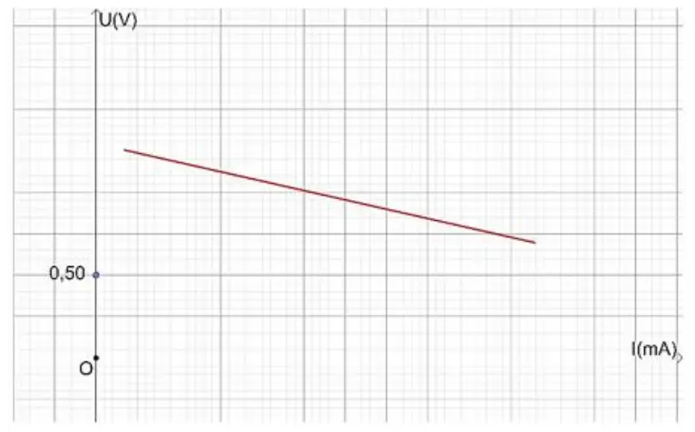{ loading=lazy }

??? success "Đáp án và lời giải"
    **Đáp án:** $1{,}30\,\mathrm V$.

    **Hướng dẫn giải:**
    Với $U=\xi-Ir$, tại $I=0$ ta có $U=\xi$. Kéo dài đường thẳng đến trục tung cho tung độ khoảng $1{,}30\,\mathrm V$.

    Vậy $\xi\approx1{,}30\,\mathrm V$.
#### Bài 14

<!-- source-id: BT-Chuong-IV-p131-q4-382 -->

Một học sinh thực hiện thí nghiệm đo suất điện động $\xi$ và điện trở trong $r$ của nguồn và vẽ được đồ thị mô tả mối quan hệ giữa $U-I$ như hình bên dưới. Hãy xác định giá trị điện trở trong $r$ ($\Omega$) của nguồn.

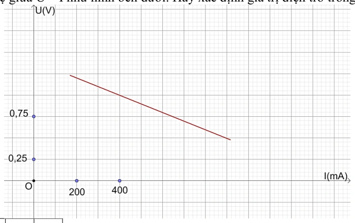{ loading=lazy }

??? success "Đáp án và lời giải"
    **Đáp án:** $1\,\Omega$.

    **Hướng dẫn giải:**
    Chọn hai điểm trên đường thẳng, chẳng hạn $M(440\,\mathrm{mA};0{,}95\,\mathrm V)$ và $N(740\,\mathrm{mA};0{,}65\,\mathrm V)$.

    Từ $U=\xi-Ir$:
    $r=\dfrac{U_M-U_N}{I_N-I_M}=\dfrac{0{,}95-0{,}65}{0{,}740-0{,}440}=1{,}0\,\Omega$.
### Nhận biết — Trắc nghiệm 4 lựa chọn

#### Bài 15

<!-- source-id: BT-Chuong-IV-p118-q6-354 -->

Ta không thể sử dụng đồng hồ đa năng để đo trực tiếp đại lượng nào sau đây?

A. Suất điện động của nguồn.

B. Hiệu điện thế giữa hai cực của đoạn mạch.

C. Điện trở trong của nguồn.

D. Dòng điện chạy trong đoạn mạch.

??? success "Đáp án và lời giải"
    **Đáp án:** C

    **Hướng dẫn giải:**
    Đồng hồ đa năng có thể đo trực tiếp hiệu điện thế, dòng điện và điện trở của phần tử thích hợp. Điện trở trong của nguồn phải được suy ra từ các phép đo $U,I$ (chẳng hạn qua quan hệ $U=\xi-Ir$), không đo trực tiếp theo cách bố trí thí nghiệm này. Chọn **C**.
#### Bài 16

<!-- source-id: BT-Chuong-IV-p119-q8-356 -->

Khi ta sử dụng đồng hồ điện đa năng hiện số như hình, để tiến hành đo hiệu điện thế giữa hai đầu mạch điện thì ta xoay núm vặn về chế độ đo hiệu điện thế DC và cần nối dây vào

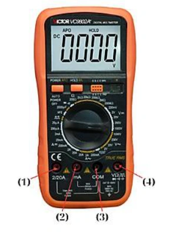{ loading=lazy }

A. (3) và (4).

B. (2) và (3).

C. (1) và (3).

D. (1) và (4).

??? success "Đáp án và lời giải"
    **Đáp án:** A

    **Hướng dẫn giải:**

    Khi đo hiệu điện thế một chiều, dây COM cắm vào cổng (3) và dây đo điện áp cắm vào cổng (4). Vì vậy chọn **A**.
#### Bài 17

<!-- source-id: BT-Chuong-IV-p119-q9-357 -->

Những dụng cụ chính để đo suất điện động $\xi$ và điện trở trong $r$ của nguồn trong phòng thí nghiệm là

A. pin điện hóa; điện trở có giá trị xác định; hai đồng hồ điện đa năng hiện số; khóa K; bảng lắp mạch điện và dây nối.

B. pin điện hóa; biến trở $100\,\Omega$; điện trở có giá trị xác định; hai đồng hồ điện đa năng hiện số; khóa K; bảng lắp mạch điện và dây nối.

C. pin điện hóa; biến trở $100\,\Omega$; điện trở có giá trị xác định; hai đồng hồ điện đa năng hiện số; khóa K và bảng lắp mạch điện.

D. pin điện hóa; biến trở $100\,\Omega$; điện trở có giá trị xác định; hai đồng hồ điện đa năng hiện số; khóa K; bảng từ và dây nối.

??? success "Đáp án và lời giải"
    **Đáp án:** B

    **Hướng dẫn giải:**
    Bộ thí nghiệm cần nguồn pin, biến trở để thay đổi tải, điện trở đã biết, hai đồng hồ đa năng để đo $U$ và $I$, khóa K, bảng lắp mạch và dây nối. Phương án **B** liệt kê đầy đủ các dụng cụ này.
#### Bài 18

<!-- source-id: BT-Chuong-IV-p119-q11-359 -->

Bên dưới là hình ảnh của một dụng cụ dùng trong thí nghiệm đo suất điện động $\xi$ và điện trở trong $r$. Tên của loại dụng cụ này là

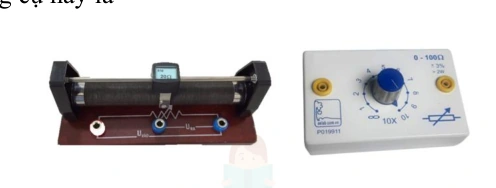{ loading=lazy }

A. biến trở.

B. đồng hồ điện đa năng hiện số.

C. nguồn điện.

D. máy biến áp.

??? success "Đáp án và lời giải"
    **Đáp án:** A

    **Hướng dẫn giải:**

    Hình nguồn cho thấy hai dạng **biến trở** dùng để thay đổi điện trở mạch ngoài trong thí nghiệm. Vì vậy chọn **A**.
#### Bài 19

<!-- source-id: BT-Chuong-IV-p120-q12-360 -->

Dụng cụ nào sau đây được sử dụng trong bộ thí nghiệm đo suất điện động $\xi$ và điện trở trong $r$?

Hình 1. Pin điện hóa. Hình 2. Máy phát tần số. Hình 3. Khóa K. Hình 4. Dây dẫn.

{ loading=lazy }

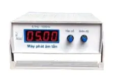{ loading=lazy }

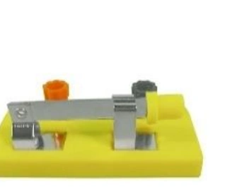{ loading=lazy }

{ loading=lazy }

A. Hình 1, 2, 3.

B. Hình 2, 3, 4.

C. Hình 1, 3, 4.

D. Hình 1, 2, 4.

??? success "Đáp án và lời giải"
    **Đáp án:** C

    **Hướng dẫn giải:**

    Bộ thí nghiệm sử dụng pin điện hóa, khóa K và dây dẫn; máy phát tần số không thuộc bộ dụng cụ này. Vì vậy chọn **C. Hình 1, 3, 4**.
#### Bài 20

<!-- source-id: BT-Chuong-IV-p120-q14-362 -->

Khi vẽ đồ thị mô tả $U-I$ trong bài thí nghiệm đo suất điện động $\xi$ và điện trở trong $r$ thì ta sẽ thu được đồ thị có dạng

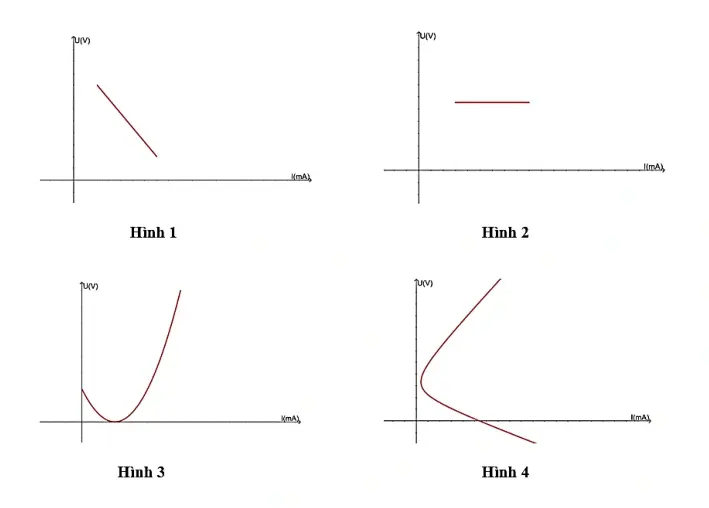{ loading=lazy }

A. Hình 1.

B. Hình 2.

C. Hình 3.

D. Hình 4.

??? success "Đáp án và lời giải"
    **Đáp án:** A

    **Hướng dẫn giải:**
    Đặc tuyến của nguồn là $U=\xi-Ir$, tức $U$ phụ thuộc tuyến tính vào $I$ với hệ số góc $-r<0$. Vì vậy đồ thị là đường thẳng giảm theo $I$, tương ứng **Hình 1**.
#### Bài 21

<!-- source-id: BT-Chuong-IV-p121-q16-364 -->

Hãy sắp xếp các bước thực hiện thí nghiệm đo suất điện động $\xi$ và điện trở trong $r$ của nguồn với dụng cụ được bố trí như sơ đồ.

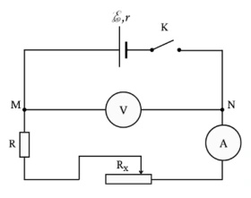{ loading=lazy }

(I). Ghi giá trị hiệu điện thế $U$ và cường độ dòng điện $I$ trên đồng hồ. Ngắt khóa K. Lặp lại 4 lần các bước đo với giá trị $R_x$ giảm dần.

(II). Chọn hai điểm A và B bất kì trên đồ thị với các giá trị $U,I$ tương ứng và xác định điện trở trong bằng công thức $r=\dfrac{U_A-U_B}{I_B-I_A}$.

(III). Điều chỉnh biến trở đến giá trị $R_x=100\,\Omega$. Đóng khóa K, bật đồng hồ đo hiệu điện thế và cường độ dòng điện.

(IV). Đánh dấu các điểm thực nghiệm lên hệ trục tọa độ $(U-I)$ và vẽ đường thẳng đi gần nhất các điểm thực nghiệm. Kéo dài đường thẳng cắt trục tung tại $U_0$ và xác định suất điện động $\xi$ của pin bằng $U_0$.

A. (I) – (III) – (IV) – (II).

B. (II) – (I) – (III) – (IV).

C. (III) – (I) – (IV) – (II).

D. (III) – (I) – (II) – (IV).

??? success "Đáp án và lời giải"
    **Đáp án:** C

    **Hướng dẫn giải:**
    Trước hết thiết lập giá trị biến trở và đóng mạch để đo (**III**), sau đó ghi số liệu và lặp phép đo (**I**). Có đủ số liệu mới dựng đồ thị và suy ra $\xi$ (**IV**), rồi chọn hai điểm trên đường thẳng để tính $r$ (**II**). Thứ tự đúng là **(III) – (I) – (IV) – (II)**.
#### Bài 22

<!-- source-id: BT-Chuong-IV-p121-q17-365 -->

Khóa K có tác dụng

A. hiển thị giá trị hiệu điện thế giữa hai đầu mạch điện.

B. hiển thị giá trị cường độ dòng điện chạy trong mạch.

C. tạo thành mạch điện kín hoặc mạch hở.

D. điều chỉnh điện trở tương đương trong mạch.

??? success "Đáp án và lời giải"
    **Đáp án:** C

    **Hướng dẫn giải:**
    Khóa K dùng để đóng hoặc ngắt đường dẫn dòng điện, tức chuyển mạch giữa trạng thái kín và hở. Chọn **C**.
#### Bài 23

<!-- source-id: BT-Chuong-IV-p123-q25-373 -->

Một học sinh thực hiện thí nghiệm đo suất điện động $\xi$ và điện trở trong $r$ của nguồn và vẽ được đồ thị mô tả mối quan hệ giữa $U-I$ như hình bên dưới. Hãy ước lượng giá trị suất điện động $\xi$ của nguồn.

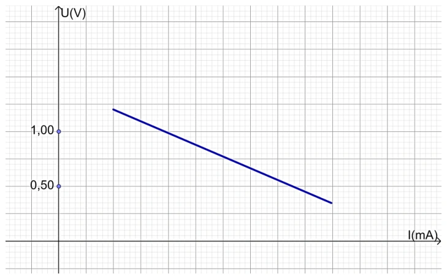{ loading=lazy }

A. $1{,}50\,\mathrm V$.

B. $1{,}25\,\mathrm V$.

C. $1{,}30\,\mathrm V$.

D. $1{,}40\,\mathrm V$.

??? success "Đáp án và lời giải"
    **Đáp án:** D

    **Hướng dẫn giải:**

    Kéo dài đường thẳng $U-I$ đến $I=0$. Tung độ tại giao điểm với trục $U$ chính là suất điện động của nguồn:
    $\xi\approx1{,}40\,\mathrm V.$
    Chọn **D**.
#### Bài 24

<!-- source-id: BT-Chuong-IV-p124-q26-374 -->

Một học sinh thực hiện thí nghiệm đo suất điện động $\xi$ và điện trở trong $r$ của nguồn và vẽ được đồ thị mô tả mối quan hệ giữa $U-I$ như hình bên dưới. Hãy xác định giá trị điện trở trong $r$ của nguồn.

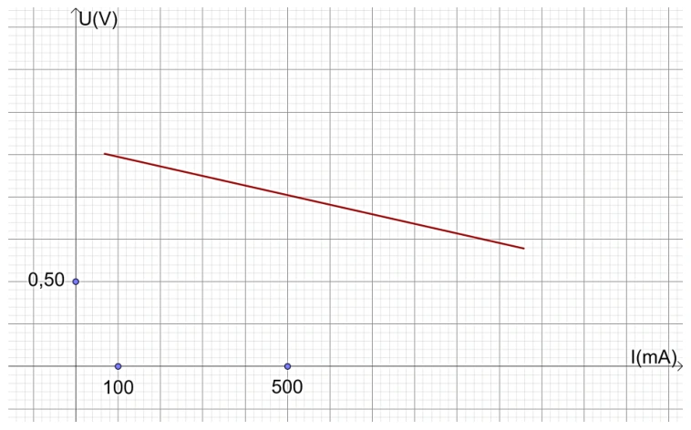{ loading=lazy }

A. $0{,}75\,\Omega$.

B. $0{,}56\,\Omega$.

C. $0{,}37\,\Omega$.

D. $0{,}45\,\Omega$.

??? success "Đáp án và lời giải"
    **Đáp án:** B

    **Hướng dẫn giải:**
    Chọn hai điểm $M(600\,\mathrm{mA};0{,}95\,\mathrm V)$ và $N(960\,\mathrm{mA};0{,}75\,\mathrm V)$ trên đường thẳng.

    $r=\dfrac{U_M-U_N}{I_N-I_M}=\dfrac{0{,}95-0{,}75}{0{,}960-0{,}600}\approx0{,}56\,\Omega$.

    Chọn **B**.
### Nhận biết — Đúng/Sai

#### Bài 25

<!-- source-id: BT-Chuong-IV-p126-q1-375 -->

Để thực hiện thí nghiệm đo suất điện động $\xi$ và điện trở trong $r$ của nguồn, dụng cụ thí nghiệm được bố trí như sơ đồ. Xác định nhận định sau đây đúng hay sai?

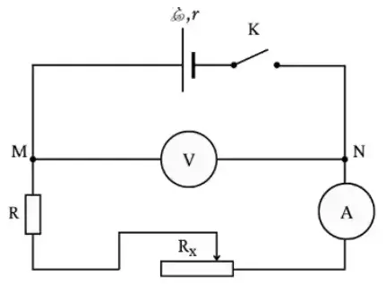{ loading=lazy }

a) Ta cần kiểm tra thiết bị, dụng cụ thí nghiệm trước khi tiến hành thí nghiệm nhằm đảm bảo các quy tắc an toàn trong phòng thí nghiệm.

b) Biến trở có công dụng điều chỉnh điện trở trong của nguồn.

c) Khi ta vẽ đồ thị mô tả mối liên hệ giữa $(U-I)$, đường thẳng kéo dài cắt trục tung tại một điểm mà tại đó $U_{MN}=\xi$.

d) Trong quá trình thực hiện thí nghiệm, việc lựa chọn thang đo trên đồng hồ đo điện đa năng không làm ảnh hưởng đến kết quả.

??? success "Đáp án và lời giải"
    **Đáp án:** a) Đúng; b) Sai; c) Đúng; d) Sai.

    **Hướng dẫn giải:**

    a) **Đúng.** Kiểm tra dụng cụ, dây nối, thang đo và sơ đồ trước khi đóng mạch là yêu cầu an toàn cơ bản.

    b) **Sai.** Biến trở dùng để thay đổi **điện trở mạch ngoài**, qua đó thay đổi dòng điện; nó không làm thay đổi điện trở trong $r$ của nguồn.

    c) **Đúng.** Đặc tuyến $U=\xi-Ir$ cắt trục tung tại $I=0$, khi đó $U=\xi$.

    d) **Sai.** Chọn thang đo không phù hợp có thể làm giảm độ phân giải, tăng sai số hoặc gây quá thang; vì vậy thang đo ảnh hưởng trực tiếp đến chất lượng kết quả.
#### Bài 26

<!-- source-id: BT-Chuong-IV-p126-q2-376 -->

Để thực hiện thí nghiệm đo suất điện động $\xi$ và điện trở trong $r$ của nguồn, dụng cụ thí nghiệm được bố trí như sơ đồ. Người ta sử dụng đồng hồ đo điện đa năng như hình bên dưới để thu nhận các giá trị hiệu điện thế, cường độ dòng điện trong mạch. Xác định nhận định sau đây đúng hay sai?

{ loading=lazy }

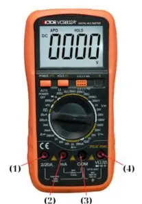{ loading=lazy }

a) Điện trở giúp kiểm soát cường độ dòng điện chạy trong mạch, tránh việc quá tải trong mạch.

b) Khi ta vẽ đồ thị mô tả mối liên hệ giữa $(U-I)$, nếu ta chọn hai điểm $A$, $B$ nằm trên đồ thị thì điện trở trong $r$ của nguồn được tính bằng công thức $r=\dfrac{U_A-U_B}{I_A-I_B}$.

c) Để thu được giá trị hiệu điện thế $U\ge0$ thì ta cần xoay núm của đồng hồ điện vặn về chế độ đo hiệu điện thế DC; chân (4) nối với điểm M, chân (3) nối với điểm N.

d) Để đo cường độ dòng điện có độ lớn khoảng mA, ta cần xoay núm của đồng hồ điện vặn về chế độ đo cường độ dòng điện DC và lựa chọn cổng số (2) và (3) trên đồng hồ điện đo cường độ dòng điện trong mạch.

??? success "Đáp án và lời giải"
    **Đáp án:** a) Đúng; b) Sai; c) Sai; d) Đúng.

    **Hướng dẫn giải:**

    a) **Đúng.** Biến trở/điện trở nối trong mạch giúp giới hạn dòng điện, tránh dòng quá lớn khi thay đổi tải.

    b) **Sai.** Từ phương trình đặc tuyến $U=\xi-Ir$, hệ số góc của đồ thị $U-I$ là $-r$. Với hai điểm $A,B$: $r=(U_A-U_B)/(I_B-I_A)$, không phải $(U_A-U_B)/(I_A-I_B)$.

    c) **Sai.** Khi đo điện áp một chiều cần chọn đúng chế độ DC và đúng cực tính: cổng COM nối phía điện thế thấp, cổng V nối phía điện thế cao. Cách nối chân nêu trong phát biểu bị đảo so với sơ đồ nguồn.

    d) **Đúng.** Khi dòng cỡ mA, chọn thang đo dòng một chiều phù hợp và dùng đúng các cổng COM/mA của đồng hồ theo hình.
#### Bài 27

<!-- source-id: BT-Chuong-IV-p127-q3-377 -->

Để thực hiện thí nghiệm đo suất điện động $\xi$ và điện trở trong $r$ của nguồn, dụng cụ thí nghiệm được bố trí như sơ đồ. Người ta sử dụng đồng hồ đo điện đa năng như hình bên dưới để thu nhận các giá trị hiệu điện thế, cường độ dòng điện trong mạch và thu được đồ thị biểu diễn mối quan hệ giữa $U-I$ như hình bên dưới.

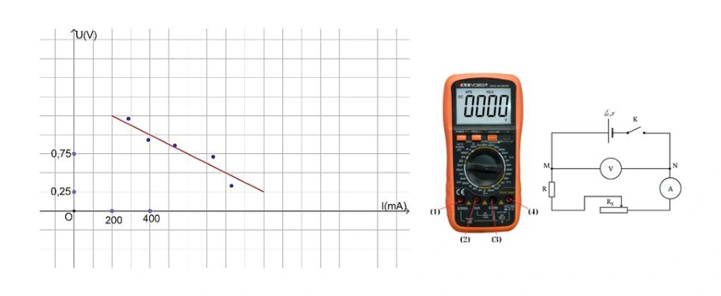{ loading=lazy }

a) Khi thực hiện thí nghiệm, hạn chế việc đóng mở khóa K để tránh gây sai số.

b) Một trong những nguyên nhân gây ra sai số là do trong dây dẫn và đồng hồ đo điện đa năng có điện trở.

c) Để thu được giá trị cường độ dòng điện (khoảng mA) $I\ge0$ thì ta cần xoay núm của đồng hồ điện vặn về chế độ đo cường độ dòng điện DC; chân (3) nối tiếp với biến trở, chân (2) nối tiếp với điểm N.

d) Suất điện động trong trường hợp này là $1{,}48\,\mathrm V$.

??? success "Đáp án và lời giải"
    **Đáp án:** a) Sai; b) Đúng; c) Đúng; d) Sai.

    **Hướng dẫn giải:**

    a) **Sai.** Khóa $K$ cần được thao tác đúng quy trình: chỉ đóng khi lấy số liệu và không để đóng quá lâu; không phải “hạn chế đóng mở” một cách chung chung để giảm sai số.

    b) **Đúng.** Điện trở dây nối và điện trở trong của dụng cụ đo làm mạch thực khác mô hình lí tưởng, là một nguồn sai số.

    c) **Đúng.** Với dòng cỡ mA, chọn thang dòng DC; theo sơ đồ cổng (2) là cổng mA và cổng (3) là COM, mắc nối tiếp đúng cực tính như phát biểu.

    d) **Sai.** Kéo dài đường thẳng $U-I$ đến $I=0$ cho tung độ khoảng $1{,}50\,\mathrm V$, nên $\xi\approx1{,}50\,\mathrm V$, không phải $1{,}48\,\mathrm V$.
#### Bài 28

<!-- source-id: BT-Chuong-IV-p128-q4-378 -->

Để thực hiện thí nghiệm đo suất điện động $\xi$ và điện trở trong $r$ của nguồn, dụng cụ thí nghiệm được bố trí như sơ đồ. Học sinh thu được đồ thị biểu diễn mối quan hệ giữa $U-I$ như hình bên dưới.

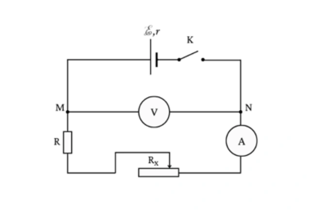{ loading=lazy }

a) Để hạn chế sai số, ta cần lựa chọn thang đo phù hợp trên đồng hồ đo điện đa năng.

b) Sau khi đã lắp xong mạch điện, học sinh tiến hành ngay việc lấy số liệu mà không cần thông qua giáo viên.

c) Suất điện động trong trường hợp này là $1{,}50\,\mathrm V$.

d) Điện trở trong trong trường hợp này là $1{,}25\,\Omega$.

??? success "Đáp án và lời giải"
    **Đáp án:** a) Đúng; b) Sai; c) Đúng; d) Đúng.

    **Hướng dẫn giải:**

    a) **Đúng.** Chọn thang đo phù hợp giúp tăng độ phân giải nhưng vẫn tránh quá thang, nhờ đó giảm sai số đọc.

    b) **Sai.** Sau khi lắp mạch phải kiểm tra lại sơ đồ, thang đo và cực tính; trong thí nghiệm ở trường cần báo giáo viên kiểm tra trước khi đóng mạch.

    c) **Đúng.** Trên đồ thị $U=\xi-Ir$, khi $I=0$ thì $U=\xi$. Giao điểm với trục $U$ là $1{,}50\,\mathrm V$, nên $\xi=1{,}50\,\mathrm V$.

    d) **Đúng.** Chọn $M(0{,}400\,\mathrm A;1{,}00\,\mathrm V)$ và $N(0{,}800\,\mathrm A;0{,}50\,\mathrm V)$: $r=(U_M-U_N)/(I_N-I_M)=0{,}50/0{,}40=1{,}25\,\Omega$.
### Thông hiểu — Trắc nghiệm 4 lựa chọn

#### Bài 29

<!-- source-id: BT-Chuong-IV-p118-q1-349 -->

Ghép cột A và cột B tương ứng để thể hiện các dụng cụ thí nghiệm trong bài thực hành đo suất điện động $\xi$ và điện trở trong $r$ của nguồn.

Cột A gồm các hình đánh số (1)–(7). Cột B gồm:

(a) Khóa K.  
(b) Điện trở đã biết giá trị.  
(c) Bảng lắp mạch điện.  
(d) Pin điện hóa.  
(e) Biến trở $100\,\Omega$.  
(f) Đồng hồ điện đa năng hiện số.  
(g) Dây nối.

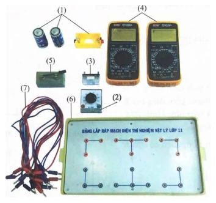{ loading=lazy }

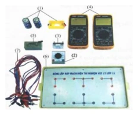{ loading=lazy }

A. (1) – (a); (2) – (f); (3) – (e); (4) – (c); (5) – (b); (6) – (d); (7) – (g).

B. (1) – (d); (2) – (e); (3) – (b); (4) – (f); (5) – (a); (6) – (c); (7) – (g).

C. (1) – (d); (2) – (b); (3) – (e); (4) – (f); (5) – (a); (6) – (c); (7) – (g).

D. (1) – (a); (2) – (d); (3) – (e); (4) – (f); (5) – (b); (6) – (c); (7) – (g).

??? success "Đáp án và lời giải"
    **Đáp án:** B

    **Hướng dẫn giải:**
    Quan sát các nhãn số trên hình: (1) pin điện hóa; (2) biến trở $100\,\Omega$; (3) điện trở đã biết; (4) đồng hồ đa năng; (5) khóa K; (6) bảng lắp mạch; (7) dây nối. Vì vậy ghép đúng là **(1)–(d), (2)–(e), (3)–(b), (4)–(f), (5)–(a), (6)–(c), (7)–(g)**.
### Vận dụng — Trắc nghiệm 4 lựa chọn

#### Bài 30

<!-- source-id: BT-Chuong-IV-p122-q21-369 -->

Khi thực hiện thí nghiệm đo suất điện động $\xi$ và điện trở trong $r$ của nguồn, điều chỉnh biến trở tại vị trí $100\,\Omega$, ta thu được các giá trị hiệu điện thế lần lượt là $1{,}42\,\mathrm V$; $1{,}41\,\mathrm V$; $1{,}39\,\mathrm V$. Giá trị trung bình của hiệu điện thế trong trường hợp này là

A. $1{,}42\,\mathrm V$.

B. $1{,}41\,\mathrm V$.

C. $1{,}40\,\mathrm V$.

D. $1{,}39\,\mathrm V$.

??? success "Đáp án và lời giải"
    **Đáp án:** B

    **Hướng dẫn giải:**
    $\overline U=\dfrac{1{,}42+1{,}41+1{,}39}{3}=1{,}406\ldots\,\mathrm V\approx1{,}41\,\mathrm V$.

    Chọn **B**.
#### Bài 31

<!-- source-id: BT-Chuong-IV-p122-q22-370 -->

Khi thực hiện thí nghiệm đo suất điện động $\xi$ và điện trở trong $r$ của nguồn, điều chỉnh biến trở tại vị trí $100\,\Omega$, ta thu được các kết quả của cường độ dòng điện lần lượt là $51\,\mathrm{mA}$, $54\,\mathrm{mA}$, $52\,\mathrm{mA}$. Bỏ qua sai số dụng cụ, sai số tuyệt đối trung bình của cường độ dòng điện trong trường hợp này là

A. $1{,}0\,\mathrm A$.

B. $1{,}0\,\mathrm{mA}$.

C. $52\,\mathrm{mA}$.

D. $52\,\mathrm A$.

??? success "Đáp án và lời giải"
    **Đáp án:** B

    **Hướng dẫn giải:**

    Giá trị trung bình:
    $\bar I=\frac{51+54+52}{3}=52\,\mathrm{mA}.$
    Sai số tuyệt đối trung bình:
    $\overline{\Delta I} =\frac{|52-51|+|52-54|+|52-52|}{3} =1{,}0\,\mathrm{mA}.$
    Chọn **B**.
#### Bài 32

<!-- source-id: BT-Chuong-IV-p122-q23-371 -->

Khi thực hiện thí nghiệm đo suất điện động $\xi$ và điện trở trong $r$ của nguồn, điều chỉnh biến trở tại vị trí $90\,\Omega$, ta thu được các giá trị hiệu điện thế lần lượt là $1{,}38\,\mathrm V$; $1{,}40\,\mathrm V$; $1{,}37\,\mathrm V$. Bỏ qua sai số của dụng cụ. Cách ghi kết quả thí nghiệm hiệu điện thế nào sau đây đúng với số chữ số có nghĩa?

A. $(1{,}38\pm0{,}01)\,\mathrm V$.

B. $(1{,}383\pm0{,}010)\,\mathrm V$.

C. $(1{,}4\pm0{,}1)\,\mathrm V$.

D. $(1{,}38\pm0{,}02)\,\mathrm V$.

??? success "Đáp án và lời giải"
    **Đáp án:** A

    **Hướng dẫn giải:**
    Giá trị trung bình $\overline U=(1{,}38+1{,}40+1{,}37)/3\approx1{,}383\,\mathrm V$.

    Sai số tuyệt đối trung bình xấp xỉ $0{,}011\,\mathrm V$, làm tròn thành $0{,}01\,\mathrm V$. Giá trị trung bình được ghi đến cùng hàng thập phân với sai số, nên
    $U=(1{,}38\pm0{,}01)\,\mathrm V$.

    Chọn **A**.
#### Bài 33

<!-- source-id: BT-Chuong-IV-p123-q24-372 -->

Thực hiện thí nghiệm đo suất điện động ξ và điện trở trong r của nguồn. Điều chỉnh biến
trở tại vị trí 80 Ω, ta thu được các kết quả của hiệu điện thế lần lượt là 1,35 V; 1,32 V; 1,31 V. Biết
độ chia nhỏ nhất (ĐCNN) của Volt kế là 0,01V, sai số của dụng cụ đo bằng một nửa ĐCNN. Cách
ghi kết quả thí nghiệm hiệu điện thế nào sau đây đúng với số chữ số có nghĩa?

A. (1,3 ± 0,1)V.

B. (1,327 ± 0,018) V.

C. (1,32 ± 0,01)V.

D. (1,33 ± 0,02) V.

??? success "Đáp án và lời giải"
    **Đáp án:** D. $(1{,}33\pm0{,}02)$ V.

    **Hướng dẫn giải:**
    Giá trị trung bình:
    $\overline U=(1{,}35+1{,}32+1{,}31)/3=1{,}3267$ V $\approx1{,}33$ V.

    Sai số ngẫu nhiên trung bình:
    $\overline{\Delta U}=(|1{,}35-1{,}3267|+|1{,}32-1{,}3267|+|1{,}31-1{,}3267|)/3\approx0{,}0156$ V.

    Sai số dụng cụ bằng nửa độ chia nhỏ nhất: $\Delta U_{dc}=0{,}005$ V. Do đó
    $\Delta U\approx0{,}0156+0{,}005=0{,}0206$ V $\approx0{,}02$ V.

    Vậy ghi kết quả $U=(1{,}33\pm0{,}02)$ V.

!!! warning "Đối chiếu nguồn"
    PDF nguồn làm tròn $\overline U=1{,}3267$ V thành $1{,}32$ V. Theo quy tắc làm tròn thông thường đến $0{,}01$ V, giá trị đúng là $1{,}33$ V; repository hiệu chỉnh phương án D tương ứng.
