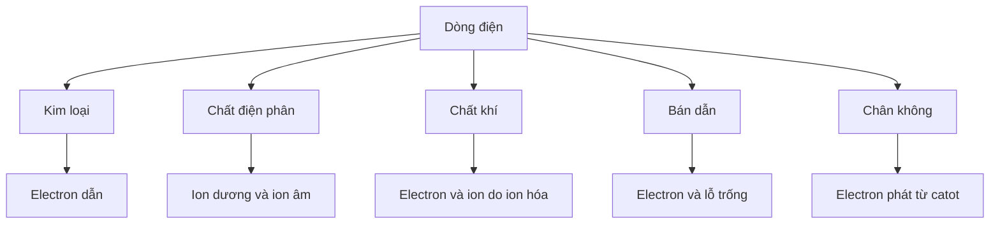

# Chương 5 — Dòng điện trong các môi trường

!!! note "Vị trí của chương"
    Đây là **phần mở rộng** để bao phủ hệ chuyên đề Vật lí 11 rộng hơn. Nội dung này từng nằm rõ trong chương trình Vật lí 11 trước đây và vẫn rất hữu ích để hiểu bản chất dòng điện. Nếu bạn chỉ học phần lõi GDPT 2018 theo lộ trình chính, có thể học Chương 5 sau Chương 4.

## Câu hỏi trung tâm

Ở Chương 4 ta dùng dòng điện như một đại lượng mạch. Chương này đi sâu hơn: **hạt nào thực sự chuyển động trong từng môi trường và cơ chế dẫn điện khác nhau ra sao?**

## Cấu trúc

1. [Dòng điện trong kim loại](01-current-in-metals.md)
2. [Dòng điện trong chất điện phân](02-electrolytes-faraday.md)
3. [Dòng điện trong chất khí](03-current-in-gases.md)
4. [Dòng điện trong chất bán dẫn](04-semiconductors.md)
5. [Dòng điện trong chân không và tế bào quang điện](05-vacuum-photoelectric-cell.md)
6. [Bài tập chương](exercises.md)
7. [Lời giải](solutions.md)
8. [Quiz](quiz.md)

## Bản đồ ý tưởng

## Học chương này như thế nào?

Không học thuộc từng môi trường như năm bài rời rạc. Với mỗi môi trường, luôn trả lời cùng bốn câu:

1. **Hạt tải điện là gì?**
2. **Hạt tải điện sinh ra/tồn tại bằng cách nào?**
3. **Điện trường làm chúng chuyển động ra sao?**
4. **Hiện tượng hoặc ứng dụng đặc trưng là gì?**

---

[← Chương 4](../04-current-circuits/index.md) | [Bài 1 →](01-current-in-metals.md)
