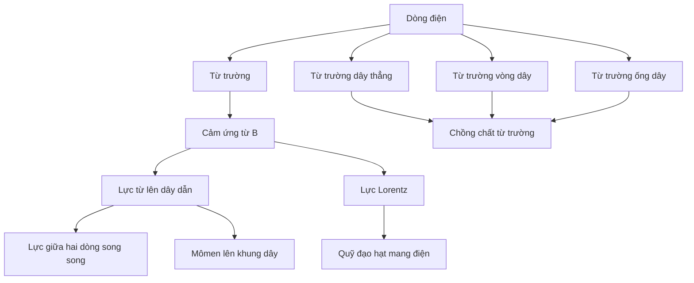

# Chương 6 — Từ trường và cảm ứng từ

!!! note "Vị trí của chương"
    Đây là **mạch mở rộng Vật lí 11** để bao phủ đầy đủ hệ chuyên đề rộng hơn. Nếu bạn chỉ theo phần lõi GDPT 2018 của giáo trình này, Chương 1–4 là tuyến chính; Chương 6 có thể học sau Chương 4 hoặc sau Chương 5.

Từ trường là bước tiếp theo rất tự nhiên sau dòng điện: điện tích đứng yên tạo điện trường, còn điện tích chuyển động và dòng điện còn tạo ra **từ trường**. Chương này không bắt đầu bằng việc nhồi công thức $B$; ta đi từ dấu hiệu nhận biết từ trường, cách mô tả bằng đường sức, đến lực từ, từ trường của các dòng điện quen thuộc rồi mới tổng hợp trường và giải bài chuyển động điện tích.

## Mục tiêu của chương

Sau chương này, người học cần:

- mô tả được từ trường và vectơ cảm ứng từ $\vec B$;
- dùng được quy tắc xác định chiều đường sức từ;
- tính lực từ lên đoạn dây có dòng điện trong từ trường đều;
- tính $B$ của dây thẳng dài, vòng dây tròn và ống dây dài trong mô hình chuẩn;
- tổng hợp nhiều từ trường bằng quy tắc vectơ;
- giải bài hai dòng điện song song;
- hiểu mômen lực tác dụng lên khung dây và nguyên lí động cơ điện ở mức phổ thông;
- dùng lực Lorentz để mô tả chuyển động của hạt mang điện trong từ trường đều.

## Cấu trúc

1. [Bài 1 — Từ trường, đường sức từ và cảm ứng từ](01-magnetic-field-field-lines.md)
2. [Bài 2 — Lực từ tác dụng lên dòng điện](02-magnetic-force-current-wire.md)
3. [Bài 3 — Từ trường của dòng điện và nguyên lí chồng chất](03-fields-of-currents-superposition.md)
4. [Bài 4 — Hai dòng điện song song, khung dây và mômen từ](04-parallel-currents-current-loop.md)
5. [Bài 5 — Lực Lorentz và chuyển động của hạt mang điện](05-lorentz-force-charged-particle.md)
6. [Bài tập chương](exercises.md)
7. [Lời giải chi tiết](solutions.md)
8. [Quiz cuối chương](quiz.md)

## Bản đồ ý tưởng

## Prerequisite

- vectơ, góc và tích lượng giác cơ bản;
- dòng điện và chiều dòng điện quy ước;
- chuyển động tròn đều và lực hướng tâm;
- điện tích và dấu của điện tích.

## Chiến lược học

Có ba câu hỏi phải tách rõ:

1. **Nguồn nào tạo $\vec B$?** Dòng điện thẳng, vòng dây, ống dây hay nhiều nguồn.
2. **$\vec B$ hướng thế nào?** Dùng quy tắc nắm tay phải hoặc quy tắc hình học thích hợp.
3. **$\vec B$ gây tác dụng gì?** Lực lên dây có dòng hoặc lực Lorentz lên hạt mang điện.

Nhiều bài sai không phải vì công thức khó, mà vì trộn ba câu trên thành một. Học sinh con người rất thích tìm số trước rồi mới nghĩ hướng sau, và vật lí thường đáp lại bằng một dấu trừ đầy ác ý.

---

[← Chương 5](../05-current-media/index.md) | [Bài 1 →](01-magnetic-field-field-lines.md)
