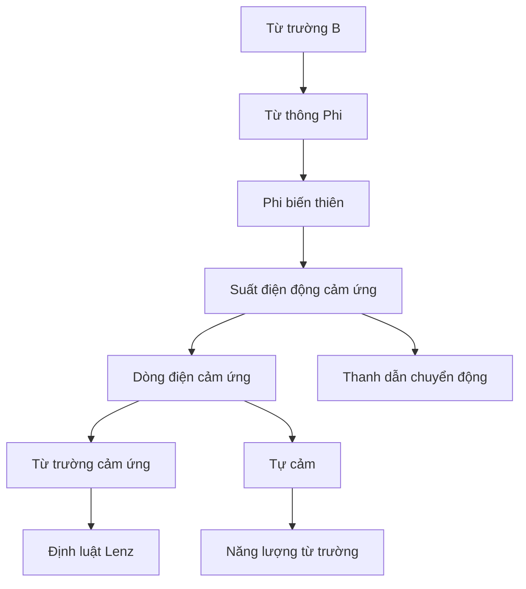

# Chương 7 — Cảm ứng điện từ

!!! note "Vị trí của chương"
    Đây là **mạch mở rộng** của Vật lí 11, nối trực tiếp từ Chương 6. Nếu chỉ theo lõi GDPT 2018 hiện hành của Education Hub, bạn có thể xem chương này như chuyên đề bổ sung; nếu học theo hệ chuyên đề Vật lí 11 rộng hơn thì đây là một chương nền quan trọng.

Chương 6 trả lời câu hỏi: dòng điện tạo từ trường như thế nào? Chương này đi theo chiều ngược thú vị hơn: **khi từ thông qua một mạch thay đổi, có thể xuất hiện suất điện động và dòng điện cảm ứng**.

## Cấu trúc

1. [Bài 1 — Từ thông và hiện tượng cảm ứng điện từ](01-magnetic-flux-induction.md)
2. [Bài 2 — Định luật Faraday và định luật Lenz](02-lenz-faraday-law.md)
3. [Bài 3 — Suất điện động cảm ứng do chuyển động](03-motional-emf.md)
4. [Bài 4 — Tự cảm và năng lượng từ trường](04-self-induction-energy.md)
5. [Bài tập chương](exercises.md)
6. [Lời giải chi tiết](solutions.md)
7. [Quiz cuối chương](quiz.md)

## Mạch tư duy

## Prerequisite

- cảm ứng từ và đường sức từ;
- vectơ pháp tuyến mặt phẳng;
- diện tích và lượng giác;
- định luật Ohm và công suất;
- bảo toàn năng lượng.

## Hai câu hỏi trung tâm

1. **Từ thông thay đổi bao nhiêu và nhanh đến mức nào?** → độ lớn suất điện động.
2. **Dòng cảm ứng phải chống lại sự biến đổi nào?** → chiều theo Lenz.

Nếu tách được hai câu này, phần cảm ứng điện từ bớt đáng sợ một cách đáng ngờ.

---

[← Chương 6](../06-magnetism/index.md) | [Bài 1 →](01-magnetic-flux-induction.md)
