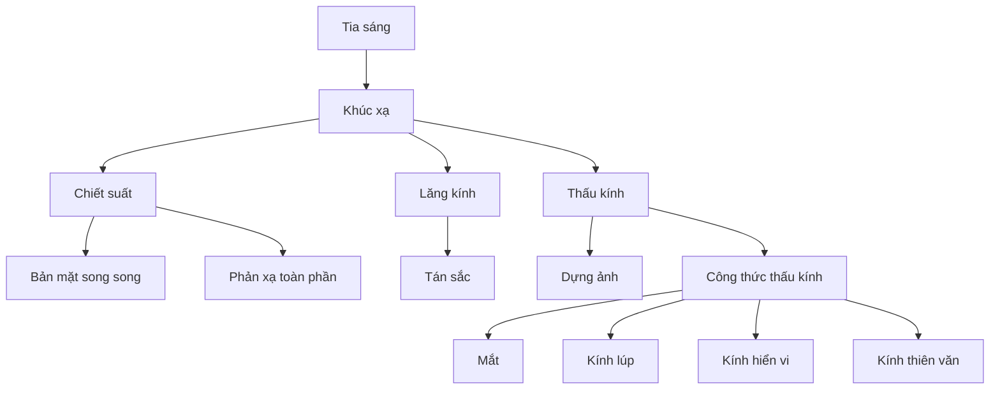

# Chương 8 — Khúc xạ ánh sáng và quang hình

!!! note "Vị trí của chương"
    Đây là **mạch mở rộng/tương thích chương trình Vật lí 11 rộng hơn**. Nó được tách thành chương riêng để không làm rối tuyến lõi GDPT 2018 của Education Hub. Người học có thể vào chương này sau khi đã chắc lượng giác và hình học cơ bản; không bắt buộc phải học Chương 6–7 trước.

Quang hình nghiên cứu ánh sáng bằng mô hình tia sáng. Mô hình này đặc biệt hiệu quả khi kích thước vật cản, thấu kính và hệ quang lớn hơn nhiều so với bước sóng ánh sáng. Chương đi từ khúc xạ tại một mặt phân cách đến phản xạ toàn phần, bản mặt song song, lăng kính, thấu kính, mắt và các dụng cụ quang.

## Cấu trúc

1. [Bài 1 — Khúc xạ ánh sáng và chiết suất](01-refraction-refractive-index.md)
2. [Bài 2 — Bản mặt song song và độ sâu biểu kiến](02-parallel-slab-apparent-depth.md)
3. [Bài 3 — Phản xạ toàn phần](03-total-internal-reflection.md)
4. [Bài 4 — Lăng kính và tán sắc](04-prism-dispersion.md)
5. [Bài 5 — Thấu kính mỏng và dựng ảnh](05-thin-lenses-image-construction.md)
6. [Bài 6 — Phương pháp bài toán thấu kính](06-lens-problem-methods.md)
7. [Bài 7 — Mắt và các tật của mắt](07-eye-and-defects.md)
8. [Bài 8 — Kính lúp, kính hiển vi và kính thiên văn](08-optical-instruments.md)
9. [Bài tập chương](exercises.md)
10. [Lời giải chi tiết](solutions.md)
11. [Quiz cuối chương](quiz.md)

## Bản đồ ý tưởng

## Cách học

Mỗi bài quang hình nên làm theo bốn việc:

1. vẽ pháp tuyến và chiều truyền ánh sáng;
2. dự đoán tia lệch **về** hay **ra xa** pháp tuyến;
3. dùng công thức;
4. kiểm tra hình học của kết quả.

Nếu số cho tia khúc xạ nằm sai phía pháp tuyến mà bạn vẫn vui vẻ bấm máy tiếp, toán học sẽ không tự gọi cảnh sát giúp bạn.

---

[← Chương 7](../07-electromagnetic-induction/index.md) | [Bài 1 →](01-refraction-refractive-index.md)
