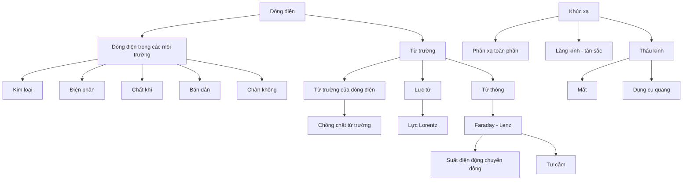

# Bản đồ kiến thức Vật lí 11

## Tổng thể

```text
graph TD
    A[Dao động điều hòa] --> B[Li độ - vận tốc - gia tốc]
    B --> C[Pha và đường tròn lượng giác]
    C --> D[Con lắc lò xo]
    C --> E[Con lắc đơn]
    D --> F[Năng lượng dao động]
    E --> F
    F --> G[Dao động tắt dần - cưỡng bức - cộng hưởng]

    C --> H[Sóng cơ]
    H --> I[Phương trình sóng]
    I --> J[Giao thoa sóng]
    J --> K[Sóng dừng]
    H --> L[Sóng âm]
    H --> M[Sóng điện từ]
    J --> N[Giao thoa ánh sáng]

    O[Điện tích và thuyết electron] --> P[Coulomb]
    P --> Q[Điện trường]
    Q --> R[Chồng chất - cân bằng]
    Q --> S[Công lực điện]
    S --> T[Điện thế - hiệu điện thế]
    T --> U[Tụ điện]
    Q --> V[Chuyển động điện tích]
    U --> W[Tụ điện nâng cao]

    O --> X[Dòng điện]
    X --> Y[Điện trở - Ohm]
    Y --> Z[Nguồn điện]
    Z --> AA[Ohm toàn mạch]
    Y --> AB[Năng lượng - công suất]
    AA --> AC[Ghép nguồn]
    Y --> AD[Đọc và biến đổi mạch]
    AC --> AE[Kirchhoff - xếp chồng - nguồn tương đương]
    U --> AF[Mạch RC xác lập]
    AE --> AF
```

## Nhánh mở rộng



Các nhánh này được đặt sau tuyến lõi để **mở rộng độ bao phủ** chứ không thay đổi dependency của Chương 1–4.

## Các dependency quan trọng

### Dao động → Sóng
Không nên học giao thoa khi chưa hiểu pha. Phương trình sóng chính là dao động điều hòa có pha thay đổi theo vị trí.

### Coulomb → Điện trường
Coulomb mô tả lực giữa điện tích điểm; điện trường tách “nguồn tạo trường” khỏi “điện tích chịu lực”.

### Điện trường → Điện thế
$\vec E$ mô tả phương diện lực; V mô tả phương diện năng lượng. Hai khái niệm bổ sung nhau, không thay thế nhau.

### Tụ điện → Mạch RC
Muốn giải RC xác lập và chuyển mạch phải chắc $Q=CU$, bảo toàn điện tích vùng cô lập và năng lượng của tụ.

### Điện trở → Nguồn → Toàn mạch
Định luật Ohm đoạn mạch là nền để hiểu sụt áp điện trở trong và định luật Ohm toàn mạch.

## Cầu nối phương pháp

- **Pha/đường tròn** dùng lại trong sóng và giao thoa.
- **Vectơ** dùng trong lực Coulomb và điện trường.
- **Bảo toàn năng lượng** dùng trong dao động, điện trường và mạch RC.
- **Bảo toàn điện tích** dùng từ nhiễm điện đến nút Kirchhoff và mạch tụ.
- **Đọc đồ thị** xuất hiện ở dao động, sóng, đặc tuyến V–A và thực nghiệm nguồn.


## Cầu nối của phần mở rộng

- **Dòng điện → từ trường:** dòng điện vừa là dòng điện tích có hướng vừa là nguồn tạo từ trường.
- **Từ trường → cảm ứng điện từ:** cần hiểu $\vec B$ và pháp tuyến trước khi học từ thông.
- **Faraday ↔ bảo toàn năng lượng:** Lenz giải thích vì sao hiệu ứng cảm ứng chống biến đổi gây ra nó.
- **Sóng ánh sáng → quang hình:** quang hình là mô hình tia hiệu quả khi kích thước hệ lớn hơn nhiều bước sóng; nhiễu xạ là giới hạn tự nhiên của mô hình tia.
- **Thấu kính → mắt/dụng cụ quang:** cùng công thức tạo ảnh được dùng lại, nhưng mục tiêu chuyển từ vị trí ảnh sang góc trông và bội giác.
